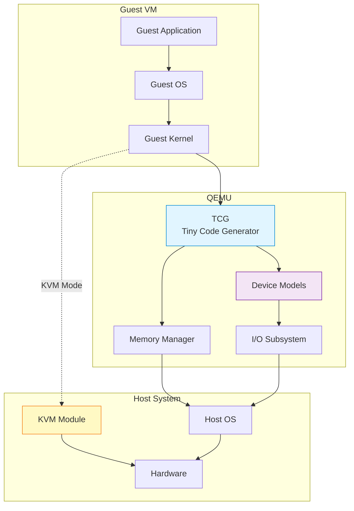

## 들어가며

현대 소프트웨어 개발에서 **가상화(Virtualization)**는 필수불가결한 기술입니다. 개발 환경 구축, 테스트, 보안 격리, 클라우드 인프라 등 다양한 분야에서 활용되고 있죠. 그 중심에 **QEMU**가 있습니다.

## QEMU란?

**QEMU**(Quick Emulator)는 **오픈소스 머신 에뮬레이터이자 가상화 도구**입니다. 프랑스의 개발자 Fabrice Bellard가 2003년에 처음 개발했으며, 현재는 활발한 커뮤니티에 의해 유지보수되고 있습니다.

### 핵심 특징

**1. 다중 아키텍처 지원**
- x86, x86-64, ARM, MIPS, PowerPC, SPARC 등
- 크로스 플랫폼 개발에 최적화

**2. 두 가지 동작 모드**
- **System Mode**: 전체 시스템 에뮬레이션
- **User Mode**: 단일 프로그램 실행 (Linux only)

**3. 하드웨어 가속 지원**
- KVM (Kernel-based Virtual Machine)과 통합
- 네이티브에 가까운 성능

**4. 다양한 디바이스 에뮬레이션**
- 네트워크 카드, 그래픽 카드, 디스크 컨트롤러 등
- 커스텀 디바이스 개발 가능

## QEMU vs 다른 가상화 솔루션

| 특징 | QEMU | VirtualBox | VMware | Docker |
|------|------|------------|---------|---------|
| 라이선스 | GPL (오픈소스) | GPL/PUEL | 상용 | Apache 2.0 |
| 타입 | Type 2 Hypervisor | Type 2 | Type 1/2 | 컨테이너 |
| 크로스 아키텍처 | ✅ 강력 | ❌ 제한적 | ❌ 제한적 | ❌ 불가 |
| 성능 (KVM 사용시) | ⭐⭐⭐⭐⭐ | ⭐⭐⭐⭐ | ⭐⭐⭐⭐⭐ | ⭐⭐⭐⭐⭐ |
| GUI | ❌ CLI 기반 | ✅ 있음 | ✅ 있음 | ❌ CLI 기반 |
| 임베디드 개발 | ✅ 최적 | ❌ 부적합 | ❌ 부적합 | ❌ 부적합 |

## QEMU 아키텍처

QEMU의 핵심 구조를 이해하는 것은 효과적인 활용의 첫걸음입니다.



### 아키텍처 구성 요소

**1. TCG (Tiny Code Generator)**
- 게스트 명령어를 호스트 명령어로 변환
- 동적 바이너리 변환(Dynamic Binary Translation)
- 크로스 아키텍처 에뮬레이션의 핵심

**2. Device Models**
- 가상 하드웨어 디바이스 구현
- 네트워크 카드, 디스크, USB 등
- QEMU Object Model (QOM) 기반

**3. Memory Manager**
- AddressSpace: 게스트 메모리 주소 공간
- MemoryRegion: 메모리 영역 추상화
- DMA (Direct Memory Access) 지원

**4. KVM Integration**
- 하드웨어 가상화 확장 활용 (Intel VT-x, AMD-V)
- TCG 대신 CPU 네이티브 실행
- 10배 이상의 성능 향상

## QEMU의 주요 사용 사례

### 1. 임베디드 시스템 개발
```bash
# ARM Cortex-A9 보드 에뮬레이션
qemu-system-arm -M vexpress-a9 -kernel zImage -dtb vexpress-v2p-ca9.dtb
```

실제 하드웨어 없이 ARM 리눅스 커널 개발 가능

### 2. 크로스 컴파일 테스트
```bash
# x86 호스트에서 ARM 바이너리 실행
qemu-arm ./my-arm-program
```

다양한 아키텍처 타겟 빌드 검증

### 3. 보안 연구 및 분석
- 격리된 환경에서 멀웨어 분석
- 커널 익스플로잇 테스트
- 시스템 콜 트레이싱

### 4. 클라우드 인프라
- OpenStack의 기본 하이퍼바이저
- KVM + QEMU 조합으로 고성능 VM
- 라이브 마이그레이션 지원

## QEMU의 장단점

### 장점 ✅
- **완전한 오픈소스**: 소스코드 분석 및 수정 가능
- **다양한 아키텍처 지원**: ARM, x86, MIPS 등
- **유연성**: 디바이스 커스터마이징 용이
- **활발한 커뮤니티**: 지속적인 업데이트
- **KVM과의 시너지**: 하드웨어 가속 시 고성능

### 단점 ❌
- **CLI 기반**: 초보자에게 진입장벽
- **복잡한 옵션**: 수백 개의 설정 플래그
- **GUI 부재**: 별도 프론트엔드 필요 (virt-manager 등)
- **문서 산재**: 공식 문서가 다소 부족

## 다음 단계

이제 QEMU의 기본 개념을 이해했다면, 다음 글에서는:
- QEMU 설치 방법 (Linux/macOS/Windows)
- 첫 가상 머신 생성
- 기본 명령어와 옵션

을 다룰 예정입니다.

## 참고 자료

- [QEMU 공식 문서](https://www.qemu.org/docs/master/)
- [QEMU GitHub](https://github.com/qemu/qemu)
- [KVM Documentation](https://www.linux-kvm.org/page/Documents)

---

**시리즈 목차**
1. **QEMU란 무엇인가 - 가상화의 기본 개념** ← 현재 글
2. QEMU vs VirtualBox vs VMware - 가상화 솔루션 비교 (다음 글)
3. QEMU 설치하기 (Linux/macOS/Windows)

> 💡 **Tip**: QEMU를 처음 접한다면, VirtualBox나 VMware와 달리 CLI 기반이라는 점을 기억하세요. 하지만 그만큼 강력한 제어와 자동화가 가능합니다!
