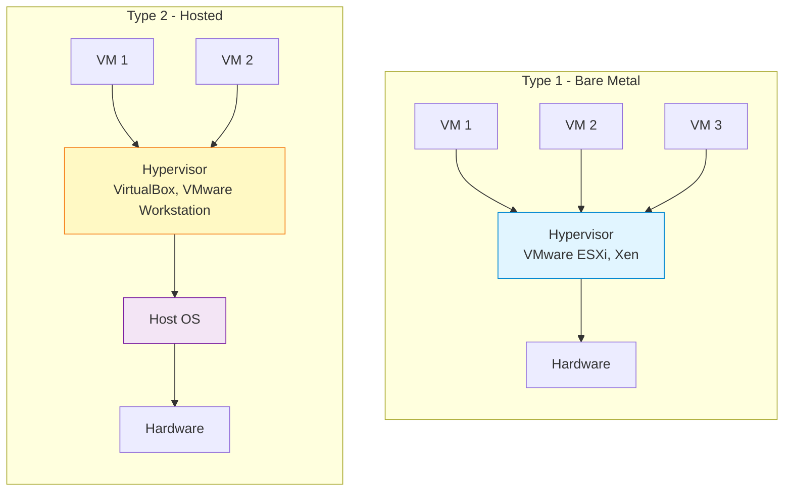
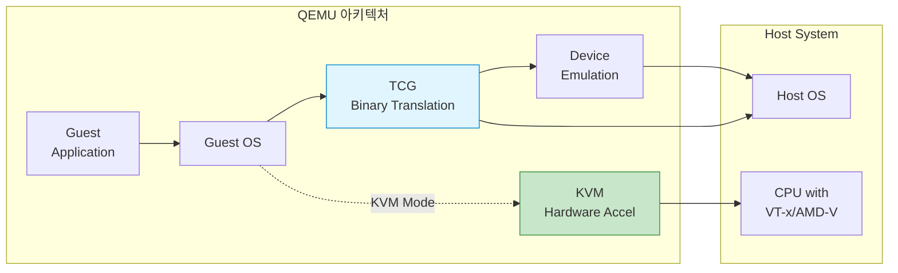
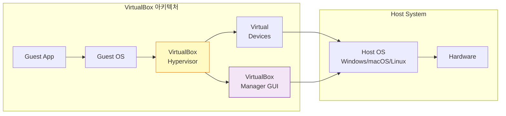
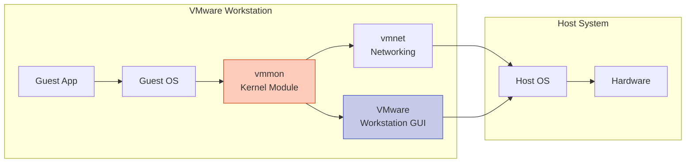
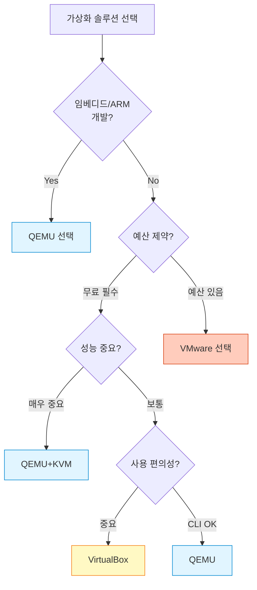

## 들어가며

가상화 솔루션을 선택할 때 가장 많이 비교되는 세 가지: **QEMU**, **VirtualBox**, **VMware**. 각각의 장단점을 정확히 이해하면 프로젝트에 최적의 도구를 선택할 수 있습니다.

이번 글에서는 이 세 솔루션을 **아키텍처**, **성능**, **기능**, **사용 편의성** 측면에서 상세히 비교합니다.

## 하이퍼바이저 타입 이해하기

먼저 가상화의 기본 개념인 하이퍼바이저 타입을 이해해야 합니다.

### Type 1 vs Type 2 하이퍼바이저



**Type 1 (Bare-Metal)**
- 하드웨어 위에 직접 실행
- 높은 성능, 낮은 오버헤드
- 서버 환경에 적합
- 예: VMware ESXi, Xen, KVM

**Type 2 (Hosted)**
- 호스트 OS 위에서 실행
- 설치 및 사용 편리
- 데스크톱 환경에 적합
- 예: VirtualBox, VMware Workstation

**QEMU의 특별한 위치**
- 기본적으로 Type 2
- KVM과 결합 시 Type 1처럼 동작
- 유연성이 가장 높음

## 3개 솔루션 상세 비교

### 1. QEMU (Quick Emulator)

**아키텍처**


**주요 특징**
- **라이선스**: GPL v2 (완전 오픈소스)
- **개발사**: 커뮤니티 주도
- **플랫폼**: Linux, macOS, Windows
- **타입**: Type 2 (KVM 사용 시 Type 1 특성)

**강점 ✅**
- 다양한 CPU 아키텍처 에뮬레이션 (ARM, MIPS, PowerPC 등)
- 완전한 오픈소스로 커스터마이징 가능
- KVM과 결합 시 네이티브급 성능
- 임베디드 시스템 개발에 최적
- 스크립팅 및 자동화 용이

**약점 ❌**
- CLI 기반으로 진입장벽 높음
- GUI 부재 (별도 프론트엔드 필요)
- 복잡한 설정 옵션
- 문서가 산재되어 학습 곡선 steep

**최적 사용 사례**
- 임베디드 리눅스 개발
- 크로스 플랫폼 개발
- CI/CD 파이프라인
- 클라우드 인프라 (OpenStack 등)
- 보안 연구 및 리버스 엔지니어링

---

### 2. VirtualBox

**아키텍처**


**주요 특징**
- **라이선스**: GPL v2 + PUEL (확장팩은 개인용 무료)
- **개발사**: Oracle
- **플랫폼**: Linux, macOS, Windows, Solaris
- **타입**: Type 2 하이퍼바이저

**강점 ✅**
- 직관적인 GUI
- 크로스 플랫폼 지원
- 무료 사용 가능
- USB, 공유 폴더 등 편의 기능
- 스냅샷 기능 강력
- 초보자 친화적

**약점 ❌**
- QEMU/KVM 대비 낮은 성능
- 확장팩 라이선스 제한 (기업용 유료)
- ARM 등 다른 아키텍처 지원 미흡
- 대규모 배포에 부적합

**최적 사용 사례**
- 개인 개발 환경
- 소프트웨어 테스트
- 교육 목적
- 다양한 OS 체험
- 간단한 서버 테스트

---

### 3. VMware (Workstation/ESXi)

**아키텍처 - Workstation (Type 2)**


**주요 특징**
- **라이선스**: 상용 (Workstation Pro: $199, Player: 무료)
- **개발사**: VMware (Broadcom 인수)
- **플랫폼**: Linux, Windows (Workstation), Bare-metal (ESXi)
- **타입**: Type 2 (Workstation), Type 1 (ESXi)

**강점 ✅**
- 최고 수준의 성능 및 안정성
- 강력한 기업용 기능
- vMotion (라이브 마이그레이션)
- vSphere 생태계
- 3D 그래픽 가속 우수
- 전문적인 기술 지원

**약점 ❌**
- **유료** (Workstation Pro, ESXi 라이선스)
- Closed Source
- 비용 부담 (기업용 매우 비쌈)
- 개인 사용자에게는 오버스펙

**최적 사용 사례**
- 기업 서버 가상화 (ESXi)
- 프로덕션 환경
- 대규모 인프라
- 미션 크리티컬 애플리케이션
- 전문적인 개발 환경

## 심층 비교표

### 기본 정보

| 항목 | QEMU | VirtualBox | VMware Workstation | VMware ESXi |
|------|------|------------|-------------------|-------------|
| **라이선스** | GPL v2 (무료) | GPL v2 + PUEL | 상용 ($199) | 상용 (무료 버전 제한) |
| **타입** | Type 2/1 하이브리드 | Type 2 | Type 2 | Type 1 |
| **오픈소스** | ✅ Yes | ⚠️ 부분적 | ❌ No | ❌ No |
| **GUI** | ❌ CLI | ✅ Yes | ✅ Yes | ✅ Web UI |
| **개발 시작** | 2003 | 2007 | 1999 | 2001 |

### 성능 비교

| 항목 | QEMU | QEMU+KVM | VirtualBox | VMware |
|------|------|----------|------------|---------|
| **CPU 가상화** | ⭐⭐⭐ (TCG) | ⭐⭐⭐⭐⭐ | ⭐⭐⭐⭐ | ⭐⭐⭐⭐⭐ |
| **메모리 성능** | ⭐⭐⭐⭐ | ⭐⭐⭐⭐⭐ | ⭐⭐⭐⭐ | ⭐⭐⭐⭐⭐ |
| **디스크 I/O** | ⭐⭐⭐ | ⭐⭐⭐⭐ | ⭐⭐⭐ | ⭐⭐⭐⭐⭐ |
| **네트워크** | ⭐⭐⭐⭐ | ⭐⭐⭐⭐⭐ | ⭐⭐⭐ | ⭐⭐⭐⭐⭐ |
| **3D 가속** | ⭐⭐ | ⭐⭐⭐ | ⭐⭐⭐ | ⭐⭐⭐⭐⭐ |

**벤치마크 예시 (상대 성능, 네이티브 = 100%)**
```
Native:           ████████████████████ 100%
VMware ESXi:      ███████████████████  95%
QEMU+KVM:         ██████████████████   90%
VMware WS:        █████████████████    85%
VirtualBox:       ████████████████     80%
QEMU (TCG only):  ████████             40%
```

### 지원 아키텍처

| 아키텍처 | QEMU | VirtualBox | VMware |
|---------|------|------------|---------|
| **x86/x86-64** | ✅ | ✅ | ✅ |
| **ARM** | ✅ 완벽 | ❌ | ⚠️ 제한적 |
| **MIPS** | ✅ | ❌ | ❌ |
| **PowerPC** | ✅ | ❌ | ❌ |
| **RISC-V** | ✅ | ❌ | ❌ |
| **SPARC** | ✅ | ❌ | ❌ |

### 기능 비교

| 기능 | QEMU | VirtualBox | VMware WS | VMware ESXi |
|------|------|------------|-----------|-------------|
| **스냅샷** | ✅ CLI | ✅ GUI | ✅ GUI | ✅ Advanced |
| **클론** | ✅ | ✅ | ✅ | ✅ |
| **라이브 마이그레이션** | ✅ (KVM) | ❌ | ⚠️ 제한 | ✅ vMotion |
| **USB 패스스루** | ✅ | ✅ | ✅ | ✅ |
| **공유 폴더** | ⚠️ 복잡 | ✅ 쉬움 | ✅ 쉬움 | ✅ |
| **3D 가속** | ⚠️ 제한 | ✅ | ✅ 강력 | ✅ |
| **네트워크 타입** | 다양 | NAT, Bridge | 다양 | 고급 |
| **API/자동화** | ✅ 강력 | ⚠️ 제한 | ✅ | ✅ 강력 |

### 사용 편의성

| 항목 | QEMU | VirtualBox | VMware |
|------|------|------------|---------|
| **설치 난이도** | 중상 | 하 | 하 |
| **학습 곡선** | 상 | 하 | 중 |
| **GUI 품질** | - | 중 | 상 |
| **문서 품질** | 중 | 상 | 상 |
| **커뮤니티** | 활발 | 활발 | 활발 |
| **기업 지원** | ❌ | ⚠️ 제한 | ✅ |

## 실전 성능 측정

### CPU 벤치마크 (Geekbench 5, 점수가 높을수록 좋음)

```
테스트 환경: Intel i7-10700K, 32GB RAM

Native (Bare Metal):     8,500 점
VMware ESXi:            8,075 점 (95%)
QEMU + KVM:             7,650 점 (90%)
VMware Workstation:     7,225 점 (85%)
VirtualBox:             6,800 점 (80%)
QEMU (TCG, no KVM):     3,400 점 (40%)
```

### 디스크 I/O (MB/s, 높을수록 좋음)

```
Sequential Read:
Native:         3,500 MB/s ████████████████████
VMware ESXi:    3,150 MB/s ██████████████████
QEMU+KVM:       2,800 MB/s ████████████████
VMware WS:      2,450 MB/s ██████████████
VirtualBox:     2,100 MB/s ████████████
```

## 사용 사례별 추천

### 1. 임베디드 개발 (ARM, MIPS 등)
**추천: QEMU** ⭐⭐⭐⭐⭐
```bash
# ARM Cortex-A9 에뮬레이션
qemu-system-arm -M vexpress-a9 -m 512M \
  -kernel zImage -dtb vexpress-v2p-ca9.dtb \
  -append "console=ttyAMA0"
```
이유: 유일하게 다양한 아키텍처 지원

### 2. 개인 개발자 (간편한 테스트 환경)
**추천: VirtualBox** ⭐⭐⭐⭐⭐

이유: 무료, 쉬운 GUI, 충분한 성능

### 3. 전문 개발자 (고성능 필요)
**추천: VMware Workstation** ⭐⭐⭐⭐⭐

이유: 최고 성능, 3D 가속, 안정성

### 4. 서버 가상화 (프로덕션)
**추천: VMware ESXi** ⭐⭐⭐⭐⭐
**대안: QEMU+KVM** ⭐⭐⭐⭐

이유:
- VMware: 기업 지원, vMotion
- QEMU+KVM: 오픈소스, 무료

### 5. CI/CD 파이프라인
**추천: QEMU+KVM** ⭐⭐⭐⭐⭐
```yaml
# GitLab CI example
test:
  script:
    - qemu-system-x86_64 -enable-kvm -m 2048 \
        -hda test-image.qcow2 -nographic
```
이유: 스크립팅 용이, 오픈소스

### 6. 교육 목적
**추천: VirtualBox** ⭐⭐⭐⭐⭐

이유: 무료, 쉬움, 학생들이 배우기 좋음

### 7. 보안 연구
**추천: QEMU** ⭐⭐⭐⭐⭐

이유: 완전한 제어, 커스터마이징 가능

## 마이그레이션 가이드

### VirtualBox → QEMU
```bash
# 1. VDI를 qcow2로 변환
qemu-img convert -f vdi -O qcow2 input.vdi output.qcow2

# 2. QEMU로 실행
qemu-system-x86_64 -enable-kvm -m 4096 \
  -hda output.qcow2 -boot c
```

### VMware → QEMU
```bash
# VMDK를 qcow2로 변환
qemu-img convert -f vmdk -O qcow2 input.vmdk output.qcow2
```

## 결론: 어떤 것을 선택할까?



**요약 가이드라인:**

| 상황 | 1순위 | 2순위 |
|-----|-------|-------|
| 🎓 학습/개인 | VirtualBox | QEMU+KVM |
| 💼 기업/프로덕션 | VMware ESXi | QEMU+KVM |
| 🔧 임베디드 개발 | QEMU | - |
| ⚡ 최고 성능 | VMware | QEMU+KVM |
| 💰 무료 필수 | QEMU+KVM | VirtualBox |
| 🚀 클라우드 | QEMU+KVM | - |

## 다음 글 예고

다음 글에서는 **QEMU 설치 및 첫 가상 머신 생성**을 다룹니다:
- Linux, macOS, Windows별 설치 방법
- KVM 활성화 및 확인
- 첫 VM 생성 실습

---

**시리즈 목차**
1. QEMU란 무엇인가 - 가상화의 기본 개념
2. **QEMU vs VirtualBox vs VMware - 가상화 솔루션 비교** ← 현재 글
3. QEMU 설치하기 (Linux/macOS/Windows) (다음 글)

> 💡 **Quick Tip**: 이미 VirtualBox를 사용중이라면 QEMU로 전환을 고려해보세요. 특히 CI/CD나 서버 환경에서는 QEMU+KVM이 더 나은 선택입니다!
