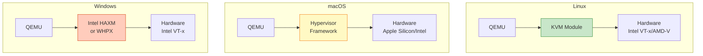

## 들어가며

QEMU 설치는 운영체제에 따라 방법이 다릅니다. 이 글에서는 **Linux**, **macOS**, **Windows** 각각의 설치 방법과 **KVM 하드웨어 가속** 활성화까지 전체 과정을 안내합니다.

## 시스템 요구사항

### 최소 요구사항
- **CPU**: 64-bit 프로세서
- **RAM**: 2GB 이상 (게스트 OS 메모리 별도)
- **디스크**: 10GB 여유 공간
- **OS**: Linux, macOS 10.13+, Windows 10+

### 권장 요구사항 (KVM 사용)
- **CPU**: Intel VT-x 또는 AMD-V 지원
- **RAM**: 8GB 이상
- **SSD**: 빠른 디스크 I/O
- **Linux Kernel**: 2.6.20 이상 (KVM 지원)

## 하드웨어 가상화 지원 확인

먼저 CPU가 하드웨어 가상화를 지원하는지 확인해야 합니다.

### Linux

```bash
# Intel VT-x 확인
grep -E 'vmx' /proc/cpuinfo

# AMD-V 확인
grep -E 'svm' /proc/cpuinfo

# 결과가 있으면 지원됨
# (아무것도 출력되지 않으면 미지원)
```

또는:

```bash
# kvm-ok 도구 사용 (Ubuntu/Debian)
sudo apt install cpu-checker
kvm-ok

# 출력 예시:
# INFO: /dev/kvm exists
# KVM acceleration can be used
```

### macOS

```bash
# Hypervisor Framework 지원 확인
sysctl kern.hv_support

# 출력: kern.hv_support: 1 (지원)
# 출력: kern.hv_support: 0 (미지원)
```

### Windows

```powershell
# PowerShell에서 실행
systeminfo | findstr /C:"Virtualization"

# 또는 작업 관리자
# 성능 탭 → CPU → 가상화: 사용
```

## Linux에 QEMU 설치

Linux는 QEMU 사용에 가장 최적화된 플랫폼입니다. KVM 하드웨어 가속을 완벽히 지원합니다.

### Ubuntu / Debian

```bash
# 1. 패키지 목록 업데이트
sudo apt update

# 2. QEMU 및 KVM 설치
sudo apt install qemu-kvm qemu-system qemu-utils

# 3. 추가 도구 설치 (선택)
sudo apt install libvirt-daemon-system libvirt-clients bridge-utils virt-manager

# 4. 사용자를 kvm 그룹에 추가
sudo usermod -aG kvm $USER
sudo usermod -aG libvirt $USER

# 5. 재로그인 필요 (또는 재부팅)
# 로그아웃 후 다시 로그인
```

**설치 확인:**

```bash
# QEMU 버전 확인
qemu-system-x86_64 --version

# 출력 예시:
# QEMU emulator version 6.2.0
# Copyright (c) 2003-2021 Fabrice Bellard and the QEMU Project developers

# KVM 사용 가능 여부 확인
ls -l /dev/kvm

# 출력 예시:
# crw-rw----+ 1 root kvm 10, 232 Jan 17 10:00 /dev/kvm
```

### Fedora / RHEL / CentOS

```bash
# 1. QEMU 설치
sudo dnf install qemu-kvm qemu-img

# 2. libvirt 설치
sudo dnf install libvirt virt-install virt-manager

# 3. libvirtd 서비스 시작
sudo systemctl start libvirtd
sudo systemctl enable libvirtd

# 4. 사용자 그룹 추가
sudo usermod -aG libvirt $USER
sudo usermod -aG kvm $USER
```

### Arch Linux

```bash
# 1. QEMU 설치
sudo pacman -S qemu-full

# 2. libvirt 설치 (선택)
sudo pacman -S libvirt virt-manager

# 3. KVM 모듈 로드 확인
lsmod | grep kvm

# 4. 사용자 그룹 추가
sudo usermod -aG kvm $USER
sudo usermod -aG libvirt $USER
```

### KVM 모듈 활성화 (Linux 공통)

```bash
# 1. KVM 모듈 로드 확인
lsmod | grep kvm

# Intel CPU
lsmod | grep kvm_intel

# AMD CPU
lsmod | grep kvm_amd

# 2. 모듈 수동 로드 (필요시)
# Intel
sudo modprobe kvm_intel

# AMD
sudo modprobe kvm_amd

# 3. 부팅 시 자동 로드 설정
echo "kvm_intel" | sudo tee -a /etc/modules
# 또는 AMD의 경우
echo "kvm_amd" | sudo tee -a /etc/modules
```

---

## macOS에 QEMU 설치

macOS에서는 Homebrew를 사용한 설치가 가장 간편합니다.

### Homebrew로 설치

```bash
# 1. Homebrew 설치 (없는 경우)
/bin/bash -c "$(curl -fsSL https://raw.githubusercontent.com/Homebrew/install/HEAD/install.sh)"

# 2. QEMU 설치
brew install qemu

# 3. 설치 확인
qemu-system-x86_64 --version

# 출력 예시:
# QEMU emulator version 7.2.0
# Copyright (c) 2003-2022 Fabrice Bellard and the QEMU Project developers
```

### Hypervisor.framework 사용

macOS는 KVM 대신 자체 Hypervisor.framework를 사용합니다:

```bash
# HVF(Hypervisor.framework) 가속 사용
qemu-system-x86_64 \
  -accel hvf \
  -m 2048 \
  -hda disk.qcow2 \
  -cdrom ubuntu.iso
```

**주의사항:**
- macOS는 ARM Mac (M1/M2/M3)과 Intel Mac에서 QEMU 동작이 다릅니다
- ARM Mac에서는 x86 에뮬레이션이 느립니다
- ARM Mac에서는 `qemu-system-aarch64` 사용 권장

### ARM Mac (M1/M2/M3) 최적화

```bash
# ARM64 게스트 실행 (빠름)
qemu-system-aarch64 \
  -accel hvf \
  -cpu host \
  -m 4096 \
  -machine virt \
  -hda arm-disk.qcow2
```

---

## Windows에 QEMU 설치

Windows에서는 공식 바이너리 또는 MSYS2를 통해 설치할 수 있습니다.

### 방법 1: 공식 Windows 바이너리 (권장)

```powershell
# 1. 공식 사이트에서 다운로드
# https://qemu.weilnetz.de/w64/

# 2. 설치 파일 실행
# qemu-w64-setup-xxxxxxxx.exe

# 3. 설치 경로 예시
# C:\Program Files\qemu

# 4. 환경 변수 PATH에 추가
# 시스템 속성 → 환경 변수 → Path → 편집
# C:\Program Files\qemu 추가

# 5. 확인 (새 PowerShell 창)
qemu-system-x86_64 --version
```

### 방법 2: MSYS2로 설치

```bash
# 1. MSYS2 설치
# https://www.msys2.org/

# 2. MSYS2 터미널에서 실행
pacman -S mingw-w64-x86_64-qemu

# 3. 환경 변수 추가
# C:\msys64\mingw64\bin
```

### 방법 3: Chocolatey로 설치

```powershell
# 1. Chocolatey 설치 (관리자 권한)
Set-ExecutionPolicy Bypass -Scope Process -Force
iex ((New-Object System.Net.WebClient).DownloadString('https://chocolatey.org/install.ps1'))

# 2. QEMU 설치
choco install qemu

# 3. 확인
qemu-system-x86_64 --version
```

### Windows에서 HAXM 사용 (하드웨어 가속)

Windows는 KVM을 사용할 수 없지만, Intel HAXM 또는 WHPX를 사용할 수 있습니다.

**Intel HAXM 설치:**

```powershell
# 1. HAXM 다운로드
# https://github.com/intel/haxm/releases

# 2. 설치 파일 실행
# haxm-windows_vX.X.X.zip 압축 해제 후
# silent_install.bat 실행 (관리자 권한)

# 3. 확인
sc query intelhaxm

# 4. QEMU에서 사용
qemu-system-x86_64 -accel hax -m 2048 disk.qcow2
```

**WHPX (Windows Hypervisor Platform):**

```powershell
# 1. Windows 기능 켜기
# 제어판 → 프로그램 → Windows 기능 켜기/끄기
# "Windows Hypervisor Platform" 체크

# 2. 재부팅

# 3. QEMU에서 사용
qemu-system-x86_64 -accel whpx -m 2048 disk.qcow2
```

---

## 설치 후 검증

모든 플랫폼에서 공통으로 수행할 검증 단계입니다.

### 1. 버전 확인

```bash
qemu-system-x86_64 --version
qemu-img --version
```

### 2. 하드웨어 가속 테스트

```bash
# Linux (KVM)
qemu-system-x86_64 -accel kvm -m 512 -nographic

# macOS (HVF)
qemu-system-x86_64 -accel hvf -m 512 -nographic

# Windows (HAXM)
qemu-system-x86_64 -accel hax -m 512 -nographic

# Ctrl+A, X로 종료
```

### 3. 지원 아키텍처 확인

```bash
# 설치된 QEMU 시스템 에뮬레이터 확인
ls /usr/bin/qemu-system-*

# 또는
qemu-system-x86_64 -machine help
qemu-system-arm -machine help
```

## 하드웨어 가속 비교



| 플랫폼 | 가속 기술 | 성능 | 안정성 |
|--------|----------|------|--------|
| **Linux** | KVM | ⭐⭐⭐⭐⭐ | ⭐⭐⭐⭐⭐ |
| **macOS** | HVF | ⭐⭐⭐⭐ | ⭐⭐⭐⭐ |
| **Windows** | HAXM/WHPX | ⭐⭐⭐ | ⭐⭐⭐ |

## 문제 해결

### Linux: /dev/kvm permission denied

```bash
# 증상
Could not access KVM kernel module: Permission denied

# 해결
sudo chmod 666 /dev/kvm
# 또는
sudo usermod -aG kvm $USER
# 재로그인 필요
```

### macOS: HVF not available

```bash
# 증상
qemu-system-x86_64: failed to initialize HVF: No such file or directory

# 확인
sysctl kern.hv_support

# kern.hv_support: 0이면 하드웨어 미지원
# Intel Mac이 아니거나 가상화 설정 꺼짐
```

### Windows: HAXM 설치 실패

```powershell
# 증상
HAXM installation failed

# 원인 1: Hyper-V와 충돌
# 해결: Hyper-V 비활성화
bcdedit /set hypervisorlaunchtype off
# 재부팅

# 원인 2: VT-x 비활성화
# 해결: BIOS에서 VT-x 활성화
```

## 다음 단계

설치가 완료되었다면, 다음 글에서 **첫 가상 머신을 만들어 봅니다**:
- 디스크 이미지 생성
- ISO 다운로드 및 설치
- 네트워킹 설정
- 기본 QEMU 명령어

---

**시리즈 목차**
1. QEMU란 무엇인가 - 가상화의 기본 개념
2. QEMU vs VirtualBox vs VMware - 가상화 솔루션 비교
3. **QEMU 설치하기 (Linux/macOS/Windows)** ← 현재 글
4. 첫 가상 머신 만들기 - Hello QEMU (다음 글)

> 💡 **Pro Tip**: Linux 사용자라면 반드시 KVM을 활성화하세요. 성능이 10배 이상 향상됩니다!
