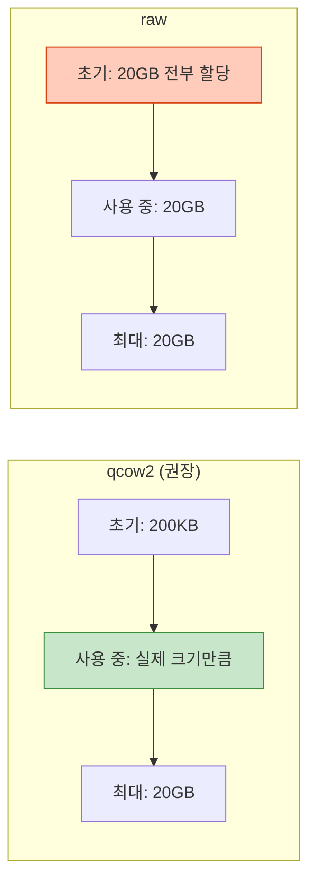
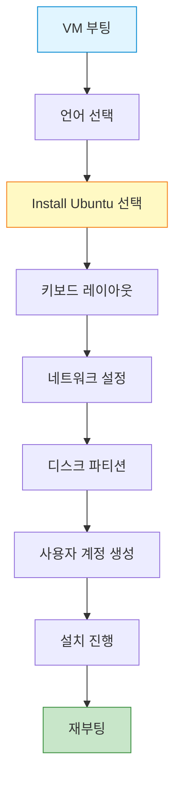
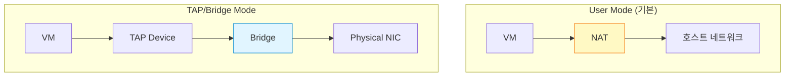

## 들어가며

이제 QEMU를 실제로 사용해볼 시간입니다! 이번 글에서는 **Ubuntu 가상 머신**을 처음부터 만들어보겠습니다.

## 실습 목표

- qcow2 디스크 이미지 생성
- Ubuntu ISO 다운로드
- QEMU로 가상 머신 부팅
- 운영체제 설치
- 설치된 VM 실행

## 준비물

- QEMU 설치 완료 (이전 글 참조)
- 디스크 여유 공간: 20GB 이상
- Ubuntu ISO 파일 (또는 다운로드 예정)

## Step 1: 작업 디렉토리 생성

```bash
# VM 저장용 디렉토리 생성
mkdir -p ~/qemu-vms/ubuntu-vm
cd ~/qemu-vms/ubuntu-vm
```

## Step 2: 디스크 이미지 생성

QEMU는 여러 디스크 포맷을 지원합니다. **qcow2**가 가장 많이 사용됩니다.

### qcow2 vs raw 비교



**qcow2 장점**:
- 동적 할당 (사용한 만큼만 디스크 차지)
- 스냅샷 지원
- 압축 지원
- 암호화 가능

### 디스크 이미지 생성

```bash
# 20GB qcow2 이미지 생성
qemu-img create -f qcow2 ubuntu-vm.qcow2 20G

# 출력:
# Formatting 'ubuntu-vm.qcow2', fmt=qcow2 size=21474836480 cluster_size=65536
```

**생성 확인**:

```bash
# 이미지 정보 확인
qemu-img info ubuntu-vm.qcow2

# 출력 예시:
# image: ubuntu-vm.qcow2
# file format: qcow2
# virtual size: 20 GiB (21474836480 bytes)
# disk size: 196 KiB
# cluster_size: 65536
```

실제 디스크는 196KB만 차지하지만, VM에서는 20GB 디스크로 인식됩니다!

## Step 3: Ubuntu ISO 다운로드

```bash
# Ubuntu 22.04 LTS 다운로드
wget https://releases.ubuntu.com/22.04/ubuntu-22.04.3-desktop-amd64.iso

# 또는 서버 버전 (더 가벼움)
wget https://releases.ubuntu.com/22.04/ubuntu-22.04.3-live-server-amd64.iso
```

## Step 4: 첫 부팅 - Ubuntu 설치

이제 ISO를 CD-ROM으로 연결하고 VM을 부팅합니다.

### Linux/macOS

```bash
qemu-system-x86_64 \
  -enable-kvm \
  -m 2048 \
  -smp 2 \
  -hda ubuntu-vm.qcow2 \
  -cdrom ubuntu-22.04.3-desktop-amd64.iso \
  -boot d \
  -vga virtio \
  -display sdl
```

### macOS (HVF 사용)

```bash
qemu-system-x86_64 \
  -accel hvf \
  -m 2048 \
  -smp 2 \
  -hda ubuntu-vm.qcow2 \
  -cdrom ubuntu-22.04.3-desktop-amd64.iso \
  -boot d \
  -vga virtio \
  -display cocoa
```

### Windows (HAXM 사용)

```powershell
qemu-system-x86_64.exe `
  -accel hax `
  -m 2048 `
  -smp 2 `
  -hda ubuntu-vm.qcow2 `
  -cdrom ubuntu-22.04.3-desktop-amd64.iso `
  -boot d `
  -vga virtio
```

### 옵션 설명

| 옵션 | 설명 |
|------|------|
| `-enable-kvm` | KVM 하드웨어 가속 (Linux) |
| `-accel hvf` | Hypervisor.framework (macOS) |
| `-accel hax` | Intel HAXM (Windows) |
| `-m 2048` | RAM 2GB 할당 |
| `-smp 2` | CPU 코어 2개 |
| `-hda` | 첫 번째 하드디스크 |
| `-cdrom` | CD-ROM 이미지 |
| `-boot d` | CD-ROM 부팅 (d=cdrom) |
| `-vga virtio` | VirtIO GPU |
| `-display sdl` | SDL 디스플레이 (Linux) |

## Step 5: Ubuntu 설치 과정

VM 창이 열리면 Ubuntu 설치 프로그램이 시작됩니다.



**설치 팁**:
1. **언어**: 한국어 또는 English
2. **디스크**: "Erase disk and install Ubuntu" (걱정 마세요, VM 디스크입니다!)
3. **사용자 계정**: 기억하기 쉬운 비밀번호 설정
4. **설치 시간**: 5-10분 소요

설치 완료 후 **Restart Now** 클릭.

## Step 6: CD-ROM 제거 후 재부팅

설치 완료 후에는 ISO 없이 부팅해야 합니다.

### 간단한 실행 스크립트 작성

**Linux/macOS**:

```bash
# start-vm.sh 생성
cat > start-vm.sh << 'EOF'
#!/bin/bash
qemu-system-x86_64 \
  -enable-kvm \
  -m 2048 \
  -smp 2 \
  -hda ubuntu-vm.qcow2 \
  -vga virtio \
  -display sdl \
  -net nic,model=virtio \
  -net user,hostfwd=tcp::2222-:22
EOF

chmod +x start-vm.sh
./start-vm.sh
```

**Windows (start-vm.bat)**:

```batch
@echo off
qemu-system-x86_64.exe ^
  -accel hax ^
  -m 2048 ^
  -smp 2 ^
  -hda ubuntu-vm.qcow2 ^
  -vga virtio ^
  -net nic,model=virtio ^
  -net user,hostfwd=tcp::2222-:22
```

### 새로 추가된 옵션

| 옵션 | 설명 |
|------|------|
| `-net nic,model=virtio` | VirtIO 네트워크 카드 |
| `-net user` | 사용자 모드 네트워킹 |
| `hostfwd=tcp::2222-:22` | 포트 포워딩 (SSH용) |

## Step 7: VM에 SSH 접속 (선택)

VM에 SSH로 접속하면 복사/붙여넣기가 편리합니다.

### VM 내부에서 SSH 서버 설치

```bash
# VM 안에서 실행
sudo apt update
sudo apt install openssh-server -y
sudo systemctl start ssh
```

### 호스트에서 SSH 접속

```bash
# 호스트에서 실행
ssh -p 2222 username@localhost

# username은 VM 설치 시 만든 계정명
```

## qemu-img 고급 사용법

### 1. 디스크 크기 조정

```bash
# 20GB → 40GB로 확장
qemu-img resize ubuntu-vm.qcow2 +20G
```

### 2. 포맷 변환

```bash
# qcow2 → raw
qemu-img convert -f qcow2 -O raw ubuntu-vm.qcow2 ubuntu-vm.raw

# raw → qcow2
qemu-img convert -f raw -O qcow2 ubuntu-vm.raw ubuntu-vm.qcow2
```

### 3. 스냅샷 생성

```bash
# 스냅샷 생성
qemu-img snapshot -c snapshot1 ubuntu-vm.qcow2

# 스냅샷 목록 확인
qemu-img snapshot -l ubuntu-vm.qcow2

# 스냅샷 복원
qemu-img snapshot -a snapshot1 ubuntu-vm.qcow2
```

### 4. 압축

```bash
# qcow2 압축 (새 파일 생성)
qemu-img convert -c -O qcow2 ubuntu-vm.qcow2 ubuntu-vm-compressed.qcow2
```

## 네트워킹 모드 비교



| 모드 | 장점 | 단점 | 용도 |
|------|------|------|------|
| **User** | 설정 간단, 권한 불필요 | 성능 낮음, VM 간 통신 X | 개인 개발 |
| **TAP** | 고성능, VM 간 통신 O | 설정 복잡, root 필요 | 서버 환경 |

## 성능 최적화 팁

### 1. VirtIO 드라이버 사용

```bash
# 디스크, 네트워크 모두 VirtIO 사용
qemu-system-x86_64 \
  -drive file=ubuntu-vm.qcow2,if=virtio \
  -net nic,model=virtio \
  -net user
```

### 2. CPU 호스트 패스스루

```bash
# 호스트 CPU 기능 그대로 사용
qemu-system-x86_64 \
  -enable-kvm \
  -cpu host \
  -m 2048 \
  ubuntu-vm.qcow2
```

### 3. Huge Pages (Linux)

```bash
# 메모리 성능 향상
qemu-system-x86_64 \
  -enable-kvm \
  -mem-path /dev/hugepages \
  -m 2048 \
  ubuntu-vm.qcow2
```

## 문제 해결

### VM이 느려요

**원인**: 하드웨어 가속 미사용

```bash
# 확인
qemu-system-x86_64 --version

# 해결
# Linux: -enable-kvm 추가
# macOS: -accel hvf 추가
# Windows: -accel hax 추가
```

### 네트워크가 안 돼요

```bash
# VM 내부에서 확인
ip addr show

# DHCP 재시도
sudo dhclient
```

### 화면이 작아요

```bash
# 해상도 변경 옵션 추가
-vga std \
-display gtk,zoom-to-fit=on
```

## 다음 단계

첫 VM을 성공적으로 만들었습니다! 다음 글에서는:
- **System Mode vs User Mode** 차이
- User Mode로 단일 바이너리 실행
- 크로스 아키텍처 에뮬레이션

---

**시리즈 목차**
1. QEMU란 무엇인가
2. QEMU vs VirtualBox vs VMware 비교
3. QEMU 설치하기
4. **첫 가상 머신 만들기 - Hello QEMU** ← 현재 글
5. QEMU의 두 가지 모드 - System vs User Mode (다음 글)

> 💡 **Quick Tip**: VM을 자주 실행한다면 스크립트를 만들어두세요. 매번 긴 명령어를 입력할 필요가 없습니다!
