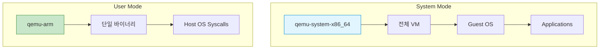
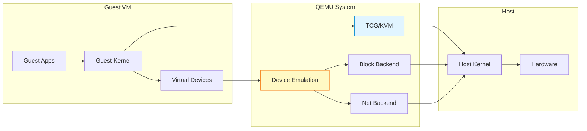
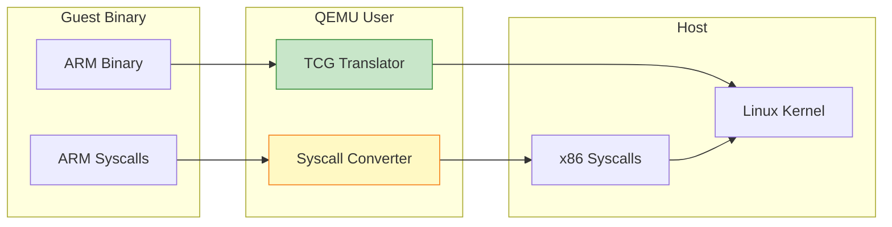
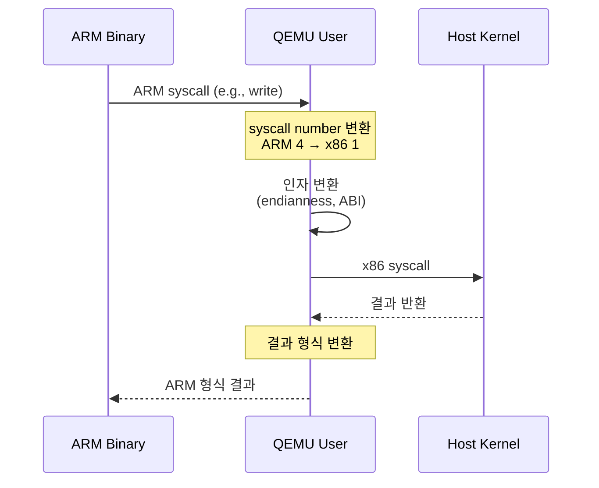
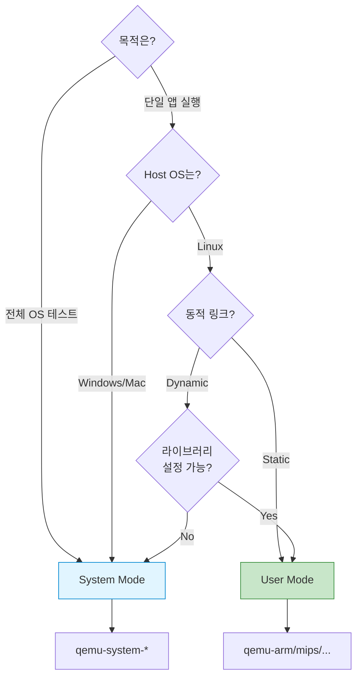

## 들어가며

QEMU는 **두 가지 실행 모드**를 제공합니다. 이전 글에서는 System Mode로 전체 VM을 만들었지만, 때로는 단일 프로그램만 실행하고 싶을 때가 있습니다. 이때 **User Mode**가 유용합니다.

## QEMU의 두 가지 모드



## System Mode (Full System Emulation)

### 특징

- **전체 시스템** 에뮬레이션
- CPU, 메모리, 디스크, 네트워크 등 모든 하드웨어 에뮬레이션
- 독립된 운영체제 실행
- 모든 아키텍처 지원

### 사용 사례

```bash
# x86-64 VM 실행
qemu-system-x86_64 -hda ubuntu.qcow2 -m 2048

# ARM VM 실행
qemu-system-arm -M vexpress-a9 -kernel zImage -m 512

# MIPS VM 실행
qemu-system-mips -M malta -kernel vmlinux
```

### 아키텍처



## User Mode (User-space Emulation)

### 특징

- **단일 프로그램** 실행
- Linux only (Linux host에서만 사용 가능)
- 시스템 콜을 호스트 OS로 전달
- 빠른 실행 속도
- Guest OS 불필요

### 사용 사례

```bash
# ARM 바이너리를 x86에서 실행
qemu-arm ./hello-arm

# Static 빌드가 아닌 경우 라이브러리 경로 지정
qemu-arm -L /usr/arm-linux-gnueabihf ./hello-arm

# MIPS 바이너리 실행
qemu-mips ./hello-mips
```

### 아키텍처



## 모드 비교

| 항목 | System Mode | User Mode |
|------|-------------|-----------|
| **용도** | 전체 OS 실행 | 단일 프로그램 |
| **OS 필요** | ✅ Guest OS 필요 | ❌ 불필요 |
| **플랫폼** | 모든 OS | Linux only |
| **성능** | 느림 (전체 시스템) | 빠름 |
| **메모리** | GB 단위 | MB 단위 |
| **디바이스** | 전부 에뮬레이션 | 파일 시스템만 |
| **네트워킹** | 가상 NIC | 호스트 공유 |
| **사용 난이도** | 복잡 | 간단 |

## User Mode 실습

### 1. ARM 크로스 컴파일 환경 설정

**Ubuntu/Debian**:

```bash
# ARM 크로스 컴파일러 설치
sudo apt update
sudo apt install gcc-arm-linux-gnueabihf qemu-user

# 설치 확인
arm-linux-gnueabihf-gcc --version
qemu-arm --version
```

**macOS** (Homebrew):

```bash
brew install arm-linux-gnueabihf-gcc qemu
```

### 2. 간단한 C 프로그램 작성

```c
// hello.c
#include <stdio.h>

int main() {
    printf("Hello from ARM on x86!\n");
    printf("Architecture: ARM\n");
    printf("Running via QEMU User Mode\n");
    return 0;
}
```

### 3. ARM용 컴파일

```bash
# ARM 바이너리 생성
arm-linux-gnueabihf-gcc -static -o hello-arm hello.c

# 파일 타입 확인
file hello-arm
# 출력: hello-arm: ELF 32-bit LSB executable, ARM, ...
```

**-static 옵션 이유**:
- 동적 링크 라이브러리 의존성 제거
- 단일 실행 파일로 빌드
- User Mode에서 쉽게 실행

### 4. QEMU User Mode로 실행

```bash
# ARM 바이너리 실행
qemu-arm ./hello-arm

# 출력:
# Hello from ARM on x86!
# Architecture: ARM
# Running via QEMU User Mode
```

x86 호스트에서 ARM 바이너리가 실행됩니다! 🎉

## User Mode 고급 사용법

### 1. 동적 링크 바이너리 실행

```bash
# 라이브러리 경로 지정
qemu-arm -L /usr/arm-linux-gnueabihf ./hello-arm-dynamic

# -L: 루트 파일시스템 경로
```

### 2. 환경 변수 전달

```bash
# 환경 변수 설정
qemu-arm -E LD_LIBRARY_PATH=/custom/lib ./app

# 여러 환경 변수
qemu-arm -E VAR1=value1 -E VAR2=value2 ./app
```

### 3. 디버깅 모드

```bash
# 시스템 콜 트레이스
qemu-arm -strace ./hello-arm

# 출력 예시:
# 9 brk(0x00000000) = 0x00023000
# 9 uname(0xf6fff720) = 0
# 9 write(1,0x23008,28)Hello from ARM on x86!
```

### 4. CPU 모델 지정

```bash
# 특정 ARM CPU 에뮬레이션
qemu-arm -cpu cortex-a9 ./app

# 사용 가능한 CPU 목록
qemu-arm -cpu help
```

## 실전 예제: Multi-Architecture 빌드 테스트

### 프로젝트 구조

```bash
project/
├── src/
│   └── main.c
├── build-x86.sh
├── build-arm.sh
├── build-mips.sh
└── test-all.sh
```

### 빌드 스크립트

**build-arm.sh**:

```bash
#!/bin/bash
arm-linux-gnueabihf-gcc -static -o bin/app-arm src/main.c
echo "✅ ARM build complete"
```

**build-mips.sh**:

```bash
#!/bin/bash
mips-linux-gnu-gcc -static -o bin/app-mips src/main.c
echo "✅ MIPS build complete"
```

### 테스트 스크립트

**test-all.sh**:

```bash
#!/bin/bash

echo "Testing ARM binary..."
qemu-arm bin/app-arm

echo "Testing MIPS binary..."
qemu-mips bin/app-mips

echo "Testing x86 binary..."
./bin/app-x86

echo "✅ All architectures tested!"
```

## System Call 변환 원리



### Syscall 번호 변환 예시

| Syscall | ARM | x86-64 | MIPS |
|---------|-----|--------|------|
| read    | 3   | 0      | 4003 |
| write   | 4   | 1      | 4004 |
| open    | 5   | 2      | 4005 |
| close   | 6   | 3      | 4006 |

QEMU User Mode는 자동으로 변환합니다!

## 언제 어떤 모드를 사용할까?



## 성능 비교

### 벤치마크: "Hello World" 1000회 실행

| 방법 | 실행 시간 | 메모리 사용 |
|------|-----------|-------------|
| **Native** | 0.5초 | 2MB |
| **QEMU User** | 2초 | 50MB |
| **QEMU System** | 45초 | 2GB |

User Mode가 System Mode보다 **20배 이상 빠릅니다**!

## 문제 해결

### "cannot execute binary file"

```bash
# 원인: qemu-user가 binfmt_misc에 등록 안 됨

# 해결 (Ubuntu/Debian)
sudo apt install qemu-user-binfmt

# 확인
cat /proc/sys/fs/binfmt_misc/qemu-arm
```

### 동적 링크 오류

```bash
# 오류: error while loading shared libraries

# 해결: 라이브러리 경로 지정
qemu-arm -L /usr/arm-linux-gnueabihf ./app
```

### 느린 실행 속도

```bash
# TCG 최적화 플래그
qemu-arm -cpu max ./app

# 멀티스레드 TCG
qemu-arm -accel tcg,thread=multi ./app
```

## Docker와의 결합

User Mode는 Docker 멀티 아키텍처 빌드에 활용됩니다.

```dockerfile
# Dockerfile.arm
FROM arm32v7/ubuntu:22.04

COPY app-arm /app
CMD ["/app"]
```

```bash
# x86 호스트에서 ARM 컨테이너 실행
docker run --platform linux/arm/v7 my-arm-image

# Docker가 내부적으로 qemu-arm 사용!
```

## 다음 단계

User Mode와 System Mode의 차이를 이해했습니다! 다음 글에서는:
- QEMU 네트워킹 심화 (TAP, Bridge)
- QEMU Monitor 활용
- 스냅샷과 마이그레이션

---

**시리즈 목차**
1. QEMU란 무엇인가
2. QEMU vs VirtualBox vs VMware 비교
3. QEMU 설치하기
4. 첫 가상 머신 만들기 - Hello QEMU
5. **QEMU의 두 가지 모드 - System vs User Mode** ← 현재 글

> 💡 **Quick Tip**: CI/CD에서 멀티 아키텍처 빌드를 테스트한다면 User Mode가 완벽한 선택입니다. Docker Buildx도 내부적으로 QEMU User Mode를 사용합니다!
