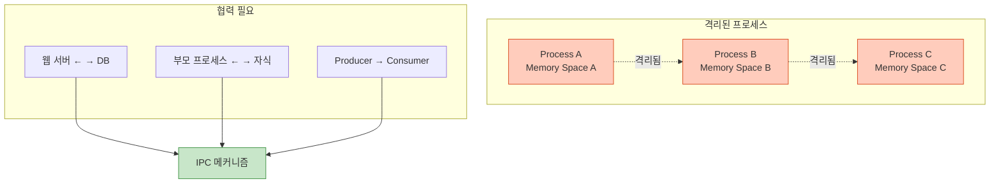
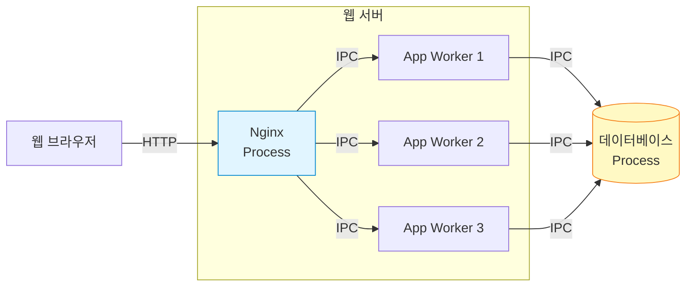
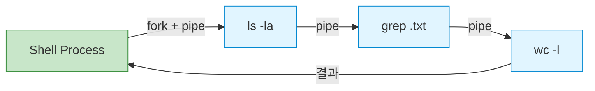
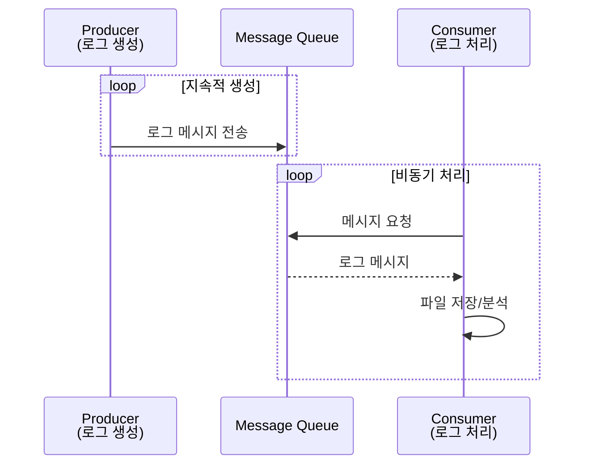
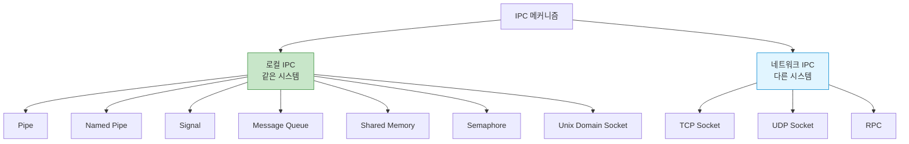
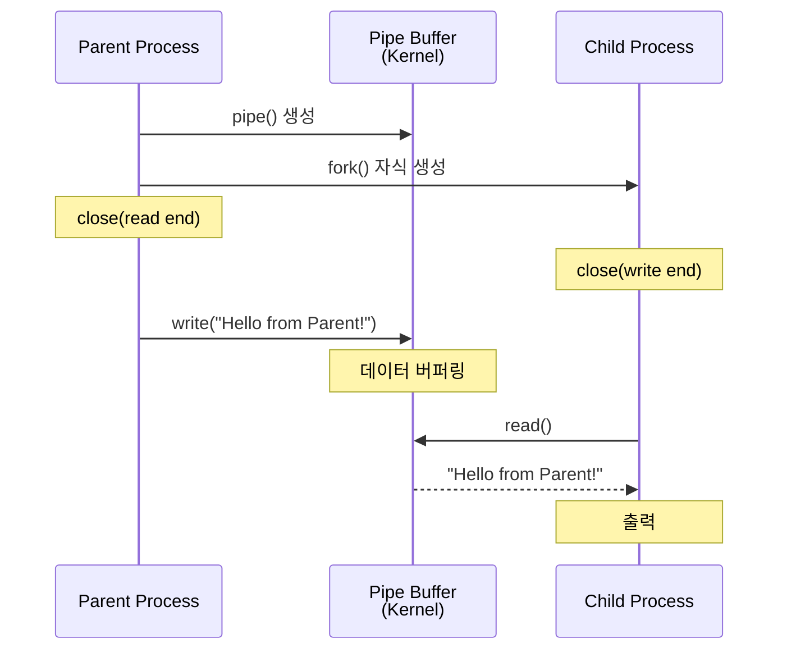
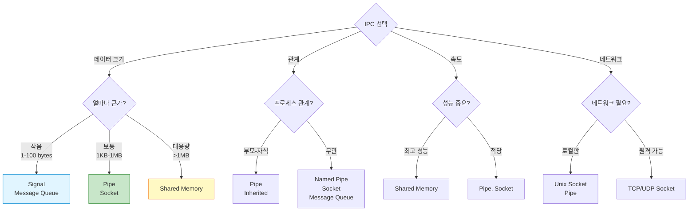
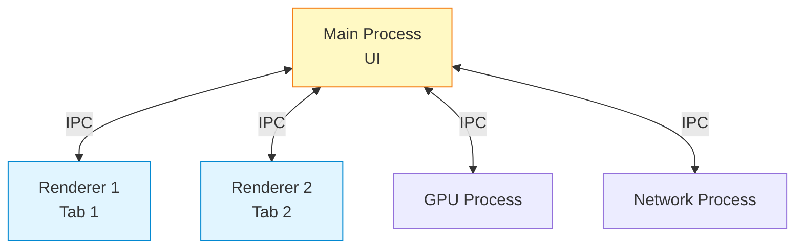

## 들어가며

현대 운영체제에서 프로세스는 **격리된 메모리 공간**에서 실행됩니다. 하지만 실제 애플리케이션은 여러 프로세스가 협력해야 합니다. 이때 필요한 것이 **IPC(Inter-Process Communication)**입니다.

## IPC란?

**IPC**는 프로세스 간에 데이터를 주고받는 모든 메커니즘을 의미합니다.

### 왜 IPC가 필요한가?



### 프로세스 격리의 이유

1. **보안**: 한 프로세스가 다른 프로세스 메모리에 접근 불가
2. **안정성**: 한 프로세스 크래시가 다른 프로세스에 영향 없음
3. **독립성**: 각 프로세스는 독립적인 주소 공간

하지만 격리는 **협력**을 어렵게 만듭니다!

## IPC 없이는 불가능한 것들

### 1. 웹 서버 아키텍처



Nginx와 워커 프로세스 간 통신: **Unix Domain Socket**
워커와 DB 간 통신: **TCP Socket**

### 2. 부모-자식 프로세스 협력

```c
// 예: 쉘에서 명령 실행
$ ls -la | grep ".txt" | wc -l
```



파이프(Pipe)로 연결된 3개의 프로세스!

### 3. Producer-Consumer 패턴



## IPC 메커니즘 분류



### 7가지 주요 IPC 메커니즘

| 메커니즘 | 특징 | 속도 | 사용 난이도 |
|----------|------|------|-------------|
| **Pipe** | 단방향, 부모-자식 | ⭐⭐⭐⭐ | 쉬움 |
| **Named Pipe** | 양방향, 무관한 프로세스 | ⭐⭐⭐⭐ | 쉬움 |
| **Signal** | 비동기 이벤트 | ⭐⭐⭐⭐⭐ | 중간 |
| **Message Queue** | 구조화된 메시지 | ⭐⭐⭐ | 중간 |
| **Shared Memory** | 직접 메모리 공유 | ⭐⭐⭐⭐⭐ | 어려움 |
| **Semaphore** | 동기화 도구 | ⭐⭐⭐⭐⭐ | 중간 |
| **Unix Socket** | 로컬 소켓 통신 | ⭐⭐⭐⭐ | 중간 |

## IPC 동작 원리

### 커널의 역할

```mermaid
graph TB
    subgraph "User Space"
        PA[Process A]
        PB[Process B]
    end

    subgraph "Kernel Space"
        KC[Kernel IPC Controller]
        PB_Data[Pipe Buffer]
        MQ_Data[Message Queue]
        SHM_Data[Shared Memory]
    end

    PA -->|write()| KC
    KC --> PB_Data
    KC --> MQ_Data
    KC --> SHM_Data
    PB_Data -->|read()| PB
    MQ_Data -->|read()| PB
    SHM_Data -->|직접 접근| PB

    style KC fill:#fff9c4,stroke:#f57f17
    style PA fill:#e1f5ff,stroke:#0288d1
    style PB fill:#e1f5ff,stroke:#0288d1
```

대부분의 IPC는 **커널**을 통해 데이터를 전달합니다!

**예외**: Shared Memory는 커널이 메모리 영역만 매핑하고, 프로세스가 직접 접근합니다.

## 간단한 예제: Pipe

### 코드

```c
// pipe_example.c
#include <stdio.h>
#include <unistd.h>
#include <string.h>

int main() {
    int pipefd[2];
    pid_t pid;
    char buffer[100];

    // 파이프 생성
    pipe(pipefd);

    pid = fork();

    if (pid == 0) {
        // 자식 프로세스: 읽기
        close(pipefd[1]);  // 쓰기 끝 닫기
        read(pipefd[0], buffer, sizeof(buffer));
        printf("자식이 받은 메시지: %s\n", buffer);
        close(pipefd[0]);
    } else {
        // 부모 프로세스: 쓰기
        close(pipefd[0]);  // 읽기 끝 닫기
        char *msg = "Hello from Parent!";
        write(pipefd[1], msg, strlen(msg) + 1);
        close(pipefd[1]);
    }

    return 0;
}
```

### 컴파일 및 실행

```bash
gcc -o pipe_example pipe_example.c
./pipe_example

# 출력:
# 자식이 받은 메시지: Hello from Parent!
```

### 동작 과정



## IPC 선택 기준



## 실전 사용 사례

### 1. Chrome 브라우저



Chrome은 **프로세스 격리**로 보안을 강화하고, **IPC**로 협력합니다.

### 2. Systemd

```bash
# systemd는 Unix Socket으로 서비스 관리
$ systemctl status nginx

# /run/systemd/private 소켓 사용
```

### 3. Docker

```bash
# Docker daemon과 CLI는 Unix Socket 통신
$ docker ps

# /var/run/docker.sock 사용
```

## IPC vs Thread

| 항목 | IPC (프로세스 간) | Thread (스레드 간) |
|------|-------------------|---------------------|
| **메모리** | 독립적 | 공유 |
| **통신 방법** | IPC 메커니즘 필요 | 전역 변수로 직접 공유 |
| **안정성** | 높음 (격리) | 낮음 (크래시 영향) |
| **속도** | 느림 (커널 거침) | 빠름 (직접 접근) |
| **보안** | 높음 | 낮음 |
| **복잡도** | 높음 | 낮음 |

**원칙**: 격리가 중요하면 **프로세스 + IPC**, 성능이 중요하면 **스레드**.

## 다음 단계

IPC의 기본 개념을 이해했습니다! 다음 글에서는:
- **7가지 IPC 메커니즘 상세 비교**
- 각 메커니즘의 장단점
- 사용 시나리오별 추천

---

**시리즈 목차**
1. **IPC란 무엇인가 - 프로세스 간 통신의 필요성** ← 현재 글
2. IPC 메커니즘 전체 개요 - 7가지 방식 비교 (다음 글)
3. Pipe - 가장 기본적인 IPC
4. Named Pipe (FIFO) - 이름 있는 파이프
5. Signal - 비동기 이벤트 통신

> 💡 **Quick Tip**: IPC를 처음 배운다면 Pipe부터 시작하세요. 가장 간단하면서도 IPC의 핵심 개념을 모두 담고 있습니다!
