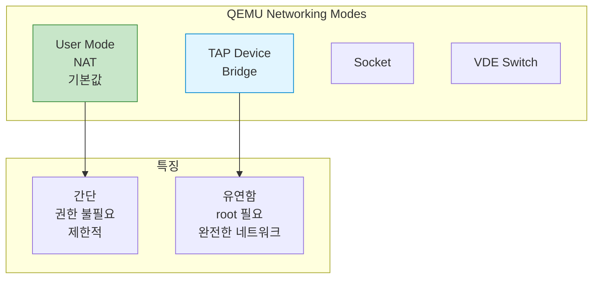
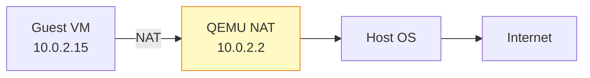
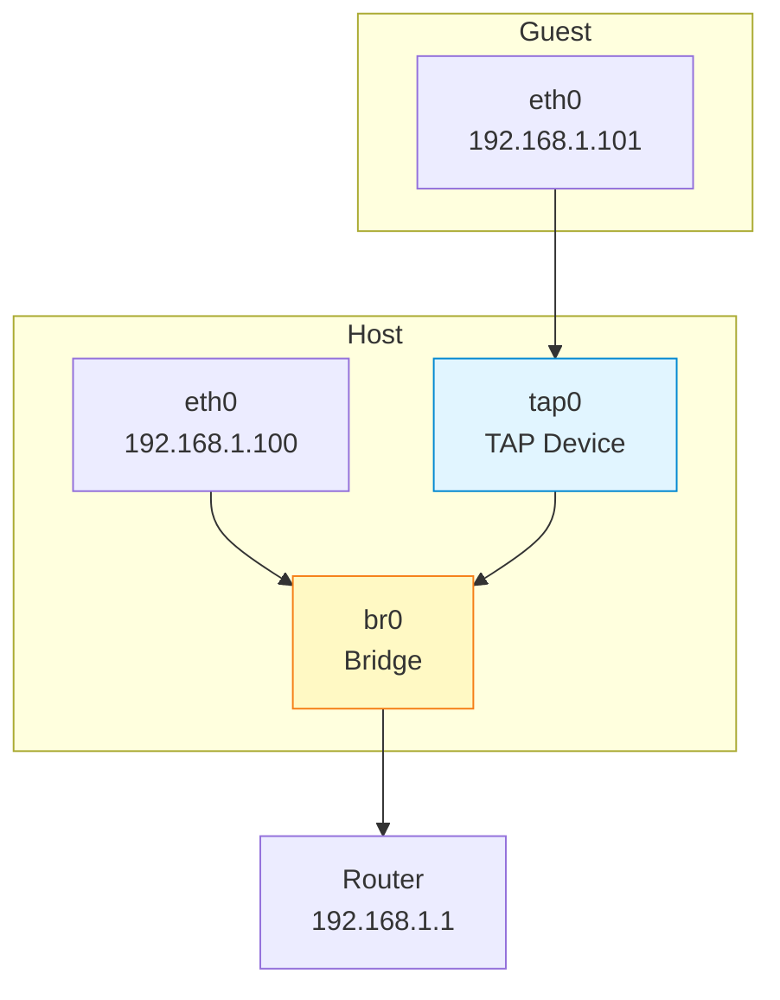
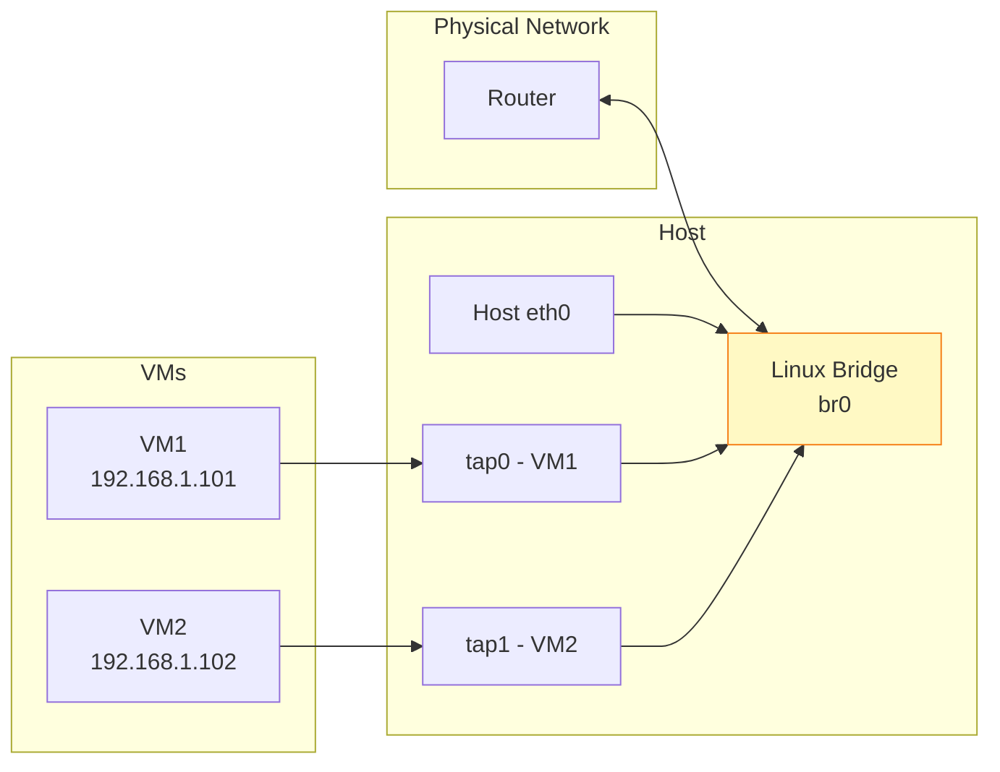
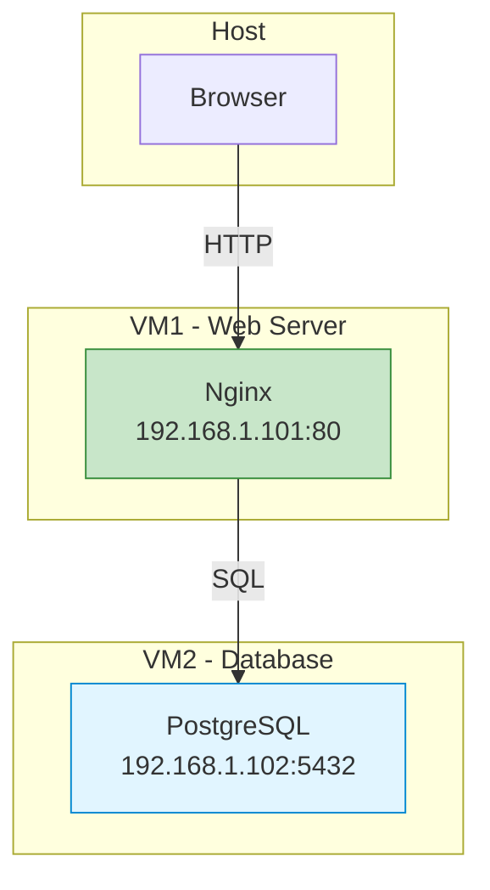

## 들어가며

가상 머신은 **네트워크 연결**이 필수입니다. QEMU는 다양한 네트워킹 모드를 제공하며, 각각의 장단점과 사용 사례가 다릅니다.

## QEMU 네트워킹 모드



## 1. User Mode Networking (NAT)

### 개념

가장 간단한 모드로, QEMU가 내부 **NAT**를 제공합니다.



### 기본 사용

```bash
# 기본 NAT (자동 설정)
qemu-system-x86_64 \
  -hda ubuntu.qcow2 \
  -m 2048 \
  -net nic \
  -net user

# Guest에서 인터넷 접속 가능
# Guest IP: 10.0.2.15
# Gateway: 10.0.2.2
# DNS: 10.0.2.3
```

### 포트 포워딩

```bash
# Host 2222 → Guest 22 (SSH)
qemu-system-x86_64 \
  -hda ubuntu.qcow2 \
  -m 2048 \
  -net nic \
  -net user,hostfwd=tcp::2222-:22

# Host에서 접속
ssh -p 2222 user@localhost
```

### 여러 포트 포워딩

```bash
qemu-system-x86_64 \
  -hda ubuntu.qcow2 \
  -m 2048 \
  -net nic \
  -net user,hostfwd=tcp::2222-:22,hostfwd=tcp::8080-:80
```

### 장단점

| 장점 | 단점 |
|------|------|
| ✅ 간단 (설정 불필요) | ❌ Guest → Host 직접 접속 불가 |
| ✅ root 권한 불필요 | ❌ 성능 제한적 |
| ✅ 즉시 사용 가능 | ❌ 복잡한 네트워크 구성 불가 |

## 2. TAP/TUN Networking

### 개념

**TAP**은 가상 네트워크 인터페이스를 만들어 Host와 Guest를 연결합니다.



### TAP 설정 (Linux)

```bash
# TAP 디바이스 생성 (root 필요)
sudo ip tuntap add dev tap0 mode tap user $(whoami)
sudo ip link set tap0 up

# Bridge 생성
sudo ip link add br0 type bridge
sudo ip link set br0 up

# Host 인터페이스를 Bridge에 연결
sudo ip link set eth0 master br0

# TAP을 Bridge에 연결
sudo ip link set tap0 master br0

# IP 설정 이동
sudo ip addr flush dev eth0
sudo dhclient br0
```

### QEMU에서 TAP 사용

```bash
qemu-system-x86_64 \
  -hda ubuntu.qcow2 \
  -m 2048 \
  -netdev tap,id=mynet0,ifname=tap0,script=no,downscript=no \
  -device e1000,netdev=mynet0

# Guest 내부에서 IP 설정
# sudo dhclient eth0
```

### Helper Script

```bash
# /etc/qemu-ifup
#!/bin/bash
ip link set $1 up
ip link set $1 master br0

# /etc/qemu-ifdown
#!/bin/bash
ip link set $1 down

# 권한 설정
sudo chmod +x /etc/qemu-ifup /etc/qemu-ifdown

# QEMU 실행
qemu-system-x86_64 \
  -hda ubuntu.qcow2 \
  -m 2048 \
  -netdev tap,id=mynet0 \
  -device e1000,netdev=mynet0
```

## 3. Bridge Networking

### 개념도



### 완전한 Bridge 설정

```bash
# Bridge 생성
sudo ip link add br0 type bridge

# 기존 네트워크 인터페이스를 Bridge에 추가
sudo ip link set eth0 master br0

# Bridge와 eth0 활성화
sudo ip link set br0 up
sudo ip link set eth0 up

# IP를 Bridge로 이동
sudo ip addr flush dev eth0
sudo dhclient br0

# TAP 디바이스 생성 및 Bridge 연결
sudo ip tuntap add dev tap0 mode tap user $(whoami)
sudo ip link set tap0 master br0
sudo ip link set tap0 up
```

## 4. 네트워크 장치 에뮬레이션

### 지원 NIC 모델

```bash
# 사용 가능한 NIC 확인
qemu-system-x86_64 -device help | grep net

# 주요 NIC 모델
# - e1000: Intel Gigabit (기본, 호환성 좋음)
# - virtio-net: 반가상화 (최고 성능)
# - rtl8139: Realtek (레거시)
# - ne2k_pci: NE2000 (매우 오래됨)
```

### 성능 비교

| NIC 모델 | 성능 | 호환성 | 사용 사례 |
|----------|------|--------|-----------|
| **virtio-net** | ⭐⭐⭐⭐⭐ | 중간 | 최신 Linux |
| **e1000** | ⭐⭐⭐ | ⭐⭐⭐⭐⭐ | 범용 |
| **rtl8139** | ⭐⭐ | ⭐⭐⭐⭐ | 레거시 OS |

### virtio-net 사용 (최고 성능)

```bash
qemu-system-x86_64 \
  -hda ubuntu.qcow2 \
  -m 2048 \
  -netdev tap,id=mynet0,ifname=tap0 \
  -device virtio-net-pci,netdev=mynet0,mac=52:54:00:12:34:56

# 성능 향상: 2-3배
```

## 실습: 다중 VM 네트워크

### 시나리오



### 1. Bridge 설정

```bash
# Bridge 생성
sudo ip link add br0 type bridge
sudo ip link set br0 up
sudo ip addr add 192.168.1.1/24 dev br0

# TAP 디바이스 생성
sudo ip tuntap add dev tap0 mode tap
sudo ip tuntap add dev tap1 mode tap
sudo ip link set tap0 master br0
sudo ip link set tap1 master br0
sudo ip link set tap0 up
sudo ip link set tap1 up
```

### 2. VM 시작

```bash
# VM1 - Web Server
qemu-system-x86_64 \
  -name "web-server" \
  -hda web.qcow2 \
  -m 1024 \
  -netdev tap,id=net0,ifname=tap0,script=no \
  -device virtio-net,netdev=net0 \
  -daemonize

# VM2 - Database
qemu-system-x86_64 \
  -name "database" \
  -hda db.qcow2 \
  -m 2048 \
  -netdev tap,id=net0,ifname=tap1,script=no \
  -device virtio-net,netdev=net0 \
  -daemonize
```

### 3. Guest 내부 설정

```bash
# VM1 (Web Server)
sudo ip addr add 192.168.1.101/24 dev eth0
sudo ip link set eth0 up
sudo ip route add default via 192.168.1.1

# VM2 (Database)
sudo ip addr add 192.168.1.102/24 dev eth0
sudo ip link set eth0 up
sudo ip route add default via 192.168.1.1

# 연결 테스트
# VM1에서: ping 192.168.1.102
```

## 문제 해결

### "Permission denied" 에러

```bash
# TAP 생성 시 권한 에러
sudo ip tuntap add dev tap0 mode tap user $(whoami)

# 또는 /etc/qemu/bridge.conf 설정
echo "allow br0" | sudo tee -a /etc/qemu/bridge.conf
```

### Bridge에 연결 안 됨

```bash
# Bridge 상태 확인
ip link show br0

# TAP이 Bridge에 연결되었는지 확인
bridge link show

# iptables 확인 (방화벽이 차단할 수 있음)
sudo iptables -L -v
```

### Guest에서 인터넷 안 됨

```bash
# Host에서 IP forwarding 활성화
sudo sysctl -w net.ipv4.ip_forward=1

# NAT 설정 (iptables)
sudo iptables -t nat -A POSTROUTING -o eth0 -j MASQUERADE
sudo iptables -A FORWARD -i br0 -o eth0 -j ACCEPT
sudo iptables -A FORWARD -i eth0 -o br0 -m state --state RELATED,ESTABLISHED -j ACCEPT
```

## 다음 단계

네트워킹 기초를 마스터했습니다! 다음 글에서는:
- **QEMU Monitor** - 런타임 제어
- VM 관리 명령어
- 디버깅 도구

---

**시리즈 목차**
1. QEMU란 무엇인가
2. QEMU vs VirtualBox vs VMware 비교
3. QEMU 설치하기
4. 첫 가상 머신 만들기
5. QEMU의 두 가지 모드 - System vs User Mode
6. **QEMU 네트워킹 기초 - NAT, Bridge, TAP** ← 현재 글

> 💡 **Quick Tip**: 간단한 테스트는 User Mode NAT로 충분하지만, 프로덕션 환경이나 복잡한 네트워크 구성은 TAP/Bridge를 사용하세요!
