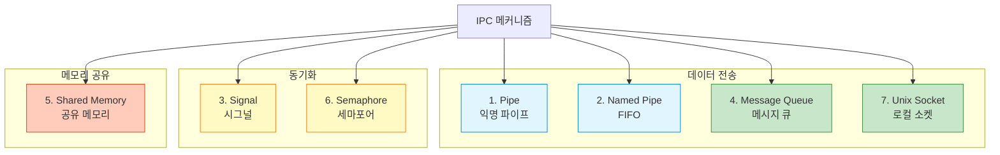
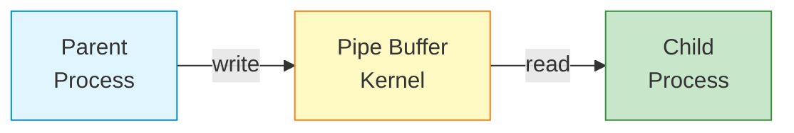
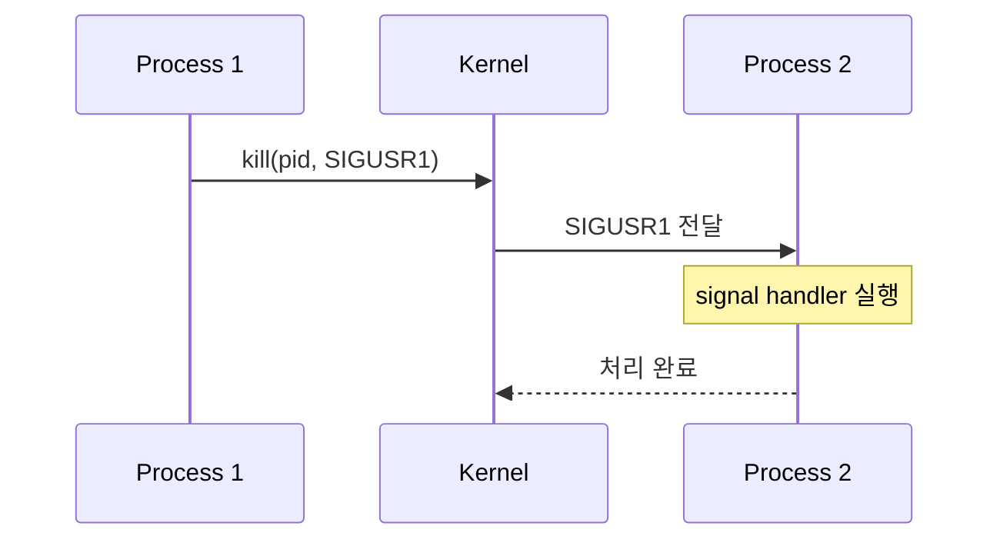
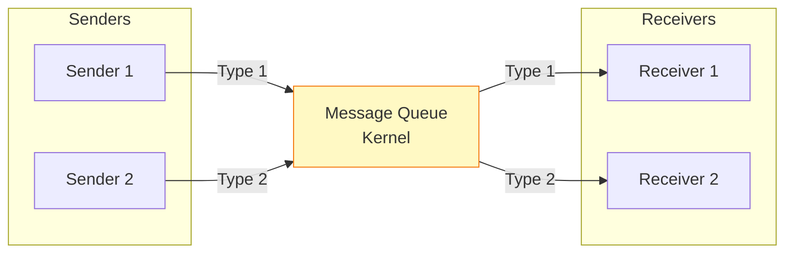
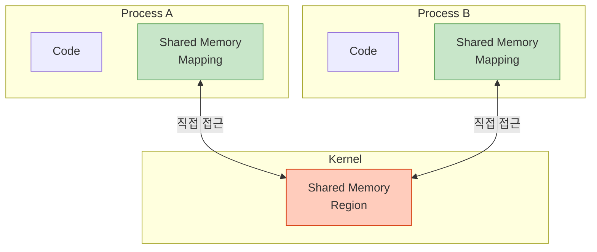
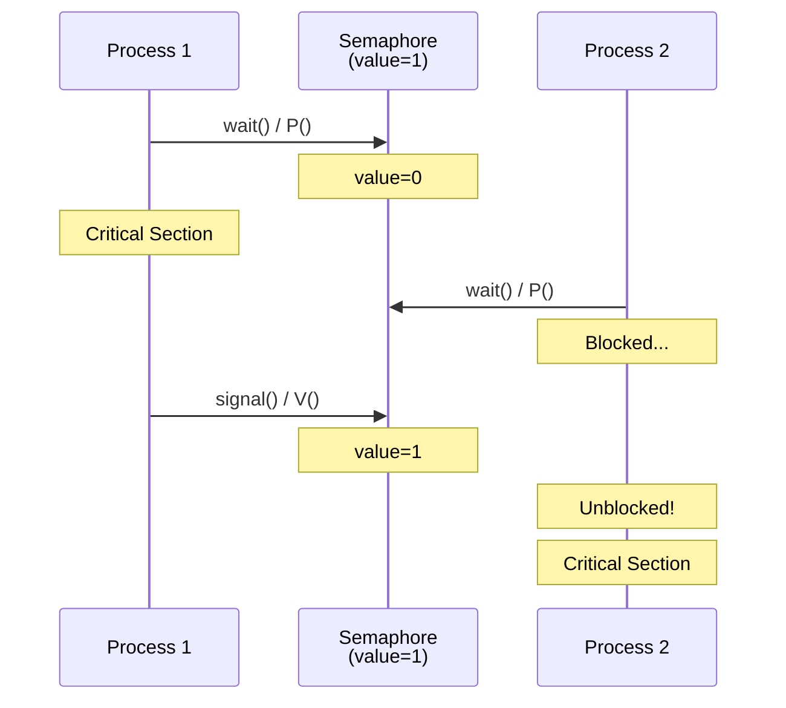
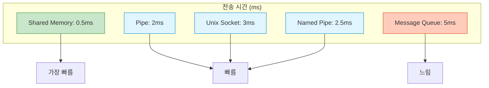
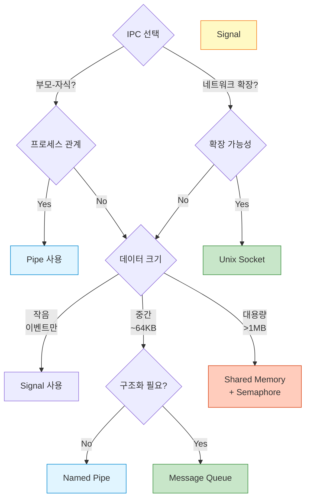
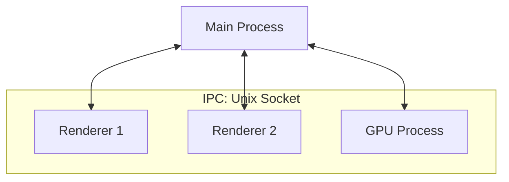

## 들어가며

Linux/Unix에는 **7가지 주요 IPC 메커니즘**이 있습니다. 각각은 고유한 특징과 사용 사례를 가지고 있습니다. 이번 글에서는 전체 메커니즘을 비교하고, 언제 무엇을 사용해야 하는지 알아봅니다.

## 7가지 IPC 메커니즘 전체 구조



## 상세 비교표

| 메커니즘 | 데이터 크기 | 속도 | 방향 | 프로세스 관계 | 커널 거침 | 네트워크 확장 |
|----------|-------------|------|------|---------------|-----------|---------------|
| **Pipe** | 제한적 (64KB) | 빠름 | 단방향 | 부모-자식 | ✅ | ❌ |
| **Named Pipe** | 제한적 (64KB) | 빠름 | 양방향 | 무관 | ✅ | ❌ |
| **Signal** | 매우 작음 (숫자) | 매우 빠름 | 단방향 | 무관 | ✅ | ❌ |
| **Message Queue** | 중간 (수 KB) | 보통 | 양방향 | 무관 | ✅ | ❌ |
| **Shared Memory** | 대용량 (GB) | 매우 빠름 | 양방향 | 무관 | ❌ | ❌ |
| **Semaphore** | 없음 (동기화만) | 매우 빠름 | - | 무관 | ✅ | ❌ |
| **Unix Socket** | 무제한 | 빠름 | 양방향 | 무관 | ✅ | ✅ (TCP/UDP로 확장) |

## 1. Pipe (익명 파이프)

### 개념



### 특징

- **단방향** FIFO (First In, First Out)
- **부모-자식** 프로세스 간에만 사용
- `fork()` 시 파일 디스크립터 상속
- Shell 파이프라인의 기본 메커니즘

### 사용 예

```bash
# Shell에서 가장 흔한 IPC
ls -la | grep "txt" | wc -l
```

```c
// C 코드 예시
int pipefd[2];
pipe(pipefd);  // pipefd[0]: read, pipefd[1]: write

if (fork() == 0) {
    // 자식: 읽기
    close(pipefd[1]);
    read(pipefd[0], buffer, sizeof(buffer));
} else {
    // 부모: 쓰기
    close(pipefd[0]);
    write(pipefd[1], "message", 7);
}
```

## 2. Named Pipe (FIFO)

### 개념

```mermaid
graph TB
    PA[Process A]
    PB[Process B]
    PC[Process C]

    FIFO[/tmp/myfifo<br/>Named Pipe<br/>File System]

    PA -->|write| FIFO
    FIFO -->|read| PB
    PC -->|write| FIFO

    style FIFO fill:#fff9c4,stroke:#f57f17
    style PA fill:#e1f5ff,stroke:#0288d1
    style PB fill:#c8e6c9,stroke:#388e3c
    style PC fill:#e1f5ff,stroke:#0288d1
```

### 특징

- **파일시스템에 이름**을 가진 파이프
- **무관한 프로세스** 간 통신 가능
- 양방향 가능 (두 개의 FIFO 사용)
- 파일처럼 `open()`, `read()`, `write()`

### 사용 예

```bash
# FIFO 생성
mkfifo /tmp/myfifo

# Terminal 1: Writer
echo "Hello FIFO" > /tmp/myfifo

# Terminal 2: Reader
cat /tmp/myfifo
# 출력: Hello FIFO
```

## 3. Signal (시그널)

### 개념



### 특징

- **비동기 이벤트** 통지
- 데이터 전송 불가 (신호 번호만)
- **인터럽트** 메커니즘
- 30+ 종류의 표준 시그널

### 주요 시그널

| 시그널 | 번호 | 의미 | 기본 동작 |
|--------|------|------|-----------|
| **SIGINT** | 2 | Interrupt (Ctrl+C) | 종료 |
| **SIGKILL** | 9 | 강제 종료 | 종료 (처리 불가) |
| **SIGTERM** | 15 | 정상 종료 요청 | 종료 |
| **SIGCHLD** | 17 | 자식 종료 | 무시 |
| **SIGUSR1** | 10 | 사용자 정의 1 | 종료 |
| **SIGUSR2** | 12 | 사용자 정의 2 | 종료 |

### 사용 예

```c
#include <signal.h>

void handler(int sig) {
    printf("Received signal %d\n", sig);
}

int main() {
    signal(SIGUSR1, handler);

    // 시그널 대기
    pause();

    return 0;
}
```

```bash
# 다른 터미널에서
kill -SIGUSR1 <pid>
```

## 4. Message Queue (메시지 큐)

### 개념



### 특징

- **구조화된 메시지** 전송
- **메시지 타입**으로 선택적 수신
- **FIFO 또는 우선순위** 방식
- 여러 송신자 → 여러 수신자

### 사용 예

```c
#include <sys/msg.h>

struct msg_buffer {
    long msg_type;
    char msg_text[100];
};

// 생성
int msgid = msgget(IPC_PRIVATE, 0666 | IPC_CREAT);

// 송신
struct msg_buffer msg;
msg.msg_type = 1;
strcpy(msg.msg_text, "Hello Queue");
msgsnd(msgid, &msg, sizeof(msg.msg_text), 0);

// 수신
msgrcv(msgid, &msg, sizeof(msg.msg_text), 1, 0);
printf("Received: %s\n", msg.msg_text);
```

## 5. Shared Memory (공유 메모리)

### 개념



### 특징

- **가장 빠른 IPC** (커널 거치지 않음)
- **대용량 데이터** 전송에 최적
- **동기화 필수** (Semaphore/Mutex와 함께 사용)
- 복잡도 높음

### 사용 예

```c
#include <sys/shm.h>

// 공유 메모리 생성
int shmid = shmget(IPC_PRIVATE, 1024, IPC_CREAT | 0666);

// 연결
char *shmaddr = (char *)shmat(shmid, NULL, 0);

// 쓰기
strcpy(shmaddr, "Shared Data");

// 읽기 (다른 프로세스에서)
printf("Data: %s\n", shmaddr);

// 분리
shmdt(shmaddr);
```

## 6. Semaphore (세마포어)

### 개념



### 특징

- **동기화** 도구 (데이터 전송 X)
- **뮤텍스** 또는 **카운팅 세마포어**
- Shared Memory와 함께 사용
- Race condition 방지

### 사용 예

```c
#include <sys/sem.h>

// 세마포어 생성
int semid = semget(IPC_PRIVATE, 1, IPC_CREAT | 0666);

// 초기화 (value=1)
semctl(semid, 0, SETVAL, 1);

// P 연산 (wait)
struct sembuf p_op = {0, -1, 0};
semop(semid, &p_op, 1);

// Critical Section
printf("In critical section\n");

// V 연산 (signal)
struct sembuf v_op = {0, 1, 0};
semop(semid, &v_op, 1);
```

## 7. Unix Domain Socket

### 개념

```mermaid
graph LR
    Server[Server<br/>Process]
    Socket[/tmp/socket<br/>Unix Socket]
    Client1[Client 1]
    Client2[Client 2]

    Client1 <-->|read/write| Socket
    Client2 <-->|read/write| Socket
    Socket <-->|read/write| Server

    style Socket fill:#fff9c4,stroke:#f57f17
    style Server fill:#e1f5ff,stroke:#0288d1
```

### 특징

- **로컬 소켓** (파일시스템 기반)
- **양방향** 통신
- **TCP/UDP로 확장** 가능
- Docker, systemd 등에서 사용

### 사용 예

```c
// Server
int server_fd = socket(AF_UNIX, SOCK_STREAM, 0);
struct sockaddr_un addr;
addr.sun_family = AF_UNIX;
strcpy(addr.sun_path, "/tmp/socket");
bind(server_fd, (struct sockaddr *)&addr, sizeof(addr));
listen(server_fd, 5);

int client_fd = accept(server_fd, NULL, NULL);
read(client_fd, buffer, sizeof(buffer));

// Client
int client_fd = socket(AF_UNIX, SOCK_STREAM, 0);
connect(client_fd, (struct sockaddr *)&addr, sizeof(addr));
write(client_fd, "Hello", 5);
```

## 성능 비교

### 벤치마크: 1MB 데이터 전송



**결론**: Shared Memory >> Pipe ≈ Socket > Message Queue

## 선택 가이드



## 실전 사용 사례

### Chrome/Firefox



**사용**: Unix Domain Socket

### Docker Daemon

```bash
/var/run/docker.sock  # Unix Socket
```

### Nginx + uWSGI

```bash
# nginx.conf
upstream uwsgi {
    server unix:///tmp/uwsgi.sock;  # Unix Socket
}
```

### systemd

```bash
# systemctl 명령어
/run/systemd/private  # Unix Socket
```

## 조합 사용 패턴

### Shared Memory + Semaphore

```c
// 고성능 Producer-Consumer
int shmid = shmget(...);
int semid = semget(...);

// Producer
semop(semid, &p_op, 1);  // Lock
memcpy(shmaddr, data, size);  // Write
semop(semid, &v_op, 1);  // Unlock

// Consumer
semop(semid, &p_op, 1);  // Lock
memcpy(data, shmaddr, size);  // Read
semop(semid, &v_op, 1);  // Unlock
```

## 다음 단계

7가지 IPC 메커니즘을 전체적으로 파악했습니다! 다음 글에서는 각 메커니즘을 심화 학습합니다:
- **Pipe 상세** - 파이프라인 구축
- Named Pipe - 무관한 프로세스 간 통신
- Signal - 비동기 이벤트 처리

---

**시리즈 목차**
1. IPC란 무엇인가 - 프로세스 간 통신의 필요성
2. **IPC 메커니즘 전체 개요 - 7가지 방식 비교** ← 현재 글
3. Pipe - 가장 기본적인 IPC (다음 글)
4. Named Pipe (FIFO) - 이름 있는 파이프
5. Signal - 비동기 이벤트 통신

> 💡 **Quick Tip**: 대부분의 경우 Pipe, Unix Socket, Shared Memory 중 하나면 충분합니다. 복잡한 Message Queue는 특별한 이유가 있을 때만 사용하세요!
