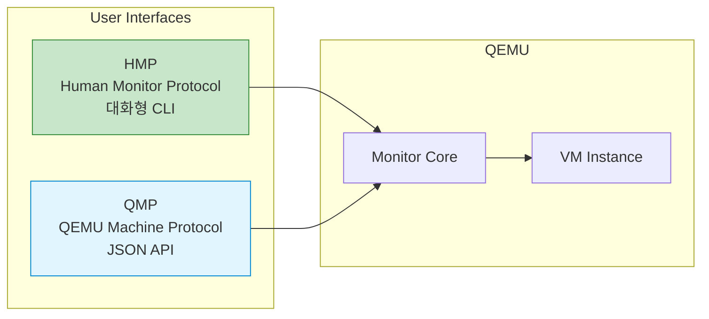

## 들어가며

실행 중인 VM을 제어하려면 어떻게 해야 할까요? **QEMU Monitor**는 VM을 런타임에 관리하는 강력한 인터페이스입니다.

## QEMU Monitor 개요



### HMP vs QMP

| 항목 | HMP | QMP |
|------|-----|-----|
| **용도** | 사람이 사용 | 프로그램이 사용 |
| **포맷** | 텍스트 명령 | JSON |
| **사용 사례** | 디버깅, 테스트 | 자동화, 모니터링 |
| **안정성** | 변경 가능 | 안정적 API |

## HMP 사용하기

### Monitor 접근

```bash
# 방법 1: stdio로 Monitor 열기
qemu-system-x86_64 \
  -hda ubuntu.qcow2 \
  -m 2048 \
  -monitor stdio

# 방법 2: Telnet으로 접근
qemu-system-x86_64 \
  -hda ubuntu.qcow2 \
  -m 2048 \
  -monitor telnet:127.0.0.1:4444,server,nowait

# 접속: telnet localhost 4444

# 방법 3: Unix Socket
qemu-system-x86_64 \
  -hda ubuntu.qcow2 \
  -m 2048 \
  -monitor unix:/tmp/qemu-monitor.sock,server,nowait

# 접속: nc -U /tmp/qemu-monitor.sock
```

### 기본 명령어

```bash
# 도움말
(qemu) help

# VM 상태 확인
(qemu) info status
VM status: running

# CPU 정보
(qemu) info cpus
* CPU #0: thread_id=12345

# 메모리 정보
(qemu) info memory

# 블록 디바이스
(qemu) info block
ide0-hd0: ubuntu.qcow2 (qcow2)
```

### VM 제어

```bash
# VM 일시정지
(qemu) stop

# VM 재개
(qemu) cont

# VM 종료 (graceful)
(qemu) system_powerdown

# VM 강제 종료
(qemu) quit

# VM 재부팅
(qemu) system_reset
```

### 스냅샷 관리

```bash
# 스냅샷 생성
(qemu) savevm snapshot1

# 스냅샷 목록
(qemu) info snapshots
ID        TAG                 VM SIZE                DATE       VM CLOCK
1         snapshot1           256M                   2025-01-21 10:00:00   00:05:23

# 스냅샷 복원
(qemu) loadvm snapshot1

# 스냅샷 삭제
(qemu) delvm snapshot1
```

### 디스크 관리

```bash
# 디스크 이미지 변경
(qemu) change ide0-hd0 /path/to/new.qcow2

# CD-ROM 이미지 교체
(qemu) change ide1-cd0 /path/to/installer.iso

# CD-ROM 꺼내기
(qemu) eject ide1-cd0
```

### 네트워크 관리

```bash
# 네트워크 인터페이스 정보
(qemu) info network

# 네트워크 통계
(qemu) info usernet

# 호스트 포워딩 추가
(qemu) hostfwd_add tcp::2222-:22
```

## QMP (QEMU Machine Protocol)

### QMP 활성화

```bash
# QMP를 Unix Socket으로 노출
qemu-system-x86_64 \
  -hda ubuntu.qcow2 \
  -m 2048 \
  -qmp unix:/tmp/qemu-qmp.sock,server,nowait

# QMP를 TCP로 노출
qemu-system-x86_64 \
  -hda ubuntu.qcow2 \
  -m 2048 \
  -qmp tcp:127.0.0.1:4445,server,nowait
```

### QMP 기본 사용

```bash
# nc로 연결
nc -U /tmp/qemu-qmp.sock

# 초기 handshake
{"QMP": {"version": {"qemu": {"micro": 0, "minor": 0, "major": 5}, ...}}}

# Capabilities 협상
{"execute": "qmp_capabilities"}
{"return": {}}

# 명령 실행: VM 정보
{"execute": "query-status"}
{"return": {"running": true, "singlestep": false, "status": "running"}}

# VM 일시정지
{"execute": "stop"}
{"return": {}}
```

### Python으로 QMP 사용

```python
# qmp_client.py
import socket
import json

class QMPClient:
    def __init__(self, socket_path):
        self.sock = socket.socket(socket.AF_UNIX, socket.SOCK_STREAM)
        self.sock.connect(socket_path)

        # Handshake
        greeting = json.loads(self.sock.recv(4096).decode())
        print("Connected:", greeting['QMP']['version'])

        # Capabilities
        self.execute('qmp_capabilities')

    def execute(self, command, **args):
        cmd = {'execute': command}
        if args:
            cmd['arguments'] = args

        self.sock.send(json.dumps(cmd).encode() + b'\n')
        response = json.loads(self.sock.recv(4096).decode())
        return response.get('return')

    def close(self):
        self.sock.close()

# 사용 예
client = QMPClient('/tmp/qemu-qmp.sock')

# VM 상태 확인
status = client.execute('query-status')
print("VM Status:", status)

# 스냅샷 생성
client.execute('human-monitor-command',
               command_line='savevm snapshot1')

# VM 일시정지
client.execute('stop')

client.close()
```

### 주요 QMP 명령어

```python
# VM 제어
client.execute('stop')                      # 일시정지
client.execute('cont')                      # 재개
client.execute('system_reset')              # 재부팅
client.execute('system_powerdown')          # 종료

# 정보 조회
client.execute('query-status')              # 상태
client.execute('query-cpus')                # CPU 정보
client.execute('query-block')               # 블록 디바이스
client.execute('query-migrate')             # Migration 상태

# 디바이스 관리
client.execute('blockdev-snapshot-internal-sync',
               device='ide0-hd0',
               name='snap1')                # 스냅샷

# 이벤트 구독
client.execute('query-events')              # 사용 가능한 이벤트
```

## 실전 예제: VM 모니터링

### 자동 모니터링 스크립트

```python
#!/usr/bin/env python3
import socket
import json
import time

class VMMonitor:
    def __init__(self, socket_path):
        self.client = QMPClient(socket_path)

    def get_cpu_usage(self):
        cpus = self.client.execute('query-cpus-fast')
        return cpus

    def get_memory_info(self):
        # HMP 명령어 실행
        result = self.client.execute('human-monitor-command',
                                      command_line='info memory')
        return result

    def get_block_stats(self):
        stats = self.client.execute('query-blockstats')
        return stats

    def monitor_loop(self, interval=5):
        while True:
            print("\n=== VM Statistics ===")

            # 상태
            status = self.client.execute('query-status')
            print(f"Status: {status['status']}")

            # CPU
            cpus = self.get_cpu_usage()
            print(f"CPUs: {len(cpus)}")

            # 블록 I/O
            block_stats = self.get_block_stats()
            for stat in block_stats:
                device = stat['device']
                rd = stat['stats']['rd_bytes'] / 1024 / 1024  # MB
                wr = stat['stats']['wr_bytes'] / 1024 / 1024  # MB
                print(f"  {device}: Read {rd:.2f}MB, Write {wr:.2f}MB")

            time.sleep(interval)

# 사용
monitor = VMMonitor('/tmp/qemu-qmp.sock')
monitor.monitor_loop()
```

## 이벤트 처리

### QMP 이벤트 수신

```python
import select

class EventMonitor(QMPClient):
    def wait_for_events(self, timeout=None):
        """이벤트 대기"""
        ready = select.select([self.sock], [], [], timeout)
        if ready[0]:
            data = self.sock.recv(4096).decode()
            for line in data.strip().split('\n'):
                event = json.loads(line)
                if 'event' in event:
                    self.handle_event(event)

    def handle_event(self, event):
        event_type = event['event']
        timestamp = event['timestamp']

        if event_type == 'POWERDOWN':
            print(f"[{timestamp}] VM is powering down")
        elif event_type == 'RESET':
            print(f"[{timestamp}] VM reset")
        elif event_type == 'SHUTDOWN':
            print(f"[{timestamp}] VM shutdown")
        elif event_type == 'BLOCK_JOB_COMPLETED':
            print(f"[{timestamp}] Block job completed")

# 사용
monitor = EventMonitor('/tmp/qemu-qmp.sock')

while True:
    monitor.wait_for_events(timeout=1)
```

## 고급 활용

### 핫플러그 (Hot-plug)

```bash
# HMP: USB 디바이스 추가
(qemu) device_add usb-storage,id=usb1,drive=usb-drive
(qemu) drive_add 0 if=none,id=usb-drive,file=/path/to/usb.img

# QMP
client.execute('device_add',
               driver='usb-storage',
               id='usb1',
               drive='usb-drive')
```

### Live Migration 제어

```bash
# Migration 시작 (HMP)
(qemu) migrate tcp:destination-host:4444

# Migration 모니터링 (QMP)
status = client.execute('query-migrate')
print(f"Progress: {status['ram']['percentage']}%")
```

## 다음 단계

QEMU Monitor를 마스터했습니다! 다음 글에서는:
- **스냅샷과 체크포인트** 상세
- 백업 전략
- 시점 복구

---

**시리즈 목차**
1-6. [이전 글들]
7. **QEMU Monitor - 런타임 VM 제어** ← 현재 글

> 💡 **Quick Tip**: 프로덕션 환경에서는 HMP 대신 QMP를 사용하세요. QMP는 안정적인 API를 제공하며 자동화에 적합합니다!
