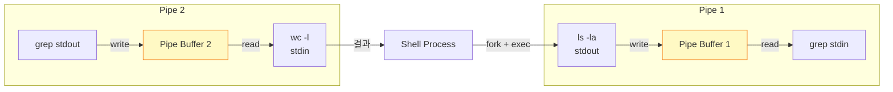
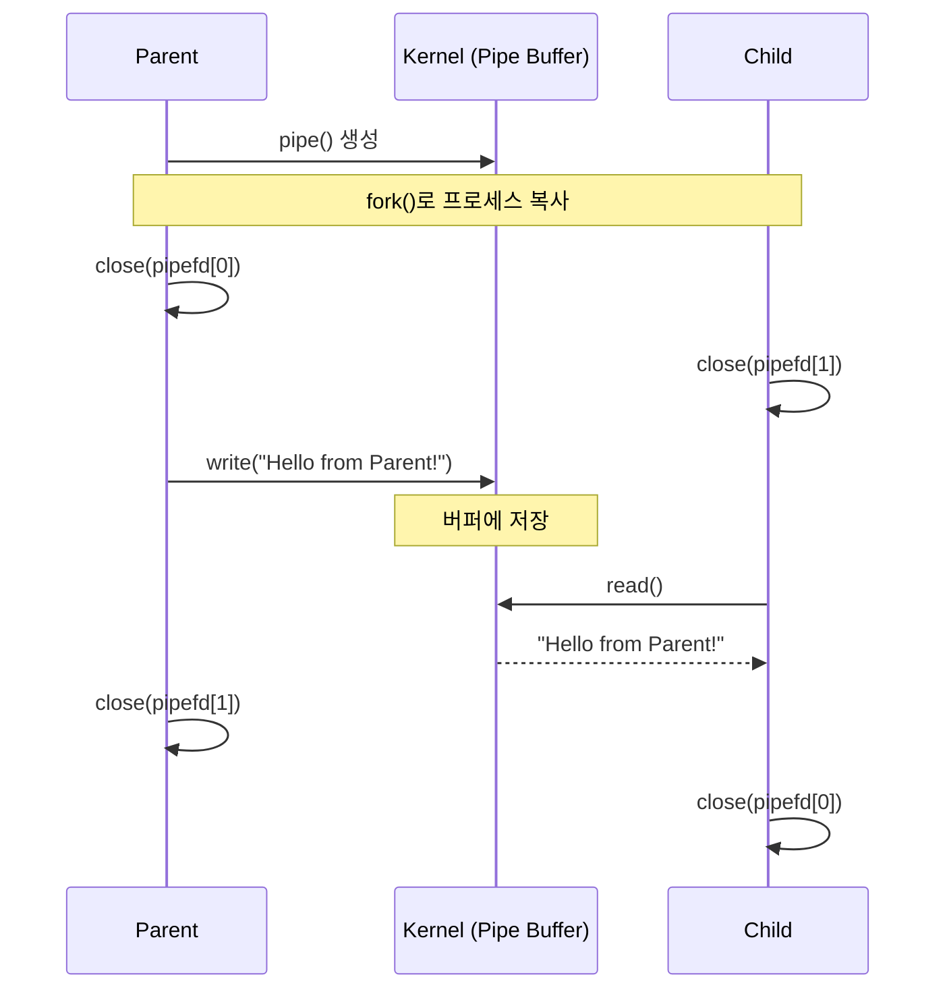
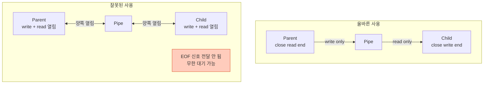
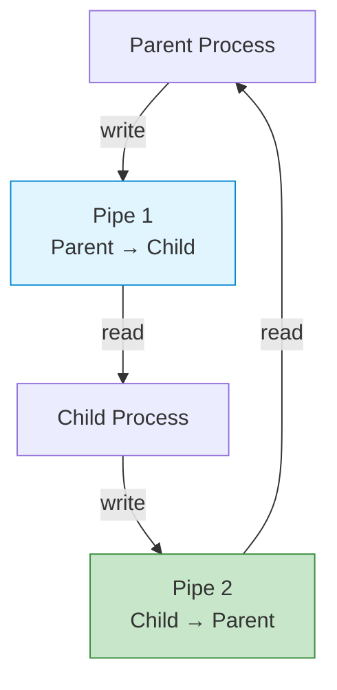
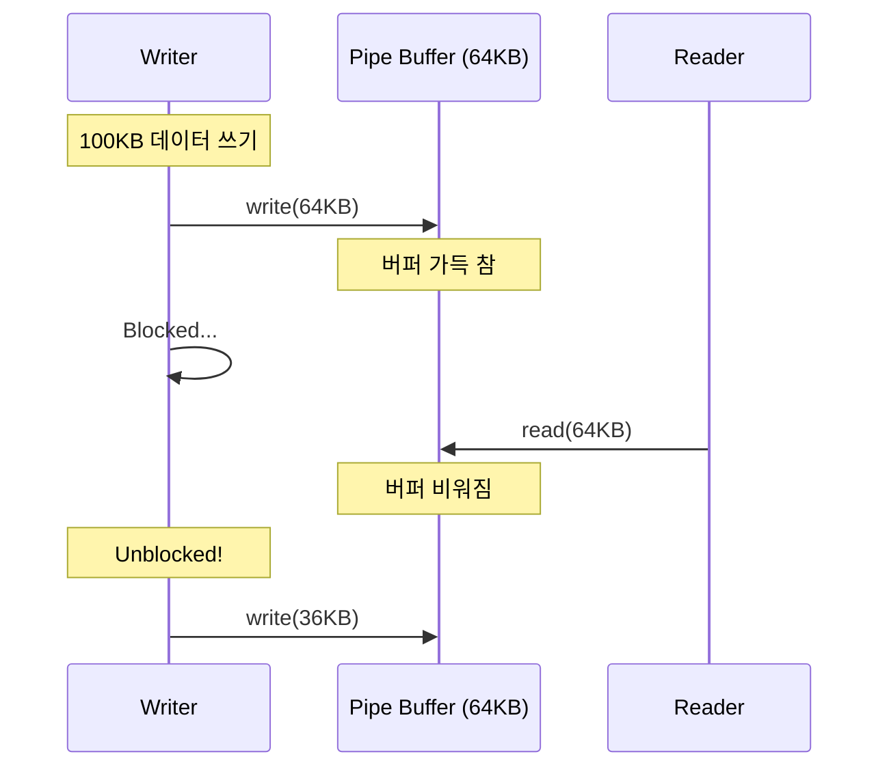

## 들어가며

**Pipe**는 가장 오래되고 기본적인 IPC 메커니즘입니다. Shell에서 매일 사용하는 `|` 기호가 바로 파이프입니다. 간단하지만 강력한 파이프의 세계로 들어가봅시다.

## Pipe의 개념

### 기본 구조

```mermaid
graph LR
    Writer[Writer Process<br/>fd[1]]
    PipeBuffer[Pipe Buffer<br/>Kernel Space<br/>64KB]
    Reader[Reader Process<br/>fd[0]]

    Writer -->|write()| PipeBuffer
    PipeBuffer -->|read()| Reader

    style Writer fill:#e1f5ff,stroke:#0288d1
    style Reader fill:#c8e6c9,stroke:#388e3c
    style PipeBuffer fill:#fff9c4,stroke:#f57f17
```

### 핵심 특징

1. **단방향 FIFO**: First In, First Out
2. **커널 버퍼**: 보통 64KB (시스템마다 다름)
3. **파일 디스크립터**: `pipefd[0]` (읽기), `pipefd[1]` (쓰기)
4. **부모-자식 관계**: `fork()` 시 상속됨

## Shell Pipe의 동작 원리

### 명령어

```bash
ls -la | grep "txt" | wc -l
```

### 내부 구조



## Pipe 생성 및 사용

### 기본 API

```c
#include <unistd.h>

int pipe(int pipefd[2]);
```

- **반환값**: 성공 시 0, 실패 시 -1
- **pipefd[0]**: 읽기용 파일 디스크립터
- **pipefd[1]**: 쓰기용 파일 디스크립터

### 간단한 예제

```c
// pipe_basic.c
#include <stdio.h>
#include <unistd.h>
#include <string.h>

int main() {
    int pipefd[2];
    char buffer[100];

    // 1. Pipe 생성
    if (pipe(pipefd) == -1) {
        perror("pipe");
        return 1;
    }

    // 2. Fork
    pid_t pid = fork();

    if (pid == 0) {
        // 자식 프로세스: Reader
        close(pipefd[1]);  // 쓰기 끝 닫기

        ssize_t n = read(pipefd[0], buffer, sizeof(buffer));
        buffer[n] = '\0';
        printf("자식이 받음: %s\n", buffer);

        close(pipefd[0]);
    } else {
        // 부모 프로세스: Writer
        close(pipefd[0]);  // 읽기 끝 닫기

        const char *msg = "Hello from Parent!";
        write(pipefd[1], msg, strlen(msg));

        close(pipefd[1]);
        wait(NULL);  // 자식 종료 대기
    }

    return 0;
}
```

### 실행

```bash
gcc -o pipe_basic pipe_basic.c
./pipe_basic

# 출력:
# 자식이 받음: Hello from Parent!
```

### 동작 과정



## 왜 사용하지 않는 끝을 닫아야 할까?

### 문제 상황: 닫지 않으면?

```c
// 잘못된 예
if (pid == 0) {
    // 자식: pipefd[1]을 닫지 않음!
    read(pipefd[0], buffer, sizeof(buffer));
    // 🔥 무한 대기 가능!
}
```

### 이유



**핵심**: 모든 쓰기 끝이 닫혀야 `read()`가 EOF (0)를 반환합니다.

## 양방향 통신

### 두 개의 Pipe 사용

```c
// bidirectional_pipe.c
#include <stdio.h>
#include <unistd.h>
#include <string.h>

int main() {
    int pipe_p2c[2];  // Parent to Child
    int pipe_c2p[2];  // Child to Parent
    char buffer[100];

    pipe(pipe_p2c);
    pipe(pipe_c2p);

    if (fork() == 0) {
        // 자식
        close(pipe_p2c[1]);  // P2C 쓰기 닫기
        close(pipe_c2p[0]);  // C2P 읽기 닫기

        // 부모로부터 받기
        read(pipe_p2c[0], buffer, sizeof(buffer));
        printf("자식 받음: %s\n", buffer);

        // 부모에게 보내기
        write(pipe_c2p[1], "Pong", 4);

        close(pipe_p2c[0]);
        close(pipe_c2p[1]);
    } else {
        // 부모
        close(pipe_p2c[0]);  // P2C 읽기 닫기
        close(pipe_c2p[1]);  // C2P 쓰기 닫기

        // 자식에게 보내기
        write(pipe_p2c[1], "Ping", 4);

        // 자식으로부터 받기
        read(pipe_c2p[0], buffer, sizeof(buffer));
        printf("부모 받음: %s\n", buffer);

        close(pipe_p2c[1]);
        close(pipe_c2p[0]);
        wait(NULL);
    }

    return 0;
}
```

### 구조



## 실전 예제: 간단한 Shell 파이프라인 구현

### 목표

```bash
./mypipe "ls -la" "grep txt"
```

### 코드

```c
// mypipe.c
#include <stdio.h>
#include <stdlib.h>
#include <unistd.h>
#include <string.h>
#include <sys/wait.h>

void execute_command(char *cmd, char **args) {
    // "ls -la" → ["ls", "-la", NULL]
    char *token = strtok(cmd, " ");
    int i = 0;
    while (token != NULL) {
        args[i++] = token;
        token = strtok(NULL, " ");
    }
    args[i] = NULL;
}

int main(int argc, char *argv[]) {
    if (argc != 3) {
        fprintf(stderr, "Usage: %s <cmd1> <cmd2>\n", argv[0]);
        return 1;
    }

    int pipefd[2];
    pipe(pipefd);

    // 첫 번째 명령 실행
    if (fork() == 0) {
        close(pipefd[0]);  // 읽기 닫기
        dup2(pipefd[1], STDOUT_FILENO);  // stdout을 pipe로 리다이렉트
        close(pipefd[1]);

        char *args[10];
        execute_command(argv[1], args);
        execvp(args[0], args);
        perror("execvp");
        exit(1);
    }

    // 두 번째 명령 실행
    if (fork() == 0) {
        close(pipefd[1]);  // 쓰기 닫기
        dup2(pipefd[0], STDIN_FILENO);  // stdin을 pipe에서 읽기
        close(pipefd[0]);

        char *args[10];
        execute_command(argv[2], args);
        execvp(args[0], args);
        perror("execvp");
        exit(1);
    }

    // 부모는 모든 파이프 닫기
    close(pipefd[0]);
    close(pipefd[1]);

    // 자식들 대기
    wait(NULL);
    wait(NULL);

    return 0;
}
```

### 실행

```bash
gcc -o mypipe mypipe.c
./mypipe "ls -la" "grep .c"

# 출력:
# -rw-r--r--  1 user  staff   1234 Jan 22 10:00 mypipe.c
# -rw-r--r--  1 user  staff    567 Jan 22 09:30 pipe_basic.c
```

## Pipe 크기 및 제한

### 확인 방법

```bash
# Linux에서 기본 파이프 크기 확인
cat /proc/sys/fs/pipe-max-size

# 출력 예: 1048576 (1MB)
```

### 크기 변경 (Linux)

```c
#include <fcntl.h>

int pipefd[2];
pipe(pipefd);

// 파이프 크기 설정 (1MB)
fcntl(pipefd[1], F_SETPIPE_SZ, 1024 * 1024);

// 현재 크기 확인
int size = fcntl(pipefd[1], F_GETPIPE_SZ);
printf("Pipe size: %d bytes\n", size);
```

### Blocking vs Non-blocking



**Non-blocking 설정**:

```c
#include <fcntl.h>

int flags = fcntl(pipefd[1], F_GETFL);
fcntl(pipefd[1], F_SETFL, flags | O_NONBLOCK);

// 이제 write()가 EAGAIN 반환 가능
```

## 성능 최적화

### 1. 버퍼 크기 최적화

```c
// 작은 버퍼: 많은 시스템 콜
char buffer[1];  // ❌ 비효율적

// 큰 버퍼: 적은 시스템 콜
char buffer[4096];  // ✅ 효율적
```

### 2. splice() 사용 (Linux)

```c
#include <fcntl.h>

// Zero-copy 파이프 → 파일
ssize_t bytes = splice(pipefd[0], NULL, file_fd, NULL,
                       size, SPLICE_F_MOVE);
```

### 성능 비교

| 방법 | 1MB 전송 시간 | CPU 사용 |
|------|---------------|----------|
| read/write (1 byte) | 500ms | 높음 |
| read/write (4KB) | 5ms | 보통 |
| splice() | 2ms | 낮음 |

## 문제 해결

### Broken Pipe 에러

```bash
# 에러 예
ls | head -1
# 가끔 "write: broken pipe" 에러
```

**원인**: Reader가 먼저 종료 → Writer가 SIGPIPE 받음

**해결**:

```c
signal(SIGPIPE, SIG_IGN);  // SIGPIPE 무시

// write() 시 EPIPE 에러 체크
if (write(pipefd[1], data, size) == -1) {
    if (errno == EPIPE) {
        printf("Reader가 종료됨\n");
    }
}
```

### 데드락 방지

```c
// ❌ 데드락 가능
write(pipe, large_data, 10MB);  // 버퍼 가득 → Block
read(pipe, buffer, size);  // 실행 안 됨!

// ✅ 해결: 별도 프로세스/스레드
if (fork() == 0) {
    write(pipe, large_data, 10MB);
} else {
    read(pipe, buffer, size);
}
```

## Pipe vs Named Pipe 비교

| 항목 | Pipe | Named Pipe (FIFO) |
|------|------|-------------------|
| **파일시스템** | ❌ 없음 | ✅ 있음 (/tmp/fifo) |
| **프로세스 관계** | 부모-자식 | 무관 |
| **생존 기간** | 프로세스 종료 시 삭제 | 명시적 삭제 필요 |
| **사용 복잡도** | 간단 | 약간 복잡 |

## 다음 단계

Pipe의 동작 원리를 완전히 이해했습니다! 다음 글에서는:
- **Named Pipe (FIFO)** - 무관한 프로세스 간 통신
- 파일시스템 기반 IPC
- 실전 서버-클라이언트 구조

---

**시리즈 목차**
1. IPC란 무엇인가 - 프로세스 간 통신의 필요성
2. IPC 메커니즘 전체 개요 - 7가지 방식 비교
3. **Pipe - 가장 기본적인 IPC** ← 현재 글
4. Named Pipe (FIFO) - 이름 있는 파이프 (다음 글)
5. Signal - 비동기 이벤트 통신

> 💡 **Quick Tip**: Pipe는 부모-자식 관계에서만 사용 가능합니다. 무관한 프로세스 간 통신이 필요하다면 Named Pipe 또는 Unix Socket을 사용하세요!
