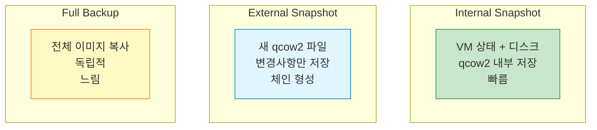
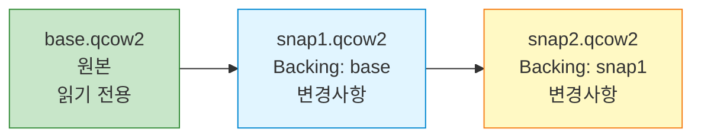
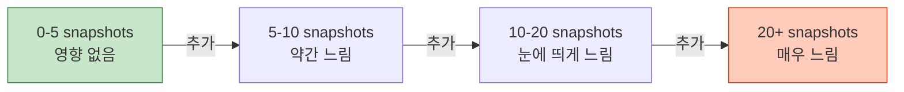

## 들어가며

실수로 VM을 망쳤을 때 이전 상태로 돌아갈 수 있다면? **스냅샷**은 VM의 특정 시점 상태를 저장하여 언제든 복원할 수 있게 합니다.

## 스냅샷 vs 백업



## Internal Snapshot

### 개념

VM 상태와 디스크를 **qcow2 파일 내부**에 저장합니다.

```bash
# VM 실행 중 스냅샷 생성
(qemu) savevm clean_install

# 스냅샷 목록
(qemu) info snapshots
ID        TAG                 VM SIZE                DATE       VM CLOCK
1         clean_install       256M     2025-01-22 10:00:00   00:05:23
2         after_updates       256M     2025-01-22 11:00:00   01:23:45

# 스냅샷 복원
(qemu) loadvm clean_install

# 스냅샷 삭제
(qemu) delvm after_updates
```

### qemu-img로 관리

```bash
# 오프라인 스냅샷 생성 (VM 꺼진 상태)
qemu-img snapshot -c snapshot1 ubuntu.qcow2

# 스냅샷 목록
qemu-img snapshot -l ubuntu.qcow2
Snapshot list:
ID        TAG                 VM SIZE                DATE       VM CLOCK
1         snapshot1                 0 B 2025-01-22 10:00:00   00:00:00.000

# 스냅샷 적용
qemu-img snapshot -a snapshot1 ubuntu.qcow2

# 스냅샷 삭제
qemu-img snapshot -d snapshot1 ubuntu.qcow2
```

### 장단점

| 장점 | 단점 |
|------|------|
| ✅ 간단 사용 | ❌ qcow2만 지원 |
| ✅ 빠른 복원 | ❌ 파일 크기 증가 |
| ✅ 관리 용이 | ❌ 성능 저하 (많을수록) |

## External Snapshot

### 개념

변경사항을 **새 qcow2 파일**에 저장하여 체인을 형성합니다.



### 생성

```bash
# External snapshot 생성
qemu-img create -f qcow2 -b ubuntu.qcow2 -F qcow2 snapshot1.qcow2

# 이제 snapshot1.qcow2 사용
qemu-system-x86_64 -hda snapshot1.qcow2 -m 2048

# 또 다른 스냅샷
qemu-img create -f qcow2 -b snapshot1.qcow2 -F qcow2 snapshot2.qcow2
```

### Backing Chain 확인

```bash
qemu-img info snapshot2.qcow2

image: snapshot2.qcow2
file format: qcow2
virtual size: 20 GiB
disk size: 196 MiB
cluster_size: 65536
backing file: snapshot1.qcow2   # ← 부모
backing file format: qcow2
```

### 체인 병합 (Commit)

```bash
# snapshot1의 변경사항을 base로 병합
qemu-img commit snapshot1.qcow2

# 병합 후 snapshot1.qcow2 삭제 가능
rm snapshot1.qcow2
```

## Live Snapshot (QMP)

### 개념

**VM 실행 중** 스냅샷을 생성합니다.

```python
# live_snapshot.py
from qmp_client import QMPClient

client = QMPClient('/tmp/qemu-qmp.sock')

# Blockdev snapshot
client.execute('blockdev-snapshot-sync',
               device='ide0-hd0',
               snapshot_file='snapshot_live.qcow2',
               format='qcow2')

print("Live snapshot created!")
```

### 스냅샷 + VM 상태 저장

```bash
# VM 상태 저장 (메모리 + CPU)
(qemu) migrate "exec:gzip -c > vm_state.gz"

# 나중에 복원
qemu-system-x86_64 \
  -hda snapshot_live.qcow2 \
  -m 2048 \
  -incoming "exec:gzip -dc vm_state.gz"
```

## 백업 전략

### 전체 백업

```bash
# VM 종료 후 전체 복사
cp ubuntu.qcow2 backup/ubuntu_$(date +%Y%m%d).qcow2

# 압축 백업
qemu-img convert -O qcow2 -c ubuntu.qcow2 backup_compressed.qcow2
```

### 증분 백업

```bash
#!/bin/bash
# incremental_backup.sh

BASE="ubuntu.qcow2"
BACKUP_DIR="backups"
DATE=$(date +%Y%m%d_%H%M%S)

# 첫 백업
if [ ! -f "$BACKUP_DIR/base.qcow2" ]; then
    cp $BASE $BACKUP_DIR/base.qcow2
    echo "Base backup created"
fi

# 증분 백업
qemu-img create -f qcow2 \
    -b $BACKUP_DIR/base.qcow2 \
    -F qcow2 \
    $BACKUP_DIR/inc_$DATE.qcow2

echo "Incremental backup created: inc_$DATE.qcow2"
```

## 자동 스냅샷

### Cron으로 자동화

```bash
# /usr/local/bin/qemu-auto-snapshot.sh
#!/bin/bash

SOCKET="/tmp/qemu-qmp.sock"
SNAPSHOT_NAME="auto_$(date +%Y%m%d_%H%M%S)"

# QMP로 스냅샷 생성
echo '{"execute": "qmp_capabilities"}' | nc -U $SOCKET
echo "{\"execute\": \"human-monitor-command\", \"arguments\": {\"command-line\": \"savevm $SNAPSHOT_NAME\"}}" | nc -U $SOCKET

# 오래된 스냅샷 삭제 (7일 이상)
# ... (구현 필요)

# crontab 설정
# 매일 2시에 스냅샷
# 0 2 * * * /usr/local/bin/qemu-auto-snapshot.sh
```

## 복원 시나리오

### 시나리오 1: 잘못된 업데이트

```bash
# 1. 업데이트 전 스냅샷
(qemu) savevm before_update

# 2. 업데이트 진행...

# 3. 문제 발생! 복원
(qemu) loadvm before_update

# VM이 업데이트 전 상태로 돌아감
```

### 시나리오 2: 테스트 환경

```bash
# Base 이미지 생성
qemu-img create -f qcow2 test_base.qcow2 20G

# 각 테스트마다 새 스냅샷
qemu-img create -f qcow2 -b test_base.qcow2 -F qcow2 test1.qcow2
qemu-img create -f qcow2 -b test_base.qcow2 -F qcow2 test2.qcow2

# 테스트 종료 후 스냅샷만 삭제
rm test1.qcow2 test2.qcow2
# base.qcow2는 그대로!
```

## 성능 고려사항

### Snapshot 개수 vs 성능



**권장**: 10개 이하 유지

### Backing Chain 길이

```bash
# Chain이 길면 성능 저하
base.qcow2 → snap1 → snap2 → snap3 → snap4  # 너무 김!

# 주기적으로 flatten
qemu-img convert -O qcow2 snap4.qcow2 flattened.qcow2
# 이제 flattened.qcow2는 독립적!
```

## 다음 단계

스냅샷 관리를 마스터했습니다! 다음 글에서는:
- **QEMU 디스크 이미지 관리**
- 이미지 포맷 변환
- 디스크 확장/축소

---

**시리즈 목차**
1-7. [이전 글들]
8. **QEMU 스냅샷과 체크포인트** ← 현재 글

> 💡 **Quick Tip**: 중요한 작업 전에는 항상 스냅샷을 만드세요. 디스크 공간이 허락하는 한 여러 시점의 스냅샷을 유지하는 것이 안전합니다!
