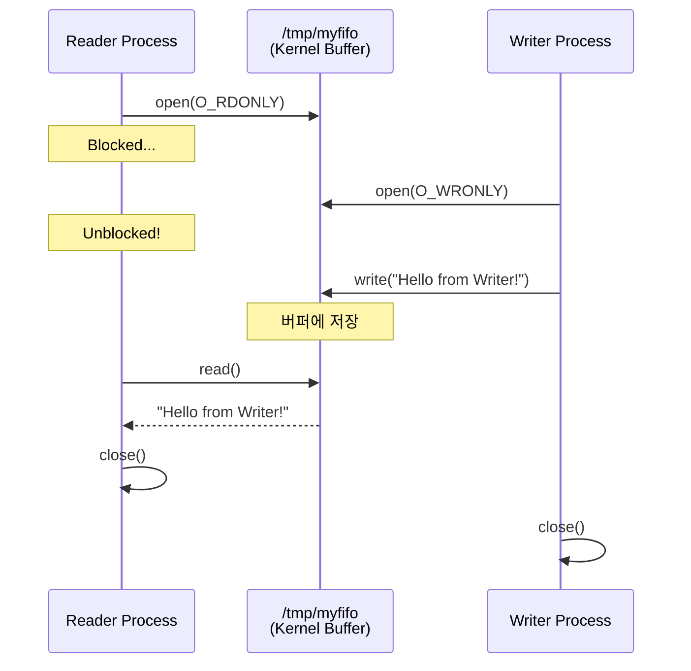
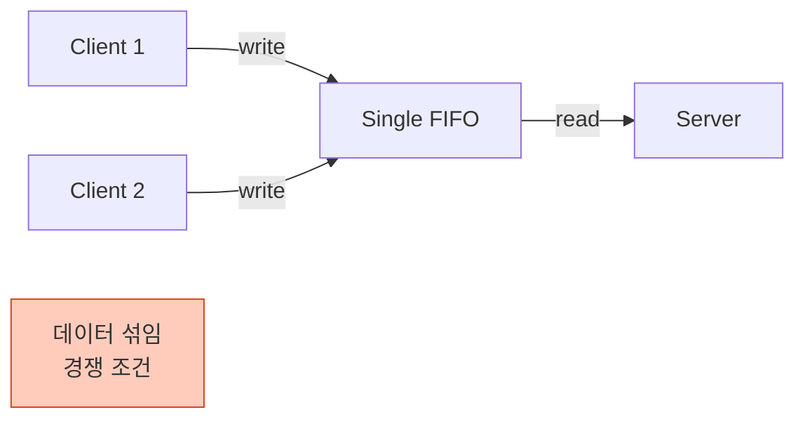

## 들어가며

일반 Pipe는 부모-자식 관계에서만 사용할 수 있습니다. 하지만 **Named Pipe(FIFO)**는 **파일시스템에 이름**을 가지므로, 완전히 무관한 프로세스도 통신할 수 있습니다.

## Named Pipe란?

### 개념

```mermaid
graph TB
    subgraph "File System"
        FIFO[/tmp/myfifo<br/>Named Pipe<br/>prw-r--r--]
    end

    PA[Process A<br/>독립 실행]
    PB[Process B<br/>독립 실행]
    PC[Process C<br/>독립 실행]

    PA -->|open & write| FIFO
    PB -->|open & read| FIFO
    PC -->|open & write| FIFO

    style FIFO fill:#fff9c4,stroke:#f57f17
    style PA fill:#e1f5ff,stroke:#0288d1
    style PB fill:#c8e6c9,stroke:#388e3c
    style PC fill:#e1f5ff,stroke:#0288d1
```

### Pipe vs Named Pipe

| 항목 | Pipe (익명) | Named Pipe (FIFO) |
|------|-------------|-------------------|
| **파일시스템** | ❌ 없음 | ✅ 있음 |
| **프로세스 관계** | 부모-자식 필수 | 무관 가능 |
| **생성 방법** | `pipe()` | `mkfifo()` |
| **사용 방법** | `read()`, `write()` | `open()`, `read()`, `write()` |
| **지속성** | 프로세스 종료 시 삭제 | 명시적 삭제 필요 |

## FIFO 생성

### Shell에서 생성

```bash
# mkfifo 명령어
mkfifo /tmp/myfifo

# 확인
ls -l /tmp/myfifo
# 출력: prw-r--r-- 1 user user 0 Jan 23 10:00 /tmp/myfifo
#      ^^^ p = pipe (FIFO)
```

### C 코드에서 생성

```c
#include <sys/stat.h>

int mkfifo(const char *pathname, mode_t mode);
```

**예제**:

```c
// FIFO 생성
if (mkfifo("/tmp/myfifo", 0666) == -1) {
    if (errno != EEXIST) {
        perror("mkfifo");
        return 1;
    }
    // 이미 존재하면 무시
}
```

### 권한 설정

```bash
# 읽기/쓰기 권한
mkfifo -m 666 /tmp/myfifo

# 소유자만 읽기/쓰기
mkfifo -m 600 /tmp/private_fifo
```

## 기본 사용법

### Writer 프로세스

```c
// writer.c
#include <stdio.h>
#include <fcntl.h>
#include <unistd.h>
#include <string.h>

int main() {
    const char *fifo_path = "/tmp/myfifo";

    // FIFO 생성 (이미 있으면 무시)
    mkfifo(fifo_path, 0666);

    // FIFO 열기 (쓰기 모드)
    int fd = open(fifo_path, O_WRONLY);
    if (fd == -1) {
        perror("open");
        return 1;
    }

    // 데이터 쓰기
    const char *msg = "Hello from Writer!";
    write(fd, msg, strlen(msg) + 1);

    printf("메시지 전송 완료\n");

    close(fd);
    return 0;
}
```

### Reader 프로세스

```c
// reader.c
#include <stdio.h>
#include <fcntl.h>
#include <unistd.h>

int main() {
    const char *fifo_path = "/tmp/myfifo";
    char buffer[100];

    // FIFO 열기 (읽기 모드)
    int fd = open(fifo_path, O_RDONLY);
    if (fd == -1) {
        perror("open");
        return 1;
    }

    // 데이터 읽기
    ssize_t n = read(fd, buffer, sizeof(buffer));
    if (n > 0) {
        printf("받은 메시지: %s\n", buffer);
    }

    close(fd);
    return 0;
}
```

### 실행

```bash
# 컴파일
gcc -o writer writer.c
gcc -o reader reader.c

# Terminal 1: Reader 먼저 실행 (대기 상태)
./reader

# Terminal 2: Writer 실행
./writer

# Terminal 1 출력:
# 받은 메시지: Hello from Writer!
```

### 동작 과정



## Blocking 동작

### 특징

- **Writer**: Reader가 없으면 `open()` 시 블록
- **Reader**: Writer가 없으면 `open()` 시 블록
- 양쪽 모두 열려야 통신 시작

### 문제 상황

```c
// ❌ Writer만 실행하면?
int fd = open("/tmp/myfifo", O_WRONLY);
// 무한 대기! (Reader가 없음)
```

### 해결: Non-blocking 모드

```c
// Writer를 non-blocking으로 열기
int fd = open("/tmp/myfifo", O_WRONLY | O_NONBLOCK);

if (fd == -1) {
    if (errno == ENXIO) {
        printf("Reader가 아직 없습니다\n");
        // 재시도 로직
    }
}
```

## 양방향 통신

### 두 개의 FIFO 사용

```mermaid
graph LR
    subgraph "Client"
        C_Write[Write Logic]
        C_Read[Read Logic]
    end

    subgraph "Server"
        S_Read[Read Logic]
        S_Write[Write Logic]
    end

    FIFO1[/tmp/fifo_req<br/>Request]
    FIFO2[/tmp/fifo_res<br/>Response]

    C_Write -->|요청| FIFO1
    FIFO1 --> S_Read
    S_Write -->|응답| FIFO2
    FIFO2 --> C_Read

    style FIFO1 fill:#e1f5ff,stroke:#0288d1
    style FIFO2 fill:#c8e6c9,stroke:#388e3c
```

### Server 코드

```c
// server.c
#include <stdio.h>
#include <fcntl.h>
#include <unistd.h>
#include <string.h>

#define FIFO_REQ "/tmp/fifo_req"
#define FIFO_RES "/tmp/fifo_res"

int main() {
    char buffer[100];

    // FIFO 생성
    mkfifo(FIFO_REQ, 0666);
    mkfifo(FIFO_RES, 0666);

    printf("서버 시작...\n");

    while (1) {
        // 요청 읽기
        int fd_req = open(FIFO_REQ, O_RDONLY);
        ssize_t n = read(fd_req, buffer, sizeof(buffer));
        close(fd_req);

        if (n > 0) {
            buffer[n] = '\0';
            printf("요청 받음: %s\n", buffer);

            // 응답 생성
            char response[100];
            snprintf(response, sizeof(response), "Echo: %s", buffer);

            // 응답 전송
            int fd_res = open(FIFO_RES, O_WRONLY);
            write(fd_res, response, strlen(response) + 1);
            close(fd_res);

            printf("응답 전송 완료\n");
        }
    }

    return 0;
}
```

### Client 코드

```c
// client.c
#include <stdio.h>
#include <fcntl.h>
#include <unistd.h>
#include <string.h>

#define FIFO_REQ "/tmp/fifo_req"
#define FIFO_RES "/tmp/fifo_res"

int main(int argc, char *argv[]) {
    if (argc < 2) {
        printf("Usage: %s <message>\n", argv[0]);
        return 1;
    }

    char buffer[100];

    // 요청 전송
    int fd_req = open(FIFO_REQ, O_WRONLY);
    write(fd_req, argv[1], strlen(argv[1]) + 1);
    close(fd_req);

    printf("요청 전송: %s\n", argv[1]);

    // 응답 받기
    int fd_res = open(FIFO_RES, O_RDONLY);
    read(fd_res, buffer, sizeof(buffer));
    close(fd_res);

    printf("응답 받음: %s\n", buffer);

    return 0;
}
```

### 실행

```bash
# Terminal 1: Server
./server

# Terminal 2: Client
./client "Hello Server"

# Server 출력:
# 요청 받음: Hello Server
# 응답 전송 완료

# Client 출력:
# 요청 전송: Hello Server
# 응답 받음: Echo: Hello Server
```

## 다중 클라이언트 처리

### 문제점



### 해결책 1: 원자적 쓰기 보장

```c
// 512 bytes 이하는 원자적 보장 (POSIX)
char msg[512];
snprintf(msg, sizeof(msg), "Client %d: %s", getpid(), data);
write(fifo_fd, msg, strlen(msg));
```

### 해결책 2: 클라이언트별 FIFO

```mermaid
graph TB
    Server[Server]

    FIFO1[/tmp/fifo_client1]
    FIFO2[/tmp/fifo_client2]
    FIFO3[/tmp/fifo_client3]

    C1[Client 1]
    C2[Client 2]
    C3[Client 3]

    C1 --> FIFO1
    C2 --> FIFO2
    C3 --> FIFO3

    FIFO1 --> Server
    FIFO2 --> Server
    FIFO3 --> Server

    style FIFO1 fill:#e1f5ff,stroke:#0288d1
    style FIFO2 fill:#c8e6c9,stroke:#388e3c
    style FIFO3 fill:#fff9c4,stroke:#f57f17
```

```c
// 클라이언트별 FIFO 생성
char fifo_path[100];
snprintf(fifo_path, sizeof(fifo_path), "/tmp/fifo_%d", getpid());
mkfifo(fifo_path, 0666);
```

## 실전 예제: 간단한 로그 서버

### 로그 서버

```c
// log_server.c
#include <stdio.h>
#include <fcntl.h>
#include <unistd.h>
#include <time.h>
#include <string.h>

#define LOG_FIFO "/tmp/log_fifo"
#define LOG_FILE "/tmp/app.log"

int main() {
    mkfifo(LOG_FIFO, 0666);

    FILE *logfile = fopen(LOG_FILE, "a");
    if (!logfile) {
        perror("fopen");
        return 1;
    }

    printf("로그 서버 시작...\n");

    while (1) {
        int fd = open(LOG_FIFO, O_RDONLY);
        char buffer[1024];

        ssize_t n = read(fd, buffer, sizeof(buffer) - 1);
        if (n > 0) {
            buffer[n] = '\0';

            // 타임스탬프 추가
            time_t now = time(NULL);
            char *timestamp = ctime(&now);
            timestamp[strlen(timestamp) - 1] = '\0';  // '\n' 제거

            // 로그 파일에 기록
            fprintf(logfile, "[%s] %s\n", timestamp, buffer);
            fflush(logfile);

            printf("로그 기록: %s\n", buffer);
        }

        close(fd);
    }

    fclose(logfile);
    return 0;
}
```

### 로그 클라이언트

```bash
#!/bin/bash
# log_client.sh

LOG_FIFO="/tmp/log_fifo"

# 로그 메시지 전송
echo "$1" > $LOG_FIFO
```

### 실행

```bash
# Terminal 1: Server
./log_server

# Terminal 2: 여러 클라이언트
./log_client.sh "Application started"
./log_client.sh "User logged in"
./log_client.sh "Error: Connection timeout"

# /tmp/app.log 내용:
# [Wed Jan 23 14:30:00 2025] Application started
# [Wed Jan 23 14:30:05 2025] User logged in
# [Wed Jan 23 14:30:10 2025] Error: Connection timeout
```

## 성능 및 한계

### 버퍼 크기

```bash
# Linux에서 FIFO 버퍼 크기 (일반적으로 Pipe와 동일)
cat /proc/sys/fs/pipe-max-size
# 출력: 1048576 (1MB)
```

### 성능 비교

| IPC 메커니즘 | 1MB 데이터 전송 | 지연 시간 |
|--------------|-----------------|-----------|
| Named Pipe | 3ms | 낮음 |
| Unix Socket | 4ms | 낮음 |
| TCP Socket (localhost) | 10ms | 중간 |
| Message Queue | 8ms | 중간 |

### 한계

1. **로컬 전용**: 네트워크 통신 불가
2. **버퍼 제한**: 대용량 데이터는 Shared Memory 사용
3. **순서 보장 없음**: 여러 Writer 시 메시지 섞임 가능

## 정리 및 삭제

### FIFO 삭제

```bash
# Shell에서
rm /tmp/myfifo

# C 코드에서
unlink("/tmp/myfifo");
```

### 자동 정리

```c
// 프로그램 종료 시 자동 삭제
#include <stdlib.h>

void cleanup() {
    unlink("/tmp/myfifo");
}

int main() {
    atexit(cleanup);  // 종료 시 cleanup 호출

    mkfifo("/tmp/myfifo", 0666);
    // ...
}
```

## Named Pipe vs Unix Socket

| 항목 | Named Pipe | Unix Socket |
|------|------------|-------------|
| **복잡도** | 간단 | 중간 |
| **양방향** | 2개 필요 | 1개로 가능 |
| **다중 클라이언트** | 어려움 | 쉬움 (accept) |
| **네트워크 확장** | 불가 | 가능 (TCP로 전환) |
| **사용 사례** | 간단한 로컬 IPC | 복잡한 서버-클라이언트 |

## 다음 단계

Named Pipe를 완전히 이해했습니다! 다음 글에서는:
- **Signal** - 비동기 이벤트 처리
- Signal handler 작성
- 실시간 신호 처리

---

**시리즈 목차**
1. IPC란 무엇인가 - 프로세스 간 통신의 필요성
2. IPC 메커니즘 전체 개요 - 7가지 방식 비교
3. Pipe - 가장 기본적인 IPC
4. **Named Pipe (FIFO) - 이름 있는 파이프** ← 현재 글
5. Signal - 비동기 이벤트 통신 (다음 글)

> 💡 **Quick Tip**: Named Pipe는 간단한 서버-클라이언트 구조에 적합합니다. 복잡한 다중 클라이언트 처리가 필요하다면 Unix Socket을 고려하세요!
