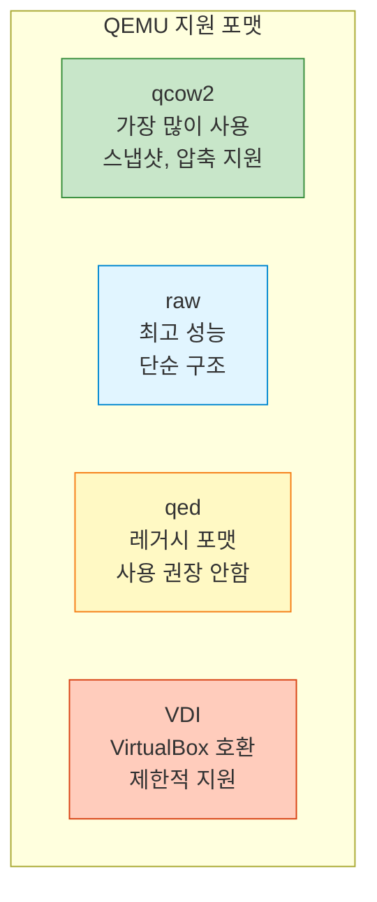
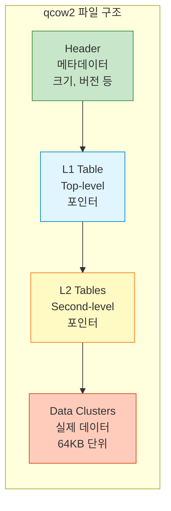

## 들어가며

QEMU는 다양한 디스크 이미지 포맷을 지원합니다. **올바른 포맷 선택**과 효율적인 관리는 성능과 저장 공간에 직접적인 영향을 미칩니다.

## 디스크 이미지 포맷



### 포맷 비교

| 포맷 | 스냅샷 | 압축 | 암호화 | Thin Provisioning | 성능 | 사용처 |
|------|--------|------|--------|-------------------|------|--------|
| **qcow2** | ✅ | ✅ | ✅ | ✅ | ⭐⭐⭐⭐ | 일반적 용도 |
| **raw** | ❌ | ❌ | ❌ | ❌ | ⭐⭐⭐⭐⭐ | 성능 중요 환경 |
| **qed** | ✅ | ❌ | ❌ | ✅ | ⭐⭐⭐ | 레거시 (비권장) |
| **VDI** | ❌ | ❌ | ❌ | ✅ | ⭐⭐⭐ | VirtualBox 호환 |

## qcow2 포맷

### 특징

**QEMU Copy-On-Write 2** - QEMU의 기본이자 가장 강력한 포맷입니다.

```bash
# qcow2 이미지 생성
qemu-img create -f qcow2 ubuntu.qcow2 20G

Formatting 'ubuntu.qcow2', fmt=qcow2 size=21474836480 cluster_size=65536

# 실제 디스크 사용량 확인
ls -lh ubuntu.qcow2
-rw-r--r-- 1 user user 196K Jan 23 10:00 ubuntu.qcow2
# 20GB를 할당했지만 실제로는 196KB만 사용!
```

### qcow2 내부 구조



### qcow2 고급 옵션

```bash
# 압축 활성화
qemu-img create -f qcow2 -o compression_type=zstd ubuntu.qcow2 20G

# 암호화 (LUKS)
qemu-img create -f qcow2 -o encrypt.format=luks,encrypt.key-secret=sec0 encrypted.qcow2 20G

# Cluster 크기 조정 (기본 64KB)
qemu-img create -f qcow2 -o cluster_size=128K large_cluster.qcow2 20G

# Lazy refcount (성능 향상, 안정성 감소)
qemu-img create -f qcow2 -o lazy_refcounts=on fast.qcow2 20G
```

### qcow2 정보 확인

```bash
qemu-img info ubuntu.qcow2

image: ubuntu.qcow2
file format: qcow2
virtual size: 20 GiB (21474836480 bytes)
disk size: 2.5 GiB                    # 실제 사용 중인 크기
cluster_size: 65536
Format specific information:
    compat: 1.1
    compression type: zlib
    lazy refcounts: false
    refcount bits: 16
    corrupt: false
    extended l2: false
```

## raw 포맷

### 특징

가장 단순하고 **빠른 성능**을 제공합니다.

```bash
# raw 이미지 생성
qemu-img create -f raw disk.raw 20G

# 실제 크기 확인
ls -lh disk.raw
-rw-r--r-- 1 user user 20G Jan 23 10:05 disk.raw
# 20GB 전체를 즉시 할당!
```

### Thin vs Thick Provisioning

```bash
# Thick Provisioning (즉시 할당)
qemu-img create -f raw disk.raw 20G

# Thin Provisioning (Sparse 파일)
qemu-img create -f raw -o preallocation=off sparse.raw 20G
truncate -s 20G sparse.raw  # 더 빠른 방법

# 실제 사용량 확인
du -sh sparse.raw
0       sparse.raw
# 공간을 예약만 하고 실제로는 사용하지 않음
```

### raw 성능 최적화

```bash
# VM 실행 시 Direct I/O 사용
qemu-system-x86_64 \
  -drive file=disk.raw,format=raw,cache=none,aio=native \
  -m 2048

# cache=none: 호스트 페이지 캐시 우회
# aio=native: Linux native async I/O 사용
```

## 이미지 포맷 변환

### qcow2 → raw

```bash
# 변환
qemu-img convert -f qcow2 -O raw ubuntu.qcow2 ubuntu.raw

# 진행상황 표시
qemu-img convert -f qcow2 -O raw -p ubuntu.qcow2 ubuntu.raw
    (100.00/100%)

# 압축하며 변환 (raw는 압축 지원 안함)
# 대신 gzip 사용
gzip -c ubuntu.raw > ubuntu.raw.gz
```

### raw → qcow2

```bash
# 기본 변환
qemu-img convert -f raw -O qcow2 ubuntu.raw ubuntu.qcow2

# 압축 변환 (디스크 공간 절약)
qemu-img convert -f raw -O qcow2 -c ubuntu.raw ubuntu_compressed.qcow2

# 크기 비교
ls -lh ubuntu.raw ubuntu.qcow2 ubuntu_compressed.qcow2
-rw-r--r-- 1 user user  20G Jan 23 10:00 ubuntu.raw
-rw-r--r-- 1 user user 5.2G Jan 23 10:05 ubuntu.qcow2
-rw-r--r-- 1 user user 3.1G Jan 23 10:10 ubuntu_compressed.qcow2
```

### VDI/VMDK 변환

```bash
# VirtualBox VDI → qcow2
qemu-img convert -f vdi -O qcow2 virtualbox.vdi qemu.qcow2

# VMware VMDK → qcow2
qemu-img convert -f vmdk -O qcow2 vmware.vmdk qemu.qcow2

# qcow2 → VMDK (VMware 호환)
qemu-img convert -f qcow2 -O vmdk qemu.qcow2 vmware.vmdk
```

## 디스크 크기 조정

### 디스크 확장


```bash
# 1. 이미지 크기 확장 (오프라인)
qemu-img resize ubuntu.qcow2 +10G
Image resized.

# 절대 크기 지정
qemu-img resize ubuntu.qcow2 30G

# 2. VM 부팅 후 파티션 확인
sudo fdisk -l /dev/sda
Disk /dev/sda: 30 GiB

# 3. 파티션 확장 (예: /dev/sda1)
sudo growpart /dev/sda 1

# 4. 파일시스템 확장
# ext4
sudo resize2fs /dev/sda1

# xfs
sudo xfs_growfs /

# 확인
df -h
```

### 디스크 축소 (주의!)

```bash
# ⚠️ 데이터 손실 위험! 백업 필수!

# 1. VM 내부에서 파일시스템 축소 (ext4 예시)
sudo e2fsck -f /dev/sda1
sudo resize2fs /dev/sda1 15G

# 2. 파티션 축소 (fdisk/parted 사용)

# 3. 이미지 축소
qemu-img resize --shrink ubuntu.qcow2 20G
```

## 디스크 최적화

### qcow2 압축 (Compact)

```bash
# 사용하지 않는 공간 회수
qemu-img convert -O qcow2 -c ubuntu.qcow2 ubuntu_compacted.qcow2

# 원본 교체
mv ubuntu_compacted.qcow2 ubuntu.qcow2

# Before/After 비교
# Before: 10GB
# After:  3.5GB (사용 중인 데이터만)
```

### VM 내부 최적화

```bash
# Linux: 빈 공간 0으로 채우기
sudo dd if=/dev/zero of=/zero bs=1M
rm /zero

# Windows: sdelete
sdelete -z C:

# 그 후 qemu-img convert로 압축
qemu-img convert -O qcow2 -c disk.qcow2 disk_clean.qcow2
```

### Backing File 체인 병합

```bash
# 체인 구조
# base.qcow2 → snap1.qcow2 → snap2.qcow2

# snap1의 변경사항을 base에 병합
qemu-img commit snap1.qcow2

# 또는 전체 체인을 하나로 합치기
qemu-img convert -O qcow2 snap2.qcow2 flattened.qcow2
# flattened.qcow2는 독립적인 단일 파일
```

## 디스크 검사 및 복구

### 이미지 무결성 검사

```bash
# qcow2 무결성 검사
qemu-img check ubuntu.qcow2

No errors were found on the image.
Image end offset: 5368709120

# 자세한 정보
qemu-img check -r all ubuntu.qcow2
# -r all: 발견된 문제 자동 복구 시도
```

### 손상된 이미지 복구

```bash
# Leak 복구
qemu-img check -r leaks ubuntu.qcow2

# 모든 오류 복구 시도
qemu-img check -r all ubuntu.qcow2

# 복구 불가능한 경우: 복사 시도
qemu-img convert -f qcow2 -O qcow2 broken.qcow2 recovered.qcow2
```

## 고급 기능

### 외부 데이터 파일

```bash
# qcow2 메타데이터와 데이터 분리
qemu-img create -f qcow2 \
  -o data_file=data.raw,data_file_raw=on \
  ubuntu.qcow2 20G

# 장점: SSD에 메타데이터, HDD에 데이터 저장 가능
```

### Read-only 이미지

```bash
# 읽기 전용 베이스 이미지
qemu-system-x86_64 \
  -drive file=base.qcow2,readonly=on \
  -m 2048
```

### 이미지 비교

```bash
# 두 이미지 비교
qemu-img compare image1.qcow2 image2.qcow2

# 출력:
# Images are identical.
# 또는
# Content mismatch at offset ...
```

## 실전 스크립트

### 자동 백업 및 압축

```bash
#!/bin/bash
# disk_backup.sh

SOURCE="ubuntu.qcow2"
BACKUP_DIR="backups"
DATE=$(date +%Y%m%d_%H%M%S)
BACKUP="$BACKUP_DIR/ubuntu_$DATE.qcow2"

mkdir -p $BACKUP_DIR

# 압축 백업
echo "Creating compressed backup..."
qemu-img convert -O qcow2 -c -p $SOURCE $BACKUP

# 오래된 백업 삭제 (7일 이상)
find $BACKUP_DIR -name "ubuntu_*.qcow2" -mtime +7 -delete

echo "Backup complete: $BACKUP"
ls -lh $BACKUP
```

### 디스크 정리 자동화

```bash
#!/bin/bash
# disk_cleanup.sh

DISK="ubuntu.qcow2"
TEMP="temp_clean.qcow2"

echo "Original size:"
du -sh $DISK

echo "Compacting..."
qemu-img convert -O qcow2 -c -p $DISK $TEMP

echo "Replacing..."
mv $TEMP $DISK

echo "New size:"
du -sh $DISK
```

## 성능 벤치마크

### 포맷별 성능 비교

```bash
# fio로 성능 측정
#!/bin/bash

for format in raw qcow2; do
  echo "Testing $format..."

  qemu-system-x86_64 \
    -drive file=test.$format,format=$format \
    -m 2048 \
    -nographic \
    -kernel vmlinuz \
    -append "console=ttyS0" &

  PID=$!
  sleep 30

  # fio 벤치마크 실행
  # (VM 내부에서)

  kill $PID
done
```

### 결과 예시

| 포맷 | Sequential Read | Sequential Write | Random Read | Random Write |
|------|-----------------|------------------|-------------|--------------|
| raw | 1200 MB/s | 800 MB/s | 450 MB/s | 350 MB/s |
| qcow2 | 1100 MB/s | 750 MB/s | 420 MB/s | 320 MB/s |
| qcow2 (compressed) | 900 MB/s | 600 MB/s | 350 MB/s | 280 MB/s |

## 다음 단계

디스크 이미지 관리를 마스터했습니다! 다음 글에서는:
- **Live Migration** 구현
- TCP/Unix Socket 마이그레이션
- 공유 스토리지 활용

---

**시리즈 목차**
1-8. [이전 글들]
9. **QEMU 디스크 이미지 관리** ← 현재 글

> 💡 **Quick Tip**: 프로덕션 환경에서는 정기적으로 `qemu-img check`를 실행하여 이미지 무결성을 검사하세요. 손상된 이미지는 조기 발견이 중요합니다!
