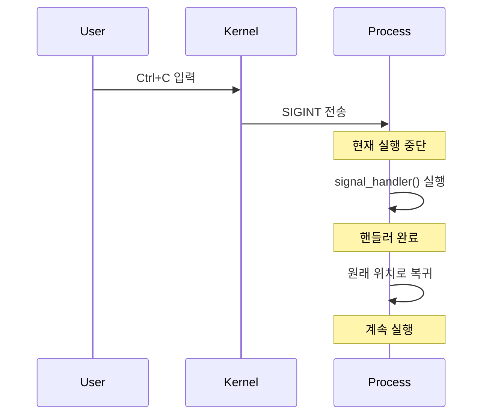
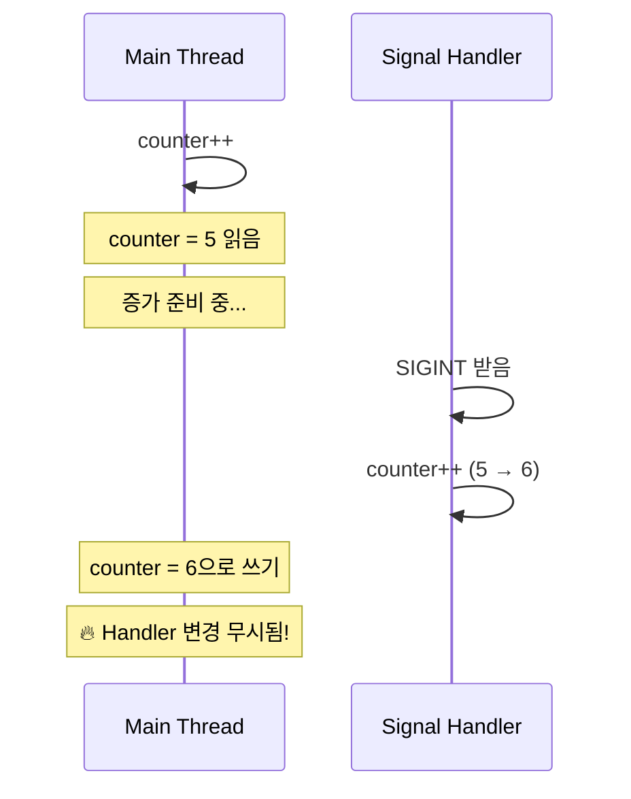
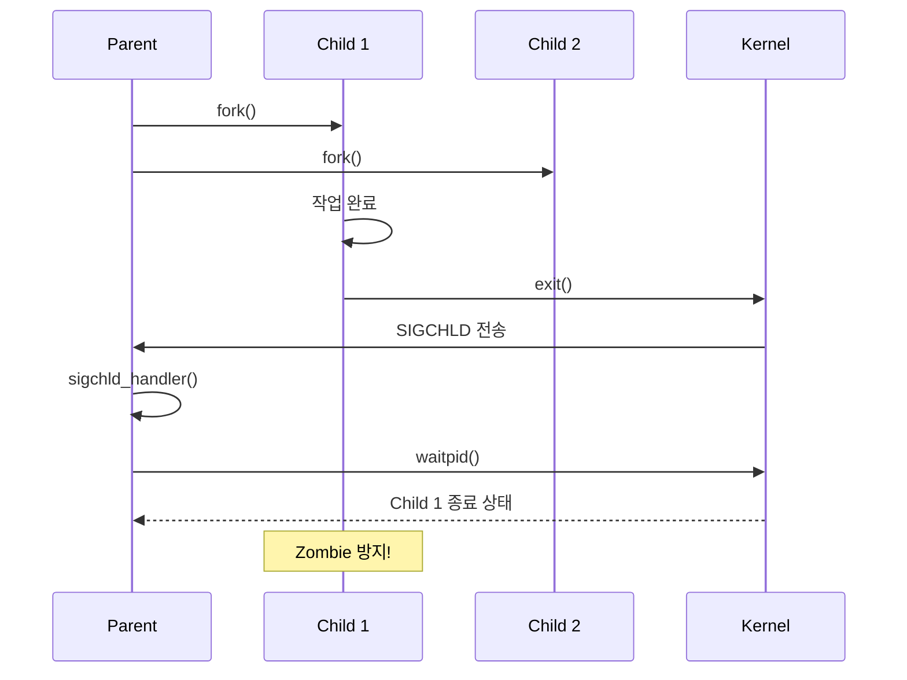
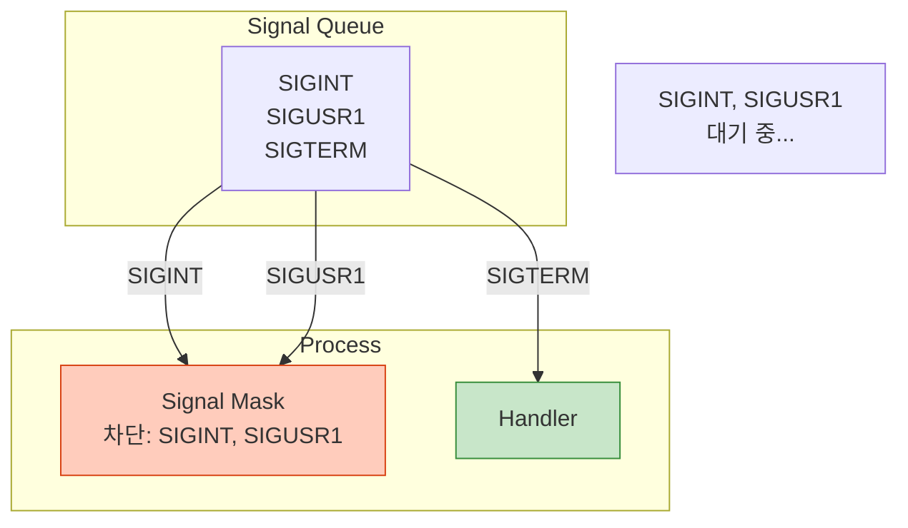

## 들어가며

**Signal**은 다른 IPC와 다릅니다. 데이터를 전송하는 것이 아니라, **비동기 이벤트**를 알립니다. Ctrl+C를 누르면 프로그램이 종료되는 것도 Signal 덕분입니다.

## Signal이란?

### 개념

```mermaid
graph TB
    subgraph "Signal Sources"
        KB[키보드<br/>Ctrl+C]
        Kernel[커널<br/>Segmentation Fault]
        Process[다른 프로세스<br/>kill()]
    end

    subgraph "Target Process"
        Handler[Signal Handler]
        Default[기본 동작]
        Ignore[무시]
    end

    KB -->|SIGINT| Handler
    Kernel -->|SIGSEGV| Default
    Process -->|SIGUSR1| Handler

    style Handler fill:#c8e6c9,stroke:#388e3c
    style Default fill:#ffccbc,stroke:#d84315
    style Ignore fill:#e0e0e0,stroke:#9e9e9e
```

### 특징

- **비동기**: 언제든지 발생 가능
- **인터럽트**: 프로그램 실행 중단
- **숫자**: 신호 번호만 전달 (데이터 X)
- **핸들러**: 사용자 정의 처리 가능

## 주요 Signal 목록

```mermaid
graph TB
    Signals[Unix Signals]

    subgraph "종료 신호"
        SIGINT[SIGINT 2<br/>Ctrl+C]
        SIGTERM[SIGTERM 15<br/>정상 종료]
        SIGKILL[SIGKILL 9<br/>강제 종료]
        SIGQUIT[SIGQUIT 3<br/>Ctrl+\]
    end

    subgraph "에러 신호"
        SIGSEGV[SIGSEGV 11<br/>Segmentation Fault]
        SIGFPE[SIGFPE 8<br/>Division by Zero]
        SIGILL[SIGILL 4<br/>Illegal Instruction]
    end

    subgraph "사용자 정의"
        SIGUSR1[SIGUSR1 10<br/>User Defined 1]
        SIGUSR2[SIGUSR2 12<br/>User Defined 2]
    end

    subgraph "기타"
        SIGCHLD[SIGCHLD 17<br/>Child Terminated]
        SIGALRM[SIGALRM 14<br/>Alarm Timer]
    end

    Signals --> SIGINT
    Signals --> SIGTERM
    Signals --> SIGKILL
    Signals --> SIGQUIT
    Signals --> SIGSEGV
    Signals --> SIGFPE
    Signals --> SIGILL
    Signals --> SIGUSR1
    Signals --> SIGUSR2
    Signals --> SIGCHLD
    Signals --> SIGALRM

    style SIGKILL fill:#ffccbc,stroke:#d84315
    style SIGSEGV fill:#ffccbc,stroke:#d84315
    style SIGUSR1 fill:#c8e6c9,stroke:#388e3c
    style SIGUSR2 fill:#c8e6c9,stroke:#388e3c
```



### 상세 목록

| Signal | 번호 | 발생 원인 | 기본 동작 | 처리 가능 |
|--------|------|-----------|-----------|-----------|
| **SIGHUP** | 1 | 터미널 연결 끊김 | 종료 | ✅ |
| **SIGINT** | 2 | Ctrl+C | 종료 | ✅ |
| **SIGQUIT** | 3 | Ctrl+\ | 종료 + Core dump | ✅ |
| **SIGILL** | 4 | 잘못된 명령어 | 종료 + Core dump | ✅ |
| **SIGFPE** | 8 | 0으로 나누기 | 종료 + Core dump | ✅ |
| **SIGKILL** | 9 | 강제 종료 | 종료 | ❌ |
| **SIGSEGV** | 11 | 잘못된 메모리 접근 | 종료 + Core dump | ✅ |
| **SIGTERM** | 15 | 정상 종료 요청 | 종료 | ✅ |
| **SIGCHLD** | 17 | 자식 프로세스 종료 | 무시 | ✅ |

## Signal Handler 작성

### 기본 사용법

```c
#include <signal.h>

void signal_handler(int signum) {
    printf("Signal %d 받음\n", signum);
}

int main() {
    // SIGINT (Ctrl+C) 핸들러 등록
    signal(SIGINT, signal_handler);

    while (1) {
        printf("실행 중... (Ctrl+C로 종료)\n");
        sleep(1);
    }

    return 0;
}
```

### 실행

```bash
gcc -o signal_basic signal_basic.c
./signal_basic

# 출력:
# 실행 중... (Ctrl+C로 종료)
# 실행 중... (Ctrl+C로 종료)
# ^CSignal 2 받음
# 실행 중... (Ctrl+C로 종료)
```

### 동작 과정



## 안전한 Signal Handler

### 문제점: 재진입성 (Reentrancy)

```c
// ❌ 위험한 코드
int counter = 0;

void handler(int sig) {
    printf("Signal %d, counter=%d\n", sig, counter);
    counter++;  // 🔥 경쟁 조건!
}

int main() {
    signal(SIGINT, handler);

    while (1) {
        counter++;
        usleep(100);
    }
}
```

### 문제 시나리오



### 해결책 1: Async-Signal-Safe 함수만 사용

**안전한 함수**:
- `write()`, `read()`
- `_exit()`
- `signal()`, `sigaction()`

**위험한 함수** (사용 금지):
- `printf()`, `malloc()`, `free()`
- 대부분의 표준 라이브러리 함수

### 해결책 2: Atomic Flag

```c
#include <signal.h>
#include <stdatomic.h>

atomic_bool signal_received = false;

void handler(int sig) {
    signal_received = true;  // ✅ 원자적 연산
}

int main() {
    signal(SIGINT, handler);

    while (!signal_received) {
        // 메인 로직
        sleep(1);
    }

    printf("종료 처리...\n");
    return 0;
}
```

## sigaction: 안전한 Signal 처리

### signal() vs sigaction()

| 항목 | signal() | sigaction() |
|------|----------|-------------|
| **이식성** | 구현마다 다름 | POSIX 표준 |
| **안전성** | 낮음 | 높음 |
| **기능** | 제한적 | 풍부 |
| **권장** | ❌ | ✅ |

### sigaction 사용법

```c
#include <signal.h>

void handler(int sig, siginfo_t *info, void *context) {
    write(STDOUT_FILENO, "SIGINT received\n", 16);
}

int main() {
    struct sigaction sa;

    // 핸들러 설정
    sa.sa_sigaction = handler;
    sa.sa_flags = SA_SIGINFO;  // siginfo_t 사용
    sigemptyset(&sa.sa_mask);  // 블록할 신호 없음

    // SIGINT 핸들러 등록
    sigaction(SIGINT, &sa, NULL);

    while (1) {
        pause();  // 신호 대기
    }

    return 0;
}
```

### siginfo_t 활용

```c
void handler(int sig, siginfo_t *info, void *context) {
    char buf[100];

    // 신호 보낸 프로세스 정보
    int len = snprintf(buf, sizeof(buf),
        "Signal %d from PID %d\n",
        sig, info->si_pid);

    write(STDOUT_FILENO, buf, len);
}
```

## 실전 예제: Graceful Shutdown

### 문제

```bash
# 프로그램 강제 종료 시 정리 작업 없음
$ ./myapp
^C  # 🔥 데이터 손실, 리소스 누수
```

### 해결: SIGTERM/SIGINT 처리

```c
// graceful_shutdown.c
#include <stdio.h>
#include <signal.h>
#include <stdbool.h>
#include <unistd.h>

volatile sig_atomic_t shutdown_requested = 0;

void shutdown_handler(int sig) {
    shutdown_requested = 1;
}

int main() {
    // SIGTERM, SIGINT 핸들러 등록
    signal(SIGTERM, shutdown_handler);
    signal(SIGINT, shutdown_handler);

    printf("서버 시작 (PID: %d)\n", getpid());

    while (!shutdown_requested) {
        printf("작업 중...\n");
        sleep(1);
    }

    // 정리 작업
    printf("\n종료 신호 받음. 정리 중...\n");
    printf("데이터베이스 연결 종료\n");
    printf("파일 저장 완료\n");
    printf("안전하게 종료됨\n");

    return 0;
}
```

### 실행

```bash
./graceful_shutdown

# 출력:
# 서버 시작 (PID: 12345)
# 작업 중...
# 작업 중...
# ^C
# 종료 신호 받음. 정리 중...
# 데이터베이스 연결 종료
# 파일 저장 완료
# 안전하게 종료됨
```

## 타이머 Signal: SIGALRM

### alarm() 사용

```c
#include <signal.h>
#include <unistd.h>

void timeout_handler(int sig) {
    printf("시간 초과!\n");
    exit(1);
}

int main() {
    signal(SIGALRM, timeout_handler);

    // 5초 후 SIGALRM 발생
    alarm(5);

    printf("5초 안에 작업 완료해야 함...\n");
    sleep(10);  // 10초 대기 (5초에 종료됨)

    printf("이 줄은 실행 안 됨\n");
    return 0;
}
```

### 타임아웃 패턴

```c
// 네트워크 요청에 타임아웃 적용
alarm(10);  // 10초 타임아웃

int result = slow_network_call();

alarm(0);  // 타이머 취소

if (result == -1 && errno == EINTR) {
    printf("타임아웃 발생\n");
}
```

## 자식 프로세스 관리: SIGCHLD

### Zombie 프로세스 방지

```c
#include <signal.h>
#include <sys/wait.h>

void sigchld_handler(int sig) {
    // 모든 종료된 자식 프로세스 회수
    while (waitpid(-1, NULL, WNOHANG) > 0);
}

int main() {
    signal(SIGCHLD, sigchld_handler);

    // 자식 프로세스 생성
    for (int i = 0; i < 5; i++) {
        if (fork() == 0) {
            // 자식
            sleep(i);
            exit(0);
        }
    }

    // 부모는 계속 실행
    while (1) {
        printf("부모 작업 중...\n");
        sleep(1);
    }

    return 0;
}
```

### 동작 과정



## Signal Masking (차단)

### 개념



### 사용법

```c
#include <signal.h>

int main() {
    sigset_t mask, oldmask;

    // Signal set 초기화
    sigemptyset(&mask);
    sigaddset(&mask, SIGINT);
    sigaddset(&mask, SIGUSR1);

    // Signal 차단
    sigprocmask(SIG_BLOCK, &mask, &oldmask);

    // 이 구간에서는 SIGINT, SIGUSR1 무시됨
    printf("Critical section...\n");
    sleep(5);

    // Signal 차단 해제
    sigprocmask(SIG_SETMASK, &oldmask, NULL);

    // 쌓인 신호 전달됨
    printf("Signal handling resumed\n");

    return 0;
}
```

## 실시간 Signal (POSIX)

### 일반 vs 실시간 Signal

| 항목 | 일반 Signal | 실시간 Signal |
|------|-------------|---------------|
| **범위** | 1-31 | 32-64 (SIGRTMIN ~ SIGRTMAX) |
| **큐잉** | ❌ 중복 무시 | ✅ 모두 큐잉 |
| **데이터 전송** | ❌ | ✅ (sigqueue) |
| **순서 보장** | ❌ | ✅ |

### 사용 예

```c
// 실시간 Signal 전송 (데이터 포함)
union sigval value;
value.sival_int = 42;

sigqueue(pid, SIGRTMIN, value);

// 핸들러에서 데이터 받기
void rt_handler(int sig, siginfo_t *info, void *context) {
    printf("Received value: %d\n", info->si_value.sival_int);
}
```

## 다음 단계

Signal의 핵심 개념을 완전히 이해했습니다! IPC 시리즈를 마쳤으므로, 다음 시리즈에서는:
- **ZeroMQ** - 고수준 메시징 라이브러리
- 분산 시스템 통신
- 다양한 메시징 패턴

---

**시리즈 목차**
1. IPC란 무엇인가 - 프로세스 간 통신의 필요성
2. IPC 메커니즘 전체 개요 - 7가지 방식 비교
3. Pipe - 가장 기본적인 IPC
4. Named Pipe (FIFO) - 이름 있는 파이프
5. **Signal - 비동기 이벤트 통신** ← 현재 글

> 💡 **Quick Tip**: Signal handler에서는 async-signal-safe 함수만 사용하세요. `printf()`는 위험하며, `write()`를 사용해야 합니다!
