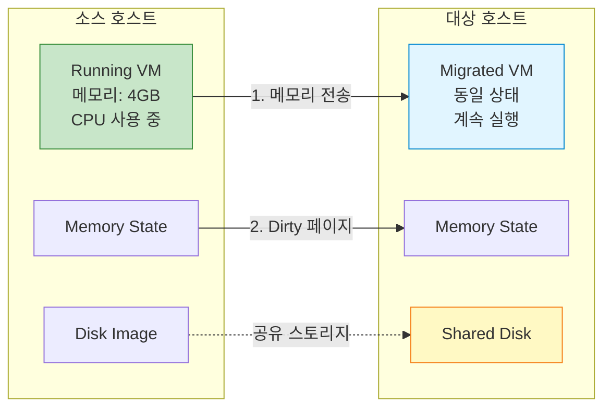
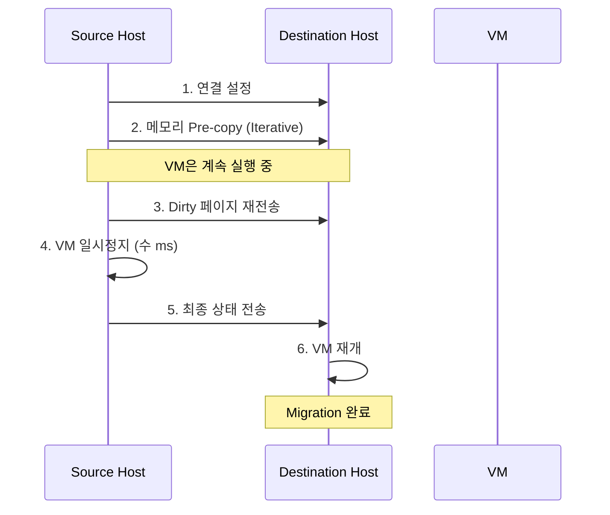
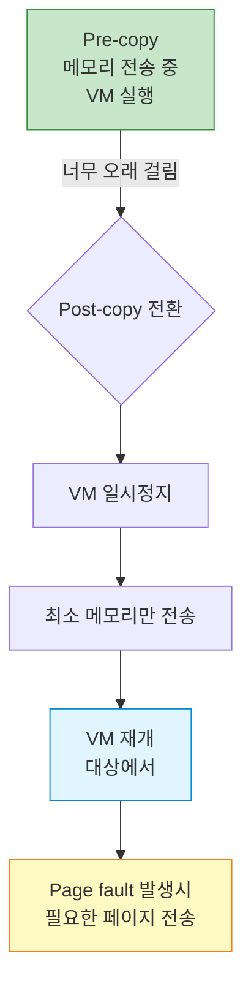

## 들어가며

서버를 재부팅해야 하는데 VM은 계속 실행되어야 한다면? **Live Migration**은 실행 중인 VM을 다른 호스트로 이동시켜 무중단 서비스를 가능하게 합니다.

## Live Migration 개념



### Migration 단계



## Migration 유형

### 1. Shared Storage Migration

```bash
# 공유 스토리지 (NFS, iSCSI 등) 사용
# 디스크는 이동하지 않고 메모리만 전송

# 소스 호스트
qemu-system-x86_64 \
  -drive file=/shared/ubuntu.qcow2,format=qcow2 \
  -m 4096 \
  -enable-kvm \
  -qmp unix:/tmp/qmp-source.sock,server,nowait

# QMP로 마이그레이션 시작
echo '{"execute": "qmp_capabilities"}' | nc -U /tmp/qmp-source.sock
echo '{"execute": "migrate", "arguments": {"uri": "tcp:destination:4444"}}' | nc -U /tmp/qmp-source.sock

# 대상 호스트 (먼저 준비)
qemu-system-x86_64 \
  -drive file=/shared/ubuntu.qcow2,format=qcow2 \
  -m 4096 \
  -enable-kvm \
  -incoming tcp:0.0.0.0:4444
```

### 2. Block Migration

```bash
# 공유 스토리지 없이 디스크까지 전송
# 느리지만 독립적 마이그레이션

# 소스
echo '{"execute": "migrate", "arguments": {"uri": "tcp:destination:4444", "blk": true, "inc": true}}' | nc -U /tmp/qmp-source.sock

# blk: true - 블록 디바이스도 마이그레이션
# inc: true - 증분 복사 (dirty 블록만)
```

### 3. Unix Socket Migration

```bash
# 같은 호스트에서 테스트용

# 대상 준비
qemu-system-x86_64 \
  -drive file=ubuntu.qcow2,format=qcow2 \
  -m 2048 \
  -incoming unix:/tmp/migrate.sock

# 소스에서 마이그레이션
(qemu) migrate unix:/tmp/migrate.sock
```

## 실전 Migration 구현

### 기본 TCP Migration

```bash
# === 대상 호스트 (destination) ===
# 1. Incoming 모드로 VM 시작
qemu-system-x86_64 \
  -name "ubuntu-migrate" \
  -drive file=/shared/ubuntu.qcow2,format=qcow2 \
  -m 4096 \
  -smp 2 \
  -enable-kvm \
  -netdev tap,id=net0,ifname=tap0,script=no \
  -device virtio-net-pci,netdev=net0 \
  -incoming tcp:0.0.0.0:4444 \
  -qmp unix:/tmp/qmp-dest.sock,server,nowait

# VM은 대기 상태


# === 소스 호스트 (source) ===
# 1. 정상적으로 VM 실행 중
qemu-system-x86_64 \
  -name "ubuntu-migrate" \
  -drive file=/shared/ubuntu.qcow2,format=qcow2 \
  -m 4096 \
  -smp 2 \
  -enable-kvm \
  -netdev tap,id=net0,ifname=tap0,script=no \
  -device virtio-net-pci,netdev=net0 \
  -qmp unix:/tmp/qmp-source.sock,server,nowait

# 2. QMP로 마이그레이션 시작
echo '{"execute": "qmp_capabilities"}' | nc -U /tmp/qmp-source.sock
echo '{"execute": "migrate", "arguments": {"uri": "tcp:192.168.1.100:4444"}}' | nc -U /tmp/qmp-source.sock

# 3. 진행상황 모니터링
echo '{"execute": "query-migrate"}' | nc -U /tmp/qmp-source.sock
```

### Python 자동화 스크립트

```python
#!/usr/bin/env python3
# migrate.py
import socket
import json
import time
import sys

class QMPClient:
    def __init__(self, socket_path):
        self.sock = socket.socket(socket.AF_UNIX, socket.SOCK_STREAM)
        self.sock.connect(socket_path)

        # Handshake
        greeting = json.loads(self.sock.recv(4096).decode())
        print(f"Connected to QEMU {greeting['QMP']['version']['qemu']['major']}.{greeting['QMP']['version']['qemu']['minor']}")

        # Capabilities
        self.execute('qmp_capabilities')

    def execute(self, command, **args):
        cmd = {'execute': command}
        if args:
            cmd['arguments'] = args

        self.sock.send(json.dumps(cmd).encode() + b'\n')
        response = json.loads(self.sock.recv(4096).decode())

        if 'error' in response:
            raise Exception(response['error']['desc'])

        return response.get('return', {})

    def close(self):
        self.sock.close()

def migrate_vm(source_socket, destination_uri):
    """VM을 마이그레이션하고 진행상황 모니터링"""

    client = QMPClient(source_socket)

    # 마이그레이션 시작
    print(f"Starting migration to {destination_uri}...")
    client.execute('migrate', uri=destination_uri)

    # 진행상황 모니터링
    while True:
        status = client.execute('query-migrate')

        if status['status'] == 'completed':
            print("\n✅ Migration completed successfully!")
            break
        elif status['status'] == 'failed':
            print(f"\n❌ Migration failed: {status.get('error-desc', 'Unknown error')}")
            break
        elif status['status'] == 'active':
            # 진행률 표시
            if 'ram' in status:
                ram = status['ram']
                total = ram['total']
                transferred = ram['transferred']
                remaining = ram['remaining']
                percentage = (transferred / total) * 100 if total > 0 else 0

                print(f"\rProgress: {percentage:.1f}% | "
                      f"Transferred: {transferred/1024/1024:.0f}MB | "
                      f"Remaining: {remaining/1024/1024:.0f}MB", end='')

        time.sleep(0.5)

    client.close()

# 사용
if __name__ == '__main__':
    if len(sys.argv) != 3:
        print("Usage: migrate.py <source_socket> <destination_uri>")
        print("Example: migrate.py /tmp/qmp-source.sock tcp:192.168.1.100:4444")
        sys.exit(1)

    migrate_vm(sys.argv[1], sys.argv[2])
```

### 사용 예시

```bash
# Python 스크립트로 마이그레이션
python3 migrate.py /tmp/qmp-source.sock tcp:192.168.1.100:4444

Connected to QEMU 5.2
Starting migration to tcp:192.168.1.100:4444...
Progress: 45.2% | Transferred: 1852MB | Remaining: 2244MB
Progress: 78.5% | Transferred: 3215MB | Remaining: 881MB
Progress: 99.1% | Transferred: 4060MB | Remaining: 36MB
✅ Migration completed successfully!
```

## Migration 최적화

### 대역폭 제한

```bash
# 네트워크 대역폭 제한 (MB/s)
echo '{"execute": "migrate-set-parameters", "arguments": {"max-bandwidth": 104857600}}' | nc -U /tmp/qmp-source.sock
# 100MB/s로 제한
```

### Downtime 제한

```bash
# 최대 다운타임 설정 (ms)
echo '{"execute": "migrate-set-parameters", "arguments": {"downtime-limit": 500}}' | nc -U /tmp/qmp-source.sock
# 500ms 이하로 유지
```

### 압축 활성화

```bash
# 네트워크 대역폭이 제한적일 때
echo '{"execute": "migrate-set-capabilities", "arguments": {"capabilities": [{"capability": "compress", "state": true}]}}' | nc -U /tmp/qmp-source.sock
```

### RDMA Migration

```bash
# RDMA를 통한 고속 마이그레이션
# 대상
qemu-system-x86_64 -incoming rdma:0.0.0.0:4444 ...

# 소스
(qemu) migrate rdma:destination:4444
```

## 고급 Migration 기법

### Post-copy Migration



```bash
# Post-copy 활성화
echo '{"execute": "migrate-set-capabilities", "arguments": {"capabilities": [{"capability": "postcopy-ram", "state": true}]}}' | nc -U /tmp/qmp-source.sock

# 마이그레이션 시작
echo '{"execute": "migrate", "arguments": {"uri": "tcp:destination:4444"}}' | nc -U /tmp/qmp-source.sock

# Post-copy로 전환 (진행 중 언제든)
echo '{"execute": "migrate-start-postcopy"}' | nc -U /tmp/qmp-source.sock
```

### 다중 FD 전송

```bash
# 여러 연결을 통해 병렬 전송
echo '{"execute": "migrate-set-capabilities", "arguments": {"capabilities": [{"capability": "multifd", "state": true}]}}' | nc -U /tmp/qmp-source.sock

# 채널 수 설정
echo '{"execute": "migrate-set-parameters", "arguments": {"multifd-channels": 4}}' | nc -U /tmp/qmp-source.sock
```

## Migration 트러블슈팅

### 일반적인 오류

#### 1. Migration Timeout

```bash
# 문제: 마이그레이션이 완료되지 않음
# 원인: Dirty 페이지가 너무 빨리 생성됨

# 해결 1: CPU throttling
echo '{"execute": "migrate-set-parameters", "arguments": {"cpu-throttle-initial": 20}}' | nc -U /tmp/qmp-source.sock

# 해결 2: Post-copy 사용
echo '{"execute": "migrate-start-postcopy"}' | nc -U /tmp/qmp-source.sock
```

#### 2. 네트워크 오류

```bash
# 문제: Connection refused
# 확인 사항:
# 1. 대상 호스트가 listening 중인지
netstat -tlnp | grep 4444

# 2. 방화벽 설정
sudo iptables -A INPUT -p tcp --dport 4444 -j ACCEPT

# 3. SELinux/AppArmor
sudo setenforce 0  # 임시
```

#### 3. 디스크 동기화 오류

```bash
# 문제: Shared storage가 동기화되지 않음
# 해결: 블록 미러링 사용

echo '{"execute": "drive-mirror", "arguments": {"device": "ide0-hd0", "target": "/shared/ubuntu.qcow2", "sync": "full"}}' | nc -U /tmp/qmp-source.sock
```

### Migration 실패 복구

```bash
# 마이그레이션 취소
echo '{"execute": "migrate_cancel"}' | nc -U /tmp/qmp-source.sock

# 소스 VM은 계속 실행됨
# 대상 VM은 자동으로 종료됨
```

## 모니터링 및 로깅

### 상세 마이그레이션 정보

```python
def get_migration_stats(socket_path):
    """상세 마이그레이션 통계"""
    client = QMPClient(socket_path)
    stats = client.execute('query-migrate')

    if 'ram' in stats:
        ram = stats['ram']
        print(f"""
=== Migration Statistics ===
Status: {stats['status']}
Total RAM: {ram['total'] / 1024 / 1024:.0f} MB
Transferred: {ram['transferred'] / 1024 / 1024:.0f} MB
Remaining: {ram['remaining'] / 1024 / 1024:.0f} MB
Duplicate: {ram['duplicate']} pages
Skipped: {ram['skipped']} pages
Normal: {ram['normal']} pages
Iterations: {ram['dirty-sync-count']}
        """)

    client.close()
```

### 자동화된 Migration 스크립트

```bash
#!/bin/bash
# auto_migrate.sh

SOURCE_HOST="192.168.1.10"
DEST_HOST="192.168.1.20"
QMP_SOCK="/tmp/qmp-source.sock"
VM_NAME="ubuntu-prod"

# 1. 대상 호스트 준비
ssh $DEST_HOST "qemu-system-x86_64 \
  -name $VM_NAME \
  -drive file=/shared/ubuntu.qcow2 \
  -m 4096 -smp 2 -enable-kvm \
  -incoming tcp:0.0.0.0:4444 \
  -daemonize"

# 2. 마이그레이션 시작
python3 migrate.py $QMP_SOCK tcp:$DEST_HOST:4444

# 3. 검증
ssh $DEST_HOST "pgrep -f $VM_NAME" && echo "✅ Migration successful" || echo "❌ Migration failed"
```

## 고가용성 구성

### 자동 Failover

```python
#!/usr/bin/env python3
# ha_monitor.py
import time
import subprocess

def check_host_health(host):
    """호스트 상태 확인"""
    try:
        subprocess.check_call(['ping', '-c', '1', '-W', '1', host],
                             stdout=subprocess.DEVNULL)
        return True
    except subprocess.CalledProcessError:
        return False

def auto_migrate_on_failure(primary, secondary, vm_name):
    """Primary 장애 시 자동 마이그레이션"""

    while True:
        if not check_host_health(primary):
            print(f"⚠️ Primary host {primary} is down!")
            print(f"🔄 Starting automatic migration to {secondary}...")

            # 마이그레이션 실행
            subprocess.call([
                'python3', 'migrate.py',
                f'/tmp/qmp-{vm_name}.sock',
                f'tcp:{secondary}:4444'
            ])

            print(f"✅ VM migrated to {secondary}")
            break

        time.sleep(5)

# 사용
auto_migrate_on_failure('192.168.1.10', '192.168.1.20', 'ubuntu-prod')
```

## 성능 비교

### Migration 방식별 다운타임

| 방식 | 평균 다운타임 | 대역폭 사용 | 복잡도 |
|------|---------------|-------------|--------|
| Pre-copy | 100-500ms | 높음 | 낮음 |
| Post-copy | 10-50ms | 낮음 | 중간 |
| RDMA | 50-200ms | 매우 높음 | 높음 |
| Block Migration | 1-10s | 매우 높음 | 낮음 |

## 다음 단계

Live Migration을 마스터했습니다! 다음 글에서는:
- **QEMU와 KVM 최적화**
- CPU 피닝
- NUMA 설정

---

**시리즈 목차**
1-9. [이전 글들]
10. **QEMU Live Migration** ← 현재 글

> 💡 **Quick Tip**: 프로덕션 마이그레이션 전에는 반드시 테스트 환경에서 먼저 검증하세요. Post-copy는 빠르지만 네트워크 장애 시 VM 손실 위험이 있습니다!
