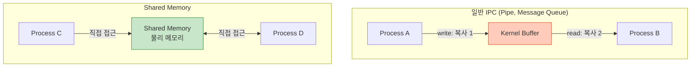
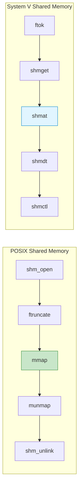
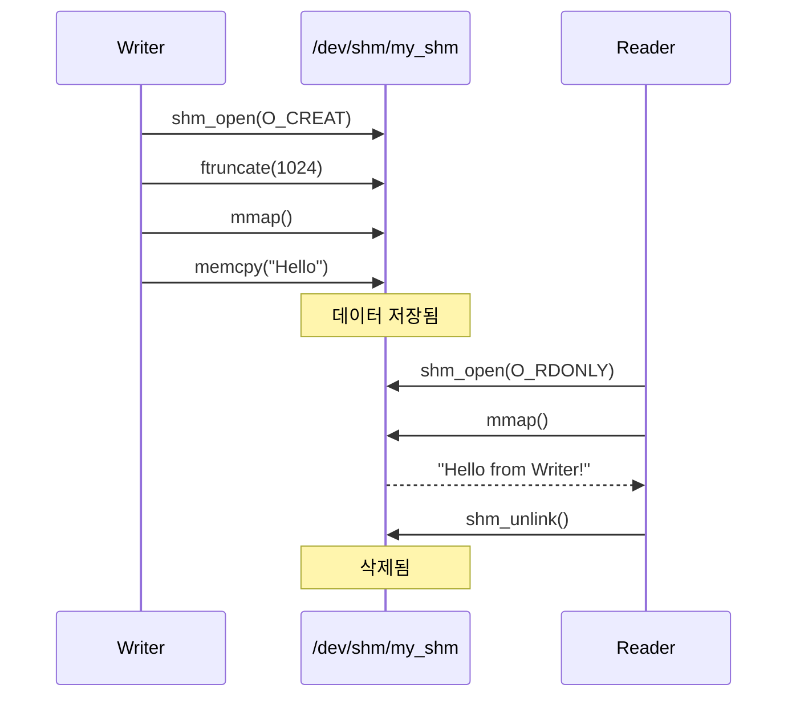
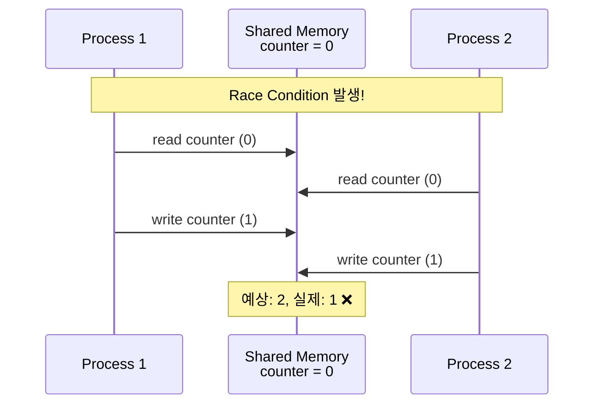
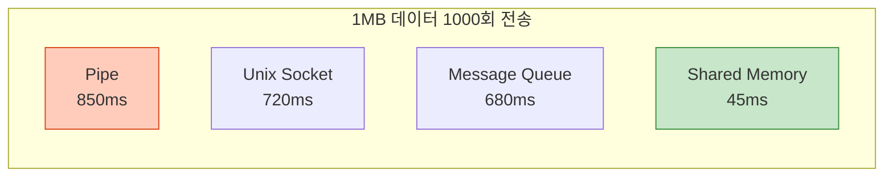
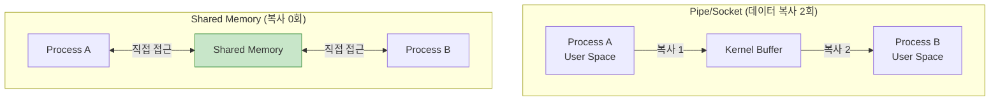

## 들어가며

**Shared Memory**는 가장 빠른 IPC 메커니즘입니다. 여러 프로세스가 동일한 메모리 영역을 **직접** 공유하므로 커널을 거치지 않고 데이터를 주고받을 수 있습니다.

## Shared Memory의 개념

### 기본 원리



### 핵심 특징

1. **Zero-copy**: 데이터 복사 없이 직접 공유
2. **최고 성능**: 커널 시스템 콜 최소화
3. **동기화 필요**: 경쟁 조건(Race Condition) 방지 필수
4. **복잡도**: 세마포어/뮤텍스와 함께 사용

## POSIX vs System V 비교

### API 비교표

| 기능 | POSIX | System V |
|------|-------|----------|
| **생성** | `shm_open()` | `shmget()` |
| **연결** | `mmap()` | `shmat()` |
| **분리** | `munmap()` | `shmdt()` |
| **삭제** | `shm_unlink()` | `shmctl()` |
| **이름 체계** | `/dev/shm/name` | IPC key |
| **권한** | 파일 권한 | IPC 권한 |
| **이식성** | 높음 (최신 표준) | 중간 (오래된 표준) |



## POSIX Shared Memory

### 1. shm_open() - 공유 메모리 생성

```c
#include <sys/mman.h>
#include <fcntl.h>

int shm_open(const char *name, int oflag, mode_t mode);
```

### 2. 기본 사용 예제

```c
// posix_shm_writer.c
#include <stdio.h>
#include <stdlib.h>
#include <string.h>
#include <fcntl.h>
#include <sys/mman.h>
#include <unistd.h>

#define SHM_NAME "/my_shm"
#define SHM_SIZE 1024

int main() {
    // 1. 공유 메모리 생성
    int shm_fd = shm_open(SHM_NAME, O_CREAT | O_RDWR, 0666);
    if (shm_fd == -1) {
        perror("shm_open");
        return 1;
    }

    // 2. 크기 설정
    if (ftruncate(shm_fd, SHM_SIZE) == -1) {
        perror("ftruncate");
        return 1;
    }

    // 3. 메모리 매핑
    void *ptr = mmap(NULL, SHM_SIZE, PROT_READ | PROT_WRITE,
                     MAP_SHARED, shm_fd, 0);
    if (ptr == MAP_FAILED) {
        perror("mmap");
        return 1;
    }

    // 4. 데이터 쓰기
    const char *msg = "Hello from Writer!";
    memcpy(ptr, msg, strlen(msg) + 1);
    printf("Writer: 데이터 저장 완료\n");

    // 5. 정리 (분리만, 삭제는 안 함)
    munmap(ptr, SHM_SIZE);
    close(shm_fd);

    return 0;
}
```

### 3. Reader 프로세스

```c
// posix_shm_reader.c
#include <stdio.h>
#include <stdlib.h>
#include <fcntl.h>
#include <sys/mman.h>
#include <unistd.h>

#define SHM_NAME "/my_shm"
#define SHM_SIZE 1024

int main() {
    // 1. 기존 공유 메모리 열기
    int shm_fd = shm_open(SHM_NAME, O_RDONLY, 0666);
    if (shm_fd == -1) {
        perror("shm_open");
        return 1;
    }

    // 2. 메모리 매핑 (읽기 전용)
    void *ptr = mmap(NULL, SHM_SIZE, PROT_READ,
                     MAP_SHARED, shm_fd, 0);
    if (ptr == MAP_FAILED) {
        perror("mmap");
        return 1;
    }

    // 3. 데이터 읽기
    printf("Reader: %s\n", (char *)ptr);

    // 4. 정리
    munmap(ptr, SHM_SIZE);
    close(shm_fd);

    // 5. 공유 메모리 삭제
    shm_unlink(SHM_NAME);

    return 0;
}
```

### 실행

```bash
# 컴파일
gcc -o writer posix_shm_writer.c -lrt
gcc -o reader posix_shm_reader.c -lrt

# 실행
./writer &
./reader

# 출력:
# Writer: 데이터 저장 완료
# Reader: Hello from Writer!
```

### 동작 과정



## System V Shared Memory

### 1. 전체 흐름

```c
// sysv_shm_writer.c
#include <stdio.h>
#include <stdlib.h>
#include <string.h>
#include <sys/ipc.h>
#include <sys/shm.h>

#define SHM_KEY 1234
#define SHM_SIZE 1024

int main() {
    // 1. 공유 메모리 생성/획득
    int shmid = shmget(SHM_KEY, SHM_SIZE, IPC_CREAT | 0666);
    if (shmid == -1) {
        perror("shmget");
        return 1;
    }

    // 2. 공유 메모리 연결
    void *ptr = shmat(shmid, NULL, 0);
    if (ptr == (void *)-1) {
        perror("shmat");
        return 1;
    }

    // 3. 데이터 쓰기
    const char *msg = "Hello from System V!";
    memcpy(ptr, msg, strlen(msg) + 1);
    printf("Writer: 데이터 저장 완료 (shmid: %d)\n", shmid);

    // 4. 분리
    shmdt(ptr);

    return 0;
}
```

### 2. Reader

```c
// sysv_shm_reader.c
#include <stdio.h>
#include <stdlib.h>
#include <sys/ipc.h>
#include <sys/shm.h>

#define SHM_KEY 1234
#define SHM_SIZE 1024

int main() {
    // 1. 기존 공유 메모리 획득
    int shmid = shmget(SHM_KEY, SHM_SIZE, 0666);
    if (shmid == -1) {
        perror("shmget");
        return 1;
    }

    // 2. 연결
    void *ptr = shmat(shmid, NULL, SHM_RDONLY);
    if (ptr == (void *)-1) {
        perror("shmat");
        return 1;
    }

    // 3. 읽기
    printf("Reader: %s\n", (char *)ptr);

    // 4. 분리
    shmdt(ptr);

    // 5. 삭제
    shmctl(shmid, IPC_RMID, NULL);

    return 0;
}
```

### 실행

```bash
gcc -o sysv_writer sysv_shm_writer.c
gcc -o sysv_reader sysv_shm_reader.c

./sysv_writer &
./sysv_reader

# 공유 메모리 확인
ipcs -m
```

## 동기화: 세마포어와 함께 사용

### 문제: Race Condition



### 해결: POSIX 세마포어

```c
// synchronized_shm.c
#include <stdio.h>
#include <stdlib.h>
#include <string.h>
#include <fcntl.h>
#include <sys/mman.h>
#include <semaphore.h>
#include <unistd.h>

#define SHM_NAME "/sync_shm"
#define SEM_NAME "/sync_sem"

typedef struct {
    int counter;
    char message[256];
} shared_data;

int main() {
    // 세마포어 생성
    sem_t *sem = sem_open(SEM_NAME, O_CREAT, 0666, 1);

    // 공유 메모리 생성
    int shm_fd = shm_open(SHM_NAME, O_CREAT | O_RDWR, 0666);
    ftruncate(shm_fd, sizeof(shared_data));

    shared_data *data = mmap(NULL, sizeof(shared_data),
                             PROT_READ | PROT_WRITE,
                             MAP_SHARED, shm_fd, 0);

    // 자식 프로세스 생성
    if (fork() == 0) {
        // 자식: 10번 카운터 증가
        for (int i = 0; i < 10; i++) {
            sem_wait(sem);  // 잠금
            data->counter++;
            printf("자식: counter = %d\n", data->counter);
            sem_post(sem);  // 해제
            usleep(10000);
        }
        exit(0);
    }

    // 부모: 10번 카운터 증가
    for (int i = 0; i < 10; i++) {
        sem_wait(sem);  // 잠금
        data->counter++;
        printf("부모: counter = %d\n", data->counter);
        sem_post(sem);  // 해제
        usleep(10000);
    }

    wait(NULL);

    printf("\n최종 counter: %d (예상: 20)\n", data->counter);

    // 정리
    munmap(data, sizeof(shared_data));
    close(shm_fd);
    shm_unlink(SHM_NAME);
    sem_close(sem);
    sem_unlink(SEM_NAME);

    return 0;
}
```

### 실행

```bash
gcc -o sync_shm synchronized_shm.c -lrt -lpthread
./sync_shm

# 출력:
# 부모: counter = 1
# 자식: counter = 2
# 부모: counter = 3
# ...
# 최종 counter: 20 (예상: 20) ✅
```

## 성능 비교

### 벤치마크 조건

- 데이터 크기: 1MB
- 반복 횟수: 1000회
- 시스템: Linux x86_64

### 결과



| 메커니즘 | 시간 (ms) | 상대 속도 |
|----------|-----------|-----------|
| **Shared Memory** | 45 | **1x** (기준) |
| Message Queue | 680 | 15x 느림 |
| Unix Socket | 720 | 16x 느림 |
| Pipe | 850 | 19x 느림 |

### 왜 빠른가?



## 메모리 매핑 플래그

### mmap() 플래그 비교

```c
// MAP_SHARED: 다른 프로세스와 공유
void *shared = mmap(NULL, size, PROT_READ | PROT_WRITE,
                    MAP_SHARED, fd, 0);

// MAP_PRIVATE: 프로세스 전용 (COW)
void *private = mmap(NULL, size, PROT_READ | PROT_WRITE,
                     MAP_PRIVATE, fd, 0);

// MAP_ANONYMOUS: 파일 없이 메모리만
void *anon = mmap(NULL, size, PROT_READ | PROT_WRITE,
                  MAP_SHARED | MAP_ANONYMOUS, -1, 0);
```

| 플래그 | 파일 필요 | 공유 여부 | 용도 |
|--------|----------|----------|------|
| `MAP_SHARED` | ✅ | 공유됨 | IPC |
| `MAP_PRIVATE` | ✅ | 독립적 | 파일 로딩 |
| `MAP_ANONYMOUS` | ❌ | 플래그에 따라 | 동적 메모리 |

## 실전 예제: Producer-Consumer

```c
// producer_consumer_shm.c
#include <stdio.h>
#include <stdlib.h>
#include <string.h>
#include <fcntl.h>
#include <sys/mman.h>
#include <semaphore.h>
#include <unistd.h>

#define BUF_SIZE 5

typedef struct {
    int buffer[BUF_SIZE];
    int in;
    int out;
} circular_buffer;

int main() {
    // 세마포어 초기화
    sem_t *mutex = sem_open("/mutex", O_CREAT, 0666, 1);
    sem_t *empty = sem_open("/empty", O_CREAT, 0666, BUF_SIZE);
    sem_t *full = sem_open("/full", O_CREAT, 0666, 0);

    // 공유 메모리
    int shm_fd = shm_open("/pc_buf", O_CREAT | O_RDWR, 0666);
    ftruncate(shm_fd, sizeof(circular_buffer));
    circular_buffer *cb = mmap(NULL, sizeof(circular_buffer),
                               PROT_READ | PROT_WRITE,
                               MAP_SHARED, shm_fd, 0);
    cb->in = 0;
    cb->out = 0;

    if (fork() == 0) {
        // Producer
        for (int i = 0; i < 10; i++) {
            sem_wait(empty);  // 빈 공간 대기
            sem_wait(mutex);  // 잠금

            cb->buffer[cb->in] = i;
            printf("Produced: %d\n", i);
            cb->in = (cb->in + 1) % BUF_SIZE;

            sem_post(mutex);  // 해제
            sem_post(full);   // 데이터 있음 신호
            usleep(100000);
        }
        exit(0);
    }

    // Consumer
    for (int i = 0; i < 10; i++) {
        sem_wait(full);   // 데이터 대기
        sem_wait(mutex);  // 잠금

        int item = cb->buffer[cb->out];
        printf("Consumed: %d\n", item);
        cb->out = (cb->out + 1) % BUF_SIZE;

        sem_post(mutex);  // 해제
        sem_post(empty);  // 빈 공간 신호
        usleep(150000);
    }

    wait(NULL);

    // 정리
    munmap(cb, sizeof(circular_buffer));
    close(shm_fd);
    shm_unlink("/pc_buf");
    sem_close(mutex);
    sem_close(empty);
    sem_close(full);
    sem_unlink("/mutex");
    sem_unlink("/empty");
    sem_unlink("/full");

    return 0;
}
```

## 주의사항 및 Best Practices

### 1. 항상 동기화 사용

```c
// ❌ 위험: 동기화 없음
shared_data->counter++;

// ✅ 안전: 세마포어 사용
sem_wait(sem);
shared_data->counter++;
sem_post(sem);
```

### 2. 메모리 누수 방지

```bash
# 공유 메모리 확인
ls -la /dev/shm/

# 수동 삭제
rm /dev/shm/my_shm

# System V 확인
ipcs -m

# System V 삭제
ipcrm -m <shmid>
```

### 3. 크기 제한 확인

```bash
# 최대 공유 메모리 크기 확인
cat /proc/sys/kernel/shmmax

# 출력 예: 18446744073692774399 (약 16 EB)
```

## 디버깅 도구

### POSIX Shared Memory

```bash
# 목록 확인
ls -lh /dev/shm/

# 권한 확인
ls -l /dev/shm/my_shm

# 내용 확인 (텍스트일 경우)
cat /dev/shm/my_shm
```

### System V Shared Memory

```bash
# 전체 목록
ipcs -m

# 상세 정보
ipcs -m -i <shmid>

# 삭제
ipcrm -m <shmid>

# 모두 삭제
ipcrm -a
```

## 언제 사용할까?

### Shared Memory 추천 상황

✅ **대용량 데이터** (> 1MB)
✅ **고성능 필요** (실시간 시스템)
✅ **빈번한 통신** (초당 수천 건)
✅ **같은 서버** (로컬 프로세스)

### 다른 IPC 고려 상황

❌ **작은 메시지** → Message Queue
❌ **간단한 통신** → Pipe
❌ **네트워크** → Socket
❌ **동기화 복잡도** 피하고 싶을 때 → Message Queue

## 다음 단계

Shared Memory의 강력함을 이해했습니다! 다음 글에서는:
- **Message Queue 심화** - POSIX vs System V 메시지 큐
- 우선순위 큐 처리
- 실전 비동기 통신 패턴

---

**시리즈 목차**
1. IPC란 무엇인가 - 프로세스 간 통신의 필요성
2. IPC 메커니즘 전체 개요 - 7가지 방식 비교
3. Pipe - 가장 기본적인 IPC
4. Named Pipe (FIFO) - 이름 있는 파이프
5. Signal - 비동기 이벤트 통신
6. **Shared Memory - 공유 메모리** ← 현재 글
7. Message Queue 심화 (다음 글)

> 💡 **Quick Tip**: Shared Memory는 가장 빠르지만, 반드시 세마포어/뮤텍스와 함께 사용하세요. 동기화 없이는 데이터 무결성을 보장할 수 없습니다!
