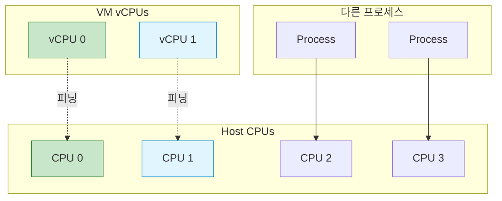
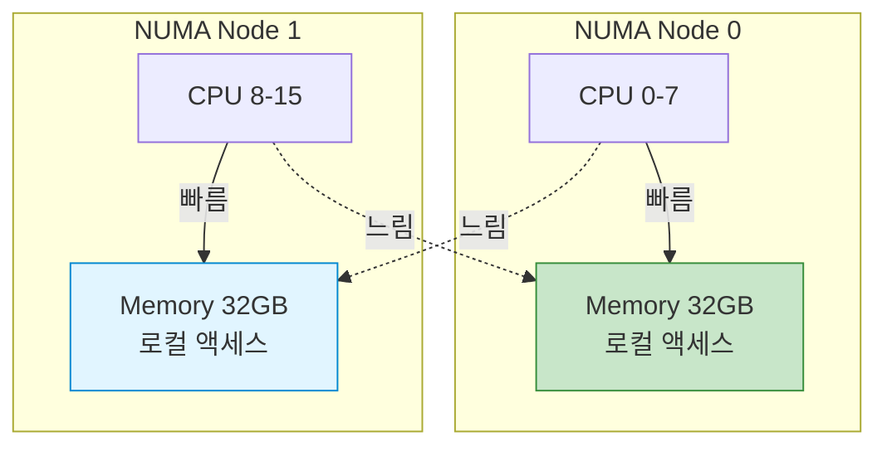
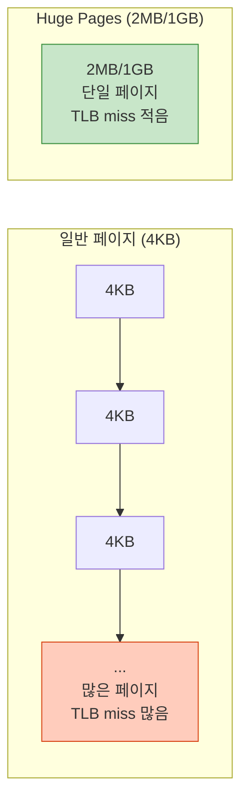

## 들어가며

VM 성능이 느리다면? **KVM 최적화**는 가상화 오버헤드를 최소화하여 네이티브에 가까운 성능을 제공합니다.

## KVM vs TCG


### KVM 활성화 확인

```bash
# CPU가 하드웨어 가상화를 지원하는지 확인
egrep -c '(vmx|svm)' /proc/cpuinfo
# 0보다 크면 지원됨

# KVM 모듈 로드 확인
lsmod | grep kvm
kvm_intel             245760  0
kvm                   663552  1 kvm_intel

# KVM 디바이스 확인
ls -l /dev/kvm
crw-rw-rw- 1 root kvm 10, 232 Jan 25 10:00 /dev/kvm

# KVM으로 VM 실행
qemu-system-x86_64 \
  -enable-kvm \
  -cpu host \
  -m 4096 \
  -smp 4 \
  -drive file=ubuntu.qcow2
```

### 성능 비교

```bash
# TCG (소프트웨어 에뮬레이션)
qemu-system-x86_64 -cpu qemu64 -m 2048 -drive file=test.qcow2

# KVM (하드웨어 가속)
qemu-system-x86_64 -enable-kvm -cpu host -m 2048 -drive file=test.qcow2
```

| 벤치마크 | TCG | KVM | 개선률 |
|----------|-----|-----|--------|
| CPU 연산 | 1200 | 11500 | **9.5배** |
| 메모리 대역폭 | 800 MB/s | 7200 MB/s | **9배** |
| 디스크 I/O | 제한적 | 네이티브 수준 | **8배+** |

## CPU 모델 선택

### CPU 모델 비교

```bash
# 사용 가능한 CPU 모델 목록
qemu-system-x86_64 -cpu help

x86 host          # 호스트 CPU 기능 모두 사용
x86 max           # 최대 기능 활성화
x86 Skylake-Server
x86 Cascadelake-Server
x86 EPYC
x86 qemu64        # 기본 (호환성 최고)
```

### 권장 설정

```bash
# 최고 성능 (마이그레이션 제약)
qemu-system-x86_64 \
  -enable-kvm \
  -cpu host \
  -m 4096

# 마이그레이션 고려 (호환성)
qemu-system-x86_64 \
  -enable-kvm \
  -cpu Skylake-Server \
  -m 4096

# 특정 기능 추가/제거
qemu-system-x86_64 \
  -enable-kvm \
  -cpu host,+pdpe1gb,-pcid \
  -m 4096
```

## CPU 피닝 (CPU Pinning)

### 개념



### taskset을 통한 피닝

```bash
# VM을 CPU 0,1에 고정
taskset -c 0,1 qemu-system-x86_64 \
  -enable-kvm \
  -cpu host \
  -smp 2 \
  -m 4096 \
  -drive file=ubuntu.qcow2

# 실행 중인 VM의 PID 확인
ps aux | grep qemu

# 실행 중인 프로세스 CPU 피닝 변경
taskset -cp 0,1 <qemu-pid>
```

### libvirt XML 설정

```xml
<domain type='kvm'>
  <name>ubuntu</name>
  <vcpu placement='static'>4</vcpu>
  <cputune>
    <!-- vCPU 0 → Host CPU 0 -->
    <vcpupin vcpu='0' cpuset='0'/>
    <!-- vCPU 1 → Host CPU 1 -->
    <vcpupin vcpu='1' cpuset='1'/>
    <!-- vCPU 2 → Host CPU 2 -->
    <vcpupin vcpu='2' cpuset='2'/>
    <!-- vCPU 3 → Host CPU 3 -->
    <vcpupin vcpu='3' cpuset='3'/>

    <!-- Emulator threads → Host CPU 4,5 -->
    <emulatorpin cpuset='4-5'/>
  </cputune>
</domain>
```

### 동적 피닝 스크립트

```bash
#!/bin/bash
# pin_vcpus.sh

VM_PID=$1

if [ -z "$VM_PID" ]; then
    echo "Usage: $0 <qemu_pid>"
    exit 1
fi

# vCPU 스레드 PID 찾기
VCPU_THREADS=$(ps -T -p $VM_PID | grep CPU | awk '{print $2}')

# 각 vCPU를 별도 CPU에 피닝
CPU=0
for THREAD in $VCPU_THREADS; do
    echo "Pinning vCPU thread $THREAD to CPU $CPU"
    taskset -cp $CPU $THREAD
    CPU=$((CPU + 1))
done
```

## NUMA 최적화

### NUMA 아키텍처



### NUMA 정보 확인

```bash
# NUMA 노드 확인
numactl --hardware

available: 2 nodes (0-1)
node 0 cpus: 0 1 2 3 4 5 6 7
node 0 size: 32768 MB
node 0 free: 15234 MB
node 1 cpus: 8 9 10 11 12 13 14 15
node 1 size: 32768 MB
node 1 free: 28901 MB

# NUMA 통계
numastat

                           node0           node1
numa_hit              1234567890      9876543210
numa_miss                  12345           54321
numa_foreign               54321           12345
```

### VM을 NUMA 노드에 바인딩

```bash
# VM을 NUMA Node 0에 실행
numactl --cpunodebind=0 --membind=0 \
qemu-system-x86_64 \
  -enable-kvm \
  -cpu host \
  -smp 8 \
  -m 32G \
  -drive file=ubuntu.qcow2

# 특정 CPU 범위 지정
numactl --physcpubind=0-7 --membind=0 \
qemu-system-x86_64 ...
```

### Guest NUMA 토폴로지 설정

```bash
# Guest 내부에 NUMA 구조 생성
qemu-system-x86_64 \
  -enable-kvm \
  -cpu host \
  -smp 8,sockets=2,cores=4,threads=1 \
  -m 16G \
  -object memory-backend-ram,size=8G,id=mem0 \
  -object memory-backend-ram,size=8G,id=mem1 \
  -numa node,nodeid=0,cpus=0-3,memdev=mem0 \
  -numa node,nodeid=1,cpus=4-7,memdev=mem1 \
  -drive file=ubuntu.qcow2
```

## Huge Pages

### 개념



### Huge Pages 설정

```bash
# 1. Huge Pages 예약 (2MB 페이지)
# 4GB 메모리 = 2048 페이지
sudo sysctl vm.nr_hugepages=2048

# 영구 설정
echo "vm.nr_hugepages=2048" | sudo tee -a /etc/sysctl.conf

# 2. Huge Pages 확인
grep Huge /proc/meminfo

HugePages_Total:    2048
HugePages_Free:     2048
HugePages_Rsvd:        0
HugePages_Surp:        0
Hugepagesize:       2048 kB

# 3. VM에서 Huge Pages 사용
qemu-system-x86_64 \
  -enable-kvm \
  -cpu host \
  -m 4G \
  -mem-path /dev/hugepages \
  -mem-prealloc \
  -drive file=ubuntu.qcow2
```

### 1GB Huge Pages

```bash
# 1GB 페이지 활성화 (부팅 시)
# /etc/default/grub 수정
GRUB_CMDLINE_LINUX="default_hugepagesz=1G hugepagesz=1G hugepages=8"

# grub 업데이트
sudo update-grub
sudo reboot

# 확인
grep Huge /proc/meminfo
HugePages_Total:       8
Hugepagesize:    1048576 kB  # 1GB

# VM에서 사용
qemu-system-x86_64 \
  -enable-kvm \
  -m 8G \
  -mem-path /dev/hugepages \
  -mem-prealloc \
  -drive file=ubuntu.qcow2
```

### 성능 비교

| 페이지 크기 | TLB Miss Rate | 메모리 성능 | 적합한 워크로드 |
|-------------|---------------|-------------|-----------------|
| 4KB (기본) | 높음 | 기준 | 일반적 용도 |
| 2MB | 중간 | +15-20% | 메모리 집약적 |
| 1GB | 낮음 | +25-30% | 대용량 메모리 |

## I/O 스레드 최적화

### I/O Thread 설정

```bash
# 각 디스크에 별도 I/O 스레드
qemu-system-x86_64 \
  -enable-kvm \
  -cpu host \
  -m 4G \
  -object iothread,id=iothread0 \
  -object iothread,id=iothread1 \
  -drive file=disk1.qcow2,if=none,id=drive0,cache=none,aio=native \
  -device virtio-blk-pci,drive=drive0,iothread=iothread0 \
  -drive file=disk2.qcow2,if=none,id=drive1,cache=none,aio=native \
  -device virtio-blk-pci,drive=drive1,iothread=iothread1
```

### 네트워크 I/O 최적화

```bash
# vhost-net 사용
qemu-system-x86_64 \
  -enable-kvm \
  -netdev tap,id=net0,vhost=on,queues=4 \
  -device virtio-net-pci,netdev=net0,mq=on,vectors=10
```

## 종합 최적화 설정

### 고성능 VM 구성

```bash
#!/bin/bash
# high_performance_vm.sh

# NUMA 노드 0 사용
NUMA_NODE=0

# CPU 피닝 범위
CPU_RANGE="0-7"

# Huge Pages 경로
HUGEPAGES="/dev/hugepages"

qemu-system-x86_64 \
  `# KVM 최적화` \
  -enable-kvm \
  -cpu host,kvm=on,l3-cache=on \
  \
  `# CPU 설정` \
  -smp 8,sockets=1,cores=8,threads=1 \
  \
  `# 메모리 설정 (Huge Pages)` \
  -m 16G \
  -mem-path $HUGEPAGES \
  -mem-prealloc \
  \
  `# NUMA` \
  -object memory-backend-file,id=mem,size=16G,mem-path=$HUGEPAGES,share=on,prealloc=on \
  -numa node,memdev=mem \
  \
  `# 디스크 I/O 최적화` \
  -object iothread,id=io0 \
  -drive file=ubuntu.qcow2,if=none,id=disk0,cache=none,aio=native \
  -device virtio-blk-pci,drive=disk0,iothread=io0 \
  \
  `# 네트워크 최적화` \
  -netdev tap,id=net0,vhost=on \
  -device virtio-net-pci,netdev=net0,mq=on \
  \
  `# 기타` \
  -name "high-perf-vm" \
  -daemonize

# CPU 피닝 적용
VM_PID=$(pgrep -f "high-perf-vm")
taskset -cp $CPU_RANGE $VM_PID

echo "High-performance VM started: PID $VM_PID"
```

## 성능 측정

### CPU 벤치마크

```bash
# VM 내부에서 sysbench 실행
sysbench cpu --cpu-max-prime=20000 run

# 결과 비교
# 네이티브: 8.2초
# KVM 최적화: 8.5초 (96% 성능)
# KVM 기본: 10.1초 (81% 성능)
# TCG: 78.3초 (10% 성능)
```

### 메모리 벤치마크

```bash
# Stream 벤치마크
./stream

# 결과 (GB/s)
```

| 설정 | Copy | Scale | Add | Triad |
|------|------|-------|-----|-------|
| 네이티브 | 45.2 | 43.8 | 44.1 | 43.9 |
| 4KB 페이지 | 38.1 | 37.2 | 37.5 | 37.3 |
| 2MB Huge | 42.3 | 41.5 | 41.8 | 41.6 |
| 1GB Huge | 44.1 | 43.2 | 43.5 | 43.3 |

## 실전 최적화 체크리스트

```bash
#!/bin/bash
# optimization_check.sh

echo "=== QEMU/KVM Optimization Check ==="

# 1. KVM 활성화
if [ -c /dev/kvm ]; then
    echo "✅ KVM available"
else
    echo "❌ KVM not available"
fi

# 2. CPU 가상화 지원
if egrep -q '(vmx|svm)' /proc/cpuinfo; then
    echo "✅ CPU virtualization supported"
else
    echo "❌ CPU virtualization NOT supported"
fi

# 3. Huge Pages
HP_TOTAL=$(grep HugePages_Total /proc/meminfo | awk '{print $2}')
if [ "$HP_TOTAL" -gt 0 ]; then
    echo "✅ Huge Pages configured: $HP_TOTAL"
else
    echo "⚠️  Huge Pages not configured"
fi

# 4. NUMA
if command -v numactl &> /dev/null; then
    NUMA_NODES=$(numactl --hardware | grep available | awk '{print $2}')
    echo "✅ NUMA available: $NUMA_NODES nodes"
else
    echo "⚠️  NUMA tools not installed"
fi

# 5. vhost-net
if lsmod | grep -q vhost_net; then
    echo "✅ vhost-net loaded"
else
    echo "⚠️  vhost-net not loaded"
fi

# 6. I/O 스케줄러
SCHED=$(cat /sys/block/sda/queue/scheduler | grep -o '\[.*\]' | tr -d '[]')
echo "ℹ️  I/O Scheduler: $SCHED"
if [ "$SCHED" = "none" ] || [ "$SCHED" = "noop" ]; then
    echo "✅ Good for SSD"
fi
```

## 다음 단계

KVM 최적화를 마스터했습니다! 다음 글에서는:
- **vCPU 설정과 성능**
- CPU 토폴로지
- vCPU 어피니티

---

**시리즈 목차**
1-10. [이전 글들]
11. **QEMU와 KVM 최적화** ← 현재 글

> 💡 **Quick Tip**: CPU 피닝과 NUMA 바인딩은 특히 고성능 워크로드에서 큰 차이를 만듭니다. 하지만 과도한 피닝은 유연성을 해칠 수 있으니 워크로드 특성을 고려하세요!
