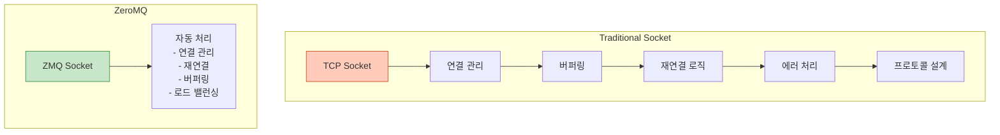
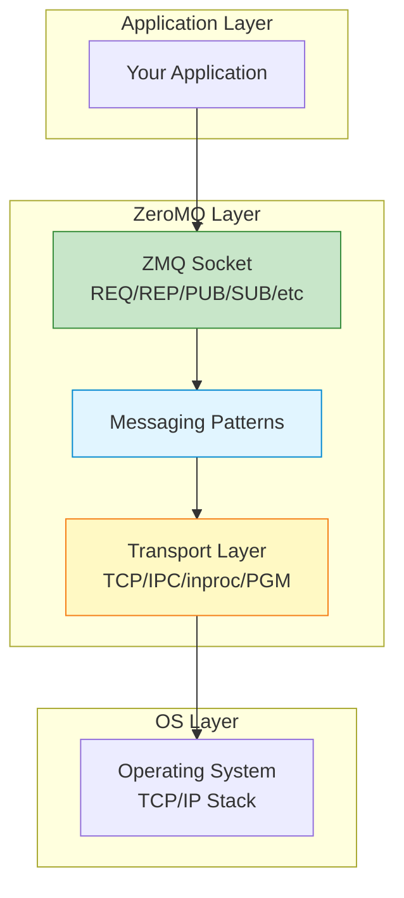
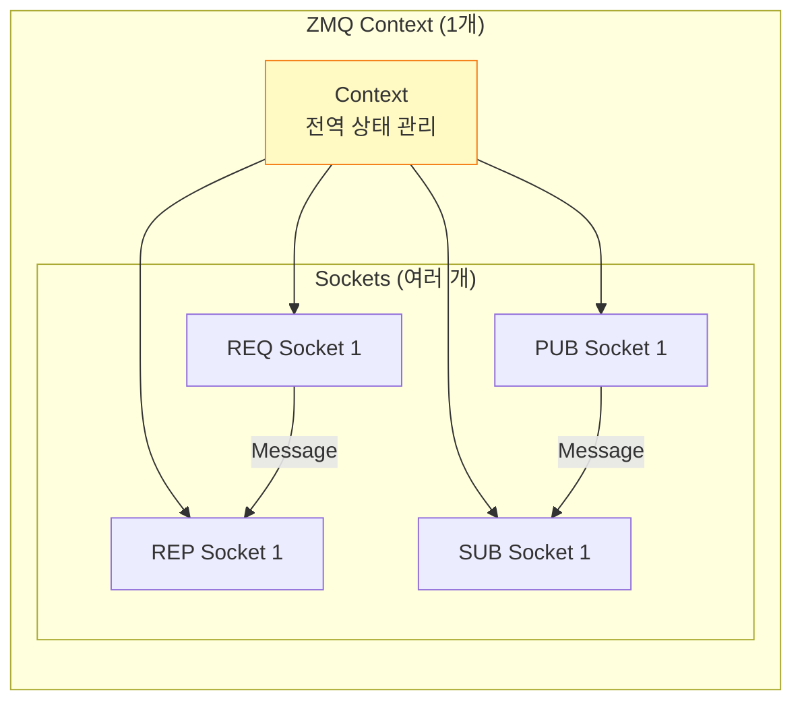
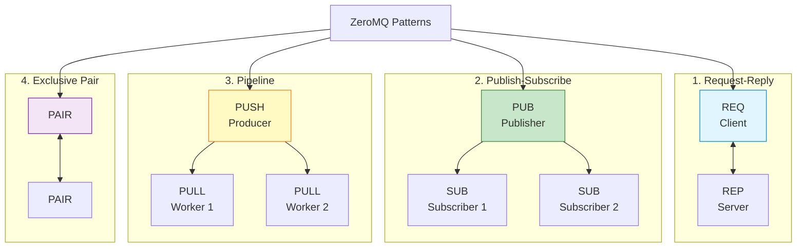
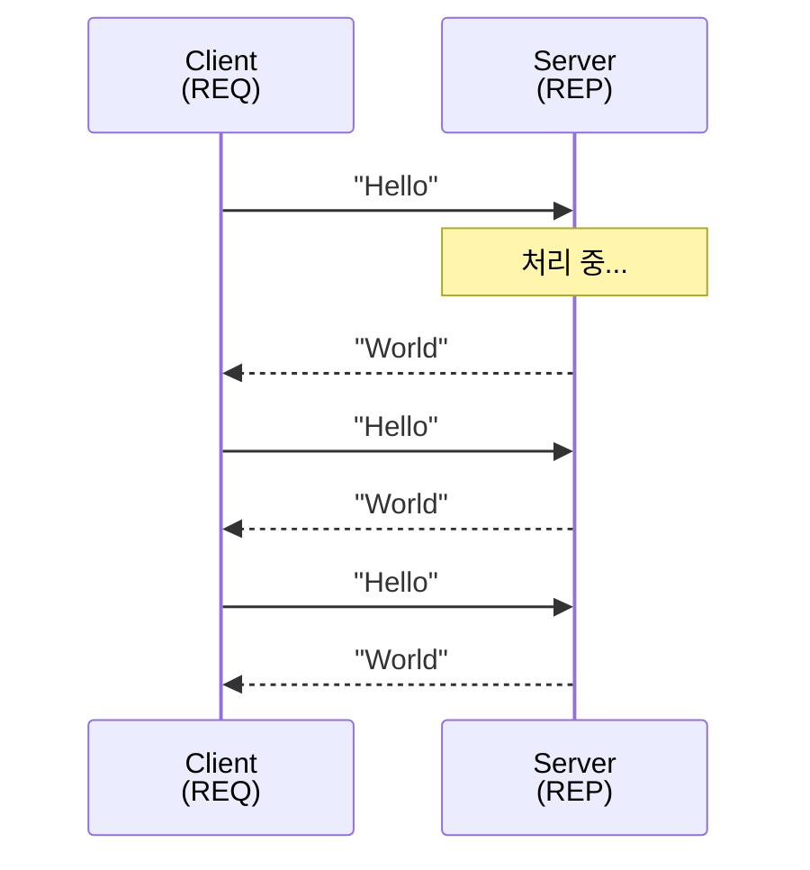
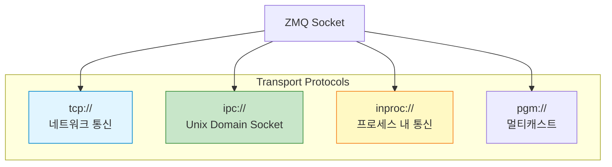
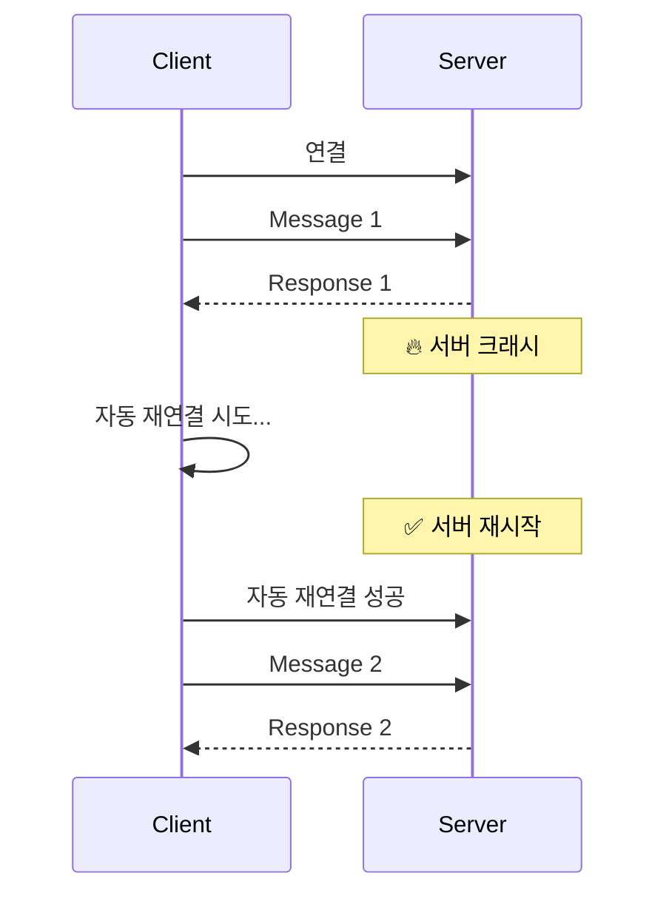
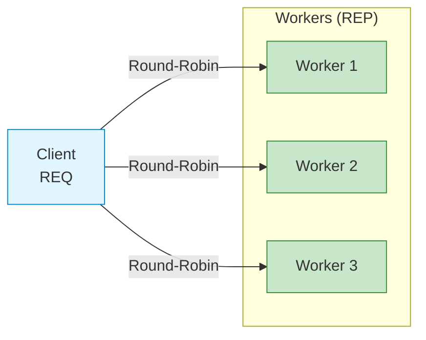

## 들어가며

네트워크 프로그래밍은 어렵습니다. TCP 소켓, 연결 관리, 에러 처리, 재연결 로직... **ZeroMQ**는 이 모든 것을 단순화합니다. "Sockets on Steroids"라 불리는 ZeroMQ의 세계로 들어가봅시다.

## ZeroMQ란?

### 정의

**ZeroMQ** (또는 ØMQ, ZMQ)는 **고성능 비동기 메시징 라이브러리**입니다.



### 핵심 철학

1. **Zero**: 제로 브로커 (중간 서버 불필요)
2. **Simplicity**: 간단한 API
3. **Performance**: 고성능 (백만 msg/s)
4. **Scalability**: 쉬운 확장성
5. **Patterns**: 검증된 메시징 패턴

## ZeroMQ vs 전통적인 소켓

### 전통적인 TCP Socket

```c
// 복잡한 서버 코드
int server_fd = socket(AF_INET, SOCK_STREAM, 0);
bind(server_fd, ...);
listen(server_fd, 5);

while (1) {
    int client_fd = accept(server_fd, ...);
    // 🔥 각 클라이언트마다 스레드/프로세스 필요
    // 🔥 연결 끊김 처리
    // 🔥 재연결 로직
    // 🔥 버퍼 관리
}
```

### ZeroMQ

```c
// 간단한 서버 코드
void *context = zmq_ctx_new();
void *socket = zmq_socket(context, ZMQ_REP);
zmq_bind(socket, "tcp://*:5555");

while (1) {
    zmq_recv(socket, buffer, sizeof(buffer), 0);
    zmq_send(socket, reply, strlen(reply), 0);
    // ✅ 자동 연결 관리
    // ✅ 자동 재연결
    // ✅ 자동 버퍼링
}
```

### 비교표

| 항목 | TCP Socket | ZeroMQ |
|------|------------|--------|
| **연결 관리** | 수동 | 자동 |
| **재연결** | 직접 구현 | 자동 |
| **로드 밸런싱** | 직접 구현 | 내장 |
| **메시지 경계** | 없음 (바이트 스트림) | 있음 (메시지 단위) |
| **백프레셔** | 직접 구현 | 자동 |
| **코드 길이** | 수백 줄 | 수십 줄 |

## ZeroMQ 아키텍처

### 계층 구조



### Context와 Socket



## 5가지 주요 메시징 패턴



### 패턴 비교

| 패턴 | 소켓 타입 | 방향 | 사용 사례 |
|------|-----------|------|-----------|
| **Request-Reply** | REQ-REP | 양방향 | RPC, API 호출 |
| **Pub-Sub** | PUB-SUB | 단방향 | 이벤트 브로드캐스트 |
| **Pipeline** | PUSH-PULL | 단방향 | 작업 분산 |
| **Pair** | PAIR-PAIR | 양방향 | 프로세스 간 1:1 |

## Hello World: Request-Reply

### Server

```c
// server.c
#include <zmq.h>
#include <string.h>
#include <stdio.h>
#include <unistd.h>

int main() {
    // Context 생성
    void *context = zmq_ctx_new();

    // REP 소켓 생성
    void *responder = zmq_socket(context, ZMQ_REP);
    zmq_bind(responder, "tcp://*:5555");

    printf("서버 시작... (포트 5555)\n");

    while (1) {
        char buffer[10];

        // 요청 받기
        zmq_recv(responder, buffer, 10, 0);
        printf("요청 받음: %s\n", buffer);

        // 처리 시뮬레이션
        sleep(1);

        // 응답 보내기
        zmq_send(responder, "World", 5, 0);
    }

    zmq_close(responder);
    zmq_ctx_destroy(context);
    return 0;
}
```

### Client

```c
// client.c
#include <zmq.h>
#include <string.h>
#include <stdio.h>

int main() {
    void *context = zmq_ctx_new();

    // REQ 소켓 생성
    void *requester = zmq_socket(context, ZMQ_REQ);
    zmq_connect(requester, "tcp://localhost:5555");

    for (int i = 0; i < 10; i++) {
        char buffer[10];

        // 요청 보내기
        printf("요청 전송: Hello\n");
        zmq_send(requester, "Hello", 5, 0);

        // 응답 받기
        zmq_recv(requester, buffer, 10, 0);
        printf("응답 받음: %s\n", buffer);
    }

    zmq_close(requester);
    zmq_ctx_destroy(context);
    return 0;
}
```

### 컴파일 및 실행

```bash
# ZeroMQ 설치
sudo apt install libzmq3-dev  # Ubuntu/Debian
brew install zeromq           # macOS

# 컴파일
gcc -o server server.c -lzmq
gcc -o client client.c -lzmq

# 실행
# Terminal 1
./server

# Terminal 2
./client
```

### 동작 과정



## ZeroMQ 전송 계층

### 지원 프로토콜



### 사용 예

```c
// TCP (네트워크)
zmq_bind(socket, "tcp://*:5555");
zmq_connect(socket, "tcp://192.168.1.100:5555");

// IPC (로컬)
zmq_bind(socket, "ipc:///tmp/feeds/0");

// In-Process (스레드 간)
zmq_bind(socket, "inproc://workers");

// Multicast
zmq_bind(socket, "pgm://eth0;239.192.1.1:5555");
```

## ZeroMQ의 장점

### 1. 자동 재연결



**전통 소켓**: 수동으로 재연결 로직 구현 필요
**ZeroMQ**: 자동 처리!

### 2. 메시지 큐잉

```c
// 수신자가 없어도 메시지는 큐에 저장됨
zmq_send(socket, msg, size, ZMQ_DONTWAIT);
// ✅ 나중에 수신자가 연결되면 전달
```

### 3. 로드 밸런싱



**ZeroMQ**: 자동으로 여러 REP 소켓에 분산!

## ZeroMQ vs 다른 메시징 시스템

| 항목 | ZeroMQ | RabbitMQ | Kafka | Redis Pub/Sub |
|------|--------|----------|-------|---------------|
| **브로커** | ❌ Brokerless | ✅ Broker | ✅ Broker | ✅ Broker |
| **지속성** | ❌ In-Memory | ✅ Disk | ✅ Disk | ❌ In-Memory |
| **속도** | 매우 빠름 | 빠름 | 빠름 | 매우 빠름 |
| **복잡도** | 낮음 | 중간 | 높음 | 낮음 |
| **보장** | Best Effort | At-least-once | Exactly-once | Best Effort |
| **사용 사례** | 로컬/분산 IPC | 엔터프라이즈 메시징 | 스트림 처리 | 실시간 이벤트 |

## 언어 바인딩

ZeroMQ는 **40+ 언어** 지원:

```python
# Python
import zmq

context = zmq.Context()
socket = context.socket(zmq.REQ)
socket.connect("tcp://localhost:5555")

socket.send(b"Hello")
message = socket.recv()
```

```javascript
// Node.js
const zmq = require("zeromq");

async function run() {
  const sock = new zmq.Request();
  sock.connect("tcp://localhost:5555");

  await sock.send("Hello");
  const [msg] = await sock.receive();
}
```

```go
// Go
package main

import "github.com/pebbe/zmq4"

func main() {
    socket, _ := zmq4.NewSocket(zmq4.REQ)
    socket.Connect("tcp://localhost:5555")

    socket.Send("Hello", 0)
    msg, _ := socket.Recv(0)
}
```

## 다음 단계

ZeroMQ의 기본 개념을 이해했습니다! 다음 글에서는:
- **5가지 메시징 패턴 심화**
- 각 패턴의 실전 활용
- 패턴 조합 기법

---

**시리즈 목차**
1. **ZeroMQ란 무엇인가 - 고성능 메시징 라이브러리** ← 현재 글
2. ZeroMQ 메시징 패턴 - REQ/REP, PUB/SUB, PUSH/PULL (다음 글)
3. ZeroMQ 고급 패턴 - ROUTER, DEALER, PROXY
4. ZeroMQ 실전 활용 - 분산 시스템 구축
5. ZeroMQ 성능 최적화 및 보안

> 💡 **Quick Tip**: ZeroMQ는 "Zero Broker"이므로 RabbitMQ나 Kafka처럼 별도 서버가 필요 없습니다. 애플리케이션에 직접 내장되는 라이브러리입니다!
