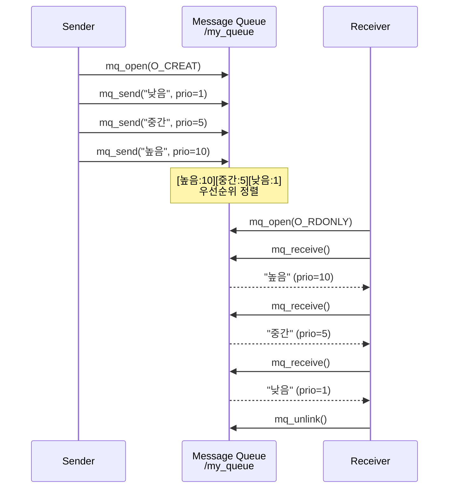
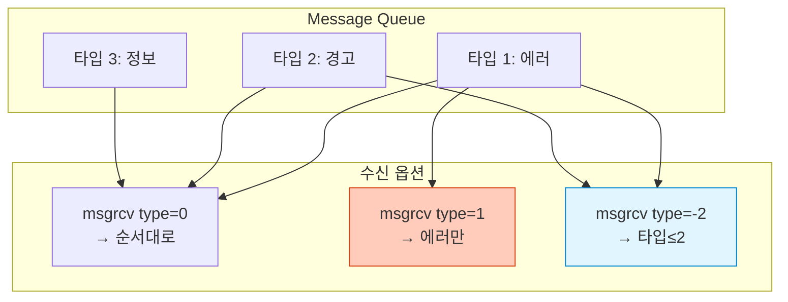
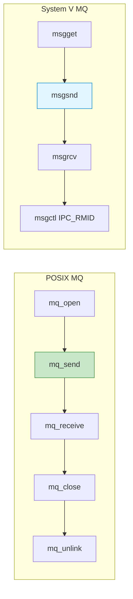
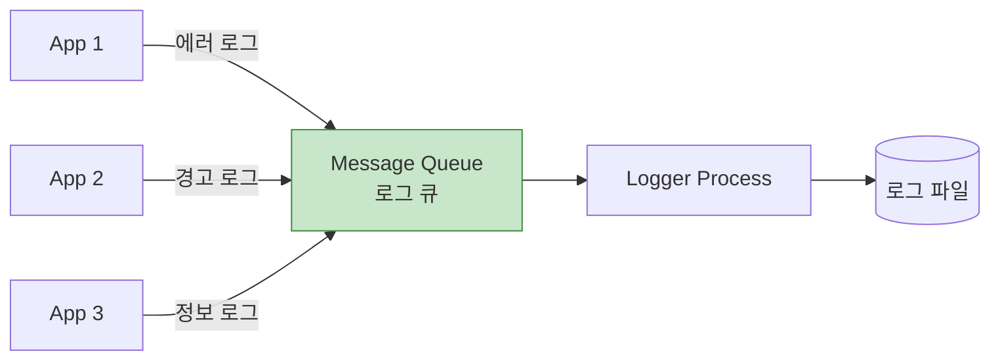

## 들어가며

**Message Queue**는 구조화된 메시지를 비동기적으로 주고받는 IPC입니다. Pipe와 달리 **메시지 경계**가 유지되고, **우선순위**와 **타입**을 지정할 수 있습니다.

## Message Queue vs Pipe

### 근본적인 차이

```mermaid
graph TB
    subgraph "Pipe: 바이트 스트림"
        P1[Writer]
        Pipe[Pipe Buffer<br/>abcdefghijk...]
        P2[Reader]

        P1 -->|write 5 bytes| Pipe
        Pipe -->|read 3 bytes| P2
        Note1[경계 없음<br/>순서대로 읽음]
    end

    subgraph "Message Queue: 메시지 단위"
        M1[Sender]
        MQ[Message Queue]
        M2[Receiver]

        M1 -->|[msg1][msg2][msg3]| MQ
        MQ -->|[msg2] 선택 가능| M2
        Note2[메시지 경계 유지<br/>타입별 선택 가능]
    end

    style Pipe fill:#ffccbc,stroke:#d84315
    style MQ fill:#c8e6c9,stroke:#388e3c
```

### 비교표

| 특징 | Pipe | Message Queue |
|------|------|---------------|
| **데이터 단위** | 바이트 스트림 | 메시지 |
| **경계 유지** | ❌ | ✅ |
| **메시지 타입** | ❌ | ✅ |
| **우선순위** | ❌ | ✅ (POSIX) |
| **비동기 처리** | 제한적 | ✅ |
| **선택적 읽기** | ❌ | ✅ (System V) |
| **복잡도** | 낮음 | 중간 |

## POSIX Message Queue

### 1. 기본 API

```c
#include <mqueue.h>

mqd_t mq_open(const char *name, int oflag, ...);
int mq_send(mqd_t mqdes, const char *msg, size_t len, unsigned prio);
ssize_t mq_receive(mqd_t mqdes, char *msg, size_t len, unsigned *prio);
int mq_close(mqd_t mqdes);
int mq_unlink(const char *name);
```

### 2. 기본 예제: Sender

```c
// posix_mq_send.c
#include <stdio.h>
#include <stdlib.h>
#include <string.h>
#include <mqueue.h>
#include <fcntl.h>

#define QUEUE_NAME "/my_queue"
#define MAX_MSG_SIZE 256
#define MAX_MESSAGES 10

int main() {
    struct mq_attr attr;
    attr.mq_flags = 0;
    attr.mq_maxmsg = MAX_MESSAGES;
    attr.mq_msgsize = MAX_MSG_SIZE;
    attr.mq_curmsgs = 0;

    // 큐 생성
    mqd_t mq = mq_open(QUEUE_NAME, O_CREAT | O_WRONLY, 0644, &attr);
    if (mq == (mqd_t)-1) {
        perror("mq_open");
        return 1;
    }

    // 메시지 전송 (우선순위 포함)
    const char *messages[] = {
        "낮은 우선순위 메시지",
        "중간 우선순위 메시지",
        "높은 우선순위 메시지"
    };

    unsigned priorities[] = {1, 5, 10};

    for (int i = 0; i < 3; i++) {
        if (mq_send(mq, messages[i], strlen(messages[i]) + 1,
                    priorities[i]) == -1) {
            perror("mq_send");
        } else {
            printf("전송: %s (우선순위: %u)\n", messages[i], priorities[i]);
        }
    }

    mq_close(mq);
    return 0;
}
```

### 3. Receiver

```c
// posix_mq_receive.c
#include <stdio.h>
#include <stdlib.h>
#include <mqueue.h>
#include <fcntl.h>

#define QUEUE_NAME "/my_queue"
#define MAX_MSG_SIZE 256

int main() {
    // 큐 열기
    mqd_t mq = mq_open(QUEUE_NAME, O_RDONLY);
    if (mq == (mqd_t)-1) {
        perror("mq_open");
        return 1;
    }

    // 속성 확인
    struct mq_attr attr;
    mq_getattr(mq, &attr);

    char buffer[MAX_MSG_SIZE];
    unsigned priority;

    printf("큐에 %ld개 메시지 대기 중\n", attr.mq_curmsgs);

    // 모든 메시지 수신
    while (attr.mq_curmsgs > 0) {
        ssize_t bytes = mq_receive(mq, buffer, MAX_MSG_SIZE, &priority);
        if (bytes >= 0) {
            buffer[bytes] = '\0';
            printf("수신: %s (우선순위: %u)\n", buffer, priority);
        }
        mq_getattr(mq, &attr);
    }

    mq_close(mq);
    mq_unlink(QUEUE_NAME);  // 큐 삭제

    return 0;
}
```

### 실행

```bash
# 컴파일
gcc -o mq_send posix_mq_send.c -lrt
gcc -o mq_recv posix_mq_receive.c -lrt

# 실행
./mq_send
./mq_recv

# 출력:
# 전송: 낮은 우선순위 메시지 (우선순위: 1)
# 전송: 중간 우선순위 메시지 (우선순위: 5)
# 전송: 높은 우선순위 메시지 (우선순위: 10)
# 큐에 3개 메시지 대기 중
# 수신: 높은 우선순위 메시지 (우선순위: 10)  ← 우선순위 순!
# 수신: 중간 우선순위 메시지 (우선순위: 5)
# 수신: 낮은 우선순위 메시지 (우선순위: 1)
```

### 동작 과정



## System V Message Queue

### 1. 기본 API

```c
#include <sys/msg.h>

int msgget(key_t key, int msgflg);
int msgsnd(int msqid, const void *msgp, size_t msgsz, int msgflg);
ssize_t msgrcv(int msqid, void *msgp, size_t msgsz, long msgtyp, int msgflg);
int msgctl(int msqid, int cmd, struct msqid_ds *buf);
```

### 2. 메시지 구조체

```c
// System V 메시지 구조
struct msgbuf {
    long mtype;       // 메시지 타입 (> 0)
    char mtext[256];  // 메시지 내용
};
```

### 3. Sender 예제

```c
// sysv_mq_send.c
#include <stdio.h>
#include <stdlib.h>
#include <string.h>
#include <sys/msg.h>
#include <sys/ipc.h>

#define MSG_KEY 1234

struct msgbuf {
    long mtype;
    char mtext[256];
};

int main() {
    // 메시지 큐 생성
    int msqid = msgget(MSG_KEY, IPC_CREAT | 0666);
    if (msqid == -1) {
        perror("msgget");
        return 1;
    }

    struct msgbuf msg;

    // 타입 1: 에러 메시지
    msg.mtype = 1;
    strcpy(msg.mtext, "에러: 파일을 찾을 수 없습니다");
    msgsnd(msqid, &msg, strlen(msg.mtext) + 1, 0);
    printf("전송: [타입 %ld] %s\n", msg.mtype, msg.mtext);

    // 타입 2: 경고 메시지
    msg.mtype = 2;
    strcpy(msg.mtext, "경고: 디스크 용량 부족");
    msgsnd(msqid, &msg, strlen(msg.mtext) + 1, 0);
    printf("전송: [타입 %ld] %s\n", msg.mtype, msg.mtext);

    // 타입 3: 정보 메시지
    msg.mtype = 3;
    strcpy(msg.mtext, "정보: 작업 완료");
    msgsnd(msqid, &msg, strlen(msg.mtext) + 1, 0);
    printf("전송: [타입 %ld] %s\n", msg.mtype, msg.mtext);

    return 0;
}
```

### 4. Receiver: 타입별 선택 수신

```c
// sysv_mq_receive.c
#include <stdio.h>
#include <stdlib.h>
#include <sys/msg.h>

#define MSG_KEY 1234

struct msgbuf {
    long mtype;
    char mtext[256];
};

int main(int argc, char *argv[]) {
    int msqid = msgget(MSG_KEY, 0666);
    if (msqid == -1) {
        perror("msgget");
        return 1;
    }

    struct msgbuf msg;
    long type_filter = (argc > 1) ? atol(argv[1]) : 0;

    printf("메시지 수신 (타입 필터: %ld)\n", type_filter);
    printf("0: 모든 타입, >0: 특정 타입만\n\n");

    // type_filter:
    // 0: 큐의 첫 번째 메시지
    // >0: 특정 타입만
    // <0: 해당 값 이하의 타입 중 가장 낮은 것

    while (msgrcv(msqid, &msg, sizeof(msg.mtext), type_filter, IPC_NOWAIT) != -1) {
        printf("수신: [타입 %ld] %s\n", msg.mtype, msg.mtext);
    }

    // 큐 삭제
    msgctl(msqid, IPC_RMID, NULL);

    return 0;
}
```

### 실행

```bash
gcc -o sysv_send sysv_mq_send.c
gcc -o sysv_recv sysv_mq_receive.c

# 메시지 전송
./sysv_send

# 타입 1(에러)만 수신
./sysv_send
./sysv_recv 1
# 출력: 수신: [타입 1] 에러: 파일을 찾을 수 없습니다

# 모든 타입 수신
./sysv_send
./sysv_recv 0
# 출력: 모든 메시지
```

### 타입 필터링



## POSIX vs System V 상세 비교

### 기능 비교

| 기능 | POSIX | System V |
|------|-------|----------|
| **우선순위** | ✅ 0-31 | ❌ |
| **메시지 타입** | ❌ | ✅ long |
| **비동기 알림** | ✅ `mq_notify()` | ❌ |
| **타임아웃** | ✅ `mq_timedreceive()` | ❌ |
| **네임스페이스** | `/name` | IPC key |
| **권한 모델** | 파일 권한 | IPC 권한 |
| **이식성** | 높음 | 중간 |

### API 대응표



## 비동기 알림 (POSIX만)

### mq_notify() 사용

```c
// posix_mq_notify.c
#include <stdio.h>
#include <stdlib.h>
#include <signal.h>
#include <mqueue.h>
#include <fcntl.h>
#include <string.h>
#include <unistd.h>

#define QUEUE_NAME "/notify_queue"
#define MAX_MSG_SIZE 256

mqd_t mq;

void handle_message(int sig) {
    char buffer[MAX_MSG_SIZE];
    unsigned prio;

    // 메시지 수신
    if (mq_receive(mq, buffer, MAX_MSG_SIZE, &prio) >= 0) {
        printf("알림 받음! 메시지: %s\n", buffer);
    }

    // 다음 알림 재등록
    struct sigevent sev;
    sev.sigev_notify = SIGEV_SIGNAL;
    sev.sigev_signo = SIGUSR1;
    mq_notify(mq, &sev);
}

int main() {
    // 시그널 핸들러 등록
    signal(SIGUSR1, handle_message);

    // 큐 생성
    struct mq_attr attr = {0, 10, MAX_MSG_SIZE, 0};
    mq = mq_open(QUEUE_NAME, O_CREAT | O_RDONLY | O_NONBLOCK, 0644, &attr);

    // 알림 등록
    struct sigevent sev;
    sev.sigev_notify = SIGEV_SIGNAL;
    sev.sigev_signo = SIGUSR1;
    mq_notify(mq, &sev);

    printf("메시지 대기 중... (Ctrl+C로 종료)\n");

    // 자식 프로세스로 메시지 전송
    if (fork() == 0) {
        sleep(2);
        mqd_t mq_send = mq_open(QUEUE_NAME, O_WRONLY);
        mq_send(mq_send, "테스트 메시지", 15, 0);
        mq_close(mq_send);
        exit(0);
    }

    // 대기
    while (1) pause();

    mq_close(mq);
    mq_unlink(QUEUE_NAME);
    return 0;
}
```

## 실전 사용 사례

### 1. 로그 시스템



```c
// 로그 메시지 구조
struct log_msg {
    long level;  // 1:ERROR, 2:WARN, 3:INFO
    char text[256];
    time_t timestamp;
};

// 앱에서 로그 전송
void log_message(int level, const char *msg) {
    struct log_msg log;
    log.level = level;
    strncpy(log.text, msg, 256);
    log.timestamp = time(NULL);
    msgsnd(log_queue, &log, sizeof(log) - sizeof(long), 0);
}
```

### 2. 작업 큐 (Task Queue)

```c
// task_queue.c
#include <stdio.h>
#include <stdlib.h>
#include <string.h>
#include <mqueue.h>
#include <fcntl.h>
#include <pthread.h>
#include <unistd.h>

#define QUEUE_NAME "/task_queue"
#define NUM_WORKERS 3

typedef struct {
    int task_id;
    char task_name[100];
    int priority;
} task_t;

void* worker(void *arg) {
    int worker_id = *(int*)arg;
    mqd_t mq = mq_open(QUEUE_NAME, O_RDONLY);

    task_t task;
    unsigned prio;

    while (1) {
        if (mq_receive(mq, (char*)&task, sizeof(task_t), &prio) > 0) {
            printf("Worker %d: 작업 %d (%s) 처리 중... [우선순위: %u]\n",
                   worker_id, task.task_id, task.task_name, prio);
            sleep(1);  // 작업 시뮬레이션
            printf("Worker %d: 작업 %d 완료\n", worker_id, task.task_id);
        }
    }

    mq_close(mq);
    return NULL;
}

int main() {
    struct mq_attr attr = {0, 10, sizeof(task_t), 0};
    mqd_t mq = mq_open(QUEUE_NAME, O_CREAT | O_WRONLY, 0644, &attr);

    // 워커 스레드 생성
    pthread_t workers[NUM_WORKERS];
    int worker_ids[NUM_WORKERS];

    for (int i = 0; i < NUM_WORKERS; i++) {
        worker_ids[i] = i + 1;
        pthread_create(&workers[i], NULL, worker, &worker_ids[i]);
    }

    // 작업 전송
    task_t tasks[] = {
        {1, "데이터베이스 백업", 5},
        {2, "이메일 전송", 10},
        {3, "로그 정리", 1},
        {4, "캐시 갱신", 7},
        {5, "알림 발송", 9}
    };

    for (int i = 0; i < 5; i++) {
        mq_send(mq, (char*)&tasks[i], sizeof(task_t), tasks[i].priority);
        printf("작업 %d 큐에 추가 (우선순위: %d)\n",
               tasks[i].task_id, tasks[i].priority);
    }

    // 워커 대기
    for (int i = 0; i < NUM_WORKERS; i++) {
        pthread_join(workers[i], NULL);
    }

    mq_close(mq);
    mq_unlink(QUEUE_NAME);
    return 0;
}
```

## 성능 최적화

### 1. 배치 처리

```c
// 여러 메시지 한번에 처리
for (int i = 0; i < 100; i++) {
    if (mq_receive(mq, buffer, size, &prio) > 0) {
        process_message(buffer);
    } else {
        break;  // 큐 비어있음
    }
}
```

### 2. Non-blocking 모드

```c
struct mq_attr attr;
mq_getattr(mq, &attr);
attr.mq_flags = O_NONBLOCK;
mq_setattr(mq, &attr, NULL);

// EAGAIN 에러 처리
if (mq_receive(mq, buffer, size, NULL) == -1) {
    if (errno == EAGAIN) {
        // 큐 비어있음, 다른 작업 수행
    }
}
```

### 3. 타임아웃 (POSIX)

```c
#include <time.h>

struct timespec timeout;
clock_gettime(CLOCK_REALTIME, &timeout);
timeout.tv_sec += 5;  // 5초 타임아웃

if (mq_timedreceive(mq, buffer, size, NULL, &timeout) == -1) {
    if (errno == ETIMEDOUT) {
        printf("5초 동안 메시지 없음\n");
    }
}
```

## 디버깅 및 모니터링

### POSIX Message Queue

```bash
# 큐 목록 확인
ls -l /dev/mqueue/

# 상세 정보
cat /dev/mqueue/my_queue

# 권한 수정
chmod 666 /dev/mqueue/my_queue

# 삭제
rm /dev/mqueue/my_queue
```

### System V Message Queue

```bash
# 목록
ipcs -q

# 상세 정보
ipcs -q -i <msqid>

# 삭제
ipcrm -q <msqid>

# 모두 삭제
ipcrm -a
```

## 문제 해결

### 1. 큐 가득 참

```c
// 에러 처리
if (mq_send(mq, msg, len, prio) == -1) {
    if (errno == EAGAIN) {
        printf("큐가 가득 참, 대기 중...\n");
        // 재시도 또는 다른 처리
    }
}
```

### 2. 메시지 크기 초과

```c
// 최대 크기 확인
struct mq_attr attr;
mq_getattr(mq, &attr);
printf("최대 메시지 크기: %ld bytes\n", attr.mq_msgsize);

// 큰 데이터는 공유 메모리 사용 권장
```

## 언제 사용할까?

### Message Queue 추천

✅ **구조화된 메시지** (로그, 작업, 이벤트)
✅ **비동기 처리** (Producer-Consumer)
✅ **우선순위 필요** (긴급 작업)
✅ **메시지 타입 구분** (System V)

### 다른 IPC 고려

❌ **대용량 데이터** → Shared Memory
❌ **스트림 데이터** → Pipe
❌ **네트워크** → Socket
❌ **단순 알림** → Signal

## 다음 단계

Message Queue의 강력함을 마스터했습니다! 다음 글에서는:
- **Semaphore 심화** - 동기화의 핵심
- Binary vs Counting 세마포어
- Producer-Consumer 완벽 구현

---

**시리즈 목차**
1. IPC란 무엇인가
2. IPC 메커니즘 전체 개요
3. Pipe - 가장 기본적인 IPC
4. Named Pipe (FIFO)
5. Signal - 비동기 이벤트 통신
6. Shared Memory - 공유 메모리
7. **Message Queue 심화** ← 현재 글
8. Semaphore 심화 (다음 글)

> 💡 **Quick Tip**: 로그 시스템이나 작업 큐는 Message Queue가 완벽합니다. 우선순위가 필요하면 POSIX를, 타입 필터링이 필요하면 System V를 선택하세요!
