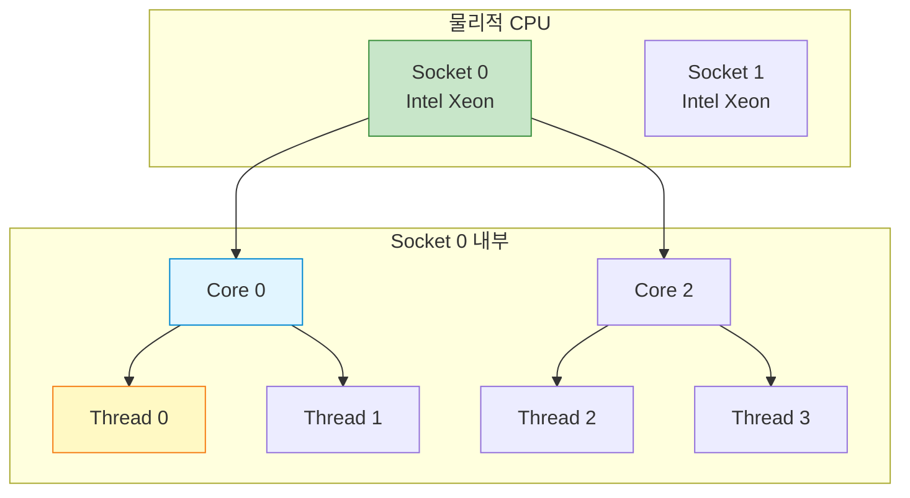
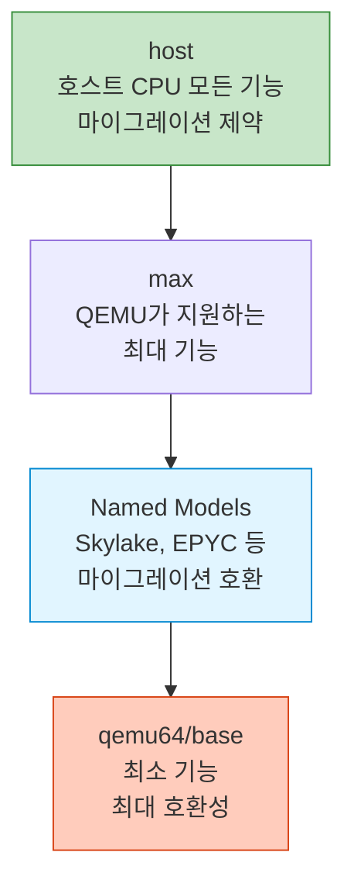
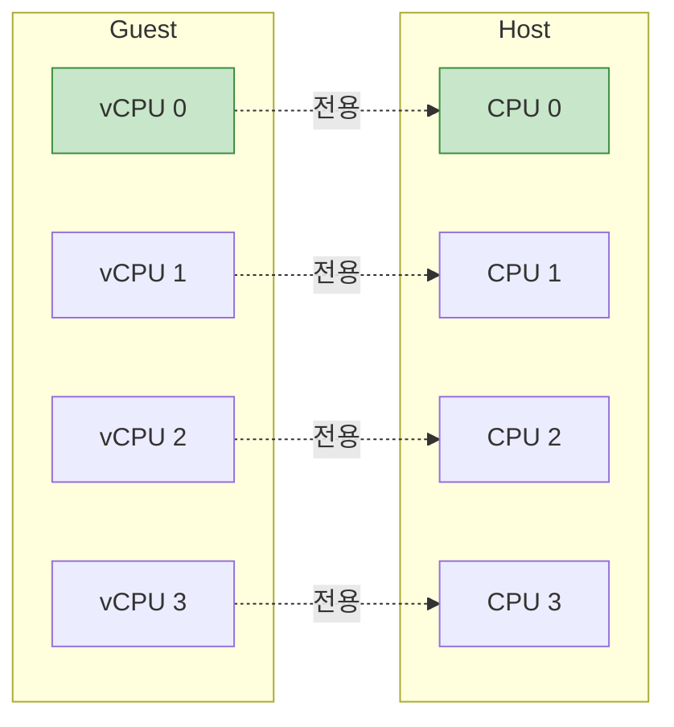

## 들어가며

VM에 CPU를 몇 개 할당해야 할까? **vCPU 설정**은 단순한 개수 이상으로 토폴로지, 모델, 어피니티까지 고려해야 합니다.

## vCPU 토폴로지



### SMP 설정 기본

```bash
# 기본: 4개 vCPU (토폴로지 자동)
qemu-system-x86_64 -smp 4 -m 4G -drive file=ubuntu.qcow2

# 명시적 토폴로지: 2 소켓, 각 2 코어
qemu-system-x86_64 \
  -smp 4,sockets=2,cores=2,threads=1 \
  -m 4G \
  -drive file=ubuntu.qcow2

# 하이퍼스레딩: 2 코어, 각 2 스레드
qemu-system-x86_64 \
  -smp 4,sockets=1,cores=2,threads=2 \
  -m 4G \
  -drive file=ubuntu.qcow2
```

### 토폴로지 확인

```bash
# VM 내부에서 확인
lscpu

Architecture:        x86_64
CPU(s):              4
Thread(s) per core:  2
Core(s) per socket:  2
Socket(s):           1

# /proc/cpuinfo로 확인
cat /proc/cpuinfo | grep -E "(processor|physical id|core id|cpu cores)"

processor       : 0
physical id     : 0
core id         : 0
cpu cores       : 2

processor       : 1
physical id     : 0
core id         : 0    # Core 0의 Thread 1
cpu cores       : 2
```

## CPU 토폴로지 전략

### 단일 소켓 vs 다중 소켓

```bash
# 시나리오 1: 8 vCPU, 단일 소켓
qemu-system-x86_64 -smp 8,sockets=1,cores=8,threads=1

# 장점: 메모리 지연 시간 낮음, NUMA 문제 없음
# 단점: 일부 소프트웨어가 소켓 수로 라이선싱

# 시나리오 2: 8 vCPU, 2 소켓
qemu-system-x86_64 -smp 8,sockets=2,cores=4,threads=1

# 장점: 소켓 기반 라이선싱 유리
# 단점: NUMA 고려 필요
```

### 하이퍼스레딩 에뮬레이션

```bash
# 하이퍼스레딩 없음 (권장)
qemu-system-x86_64 -smp 8,sockets=1,cores=8,threads=1

# 하이퍼스레딩 에뮬레이션
qemu-system-x86_64 -smp 8,sockets=1,cores=4,threads=2

# 주의: VM의 HT는 성능 향상이 제한적
# 호스트 CPU의 실제 HT 활용이 더 중요
```

### 토폴로지 비교표

| 설정 | vCPU | Sockets | Cores | Threads | 용도 |
|------|------|---------|-------|---------|------|
| 1,1,1,1 | 1 | 1 | 1 | 1 | 최소 구성 |
| 4,1,4,1 | 4 | 1 | 4 | 1 | **일반적** |
| 4,2,2,1 | 4 | 2 | 2 | 1 | 소켓 라이선싱 |
| 8,1,4,2 | 8 | 1 | 4 | 2 | HT 에뮬레이션 |
| 16,2,8,1 | 16 | 2 | 8 | 1 | 고성능 서버 |

## CPU 모델 선택

### CPU 모델 계층



### CPU 모델 확인

```bash
# 사용 가능한 모든 CPU 모델
qemu-system-x86_64 -cpu help | head -20

x86 486
x86 Broadwell
x86 Broadwell-IBRS
x86 Cascadelake-Server
x86 Conroe
x86 EPYC
x86 EPYC-Rome
x86 Haswell
x86 IvyBridge
x86 Nehalem
x86 Penryn
x86 SandyBridge
x86 Skylake-Client
x86 Skylake-Server
x86 Westmere
x86 host

# 특정 모델의 기능 확인
qemu-system-x86_64 -cpu Skylake-Server,enforce -enable-kvm
```

### CPU 모델 사용 예시

```bash
# 1. host - 최고 성능, 마이그레이션 제약
qemu-system-x86_64 \
  -enable-kvm \
  -cpu host \
  -smp 4

# 2. 명명된 모델 - 마이그레이션 가능
qemu-system-x86_64 \
  -enable-kvm \
  -cpu Skylake-Server \
  -smp 4

# 3. 기능 추가/제거
qemu-system-x86_64 \
  -enable-kvm \
  -cpu Skylake-Server,+avx512f,-pcid \
  -smp 4

# 4. 커스텀 CPU 정의
qemu-system-x86_64 \
  -enable-kvm \
  -cpu qemu64,+ssse3,+sse4.1,+sse4.2,+x2apic \
  -smp 4
```

### CPU 기능 플래그

```bash
# 중요한 CPU 기능들

# 보안 기능
-cpu host,+spec-ctrl,+ssbd    # Spectre/Meltdown 완화

# 성능 기능
-cpu host,+pdpe1gb            # 1GB 페이지 지원
-cpu host,+avx,+avx2          # AVX 명령어

# 가상화 기능
-cpu host,+vmx                # Nested 가상화 (Intel)
-cpu host,+svm                # Nested 가상화 (AMD)
```

## vCPU 어피니티 (Affinity)

### 1:1 피닝



### vCPU 스레드 피닝

```bash
#!/bin/bash
# vcpu_pinning.sh

VM_PID=$1

if [ -z "$VM_PID" ]; then
    echo "Usage: $0 <qemu_pid>"
    exit 1
fi

# 1. vCPU 스레드 찾기
echo "Finding vCPU threads for PID $VM_PID..."

# QEMU는 각 vCPU를 별도 스레드로 실행
ps -T -p $VM_PID | grep "CPU " > /tmp/vcpu_threads.txt

# 2. 각 vCPU를 호스트 CPU에 피닝
CPU_ID=0
while read -r line; do
    THREAD_ID=$(echo $line | awk '{print $2}')
    THREAD_NAME=$(echo $line | awk '{print $NF}')

    echo "Pinning $THREAD_NAME (TID: $THREAD_ID) to CPU $CPU_ID"
    taskset -cp $CPU_ID $THREAD_ID

    CPU_ID=$((CPU_ID + 1))
done < /tmp/vcpu_threads.txt

rm /tmp/vcpu_threads.txt
echo "vCPU pinning completed"
```

### 사용 예시

```bash
# 1. VM 시작
qemu-system-x86_64 \
  -enable-kvm \
  -cpu host \
  -smp 4 \
  -m 4G \
  -drive file=ubuntu.qcow2 \
  -name test-vm &

# 2. PID 확인
VM_PID=$(pgrep -f "test-vm")

# 3. vCPU 피닝 적용
./vcpu_pinning.sh $VM_PID

Finding vCPU threads for PID 12345...
Pinning CPU 0/KVM (TID: 12346) to CPU 0
Pinning CPU 1/KVM (TID: 12347) to CPU 1
Pinning CPU 2/KVM (TID: 12348) to CPU 2
Pinning CPU 3/KVM (TID: 12349) to CPU 3
vCPU pinning completed

# 4. 확인
taskset -cp $VM_PID
pid 12345's current affinity list: 0-3
```

## CPU 성능 튜닝

### CPU Governor 설정

```bash
# 호스트에서 성능 모드 설정
for cpu in /sys/devices/system/cpu/cpu*/cpufreq/scaling_governor; do
    echo performance | sudo tee $cpu
done

# 확인
cat /sys/devices/system/cpu/cpu0/cpufreq/scaling_governor
performance

# 주파수 확인
cat /sys/devices/system/cpu/cpu0/cpufreq/scaling_cur_freq
3500000  # 3.5 GHz
```

### C-States 비활성화

```bash
# 지연 시간 최소화를 위해 C-States 비활성화
# /etc/default/grub 수정
GRUB_CMDLINE_LINUX="intel_idle.max_cstate=0 processor.max_cstate=1"

# AMD의 경우
GRUB_CMDLINE_LINUX="processor.max_cstate=1"

# 적용
sudo update-grub
sudo reboot
```

### Turbo Boost 제어

```bash
# Turbo Boost 상태 확인
cat /sys/devices/system/cpu/intel_pstate/no_turbo
0  # 0=활성화, 1=비활성화

# Turbo Boost 비활성화 (일관된 성능)
echo 1 | sudo tee /sys/devices/system/cpu/intel_pstate/no_turbo

# 또는 부팅 시
# /etc/default/grub
GRUB_CMDLINE_LINUX="intel_pstate=disable"
```

## CPU 오버커밋

### 오버커밋 비율

```bash
# 물리 CPU 8개, VM vCPU 합계 16개 = 2:1 오버커밋

# VM 1: 4 vCPU
qemu-system-x86_64 -smp 4 -m 4G -drive file=vm1.qcow2 &

# VM 2: 4 vCPU
qemu-system-x86_64 -smp 4 -m 4G -drive file=vm2.qcow2 &

# VM 3: 4 vCPU
qemu-system-x86_64 -smp 4 -m 4G -drive file=vm3.qcow2 &

# VM 4: 4 vCPU
qemu-system-x86_64 -smp 4 -m 4G -drive file=vm4.qcow2 &

# 총 16 vCPU / 8 pCPU = 2:1 오버커밋
```

### 오버커밋 가이드라인

| 워크로드 유형 | 권장 비율 | 최대 비율 |
|---------------|-----------|-----------|
| CPU 집약적 (컴파일, 인코딩) | 1:1 | 1.5:1 |
| 균형 잡힌 (웹 서버) | 2:1 | 4:1 |
| I/O 집약적 (데이터베이스) | 2:1 | 3:1 |
| 유휴 상태 많음 (개발) | 4:1 | 8:1 |

### CPU Shares (cgroups)

```bash
# cgroups로 CPU 비율 제어

# VM 1: 높은 우선순위 (2048 shares)
echo 2048 > /sys/fs/cgroup/cpu/qemu-vm1/cpu.shares

# VM 2: 낮은 우선순위 (1024 shares)
echo 1024 > /sys/fs/cgroup/cpu/qemu-vm2/cpu.shares

# VM 1은 VM 2의 2배 CPU 시간 할당
```

## 실전 예제

### 데이터베이스 서버 설정

```bash
#!/bin/bash
# database_vm.sh

# 고성능 데이터베이스 VM
# - CPU 집중적
# - 지연 시간 민감
# - 1:1 vCPU 피닝

qemu-system-x86_64 \
  -enable-kvm \
  -cpu host,+spec-ctrl,+ssbd \
  -smp 8,sockets=1,cores=8,threads=1 \
  -m 32G \
  -mem-path /dev/hugepages \
  -mem-prealloc \
  -drive file=postgres.qcow2,if=none,id=disk0,cache=none,aio=native \
  -device virtio-blk-pci,drive=disk0 \
  -name "postgres-vm" \
  -daemonize

# vCPU 피닝
VM_PID=$(pgrep -f "postgres-vm")
./vcpu_pinning.sh $VM_PID

# CPU를 성능 모드로
for cpu in {0..7}; do
    echo performance | sudo tee /sys/devices/system/cpu/cpu$cpu/cpufreq/scaling_governor
done
```

### 웹 서버 클러스터

```bash
#!/bin/bash
# web_cluster.sh

# 3개의 웹 서버 VM (오버커밋 허용)
# - CPU 사용률 낮음
# - 2:1 오버커밋

for i in {1..3}; do
    qemu-system-x86_64 \
      -enable-kvm \
      -cpu Skylake-Server \
      -smp 4,sockets=1,cores=4,threads=1 \
      -m 8G \
      -drive file=web${i}.qcow2 \
      -netdev tap,id=net0 \
      -device virtio-net-pci,netdev=net0 \
      -name "web-server-${i}" \
      -daemonize

    echo "Started web-server-${i}"
done

# 총 12 vCPU on 8 pCPU
```

## 성능 모니터링

### vCPU 사용률 확인

```bash
#!/bin/bash
# monitor_vcpu.sh

VM_PID=$1

# vCPU 스레드 CPU 사용률
top -H -p $VM_PID -n 1 | grep "CPU "

# 출력 예시:
# 12346  user  20   0  8.2g 4.1g    0 R  98.0  51.2   5:23.45 CPU 0/KVM
# 12347  user  20   0  8.2g 4.1g    0 R  75.3  51.2   4:12.33 CPU 1/KVM
# 12348  user  20   0  8.2g 4.1g    0 R  45.2  51.2   2:45.12 CPU 2/KVM
# 12349  user  20   0  8.2g 4.1g    0 S   2.1  51.2   0:34.56 CPU 3/KVM
```

### perf를 통한 분석

```bash
# vCPU 성능 프로파일링
sudo perf record -p <vm_pid> -a -g sleep 10
sudo perf report

# KVM 이벤트 추적
sudo perf kvm stat live -p <vm_pid>
```

### QMP를 통한 모니터링

```python
#!/usr/bin/env python3
# vcpu_monitor.py

import socket
import json
import time

class QMPClient:
    # ... (이전과 동일)

    def get_vcpu_stats(self):
        return self.execute('query-cpus-fast')

client = QMPClient('/tmp/qmp.sock')

while True:
    vcpus = client.get_vcpu_stats()

    print("\n=== vCPU Statistics ===")
    for vcpu in vcpus:
        print(f"vCPU {vcpu['cpu-index']}: "
              f"Thread {vcpu['thread-id']}")

    time.sleep(5)
```

## 트러블슈팅

### CPU 성능 저하

```bash
# 문제 1: vCPU가 특정 pCPU에 몰림
# 해결: 피닝 재조정

# 문제 2: 컨텍스트 스위칭 과다
# 확인
vmstat 1

procs -----------memory---------- ---swap-- -----io---- -system-- ------cpu-----
 r  b   swpd   free   buff  cache   si   so    bi    bo   in   cs us sy id wa st
 4  0      0 4123456  78912 2345678   0    0     0    12  456 8923 25 10 65  0  0

# cs (context switches)가 너무 높으면 vCPU 수 감소 고려

# 문제 3: NUMA 불균형
numastat

                           node0           node1
numa_hit              9876543210        123456789  # 불균형!
numa_miss                  54321           123456
```

## 다음 단계

vCPU 관리를 마스터했습니다! 다음 글에서는:
- **메모리 관리와 Ballooning**
- 메모리 오버커밋
- 메모리 성능 최적화

---

**시리즈 목차**
1-11. [이전 글들]
12. **vCPU 설정과 성능** ← 현재 글

> 💡 **Quick Tip**: vCPU 수는 많다고 좋은 것이 아닙니다. 워크로드가 실제로 사용하는 CPU 수에 맞춰 설정하세요. 과도한 vCPU는 오히려 성능을 저하시킬 수 있습니다!
