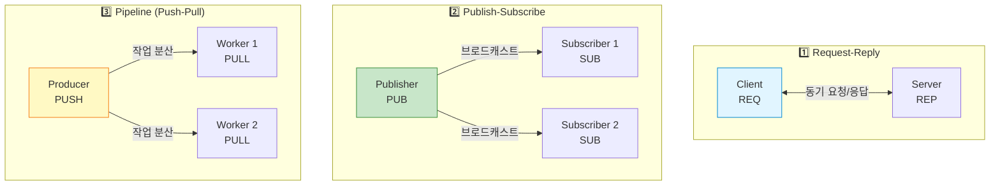
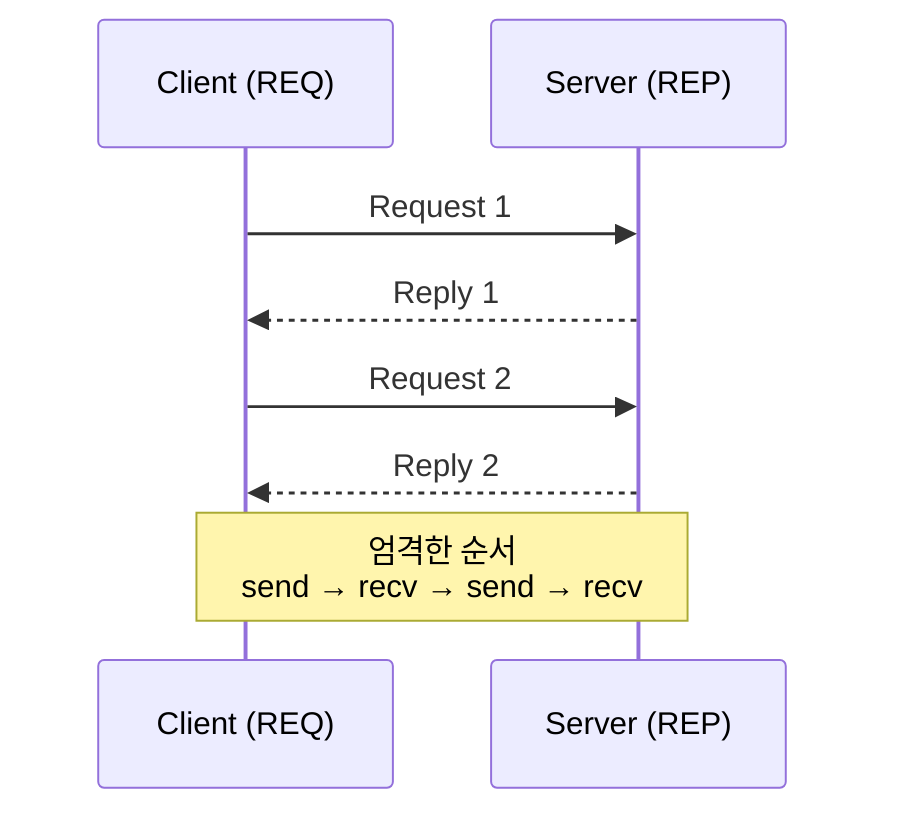
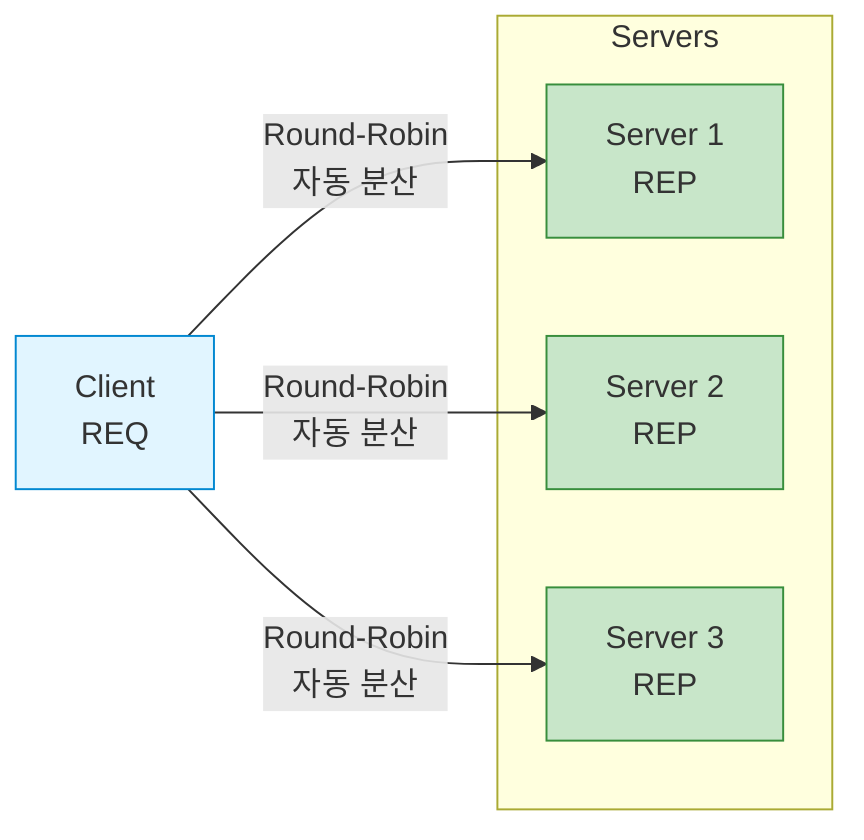
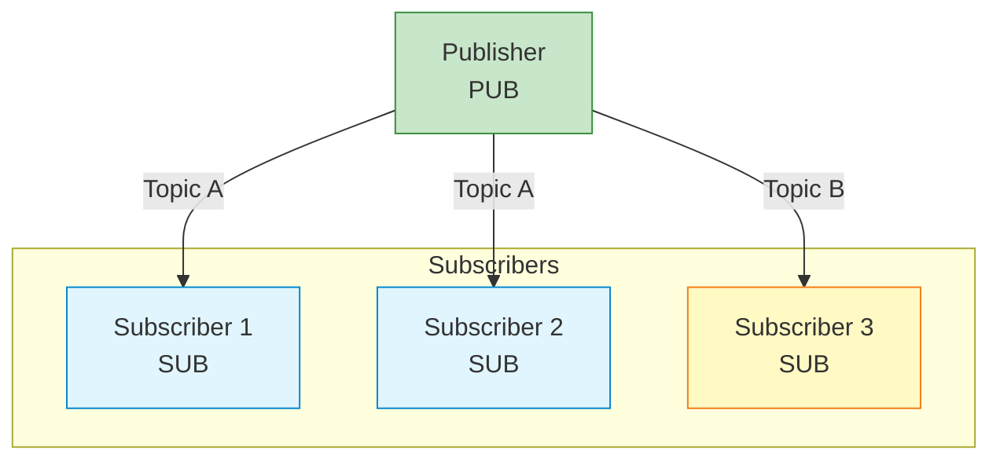
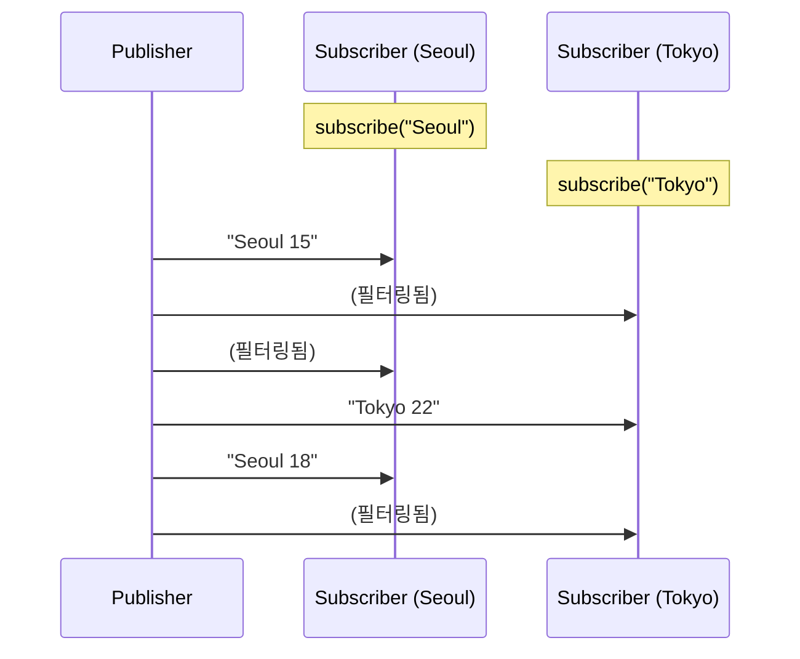
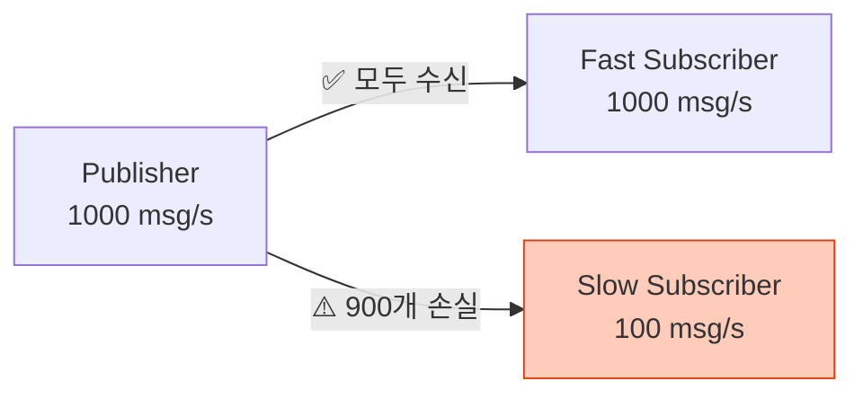
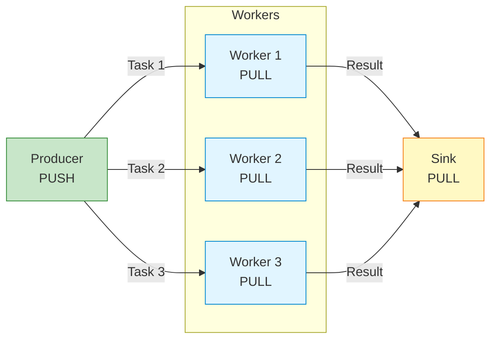
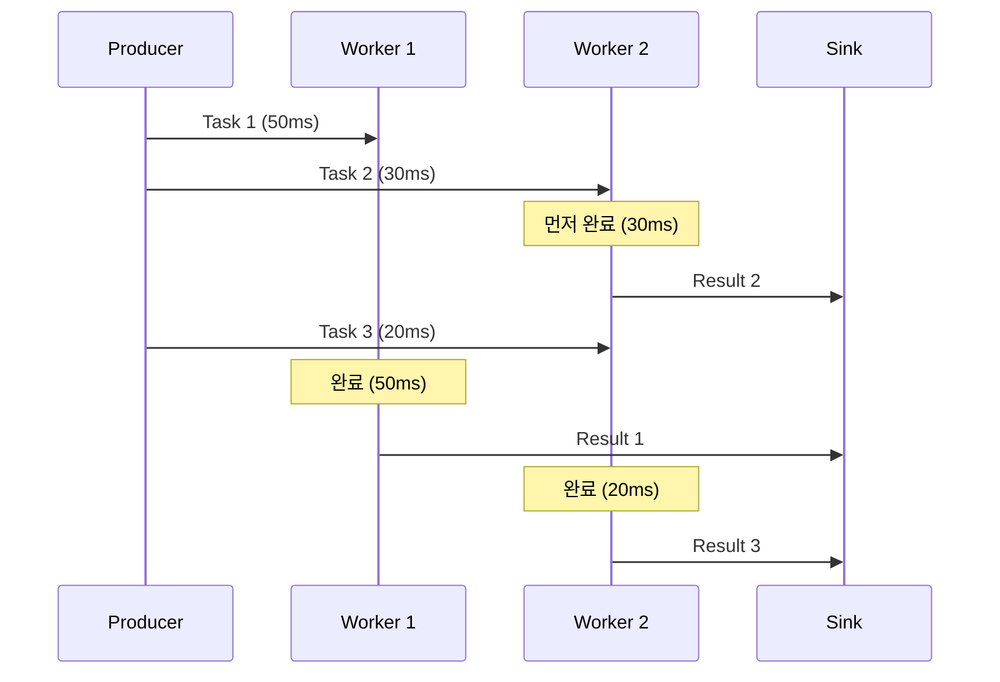
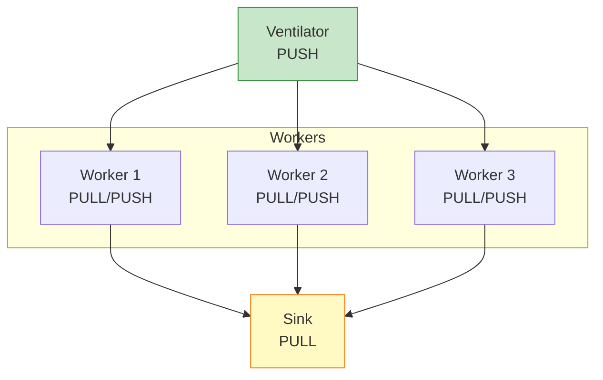
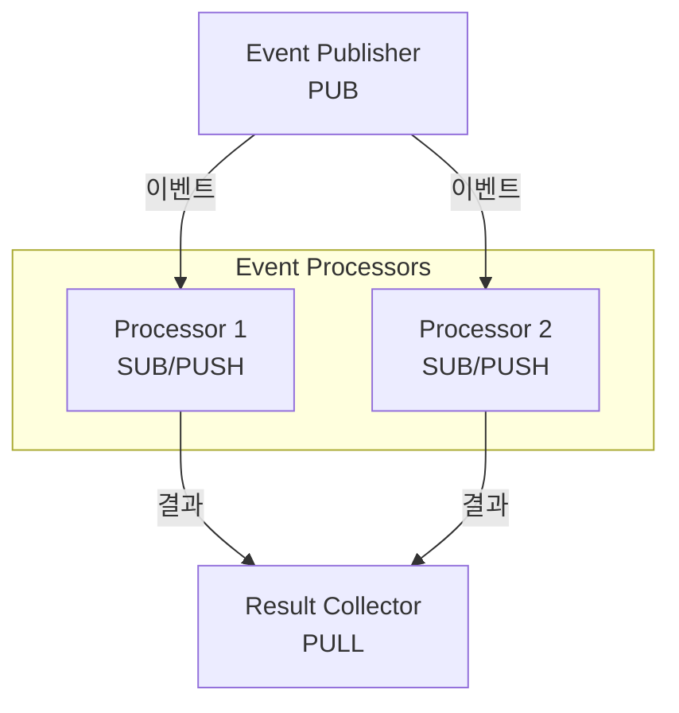

## 들어가며

ZeroMQ의 진정한 힘은 **메시징 패턴**에 있습니다. 소켓 타입만 바꾸면 완전히 다른 통신 방식을 구현할 수 있습니다. 3가지 핵심 패턴을 깊이 파헤쳐봅시다.

## 패턴 개요



## 1. Request-Reply 패턴

### 개념

**REQ-REP**는 가장 기본적인 패턴으로, **클라이언트-서버** 모델입니다.



### 특징

- **동기 통신**: 응답을 받기 전에 다음 요청 불가
- **1:1 대응**: 요청마다 정확히 1개의 응답
- **순서 보장**: REQ는 `send → recv`, REP는 `recv → send`

### 간단한 RPC 예제

**Server**:

```c
// rpc_server.c
#include <zmq.h>
#include <stdio.h>
#include <string.h>
#include <unistd.h>

int main() {
    void *context = zmq_ctx_new();
    void *responder = zmq_socket(context, ZMQ_REP);
    zmq_bind(responder, "tcp://*:5555");

    printf("RPC 서버 시작...\n");

    while (1) {
        char request[256];
        zmq_recv(responder, request, 256, 0);
        request[255] = '\0';

        printf("호출: %s\n", request);

        // RPC 처리
        char reply[256];
        if (strcmp(request, "add 3 5") == 0) {
            snprintf(reply, 256, "Result: 8");
        } else if (strcmp(request, "mul 4 6") == 0) {
            snprintf(reply, 256, "Result: 24");
        } else {
            snprintf(reply, 256, "Unknown command");
        }

        zmq_send(responder, reply, strlen(reply), 0);
    }

    zmq_close(responder);
    zmq_ctx_destroy(context);
    return 0;
}
```

**Client**:

```c
// rpc_client.c
#include <zmq.h>
#include <stdio.h>
#include <string.h>

int main() {
    void *context = zmq_ctx_new();
    void *requester = zmq_socket(context, ZMQ_REQ);
    zmq_connect(requester, "tcp://localhost:5555");

    char *commands[] = {"add 3 5", "mul 4 6", "unknown"};

    for (int i = 0; i < 3; i++) {
        // 요청
        zmq_send(requester, commands[i], strlen(commands[i]), 0);

        // 응답
        char buffer[256];
        zmq_recv(requester, buffer, 256, 0);
        buffer[255] = '\0';

        printf("%s => %s\n", commands[i], buffer);
    }

    zmq_close(requester);
    zmq_ctx_destroy(context);
    return 0;
}
```

### 실행 결과

```bash
# Server 출력:
호출: add 3 5
호출: mul 4 6
호출: unknown

# Client 출력:
add 3 5 => Result: 8
mul 4 6 => Result: 24
unknown => Unknown command
```

### 다중 REP 서버 (로드 밸런싱)



**특징**: 여러 REP 서버가 같은 주소에 연결하면, ZeroMQ가 자동으로 로드 밸런싱!

```c
// 서버 3개를 같은 포트로 실행
// Terminal 1-3
./rpc_server  // 모두 tcp://*:5555에 bind

// Client는 자동으로 분산됨
./rpc_client
```

## 2. Publish-Subscribe 패턴

### 개념

**PUB-SUB**는 **브로드캐스트** 패턴입니다. Publisher는 Subscriber를 몰라도 됩니다.



### 특징

- **단방향**: Publisher → Subscriber만 가능
- **토픽 기반 필터링**: Subscriber가 원하는 토픽만 수신
- **동적 연결**: Subscriber는 언제든 연결/해제 가능
- **메시지 손실 가능**: Subscriber가 없으면 메시지 버려짐

### 날씨 정보 브로드캐스트 예제

**Publisher**:

```c
// weather_publisher.c
#include <zmq.h>
#include <stdio.h>
#include <stdlib.h>
#include <unistd.h>

int main() {
    void *context = zmq_ctx_new();
    void *publisher = zmq_socket(context, ZMQ_PUB);
    zmq_bind(publisher, "tcp://*:5556");

    printf("날씨 Publisher 시작...\n");

    while (1) {
        // 랜덤 도시와 온도
        char *cities[] = {"Seoul", "Tokyo", "NewYork"};
        char *city = cities[rand() % 3];
        int temp = rand() % 40 - 10;  // -10 ~ 30도

        char update[100];
        snprintf(update, 100, "%s %d", city, temp);

        // 메시지 전송 (토픽: 도시명)
        zmq_send(publisher, update, strlen(update), 0);
        printf("전송: %s\n", update);

        sleep(1);
    }

    zmq_close(publisher);
    zmq_ctx_destroy(context);
    return 0;
}
```

**Subscriber**:

```c
// weather_subscriber.c
#include <zmq.h>
#include <stdio.h>
#include <string.h>

int main(int argc, char *argv[]) {
    if (argc < 2) {
        printf("Usage: %s <city>\n", argv[0]);
        return 1;
    }

    void *context = zmq_ctx_new();
    void *subscriber = zmq_socket(context, ZMQ_SUB);
    zmq_connect(subscriber, "tcp://localhost:5556");

    // 토픽 구독 (특정 도시만)
    zmq_setsockopt(subscriber, ZMQ_SUBSCRIBE, argv[1], strlen(argv[1]));

    printf("%s 날씨 구독 중...\n", argv[1]);

    while (1) {
        char update[100];
        int size = zmq_recv(subscriber, update, 100, 0);
        update[size] = '\0';

        char city[50];
        int temp;
        sscanf(update, "%s %d", city, &temp);

        printf("🌡️  %s: %d°C\n", city, temp);
    }

    zmq_close(subscriber);
    zmq_ctx_destroy(context);
    return 0;
}
```

### 실행

```bash
# Terminal 1: Publisher
./weather_publisher

# Terminal 2: Seoul 구독
./weather_subscriber Seoul
# 출력: 🌡️  Seoul: 15°C

# Terminal 3: Tokyo 구독
./weather_subscriber Tokyo
# 출력: 🌡️  Tokyo: 22°C
```

### 동작 과정



### 여러 토픽 구독

```c
// 여러 토픽 구독
zmq_setsockopt(subscriber, ZMQ_SUBSCRIBE, "Seoul", 5);
zmq_setsockopt(subscriber, ZMQ_SUBSCRIBE, "Tokyo", 5);

// 모든 토픽 구독
zmq_setsockopt(subscriber, ZMQ_SUBSCRIBE, "", 0);
```

### Slow Subscriber 문제



**해결책**: High Water Mark (HWM) 설정

```c
// 버퍼 크기 제한 (기본 1000)
int hwm = 10000;
zmq_setsockopt(publisher, ZMQ_SNDHWM, &hwm, sizeof(hwm));
```

## 3. Pipeline (PUSH-PULL) 패턴

### 개념

**PUSH-PULL**은 **작업 분산** 패턴입니다. 병렬 처리에 최적화되어 있습니다.



### 특징

- **단방향**: PUSH → PULL
- **로드 밸런싱**: 자동으로 유휴 Worker에 분산
- **파이프라인**: Producer → Worker → Sink

### 이미지 처리 파이프라인 예제

**Producer (작업 생성)**:

```c
// task_producer.c
#include <zmq.h>
#include <stdio.h>
#include <stdlib.h>
#include <unistd.h>

int main() {
    void *context = zmq_ctx_new();
    void *sender = zmq_socket(context, ZMQ_PUSH);
    zmq_bind(sender, "tcp://*:5557");

    printf("Producer: 작업 전송 시작\n");
    sleep(1);  // Worker들이 연결될 때까지 대기

    for (int task = 0; task < 100; task++) {
        int workload = rand() % 100 + 1;  // 1-100ms

        char message[20];
        snprintf(message, 20, "%d", workload);

        zmq_send(sender, message, strlen(message), 0);
        printf("Task %d: %dms\n", task, workload);
    }

    zmq_close(sender);
    zmq_ctx_destroy(context);
    return 0;
}
```

**Worker (작업 처리)**:

```c
// task_worker.c
#include <zmq.h>
#include <stdio.h>
#include <stdlib.h>
#include <unistd.h>

int main() {
    void *context = zmq_ctx_new();

    // Producer로부터 받기
    void *receiver = zmq_socket(context, ZMQ_PULL);
    zmq_connect(receiver, "tcp://localhost:5557");

    // Sink로 보내기
    void *sender = zmq_socket(context, ZMQ_PUSH);
    zmq_connect(sender, "tcp://localhost:5558");

    printf("Worker %d 시작\n", getpid());

    while (1) {
        char message[20];
        zmq_recv(receiver, message, 20, 0);

        int workload = atoi(message);
        printf("Worker %d: %dms 작업 처리 중...\n", getpid(), workload);

        // 작업 시뮬레이션
        usleep(workload * 1000);

        // 결과 전송
        zmq_send(sender, "OK", 2, 0);
    }

    zmq_close(receiver);
    zmq_close(sender);
    zmq_ctx_destroy(context);
    return 0;
}
```

**Sink (결과 수집)**:

```c
// task_sink.c
#include <zmq.h>
#include <stdio.h>
#include <sys/time.h>

int main() {
    void *context = zmq_ctx_new();
    void *receiver = zmq_socket(context, ZMQ_PULL);
    zmq_bind(receiver, "tcp://*:5558");

    // 첫 메시지 대기 (시작 시간 측정)
    char message[10];
    zmq_recv(receiver, message, 10, 0);

    struct timeval start;
    gettimeofday(&start, NULL);

    // 99개 더 받기
    for (int task = 1; task < 100; task++) {
        zmq_recv(receiver, message, 10, 0);

        if (task % 10 == 0) {
            printf(".");
            fflush(stdout);
        }
    }

    struct timeval end;
    gettimeofday(&end, NULL);

    long elapsed = (end.tv_sec - start.tv_sec) * 1000 +
                   (end.tv_usec - start.tv_usec) / 1000;

    printf("\n총 시간: %ld ms\n", elapsed);

    zmq_close(receiver);
    zmq_ctx_destroy(context);
    return 0;
}
```

### 실행

```bash
# Terminal 1: Sink
./task_sink

# Terminal 2-4: Workers (3개)
./task_worker
./task_worker
./task_worker

# Terminal 5: Producer
./task_producer

# Sink 출력:
..........
총 시간: 1523 ms
```

### 동작 과정



## 패턴 조합

### Ventilator-Worker-Sink



### PUB-SUB + PUSH-PULL



## 패턴 선택 가이드

| 요구사항 | 추천 패턴 |
|----------|-----------|
| **요청-응답 필요** | REQ-REP |
| **1:N 브로드캐스트** | PUB-SUB |
| **작업 분산** | PUSH-PULL |
| **양방향 대화** | REQ-REP 또는 DEALER-ROUTER |
| **실시간 이벤트** | PUB-SUB |

## 다음 단계

3가지 기본 패턴을 마스터했습니다! 다음 글에서는:
- **ROUTER, DEALER** - 고급 비동기 패턴
- Proxy 패턴
- 복잡한 토폴로지 구축

---

**시리즈 목차**
1. ZeroMQ란 무엇인가 - 고성능 메시징 라이브러리
2. **ZeroMQ 메시징 패턴 - REQ/REP, PUB/SUB, PUSH/PULL** ← 현재 글
3. ZeroMQ 고급 패턴 - ROUTER, DEALER, PROXY (다음 글)
4. ZeroMQ 실전 활용 - 분산 시스템 구축
5. ZeroMQ 성능 최적화 및 보안

> 💡 **Quick Tip**: PUB-SUB는 "fire-and-forget" 방식입니다. Subscriber가 없으면 메시지가 사라지므로, 중요한 데이터는 REQ-REP나 PUSH-PULL을 사용하세요!
