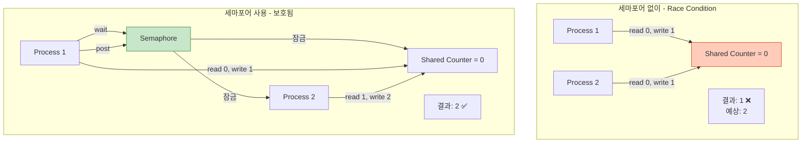
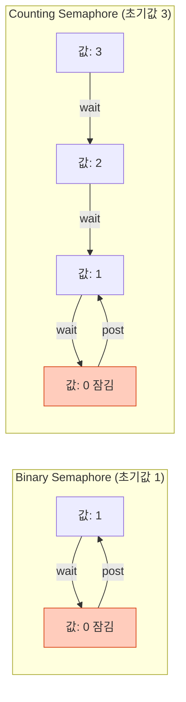
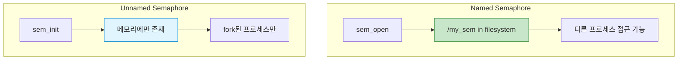
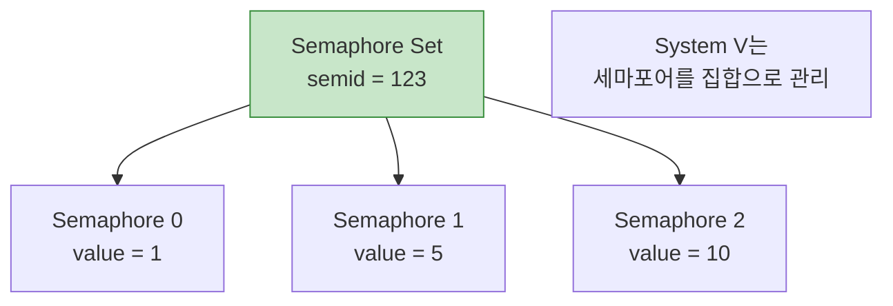
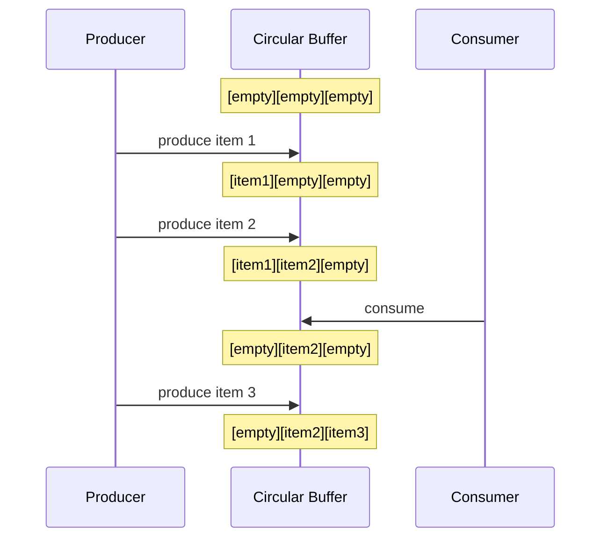
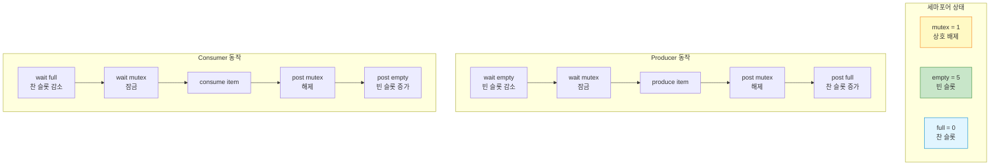
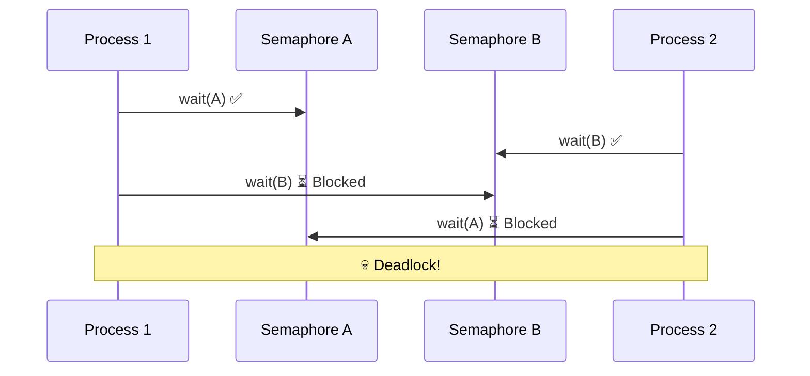

## 들어가며

**Semaphore**는 IPC의 동기화 도구입니다. 여러 프로세스가 공유 자원에 접근할 때 **경쟁 조건(Race Condition)**을 방지하고, **순서를 보장**합니다.

## Semaphore의 개념

### 기본 원리



### 핵심 연산

```c
// P 연산 (wait, down): 세마포어 감소
sem_wait(sem);  // value--; if (value < 0) block;

// V 연산 (post, up): 세마포어 증가
sem_post(sem);  // value++; wake_one_waiting_process();
```

## Binary vs Counting Semaphore

### 비교표

| 항목 | Binary Semaphore | Counting Semaphore |
|------|------------------|-------------------|
| **값 범위** | 0 또는 1 | 0 이상의 정수 |
| **용도** | 상호 배제 (Mutex) | 자원 카운팅 |
| **초기값** | 1 | N (자원 개수) |
| **예시** | 임계 영역 보호 | 연결 풀, 버퍼 관리 |



### 사용 예시

```c
// Binary Semaphore: 파일 접근 보호
sem_t file_mutex;
sem_init(&file_mutex, 0, 1);  // 초기값 1

sem_wait(&file_mutex);  // 잠금
write_to_file();
sem_post(&file_mutex);  // 해제

// Counting Semaphore: 데이터베이스 연결 풀 (최대 5개)
sem_t db_pool;
sem_init(&db_pool, 0, 5);  // 초기값 5

sem_wait(&db_pool);  // 연결 획득
use_db_connection();
sem_post(&db_pool);  // 연결 반환
```

## POSIX Semaphore

### Named vs Unnamed Semaphore



### 1. Named Semaphore

```c
// posix_named_sem.c
#include <stdio.h>
#include <stdlib.h>
#include <semaphore.h>
#include <fcntl.h>
#include <unistd.h>
#include <sys/wait.h>

#define SEM_NAME "/my_semaphore"

int shared_counter = 0;  // 데모용 (실제로는 공유 메모리 사용)

void critical_section(int id) {
    for (int i = 0; i < 5; i++) {
        shared_counter++;
        printf("프로세스 %d: counter = %d\n", id, shared_counter);
        usleep(100000);
    }
}

int main() {
    // Named 세마포어 생성 (초기값 1 = Binary)
    sem_t *sem = sem_open(SEM_NAME, O_CREAT, 0644, 1);
    if (sem == SEM_FAILED) {
        perror("sem_open");
        return 1;
    }

    pid_t pid = fork();

    if (pid == 0) {
        // 자식 프로세스
        sem_wait(sem);  // P 연산
        printf("자식: 임계 영역 진입\n");
        critical_section(1);
        printf("자식: 임계 영역 나감\n");
        sem_post(sem);  // V 연산

        sem_close(sem);
        exit(0);
    } else {
        // 부모 프로세스
        usleep(50000);  // 자식이 먼저 실행되도록

        sem_wait(sem);
        printf("부모: 임계 영역 진입\n");
        critical_section(2);
        printf("부모: 임계 영역 나감\n");
        sem_post(sem);

        wait(NULL);

        sem_close(sem);
        sem_unlink(SEM_NAME);
    }

    return 0;
}
```

### 2. Unnamed Semaphore (프로세스 간)

```c
// posix_unnamed_sem.c
#include <stdio.h>
#include <stdlib.h>
#include <semaphore.h>
#include <sys/mman.h>
#include <unistd.h>
#include <sys/wait.h>

int main() {
    // 공유 메모리에 세마포어 배치
    sem_t *sem = mmap(NULL, sizeof(sem_t),
                      PROT_READ | PROT_WRITE,
                      MAP_SHARED | MAP_ANONYMOUS, -1, 0);

    // 초기화 (pshared=1: 프로세스 간 공유)
    sem_init(sem, 1, 1);

    int *counter = mmap(NULL, sizeof(int),
                        PROT_READ | PROT_WRITE,
                        MAP_SHARED | MAP_ANONYMOUS, -1, 0);
    *counter = 0;

    for (int i = 0; i < 2; i++) {
        if (fork() == 0) {
            // 자식 프로세스
            for (int j = 0; j < 10; j++) {
                sem_wait(sem);
                (*counter)++;
                printf("프로세스 %d: %d\n", getpid(), *counter);
                sem_post(sem);
                usleep(10000);
            }
            exit(0);
        }
    }

    // 부모는 자식들 대기
    wait(NULL);
    wait(NULL);

    printf("\n최종 counter: %d (예상: 20)\n", *counter);

    sem_destroy(sem);
    munmap(sem, sizeof(sem_t));
    munmap(counter, sizeof(int));

    return 0;
}
```

### 실행

```bash
gcc -o named_sem posix_named_sem.c -lpthread
gcc -o unnamed_sem posix_unnamed_sem.c -lpthread

./named_sem
./unnamed_sem
```

## System V Semaphore

### 1. 세마포어 집합 개념



### 2. 기본 사용

```c
// sysv_semaphore.c
#include <stdio.h>
#include <stdlib.h>
#include <sys/sem.h>
#include <sys/ipc.h>
#include <unistd.h>

#define SEM_KEY 1234

// sem_op 헬퍼 함수
void sem_wait(int semid, int sem_num) {
    struct sembuf op = {sem_num, -1, 0};  // -1: P 연산
    semop(semid, &op, 1);
}

void sem_post(int semid, int sem_num) {
    struct sembuf op = {sem_num, 1, 0};   // +1: V 연산
    semop(semid, &op, 1);
}

int main() {
    // 세마포어 생성 (1개짜리 집합)
    int semid = semget(SEM_KEY, 1, IPC_CREAT | 0666);
    if (semid == -1) {
        perror("semget");
        return 1;
    }

    // 초기값 설정
    union semun {
        int val;
        struct semid_ds *buf;
        unsigned short *array;
    } arg;

    arg.val = 1;  // Binary semaphore
    semctl(semid, 0, SETVAL, arg);

    if (fork() == 0) {
        // 자식
        sem_wait(semid, 0);
        printf("자식: 임계 영역 진입\n");
        sleep(2);
        printf("자식: 임계 영역 나감\n");
        sem_post(semid, 0);
        exit(0);
    } else {
        // 부모
        usleep(100000);
        printf("부모: 대기 중...\n");
        sem_wait(semid, 0);
        printf("부모: 임계 영역 진입\n");
        sem_post(semid, 0);

        wait(NULL);

        // 삭제
        semctl(semid, 0, IPC_RMID);
    }

    return 0;
}
```

### 3. Atomic 연산 (여러 세마포어)

```c
// atomic_operations.c
#include <stdio.h>
#include <sys/sem.h>

int main() {
    int semid = semget(1234, 2, IPC_CREAT | 0666);

    // 초기화
    semctl(semid, 0, SETVAL, (union semun){.val = 5});
    semctl(semid, 1, SETVAL, (union semun){.val = 3});

    // Atomic 연산: 두 세마포어를 동시에 획득
    struct sembuf ops[] = {
        {0, -2, 0},  // sem[0]에서 2 감소
        {1, -1, 0}   // sem[1]에서 1 감소
    };

    printf("두 세마포어 동시 획득 시도...\n");
    if (semop(semid, ops, 2) == 0) {
        printf("성공! sem[0]=3, sem[1]=2\n");

        // 반환
        struct sembuf release[] = {
            {0, 2, 0},
            {1, 1, 0}
        };
        semop(semid, release, 2);
    }

    semctl(semid, 0, IPC_RMID);
    return 0;
}
```

## Producer-Consumer 문제

### 문제 정의



### 완전한 구현

```c
// producer_consumer.c
#include <stdio.h>
#include <stdlib.h>
#include <semaphore.h>
#include <fcntl.h>
#include <sys/mman.h>
#include <unistd.h>

#define BUFFER_SIZE 5

typedef struct {
    int buffer[BUFFER_SIZE];
    int in;
    int out;
} shared_buffer_t;

int main() {
    // 공유 메모리
    shared_buffer_t *buf = mmap(NULL, sizeof(shared_buffer_t),
                                PROT_READ | PROT_WRITE,
                                MAP_SHARED | MAP_ANONYMOUS, -1, 0);
    buf->in = 0;
    buf->out = 0;

    // 세마포어 3개
    sem_t *mutex = mmap(NULL, sizeof(sem_t),
                        PROT_READ | PROT_WRITE,
                        MAP_SHARED | MAP_ANONYMOUS, -1, 0);
    sem_t *empty = mmap(NULL, sizeof(sem_t),
                        PROT_READ | PROT_WRITE,
                        MAP_SHARED | MAP_ANONYMOUS, -1, 0);
    sem_t *full = mmap(NULL, sizeof(sem_t),
                       PROT_READ | PROT_WRITE,
                       MAP_SHARED | MAP_ANONYMOUS, -1, 0);

    sem_init(mutex, 1, 1);           // Binary semaphore
    sem_init(empty, 1, BUFFER_SIZE); // Counting: 빈 슬롯
    sem_init(full, 1, 0);            // Counting: 찬 슬롯

    if (fork() == 0) {
        // Producer
        for (int i = 1; i <= 10; i++) {
            sem_wait(empty);  // 빈 슬롯 대기
            sem_wait(mutex);  // 버퍼 잠금

            buf->buffer[buf->in] = i;
            printf("Produced: %d (in=%d)\n", i, buf->in);
            buf->in = (buf->in + 1) % BUFFER_SIZE;

            sem_post(mutex);  // 버퍼 해제
            sem_post(full);   // 찬 슬롯 증가

            usleep(100000);
        }
        exit(0);
    }

    if (fork() == 0) {
        // Consumer
        for (int i = 1; i <= 10; i++) {
            sem_wait(full);   // 찬 슬롯 대기
            sem_wait(mutex);  // 버퍼 잠금

            int item = buf->buffer[buf->out];
            printf("Consumed: %d (out=%d)\n", item, buf->out);
            buf->out = (buf->out + 1) % BUFFER_SIZE;

            sem_post(mutex);  // 버퍼 해제
            sem_post(empty);  // 빈 슬롯 증가

            usleep(200000);
        }
        exit(0);
    }

    // 부모는 대기
    wait(NULL);
    wait(NULL);

    // 정리
    sem_destroy(mutex);
    sem_destroy(empty);
    sem_destroy(full);
    munmap(mutex, sizeof(sem_t));
    munmap(empty, sizeof(sem_t));
    munmap(full, sizeof(sem_t));
    munmap(buf, sizeof(shared_buffer_t));

    return 0;
}
```

### 출력

```bash
gcc -o pc producer_consumer.c -lpthread
./pc

# 출력:
# Produced: 1 (in=0)
# Produced: 2 (in=1)
# Consumed: 1 (out=0)
# Produced: 3 (in=2)
# Consumed: 2 (out=1)
# ...
```

### 동작 원리



## Readers-Writers 문제

```c
// readers_writers.c
#include <stdio.h>
#include <stdlib.h>
#include <semaphore.h>
#include <fcntl.h>
#include <sys/mman.h>
#include <unistd.h>

typedef struct {
    int data;
    int read_count;
} shared_data_t;

int main() {
    shared_data_t *shared = mmap(NULL, sizeof(shared_data_t),
                                 PROT_READ | PROT_WRITE,
                                 MAP_SHARED | MAP_ANONYMOUS, -1, 0);
    shared->data = 0;
    shared->read_count = 0;

    sem_t *rw_mutex = mmap(NULL, sizeof(sem_t),
                           PROT_READ | PROT_WRITE,
                           MAP_SHARED | MAP_ANONYMOUS, -1, 0);
    sem_t *mutex = mmap(NULL, sizeof(sem_t),
                        PROT_READ | PROT_WRITE,
                        MAP_SHARED | MAP_ANONYMOUS, -1, 0);

    sem_init(rw_mutex, 1, 1);  // 쓰기 보호
    sem_init(mutex, 1, 1);     // read_count 보호

    // Writer
    if (fork() == 0) {
        for (int i = 1; i <= 5; i++) {
            sem_wait(rw_mutex);
            shared->data = i * 10;
            printf("Writer: wrote %d\n", shared->data);
            sem_post(rw_mutex);
            sleep(1);
        }
        exit(0);
    }

    // Readers
    for (int i = 0; i < 3; i++) {
        if (fork() == 0) {
            for (int j = 0; j < 3; j++) {
                // 첫 번째 reader만 rw_mutex 획득
                sem_wait(mutex);
                shared->read_count++;
                if (shared->read_count == 1) {
                    sem_wait(rw_mutex);
                }
                sem_post(mutex);

                // 읽기
                printf("Reader %d: read %d\n", i, shared->data);

                // 마지막 reader가 rw_mutex 해제
                sem_wait(mutex);
                shared->read_count--;
                if (shared->read_count == 0) {
                    sem_post(rw_mutex);
                }
                sem_post(mutex);

                usleep(500000);
            }
            exit(0);
        }
    }

    // 모든 자식 대기
    for (int i = 0; i < 4; i++) {
        wait(NULL);
    }

    // 정리
    sem_destroy(rw_mutex);
    sem_destroy(mutex);
    munmap(rw_mutex, sizeof(sem_t));
    munmap(mutex, sizeof(sem_t));
    munmap(shared, sizeof(shared_data_t));

    return 0;
}
```

## 데드락 방지

### 데드락 발생 예



### 해결 방법

```c
// 1. 순서 강제
void safe_acquire(sem_t *sem1, sem_t *sem2) {
    // 항상 주소 순으로 획득
    if (sem1 < sem2) {
        sem_wait(sem1);
        sem_wait(sem2);
    } else {
        sem_wait(sem2);
        sem_wait(sem1);
    }
}

// 2. Timeout
struct timespec timeout;
clock_gettime(CLOCK_REALTIME, &timeout);
timeout.tv_sec += 5;

if (sem_timedwait(sem, &timeout) == -1) {
    if (errno == ETIMEDOUT) {
        // 다른 처리
    }
}
```

## 성능 비교

| 동기화 방법 | 속도 | 사용 난이도 | 용도 |
|------------|------|-------------|------|
| **Atomic 연산** | ⭐⭐⭐⭐⭐ | 높음 | 단순 카운터 |
| **Spinlock** | ⭐⭐⭐⭐ | 중간 | 짧은 임계 영역 |
| **Semaphore** | ⭐⭐⭐ | 중간 | 일반적 동기화 |
| **Mutex** | ⭐⭐⭐ | 낮음 | 상호 배제 |

## 디버깅

### POSIX

```bash
# Named semaphore 확인
ls -l /dev/shm/sem.*

# 삭제
rm /dev/shm/sem.my_semaphore
```

### System V

```bash
# 세마포어 목록
ipcs -s

# 상세 정보
ipcs -s -i <semid>

# 삭제
ipcrm -s <semid>
```

## Best Practices

### 1. 항상 쌍으로 사용

```c
sem_wait(sem);
// 임계 영역
sem_post(sem);  // 절대 잊지 말 것!
```

### 2. 에러 처리

```c
if (sem_wait(sem) == -1) {
    perror("sem_wait");
    // 복구 로직
}
```

### 3. 초기화/정리

```c
// 시작 시
sem_init(sem, 1, initial_value);

// 종료 시
sem_destroy(sem);  // Unnamed
sem_unlink(name);  // Named
```

## 다음 단계

세마포어의 모든 것을 마스터했습니다! 다음 글에서는:
- **Unix Domain Socket** - 로컬 소켓 통신
- Server-Client 구현
- Credentials passing

---

**시리즈 목차**
1. IPC란 무엇인가
2. IPC 메커니즘 전체 개요
3. Pipe - 가장 기본적인 IPC
4. Named Pipe (FIFO)
5. Signal - 비동기 이벤트 통신
6. Shared Memory - 공유 메모리
7. Message Queue 심화
8. **Semaphore 심화** ← 현재 글
9. Unix Domain Socket (다음 글)

> 💡 **Quick Tip**: Producer-Consumer 패턴에서는 3개의 세마포어(mutex, empty, full)가 필요합니다. 순서를 틀리면 데드락이 발생할 수 있으니 주의하세요!
