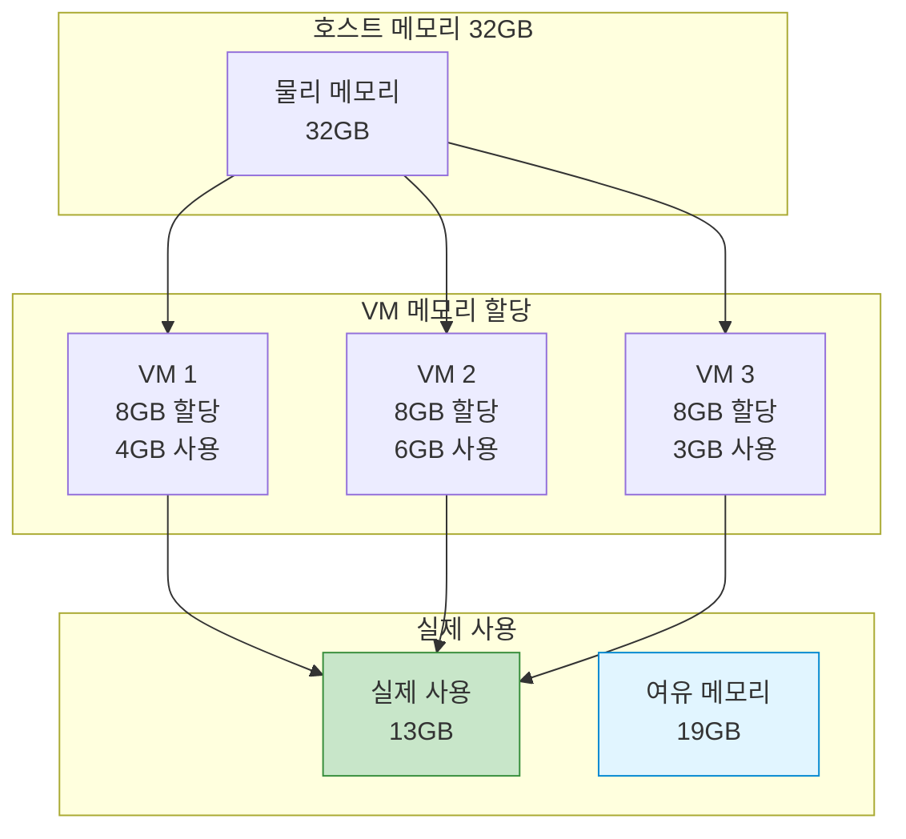
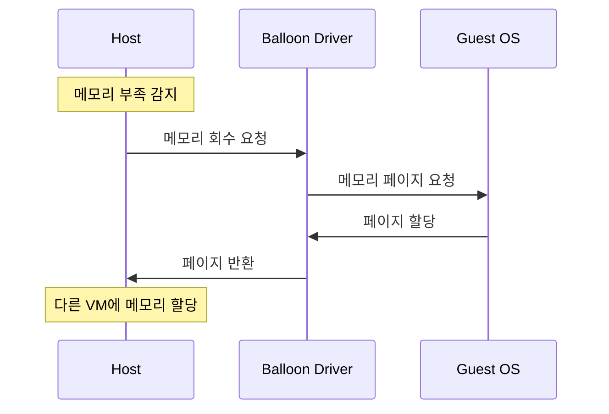
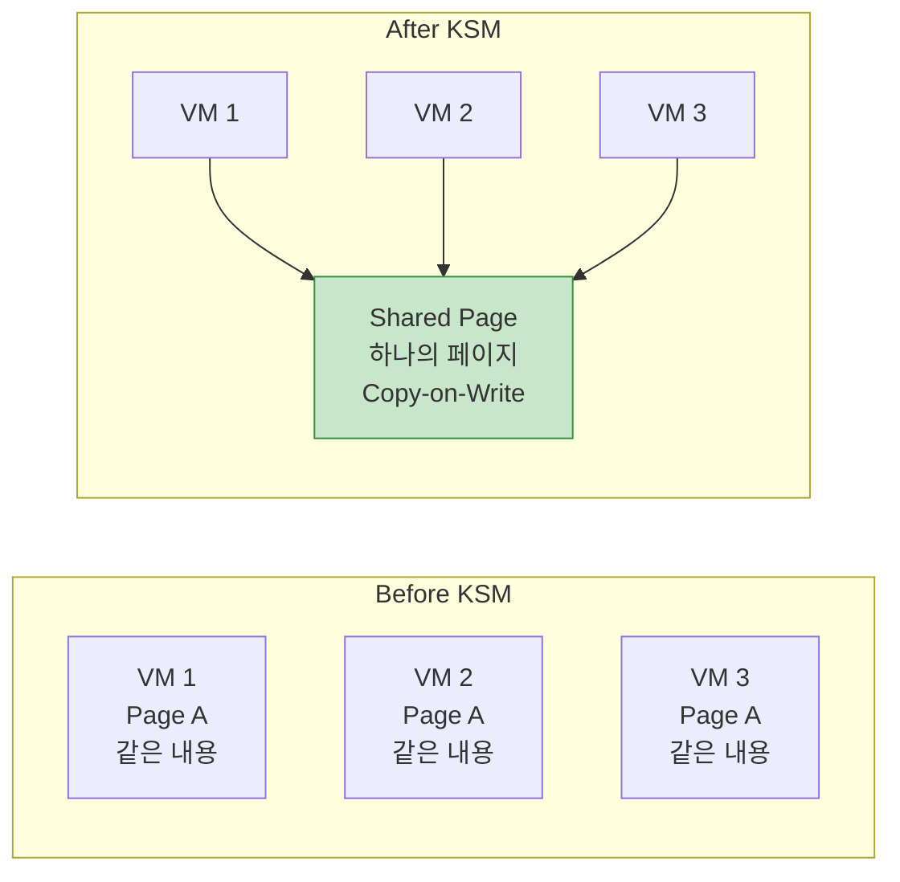

## 들어가며

물리 메모리는 제한적인데 여러 VM을 실행해야 한다면? **메모리 관리 기술**을 통해 제한된 메모리를 효율적으로 활용할 수 있습니다.

## 메모리 할당 방식



### 기본 메모리 할당

```bash
# 기본: 4GB 메모리
qemu-system-x86_64 -m 4G -drive file=ubuntu.qcow2

# 초기/최대 메모리 지정
qemu-system-x86_64 -m 2G,maxmem=8G -drive file=ubuntu.qcow2

# 슬롯 추가 (핫플러그용)
qemu-system-x86_64 \
  -m 4G,slots=4,maxmem=16G \
  -drive file=ubuntu.qcow2
```

### 메모리 백엔드

```bash
# RAM 백엔드 (기본)
qemu-system-x86_64 \
  -object memory-backend-ram,id=mem0,size=4G \
  -m 4G

# 파일 백엔드 (Huge Pages)
qemu-system-x86_64 \
  -object memory-backend-file,id=mem0,size=4G,mem-path=/dev/hugepages,share=on \
  -m 4G

# NUMA와 함께 사용
qemu-system-x86_64 \
  -object memory-backend-ram,id=mem0,size=4G \
  -object memory-backend-ram,id=mem1,size=4G \
  -numa node,nodeid=0,memdev=mem0 \
  -numa node,nodeid=1,memdev=mem1 \
  -smp 8
```

## 메모리 Ballooning

### 개념



### Balloon 드라이버 설정

```bash
# 1. VM 시작 시 balloon 디바이스 추가
qemu-system-x86_64 \
  -m 4G \
  -device virtio-balloon-pci,id=balloon0 \
  -qmp unix:/tmp/qmp.sock,server,nowait \
  -drive file=ubuntu.qcow2

# 2. Guest 내부에서 드라이버 확인 (Linux)
lsmod | grep virtio_balloon
virtio_balloon         20480  0

# 3. QMP로 balloon 조작
echo '{"execute": "qmp_capabilities"}' | nc -U /tmp/qmp.sock
echo '{"execute": "balloon", "arguments": {"value": 2147483648}}' | nc -U /tmp/qmp.sock
# 2GB로 축소 (bytes 단위)

# 4. 현재 balloon 상태 확인
echo '{"execute": "query-balloon"}' | nc -U /tmp/qmp.sock
{"return": {"actual": 2147483648}}  # 2GB
```

### Python Balloon 제어

```python
#!/usr/bin/env python3
# balloon_manager.py

import socket
import json
import time

class BalloonManager:
    def __init__(self, socket_path):
        self.sock = socket.socket(socket.AF_UNIX, socket.SOCK_STREAM)
        self.sock.connect(socket_path)

        # Handshake
        greeting = json.loads(self.sock.recv(4096).decode())
        self.execute('qmp_capabilities')

    def execute(self, command, **args):
        cmd = {'execute': command}
        if args:
            cmd['arguments'] = args

        self.sock.send(json.dumps(cmd).encode() + b'\n')
        response = json.loads(self.sock.recv(4096).decode())
        return response.get('return', {})

    def set_memory(self, size_mb):
        """메모리 크기 설정 (MB)"""
        size_bytes = size_mb * 1024 * 1024
        return self.execute('balloon', value=size_bytes)

    def get_memory(self):
        """현재 메모리 크기 조회 (MB)"""
        result = self.execute('query-balloon')
        return result['actual'] // 1024 // 1024

    def auto_balance(self, target_mb, step_mb=256, interval=5):
        """점진적으로 메모리 조정"""
        current = self.get_memory()
        print(f"Current: {current}MB, Target: {target_mb}MB")

        while current != target_mb:
            if current < target_mb:
                # 증가
                next_size = min(current + step_mb, target_mb)
            else:
                # 감소
                next_size = max(current - step_mb, target_mb)

            print(f"Setting memory to {next_size}MB...")
            self.set_memory(next_size)
            time.sleep(interval)
            current = self.get_memory()

        print(f"Balanced to {target_mb}MB")

# 사용 예
if __name__ == '__main__':
    manager = BalloonManager('/tmp/qmp.sock')

    # 메모리 점진적 축소
    manager.auto_balance(2048, step_mb=256, interval=3)
```

### 사용 예시

```bash
# Python 스크립트로 메모리 조정
python3 balloon_manager.py

Current: 4096MB, Target: 2048MB
Setting memory to 3840MB...
Setting memory to 3584MB...
Setting memory to 3328MB...
Setting memory to 3072MB...
Setting memory to 2816MB...
Setting memory to 2560MB...
Setting memory to 2304MB...
Setting memory to 2048MB...
Balanced to 2048MB
```

## 메모리 오버커밋

### KSM (Kernel Same-page Merging)



### KSM 활성화

```bash
# 1. KSM 활성화
echo 1 | sudo tee /sys/kernel/mm/ksm/run

# 2. KSM 설정 조정
# 스캔 간격 (ms)
echo 100 | sudo tee /sys/kernel/mm/ksm/sleep_millisecs

# 한 번에 스캔할 페이지 수
echo 1000 | sudo tee /sys/kernel/mm/ksm/pages_to_scan

# 3. KSM 통계 확인
cat /sys/kernel/mm/ksm/pages_shared
12543  # 공유 중인 페이지 수

cat /sys/kernel/mm/ksm/pages_sharing
45123  # KSM으로 절약한 페이지 수

# 절약한 메모리 계산
# (pages_sharing * 4KB) / 1024 / 1024 = MB
echo "scale=2; 45123 * 4 / 1024" | bc
176.46 MB 절약
```

### KSM 모니터링

```bash
#!/bin/bash
# ksm_monitor.sh

while true; do
    SHARED=$(cat /sys/kernel/mm/ksm/pages_shared)
    SHARING=$(cat /sys/kernel/mm/ksm/pages_sharing)
    UNSHARED=$(cat /sys/kernel/mm/ksm/pages_unshared)

    SAVED_MB=$(echo "scale=2; $SHARING * 4 / 1024" | bc)

    echo "=== KSM Statistics ==="
    echo "Shared pages: $SHARED"
    echo "Sharing pages: $SHARING"
    echo "Unshared pages: $UNSHARED"
    echo "Memory saved: ${SAVED_MB} MB"
    echo ""

    sleep 10
done
```

### 메모리 오버커밋 전략

```bash
# 호스트: 32GB 물리 메모리

# 전략 1: 보수적 (80% 활용)
# VM 1: 8GB
# VM 2: 8GB
# VM 3: 8GB
# 총: 24GB / 32GB = 75% (안전)

# 전략 2: 적극적 (150% 오버커밋)
# VM 1: 12GB
# VM 2: 12GB
# VM 3: 12GB
# VM 4: 12GB
# 총: 48GB / 32GB = 150% (KSM + Balloon 필수)

# 전략 3: 하이브리드
# 중요 VM: 오버커밋 없음
# 개발 VM: 오버커밋 허용
```

## 메모리 핫플러그

### 메모리 추가 (Hot-add)

```bash
# 1. VM 시작 시 슬롯 예약
qemu-system-x86_64 \
  -m 4G,slots=4,maxmem=16G \
  -object memory-backend-ram,id=mem0,size=4G \
  -qmp unix:/tmp/qmp.sock,server,nowait \
  -drive file=ubuntu.qcow2

# 2. 런타임에 메모리 추가
# 새 메모리 백엔드 생성
echo '{"execute": "object-add", "arguments": {"qom-type": "memory-backend-ram", "id": "mem1", "size": 2147483648}}' | nc -U /tmp/qmp.sock

# 메모리 디바이스 추가
echo '{"execute": "device_add", "arguments": {"driver": "pc-dimm", "id": "dimm1", "memdev": "mem1"}}' | nc -U /tmp/qmp.sock

# 3. Guest에서 확인
free -h
              total        used        free      shared  buff/cache   available
Mem:           6.0G        1.2G        4.5G        12M        320M        4.6G
# 4GB → 6GB로 증가
```

### 메모리 제거 (Hot-remove)

```bash
# 주의: 모든 Guest OS가 메모리 핫플러그를 지원하는 것은 아님

# 1. 디바이스 제거
echo '{"execute": "device_del", "arguments": {"id": "dimm1"}}' | nc -U /tmp/qmp.sock

# 2. 백엔드 제거
echo '{"execute": "object-del", "arguments": {"id": "mem1"}}' | nc -U /tmp/qmp.sock
```

## 메모리 성능 최적화

### Transparent Huge Pages (THP)

```bash
# 1. THP 상태 확인
cat /sys/kernel/mm/transparent_hugepage/enabled
[always] madvise never

# 2. THP 활성화
echo always | sudo tee /sys/kernel/mm/transparent_hugepage/enabled

# 3. Defrag 설정
echo defer | sudo tee /sys/kernel/mm/transparent_hugepage/defrag

# 4. 통계 확인
grep AnonHugePages /proc/meminfo
AnonHugePages:   4194304 kB  # 4GB가 THP 사용 중
```

### 메모리 Pre-allocation

```bash
# 메모리 사전 할당 (VM 시작 시간 증가, 성능 향상)
qemu-system-x86_64 \
  -m 4G \
  -mem-prealloc \
  -drive file=ubuntu.qcow2

# Huge Pages와 함께 사용
qemu-system-x86_64 \
  -m 4G \
  -mem-path /dev/hugepages \
  -mem-prealloc \
  -drive file=ubuntu.qcow2
```

### NUMA 메모리 바인딩

```bash
# 특정 NUMA 노드에 메모리 바인딩
numactl --membind=0 \
qemu-system-x86_64 \
  -m 4G \
  -drive file=ubuntu.qcow2

# Guest NUMA 토폴로지와 매핑
qemu-system-x86_64 \
  -object memory-backend-ram,size=4G,host-nodes=0,policy=bind,id=mem0 \
  -object memory-backend-ram,size=4G,host-nodes=1,policy=bind,id=mem1 \
  -numa node,nodeid=0,cpus=0-3,memdev=mem0 \
  -numa node,nodeid=1,cpus=4-7,memdev=mem1 \
  -smp 8
```

## 메모리 모니터링

### Guest 메모리 사용률

```bash
# VM 내부에서
free -h
              total        used        free      shared  buff/cache   available
Mem:           4.0G        1.2G        1.8G        12M        1.0G        2.6G
Swap:          2.0G          0B        2.0G

# 상세 정보
cat /proc/meminfo | head -20
```

### QMP를 통한 모니터링

```python
#!/usr/bin/env python3
# memory_monitor.py

import socket
import json
import time

class MemoryMonitor:
    def __init__(self, socket_path):
        self.client = QMPClient(socket_path)

    def get_stats(self):
        """메모리 통계 조회"""
        stats = {}

        # Balloon 정보
        balloon = self.client.execute('query-balloon')
        stats['balloon_mb'] = balloon['actual'] // 1024 // 1024

        # VM 정보
        info = self.client.execute('query-status')
        stats['status'] = info['status']

        return stats

    def monitor_loop(self, interval=5):
        while True:
            stats = self.get_stats()

            print(f"\n=== Memory Statistics ===")
            print(f"Balloon Memory: {stats['balloon_mb']} MB")
            print(f"VM Status: {stats['status']}")

            time.sleep(interval)

# 사용
monitor = MemoryMonitor('/tmp/qmp.sock')
monitor.monitor_loop()
```

### 호스트 레벨 모니터링

```bash
#!/bin/bash
# host_memory_monitor.sh

# VM 프로세스의 메모리 사용량
for pid in $(pgrep qemu); do
    NAME=$(ps -p $pid -o comm=)
    RSS=$(ps -p $pid -o rss= | awk '{print $1/1024}')
    VSZ=$(ps -p $pid -o vsz= | awk '{print $1/1024}')

    echo "$NAME (PID: $pid)"
    echo "  RSS: ${RSS} MB"
    echo "  VSZ: ${VSZ} MB"
    echo ""
done

# KSM 통계
echo "=== KSM Statistics ==="
SHARING=$(cat /sys/kernel/mm/ksm/pages_sharing)
SAVED_MB=$(echo "scale=2; $SHARING * 4 / 1024" | bc)
echo "Memory saved by KSM: ${SAVED_MB} MB"
```

## 메모리 압박 처리

### OOM (Out of Memory) 방지

```bash
# 1. Swap 설정
# Guest에 충분한 Swap 할당
sudo fallocate -l 4G /swapfile
sudo chmod 600 /swapfile
sudo mkswap /swapfile
sudo swapon /swapfile

# 2. cgroups 메모리 제한
# VM 프로세스에 메모리 제한
echo 4G > /sys/fs/cgroup/memory/qemu-vm1/memory.limit_in_bytes

# 3. OOM Killer 우선순위 조정
# 중요한 VM은 OOM Killer에서 보호
echo -1000 > /proc/<qemu-pid>/oom_score_adj  # 절대 죽이지 않음
echo 0 > /proc/<qemu-pid>/oom_score_adj      # 기본
echo 1000 > /proc/<qemu-pid>/oom_score_adj   # 먼저 죽임
```

### 자동 메모리 조정

```python
#!/usr/bin/env python3
# auto_memory_balancer.py

import psutil
import time
from balloon_manager import BalloonManager

class AutoBalancer:
    def __init__(self, vms):
        """
        vms: [{'name': 'vm1', 'qmp': '/tmp/qmp1.sock', 'min': 1024, 'max': 4096}, ...]
        """
        self.vms = []
        for vm in vms:
            manager = BalloonManager(vm['qmp'])
            self.vms.append({
                'name': vm['name'],
                'manager': manager,
                'min': vm['min'],
                'max': vm['max']
            })

    def balance(self):
        """호스트 메모리 상태에 따라 VM 메모리 조정"""
        host_mem = psutil.virtual_memory()
        available_percent = host_mem.available / host_mem.total * 100

        print(f"Host memory available: {available_percent:.1f}%")

        if available_percent < 20:
            # 메모리 부족: 모든 VM 축소
            print("⚠️ Low memory! Shrinking VMs...")
            for vm in self.vms:
                current = vm['manager'].get_memory()
                target = max(vm['min'], current - 256)
                print(f"  {vm['name']}: {current}MB → {target}MB")
                vm['manager'].set_memory(target)

        elif available_percent > 50:
            # 메모리 여유: VM 확장
            print("✅ Plenty of memory. Expanding VMs...")
            for vm in self.vms:
                current = vm['manager'].get_memory()
                target = min(vm['max'], current + 256)
                print(f"  {vm['name']}: {current}MB → {target}MB")
                vm['manager'].set_memory(target)

    def run(self, interval=30):
        while True:
            self.balance()
            time.sleep(interval)

# 사용
vms = [
    {'name': 'web1', 'qmp': '/tmp/qmp1.sock', 'min': 1024, 'max': 4096},
    {'name': 'db1', 'qmp': '/tmp/qmp2.sock', 'min': 2048, 'max': 8192},
    {'name': 'cache1', 'qmp': '/tmp/qmp3.sock', 'min': 512, 'max': 2048},
]

balancer = AutoBalancer(vms)
balancer.run(interval=30)
```

## 성능 비교

### 메모리 설정별 성능

| 설정 | 메모리 대역폭 | 지연 시간 | 적합한 용도 |
|------|---------------|-----------|-------------|
| 기본 (4KB 페이지) | 100% | 기준 | 일반적 |
| THP (2MB) | 115% | -15% | 메모리 집약적 |
| Huge Pages (1GB) | 125% | -25% | 고성능 DB |
| KSM 활성화 | 95% | +5% | 메모리 부족 환경 |
| Ballooning | 90% | +10% | 동적 워크로드 |

## 다음 단계

메모리 관리를 마스터했습니다! 다음 글에서는:
- **QEMU 보안 - Sandboxing**
- seccomp 필터
- AppArmor/SELinux 정책

---

**시리즈 목차**
1-12. [이전 글들]
13. **메모리 관리와 Ballooning** ← 현재 글

> 💡 **Quick Tip**: KSM은 같은 OS를 실행하는 여러 VM이 있을 때 효과적입니다. 하지만 보안이 중요한 환경에서는 KSM을 비활성화하는 것이 좋습니다 (페이지 타이밍 공격 방지).
