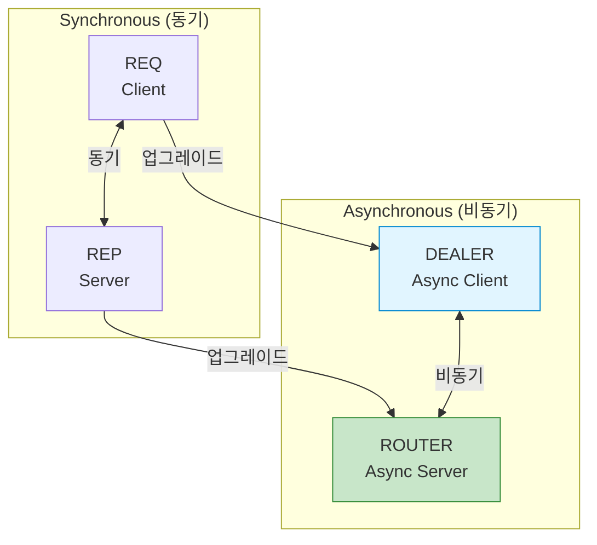
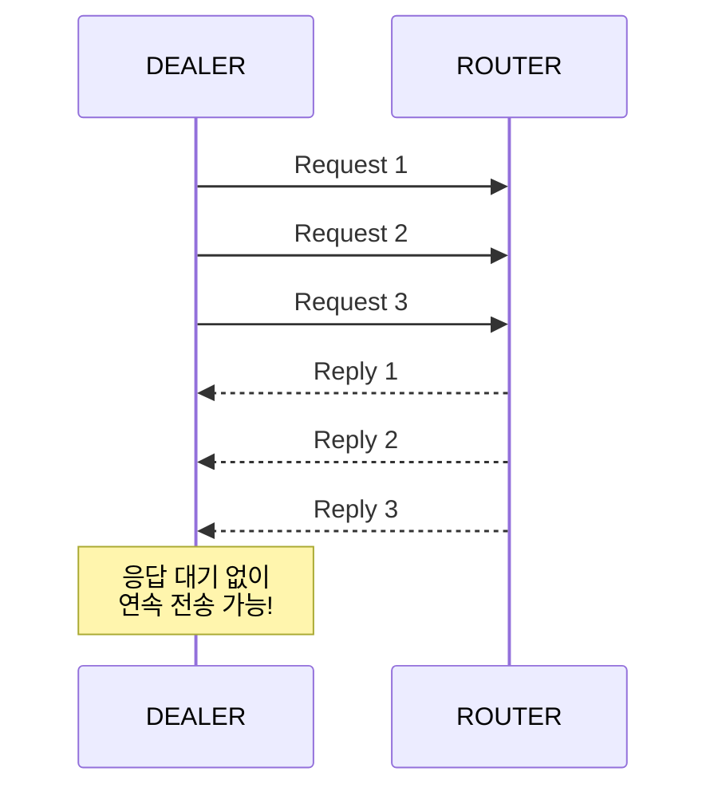
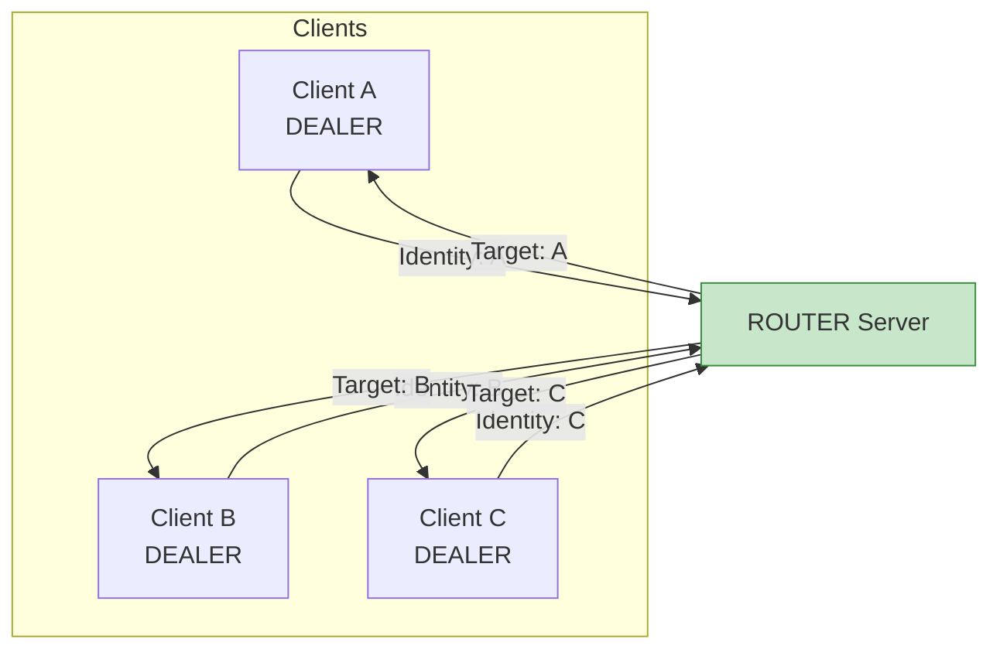
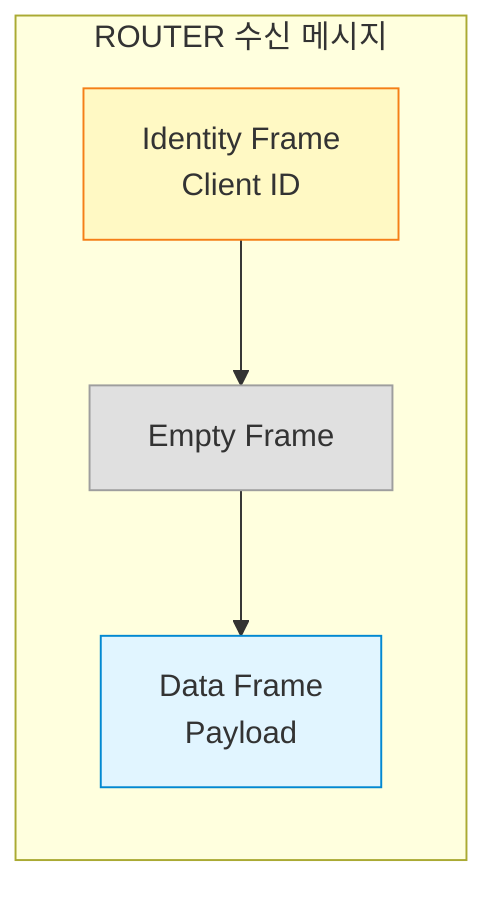
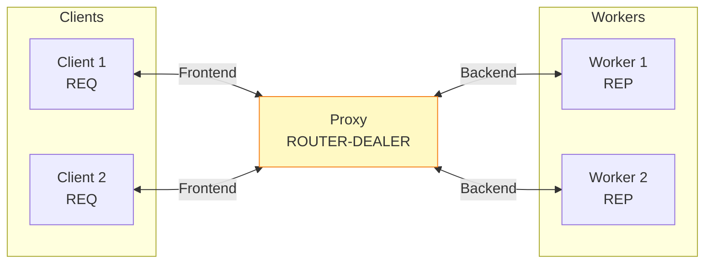
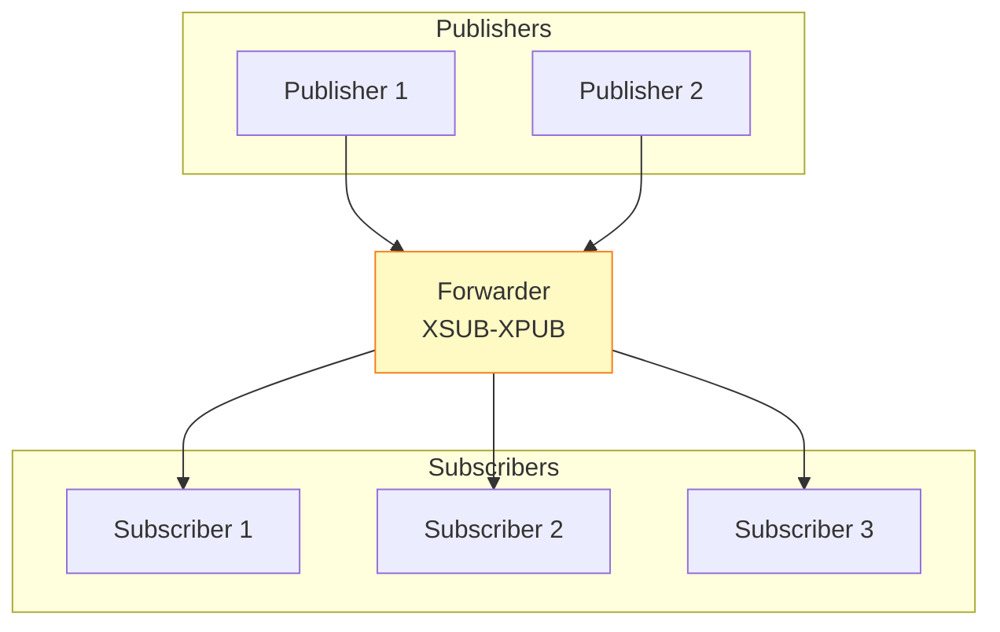
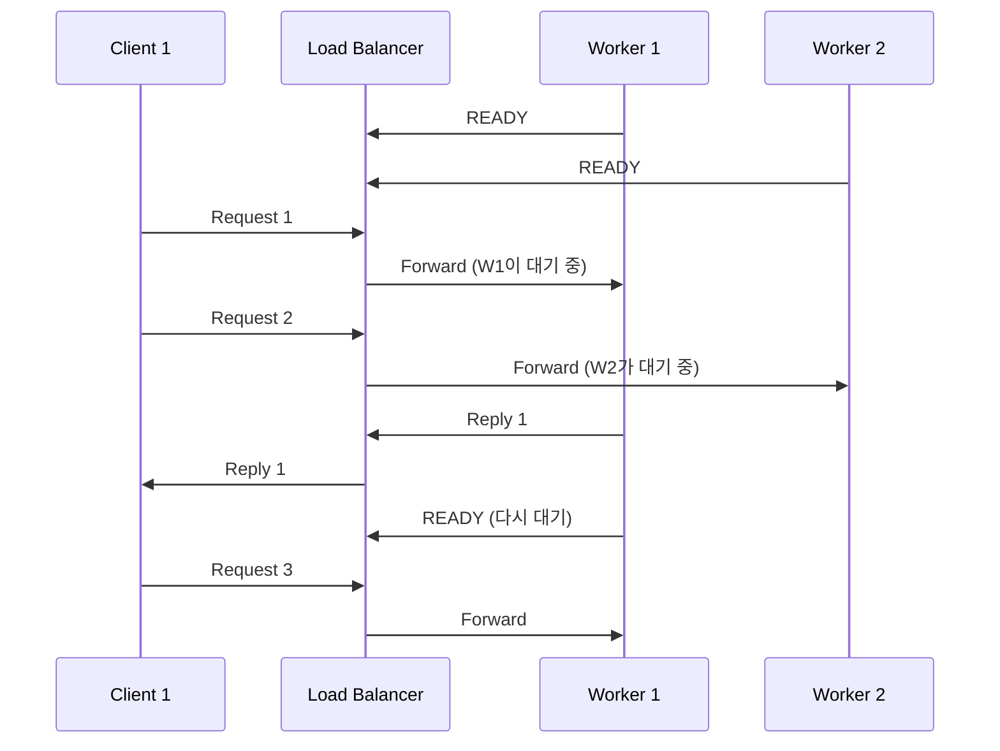
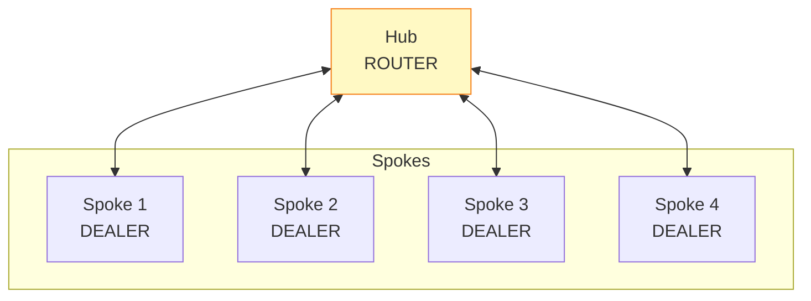

## 들어가며

기본 패턴(REQ/REP, PUB/SUB, PUSH/PULL)은 간단하지만 제한적입니다. **ROUTER**와 **DEALER**는 비동기 통신과 복잡한 라우팅을 가능하게 합니다.

## DEALER와 ROUTER 소켓

### 소켓 타입 계층 구조



### 특징 비교

| 소켓 타입 | 역할 | 동기/비동기 | 메시지 라우팅 |
|-----------|------|-------------|---------------|
| **REQ** | Client | 동기 | 단순 (1:1) |
| **REP** | Server | 동기 | 단순 (1:1) |
| **DEALER** | Async Client | 비동기 | 라운드 로빈 |
| **ROUTER** | Async Server | 비동기 | Identity 기반 |

## DEALER 소켓

### 개념

DEALER는 **비동기 REQ**입니다. 응답을 기다리지 않고 여러 요청을 연속으로 보낼 수 있습니다.



### REQ vs DEALER

**REQ (동기)**:

```c
// 반드시 send → recv 순서
zmq_send(req, "Request 1", 9, 0);
zmq_recv(req, buffer, 100, 0);  // 대기...

zmq_send(req, "Request 2", 9, 0);  // 이전 recv 완료 후에만 가능
zmq_recv(req, buffer, 100, 0);
```

**DEALER (비동기)**:

```c
// 연속 전송 가능
zmq_send(dealer, "Request 1", 9, 0);
zmq_send(dealer, "Request 2", 9, 0);
zmq_send(dealer, "Request 3", 9, 0);

// 나중에 응답 받기
zmq_recv(dealer, buffer, 100, 0);
zmq_recv(dealer, buffer, 100, 0);
zmq_recv(dealer, buffer, 100, 0);
```

### 간단한 예제

```c
// async_client.c
#include <zmq.h>
#include <stdio.h>
#include <string.h>

int main() {
    void *context = zmq_ctx_new();
    void *dealer = zmq_socket(context, ZMQ_DEALER);
    zmq_connect(dealer, "tcp://localhost:5555");

    // 3개 요청 연속 전송
    for (int i = 1; i <= 3; i++) {
        char request[20];
        snprintf(request, 20, "Request %d", i);

        zmq_send(dealer, "", 0, ZMQ_SNDMORE);  // 빈 프레임
        zmq_send(dealer, request, strlen(request), 0);
        printf("전송: %s\n", request);
    }

    // 응답 받기
    for (int i = 1; i <= 3; i++) {
        char empty[10];
        char reply[100];

        zmq_recv(dealer, empty, 10, 0);  // 빈 프레임
        zmq_recv(dealer, reply, 100, 0);
        reply[99] = '\0';

        printf("응답: %s\n", reply);
    }

    zmq_close(dealer);
    zmq_ctx_destroy(context);
    return 0;
}
```

## ROUTER 소켓

### 개념

ROUTER는 **비동기 REP**입니다. 각 클라이언트를 **Identity**로 구분하여 특정 클라이언트에게 응답할 수 있습니다.



### 메시지 구조



### ROUTER 서버 예제

```c
// async_server.c
#include <zmq.h>
#include <stdio.h>
#include <string.h>
#include <unistd.h>

int main() {
    void *context = zmq_ctx_new();
    void *router = zmq_socket(context, ZMQ_ROUTER);
    zmq_bind(router, "tcp://*:5555");

    printf("ROUTER 서버 시작...\n");

    while (1) {
        char identity[256];
        char empty[10];
        char request[256];

        // 1. Identity 프레임
        int id_size = zmq_recv(router, identity, 256, 0);
        // 2. Empty 프레임
        zmq_recv(router, empty, 10, 0);
        // 3. 데이터 프레임
        int size = zmq_recv(router, request, 256, 0);

        identity[id_size] = '\0';
        request[size] = '\0';

        printf("From [%s]: %s\n", identity, request);

        // 응답 전송 (같은 Identity로)
        char reply[256];
        snprintf(reply, 256, "Echo: %s", request);

        zmq_send(router, identity, id_size, ZMQ_SNDMORE);
        zmq_send(router, "", 0, ZMQ_SNDMORE);
        zmq_send(router, reply, strlen(reply), 0);
    }

    zmq_close(router);
    zmq_ctx_destroy(context);
    return 0;
}
```

## Proxy 패턴

### 개념

**Proxy**는 중간 브로커 역할을 합니다. 클라이언트와 서버를 분리하여 유연성을 높입니다.



### Proxy 구현

```c
// proxy.c
#include <zmq.h>
#include <stdio.h>

int main() {
    void *context = zmq_ctx_new();

    // Frontend: ROUTER (클라이언트 연결)
    void *frontend = zmq_socket(context, ZMQ_ROUTER);
    zmq_bind(frontend, "tcp://*:5555");

    // Backend: DEALER (워커 연결)
    void *backend = zmq_socket(context, ZMQ_DEALER);
    zmq_bind(backend, "tcp://*:5556");

    printf("Proxy 시작...\n");
    printf("Frontend: tcp://*:5555\n");
    printf("Backend: tcp://*:5556\n");

    // Proxy 실행 (내장 함수)
    zmq_proxy(frontend, backend, NULL);

    zmq_close(frontend);
    zmq_close(backend);
    zmq_ctx_destroy(context);
    return 0;
}
```

### Worker (Backend)

```c
// worker.c
#include <zmq.h>
#include <stdio.h>
#include <string.h>
#include <unistd.h>

int main() {
    void *context = zmq_ctx_new();
    void *worker = zmq_socket(context, ZMQ_REP);
    zmq_connect(worker, "tcp://localhost:5556");

    printf("Worker %d 시작\n", getpid());

    while (1) {
        char request[256];
        zmq_recv(worker, request, 256, 0);
        request[255] = '\0';

        printf("[Worker %d] 처리: %s\n", getpid(), request);

        sleep(1);  // 작업 시뮬레이션

        char reply[256];
        snprintf(reply, 256, "Worker %d: %s", getpid(), request);
        zmq_send(worker, reply, strlen(reply), 0);
    }

    zmq_close(worker);
    zmq_ctx_destroy(context);
    return 0;
}
```

### Client (Frontend)

```c
// client.c
#include <zmq.h>
#include <stdio.h>
#include <string.h>

int main() {
    void *context = zmq_ctx_new();
    void *client = zmq_socket(context, ZMQ_REQ);
    zmq_connect(client, "tcp://localhost:5555");

    for (int i = 1; i <= 5; i++) {
        char request[50];
        snprintf(request, 50, "Task %d", i);

        zmq_send(client, request, strlen(request), 0);
        printf("요청: %s\n", request);

        char reply[256];
        zmq_recv(client, reply, 256, 0);
        reply[255] = '\0';

        printf("응답: %s\n\n", reply);
    }

    zmq_close(client);
    zmq_ctx_destroy(context);
    return 0;
}
```

### 실행

```bash
# Terminal 1: Proxy
./proxy

# Terminal 2-3: Workers
./worker
./worker

# Terminal 4: Client
./client

# 출력 (Proxy가 자동 분산):
# [Worker 12345] 처리: Task 1
# [Worker 12346] 처리: Task 2
# [Worker 12345] 처리: Task 3
```

## Pub-Sub Proxy (Forwarder)

### 구조



### 구현

```c
// forwarder.c
#include <zmq.h>
#include <stdio.h>

int main() {
    void *context = zmq_ctx_new();

    // Frontend: XSUB (Publishers 연결)
    void *frontend = zmq_socket(context, ZMQ_XSUB);
    zmq_bind(frontend, "tcp://*:5557");

    // Backend: XPUB (Subscribers 연결)
    void *backend = zmq_socket(context, ZMQ_XPUB);
    zmq_bind(backend, "tcp://*:5558");

    printf("Forwarder 시작...\n");

    // Proxy 실행
    zmq_proxy(frontend, backend, NULL);

    zmq_close(frontend);
    zmq_close(backend);
    zmq_ctx_destroy(context);
    return 0;
}
```

## Load Balancer 패턴

### LRU (Least Recently Used) Queue



### 구현 (간략화)

```c
// load_balancer.c
#include <zmq.h>
#include <stdio.h>

int main() {
    void *context = zmq_ctx_new();

    void *frontend = zmq_socket(context, ZMQ_ROUTER);
    zmq_bind(frontend, "tcp://*:5555");

    void *backend = zmq_socket(context, ZMQ_ROUTER);
    zmq_bind(backend, "tcp://*:5556");

    // Worker 큐 관리 (실제로는 리스트 필요)
    // 간략화를 위해 zmq_proxy 사용
    zmq_proxy(frontend, backend, NULL);

    return 0;
}
```

## 복잡한 토폴로지: Star 패턴



**용도**: 중앙 집중식 관리 시스템

## 다음 단계

고급 패턴을 마스터했습니다! 다음 글에서는:
- **실전 분산 시스템 구축**
- 마이크로서비스 아키텍처
- 장애 복구 및 High Availability

---

**시리즈 목차**
1. ZeroMQ란 무엇인가 - 고성능 메시징 라이브러리
2. ZeroMQ 메시징 패턴 - REQ/REP, PUB/SUB, PUSH/PULL
3. **ZeroMQ 고급 패턴 - ROUTER, DEALER, PROXY** ← 현재 글
4. ZeroMQ 실전 활용 - 분산 시스템 구축 (다음 글)
5. ZeroMQ 성능 최적화 및 보안

> 💡 **Quick Tip**: Proxy 패턴은 클라이언트와 서버를 분리하여 독립적으로 확장할 수 있게 합니다. 프로덕션 환경에서는 반드시 Proxy를 사용하세요!
