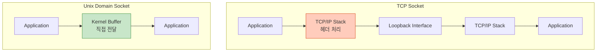
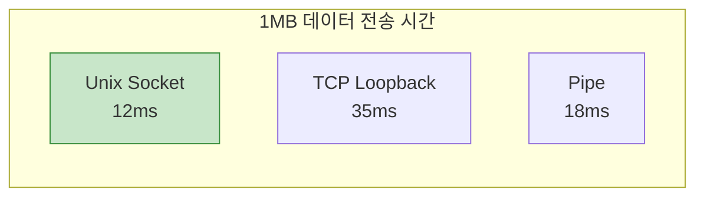
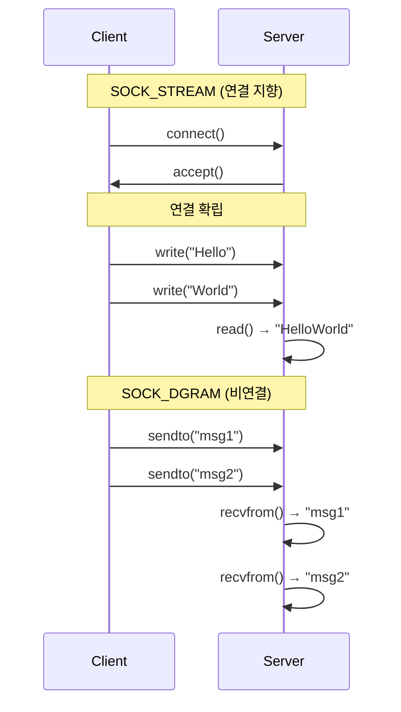
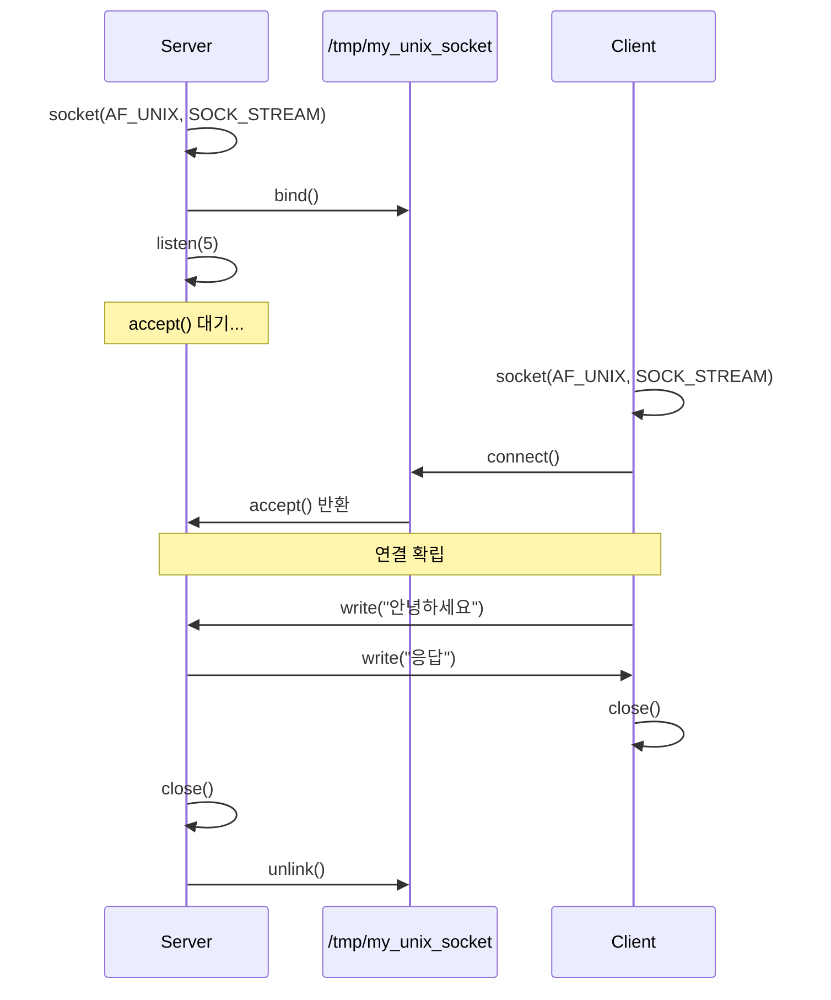

## 들어가며

**Unix Domain Socket**은 같은 시스템 내에서 소켓 API를 사용하는 IPC입니다. TCP/UDP 소켓과 API가 동일하지만 **네트워크 오버헤드가 없어** 훨씬 빠릅니다.

## Unix Socket vs TCP Socket

### 비교표

| 항목 | Unix Domain Socket | TCP Socket |
|------|-------------------|------------|
| **위치** | 로컬 시스템만 | 네트워크 가능 |
| **주소** | 파일 경로 | IP:Port |
| **속도** | ⭐⭐⭐⭐⭐ 매우 빠름 | ⭐⭐⭐ 보통 |
| **오버헤드** | 최소 (커널 내) | 높음 (TCP/IP 스택) |
| **권한** | 파일 권한 | 포트 권한 |
| **사용 예** | Docker, systemd | HTTP, SSH |



### 성능 차이



## Stream vs Datagram Socket

### 차이점

| 타입 | SOCK_STREAM | SOCK_DGRAM |
|------|-------------|------------|
| **특징** | 연결 지향 | 비연결 |
| **신뢰성** | ✅ 보장됨 | ❌ 보장 안 됨 |
| **순서** | ✅ 유지 | ❌ 순서 없음 |
| **경계** | ❌ 스트림 | ✅ 메시지 단위 |
| **TCP 유사** | ✅ | ❌ |
| **UDP 유사** | ❌ | ✅ |



## SOCK_STREAM 예제

### 1. Server

```c
// unix_stream_server.c
#include <stdio.h>
#include <stdlib.h>
#include <string.h>
#include <unistd.h>
#include <sys/socket.h>
#include <sys/un.h>

#define SOCKET_PATH "/tmp/my_unix_socket"
#define BUFFER_SIZE 256

int main() {
    int server_fd, client_fd;
    struct sockaddr_un addr;
    char buffer[BUFFER_SIZE];

    // 1. 소켓 생성
    server_fd = socket(AF_UNIX, SOCK_STREAM, 0);
    if (server_fd == -1) {
        perror("socket");
        return 1;
    }

    // 2. 주소 설정
    memset(&addr, 0, sizeof(addr));
    addr.sun_family = AF_UNIX;
    strncpy(addr.sun_path, SOCKET_PATH, sizeof(addr.sun_path) - 1);

    // 기존 소켓 파일 삭제
    unlink(SOCKET_PATH);

    // 3. Bind
    if (bind(server_fd, (struct sockaddr *)&addr, sizeof(addr)) == -1) {
        perror("bind");
        return 1;
    }

    // 4. Listen
    if (listen(server_fd, 5) == -1) {
        perror("listen");
        return 1;
    }

    printf("서버 대기 중... (%s)\n", SOCKET_PATH);

    // 5. Accept
    client_fd = accept(server_fd, NULL, NULL);
    if (client_fd == -1) {
        perror("accept");
        return 1;
    }

    printf("클라이언트 연결됨\n");

    // 6. 데이터 수신
    ssize_t n = read(client_fd, buffer, BUFFER_SIZE);
    if (n > 0) {
        buffer[n] = '\0';
        printf("받은 메시지: %s\n", buffer);

        // 응답 전송
        const char *response = "서버로부터 응답";
        write(client_fd, response, strlen(response));
    }

    // 7. 정리
    close(client_fd);
    close(server_fd);
    unlink(SOCKET_PATH);

    return 0;
}
```

### 2. Client

```c
// unix_stream_client.c
#include <stdio.h>
#include <stdlib.h>
#include <string.h>
#include <unistd.h>
#include <sys/socket.h>
#include <sys/un.h>

#define SOCKET_PATH "/tmp/my_unix_socket"
#define BUFFER_SIZE 256

int main() {
    int client_fd;
    struct sockaddr_un addr;
    char buffer[BUFFER_SIZE];

    // 1. 소켓 생성
    client_fd = socket(AF_UNIX, SOCK_STREAM, 0);
    if (client_fd == -1) {
        perror("socket");
        return 1;
    }

    // 2. 주소 설정
    memset(&addr, 0, sizeof(addr));
    addr.sun_family = AF_UNIX;
    strncpy(addr.sun_path, SOCKET_PATH, sizeof(addr.sun_path) - 1);

    // 3. Connect
    if (connect(client_fd, (struct sockaddr *)&addr, sizeof(addr)) == -1) {
        perror("connect");
        return 1;
    }

    printf("서버에 연결됨\n");

    // 4. 데이터 전송
    const char *message = "클라이언트로부터 안녕하세요!";
    write(client_fd, message, strlen(message));

    // 5. 응답 수신
    ssize_t n = read(client_fd, buffer, BUFFER_SIZE);
    if (n > 0) {
        buffer[n] = '\0';
        printf("서버 응답: %s\n", buffer);
    }

    // 6. 정리
    close(client_fd);

    return 0;
}
```

### 실행

```bash
# 컴파일
gcc -o server unix_stream_server.c
gcc -o client unix_stream_client.c

# 터미널 1
./server

# 터미널 2
./client

# 출력:
# [서버] 서버 대기 중... (/tmp/my_unix_socket)
# [서버] 클라이언트 연결됨
# [서버] 받은 메시지: 클라이언트로부터 안녕하세요!
# [클라이언트] 서버에 연결됨
# [클라이언트] 서버 응답: 서버로부터 응답
```

### 동작 과정



## SOCK_DGRAM 예제

### 1. Server

```c
// unix_dgram_server.c
#include <stdio.h>
#include <stdlib.h>
#include <string.h>
#include <unistd.h>
#include <sys/socket.h>
#include <sys/un.h>

#define SERVER_PATH "/tmp/dgram_server"
#define BUFFER_SIZE 256

int main() {
    int server_fd;
    struct sockaddr_un server_addr, client_addr;
    char buffer[BUFFER_SIZE];
    socklen_t client_len;

    // 소켓 생성
    server_fd = socket(AF_UNIX, SOCK_DGRAM, 0);

    // 주소 설정
    memset(&server_addr, 0, sizeof(server_addr));
    server_addr.sun_family = AF_UNIX;
    strncpy(server_addr.sun_path, SERVER_PATH, sizeof(server_addr.sun_path) - 1);

    unlink(SERVER_PATH);

    // Bind
    bind(server_fd, (struct sockaddr *)&server_addr, sizeof(server_addr));

    printf("Datagram 서버 대기 중...\n");

    // 데이터 수신
    client_len = sizeof(client_addr);
    ssize_t n = recvfrom(server_fd, buffer, BUFFER_SIZE, 0,
                         (struct sockaddr *)&client_addr, &client_len);
    if (n > 0) {
        buffer[n] = '\0';
        printf("받음: %s (from %s)\n", buffer, client_addr.sun_path);

        // 응답 전송
        const char *response = "서버 응답";
        sendto(server_fd, response, strlen(response), 0,
               (struct sockaddr *)&client_addr, client_len);
    }

    close(server_fd);
    unlink(SERVER_PATH);

    return 0;
}
```

### 2. Client

```c
// unix_dgram_client.c
#include <stdio.h>
#include <stdlib.h>
#include <string.h>
#include <unistd.h>
#include <sys/socket.h>
#include <sys/un.h>

#define SERVER_PATH "/tmp/dgram_server"
#define CLIENT_PATH "/tmp/dgram_client"
#define BUFFER_SIZE 256

int main() {
    int client_fd;
    struct sockaddr_un server_addr, client_addr;
    char buffer[BUFFER_SIZE];

    // 소켓 생성
    client_fd = socket(AF_UNIX, SOCK_DGRAM, 0);

    // 클라이언트 주소 (응답 받기 위해)
    memset(&client_addr, 0, sizeof(client_addr));
    client_addr.sun_family = AF_UNIX;
    snprintf(client_addr.sun_path, sizeof(client_addr.sun_path),
             "%s_%d", CLIENT_PATH, getpid());

    unlink(client_addr.sun_path);
    bind(client_fd, (struct sockaddr *)&client_addr, sizeof(client_addr));

    // 서버 주소
    memset(&server_addr, 0, sizeof(server_addr));
    server_addr.sun_family = AF_UNIX;
    strncpy(server_addr.sun_path, SERVER_PATH, sizeof(server_addr.sun_path) - 1);

    // 데이터 전송
    const char *message = "Datagram 메시지";
    sendto(client_fd, message, strlen(message), 0,
           (struct sockaddr *)&server_addr, sizeof(server_addr));

    // 응답 수신
    ssize_t n = recvfrom(client_fd, buffer, BUFFER_SIZE, 0, NULL, NULL);
    if (n > 0) {
        buffer[n] = '\0';
        printf("응답: %s\n", buffer);
    }

    close(client_fd);
    unlink(client_addr.sun_path);

    return 0;
}
```

## Credentials Passing

### SCM_CREDENTIALS

```c
// credentials_server.c
#include <stdio.h>
#include <stdlib.h>
#include <string.h>
#include <unistd.h>
#include <sys/socket.h>
#include <sys/un.h>

#define SOCKET_PATH "/tmp/cred_socket"

int main() {
    int server_fd, client_fd;
    struct sockaddr_un addr;
    struct msghdr msg = {0};
    struct iovec iov[1];
    struct ucred ucred;
    char buf[100];
    char cmsgbuf[CMSG_SPACE(sizeof(struct ucred))];
    struct cmsghdr *cmsg;

    // 소켓 생성
    server_fd = socket(AF_UNIX, SOCK_STREAM, 0);

    // SO_PASSCRED 옵션 설정
    int on = 1;
    setsockopt(server_fd, SOL_SOCKET, SO_PASSCRED, &on, sizeof(on));

    // Bind & Listen
    memset(&addr, 0, sizeof(addr));
    addr.sun_family = AF_UNIX;
    strncpy(addr.sun_path, SOCKET_PATH, sizeof(addr.sun_path) - 1);
    unlink(SOCKET_PATH);
    bind(server_fd, (struct sockaddr *)&addr, sizeof(addr));
    listen(server_fd, 5);

    printf("Credential 서버 대기 중...\n");

    client_fd = accept(server_fd, NULL, NULL);

    // Credentials 수신
    iov[0].iov_base = buf;
    iov[0].iov_len = sizeof(buf);
    msg.msg_iov = iov;
    msg.msg_iovlen = 1;
    msg.msg_control = cmsgbuf;
    msg.msg_controllen = sizeof(cmsgbuf);

    recvmsg(client_fd, &msg, 0);

    // Credentials 추출
    for (cmsg = CMSG_FIRSTHDR(&msg); cmsg != NULL;
         cmsg = CMSG_NXTHDR(&msg, cmsg)) {
        if (cmsg->cmsg_level == SOL_SOCKET &&
            cmsg->cmsg_type == SCM_CREDENTIALS) {
            memcpy(&ucred, CMSG_DATA(cmsg), sizeof(struct ucred));
            printf("클라이언트 Credentials:\n");
            printf("  PID: %d\n", ucred.pid);
            printf("  UID: %d\n", ucred.uid);
            printf("  GID: %d\n", ucred.gid);
        }
    }

    printf("메시지: %s\n", buf);

    close(client_fd);
    close(server_fd);
    unlink(SOCKET_PATH);

    return 0;
}
```

### Client

```c
// credentials_client.c
#include <stdio.h>
#include <stdlib.h>
#include <string.h>
#include <unistd.h>
#include <sys/socket.h>
#include <sys/un.h>

#define SOCKET_PATH "/tmp/cred_socket"

int main() {
    int client_fd;
    struct sockaddr_un addr;
    struct msghdr msg = {0};
    struct iovec iov[1];
    struct ucred ucred;
    char buf[] = "Hello with credentials";
    char cmsgbuf[CMSG_SPACE(sizeof(struct ucred))];
    struct cmsghdr *cmsg;

    // 소켓 생성 및 연결
    client_fd = socket(AF_UNIX, SOCK_STREAM, 0);
    memset(&addr, 0, sizeof(addr));
    addr.sun_family = AF_UNIX;
    strncpy(addr.sun_path, SOCKET_PATH, sizeof(addr.sun_path) - 1);
    connect(client_fd, (struct sockaddr *)&addr, sizeof(addr));

    // Credentials 설정
    ucred.pid = getpid();
    ucred.uid = getuid();
    ucred.gid = getgid();

    // 메시지 구성
    iov[0].iov_base = buf;
    iov[0].iov_len = sizeof(buf);
    msg.msg_iov = iov;
    msg.msg_iovlen = 1;
    msg.msg_control = cmsgbuf;
    msg.msg_controllen = sizeof(cmsgbuf);

    cmsg = CMSG_FIRSTHDR(&msg);
    cmsg->cmsg_level = SOL_SOCKET;
    cmsg->cmsg_type = SCM_CREDENTIALS;
    cmsg->cmsg_len = CMSG_LEN(sizeof(struct ucred));
    memcpy(CMSG_DATA(cmsg), &ucred, sizeof(struct ucred));

    // 전송
    sendmsg(client_fd, &msg, 0);
    printf("Credentials와 함께 메시지 전송\n");

    close(client_fd);

    return 0;
}
```

## File Descriptor Passing

```c
// fd_passing_server.c
#include <stdio.h>
#include <stdlib.h>
#include <string.h>
#include <unistd.h>
#include <fcntl.h>
#include <sys/socket.h>
#include <sys/un.h>

#define SOCKET_PATH "/tmp/fd_socket"

int recv_fd(int sock) {
    struct msghdr msg = {0};
    struct cmsghdr *cmsg;
    char buf[1];
    struct iovec iov[1];
    char cmsgbuf[CMSG_SPACE(sizeof(int))];
    int fd;

    iov[0].iov_base = buf;
    iov[0].iov_len = 1;
    msg.msg_iov = iov;
    msg.msg_iovlen = 1;
    msg.msg_control = cmsgbuf;
    msg.msg_controllen = sizeof(cmsgbuf);

    recvmsg(sock, &msg, 0);

    cmsg = CMSG_FIRSTHDR(&msg);
    memcpy(&fd, CMSG_DATA(cmsg), sizeof(int));

    return fd;
}

int main() {
    int server_fd, client_fd;
    struct sockaddr_un addr;

    server_fd = socket(AF_UNIX, SOCK_STREAM, 0);

    memset(&addr, 0, sizeof(addr));
    addr.sun_family = AF_UNIX;
    strncpy(addr.sun_path, SOCKET_PATH, sizeof(addr.sun_path) - 1);
    unlink(SOCKET_PATH);
    bind(server_fd, (struct sockaddr *)&addr, sizeof(addr));
    listen(server_fd, 5);

    printf("FD 수신 서버 대기 중...\n");

    client_fd = accept(server_fd, NULL, NULL);

    // 파일 디스크립터 수신
    int received_fd = recv_fd(client_fd);
    printf("파일 디스크립터 수신: %d\n", received_fd);

    // 받은 FD로 파일 읽기
    char buffer[100];
    ssize_t n = read(received_fd, buffer, sizeof(buffer));
    if (n > 0) {
        buffer[n] = '\0';
        printf("파일 내용: %s\n", buffer);
    }

    close(received_fd);
    close(client_fd);
    close(server_fd);
    unlink(SOCKET_PATH);

    return 0;
}
```

```c
// fd_passing_client.c
#include <stdio.h>
#include <stdlib.h>
#include <string.h>
#include <unistd.h>
#include <fcntl.h>
#include <sys/socket.h>
#include <sys/un.h>

#define SOCKET_PATH "/tmp/fd_socket"

void send_fd(int sock, int fd) {
    struct msghdr msg = {0};
    struct cmsghdr *cmsg;
    char buf[1] = {'X'};
    struct iovec iov[1];
    char cmsgbuf[CMSG_SPACE(sizeof(int))];

    iov[0].iov_base = buf;
    iov[0].iov_len = 1;
    msg.msg_iov = iov;
    msg.msg_iovlen = 1;
    msg.msg_control = cmsgbuf;
    msg.msg_controllen = sizeof(cmsgbuf);

    cmsg = CMSG_FIRSTHDR(&msg);
    cmsg->cmsg_level = SOL_SOCKET;
    cmsg->cmsg_type = SCM_RIGHTS;
    cmsg->cmsg_len = CMSG_LEN(sizeof(int));
    memcpy(CMSG_DATA(cmsg), &fd, sizeof(int));

    sendmsg(sock, &msg, 0);
}

int main() {
    int client_fd;
    struct sockaddr_un addr;

    client_fd = socket(AF_UNIX, SOCK_STREAM, 0);

    memset(&addr, 0, sizeof(addr));
    addr.sun_family = AF_UNIX;
    strncpy(addr.sun_path, SOCKET_PATH, sizeof(addr.sun_path) - 1);
    connect(client_fd, (struct sockaddr *)&addr, sizeof(addr));

    // 파일 열기
    int file_fd = open("/etc/hostname", O_RDONLY);
    if (file_fd == -1) {
        perror("open");
        return 1;
    }

    // 파일 디스크립터 전송
    printf("파일 디스크립터 전송: %d\n", file_fd);
    send_fd(client_fd, file_fd);

    close(file_fd);
    close(client_fd);

    return 0;
}
```

## 실전 사용 사례

### 1. Docker

```bash
# Docker daemon과 CLI 통신
ls -l /var/run/docker.sock
# srw-rw---- 1 root docker 0 ... /var/run/docker.sock

# Unix socket으로 REST API 호출
curl --unix-socket /var/run/docker.sock http://localhost/containers/json
```

### 2. systemd

```bash
# systemd와 통신
ls -l /run/systemd/private
# srwxrwxrwx 1 root root 0 ... /run/systemd/private

# systemctl이 이 소켓 사용
systemctl status nginx
```

### 3. MySQL

```bash
# MySQL 로컬 연결
ls -l /var/run/mysqld/mysqld.sock
# srwxrwxrwx 1 mysql mysql 0 ... mysqld.sock

# TCP 대신 Unix socket 사용 (더 빠름)
mysql -u root -p --socket=/var/run/mysqld/mysqld.sock
```

## 성능 최적화

### 1. 버퍼 크기 조정

```c
int sock = socket(AF_UNIX, SOCK_STREAM, 0);

// 송신 버퍼
int sndbuf = 256 * 1024;  // 256KB
setsockopt(sock, SOL_SOCKET, SO_SNDBUF, &sndbuf, sizeof(sndbuf));

// 수신 버퍼
int rcvbuf = 256 * 1024;
setsockopt(sock, SOL_SOCKET, SO_RCVBUF, &rcvbuf, sizeof(rcvbuf));
```

### 2. Non-blocking I/O

```c
int flags = fcntl(sock, F_GETFL, 0);
fcntl(sock, F_SETFL, flags | O_NONBLOCK);

// Non-blocking read
ssize_t n = read(sock, buf, size);
if (n == -1 && errno == EAGAIN) {
    // 데이터 없음, 나중에 재시도
}
```

### 3. sendfile() 사용

```c
#include <sys/sendfile.h>

// 파일을 소켓으로 직접 전송 (zero-copy)
off_t offset = 0;
sendfile(socket_fd, file_fd, &offset, file_size);
```

## 디버깅

### 소켓 파일 확인

```bash
# Unix socket 목록
ls -l /tmp/*.sock
ls -l /var/run/*.sock

# 권한 문제 해결
chmod 666 /tmp/my_socket

# 사용 중인 Unix socket
lsof | grep unix
```

### strace로 디버깅

```bash
# 시스템 콜 추적
strace -e trace=socket,bind,listen,accept,connect ./server

# 출력:
# socket(AF_UNIX, SOCK_STREAM, 0) = 3
# bind(3, {sa_family=AF_UNIX, sun_path="/tmp/my_socket"}, 110) = 0
# listen(3, 5) = 0
# accept(3, NULL, NULL) = 4
```

## 다음 단계

Unix Domain Socket을 마스터했습니다! 다음 글에서는:
- **Memory-Mapped Files** - mmap() 기반 IPC
- File-backed vs Anonymous mapping
- 고성능 데이터 공유

---

**시리즈 목차**
1. IPC란 무엇인가
2. IPC 메커니즘 전체 개요
3. Pipe - 가장 기본적인 IPC
4. Named Pipe (FIFO)
5. Signal - 비동기 이벤트 통신
6. Shared Memory - 공유 메모리
7. Message Queue 심화
8. Semaphore 심화
9. **Unix Domain Socket** ← 현재 글
10. Memory-Mapped Files (다음 글)

> 💡 **Quick Tip**: Docker, systemd, MySQL 등 많은 시스템 소프트웨어가 Unix Socket을 사용합니다. 로컬 통신에는 TCP보다 3배 빠른 Unix Socket을 사용하세요!
