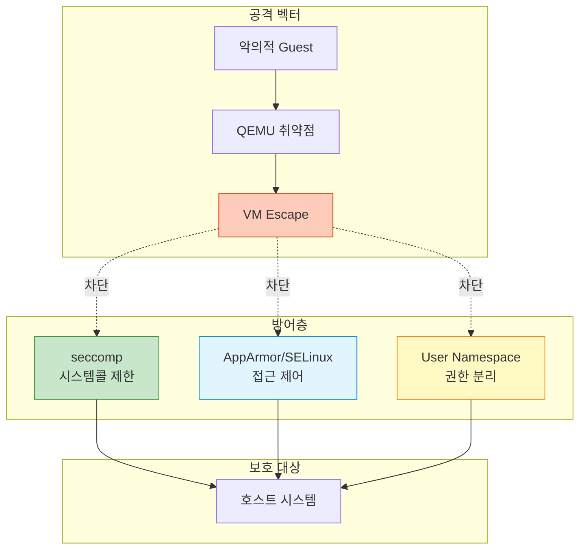

## 들어가며

VM이 탈출하여 호스트를 공격한다면? **QEMU 보안 강화**는 가상화 환경에서 필수적인 방어층을 제공합니다.

## QEMU 보안 위협



## seccomp (Secure Computing Mode)

### 개념

**seccomp**는 Linux 커널 기능으로 프로세스가 사용할 수 있는 시스템콜을 제한합니다.

```bash
# seccomp 없이 실행
qemu-system-x86_64 -m 2G -drive file=ubuntu.qcow2
# 모든 시스템콜 사용 가능 (위험)

# seccomp 활성화
qemu-system-x86_64 \
  -m 2G \
  -drive file=ubuntu.qcow2 \
  -sandbox on
# 불필요한 시스템콜 차단
```

### seccomp 모드

```bash
# 1. Strict 모드 (기본)
qemu-system-x86_64 -sandbox on ...

# 2. Selective 모드 (특정 기능만 허용)
qemu-system-x86_64 \
  -sandbox on,obsolete=deny,elevateprivileges=deny,spawn=deny,resourcecontrol=deny \
  -drive file=ubuntu.qcow2

# 옵션 설명:
# - obsolete=deny: 오래된/위험한 시스템콜 차단
# - elevateprivileges=deny: 권한 상승 차단
# - spawn=deny: 새 프로세스 생성 차단
# - resourcecontrol=deny: 리소스 제어 차단
```

### seccomp 검증

```bash
# QEMU 프로세스의 seccomp 상태 확인
VM_PID=$(pgrep qemu)
cat /proc/$VM_PID/status | grep Seccomp
Seccomp:    2  # 0=disabled, 1=strict, 2=filter

# seccomp 필터 확인 (requires libseccomp)
sudo cat /proc/$VM_PID/status | grep Seccomp_filters
Seccomp_filters: 1

# 시스템콜 추적
sudo strace -p $VM_PID -e trace=all 2>&1 | head -20
# seccomp가 활성화되면 제한된 시스템콜만 표시됨
```

### 커스텀 seccomp 프로파일

```json
// custom-seccomp.json
{
  "defaultAction": "SCMP_ACT_ERRNO",
  "architectures": [
    "SCMP_ARCH_X86_64"
  ],
  "syscalls": [
    {
      "names": [
        "read", "write", "open", "close",
        "stat", "fstat", "lstat",
        "poll", "lseek", "mmap", "mprotect",
        "munmap", "brk", "rt_sigaction",
        "ioctl", "pread64", "pwrite64",
        "readv", "writev", "select",
        "sched_yield", "mremap", "msync",
        "mincore", "madvise", "shmget",
        "dup", "dup2", "pause", "nanosleep"
      ],
      "action": "SCMP_ACT_ALLOW"
    }
  ]
}
```

```bash
# 커스텀 프로파일 사용 (Docker 스타일)
# QEMU는 직접 JSON 프로파일을 지원하지 않으므로
# 시스템 레벨 seccomp 설정 필요
```

## AppArmor

### AppArmor 프로파일

```bash
# /etc/apparmor.d/usr.bin.qemu-system-x86_64

#include <tunables/global>

/usr/bin/qemu-system-x86_64 {
  #include <abstractions/base>
  #include <abstractions/nameservice>

  # QEMU 바이너리
  /usr/bin/qemu-system-x86_64 mr,

  # 필수 라이브러리
  /usr/lib/x86_64-linux-gnu/** mr,
  /lib/x86_64-linux-gnu/** mr,

  # VM 이미지 (읽기/쓰기)
  /var/lib/libvirt/images/** rw,
  /home/*/vms/** rw,

  # 디바이스
  /dev/kvm rw,
  /dev/net/tun rw,
  /dev/vhost-net rw,
  /dev/null rw,
  /dev/random r,
  /dev/urandom r,

  # 시스템 정보
  /proc/*/status r,
  /sys/devices/** r,

  # 네트워크
  network inet stream,
  network inet dgram,

  # 차단할 경로
  deny /etc/shadow r,
  deny /etc/passwd w,
  deny /root/** rw,

  # 시그널
  signal receive set=(term, kill),
}
```

### AppArmor 적용

```bash
# 1. 프로파일 로드
sudo apparmor_parser -r /etc/apparmor.d/usr.bin.qemu-system-x86_64

# 2. 프로파일 상태 확인
sudo aa-status | grep qemu
   /usr/bin/qemu-system-x86_64 (enforce)

# 3. VM 실행
qemu-system-x86_64 -m 2G -drive file=/var/lib/libvirt/images/ubuntu.qcow2

# 4. 로그 확인 (거부된 접근)
sudo tail -f /var/log/syslog | grep apparmor
apparmor="DENIED" operation="open" profile="/usr/bin/qemu-system-x86_64" name="/etc/shadow"
```

### Complain 모드 (학습 모드)

```bash
# 프로파일을 complain 모드로 전환 (차단하지 않고 로그만)
sudo aa-complain /usr/bin/qemu-system-x86_64

# VM 실행 후 로그 분석
sudo aa-logprof

# 프로파일 업데이트 후 enforce 모드로 전환
sudo aa-enforce /usr/bin/qemu-system-x86_64
```

## SELinux

### SELinux 컨텍스트

```bash
# QEMU 프로세스 컨텍스트 확인
ps -eZ | grep qemu
system_u:system_r:svirt_t:s0:c123,c456 12345 ? qemu-system-x86

# VM 이미지 파일 컨텍스트
ls -Z /var/lib/libvirt/images/
system_u:object_r:svirt_image_t:s0 ubuntu.qcow2

# 올바른 컨텍스트 설정
sudo chcon -t svirt_image_t /path/to/vm-image.qcow2

# 또는 restorecon 사용
sudo restorecon -Rv /var/lib/libvirt/images/
```

### SELinux 정책

```bash
# SELinux 상태 확인
getenforce
Enforcing

# QEMU 관련 boolean 확인
getsebool -a | grep virt
virt_use_nfs --> off
virt_use_samba --> off
virt_use_sanlock --> off

# NFS 스토리지 사용 허용
sudo setsebool -P virt_use_nfs on

# SELinux 거부 로그 확인
sudo ausearch -m avc -ts recent | grep qemu
type=AVC msg=audit(1234567890.123:456): avc: denied { read } for pid=12345 comm="qemu-system-x86" name="disk.qcow2"
```

### 커스텀 SELinux 정책

```bash
# 1. 거부된 작업을 허용하는 정책 생성
sudo ausearch -m avc -ts recent | audit2allow -M my-qemu-policy

# 2. 생성된 정책 확인
cat my-qemu-policy.te
module my-qemu-policy 1.0;
require {
    type svirt_t;
    type user_home_t;
    class file { read open };
}
allow svirt_t user_home_t:file { read open };

# 3. 정책 컴파일 및 로드
sudo semodule -i my-qemu-policy.pp

# 4. 확인
sudo semodule -l | grep my-qemu-policy
```

## User Namespaces

### 비특권 사용자로 실행

```bash
# 1. User namespace 매핑 설정
# /etc/subuid
user:100000:65536

# /etc/subgid
user:100000:65536

# 2. QEMU를 일반 사용자로 실행
# /dev/kvm 권한 설정
sudo chmod 666 /dev/kvm

# 3. VM 실행 (root 권한 불필요)
qemu-system-x86_64 \
  -enable-kvm \
  -m 2G \
  -drive file=ubuntu.qcow2 \
  -netdev user,id=net0 \
  -device virtio-net-pci,netdev=net0

# 4. 프로세스 확인
ps aux | grep qemu
user  12345  ...  qemu-system-x86_64
# root가 아닌 일반 user로 실행됨
```

### Network Namespace

```bash
# 1. 전용 네트워크 네임스페이스 생성
sudo ip netns add qemu-vm1

# 2. veth 페어 생성
sudo ip link add veth-host type veth peer name veth-vm

# 3. veth-vm을 네임스페이스로 이동
sudo ip link set veth-vm netns qemu-vm1

# 4. 네임스페이스 내에서 QEMU 실행
sudo ip netns exec qemu-vm1 \
qemu-system-x86_64 \
  -m 2G \
  -drive file=ubuntu.qcow2 \
  -netdev tap,id=net0,ifname=veth-vm,script=no \
  -device virtio-net-pci,netdev=net0

# 네트워크가 격리된 상태로 실행됨
```

## 디스크 이미지 보안

### Read-only 이미지

```bash
# 베이스 이미지를 읽기 전용으로
qemu-system-x86_64 \
  -drive file=base.qcow2,readonly=on \
  -drive file=overlay.qcow2 \
  -m 2G

# 변경사항은 overlay에만 기록됨
```

### 암호화된 이미지

```bash
# 1. LUKS 암호화 이미지 생성
qemu-img create -f qcow2 \
  -o encrypt.format=luks,encrypt.key-secret=sec0 \
  encrypted.qcow2 20G

# 2. Secret 정의
cat > secret.txt << EOF
mypassword
EOF

# 3. VM 실행
qemu-system-x86_64 \
  -object secret,id=sec0,file=secret.txt \
  -drive file=encrypted.qcow2,encrypt.key-secret=sec0 \
  -m 2G

# 4. 암호화 확인
qemu-img info encrypted.qcow2
image: encrypted.qcow2
file format: qcow2
virtual size: 20 GiB
disk size: 196 KiB
encrypted: yes  # ← 암호화됨
```

### 이미지 서명 검증

```bash
# 1. 이미지 해시 생성
sha256sum ubuntu.qcow2 > ubuntu.qcow2.sha256

# 2. GPG로 서명
gpg --detach-sign ubuntu.qcow2.sha256

# 3. 검증
gpg --verify ubuntu.qcow2.sha256.sig
sha256sum -c ubuntu.qcow2.sha256
ubuntu.qcow2: OK
```

## 보안 강화 체크리스트

```bash
#!/bin/bash
# security_audit.sh

echo "=== QEMU Security Audit ==="

# 1. seccomp
echo -n "seccomp: "
VM_PID=$(pgrep qemu | head -1)
if [ -n "$VM_PID" ]; then
    SECCOMP=$(grep Seccomp /proc/$VM_PID/status | awk '{print $2}')
    if [ "$SECCOMP" -eq "2" ]; then
        echo "✅ Enabled (filter mode)"
    else
        echo "❌ Disabled or strict mode"
    fi
else
    echo "⚠️  No QEMU process found"
fi

# 2. AppArmor
echo -n "AppArmor: "
if command -v aa-status &> /dev/null; then
    if aa-status 2>/dev/null | grep -q qemu; then
        echo "✅ Profile loaded"
    else
        echo "⚠️  No QEMU profile"
    fi
else
    echo "⚠️  Not installed"
fi

# 3. SELinux
echo -n "SELinux: "
if command -v getenforce &> /dev/null; then
    STATUS=$(getenforce)
    if [ "$STATUS" = "Enforcing" ]; then
        echo "✅ Enforcing"
    else
        echo "⚠️  $STATUS"
    fi
else
    echo "⚠️  Not installed"
fi

# 4. User namespace
echo -n "User namespace: "
if [ -n "$VM_PID" ]; then
    EUID=$(grep Uid /proc/$VM_PID/status | awk '{print $2}')
    if [ "$EUID" -ne "0" ]; then
        echo "✅ Running as non-root (UID: $EUID)"
    else
        echo "⚠️  Running as root"
    fi
fi

# 5. /dev/kvm 권한
echo -n "/dev/kvm permissions: "
KVM_PERMS=$(stat -c "%a" /dev/kvm)
if [ "$KVM_PERMS" = "660" ] || [ "$KVM_PERMS" = "600" ]; then
    echo "✅ Restricted ($KVM_PERMS)"
else
    echo "⚠️  Too open ($KVM_PERMS)"
fi

# 6. VM 이미지 위치
echo -n "VM images location: "
IMAGES=$(find /home -name "*.qcow2" 2>/dev/null | wc -l)
if [ "$IMAGES" -eq "0" ]; then
    echo "✅ Not in /home"
else
    echo "⚠️  Found $IMAGES images in /home (consider moving)"
fi
```

## 네트워크 보안

### 격리된 네트워크

```bash
# 1. User mode 네트워크 (기본, 격리됨)
qemu-system-x86_64 \
  -netdev user,id=net0,restrict=on \
  -device virtio-net-pci,netdev=net0 \
  -m 2G

# restrict=on: Guest가 호스트에 접근 불가

# 2. 전용 브리지
sudo ip link add br-isolated type bridge
sudo ip link set br-isolated up
sudo ip addr add 192.168.100.1/24 dev br-isolated

# 방화벽 규칙
sudo iptables -A FORWARD -i br-isolated -o br-isolated -j ACCEPT
sudo iptables -A FORWARD -i br-isolated -j DROP
```

### MAC 주소 필터링

```bash
# 특정 MAC 주소만 허용
qemu-system-x86_64 \
  -device virtio-net-pci,netdev=net0,mac=52:54:00:12:34:56 \
  -netdev tap,id=net0,ifname=tap0 \
  -m 2G

# ebtables로 MAC 필터링
sudo ebtables -A FORWARD -s ! 52:54:00:12:34:56 -j DROP
```

## 실전 보안 설정

### 프로덕션 VM 설정

```bash
#!/bin/bash
# secure_vm.sh

VM_NAME="secure-vm"
VM_IMAGE="/var/lib/libvirt/images/${VM_NAME}.qcow2"
SECRET_FILE="/etc/qemu/secrets/${VM_NAME}.key"

qemu-system-x86_64 \
  `# 기본 설정` \
  -name "$VM_NAME" \
  -m 4G \
  -smp 4 \
  -enable-kvm \
  \
  `# 보안: seccomp` \
  -sandbox on,obsolete=deny,elevateprivileges=deny,spawn=deny \
  \
  `# 보안: 암호화된 디스크` \
  -object secret,id=sec0,file="$SECRET_FILE" \
  -drive file="$VM_IMAGE",encrypt.key-secret=sec0 \
  \
  `# 보안: 격리된 네트워크` \
  -netdev user,id=net0,restrict=on \
  -device virtio-net-pci,netdev=net0 \
  \
  `# 보안: VNC 암호화` \
  -vnc :1,password,tls-creds=tls0 \
  -object tls-creds-x509,id=tls0,dir=/etc/qemu/tls,endpoint=server \
  \
  `# 기타` \
  -daemonize \
  -pidfile "/var/run/qemu/${VM_NAME}.pid"

echo "Secure VM started: $VM_NAME"
```

## 모니터링 및 감사

### 보안 이벤트 로깅

```bash
# 1. 시스템 로그 모니터링
sudo tail -f /var/log/syslog | grep -E "(qemu|kvm|apparmor|selinux)"

# 2. auditd 규칙 추가
sudo auditctl -w /usr/bin/qemu-system-x86_64 -p x -k qemu_exec
sudo auditctl -w /dev/kvm -p rw -k kvm_access

# 3. 감사 로그 확인
sudo ausearch -k qemu_exec
sudo ausearch -k kvm_access
```

### 자동화된 보안 스캔

```python
#!/usr/bin/env python3
# security_monitor.py

import subprocess
import time
import re

def check_seccomp(pid):
    """seccomp 상태 확인"""
    with open(f'/proc/{pid}/status') as f:
        for line in f:
            if line.startswith('Seccomp:'):
                mode = int(line.split(':')[1].strip())
                return mode == 2  # filter mode
    return False

def check_apparmor(pid):
    """AppArmor 프로파일 확인"""
    with open(f'/proc/{pid}/attr/current') as f:
        profile = f.read().strip()
        return profile != 'unconfined'

def monitor_vms():
    """모든 QEMU VM 모니터링"""
    result = subprocess.run(['pgrep', 'qemu'], capture_output=True, text=True)
    pids = result.stdout.strip().split('\n')

    for pid in pids:
        if not pid:
            continue

        print(f"\n=== VM PID: {pid} ===")

        # seccomp
        if check_seccomp(pid):
            print("✅ seccomp: enabled")
        else:
            print("❌ seccomp: disabled")

        # AppArmor
        try:
            if check_apparmor(pid):
                print("✅ AppArmor: confined")
            else:
                print("⚠️ AppArmor: unconfined")
        except FileNotFoundError:
            print("⚠️ AppArmor: not available")

if __name__ == '__main__':
    while True:
        monitor_vms()
        time.sleep(60)
```

## 다음 단계

QEMU 보안을 마스터했습니다! 다음 글에서는:
- **USB 및 PCI 패스스루**
- 디바이스 직접 할당
- GPU 패스스루

---

**시리즈 목차**
1-13. [이전 글들]
14. **QEMU 보안 - Sandboxing** ← 현재 글

> 💡 **Quick Tip**: 보안은 계층적으로 적용하세요. seccomp + AppArmor/SELinux + User Namespace를 함께 사용하면 훨씬 강력한 방어가 가능합니다. 하나의 방어층이 뚫려도 다른 층이 보호합니다!
