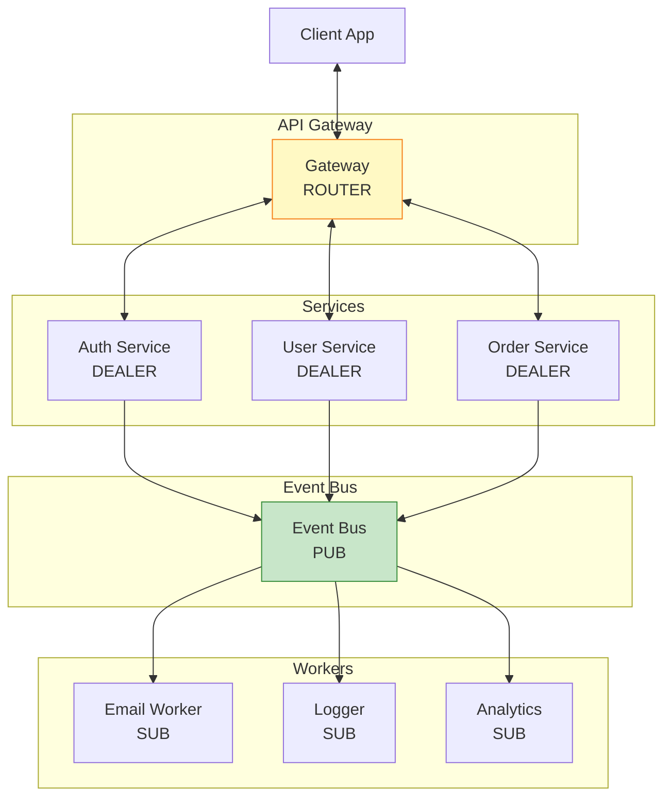
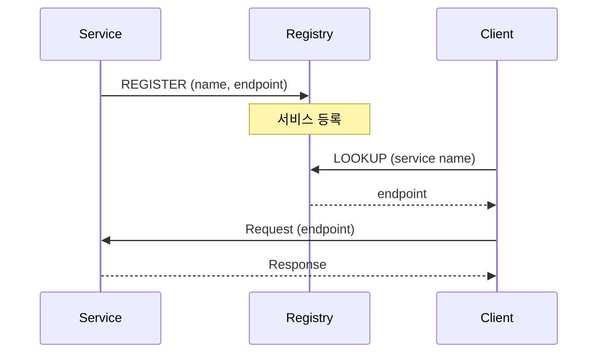
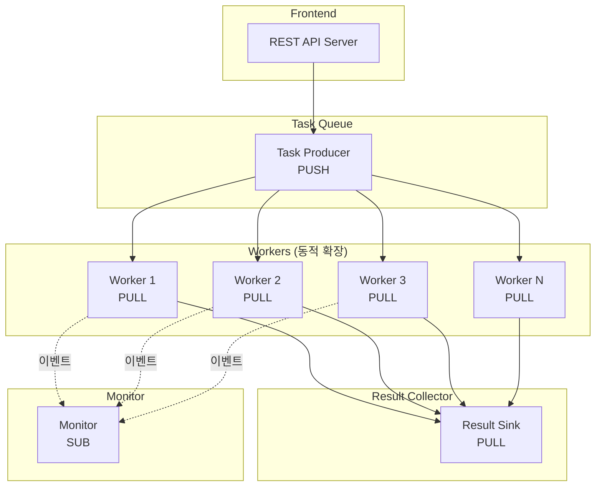
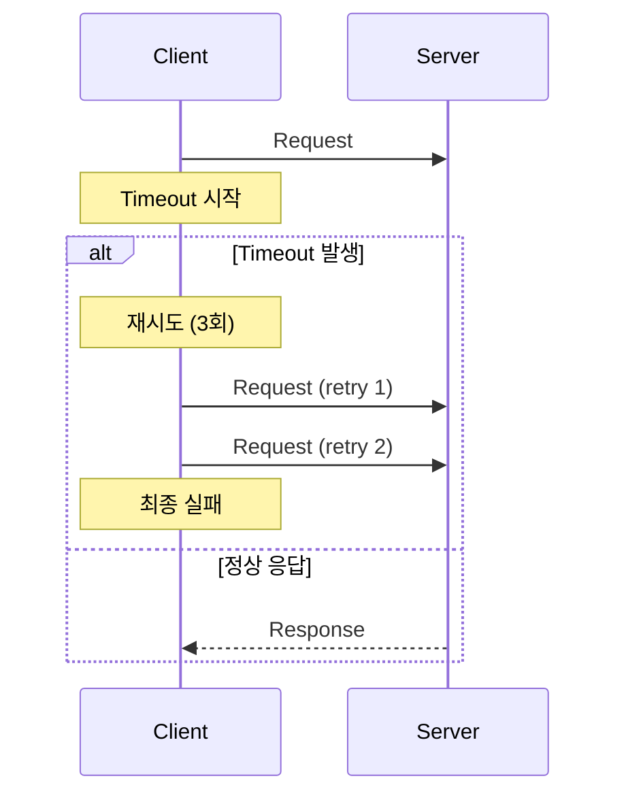
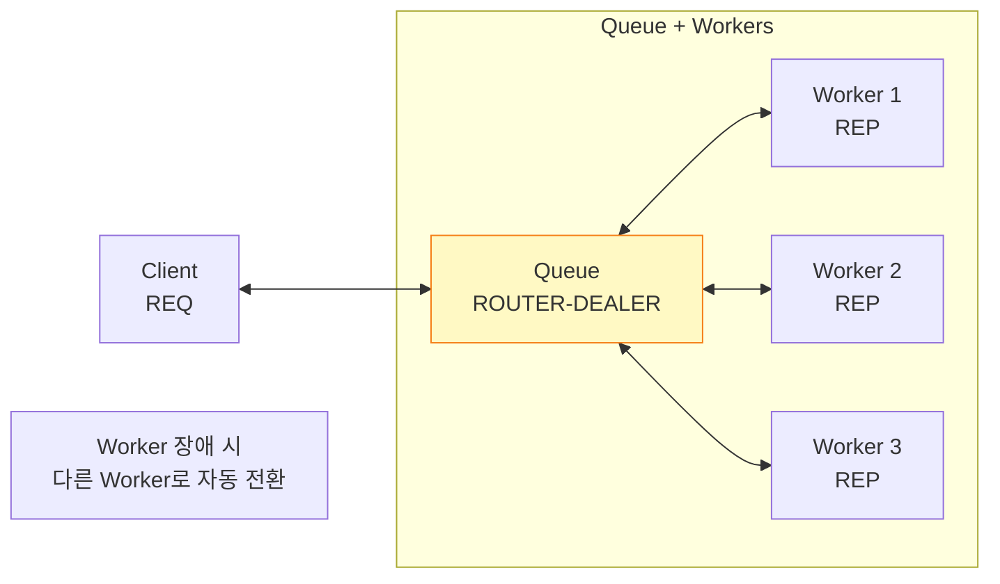
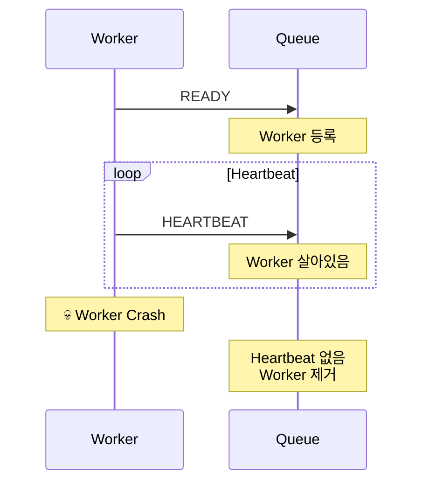
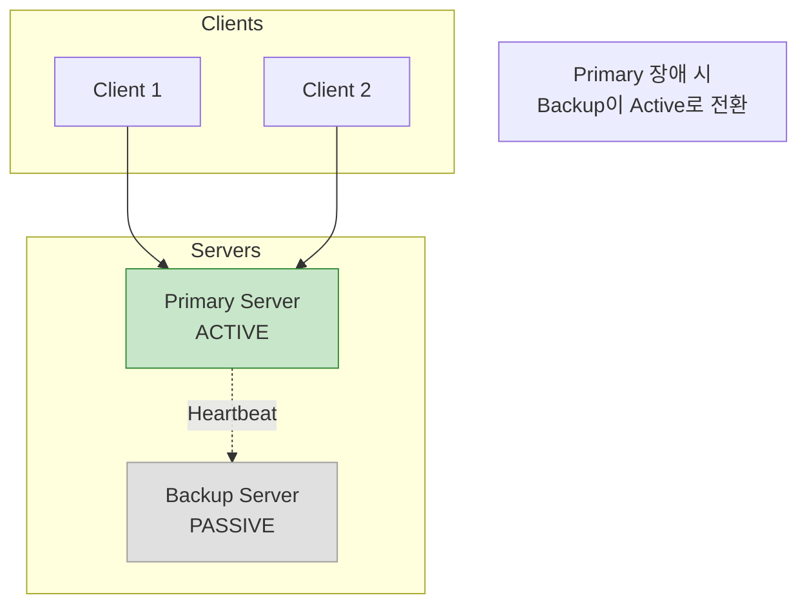

## 들어가며

이론을 넘어 **실전**으로! ZeroMQ로 실제 분산 시스템을 구축하고, 장애 상황에서도 안정적으로 동작하는 아키텍처를 설계합니다.

## 실전 아키텍처 패턴

### 1. Microservices Architecture



### 2. Service Discovery 패턴



## 실전 예제: Task Distribution System

### 아키텍처



### Task Producer

```c
// task_producer.c
#include <zmq.h>
#include <stdio.h>
#include <string.h>
#include <time.h>

int main() {
    void *context = zmq_ctx_new();

    // Task queue
    void *tasks = zmq_socket(context, ZMQ_PUSH);
    zmq_bind(tasks, "tcp://*:5557");

    // Monitor events
    void *monitor = zmq_socket(context, ZMQ_PUB);
    zmq_bind(monitor, "tcp://*:5559");

    printf("Task Producer 시작...\n");

    int task_id = 0;
    while (1) {
        task_id++;

        // Task 생성
        char task[256];
        snprintf(task, 256, "{\"id\":%d,\"type\":\"process\",\"data\":\"sample%d\"}",
                 task_id, task_id);

        zmq_send(tasks, task, strlen(task), 0);
        printf("Task %d 전송\n", task_id);

        // Monitor 이벤트
        char event[300];
        time_t now = time(NULL);
        snprintf(event, 300, "{\"event\":\"task_created\",\"id\":%d,\"time\":%ld}",
                 task_id, now);
        zmq_send(monitor, event, strlen(event), 0);

        sleep(1);
    }

    zmq_close(tasks);
    zmq_close(monitor);
    zmq_ctx_destroy(context);
    return 0;
}
```

### Worker

```c
// worker.c
#include <zmq.h>
#include <stdio.h>
#include <string.h>
#include <unistd.h>
#include <time.h>

int main() {
    void *context = zmq_ctx_new();

    // Task receiver
    void *receiver = zmq_socket(context, ZMQ_PULL);
    zmq_connect(receiver, "tcp://localhost:5557");

    // Result sender
    void *results = zmq_socket(context, ZMQ_PUSH);
    zmq_connect(results, "tcp://localhost:5558");

    // Monitor
    void *monitor = zmq_socket(context, ZMQ_PUB);
    zmq_connect(monitor, "tcp://localhost:5559");

    int worker_id = getpid();
    printf("Worker %d 시작\n", worker_id);

    while (1) {
        char task[256];
        int size = zmq_recv(receiver, task, 256, 0);
        task[size] = '\0';

        printf("[Worker %d] 작업 수신: %s\n", worker_id, task);

        // Monitor: 작업 시작
        char event[300];
        time_t now = time(NULL);
        snprintf(event, 300,
                 "{\"event\":\"task_started\",\"worker\":%d,\"time\":%ld}",
                 worker_id, now);
        zmq_send(monitor, event, strlen(event), 0);

        // 작업 처리 (시뮬레이션)
        sleep(2);

        // 결과 전송
        char result[300];
        snprintf(result, 300,
                 "{\"worker\":%d,\"task\":%s,\"status\":\"completed\"}",
                 worker_id, task);
        zmq_send(results, result, strlen(result), 0);

        // Monitor: 작업 완료
        snprintf(event, 300,
                 "{\"event\":\"task_completed\",\"worker\":%d,\"time\":%ld}",
                 worker_id, time(NULL));
        zmq_send(monitor, event, strlen(event), 0);

        printf("[Worker %d] 작업 완료\n", worker_id);
    }

    zmq_close(receiver);
    zmq_close(results);
    zmq_close(monitor);
    zmq_ctx_destroy(context);
    return 0;
}
```

### Result Collector

```c
// result_collector.c
#include <zmq.h>
#include <stdio.h>

int main() {
    void *context = zmq_ctx_new();
    void *collector = zmq_socket(context, ZMQ_PULL);
    zmq_bind(collector, "tcp://*:5558");

    printf("Result Collector 시작...\n");

    int count = 0;
    while (1) {
        char result[300];
        int size = zmq_recv(collector, result, 300, 0);
        result[size] = '\0';

        count++;
        printf("결과 #%d: %s\n", count, result);

        // 실전: DB에 저장, 캐시 업데이트 등
    }

    zmq_close(collector);
    zmq_ctx_destroy(context);
    return 0;
}
```

### Monitor

```c
// monitor.c
#include <zmq.h>
#include <stdio.h>

int main() {
    void *context = zmq_ctx_new();
    void *monitor = zmq_socket(context, ZMQ_SUB);
    zmq_connect(monitor, "tcp://localhost:5559");

    // 모든 이벤트 구독
    zmq_setsockopt(monitor, ZMQ_SUBSCRIBE, "", 0);

    printf("Monitor 시작...\n");

    while (1) {
        char event[300];
        int size = zmq_recv(monitor, event, 300, 0);
        event[size] = '\0';

        printf("📊 %s\n", event);

        // 실전: Grafana, Prometheus 등으로 전송
    }

    zmq_close(monitor);
    zmq_ctx_destroy(context);
    return 0;
}
```

## 장애 복구 (Reliability)

### 1. Lazy Pirate 패턴 (Client-side)



**구현**:

```c
// lazy_pirate_client.c
#include <zmq.h>
#include <stdio.h>
#include <string.h>

#define REQUEST_TIMEOUT  2500    // 2.5초
#define REQUEST_RETRIES  3       // 3회 재시도

int main() {
    void *context = zmq_ctx_new();
    void *client = zmq_socket(context, ZMQ_REQ);
    zmq_connect(client, "tcp://localhost:5555");

    // Timeout 설정
    int timeout = REQUEST_TIMEOUT;
    zmq_setsockopt(client, ZMQ_RCVTIMEO, &timeout, sizeof(timeout));

    int retries_left = REQUEST_RETRIES;

    while (retries_left) {
        char request[] = "Hello";
        zmq_send(client, request, strlen(request), 0);
        printf("요청 전송... (재시도 %d회 남음)\n", retries_left);

        char reply[256];
        int size = zmq_recv(client, reply, 256, 0);

        if (size != -1) {
            reply[size] = '\0';
            printf("✅ 응답 받음: %s\n", reply);
            break;
        } else {
            retries_left--;

            if (retries_left == 0) {
                printf("❌ 서버 응답 없음. 포기.\n");
                break;
            }

            printf("⚠️ Timeout. 재연결 중...\n");

            // 소켓 재생성
            zmq_close(client);
            client = zmq_socket(context, ZMQ_REQ);
            zmq_connect(client, "tcp://localhost:5555");
            zmq_setsockopt(client, ZMQ_RCVTIMEO, &timeout, sizeof(timeout));
        }
    }

    zmq_close(client);
    zmq_ctx_destroy(context);
    return 0;
}
```

### 2. Simple Pirate 패턴 (Server-side)



**구현**: 이전 Proxy 패턴과 동일

### 3. Paranoid Pirate 패턴 (Heartbeat)



**구현 (간략화)**:

```c
// Worker가 주기적으로 HEARTBEAT 전송
while (1) {
    // 작업 수행...

    // 1초마다 Heartbeat
    static time_t last_heartbeat = 0;
    time_t now = time(NULL);

    if (now - last_heartbeat >= 1) {
        zmq_send(socket, "HEARTBEAT", 9, 0);
        last_heartbeat = now;
    }
}
```

## High Availability (HA) 패턴

### Binary Star 패턴 (Active-Passive)



## 성능 측정 및 모니터링

### 메트릭 수집

```c
// metrics.c
typedef struct {
    uint64_t messages_sent;
    uint64_t messages_received;
    uint64_t bytes_sent;
    uint64_t bytes_received;
    time_t start_time;
} metrics_t;

void print_metrics(metrics_t *m) {
    time_t elapsed = time(NULL) - m->start_time;

    printf("📊 Metrics:\n");
    printf("  Messages: %llu sent, %llu received\n",
           m->messages_sent, m->messages_received);
    printf("  Throughput: %.2f msg/s\n",
           (double)m->messages_sent / elapsed);
    printf("  Bandwidth: %.2f MB/s\n",
           (double)m->bytes_sent / elapsed / 1024 / 1024);
}
```

## 실전 배포 전략

### 1. Docker Compose 예제

```yaml
version: '3'
services:
  proxy:
    build: ./proxy
    ports:
      - "5555:5555"
      - "5556:5556"

  worker:
    build: ./worker
    deploy:
      replicas: 3

  monitor:
    build: ./monitor
    ports:
      - "8080:8080"
```

### 2. Kubernetes 배포

```yaml
apiVersion: apps/v1
kind: Deployment
metadata:
  name: zeromq-worker
spec:
  replicas: 5
  selector:
    matchLabels:
      app: zeromq-worker
  template:
    metadata:
      labels:
        app: zeromq-worker
    spec:
      containers:
      - name: worker
        image: my-zeromq-worker:latest
        env:
        - name: BROKER_URL
          value: "tcp://proxy-service:5556"
```

## 다음 단계

실전 분산 시스템 구축 방법을 익혔습니다! 다음 글에서는:
- **성능 최적화** 기법
- 보안 (CurveZMQ 암호화)
- 프로덕션 best practices

---

**시리즈 목차**
1. ZeroMQ란 무엇인가 - 고성능 메시징 라이브러리
2. ZeroMQ 메시징 패턴 - REQ/REP, PUB/SUB, PUSH/PULL
3. ZeroMQ 고급 패턴 - ROUTER, DEALER, PROXY
4. **ZeroMQ 실전 활용 - 분산 시스템 구축** ← 현재 글
5. ZeroMQ 성능 최적화 및 보안 (다음 글)

> 💡 **Quick Tip**: 프로덕션 환경에서는 반드시 Heartbeat와 재연결 로직을 구현하세요. 네트워크는 언제나 불안정할 수 있습니다!
