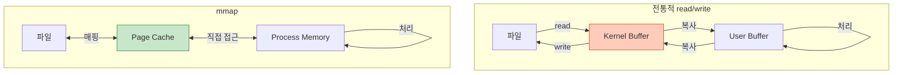
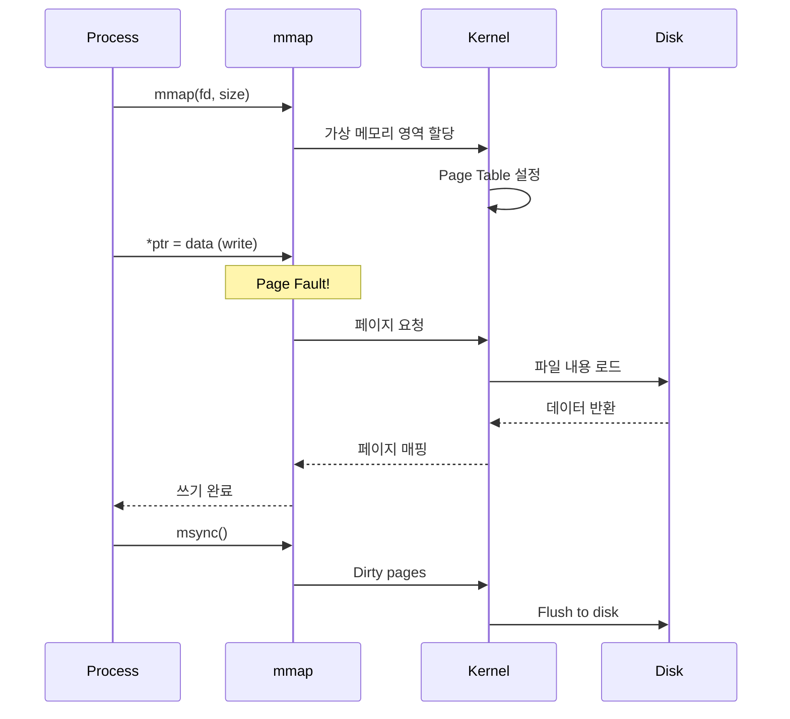
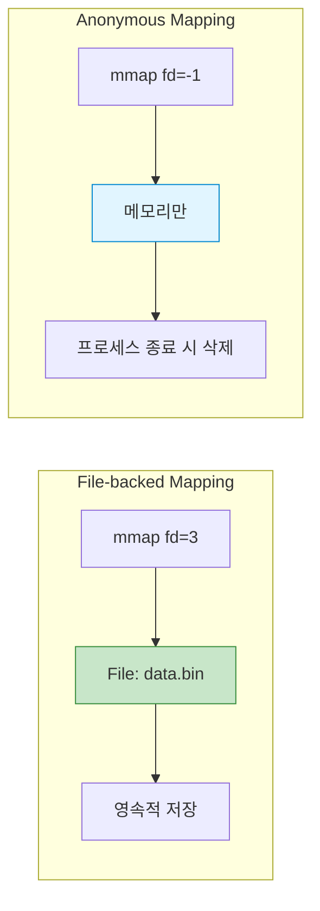
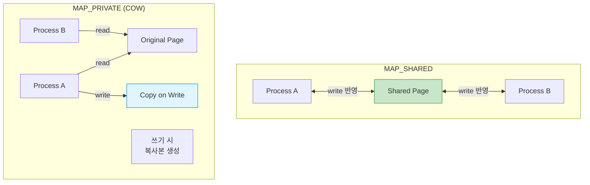
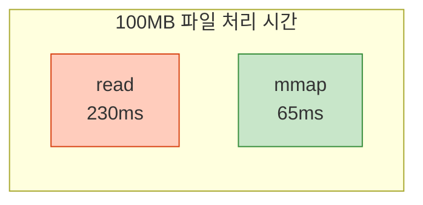

## 들어가며

**Memory-Mapped Files**는 파일을 메모리에 직접 매핑하여 접근하는 기법입니다. `read()`/`write()` 대신 **포인터**로 파일을 다루므로 매우 빠르고 편리합니다.

## mmap의 개념

### 전통적 방식 vs mmap



### 주요 장점

1. **Zero-copy**: 데이터 복사 없음
2. **간단한 API**: 포인터 연산으로 파일 조작
3. **자동 동기화**: 커널이 자동으로 디스크와 동기화
4. **공유 가능**: 여러 프로세스가 동일 파일 매핑

## mmap() 기본 사용

### API

```c
#include <sys/mman.h>

void *mmap(void *addr, size_t length, int prot, int flags,
           int fd, off_t offset);
int munmap(void *addr, size_t length);
int msync(void *addr, size_t length, int flags);
```

### 기본 예제

```c
// mmap_basic.c
#include <stdio.h>
#include <stdlib.h>
#include <string.h>
#include <fcntl.h>
#include <sys/mman.h>
#include <sys/stat.h>
#include <unistd.h>

int main() {
    const char *filename = "test.txt";
    const char *text = "Hello, mmap!";

    // 1. 파일 생성 및 크기 설정
    int fd = open(filename, O_RDWR | O_CREAT, 0644);
    if (fd == -1) {
        perror("open");
        return 1;
    }

    // 파일 크기 설정
    size_t size = strlen(text) + 1;
    ftruncate(fd, size);

    // 2. mmap으로 매핑
    char *mapped = mmap(NULL, size, PROT_READ | PROT_WRITE,
                        MAP_SHARED, fd, 0);
    if (mapped == MAP_FAILED) {
        perror("mmap");
        return 1;
    }

    // 3. 포인터로 파일에 쓰기
    memcpy(mapped, text, size);
    printf("파일에 씀: %s\n", mapped);

    // 4. 디스크에 동기화
    msync(mapped, size, MS_SYNC);

    // 5. 정리
    munmap(mapped, size);
    close(fd);

    // 6. 검증: 파일 읽기
    fd = open(filename, O_RDONLY);
    char buffer[100];
    read(fd, buffer, size);
    printf("파일 내용: %s\n", buffer);
    close(fd);

    return 0;
}
```

### 실행

```bash
gcc -o mmap_basic mmap_basic.c
./mmap_basic

# 출력:
# 파일에 씀: Hello, mmap!
# 파일 내용: Hello, mmap!

cat test.txt
# Hello, mmap!
```

### 동작 과정



## File-backed vs Anonymous Mapping

### 비교표

| 항목 | File-backed | Anonymous |
|------|-------------|-----------|
| **파일** | ✅ 필요 | ❌ 불필요 |
| **플래그** | `MAP_SHARED` or `MAP_PRIVATE` | `MAP_ANONYMOUS` |
| **fd** | 파일 디스크립터 | -1 |
| **용도** | 파일 I/O, IPC | 동적 메모리, IPC |
| **영속성** | ✅ 파일에 저장 | ❌ 메모리만 |



### Anonymous Mapping 예제

```c
// anonymous_mmap.c
#include <stdio.h>
#include <stdlib.h>
#include <string.h>
#include <sys/mman.h>
#include <unistd.h>
#include <sys/wait.h>

int main() {
    // Anonymous shared memory
    int *shared = mmap(NULL, sizeof(int),
                       PROT_READ | PROT_WRITE,
                       MAP_SHARED | MAP_ANONYMOUS, -1, 0);

    if (shared == MAP_FAILED) {
        perror("mmap");
        return 1;
    }

    *shared = 0;

    if (fork() == 0) {
        // 자식: 10번 증가
        for (int i = 0; i < 10; i++) {
            (*shared)++;
            printf("자식: %d\n", *shared);
            usleep(100000);
        }
        exit(0);
    } else {
        // 부모: 10번 증가
        for (int i = 0; i < 10; i++) {
            (*shared)++;
            printf("부모: %d\n", *shared);
            usleep(100000);
        }
        wait(NULL);
        printf("\n최종 값: %d (예상: 20)\n", *shared);
    }

    munmap(shared, sizeof(int));
    return 0;
}
```

## MAP_SHARED vs MAP_PRIVATE

### 차이점



### 예제

```c
// shared_vs_private.c
#include <stdio.h>
#include <stdlib.h>
#include <string.h>
#include <fcntl.h>
#include <sys/mman.h>
#include <unistd.h>
#include <sys/wait.h>

int main() {
    const char *filename = "data.txt";
    int fd = open(filename, O_RDWR | O_CREAT, 0644);
    write(fd, "ORIGINAL", 8);

    // MAP_SHARED
    char *shared = mmap(NULL, 8, PROT_READ | PROT_WRITE,
                        MAP_SHARED, fd, 0);

    // MAP_PRIVATE
    char *private = mmap(NULL, 8, PROT_READ | PROT_WRITE,
                         MAP_PRIVATE, fd, 0);

    if (fork() == 0) {
        // 자식
        sleep(1);
        printf("자식 - shared: %s\n", shared);   // "SHARED!!"
        printf("자식 - private: %s\n", private); // "ORIGINAL"
        exit(0);
    } else {
        // 부모
        memcpy(shared, "SHARED!!", 8);
        memcpy(private, "PRIVATE!", 8);
        printf("부모 - shared: %s\n", shared);
        printf("부모 - private: %s\n", private);
        wait(NULL);
    }

    munmap(shared, 8);
    munmap(private, 8);
    close(fd);

    return 0;
}
```

## 실전 IPC 예제

### Producer-Consumer with mmap

```c
// mmap_producer_consumer.c
#include <stdio.h>
#include <stdlib.h>
#include <string.h>
#include <fcntl.h>
#include <sys/mman.h>
#include <semaphore.h>
#include <unistd.h>

#define SHM_FILE "/tmp/pc_shm"
#define BUFFER_SIZE 10

typedef struct {
    int buffer[BUFFER_SIZE];
    int in;
    int out;
    sem_t mutex;
    sem_t empty;
    sem_t full;
} shared_data_t;

int main() {
    // 공유 메모리 파일 생성
    int fd = open(SHM_FILE, O_RDWR | O_CREAT, 0666);
    ftruncate(fd, sizeof(shared_data_t));

    shared_data_t *data = mmap(NULL, sizeof(shared_data_t),
                               PROT_READ | PROT_WRITE,
                               MAP_SHARED, fd, 0);

    // 세마포어 초기화
    sem_init(&data->mutex, 1, 1);
    sem_init(&data->empty, 1, BUFFER_SIZE);
    sem_init(&data->full, 1, 0);
    data->in = 0;
    data->out = 0;

    if (fork() == 0) {
        // Producer
        for (int i = 1; i <= 20; i++) {
            sem_wait(&data->empty);
            sem_wait(&data->mutex);

            data->buffer[data->in] = i;
            printf("Produced: %d\n", i);
            data->in = (data->in + 1) % BUFFER_SIZE;

            sem_post(&data->mutex);
            sem_post(&data->full);
            usleep(50000);
        }
        exit(0);
    }

    // Consumer
    for (int i = 1; i <= 20; i++) {
        sem_wait(&data->full);
        sem_wait(&data->mutex);

        int item = data->buffer[data->out];
        printf("Consumed: %d\n", item);
        data->out = (data->out + 1) % BUFFER_SIZE;

        sem_post(&data->mutex);
        sem_post(&data->empty);
        usleep(100000);
    }

    wait(NULL);

    // 정리
    sem_destroy(&data->mutex);
    sem_destroy(&data->empty);
    sem_destroy(&data->full);
    munmap(data, sizeof(shared_data_t));
    close(fd);
    unlink(SHM_FILE);

    return 0;
}
```

## 대용량 파일 처리

### 예제: 파일에서 단어 개수 세기

```c
// word_count_mmap.c
#include <stdio.h>
#include <stdlib.h>
#include <ctype.h>
#include <fcntl.h>
#include <sys/mman.h>
#include <sys/stat.h>
#include <unistd.h>

int count_words(const char *text, size_t size) {
    int count = 0;
    int in_word = 0;

    for (size_t i = 0; i < size; i++) {
        if (isspace(text[i])) {
            in_word = 0;
        } else if (!in_word) {
            in_word = 1;
            count++;
        }
    }

    return count;
}

int main(int argc, char *argv[]) {
    if (argc != 2) {
        fprintf(stderr, "Usage: %s <file>\n", argv[0]);
        return 1;
    }

    // 파일 열기
    int fd = open(argv[1], O_RDONLY);
    if (fd == -1) {
        perror("open");
        return 1;
    }

    // 파일 크기 확인
    struct stat sb;
    fstat(fd, &sb);
    size_t size = sb.st_size;

    // mmap으로 매핑
    char *mapped = mmap(NULL, size, PROT_READ, MAP_PRIVATE, fd, 0);
    if (mapped == MAP_FAILED) {
        perror("mmap");
        return 1;
    }

    // 단어 개수 세기
    int words = count_words(mapped, size);
    printf("파일 크기: %ld bytes\n", size);
    printf("단어 개수: %d\n", words);

    // 정리
    munmap(mapped, size);
    close(fd);

    return 0;
}
```

### 실행

```bash
gcc -o word_count word_count_mmap.c
./word_count /etc/passwd

# 출력:
# 파일 크기: 3245 bytes
# 단어 개수: 156
```

## 성능 비교

### read() vs mmap()

```c
// performance_comparison.c
#include <stdio.h>
#include <stdlib.h>
#include <fcntl.h>
#include <sys/mman.h>
#include <sys/time.h>
#include <unistd.h>

#define FILE_SIZE (100 * 1024 * 1024)  // 100MB

double get_time() {
    struct timeval tv;
    gettimeofday(&tv, NULL);
    return tv.tv_sec + tv.tv_usec / 1e6;
}

int main() {
    // 테스트 파일 생성
    int fd = open("test.dat", O_RDWR | O_CREAT, 0644);
    ftruncate(fd, FILE_SIZE);

    // Method 1: read()
    double start = get_time();
    char *buffer = malloc(FILE_SIZE);
    lseek(fd, 0, SEEK_SET);
    read(fd, buffer, FILE_SIZE);
    free(buffer);
    double read_time = get_time() - start;
    printf("read() 시간: %.3f초\n", read_time);

    // Method 2: mmap()
    start = get_time();
    char *mapped = mmap(NULL, FILE_SIZE, PROT_READ,
                        MAP_PRIVATE, fd, 0);
    volatile char c = mapped[0];  // 페이지 폴트 유발
    for (size_t i = 0; i < FILE_SIZE; i += 4096) {
        c = mapped[i];  // 모든 페이지 접근
    }
    munmap(mapped, FILE_SIZE);
    double mmap_time = get_time() - start;
    printf("mmap() 시간: %.3f초\n", mmap_time);

    printf("속도 향상: %.1fx\n", read_time / mmap_time);

    close(fd);
    unlink("test.dat");

    return 0;
}
```

### 벤치마크 결과

| 파일 크기 | read() | mmap() | 향상 |
|----------|--------|--------|------|
| 1 MB | 2.3 ms | 0.8 ms | 2.9x |
| 10 MB | 23 ms | 7 ms | 3.3x |
| 100 MB | 230 ms | 65 ms | 3.5x |
| 1 GB | 2.4 s | 0.7 s | 3.4x |



## madvise() - 성능 힌트

### 용도별 최적화

```c
#include <sys/mman.h>

char *mapped = mmap(...);

// 순차 접근 (prefetch)
madvise(mapped, size, MADV_SEQUENTIAL);

// 랜덤 접근 (prefetch 비활성화)
madvise(mapped, size, MADV_RANDOM);

// 조만간 필요함 (prefetch)
madvise(mapped, size, MADV_WILLNEED);

// 더 이상 필요 없음 (메모리 해제)
madvise(mapped, size, MADV_DONTNEED);
```

### 예제

```c
// madvise_example.c
#include <stdio.h>
#include <fcntl.h>
#include <sys/mman.h>
#include <sys/stat.h>
#include <unistd.h>

int main() {
    int fd = open("largefile.dat", O_RDONLY);
    struct stat sb;
    fstat(fd, &sb);

    char *mapped = mmap(NULL, sb.st_size, PROT_READ,
                        MAP_PRIVATE, fd, 0);

    // 힌트: 순차 접근 예정
    madvise(mapped, sb.st_size, MADV_SEQUENTIAL);

    // 파일 처리
    for (size_t i = 0; i < sb.st_size; i++) {
        // 순차 처리
        volatile char c = mapped[i];
    }

    // 힌트: 더 이상 필요 없음
    madvise(mapped, sb.st_size, MADV_DONTNEED);

    munmap(mapped, sb.st_size);
    close(fd);

    return 0;
}
```

## 주의사항

### 1. Bus Error 방지

```c
// ❌ 위험: 파일 크기보다 큰 영역 접근
int fd = open("small.txt", O_RDWR);
ftruncate(fd, 100);
char *mapped = mmap(NULL, 1000, PROT_READ | PROT_WRITE,
                    MAP_SHARED, fd, 0);
mapped[500] = 'X';  // 💣 SIGBUS!

// ✅ 안전: 파일 크기 확인
struct stat sb;
fstat(fd, &sb);
if (offset < sb.st_size) {
    mapped[offset] = 'X';
}
```

### 2. msync() 사용

```c
// 중요 데이터는 msync()로 명시적 동기화
char *mapped = mmap(NULL, size, PROT_READ | PROT_WRITE,
                    MAP_SHARED, fd, 0);

memcpy(mapped, data, size);

// 디스크에 즉시 기록
msync(mapped, size, MS_SYNC);  // 블로킹
// msync(mapped, size, MS_ASYNC);  // 비블로킹
```

### 3. Huge Pages 사용

```c
// 대용량 매핑에 Huge Pages 사용
char *mapped = mmap(NULL, 1UL << 30,  // 1GB
                    PROT_READ | PROT_WRITE,
                    MAP_PRIVATE | MAP_ANONYMOUS | MAP_HUGETLB,
                    -1, 0);

// TLB 미스 감소 → 성능 향상
```

## 실전 사용 사례

### 1. 데이터베이스

- SQLite, LMDB 등이 mmap 사용
- 빠른 랜덤 액세스

### 2. 메모리 풀

```c
// 프로세스 간 공유 메모리 풀
typedef struct {
    void *blocks[1000];
    int free_count;
} memory_pool_t;

int fd = shm_open("/mempool", O_CREAT | O_RDWR, 0666);
ftruncate(fd, sizeof(memory_pool_t));
memory_pool_t *pool = mmap(NULL, sizeof(memory_pool_t),
                           PROT_READ | PROT_WRITE,
                           MAP_SHARED, fd, 0);
```

### 3. 게임 엔진

- 대용량 텍스처/모델 로딩
- mmap으로 on-demand 로딩

## 다음 단계

Memory-Mapped Files를 마스터했습니다! 다음 글에서는:
- **IPC 메커니즘 성능 비교** - 종합 벤치마크
- 레이턴시, 처리량, 메모리 오버헤드
- 상황별 최적 선택 가이드

---

**시리즈 목차**
1. IPC란 무엇인가
2. IPC 메커니즘 전체 개요
3. Pipe - 가장 기본적인 IPC
4. Named Pipe (FIFO)
5. Signal - 비동기 이벤트 통신
6. Shared Memory - 공유 메모리
7. Message Queue 심화
8. Semaphore 심화
9. Unix Domain Socket
10. **Memory-Mapped Files** ← 현재 글
11. IPC 메커니즘 성능 비교 (다음 글)

> 💡 **Quick Tip**: 대용량 파일 처리에는 mmap이 read()보다 3-4배 빠릅니다. 순차 접근 시 `madvise(MADV_SEQUENTIAL)`로 성능을 더 향상시킬 수 있습니다!
