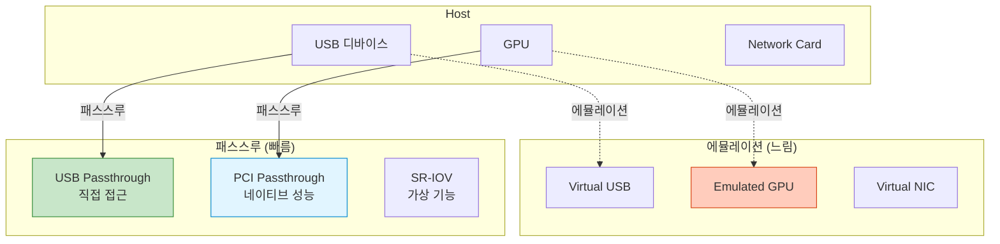
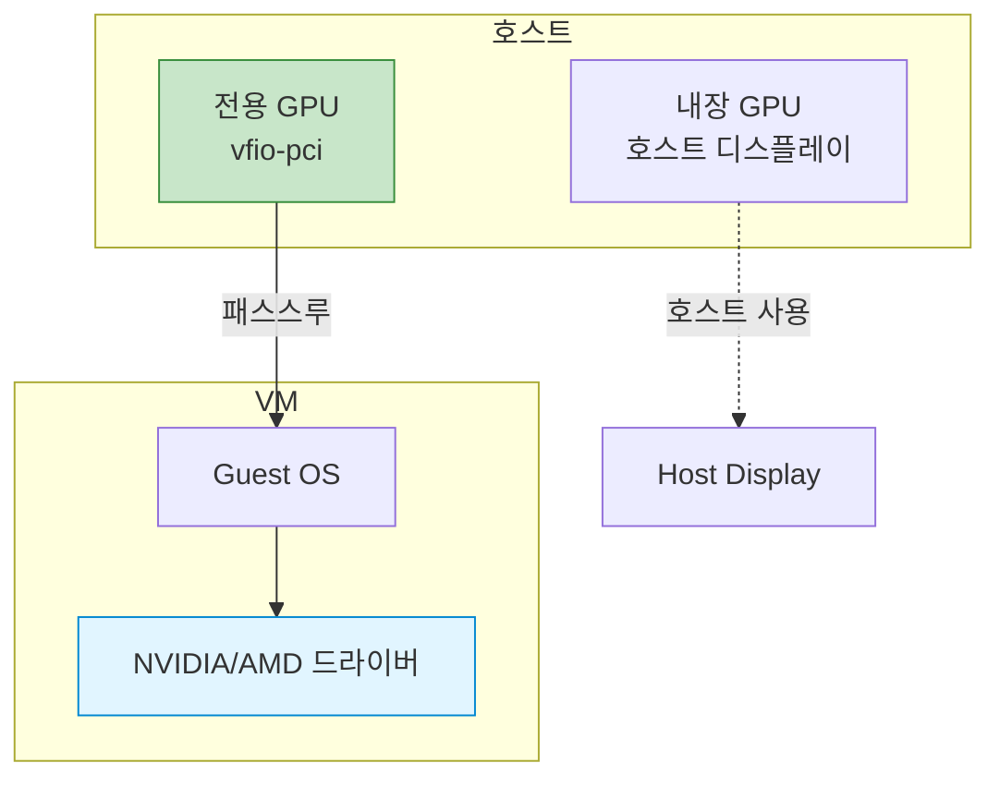
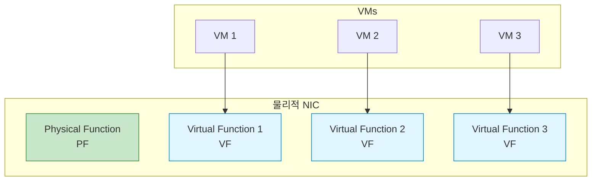

## 들어가며

VM에서 GPU나 USB 디바이스를 직접 사용하고 싶다면? **디바이스 패스스루**를 통해 물리적 하드웨어를 VM에 직접 연결할 수 있습니다.

## 디바이스 패스스루 개념



## USB 패스스루

### USB 디바이스 확인

```bash
# 연결된 USB 디바이스 목록
lsusb

Bus 001 Device 005: ID 8087:0aaa Intel Corp. Bluetooth
Bus 001 Device 004: ID 046d:c52b Logitech USB Receiver
Bus 002 Device 003: ID 0781:5567 SanDisk Ultra USB 3.0

# 상세 정보
lsusb -v -d 0781:5567
```

### USB 호스트 디바이스 패스스루

```bash
# 방법 1: Vendor ID와 Product ID로 지정
qemu-system-x86_64 \
  -m 2G \
  -drive file=ubuntu.qcow2 \
  -usb \
  -device usb-host,vendorid=0x0781,productid=0x5567

# 방법 2: Bus와 Device 번호로 지정
qemu-system-x86_64 \
  -m 2G \
  -drive file=ubuntu.qcow2 \
  -usb \
  -device usb-host,hostbus=2,hostaddr=3

# 방법 3: libusb (레거시)
qemu-system-x86_64 \
  -m 2G \
  -drive file=ubuntu.qcow2 \
  -usbdevice host:0781:5567
```

### USB 핫플러그

```bash
# VM 실행 (QMP 활성화)
qemu-system-x86_64 \
  -m 2G \
  -drive file=ubuntu.qcow2 \
  -usb \
  -qmp unix:/tmp/qmp.sock,server,nowait

# USB 디바이스 추가 (런타임)
echo '{"execute": "qmp_capabilities"}' | nc -U /tmp/qmp.sock
echo '{"execute": "device_add", "arguments": {"driver": "usb-host", "vendorid": "0x0781", "productid": "0x5567", "id": "usb0"}}' | nc -U /tmp/qmp.sock

# USB 디바이스 제거
echo '{"execute": "device_del", "arguments": {"id": "usb0"}}' | nc -U /tmp/qmp.sock
```

### USB 컨트롤러 선택

```bash
# USB 2.0 (EHCI)
qemu-system-x86_64 \
  -device usb-ehci,id=ehci \
  -device usb-host,bus=ehci.0,vendorid=0x0781,productid=0x5567 \
  -m 2G

# USB 3.0 (xHCI)
qemu-system-x86_64 \
  -device qemu-xhci,id=xhci \
  -device usb-host,bus=xhci.0,vendorid=0x0781,productid=0x5567 \
  -m 2G
```

## PCI 패스스루 (VFIO)

### 사전 요구사항

```bash
# 1. IOMMU 활성화 확인
dmesg | grep -i iommu

DMAR: IOMMU enabled  # Intel
AMD-Vi: AMD IOMMUv2 loaded  # AMD

# 2. IOMMU 그룹 확인
#!/bin/bash
for d in /sys/kernel/iommu_groups/*/devices/*; do
    n=${d#*/iommu_groups/*}; n=${n%%/*}
    printf 'IOMMU Group %s ' "$n"
    lspci -nns "${d##*/}"
done

# 출력 예시:
IOMMU Group 1 01:00.0 VGA compatible controller [0300]: NVIDIA Corporation GP107 [GeForce GTX 1050 Ti] [10de:1c82]
IOMMU Group 1 01:00.1 Audio device [0403]: NVIDIA Corporation GP107GL High Definition Audio Controller [10de:0fb9]

# 3. IOMMU 부팅 파라미터 설정
# /etc/default/grub
# Intel:
GRUB_CMDLINE_LINUX="intel_iommu=on iommu=pt"
# AMD:
GRUB_CMDLINE_LINUX="amd_iommu=on iommu=pt"

sudo update-grub
sudo reboot
```

### VFIO 드라이버 바인딩

```bash
# 1. PCI 디바이스 정보 확인
lspci -nnk -d 10de:1c82

01:00.0 VGA compatible controller [0300]: NVIDIA Corporation GP107 [GeForce GTX 1050 Ti] [10de:1c82]
        Kernel driver in use: nvidia  # ← 현재 드라이버

# 2. vfio-pci 모듈 로드
sudo modprobe vfio-pci

# 3. 디바이스를 vfio-pci에 바인딩
# /etc/modprobe.d/vfio.conf
options vfio-pci ids=10de:1c82,10de:0fb9

# 4. 호스트 드라이버 블랙리스트
# /etc/modprobe.d/blacklist.conf
blacklist nvidia
blacklist nouveau

# 5. initramfs 재생성
sudo update-initramfs -u
sudo reboot

# 6. 확인
lspci -nnk -d 10de:1c82
        Kernel driver in use: vfio-pci  # ← vfio-pci로 변경됨
```

### PCI 디바이스 패스스루

```bash
# 기본 PCI 패스스루
qemu-system-x86_64 \
  -enable-kvm \
  -m 8G \
  -smp 4 \
  -drive file=ubuntu.qcow2 \
  -device vfio-pci,host=01:00.0

# 여러 디바이스 패스스루 (GPU + Audio)
qemu-system-x86_64 \
  -enable-kvm \
  -m 8G \
  -smp 4 \
  -drive file=ubuntu.qcow2 \
  -device vfio-pci,host=01:00.0 \
  -device vfio-pci,host=01:00.1
```

## GPU 패스스루

### 단일 GPU 패스스루



```bash
# GPU 패스스루 (OVMF UEFI 필요)
qemu-system-x86_64 \
  -enable-kvm \
  -m 16G \
  -smp 8,sockets=1,cores=4,threads=2 \
  -cpu host,kvm=off,hv_vendor_id=whatever \
  -machine q35,accel=kvm \
  \
  `# UEFI 펌웨어` \
  -drive if=pflash,format=raw,readonly=on,file=/usr/share/OVMF/OVMF_CODE.fd \
  -drive if=pflash,format=raw,file=/var/lib/libvirt/qemu/nvram/vm_VARS.fd \
  \
  `# 디스크` \
  -drive file=windows.qcow2,if=virtio \
  \
  `# GPU 패스스루` \
  -device vfio-pci,host=01:00.0,multifunction=on \
  -device vfio-pci,host=01:00.1 \
  \
  `# USB 컨트롤러` \
  -device qemu-xhci,id=xhci \
  -device usb-host,bus=xhci.0,vendorid=0x046d,productid=0xc52b
```

### NVIDIA GPU 특수 처리

```bash
# NVIDIA Error 43 우회
# kvm=off: KVM 숨기기
# hv_vendor_id: Hyper-V vendor ID 변경

qemu-system-x86_64 \
  -cpu host,kvm=off,hv_time,hv_relaxed,hv_vapic,hv_spinlocks=0x1fff,hv_vendor_id=whatever \
  -device vfio-pci,host=01:00.0,x-vga=on \
  ...

# VBIOS 덤프 및 사용 (선택사항)
# 1. VBIOS 추출
cd /sys/bus/pci/devices/0000:01:00.0/
echo 1 | sudo tee rom
sudo cat rom > /tmp/gpu_vbios.bin
echo 0 | sudo tee rom

# 2. VM에서 사용
qemu-system-x86_64 \
  -device vfio-pci,host=01:00.0,romfile=/tmp/gpu_vbios.bin \
  ...
```

### Looking Glass (듀얼 GPU 없이)

```bash
# Looking Glass: VM의 화면을 호스트에서 보기

# 1. 공유 메모리 설정
# /etc/tmpfiles.d/10-looking-glass.conf
f /dev/shm/looking-glass 0660 user kvm -

# 2. VM 설정에 IVSHMEM 추가
qemu-system-x86_64 \
  -device ivshmem-plain,memdev=ivshmem \
  -object memory-backend-file,id=ivshmem,share=on,mem-path=/dev/shm/looking-glass,size=32M \
  -device vfio-pci,host=01:00.0 \
  ...

# 3. VM 내부에 Looking Glass 호스트 설치

# 4. 호스트에서 Looking Glass 클라이언트 실행
looking-glass-client
```

## SR-IOV (Single Root I/O Virtualization)

### 개념



### SR-IOV 설정

```bash
# 1. SR-IOV 지원 확인
lspci -v | grep -i "SR-IOV"
Capabilities: [160] Single Root I/O Virtualization (SR-IOV)

# 2. VF 생성
# NIC PCI 주소 확인
lspci | grep Ethernet
82:00.0 Ethernet controller: Intel Corporation 82599ES 10-Gigabit

# VF 생성 (예: 4개)
echo 4 | sudo tee /sys/bus/pci/devices/0000:82:00.0/sriov_numvfs

# 3. 생성된 VF 확인
lspci | grep Virtual
82:10.0 Ethernet controller: Intel Corporation 82599 Ethernet Controller Virtual Function
82:10.2 Ethernet controller: Intel Corporation 82599 Ethernet Controller Virtual Function
82:10.4 Ethernet controller: Intel Corporation 82599 Ethernet Controller Virtual Function
82:10.6 Ethernet controller: Intel Corporation 82599 Ethernet Controller Virtual Function

# 4. VF를 vfio-pci에 바인딩
echo 8086 10ed | sudo tee /sys/bus/pci/drivers/vfio-pci/new_id

# 5. VM에서 VF 사용
qemu-system-x86_64 \
  -device vfio-pci,host=82:10.0 \
  -m 4G \
  -drive file=ubuntu.qcow2
```

## 디바이스 격리 및 문제 해결

### IOMMU 그룹 분리

```bash
# 문제: 같은 IOMMU 그룹에 여러 디바이스
IOMMU Group 1:
  01:00.0 VGA controller: NVIDIA
  01:00.1 Audio device: NVIDIA
  00:1c.0 PCI bridge: Intel

# 해결 1: ACS Override Patch (권장 안함, 불안정)
# 커널 파라미터
pcie_acs_override=downstream,multifunction

# 해결 2: 전체 그룹 패스스루
qemu-system-x86_64 \
  -device vfio-pci,host=01:00.0 \
  -device vfio-pci,host=01:00.1 \
  -device vfio-pci,host=00:1c.0 \
  ...
```

### ROM Bar 문제

```bash
# 오류: "ROM BAR not supported"
# 해결: rombar=0 옵션 추가

qemu-system-x86_64 \
  -device vfio-pci,host=01:00.0,rombar=0 \
  ...
```

### 인터럽트 재매핑

```bash
# 오류: "No interrupt remapping support"
# 확인
dmesg | grep "interrupt remapping"

# 해결: 커널 파라미터
intremap=no_x2apic_optout
```

## 성능 최적화

### CPU 및 메모리 피닝

```bash
# GPU 패스스루 최적화 설정
#!/bin/bash

qemu-system-x86_64 \
  -enable-kvm \
  -machine q35,accel=kvm,kernel_irqchip=on \
  \
  `# CPU 최적화` \
  -cpu host,kvm=off,hv_vendor_id=whatever,hv_time,hv_relaxed,hv_vapic,hv_spinlocks=0x1fff \
  -smp 8,sockets=1,cores=4,threads=2 \
  \
  `# 메모리 최적화 (Huge Pages)` \
  -m 16G \
  -mem-path /dev/hugepages \
  -mem-prealloc \
  \
  `# GPU 패스스루` \
  -device vfio-pci,host=01:00.0,multifunction=on,x-vga=on \
  -device vfio-pci,host=01:00.1 \
  \
  `# 스토리지` \
  -drive file=windows.qcow2,if=virtio,cache=none,aio=native \
  \
  `# UEFI` \
  -bios /usr/share/OVMF/OVMF_CODE.fd \
  \
  `# 기타` \
  -name "gaming-vm" \
  -daemonize

# CPU 피닝
VM_PID=$(pgrep -f "gaming-vm")
taskset -cp 0-7 $VM_PID
```

## 실전 시나리오

### 게이밍 VM

```bash
#!/bin/bash
# gaming_vm.sh

# Windows 게이밍 VM with GPU passthrough

qemu-system-x86_64 \
  -enable-kvm \
  -machine q35,accel=kvm \
  -cpu host,kvm=off,hv_time,hv_relaxed,hv_vapic,hv_spinlocks=0x1fff,hv_vendor_id=whatever \
  -smp 12,sockets=1,cores=6,threads=2 \
  \
  -m 24G \
  -mem-path /dev/hugepages \
  -mem-prealloc \
  \
  -drive if=pflash,format=raw,readonly=on,file=/usr/share/OVMF/OVMF_CODE.fd \
  -drive if=pflash,format=raw,file=/var/lib/libvirt/qemu/nvram/win10_VARS.fd \
  \
  -drive file=/var/lib/libvirt/images/windows10.qcow2,if=virtio,cache=none,aio=native \
  -drive file=/dev/sdb,if=virtio,cache=none,aio=native \
  \
  -device vfio-pci,host=01:00.0,multifunction=on,x-vga=on \
  -device vfio-pci,host=01:00.1 \
  \
  -device qemu-xhci,id=xhci \
  -device usb-host,bus=xhci.0,vendorid=0x046d,productid=0xc52b \
  -device usb-host,bus=xhci.0,vendorid=0x046d,productid=0xc332 \
  \
  -netdev tap,id=net0,ifname=tap0,script=no,downscript=no,vhost=on \
  -device virtio-net-pci,netdev=net0 \
  \
  -name "Windows-Gaming" \
  -daemonize

echo "Gaming VM started!"
```

### ML/AI 워크스테이션

```bash
# CUDA GPU 패스스루
qemu-system-x86_64 \
  -enable-kvm \
  -cpu host \
  -smp 16 \
  -m 64G \
  \
  -device vfio-pci,host=01:00.0 \
  -device vfio-pci,host=02:00.0 \
  \
  -drive file=ubuntu-ml.qcow2,if=virtio \
  \
  -name "ml-workstation"

# VM 내부에서 CUDA 설치 및 사용
# nvidia-smi로 GPU 확인 가능
```

## 다음 단계

디바이스 패스스루를 마스터했습니다! 다음 글에서는:
- **QEMU 스크립트 자동화**
- Bash/Python 자동화
- Ansible playbooks

---

**시리즈 목차**
1-14. [이전 글들]
15. **USB 및 PCI 패스스루** ← 현재 글

> 💡 **Quick Tip**: GPU 패스스루는 강력하지만 설정이 까다롭습니다. 첫 시도 전에 반드시 백업하고, IOMMU 그룹과 VFIO 바인딩을 정확히 확인하세요. 특히 NVIDIA GPU는 Error 43을 우회하기 위한 추가 설정이 필요합니다!
