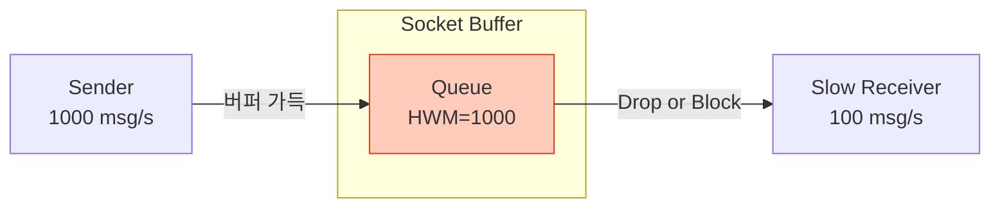
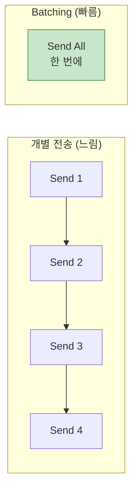
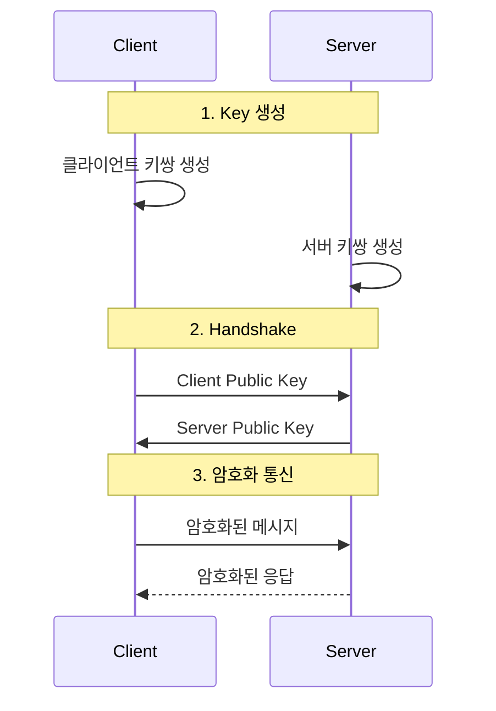
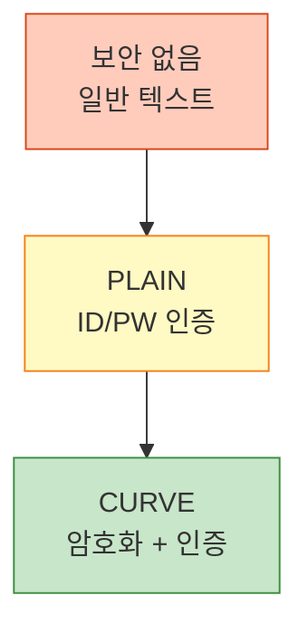
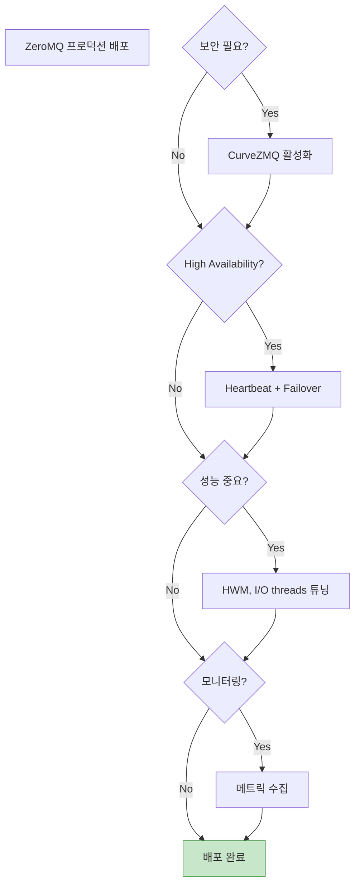

## 들어가며

ZeroMQ는 빠르지만, **제대로 사용해야** 진정한 성능이 나옵니다. 마지막 글에서는 성능 최적화와 보안 통신을 다룹니다.

## 성능 최적화

### 1. High Water Mark (HWM) 조정



**문제**: HWM에 도달하면 메시지 손실 또는 Blocking

**해결**:

```c
// HWM 증가 (기본 1000)
int hwm = 100000;  // 10만개

// 송신 버퍼
zmq_setsockopt(socket, ZMQ_SNDHWM, &hwm, sizeof(hwm));

// 수신 버퍼
zmq_setsockopt(socket, ZMQ_RCVHWM, &hwm, sizeof(hwm));
```

**주의**: 메모리 사용량 증가

### 2. Zero-Copy 메시지

```c
// ❌ 비효율적: 데이터 복사
char data[10000];
zmq_send(socket, data, 10000, 0);  // 복사 발생

// ✅ 효율적: Zero-copy
void *data = malloc(10000);
zmq_msg_t msg;
zmq_msg_init_data(&msg, data, 10000, free_fn, NULL);
zmq_msg_send(&msg, socket, 0);  // 복사 없음
```

**성능 향상**: 대용량 데이터 전송 시 2배 이상

### 3. Batching (일괄 전송)



**구현**:

```c
// Multipart 메시지 사용
for (int i = 0; i < 1000; i++) {
    int flag = (i < 999) ? ZMQ_SNDMORE : 0;
    zmq_send(socket, data, size, flag);
}

// 수신측
while (1) {
    zmq_recv(socket, buffer, size, 0);

    int more;
    size_t more_size = sizeof(more);
    zmq_getsockopt(socket, ZMQ_RCVMORE, &more, &more_size);

    if (!more)
        break;  // 마지막 파트
}
```

### 4. I/O 스레드 수 조정

```c
// Context 생성 시 I/O 스레드 설정
void *context = zmq_ctx_new();

// 기본 1개 → 4개로 증가
zmq_ctx_set(context, ZMQ_IO_THREADS, 4);
```

**권장**: CPU 코어 수만큼

### 5. TCP 튜닝

```c
// TCP_NODELAY (Nagle 알고리즘 비활성화)
int nodelay = 1;
zmq_setsockopt(socket, ZMQ_TCP_NODELAY, &nodelay, sizeof(nodelay));

// TCP Keepalive
int keepalive = 1;
zmq_setsockopt(socket, ZMQ_TCP_KEEPALIVE, &keepalive, sizeof(keepalive));
zmq_setsockopt(socket, ZMQ_TCP_KEEPALIVE_IDLE, &keepalive, sizeof(keepalive));
```

## 벤치마킹

### Throughput 측정

```c
// throughput_test.c
#include <zmq.h>
#include <stdio.h>
#include <sys/time.h>

int main() {
    void *context = zmq_ctx_new();
    void *socket = zmq_socket(context, ZMQ_PUSH);
    zmq_bind(socket, "tcp://*:5555");

    int message_count = 1000000;
    int message_size = 1024;  // 1KB

    char *buffer = malloc(message_size);

    struct timeval start, end;
    gettimeofday(&start, NULL);

    for (int i = 0; i < message_count; i++) {
        zmq_send(socket, buffer, message_size, 0);
    }

    gettimeofday(&end, NULL);

    long elapsed = (end.tv_sec - start.tv_sec) * 1000000 +
                   (end.tv_usec - start.tv_usec);

    double throughput = (double)message_count / elapsed * 1000000;
    double bandwidth = throughput * message_size / 1024 / 1024;

    printf("Throughput: %.0f msg/s\n", throughput);
    printf("Bandwidth: %.2f MB/s\n", bandwidth);

    free(buffer);
    zmq_close(socket);
    zmq_ctx_destroy(context);
    return 0;
}
```

### 예상 성능 (localhost)

| 메시지 크기 | Throughput | Bandwidth |
|-------------|------------|-----------|
| 10 bytes | 5,000,000 msg/s | 50 MB/s |
| 1 KB | 1,000,000 msg/s | 1000 MB/s |
| 10 KB | 500,000 msg/s | 5000 MB/s |
| 1 MB | 10,000 msg/s | 10 GB/s |

## 보안: CurveZMQ

### 개념

**CurveZMQ**는 Curve25519 타원곡선 암호화 기반 보안 통신입니다.



### Key 생성

```bash
# ZeroMQ 도구 사용
$ zmq_curve_keygen client
# 출력:
# Public key:  rq:rM>}U?@Lns47E1%kR.o@n%FcmmsL/@{H8
# Secret key:  JTKVSB%%)wK0E.X)V>+}o?pNmC{O&4W4b!Ni{Lh6
```

### Server (CurveZMQ)

```c
// secure_server.c
#include <zmq.h>
#include <stdio.h>
#include <string.h>

int main() {
    void *context = zmq_ctx_new();
    void *server = zmq_socket(context, ZMQ_REP);

    // 서버 키 설정
    char server_secret[] = "JTKVSB%%)wK0E.X)V>+}o?pNmC{O&4W4b!Ni{Lh6";

    zmq_setsockopt(server, ZMQ_CURVE_SECRETKEY,
                   server_secret, strlen(server_secret));
    zmq_setsockopt(server, ZMQ_CURVE_SERVER, &(int){1}, sizeof(int));

    zmq_bind(server, "tcp://*:5555");

    printf("🔒 보안 서버 시작...\n");

    while (1) {
        char buffer[256];
        zmq_recv(server, buffer, 256, 0);
        printf("수신: %s\n", buffer);

        zmq_send(server, "OK", 2, 0);
    }

    zmq_close(server);
    zmq_ctx_destroy(context);
    return 0;
}
```

### Client (CurveZMQ)

```c
// secure_client.c
#include <zmq.h>
#include <stdio.h>
#include <string.h>

int main() {
    void *context = zmq_ctx_new();
    void *client = zmq_socket(context, ZMQ_REQ);

    // 클라이언트 키
    char client_public[] = "rq:rM>}U?@Lns47E1%kR.o@n%FcmmsL/@{H8";
    char client_secret[] = "D:)Q[IlAW!ahhC2ac:9*A}h:p?([4%wOTJ%JR%cs";

    // 서버 공개키
    char server_public[] = "jP@K9N>K2K}A...";

    zmq_setsockopt(client, ZMQ_CURVE_PUBLICKEY,
                   client_public, strlen(client_public));
    zmq_setsockopt(client, ZMQ_CURVE_SECRETKEY,
                   client_secret, strlen(client_secret));
    zmq_setsockopt(client, ZMQ_CURVE_SERVERKEY,
                   server_public, strlen(server_public));

    zmq_connect(client, "tcp://localhost:5555");

    printf("🔒 보안 연결 성공\n");

    zmq_send(client, "Hello Encrypted!", 16, 0);

    char buffer[256];
    zmq_recv(client, buffer, 256, 0);
    printf("응답: %s\n", buffer);

    zmq_close(client);
    zmq_ctx_destroy(context);
    return 0;
}
```

### 보안 레벨



## Best Practices

### 1. Context는 1개만

```c
// ❌ 잘못된 사용
void *ctx1 = zmq_ctx_new();
void *ctx2 = zmq_ctx_new();  // 비효율적!

// ✅ 올바른 사용
void *context = zmq_ctx_new();
void *socket1 = zmq_socket(context, ZMQ_REQ);
void *socket2 = zmq_socket(context, ZMQ_PUB);
```

### 2. 소켓 재사용 금지

```c
// ❌ 연결 해제 후 재사용
zmq_disconnect(socket, "tcp://server:5555");
zmq_connect(socket, "tcp://server:5555");  // 문제 가능

// ✅ 새 소켓 생성
zmq_close(socket);
socket = zmq_socket(context, ZMQ_REQ);
zmq_connect(socket, "tcp://server:5555");
```

### 3. 정리 순서

```c
// 반드시 이 순서로!
zmq_close(socket1);
zmq_close(socket2);
zmq_ctx_term(context);  // 마지막에
```

### 4. 에러 처리

```c
if (zmq_send(socket, data, size, 0) == -1) {
    if (errno == EAGAIN) {
        printf("버퍼 가득참 (non-blocking)\n");
    } else if (errno == ETERM) {
        printf("Context 종료됨\n");
    } else {
        perror("zmq_send");
    }
}
```

## 프로덕션 체크리스트



### 체크리스트

- [ ] CurveZMQ 암호화 적용
- [ ] Heartbeat 구현
- [ ] 재연결 로직
- [ ] HWM 설정
- [ ] I/O 스레드 조정
- [ ] 에러 처리
- [ ] 모니터링 (Prometheus/Grafana)
- [ ] 로깅
- [ ] 문서화

## 마무리

ZeroMQ 시리즈를 완주했습니다! 이제 다음을 할 수 있습니다:
- ✅ 기본 메시징 패턴 구현
- ✅ 고급 비동기 패턴 활용
- ✅ 분산 시스템 설계
- ✅ 성능 최적화
- ✅ 보안 통신 구현

---

**시리즈 목차**
1. ZeroMQ란 무엇인가 - 고성능 메시징 라이브러리
2. ZeroMQ 메시징 패턴 - REQ/REP, PUB/SUB, PUSH/PULL
3. ZeroMQ 고급 패턴 - ROUTER, DEALER, PROXY
4. ZeroMQ 실전 활용 - 분산 시스템 구축
5. **ZeroMQ 성능 최적화 및 보안** ← 현재 글

> 💡 **Final Tip**: ZeroMQ는 강력하지만, 올바른 패턴 선택과 에러 처리가 핵심입니다. 항상 프로덕션에서는 Heartbeat와 보안을 잊지 마세요!
