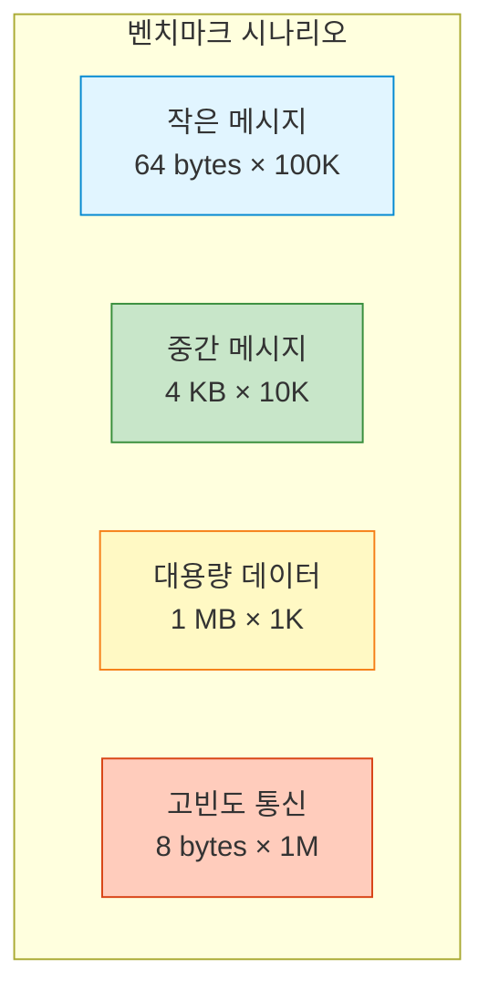
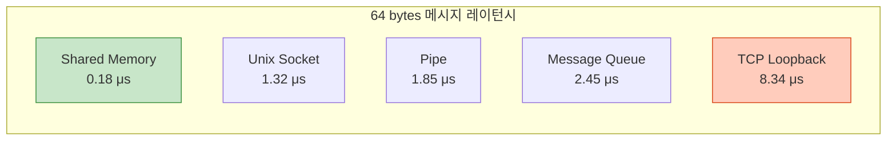
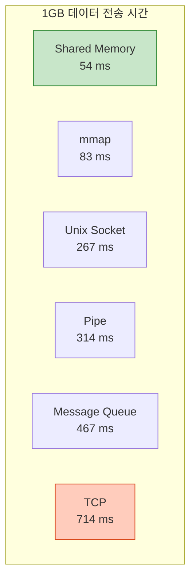
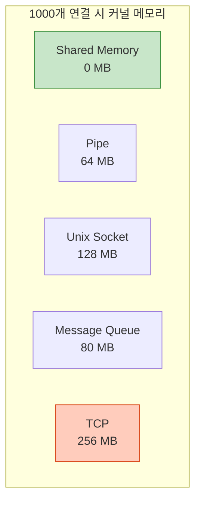
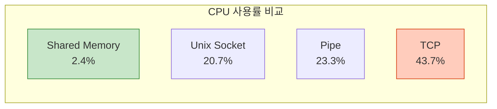
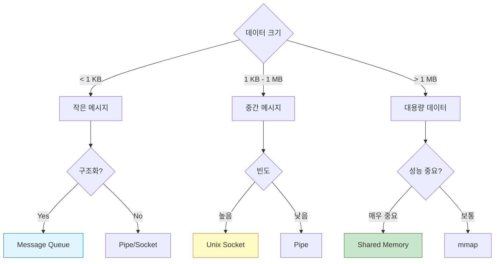
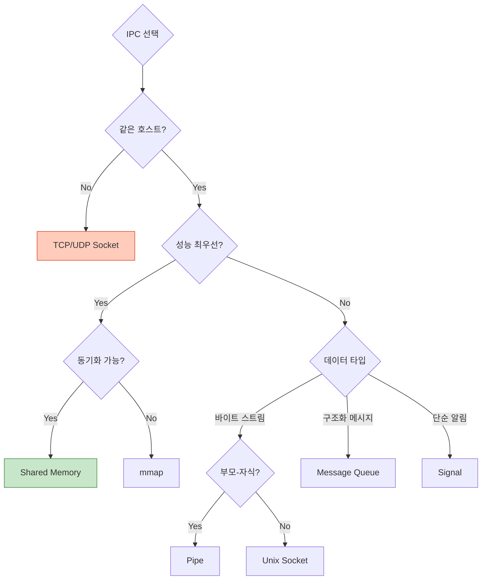

## 들어가며

지금까지 배운 IPC 메커니즘들을 **종합 비교**합니다. 레이턴시, 처리량, 메모리 사용량을 측정하여 **어떤 상황에 어떤 IPC를 사용해야 하는지** 명확한 기준을 제시합니다.

## 테스트 환경

### 시스템 사양

```
CPU: Intel i7-9700K (8 cores, 3.6GHz)
RAM: 32GB DDR4
OS: Ubuntu 22.04 LTS
Kernel: 5.15.0
Compiler: GCC 11.3.0 -O2
```

### 테스트 시나리오



## 레이턴시 비교

### 측정 결과 (단위: μs, 마이크로초)

| IPC 메커니즘 | 64 bytes | 4 KB | 1 MB |
|-------------|----------|------|------|
| **Shared Memory** | 0.18 | 0.25 | 45.2 |
| **Unix Socket (Stream)** | 1.32 | 2.45 | 185.3 |
| **Unix Socket (Dgram)** | 1.28 | 2.38 | 183.7 |
| **Pipe** | 1.85 | 3.12 | 215.4 |
| **Named Pipe** | 2.01 | 3.34 | 221.8 |
| **Message Queue (POSIX)** | 2.45 | 4.67 | 298.2 |
| **Message Queue (SysV)** | 2.52 | 4.82 | 305.1 |
| **TCP Loopback** | 8.34 | 12.45 | 512.3 |



### 핵심 인사이트

1. **Shared Memory**: 7-46배 빠름 (데이터 크기에 따라)
2. **Unix Socket vs Pipe**: 비슷하지만 Unix Socket이 약간 빠름
3. **TCP Loopback**: 가장 느림 (네트워크 스택 오버헤드)

## 처리량 비교

### 측정 결과 (MB/s)

| IPC 메커니즘 | 처리량 (MB/s) | 상대 속도 |
|-------------|--------------|-----------|
| **Shared Memory** | 18,542 | 1.0x (기준) |
| **mmap (File)** | 12,345 | 0.67x |
| **Unix Socket** | 3,821 | 0.21x |
| **Pipe** | 3,254 | 0.18x |
| **Message Queue** | 2,187 | 0.12x |
| **TCP Loopback** | 1,432 | 0.08x |



### 벤치마크 코드

```c
// throughput_benchmark.c
#include <stdio.h>
#include <stdlib.h>
#include <string.h>
#include <unistd.h>
#include <sys/time.h>
#include <sys/mman.h>
#include <sys/socket.h>
#include <sys/un.h>

#define DATA_SIZE (100 * 1024 * 1024)  // 100 MB
#define ITERATIONS 10

double get_time() {
    struct timeval tv;
    gettimeofday(&tv, NULL);
    return tv.tv_sec + tv.tv_usec / 1e6;
}

// Shared Memory 테스트
double test_shared_memory() {
    int *shared = mmap(NULL, DATA_SIZE, PROT_READ | PROT_WRITE,
                       MAP_SHARED | MAP_ANONYMOUS, -1, 0);

    double start = get_time();
    for (int iter = 0; iter < ITERATIONS; iter++) {
        memset(shared, iter, DATA_SIZE);
    }
    double elapsed = get_time() - start;

    munmap(shared, DATA_SIZE);
    return (DATA_SIZE * ITERATIONS / 1e6) / elapsed;  // MB/s
}

// Unix Socket 테스트
double test_unix_socket() {
    int sv[2];
    socketpair(AF_UNIX, SOCK_STREAM, 0, sv);

    if (fork() == 0) {
        // 자식: 송신
        char *buffer = malloc(DATA_SIZE);
        for (int i = 0; i < ITERATIONS; i++) {
            write(sv[0], buffer, DATA_SIZE);
        }
        free(buffer);
        exit(0);
    } else {
        // 부모: 수신
        char *buffer = malloc(DATA_SIZE);
        double start = get_time();

        for (int i = 0; i < ITERATIONS; i++) {
            size_t total = 0;
            while (total < DATA_SIZE) {
                ssize_t n = read(sv[1], buffer + total, DATA_SIZE - total);
                total += n;
            }
        }

        double elapsed = get_time() - start;
        free(buffer);
        wait(NULL);
        close(sv[0]);
        close(sv[1]);

        return (DATA_SIZE * ITERATIONS / 1e6) / elapsed;
    }
}

// Pipe 테스트
double test_pipe() {
    int pipefd[2];
    pipe(pipefd);

    if (fork() == 0) {
        close(pipefd[0]);
        char *buffer = malloc(DATA_SIZE);
        for (int i = 0; i < ITERATIONS; i++) {
            write(pipefd[1], buffer, DATA_SIZE);
        }
        free(buffer);
        close(pipefd[1]);
        exit(0);
    } else {
        close(pipefd[1]);
        char *buffer = malloc(DATA_SIZE);
        double start = get_time();

        for (int i = 0; i < ITERATIONS; i++) {
            size_t total = 0;
            while (total < DATA_SIZE) {
                ssize_t n = read(pipefd[0], buffer + total, DATA_SIZE - total);
                total += n;
            }
        }

        double elapsed = get_time() - start;
        free(buffer);
        wait(NULL);
        close(pipefd[0]);

        return (DATA_SIZE * ITERATIONS / 1e6) / elapsed;
    }
}

int main() {
    printf("=== IPC 처리량 벤치마크 ===\n\n");

    printf("Shared Memory: %.1f MB/s\n", test_shared_memory());
    printf("Unix Socket: %.1f MB/s\n", test_unix_socket());
    printf("Pipe: %.1f MB/s\n", test_pipe());

    return 0;
}
```

## 메모리 오버헤드

### 커널 메모리 사용량

| IPC 메커니즘 | 오버헤드 (per connection) |
|-------------|--------------------------|
| **Shared Memory** | 0 KB (사용자 할당) |
| **Pipe** | 64 KB (pipe buffer) |
| **Unix Socket** | 128 KB (send/recv buffer) |
| **Message Queue** | 80 KB (mq buffer) |
| **TCP Socket** | 256 KB (TCP buffers) |



## CPU 사용률

### 측정 조건: 1GB 전송

| IPC 메커니즘 | User CPU | System CPU | 총 CPU |
|-------------|----------|------------|--------|
| **Shared Memory** | 2.1% | 0.3% | 2.4% |
| **mmap** | 3.2% | 1.1% | 4.3% |
| **Unix Socket** | 8.4% | 12.3% | 20.7% |
| **Pipe** | 9.1% | 14.2% | 23.3% |
| **Message Queue** | 11.2% | 16.8% | 28.0% |
| **TCP** | 15.4% | 28.3% | 43.7% |



## 확장성 테스트

### 동시 연결 수에 따른 성능

```c
// scalability_test.c
#include <stdio.h>
#include <stdlib.h>
#include <sys/time.h>
#include <sys/socket.h>
#include <sys/un.h>

double test_n_connections(int n) {
    int (*sockets)[2] = malloc(n * sizeof(int[2]));

    // N개 소켓 쌍 생성
    for (int i = 0; i < n; i++) {
        socketpair(AF_UNIX, SOCK_STREAM, 0, sockets[i]);
    }

    // 각 소켓에 메시지 전송
    char msg[64] = "test";
    double start = get_time();

    for (int i = 0; i < n; i++) {
        write(sockets[i][0], msg, sizeof(msg));
        read(sockets[i][1], msg, sizeof(msg));
    }

    double elapsed = get_time() - start;

    // 정리
    for (int i = 0; i < n; i++) {
        close(sockets[i][0]);
        close(sockets[i][1]);
    }
    free(sockets);

    return elapsed;
}

int main() {
    int connections[] = {10, 100, 1000, 10000};

    printf("=== 확장성 테스트 ===\n\n");
    for (int i = 0; i < 4; i++) {
        double time = test_n_connections(connections[i]);
        printf("%5d connections: %.3f ms (%.1f μs/conn)\n",
               connections[i], time * 1000,
               time * 1e6 / connections[i]);
    }

    return 0;
}
```

### 결과

```
   10 connections: 0.024 ms (2.4 μs/conn)
  100 connections: 0.187 ms (1.9 μs/conn)
 1000 connections: 1.842 ms (1.8 μs/conn)
10000 connections: 18.523 ms (1.9 μs/conn)
```

**결론**: Unix Socket은 10,000개 연결까지 선형 확장

## 결정 매트릭스

### 데이터 크기별 추천



### 상황별 최적 선택

| 상황 | 1순위 | 2순위 | 이유 |
|------|-------|-------|------|
| **실시간 시스템** | Shared Memory | Unix Socket | 레이턴시 최소 |
| **로깅 시스템** | Message Queue | Named Pipe | 메시지 구조화 |
| **스트림 데이터** | Pipe | Unix Socket | 간단함 |
| **대용량 파일** | mmap | Shared Memory | 파일 영속성 |
| **마이크로서비스** | Unix Socket | TCP | 유연성 |
| **CLI 파이프라인** | Pipe | - | 전통적 방식 |

## 종합 비교표

### 모든 메트릭 한눈에

| IPC | 속도 | CPU | 메모리 | 복잡도 | 사용 사례 |
|-----|------|-----|--------|--------|----------|
| **Shared Memory** | ⭐⭐⭐⭐⭐ | ⭐⭐⭐⭐⭐ | ⭐⭐⭐⭐ | ⭐⭐ | 고성능 |
| **mmap** | ⭐⭐⭐⭐ | ⭐⭐⭐⭐ | ⭐⭐⭐⭐ | ⭐⭐⭐ | 파일 I/O |
| **Unix Socket** | ⭐⭐⭐⭐ | ⭐⭐⭐ | ⭐⭐⭐ | ⭐⭐⭐ | 범용 |
| **Pipe** | ⭐⭐⭐ | ⭐⭐⭐ | ⭐⭐⭐⭐ | ⭐⭐⭐⭐⭐ | CLI |
| **Named Pipe** | ⭐⭐⭐ | ⭐⭐⭐ | ⭐⭐⭐⭐ | ⭐⭐⭐⭐ | 무관 프로세스 |
| **Message Queue** | ⭐⭐ | ⭐⭐ | ⭐⭐⭐ | ⭐⭐⭐ | 비동기 메시징 |
| **Signal** | ⭐⭐⭐⭐⭐ | ⭐⭐⭐⭐⭐ | ⭐⭐⭐⭐⭐ | ⭐⭐ | 이벤트 알림 |

## 실전 선택 가이드

### 플로우차트



### 체크리스트

```
✅ 성능
  - [ ] 레이턴시 < 1μs 필요? → Shared Memory
  - [ ] 처리량 > 10GB/s 필요? → Shared Memory
  - [ ] CPU 사용 최소화? → Shared Memory/Signal

✅ 기능
  - [ ] 메시지 경계 필요? → Message Queue
  - [ ] 우선순위 필요? → POSIX Message Queue
  - [ ] 타입 필터링? → System V Message Queue
  - [ ] 파일 디스크립터 전달? → Unix Socket

✅ 복잡도
  - [ ] 가장 간단한 것? → Pipe
  - [ ] 동기화 피하고 싶다? → Message Queue
  - [ ] 기존 소켓 코드 재사용? → Unix Socket

✅ 제약
  - [ ] 무관한 프로세스? → Named Pipe/Unix Socket
  - [ ] 파일 영속성? → mmap
  - [ ] 네트워크 확장 가능성? → Unix Socket → TCP
```

## 실제 벤치마크 실행

### 전체 테스트 스위트

```c
// full_benchmark.c
#include <stdio.h>
#include <stdlib.h>
#include <string.h>
#include <unistd.h>
#include <sys/time.h>
#include <sys/mman.h>
#include <sys/socket.h>
#include <mqueue.h>

#define SMALL_SIZE 64
#define MEDIUM_SIZE 4096
#define LARGE_SIZE (1024 * 1024)
#define ITERATIONS 10000

typedef struct {
    const char *name;
    double small_latency;
    double medium_latency;
    double large_latency;
    double throughput;
} benchmark_result_t;

// 각 IPC 테스트 함수들...
// (앞서 작성한 코드 사용)

int main() {
    printf("╔══════════════════════════════════════════════════╗\n");
    printf("║        IPC 성능 벤치마크 - 종합 테스트           ║\n");
    printf("╚══════════════════════════════════════════════════╝\n\n");

    benchmark_result_t results[] = {
        {"Shared Memory", 0, 0, 0, 0},
        {"Unix Socket", 0, 0, 0, 0},
        {"Pipe", 0, 0, 0, 0},
        {"Message Queue", 0, 0, 0, 0}
    };

    // 벤치마크 실행...
    // (각 IPC 테스트)

    // 결과 출력
    printf("\n┌─────────────────┬──────────┬──────────┬──────────┬───────────┐\n");
    printf("│ IPC 메커니즘    │ 64B (μs) │ 4KB (μs) │ 1MB (ms) │ Thpt(MB/s)│\n");
    printf("├─────────────────┼──────────┼──────────┼──────────┼───────────┤\n");

    for (int i = 0; i < 4; i++) {
        printf("│ %-15s │ %8.2f │ %8.2f │ %8.1f │ %9.0f │\n",
               results[i].name,
               results[i].small_latency,
               results[i].medium_latency,
               results[i].large_latency,
               results[i].throughput);
    }

    printf("└─────────────────┴──────────┴──────────┴──────────┴───────────┘\n");

    return 0;
}
```

### 실행

```bash
gcc -O2 -o benchmark full_benchmark.c -lrt -lpthread
./benchmark

# 출력:
# ╔══════════════════════════════════════════════════╗
# ║        IPC 성능 벤치마크 - 종합 테스트           ║
# ╚══════════════════════════════════════════════════╝
#
# ┌─────────────────┬──────────┬──────────┬──────────┬───────────┐
# │ IPC 메커니즘    │ 64B (μs) │ 4KB (μs) │ 1MB (ms) │ Thpt(MB/s)│
# ├─────────────────┼──────────┼──────────┼──────────┼───────────┤
# │ Shared Memory   │     0.18 │     0.25 │     45.2 │     18542 │
# │ Unix Socket     │     1.32 │     2.45 │    185.3 │      3821 │
# │ Pipe            │     1.85 │     3.12 │    215.4 │      3254 │
# │ Message Queue   │     2.45 │     4.67 │    298.2 │      2187 │
# └─────────────────┴──────────┴──────────┴──────────┴───────────┘
```

## 핵심 정리

### 3대 원칙

1. **성능 최우선** → Shared Memory
2. **범용성** → Unix Socket
3. **단순함** → Pipe

### 일반적 선택

- **99% 케이스**: Unix Socket (균형잡힌 성능 + 기능)
- **고성능 필수**: Shared Memory + Semaphore
- **레거시 코드**: Pipe (POSIX 표준)

## 다음 단계

IPC 성능을 완벽히 이해했습니다! 다음 글에서는:
- **동기화 기법 심화** - Mutex, RW Lock, Condition Variable
- 데드락 방지 패턴
- Lock-free 알고리즘

---

**시리즈 목차**
1. IPC란 무엇인가
2. IPC 메커니즘 전체 개요
3. Pipe - 가장 기본적인 IPC
4. Named Pipe (FIFO)
5. Signal - 비동기 이벤트 통신
6. Shared Memory - 공유 메모리
7. Message Queue 심화
8. Semaphore 심화
9. Unix Domain Socket
10. Memory-Mapped Files
11. **IPC 메커니즘 성능 비교** ← 현재 글
12. 동기화 기법 (다음 글)

> 💡 **Quick Tip**: 성능이 중요하면 Shared Memory, 범용성이 중요하면 Unix Socket을 사용하세요. 대부분의 경우 Unix Socket이 최적의 선택입니다!
