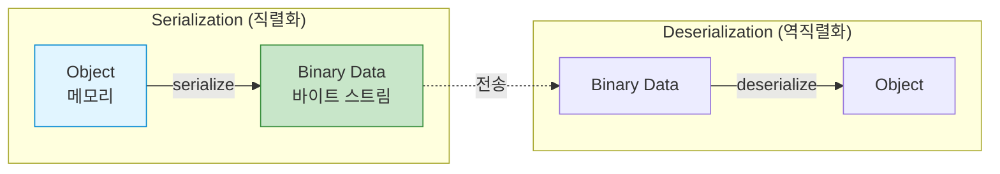
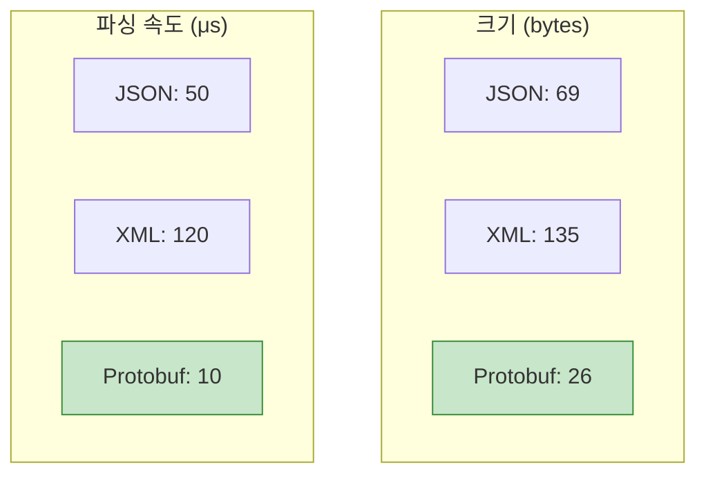
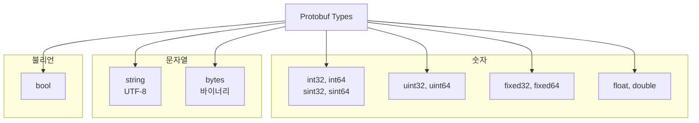
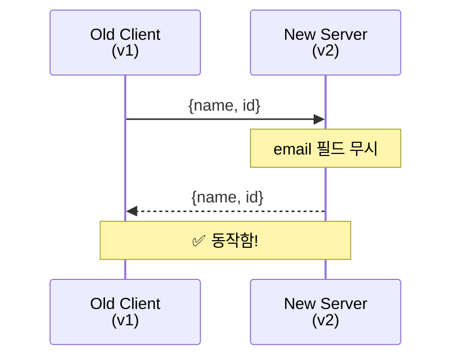
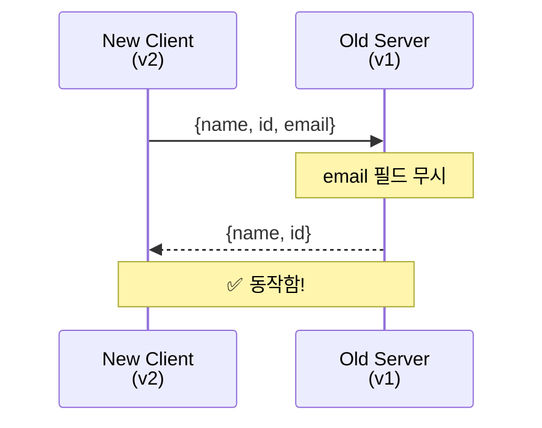

## 들어가며

데이터를 주고받을 때 어떤 포맷을 사용하나요? JSON? XML? **Protocol Buffers**(Protobuf)는 Google이 만든 바이너리 직렬화 포맷으로, 훨씬 빠르고 작습니다.

## Protocol Buffers란?

### 정의

**Protocol Buffers**는 **구조화된 데이터의 직렬화/역직렬화** 메커니즘입니다.



### 핵심 특징

1. **바이너리 포맷**: JSON보다 3-10배 작음
2. **스키마 기반**: `.proto` 파일로 정의
3. **강타입**: 컴파일 시점 검증
4. **언어 중립**: 40+ 언어 지원
5. **버전 호환**: 하위 호환성 보장

## JSON vs Protobuf 비교

### 데이터 예시

```json
// JSON (69 bytes)
{
  "name": "John Doe",
  "id": 1234,
  "email": "john@example.com"
}
```

```protobuf
// Protobuf (26 bytes)
// 바이너리이므로 사람이 읽을 수 없음
// 하지만 크기가 62% 감소!
```

### 성능 비교



### 비교표

| 항목 | JSON | XML | Protobuf |
|------|------|-----|----------|
| **크기** | 중간 | 큼 | 작음 |
| **속도** | 느림 | 매우 느림 | 빠름 |
| **가독성** | ✅ 사람이 읽기 쉬움 | ✅ 사람이 읽기 쉬움 | ❌ 바이너리 |
| **스키마** | ❌ 선택적 | ❌ 선택적 | ✅ 필수 |
| **타입 안정성** | ❌ 약함 | ❌ 약함 | ✅ 강함 |
| **사용 사례** | Web API | 레거시 시스템 | 고성능 RPC |

## Hello Protocol Buffers

### 1. .proto 파일 작성

```protobuf
// person.proto
syntax = "proto3";

message Person {
  string name = 1;
  int32 id = 2;
  string email = 3;
}
```

### 2. 컴파일

```bash
# protoc 설치
sudo apt install protobuf-compiler  # Ubuntu
brew install protobuf                # macOS

# .proto → C++ 코드 생성
protoc --cpp_out=. person.proto

# 생성된 파일:
# person.pb.h
# person.pb.cc
```

### 3. C++ 코드에서 사용

**쓰기 (Serialization)**:

```cpp
// write_person.cpp
#include <iostream>
#include <fstream>
#include "person.pb.h"

int main() {
    Person person;
    person.set_name("John Doe");
    person.set_id(1234);
    person.set_email("john@example.com");

    // 파일에 저장
    std::fstream output("person.bin", std::ios::out | std::ios::binary);
    person.SerializeToOstream(&output);
    output.close();

    std::cout << "직렬화 완료!" << std::endl;

    return 0;
}
```

**읽기 (Deserialization)**:

```cpp
// read_person.cpp
#include <iostream>
#include <fstream>
#include "person.pb.h"

int main() {
    Person person;

    // 파일에서 읽기
    std::fstream input("person.bin", std::ios::in | std::ios::binary);
    person.ParseFromIstream(&input);
    input.close();

    std::cout << "이름: " << person.name() << std::endl;
    std::cout << "ID: " << person.id() << std::endl;
    std::cout << "이메일: " << person.email() << std::endl;

    return 0;
}
```

### 4. 컴파일 및 실행

```bash
# 컴파일
g++ write_person.cpp person.pb.cc -o write_person -lprotobuf
g++ read_person.cpp person.pb.cc -o read_person -lprotobuf

# 실행
./write_person
# 출력: 직렬화 완료!

./read_person
# 출력:
# 이름: John Doe
# ID: 1234
# 이메일: john@example.com
```

## Proto3 기본 타입



### 예제

```protobuf
syntax = "proto3";

message DataTypes {
  int32 age = 1;
  int64 timestamp = 2;
  float price = 3;
  double coordinate = 4;
  string name = 5;
  bytes avatar = 6;
  bool is_active = 7;
}
```

## 복합 타입

### 1. Enum

```protobuf
enum Status {
  UNKNOWN = 0;  // 반드시 0부터 시작
  PENDING = 1;
  APPROVED = 2;
  REJECTED = 3;
}

message Order {
  string id = 1;
  Status status = 2;
}
```

### 2. Repeated (배열)

```protobuf
message ShoppingCart {
  repeated string items = 1;  // string[]
  repeated int32 quantities = 2;  // int[]
}
```

**사용**:

```cpp
ShoppingCart cart;
cart.add_items("Apple");
cart.add_items("Banana");
cart.add_quantities(2);
cart.add_quantities(3);

for (int i = 0; i < cart.items_size(); i++) {
    std::cout << cart.items(i) << ": " << cart.quantities(i) << std::endl;
}
```

### 3. Map

```protobuf
message User {
  string name = 1;
  map<string, string> metadata = 2;  // key-value
}
```

**사용**:

```cpp
User user;
user.set_name("Alice");
(*user.mutable_metadata())["city"] = "Seoul";
(*user.mutable_metadata())["country"] = "Korea";
```

### 4. Nested Messages

```protobuf
message Address {
  string street = 1;
  string city = 2;
}

message Person {
  string name = 1;
  Address address = 2;  // 중첩
}
```

## 필드 번호의 중요성

```protobuf
message Person {
  string name = 1;  // ← 필드 번호
  int32 id = 2;
  string email = 3;
}
```

### 규칙

1. **1-15**: 1바이트 인코딩 (자주 사용하는 필드)
2. **16-2047**: 2바이트 인코딩
3. **변경 금지**: 한 번 할당하면 절대 변경 불가
4. **건너뛰기 가능**: 1, 2, 5, 10... OK

### 잘못된 예

```protobuf
// ❌ 위험: 필드 번호 재사용
message Person {
  string name = 1;
  // int32 age = 2;  // 삭제됨
  string email = 2;  // 🔥 2번 재사용 - 호환성 깨짐!
}
```

### 올바른 예

```protobuf
// ✅ 안전: reserved 사용
message Person {
  reserved 2, 15, 9 to 11;  // 예약
  reserved "age", "old_field";

  string name = 1;
  string email = 3;
}
```

## 버전 호환성

### Backward Compatibility (하위 호환)



### Forward Compatibility (상위 호환)



### 호환성 유지 규칙

1. **필드 추가**: 항상 안전
2. **필드 삭제**: `reserved` 사용
3. **필드 번호 변경**: ❌ 절대 금지
4. **타입 변경**: 일부 가능 (int32 ↔ int64)

## 다음 단계

Protocol Buffers의 기본을 이해했습니다! 다음 글에서는:
- **고급 스키마 설계**
- Oneof, Any, Well-Known Types
- Best Practices

---

**시리즈 목차**
1. **Protocol Buffers란 무엇인가 - 구글의 직렬화 포맷** ← 현재 글
2. Protocol Buffers 고급 스키마 설계 (다음 글)
3. gRPC와 Protobuf - 고성능 RPC
4. Protobuf 실전 활용 - 마이크로서비스
5. Protobuf 성능 최적화 및 Best Practices

> 💡 **Quick Tip**: Protobuf의 가장 큰 장점은 스키마 진화(Schema Evolution)입니다. 필드를 추가/삭제해도 기존 코드가 깨지지 않습니다!
