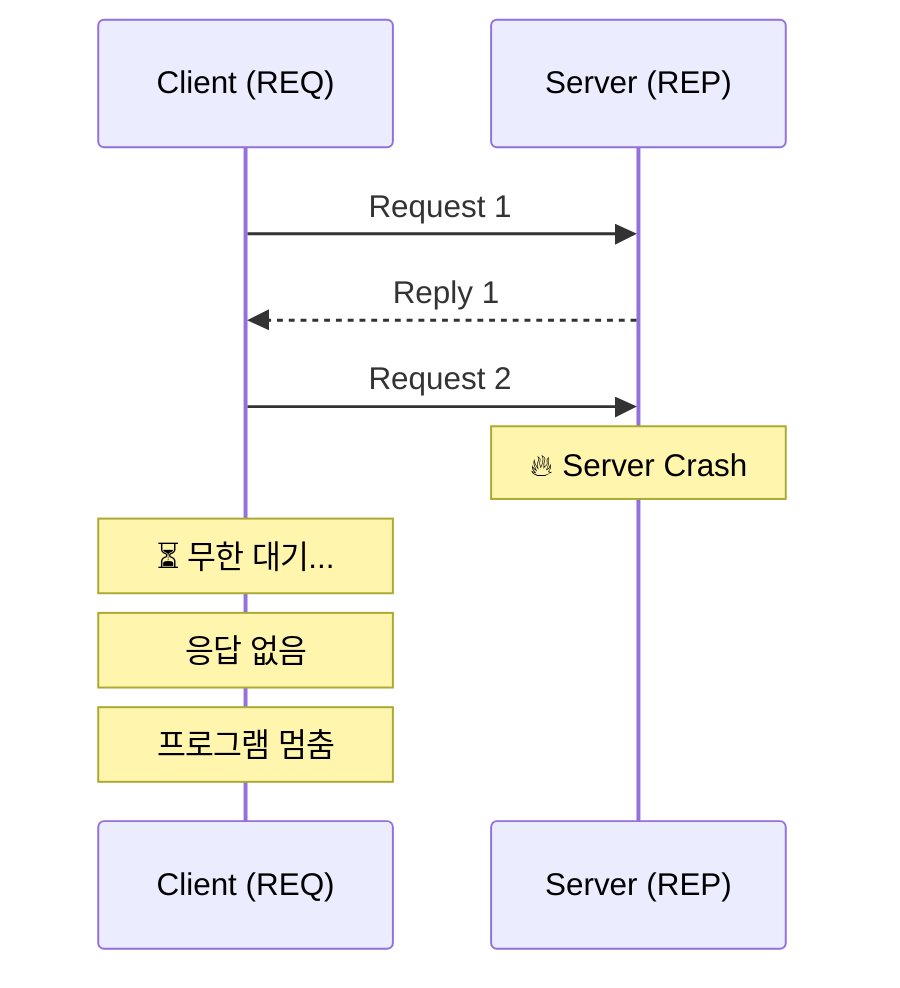
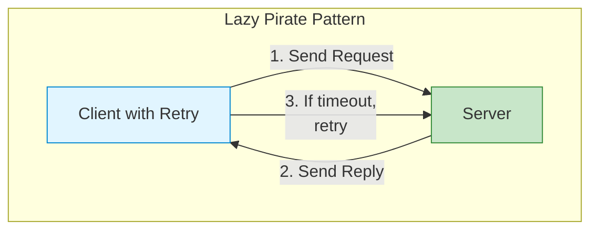
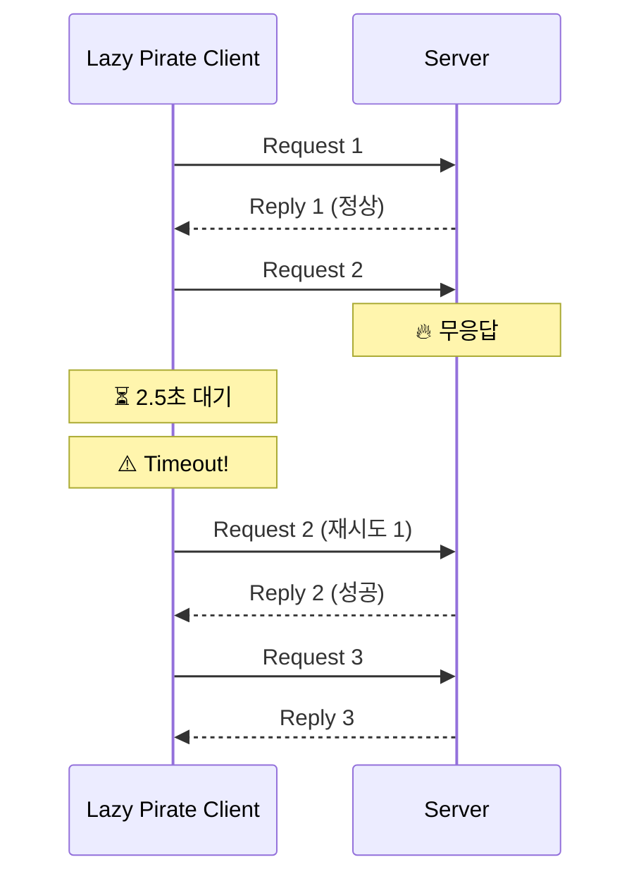
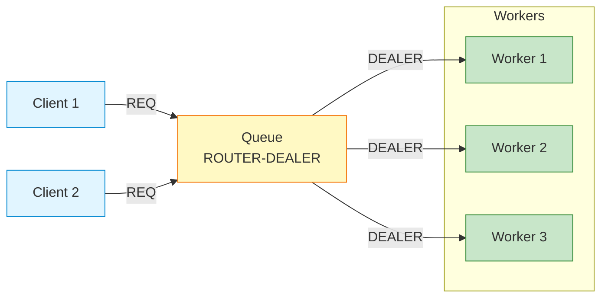
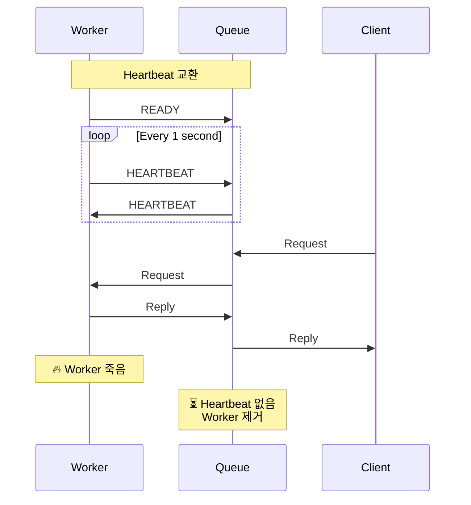
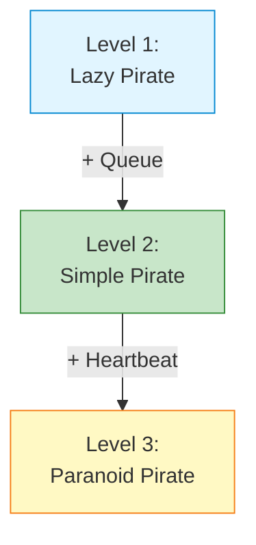
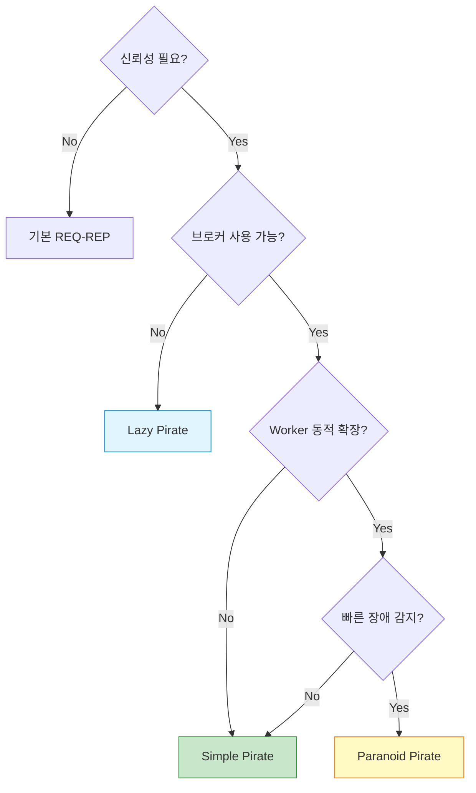

## 들어가며

분산 시스템에서 **신뢰성**은 필수입니다. 네트워크는 끊기고, 서버는 죽고, 클라이언트는 멈춥니다. ZeroMQ의 **Pirate 패턴**들은 이러한 문제를 우아하게 해결합니다.

## 신뢰성 문제

### 기본 REQ-REP의 한계



**문제점**:
- 서버가 죽으면 클라이언트는 **영원히 대기**
- 네트워크 끊김에 대한 **복구 불가**
- **타임아웃 없음**

## 1. Lazy Pirate 패턴

### 개념

**Lazy Pirate**는 **클라이언트 측 신뢰성** 패턴입니다. 간단한 재시도 로직을 추가합니다.



### 특징

- **타임아웃 설정**: 일정 시간 후 재시도
- **재시도 횟수 제한**: 무한 루프 방지
- **서버 변경 없음**: 기존 REP 서버 그대로 사용

### C 구현

**Client (Lazy Pirate)**:

```c
// lazy_pirate_client.c
#include <zmq.h>
#include <stdio.h>
#include <string.h>
#include <unistd.h>

#define REQUEST_TIMEOUT  2500    // 2.5초
#define REQUEST_RETRIES  3       // 최대 3번 재시도

static char *s_recv(void *socket) {
    static char buffer[256];
    int size = zmq_recv(socket, buffer, 255, 0);
    if (size == -1)
        return NULL;
    buffer[size] = '\0';
    return buffer;
}

int main() {
    void *context = zmq_ctx_new();

    printf("Lazy Pirate Client 시작...\n");

    void *client = zmq_socket(context, ZMQ_REQ);
    zmq_connect(client, "tcp://localhost:5555");

    // 타임아웃 설정
    int timeout = REQUEST_TIMEOUT;
    zmq_setsockopt(client, ZMQ_RCVTIMEO, &timeout, sizeof(timeout));

    int sequence = 0;
    int retries_left = REQUEST_RETRIES;

    while (retries_left) {
        sequence++;
        char request[20];
        sprintf(request, "%d", sequence);

        printf("[%d] 요청 전송...\n", sequence);
        zmq_send(client, request, strlen(request), 0);

        // 응답 대기
        while (1) {
            char *reply = s_recv(client);

            if (reply) {
                printf("[%d] 응답 받음: %s\n", sequence, reply);
                retries_left = REQUEST_RETRIES;
                break;
            } else {
                retries_left--;

                if (retries_left == 0) {
                    printf("❌ 서버 응답 없음, 포기\n");
                    break;
                }

                printf("⚠️  응답 없음, 재시도 중... (%d번 남음)\n", retries_left);

                // 소켓 재생성 (REQ 상태 리셋)
                zmq_close(client);
                client = zmq_socket(context, ZMQ_REQ);
                zmq_connect(client, "tcp://localhost:5555");
                zmq_setsockopt(client, ZMQ_RCVTIMEO, &timeout, sizeof(timeout));

                // 재전송
                zmq_send(client, request, strlen(request), 0);
            }
        }
    }

    zmq_close(client);
    zmq_ctx_destroy(context);
    return 0;
}
```

**Server (일반 REP)**:

```c
// lazy_pirate_server.c
#include <zmq.h>
#include <stdio.h>
#include <stdlib.h>
#include <unistd.h>

int main() {
    void *context = zmq_ctx_new();
    void *server = zmq_socket(context, ZMQ_REP);
    zmq_bind(server, "tcp://*:5555");

    printf("Server 시작 (가끔 죽는 척 합니다)\n");

    int cycles = 0;
    while (1) {
        char buffer[256];
        int size = zmq_recv(server, buffer, 255, 0);
        buffer[size] = '\0';

        cycles++;

        // 3번째 요청마다 무시 (크래시 시뮬레이션)
        if (cycles > 3 && rand() % 3 == 0) {
            printf("🔥 Simulating crash (요청 무시)\n");
            sleep(5);
            continue;
        }

        printf("처리: %s\n", buffer);
        sleep(1);

        zmq_send(server, buffer, size, 0);
    }

    zmq_close(server);
    zmq_ctx_destroy(context);
    return 0;
}
```

### 동작 과정



### 장단점

| 장점 | 단점 |
|------|------|
| ✅ 구현 간단 | ❌ 서버 변경 불가 |
| ✅ 클라이언트만 수정 | ❌ 네트워크 오버헤드 |
| ✅ 즉시 적용 가능 | ❌ 서버 과부하 가능 |

## 2. Simple Pirate 패턴

### 개념

**Simple Pirate**는 **큐 기반 신뢰성** 패턴입니다. 중간에 브로커를 추가합니다.



### 특징

- **LRU Queue**: Least Recently Used 로드 밸런싱
- **Worker 추가/제거 가능**: 동적 확장
- **장애 격리**: Worker 하나가 죽어도 다른 Worker가 처리

### Python 구현

**Queue Broker**:

```python
# simple_pirate_queue.py
import zmq

def main():
    context = zmq.Context()

    # Client facing socket
    frontend = context.socket(zmq.ROUTER)
    frontend.bind("tcp://*:5555")

    # Worker facing socket
    backend = context.socket(zmq.DEALER)
    backend.bind("tcp://*:5556")

    print("Simple Pirate Queue 시작...")

    # Simple proxy
    zmq.proxy(frontend, backend)

    frontend.close()
    backend.close()
    context.term()

if __name__ == "__main__":
    main()
```

**Worker**:

```python
# simple_pirate_worker.py
import zmq
import time
import random

def main():
    context = zmq.Context()
    worker = context.socket(zmq.REP)
    worker.connect("tcp://localhost:5556")

    worker_id = random.randint(1000, 9999)
    print(f"Worker {worker_id} 시작")

    while True:
        message = worker.recv_string()
        print(f"Worker {worker_id}: {message} 처리 중...")

        # 가끔 크래시 시뮬레이션
        if random.random() < 0.1:
            print(f"🔥 Worker {worker_id} crashed!")
            break

        time.sleep(1)
        worker.send_string(f"Worker {worker_id}: {message}")

    worker.close()
    context.term()

if __name__ == "__main__":
    main()
```

**Client**:

```python
# simple_pirate_client.py
import zmq

def main():
    context = zmq.Context()
    client = context.socket(zmq.REQ)
    client.connect("tcp://localhost:5555")

    # Timeout 설정
    client.setsockopt(zmq.RCVTIMEO, 2500)

    for i in range(10):
        request = f"Request {i}"
        print(f"전송: {request}")

        client.send_string(request)

        try:
            reply = client.recv_string()
            print(f"수신: {reply}")
        except zmq.Again:
            print("⚠️ Timeout, 재시도...")
            # 소켓 재생성
            client.close()
            client = context.socket(zmq.REQ)
            client.connect("tcp://localhost:5555")
            client.setsockopt(zmq.RCVTIMEO, 2500)

    client.close()
    context.term()

if __name__ == "__main__":
    main()
```

## 3. Paranoid Pirate 패턴

### 개념

**Paranoid Pirate**는 **하트비트 기반 신뢰성** 패턴입니다. Worker의 생존 여부를 확인합니다.



### 특징

- **능동적 모니터링**: 주기적 하트비트
- **빠른 장애 감지**: Worker 죽음을 즉시 감지
- **자동 복구**: 죽은 Worker를 큐에서 제거

### C 구현 (간소화 버전)

**Worker with Heartbeat**:

```c
// paranoid_pirate_worker.c
#include <zmq.h>
#include <stdio.h>
#include <string.h>
#include <unistd.h>

#define HEARTBEAT_INTERVAL  1000  // 1초
#define HEARTBEAT_LIVENESS  3     // 3번 실패하면 죽은 것으로 간주

static void s_send(void *socket, const char *string) {
    zmq_send(socket, string, strlen(string), 0);
}

int main() {
    void *context = zmq_ctx_new();
    void *worker = zmq_socket(context, ZMQ_DEALER);

    // Worker ID 설정
    char identity[10];
    sprintf(identity, "%04X", rand() % 0x10000);
    zmq_setsockopt(worker, ZMQ_IDENTITY, identity, strlen(identity));

    zmq_connect(worker, "tcp://localhost:5556");

    printf("Worker [%s] 시작\n", identity);

    // READY 신호
    s_send(worker, "READY");

    uint64_t heartbeat_at = zmq_clock() + HEARTBEAT_INTERVAL;

    while (1) {
        zmq_pollitem_t items[] = {{worker, 0, ZMQ_POLLIN, 0}};
        int rc = zmq_poll(items, 1, HEARTBEAT_INTERVAL);

        if (items[0].revents & ZMQ_POLLIN) {
            char buffer[256];
            int size = zmq_recv(worker, buffer, 255, 0);
            buffer[size] = '\0';

            if (strcmp(buffer, "HEARTBEAT") == 0) {
                printf("[%s] 💓 Heartbeat 수신\n", identity);
            } else {
                printf("[%s] 작업: %s\n", identity, buffer);
                sleep(1);
                s_send(worker, buffer);
            }
        }

        // Heartbeat 전송
        if (zmq_clock() > heartbeat_at) {
            s_send(worker, "HEARTBEAT");
            printf("[%s] 💓 Heartbeat 전송\n", identity);
            heartbeat_at = zmq_clock() + HEARTBEAT_INTERVAL;
        }
    }

    zmq_close(worker);
    zmq_ctx_destroy(context);
    return 0;
}
```

**Queue with Heartbeat**:

```c
// paranoid_pirate_queue.c
#include <zmq.h>
#include <stdio.h>
#include <stdlib.h>
#include <string.h>

#define HEARTBEAT_INTERVAL  1000
#define HEARTBEAT_LIVENESS  3

typedef struct {
    char identity[256];
    uint64_t expiry;
} worker_t;

int main() {
    void *context = zmq_ctx_new();

    void *frontend = context.socket(zmq.ROUTER)
    frontend.bind("tcp://*:5555");

    void *backend = context.socket(zmq.ROUTER)
    backend.bind("tcp://*:5556");

    printf("Paranoid Pirate Queue 시작\n");

    // Worker 리스트 관리
    worker_t workers[100];
    int worker_count = 0;

    uint64_t heartbeat_at = zmq_clock() + HEARTBEAT_INTERVAL;

    while (1) {
        zmq_pollitem_t items[] = {
            {backend, 0, ZMQ_POLLIN, 0},
            {frontend, 0, ZMQ_POLLIN, 0}
        };

        zmq_poll(items, worker_count ? 2 : 1, HEARTBEAT_INTERVAL);

        // Backend (Worker) 메시지 처리
        if (items[0].revents & ZMQ_POLLIN) {
            // Worker 메시지 처리 및 하트비트 갱신
            // (구현 생략)
        }

        // Frontend (Client) 메시지 처리
        if (items[1].revents & ZMQ_POLLIN) {
            // Client 요청을 Worker에 전달
            // (구현 생략)
        }

        // Heartbeat 전송
        if (zmq_clock() > heartbeat_at) {
            // 모든 Worker에 Heartbeat 전송
            heartbeat_at = zmq_clock() + HEARTBEAT_INTERVAL;
        }

        // 죽은 Worker 제거
        // (만료된 Worker 제거 로직)
    }

    return 0;
}
```

### Python 완전 구현

**Paranoid Pirate Worker**:

```python
# paranoid_pirate_worker.py
import zmq
import time
import random

HEARTBEAT_INTERVAL = 1.0  # 1초
HEARTBEAT_LIVENESS = 3

def main():
    context = zmq.Context()
    worker = context.socket(zmq.DEALER)

    identity = f"{random.randint(1000, 9999)}"
    worker.setsockopt_string(zmq.IDENTITY, identity)
    worker.connect("tcp://localhost:5556")

    print(f"Worker {identity} 시작")

    # READY 전송
    worker.send(b"READY")

    liveness = HEARTBEAT_LIVENESS
    interval = time.time() + HEARTBEAT_INTERVAL

    poller = zmq.Poller()
    poller.register(worker, zmq.POLLIN)

    while True:
        socks = dict(poller.poll(HEARTBEAT_INTERVAL * 1000))

        if socks.get(worker) == zmq.POLLIN:
            frames = worker.recv_multipart()

            if len(frames) == 1:
                if frames[0] == b"HEARTBEAT":
                    print(f"[{identity}] 💓 Heartbeat")
                    liveness = HEARTBEAT_LIVENESS
            else:
                # 실제 작업
                print(f"[{identity}] 작업: {frames[-1]}")
                time.sleep(1)
                worker.send_multipart(frames)
                liveness = HEARTBEAT_LIVENESS

        # Heartbeat 전송
        if time.time() > interval:
            worker.send(b"HEARTBEAT")
            interval = time.time() + HEARTBEAT_INTERVAL

    worker.close()
    context.term()

if __name__ == "__main__":
    main()
```

## 패턴 비교

| 패턴 | 복잡도 | 신뢰성 | 성능 | 사용 사례 |
|------|--------|--------|------|-----------|
| **Lazy Pirate** | ⭐ 낮음 | ⭐⭐ 중간 | ⭐⭐⭐ 높음 | 간단한 클라이언트 재시도 |
| **Simple Pirate** | ⭐⭐ 중간 | ⭐⭐⭐ 높음 | ⭐⭐ 중간 | 로드 밸런싱 + 재시도 |
| **Paranoid Pirate** | ⭐⭐⭐ 높음 | ⭐⭐⭐⭐ 매우 높음 | ⭐⭐ 중간 | 미션 크리티컬 시스템 |

## 신뢰성 레벨



## 실전 적용 가이드

### 언제 어떤 패턴을 사용할까?



### 타임아웃 설정 가이드

| 시나리오 | 타임아웃 | 재시도 |
|----------|----------|--------|
| **로컬 IPC** | 100ms | 3회 |
| **LAN** | 1초 | 3회 |
| **WAN** | 5초 | 5회 |
| **인터넷** | 10초 | 3회 |

## 다음 단계

신뢰성 패턴을 마스터했습니다! 다음 글에서는:
- **로드 밸런싱** 심화
- LRU (Least Recently Used) 큐
- 동적 Worker 관리

---

**시리즈 목차**
1. ZeroMQ란 무엇인가 - 고성능 메시징 라이브러리
2. ZeroMQ 메시징 패턴 - REQ/REP, PUB/SUB, PUSH/PULL
3. ZeroMQ 고급 패턴 - ROUTER, DEALER, PROXY
4. ZeroMQ 실전 활용 - 분산 시스템 구축
5. ZeroMQ 성능 최적화 및 보안
6. **ZeroMQ 신뢰성 패턴 - Lazy Pirate, Simple Pirate, Paranoid Pirate** ← 현재 글
7. ZeroMQ 로드 밸런싱 (다음 글)

> 💡 **Quick Tip**: Lazy Pirate는 가장 간단하지만, 프로덕션 환경에서는 Paranoid Pirate를 권장합니다!
