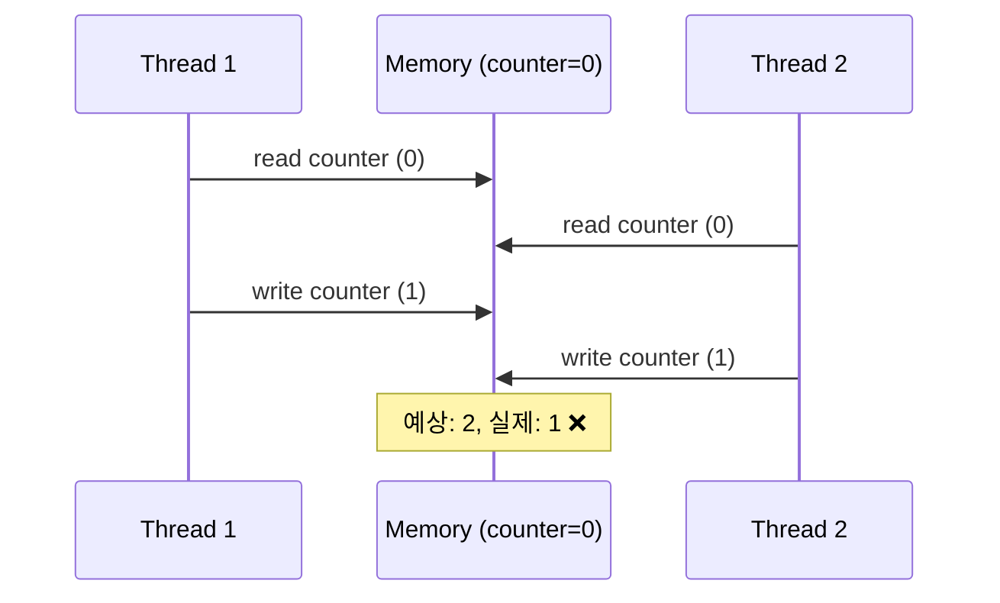
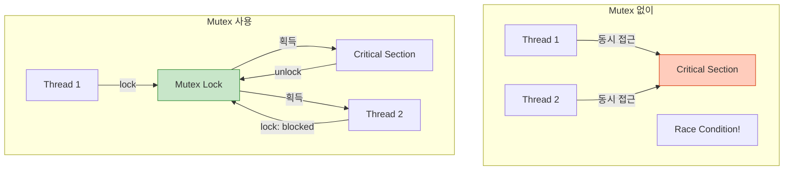
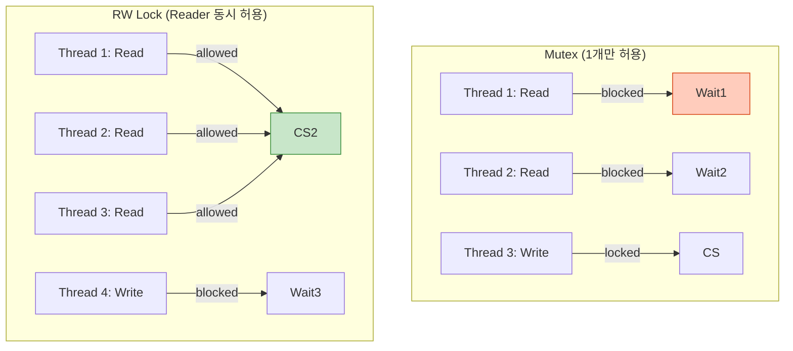
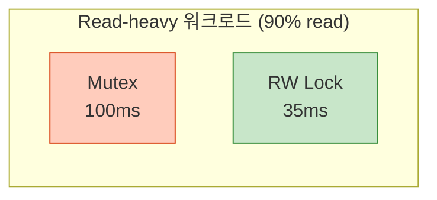
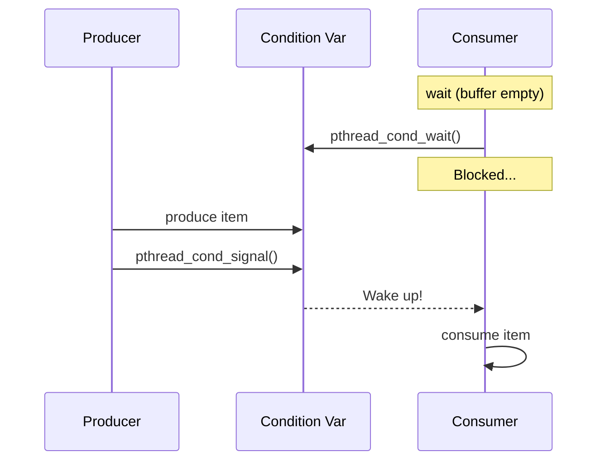
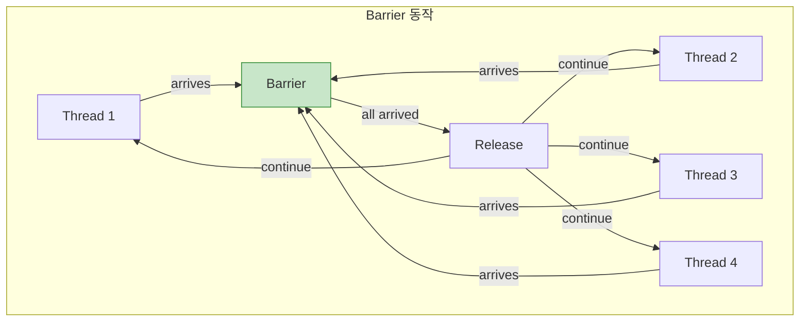
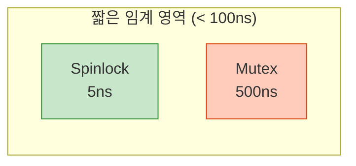
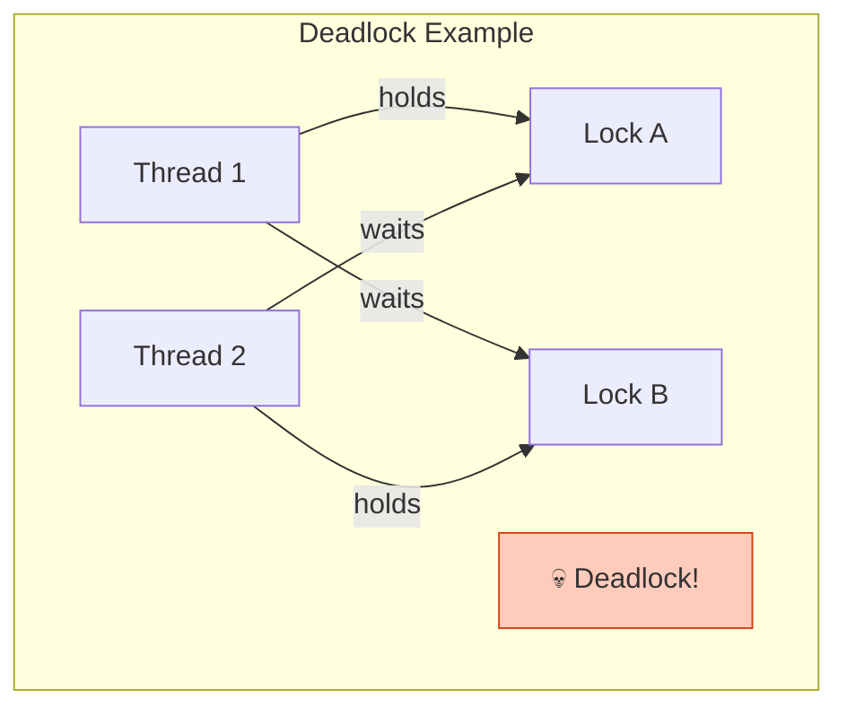

## 들어가며

**동기화(Synchronization)**는 여러 프로세스/스레드가 공유 자원에 안전하게 접근하도록 보장하는 기법입니다. 경쟁 조건, 데드락, 기아 상태를 방지하는 핵심 도구들을 배웁니다.

## 동기화가 필요한 이유

### Race Condition 예제

```c
// race_condition.c
#include <stdio.h>
#include <pthread.h>

int counter = 0;  // 공유 변수

void* increment(void* arg) {
    for (int i = 0; i < 1000000; i++) {
        counter++;  // ⚠️ Race Condition!
    }
    return NULL;
}

int main() {
    pthread_t t1, t2;

    pthread_create(&t1, NULL, increment, NULL);
    pthread_create(&t2, NULL, increment, NULL);

    pthread_join(t1, NULL);
    pthread_join(t2, NULL);

    printf("Counter: %d (예상: 2000000)\n", counter);
    // 실제 출력: 1234567 ❌ (매번 다름!)

    return 0;
}
```

### 문제 분석



## Mutex (Mutual Exclusion)

### 개념



### POSIX Mutex

```c
// mutex_example.c
#include <stdio.h>
#include <pthread.h>

int counter = 0;
pthread_mutex_t mutex = PTHREAD_MUTEX_INITIALIZER;

void* increment(void* arg) {
    for (int i = 0; i < 1000000; i++) {
        pthread_mutex_lock(&mutex);    // 잠금
        counter++;
        pthread_mutex_unlock(&mutex);  // 해제
    }
    return NULL;
}

int main() {
    pthread_t t1, t2;

    pthread_create(&t1, NULL, increment, NULL);
    pthread_create(&t2, NULL, increment, NULL);

    pthread_join(t1, NULL);
    pthread_join(t2, NULL);

    printf("Counter: %d (예상: 2000000)\n", counter);
    // 출력: 2000000 ✅

    pthread_mutex_destroy(&mutex);
    return 0;
}
```

### 프로세스 간 Mutex

```c
// process_mutex.c
#include <stdio.h>
#include <pthread.h>
#include <sys/mman.h>
#include <unistd.h>

typedef struct {
    pthread_mutex_t mutex;
    int counter;
} shared_data_t;

int main() {
    // 공유 메모리
    shared_data_t *data = mmap(NULL, sizeof(shared_data_t),
                               PROT_READ | PROT_WRITE,
                               MAP_SHARED | MAP_ANONYMOUS, -1, 0);

    // Mutex 초기화 (프로세스 간 공유)
    pthread_mutexattr_t attr;
    pthread_mutexattr_init(&attr);
    pthread_mutexattr_setpshared(&attr, PTHREAD_PROCESS_SHARED);
    pthread_mutex_init(&data->mutex, &attr);

    data->counter = 0;

    if (fork() == 0) {
        // 자식
        for (int i = 0; i < 100000; i++) {
            pthread_mutex_lock(&data->mutex);
            data->counter++;
            pthread_mutex_unlock(&data->mutex);
        }
        exit(0);
    } else {
        // 부모
        for (int i = 0; i < 100000; i++) {
            pthread_mutex_lock(&data->mutex);
            data->counter++;
            pthread_mutex_unlock(&data->mutex);
        }
        wait(NULL);

        printf("Counter: %d (예상: 200000)\n", data->counter);

        pthread_mutex_destroy(&data->mutex);
        munmap(data, sizeof(shared_data_t));
    }

    return 0;
}
```

## Read-Write Lock (RW Lock)

### 개념

**여러 Reader 동시 허용, Writer 독점**



### 예제

```c
// rwlock_example.c
#include <stdio.h>
#include <pthread.h>
#include <unistd.h>

int shared_data = 0;
pthread_rwlock_t rwlock = PTHREAD_RWLOCK_INITIALIZER;

void* reader(void* arg) {
    int id = *(int*)arg;

    for (int i = 0; i < 5; i++) {
        pthread_rwlock_rdlock(&rwlock);  // Read lock
        printf("Reader %d: data = %d\n", id, shared_data);
        usleep(100000);
        pthread_rwlock_unlock(&rwlock);
        usleep(200000);
    }

    return NULL;
}

void* writer(void* arg) {
    int id = *(int*)arg;

    for (int i = 0; i < 3; i++) {
        pthread_rwlock_wrlock(&rwlock);  // Write lock
        shared_data += 10;
        printf("Writer %d: data = %d\n", id, shared_data);
        pthread_rwlock_unlock(&rwlock);
        sleep(1);
    }

    return NULL;
}

int main() {
    pthread_t readers[3], writers[2];
    int ids[] = {1, 2, 3, 4, 5};

    // 3개 Reader
    for (int i = 0; i < 3; i++) {
        pthread_create(&readers[i], NULL, reader, &ids[i]);
    }

    // 2개 Writer
    for (int i = 0; i < 2; i++) {
        pthread_create(&writers[i], NULL, writer, &ids[i+3]);
    }

    for (int i = 0; i < 3; i++) {
        pthread_join(readers[i], NULL);
    }
    for (int i = 0; i < 2; i++) {
        pthread_join(writers[i], NULL);
    }

    pthread_rwlock_destroy(&rwlock);

    return 0;
}
```

### 출력

```
Reader 1: data = 0
Reader 2: data = 0    ← 동시 읽기
Reader 3: data = 0
Writer 1: data = 10   ← 독점 쓰기
Reader 1: data = 10
Reader 2: data = 10   ← 동시 읽기
...
```

### 성능 비교

| 워크로드 | Mutex | RW Lock | 향상 |
|---------|-------|---------|------|
| Read:Write = 9:1 | 100ms | 35ms | 2.9x |
| Read:Write = 19:1 | 100ms | 22ms | 4.5x |
| Read:Write = 99:1 | 100ms | 11ms | 9.1x |



## Condition Variable

### 개념

**조건이 만족될 때까지 대기**



### 예제

```c
// condition_variable.c
#include <stdio.h>
#include <pthread.h>
#include <unistd.h>

#define BUFFER_SIZE 5

int buffer[BUFFER_SIZE];
int count = 0;
pthread_mutex_t mutex = PTHREAD_MUTEX_INITIALIZER;
pthread_cond_t not_empty = PTHREAD_COND_INITIALIZER;
pthread_cond_t not_full = PTHREAD_COND_INITIALIZER;

void* producer(void* arg) {
    for (int i = 1; i <= 10; i++) {
        pthread_mutex_lock(&mutex);

        // 버퍼 가득 찼으면 대기
        while (count == BUFFER_SIZE) {
            printf("Producer waiting (buffer full)...\n");
            pthread_cond_wait(&not_full, &mutex);
        }

        buffer[count++] = i;
        printf("Produced: %d (count=%d)\n", i, count);

        pthread_cond_signal(&not_empty);  // Consumer 깨우기
        pthread_mutex_unlock(&mutex);

        usleep(100000);
    }

    return NULL;
}

void* consumer(void* arg) {
    for (int i = 1; i <= 10; i++) {
        pthread_mutex_lock(&mutex);

        // 버퍼 비었으면 대기
        while (count == 0) {
            printf("Consumer waiting (buffer empty)...\n");
            pthread_cond_wait(&not_empty, &mutex);
        }

        int item = buffer[--count];
        printf("Consumed: %d (count=%d)\n", item, count);

        pthread_cond_signal(&not_full);  // Producer 깨우기
        pthread_mutex_unlock(&mutex);

        usleep(200000);
    }

    return NULL;
}

int main() {
    pthread_t prod, cons;

    pthread_create(&prod, NULL, producer, NULL);
    pthread_create(&cons, NULL, consumer, NULL);

    pthread_join(prod, NULL);
    pthread_join(cons, NULL);

    pthread_mutex_destroy(&mutex);
    pthread_cond_destroy(&not_empty);
    pthread_cond_destroy(&not_full);

    return 0;
}
```

### 왜 while로 체크?

```c
// ❌ 잘못된 사용
if (count == 0) {
    pthread_cond_wait(&not_empty, &mutex);
}
// Spurious wakeup 시 문제!

// ✅ 올바른 사용
while (count == 0) {
    pthread_cond_wait(&not_empty, &mutex);
}
// 깨어난 후 다시 조건 확인
```

## Barrier 동기화

### 개념

**모든 스레드가 도달할 때까지 대기**



### 예제

```c
// barrier_example.c
#include <stdio.h>
#include <pthread.h>
#include <unistd.h>

#define NUM_THREADS 4

pthread_barrier_t barrier;

void* worker(void* arg) {
    int id = *(int*)arg;

    printf("Thread %d: Phase 1 시작\n", id);
    sleep(id);  // 서로 다른 시간 소요
    printf("Thread %d: Phase 1 완료\n", id);

    // 모든 스레드 대기
    pthread_barrier_wait(&barrier);

    printf("Thread %d: Phase 2 시작 (모두 도착 후)\n", id);

    return NULL;
}

int main() {
    pthread_t threads[NUM_THREADS];
    int ids[NUM_THREADS];

    // Barrier 초기화 (4개 스레드)
    pthread_barrier_init(&barrier, NULL, NUM_THREADS);

    for (int i = 0; i < NUM_THREADS; i++) {
        ids[i] = i + 1;
        pthread_create(&threads[i], NULL, worker, &ids[i]);
    }

    for (int i = 0; i < NUM_THREADS; i++) {
        pthread_join(threads[i], NULL);
    }

    pthread_barrier_destroy(&barrier);

    return 0;
}
```

### 출력

```
Thread 1: Phase 1 시작
Thread 2: Phase 1 시작
Thread 3: Phase 1 시작
Thread 4: Phase 1 시작
Thread 1: Phase 1 완료
Thread 2: Phase 1 완료
Thread 3: Phase 1 완료
Thread 4: Phase 1 완료
Thread 4: Phase 2 시작 (모두 도착 후)  ← 동시에 시작
Thread 1: Phase 2 시작 (모두 도착 후)
Thread 2: Phase 2 시작 (모두 도착 후)
Thread 3: Phase 2 시작 (모두 도착 후)
```

## Spinlock

### 개념

**Busy-waiting으로 잠금 대기**

```c
// spinlock_example.c
#include <stdio.h>
#include <pthread.h>

pthread_spinlock_t spinlock;
int counter = 0;

void* increment(void* arg) {
    for (int i = 0; i < 1000000; i++) {
        pthread_spin_lock(&spinlock);
        counter++;
        pthread_spin_unlock(&spinlock);
    }
    return NULL;
}

int main() {
    pthread_t t1, t2;

    pthread_spin_init(&spinlock, PTHREAD_PROCESS_PRIVATE);

    pthread_create(&t1, NULL, increment, NULL);
    pthread_create(&t2, NULL, increment, NULL);

    pthread_join(t1, NULL);
    pthread_join(t2, NULL);

    printf("Counter: %d\n", counter);

    pthread_spin_destroy(&spinlock);

    return 0;
}
```

### Mutex vs Spinlock

| 항목 | Mutex | Spinlock |
|------|-------|----------|
| **대기 방식** | Sleep (context switch) | Busy-wait (CPU 소모) |
| **적합한 상황** | 긴 임계 영역 | 짧은 임계 영역 (<100ns) |
| **CPU 사용** | 낮음 | 높음 |
| **레이턴시** | 높음 (μs) | 낮음 (ns) |



## 데드락 방지

### 데드락 발생 조건



### 해결 방법

```c
// 1. Lock 순서 강제
void safe_lock(pthread_mutex_t *m1, pthread_mutex_t *m2) {
    if (m1 < m2) {
        pthread_mutex_lock(m1);
        pthread_mutex_lock(m2);
    } else {
        pthread_mutex_lock(m2);
        pthread_mutex_lock(m1);
    }
}

// 2. Try-lock 사용
int try_acquire_both(pthread_mutex_t *m1, pthread_mutex_t *m2) {
    pthread_mutex_lock(m1);

    if (pthread_mutex_trylock(m2) != 0) {
        pthread_mutex_unlock(m1);  // 실패 시 m1 해제
        return 0;  // 재시도
    }

    return 1;  // 성공
}

// 3. Timeout 사용
struct timespec timeout;
clock_gettime(CLOCK_REALTIME, &timeout);
timeout.tv_sec += 5;

if (pthread_mutex_timedlock(&mutex, &timeout) != 0) {
    // Timeout - 데드락 가능성
    handle_timeout();
}
```

## 동기화 패턴

### 1. Double-Checked Locking

```c
// 싱글톤 패턴
static void* instance = NULL;
static pthread_mutex_t mutex = PTHREAD_MUTEX_INITIALIZER;

void* get_instance() {
    if (instance == NULL) {  // 첫 번째 체크 (lock 없이)
        pthread_mutex_lock(&mutex);

        if (instance == NULL) {  // 두 번째 체크 (lock 안에서)
            instance = create_instance();
        }

        pthread_mutex_unlock(&mutex);
    }

    return instance;
}
```

### 2. Monitor 패턴

```c
// 모니터 패턴 (Java synchronized와 유사)
typedef struct {
    pthread_mutex_t mutex;
    pthread_cond_t cond;
    int data;
} monitor_t;

void monitor_init(monitor_t *m) {
    pthread_mutex_init(&m->mutex, NULL);
    pthread_cond_init(&m->cond, NULL);
    m->data = 0;
}

void monitor_set(monitor_t *m, int value) {
    pthread_mutex_lock(&m->mutex);
    m->data = value;
    pthread_cond_broadcast(&m->cond);
    pthread_mutex_unlock(&m->mutex);
}

int monitor_wait_for(monitor_t *m, int target) {
    pthread_mutex_lock(&m->mutex);

    while (m->data != target) {
        pthread_cond_wait(&m->cond, &m->mutex);
    }

    int result = m->data;
    pthread_mutex_unlock(&m->mutex);

    return result;
}
```

## 성능 최적화

### 1. Lock Granularity

```c
// ❌ Coarse-grained lock (성능 낮음)
pthread_mutex_lock(&global_lock);
process_item_1();
process_item_2();
process_item_3();
pthread_mutex_unlock(&global_lock);

// ✅ Fine-grained lock (성능 높음)
pthread_mutex_lock(&lock1);
process_item_1();
pthread_mutex_unlock(&lock1);

pthread_mutex_lock(&lock2);
process_item_2();
pthread_mutex_unlock(&lock2);
```

### 2. Lock-free 알고리즘

```c
#include <stdatomic.h>

atomic_int counter = ATOMIC_VAR_INIT(0);

void* increment(void* arg) {
    for (int i = 0; i < 1000000; i++) {
        atomic_fetch_add(&counter, 1);  // Lock 불필요!
    }
    return NULL;
}
```

## 다음 단계

동기화 기법을 완전히 마스터했습니다! 다음 글에서는:
- **POSIX vs System V IPC** - API 상세 비교
- 마이그레이션 가이드
- 언제 어떤 것을 사용할지

---

**시리즈 목차**
1. IPC란 무엇인가
2. IPC 메커니즘 전체 개요
3. Pipe - 가장 기본적인 IPC
4. Named Pipe (FIFO)
5. Signal - 비동기 이벤트 통신
6. Shared Memory - 공유 메모리
7. Message Queue 심화
8. Semaphore 심화
9. Unix Domain Socket
10. Memory-Mapped Files
11. IPC 메커니즘 성능 비교
12. **동기화 기법** ← 현재 글
13. POSIX vs System V IPC (다음 글)

> 💡 **Quick Tip**: Reader가 많은 경우 RW Lock을 사용하면 Mutex보다 4-9배 빠릅니다. Condition Variable은 while 루프로 체크하여 Spurious wakeup에 대비하세요!
