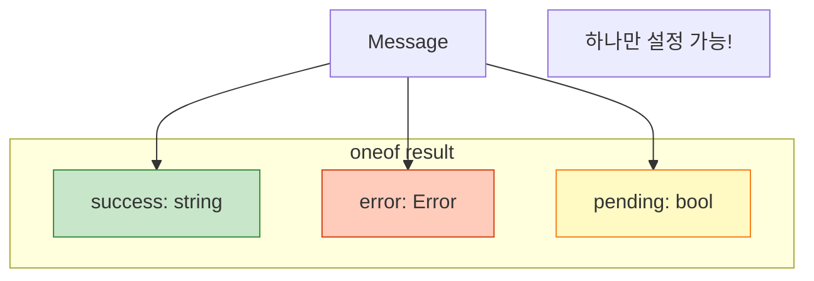
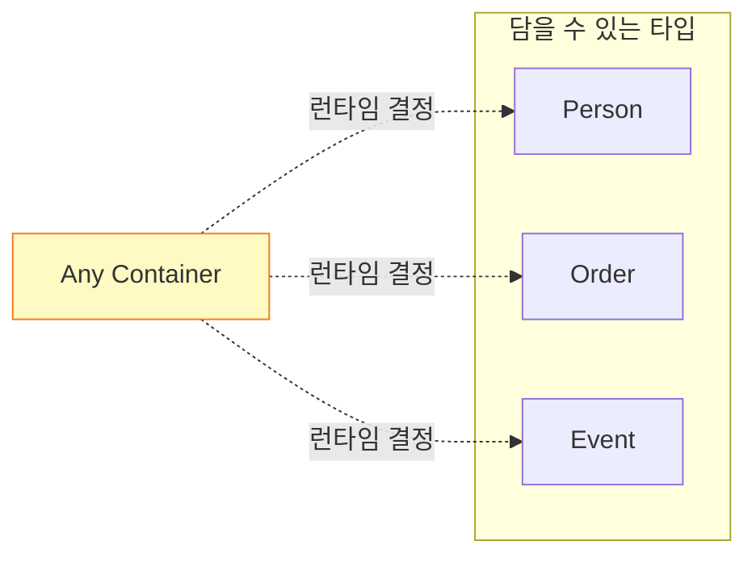
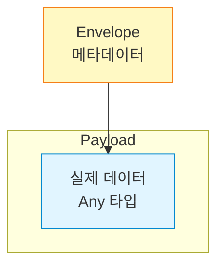
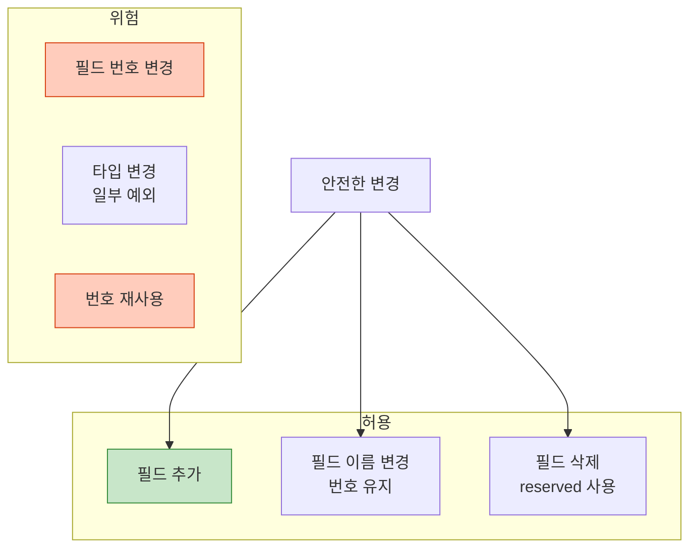

## 들어가며

기본 타입을 넘어서! oneof, Any, Wrapper Types 등 Protobuf의 고급 기능으로 유연하고 확장 가능한 스키마를 설계합니다.

## oneof: 택일 필드

### 개념

**oneof**는 여러 필드 중 **하나만** 설정할 수 있습니다.



### 정의

```protobuf
syntax = "proto3";

message Response {
  oneof result {
    string success = 1;
    string error = 2;
    bool pending = 3;
  }
}
```

### 사용 예

```cpp
Response response;

// 성공 케이스
response.set_success("Data processed");

// 에러 케이스 (이전 success 값은 사라짐)
response.set_error("Connection timeout");

// 현재 설정된 필드 확인
switch (response.result_case()) {
    case Response::kSuccess:
        std::cout << "성공: " << response.success() << std::endl;
        break;
    case Response::kError:
        std::cout << "에러: " << response.error() << std::endl;
        break;
    case Response::kPending:
        std::cout << "대기 중" << std::endl;
        break;
    case Response::RESULT_NOT_SET:
        std::cout << "미설정" << std::endl;
        break;
}
```

### 유즈케이스: Union Type

```protobuf
message PaymentMethod {
  oneof method {
    CreditCard credit_card = 1;
    BankAccount bank_account = 2;
    Crypto crypto = 3;
  }
}

message CreditCard {
  string card_number = 1;
  string cvv = 2;
}

message BankAccount {
  string account_number = 1;
  string routing_number = 2;
}

message Crypto {
  string wallet_address = 1;
  string currency = 2;
}
```

## Any: 동적 타입

### 개념

**Any**는 모든 메시지 타입을 담을 수 있는 **컨테이너**입니다.



### 정의

```protobuf
import "google/protobuf/any.proto";

message Event {
  string id = 1;
  google.protobuf.Any payload = 2;  // 모든 타입 가능
}
```

### 사용 예

```cpp
#include <google/protobuf/any.pb.h>

// Person 메시지 생성
Person person;
person.set_name("Alice");

// Any에 패킹
Event event;
event.set_id("user_created");
event.mutable_payload()->PackFrom(person);

// 전송...

// 받는 쪽: 언패킹
if (event.payload().Is<Person>()) {
    Person received_person;
    event.payload().UnpackTo(&received_person);
    std::cout << "Person: " << received_person.name() << std::endl;
}
```

### Any vs oneof

| 항목 | oneof | Any |
|------|-------|-----|
| **타입 선언** | 컴파일 시점 | 런타임 |
| **성능** | 빠름 | 약간 느림 |
| **크기** | 작음 | 큼 (타입 정보 포함) |
| **타입 안정성** | 높음 | 낮음 |
| **유연성** | 낮음 | 높음 |

## Well-Known Types

### Timestamp

```protobuf
import "google/protobuf/timestamp.proto";

message LogEntry {
  string message = 1;
  google.protobuf.Timestamp created_at = 2;
}
```

```cpp
#include <google/protobuf/timestamp.pb.h>
#include <google/protobuf/util/time_util.h>

using google::protobuf::util::TimeUtil;

LogEntry log;
log.set_message("User logged in");

// 현재 시간 설정
*log.mutable_created_at() = TimeUtil::GetCurrentTime();

// 시간 읽기
std::cout << TimeUtil::ToString(log.created_at()) << std::endl;
// 출력: 2025-01-31T10:30:45Z
```

### Duration

```protobuf
import "google/protobuf/duration.proto";

message Task {
  string name = 1;
  google.protobuf.Duration timeout = 2;
}
```

```cpp
Task task;
task.set_name("Process data");

// 5초 타임아웃
task.mutable_timeout()->set_seconds(5);
task.mutable_timeout()->set_nanos(0);
```

### Wrapper Types (Nullable)

```protobuf
import "google/protobuf/wrappers.proto";

message User {
  string name = 1;

  // nullable int
  google.protobuf.Int32Value age = 2;

  // nullable string
  google.protobuf.StringValue nickname = 3;
}
```

**왜 필요?**: Proto3에서는 기본값(0, "")과 미설정을 구분할 수 없습니다.

```cpp
User user;
user.set_name("Bob");

// age 설정 안 함 (null)
// nickname만 설정
user.mutable_nickname()->set_value("Bobby");

// 확인
if (user.has_age()) {
    std::cout << "Age: " << user.age().value() << std::endl;
} else {
    std::cout << "Age not set" << std::endl;  // 이 경우
}
```

## 스키마 설계 패턴

### 1. Versioning 패턴

```protobuf
message RequestV1 {
  string name = 1;
  int32 age = 2;
}

message RequestV2 {
  string name = 1;
  int32 age = 2;
  string email = 3;  // 새 필드 추가
  repeated string tags = 4;  // 새 필드
}

// 또는 oneof 사용
message Request {
  oneof version {
    RequestV1 v1 = 1;
    RequestV2 v2 = 2;
  }
}
```

### 2. Envelope 패턴



```protobuf
import "google/protobuf/any.proto";
import "google/protobuf/timestamp.proto";

message Envelope {
  string id = 1;
  google.protobuf.Timestamp timestamp = 2;
  string source = 3;
  google.protobuf.Any payload = 4;
}
```

### 3. Event Sourcing 패턴

```protobuf
message Event {
  string aggregate_id = 1;
  int64 version = 2;
  google.protobuf.Timestamp occurred_at = 3;

  oneof event_data {
    UserCreated user_created = 10;
    UserUpdated user_updated = 11;
    UserDeleted user_deleted = 12;
  }
}

message UserCreated {
  string name = 1;
  string email = 2;
}

message UserUpdated {
  string name = 1;
  string email = 2;
}

message UserDeleted {
  string reason = 1;
}
```

## 네이밍 규칙

### Message Names

```protobuf
// ✅ PascalCase
message UserProfile { }
message OrderStatus { }

// ❌ 잘못된 예
message user_profile { }
message orderStatus { }
```

### Field Names

```protobuf
message User {
  // ✅ snake_case
  string first_name = 1;
  int32 user_id = 2;

  // ❌ 잘못된 예
  string FirstName = 3;
  int32 userId = 4;
}
```

### Enum Names

```protobuf
// ✅ UPPER_SNAKE_CASE
enum Status {
  STATUS_UNKNOWN = 0;
  STATUS_ACTIVE = 1;
  STATUS_INACTIVE = 2;
}

// ❌ 잘못된 예
enum Status {
  unknown = 0;
  active = 1;
}
```

## 스키마 진화 전략

### 안전한 변경



### 예제

```protobuf
// v1
message User {
  string name = 1;
  int32 age = 2;
}

// v2: 안전한 진화
message User {
  string full_name = 1;  // 이름 변경 (번호 유지)
  reserved 2;  // age 삭제
  reserved "age";

  string email = 3;  // 새 필드
  repeated string hobbies = 4;  // 새 필드
}
```

## 패키지와 Import

### 패키지 구조

```protobuf
// user/user.proto
syntax = "proto3";
package myapp.user;

message User {
  string name = 1;
}

// order/order.proto
syntax = "proto3";
package myapp.order;

import "user/user.proto";

message Order {
  string id = 1;
  myapp.user.User customer = 2;  // 다른 패키지 참조
}
```

### 권장 디렉토리 구조

```
proto/
├── common/
│   ├── types.proto
│   └── errors.proto
├── user/
│   └── user.proto
├── order/
│   └── order.proto
└── payment/
    └── payment.proto
```

## 다음 단계

고급 스키마 설계를 마스터했습니다! 다음 글에서는:
- **gRPC와 Protobuf** 통합
- 원격 프로시저 호출 (RPC)
- Streaming

---

**시리즈 목차**
1. Protocol Buffers란 무엇인가 - 구글의 직렬화 포맷
2. **Protocol Buffers 고급 스키마 설계** ← 현재 글
3. gRPC와 Protobuf - 고성능 RPC (다음 글)
4. Protobuf 실전 활용 - 마이크로서비스
5. Protobuf 성능 최적화 및 Best Practices

> 💡 **Quick Tip**: oneof는 메모리를 절약하고 명확한 상태 관리를 제공합니다. Union 타입이 필요할 때 적극 활용하세요!
