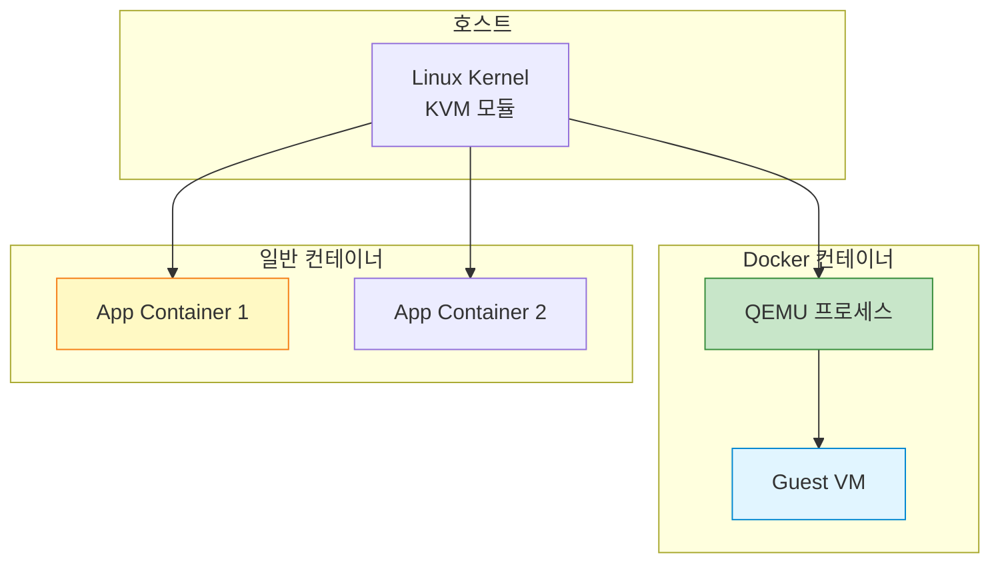
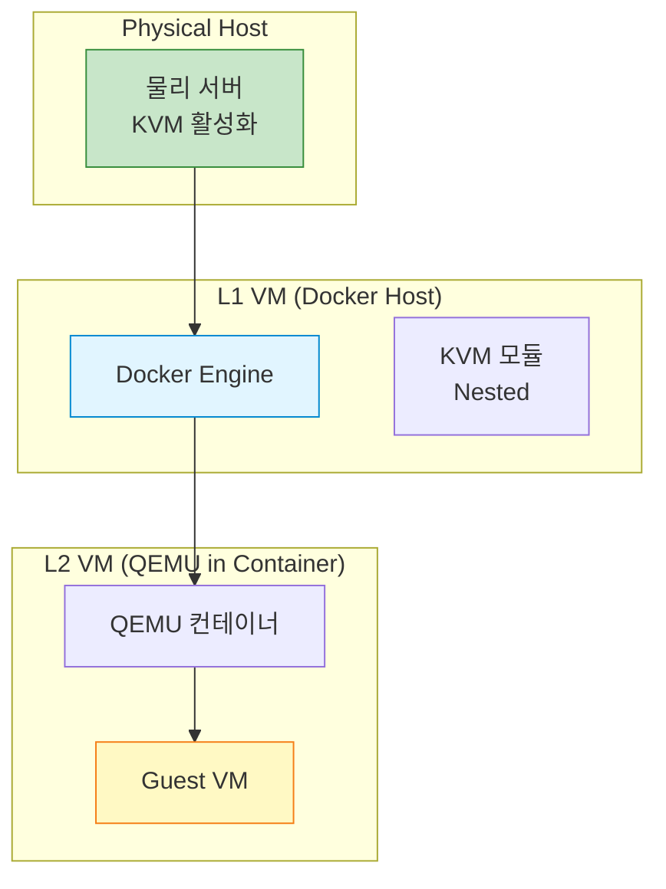

## 들어가며

가상 머신과 컨테이너를 함께 사용해야 한다면? **QEMU + Docker 통합**으로 두 기술의 장점을 모두 활용할 수 있습니다.

## QEMU in Docker



### Dockerfile

```dockerfile
# Dockerfile.qemu
FROM ubuntu:22.04

# QEMU 설치
RUN apt-get update && \
    apt-get install -y \
        qemu-system-x86 \
        qemu-utils \
        bridge-utils \
        iproute2 && \
    rm -rf /var/lib/apt/lists/*

# VM 이미지 디렉토리
RUN mkdir -p /vms

# 엔트리포인트 스크립트
COPY entrypoint.sh /entrypoint.sh
RUN chmod +x /entrypoint.sh

# KVM 디바이스 필요
VOLUME /vms

ENTRYPOINT ["/entrypoint.sh"]
```

### Entrypoint 스크립트

```bash
#!/bin/bash
# entrypoint.sh

set -e

VM_NAME="${VM_NAME:-qemu-vm}"
VM_MEMORY="${VM_MEMORY:-2048}"
VM_CPUS="${VM_CPUS:-2}"
VM_IMAGE="${VM_IMAGE:-/vms/vm.qcow2}"

# VM 이미지가 없으면 생성
if [ ! -f "$VM_IMAGE" ]; then
    echo "Creating VM image: $VM_IMAGE"
    qemu-img create -f qcow2 "$VM_IMAGE" 20G
fi

# KVM 사용 가능 여부 확인
if [ -c /dev/kvm ]; then
    echo "KVM available, using acceleration"
    KVM_OPTS="-enable-kvm"
else
    echo "KVM not available, using software emulation"
    KVM_OPTS=""
fi

# QEMU 실행
exec qemu-system-x86_64 \
    $KVM_OPTS \
    -name "$VM_NAME" \
    -m "$VM_MEMORY" \
    -smp "$VM_CPUS" \
    -drive file="$VM_IMAGE",format=qcow2,if=virtio \
    -netdev user,id=net0,hostfwd=tcp::2222-:22 \
    -device virtio-net-pci,netdev=net0 \
    -nographic \
    -serial mon:stdio
```

### Docker 실행

```bash
# 1. 이미지 빌드
docker build -f Dockerfile.qemu -t qemu-container .

# 2. 컨테이너 실행 (KVM 디바이스 공유)
docker run -it --rm \
    --device=/dev/kvm \
    -v $(pwd)/vms:/vms \
    -e VM_MEMORY=4096 \
    -e VM_CPUS=4 \
    -p 2222:2222 \
    qemu-container

# 3. SSH로 VM 접속
ssh -p 2222 user@localhost
```

### Docker Compose

```yaml
# docker-compose.yml
version: '3.8'

services:
  qemu-vm:
    build:
      context: .
      dockerfile: Dockerfile.qemu
    image: qemu-container
    container_name: qemu-vm
    devices:
      - /dev/kvm:/dev/kvm
    volumes:
      - ./vms:/vms
    environment:
      - VM_NAME=web-server
      - VM_MEMORY=4096
      - VM_CPUS=4
      - VM_IMAGE=/vms/web-server.qcow2
    ports:
      - "2222:2222"
    stdin_open: true
    tty: true
    restart: unless-stopped

  app-container:
    image: nginx:alpine
    container_name: app-container
    ports:
      - "8080:80"
    depends_on:
      - qemu-vm
```

```bash
# 실행
docker-compose up -d

# 로그 확인
docker-compose logs -f qemu-vm

# 중지
docker-compose down
```

## 사용 사례

### 1. 격리된 테스트 환경

```bash
# 각 테스트마다 독립적인 VM 환경
docker run -it --rm \
    --device=/dev/kvm \
    -v $(pwd)/test-image.qcow2:/vms/vm.qcow2 \
    qemu-container

# 테스트 완료 후 자동 삭제
```

### 2. CI/CD에서 VM 테스트

```yaml
# .gitlab-ci.yml
test_in_vm:
  image: qemu-container
  stage: test
  services:
    - docker:dind
  script:
    - qemu-img create -f qcow2 test.qcow2 10G
    - qemu-system-x86_64 -m 2G -drive file=test.qcow2 -kernel vmlinuz -initrd initrd.img -nographic &
    - sleep 30
    - # 테스트 실행
    - pkill qemu
```

### 3. 다중 아키텍처 에뮬레이션

```dockerfile
# Dockerfile.qemu-arm
FROM ubuntu:22.04

RUN apt-get update && \
    apt-get install -y qemu-system-arm qemu-efi-aarch64

CMD ["qemu-system-aarch64", \
     "-M", "virt", \
     "-cpu", "cortex-a57", \
     "-m", "2048", \
     "-drive", "file=/vms/arm64.qcow2,if=virtio"]
```

```bash
# ARM64 VM 실행
docker run -it --rm \
    -v $(pwd)/vms:/vms \
    qemu-arm
```

## Nested 가상화

### 개념



### Nested KVM 활성화

```bash
# 1. 호스트에서 Nested KVM 확인
cat /sys/module/kvm_intel/parameters/nested
Y  # Y=활성화, N=비활성화

# 2. 비활성화된 경우 활성화
# Intel
echo "options kvm_intel nested=1" | sudo tee /etc/modprobe.d/kvm-nested.conf

# AMD
echo "options kvm_amd nested=1" | sudo tee /etc/modprobe.d/kvm-nested.conf

# 3. KVM 모듈 재로드
sudo modprobe -r kvm_intel
sudo modprobe kvm_intel

# 4. L1 VM에 CPU 기능 노출
qemu-system-x86_64 \
    -enable-kvm \
    -cpu host,kvm=on \
    -m 8G \
    -smp 4 \
    ...

# 5. L1 VM 내부에서 확인
cat /proc/cpuinfo | grep vmx  # Intel
cat /proc/cpuinfo | grep svm  # AMD
```

### Docker에서 Nested 가상화

```bash
# L1 VM (Docker 호스트)이 Nested KVM을 지원하는 경우
docker run -it --rm \
    --device=/dev/kvm \
    --cap-add=NET_ADMIN \
    -v $(pwd)/vms:/vms \
    qemu-container

# L2 VM 내부에서 KVM 사용 가능
```

### 성능 고려사항

| 레벨 | 성능 | 사용 사례 |
|------|------|----------|
| L0 (호스트) | 100% | 프로덕션 |
| L1 (VM) | 90-95% | 개발/스테이징 |
| L2 (Nested) | 70-80% | 테스트/데모 |

## 네트워킹 통합

### VM-Container 통신

```bash
# 1. Docker 브리지 네트워크 생성
docker network create \
    --driver bridge \
    --subnet 172.20.0.0/16 \
    qemu-net

# 2. QEMU 컨테이너를 브리지에 연결
docker run -it --rm \
    --network qemu-net \
    --ip 172.20.0.10 \
    --device=/dev/kvm \
    qemu-container

# 3. 앱 컨테이너도 같은 네트워크에
docker run -d \
    --network qemu-net \
    --ip 172.20.0.20 \
    nginx:alpine

# VM과 컨테이너 간 통신 가능
```

### TAP 네트워킹

```dockerfile
# Dockerfile.qemu-tap
FROM ubuntu:22.04

RUN apt-get update && \
    apt-get install -y \
        qemu-system-x86 \
        bridge-utils \
        iproute2 \
        iptables && \
    rm -rf /var/lib/apt/lists/*

COPY tap-setup.sh /tap-setup.sh
RUN chmod +x /tap-setup.sh

ENTRYPOINT ["/tap-setup.sh"]
```

```bash
#!/bin/bash
# tap-setup.sh

# TAP 인터페이스 생성
ip tuntap add dev tap0 mode tap
ip link set tap0 up
ip addr add 192.168.100.1/24 dev tap0

# QEMU 실행 (TAP 사용)
exec qemu-system-x86_64 \
    -enable-kvm \
    -m 2G \
    -netdev tap,id=net0,ifname=tap0,script=no,downscript=no \
    -device virtio-net-pci,netdev=net0 \
    -drive file=/vms/vm.qcow2,if=virtio \
    -nographic
```

```bash
# 실행 (특권 모드 필요)
docker run -it --rm \
    --privileged \
    --device=/dev/kvm \
    --cap-add=NET_ADMIN \
    -v $(pwd)/vms:/vms \
    qemu-tap
```

## 실전 예제

### 웹 개발 환경

```yaml
# docker-compose-dev.yml
version: '3.8'

services:
  # 데이터베이스 VM (영구 상태)
  database-vm:
    build:
      context: .
      dockerfile: Dockerfile.qemu
    devices:
      - /dev/kvm:/dev/kvm
    volumes:
      - ./vms/database.qcow2:/vms/vm.qcow2
    environment:
      - VM_NAME=postgres-vm
      - VM_MEMORY=8192
      - VM_CPUS=4
    ports:
      - "5432:5432"

  # 웹 서버 (컨테이너)
  web:
    image: nginx:alpine
    volumes:
      - ./html:/usr/share/nginx/html
    ports:
      - "80:80"
    depends_on:
      - database-vm

  # API 서버 (컨테이너)
  api:
    build: ./api
    environment:
      - DATABASE_URL=postgresql://postgres-vm:5432/mydb
    ports:
      - "3000:3000"
    depends_on:
      - database-vm
```

### Kubernetes에서 QEMU

```yaml
# qemu-pod.yaml
apiVersion: v1
kind: Pod
metadata:
  name: qemu-vm
spec:
  containers:
  - name: qemu
    image: qemu-container:latest
    securityContext:
      privileged: true
    volumeMounts:
    - name: kvm
      mountPath: /dev/kvm
    - name: vms
      mountPath: /vms
    env:
    - name: VM_MEMORY
      value: "4096"
    - name: VM_CPUS
      value: "4"
    resources:
      requests:
        memory: "4Gi"
        cpu: "4"
      limits:
        memory: "8Gi"
        cpu: "8"
  volumes:
  - name: kvm
    hostPath:
      path: /dev/kvm
  - name: vms
    persistentVolumeClaim:
      claimName: qemu-vms-pvc
```

### Multi-stage Build

```dockerfile
# Dockerfile.optimized
# Stage 1: Builder
FROM ubuntu:22.04 AS builder

RUN apt-get update && \
    apt-get install -y \
        build-essential \
        git \
        python3 \
        ninja-build \
        libglib2.0-dev \
        libpixman-1-dev

# QEMU 소스 빌드 (최적화)
RUN git clone --depth 1 https://github.com/qemu/qemu.git && \
    cd qemu && \
    ./configure --target-list=x86_64-softmmu --enable-kvm && \
    make -j$(nproc)

# Stage 2: Runtime
FROM ubuntu:22.04

RUN apt-get update && \
    apt-get install -y \
        libglib2.0-0 \
        libpixman-1-0 && \
    rm -rf /var/lib/apt/lists/*

# 빌드된 QEMU만 복사
COPY --from=builder /qemu/build/qemu-system-x86_64 /usr/local/bin/
COPY --from=builder /qemu/build/qemu-img /usr/local/bin/

COPY entrypoint.sh /entrypoint.sh
RUN chmod +x /entrypoint.sh

ENTRYPOINT ["/entrypoint.sh"]
```

## 보안 고려사항

### 최소 권한 원칙

```bash
# 나쁜 예: --privileged (모든 권한)
docker run --privileged qemu-container

# 좋은 예: 필요한 권한만
docker run \
    --device=/dev/kvm \
    --cap-add=NET_ADMIN \
    --cap-drop=ALL \
    qemu-container
```

### seccomp 프로파일

```json
// qemu-seccomp.json
{
  "defaultAction": "SCMP_ACT_ERRNO",
  "architectures": ["SCMP_ARCH_X86_64"],
  "syscalls": [
    {
      "names": [
        "read", "write", "open", "close",
        "ioctl", "mmap", "mprotect",
        "kvm_run", "kvm_create_vm"
      ],
      "action": "SCMP_ACT_ALLOW"
    }
  ]
}
```

```bash
# seccomp 프로파일 적용
docker run \
    --security-opt seccomp=qemu-seccomp.json \
    --device=/dev/kvm \
    qemu-container
```

## 성능 최적화

### 리소스 제한

```yaml
# docker-compose.yml
services:
  qemu-vm:
    image: qemu-container
    devices:
      - /dev/kvm:/dev/kvm
    deploy:
      resources:
        limits:
          cpus: '8'
          memory: 16G
        reservations:
          cpus: '4'
          memory: 8G
    cpuset: "0-7"  # CPU 피닝
```

### Huge Pages

```bash
# 호스트에서 Huge Pages 설정
echo 1024 | sudo tee /proc/sys/vm/nr_hugepages

# Docker 실행 시 사용
docker run \
    --device=/dev/kvm \
    -v /dev/hugepages:/dev/hugepages \
    --shm-size=2g \
    qemu-container
```

## 모니터링

### 컨테이너 + VM 통합 모니터링

```python
#!/usr/bin/env python3
# monitor_all.py

import docker
import psutil
import subprocess

def monitor_containers():
    """Docker 컨테이너 모니터링"""
    client = docker.from_env()

    for container in client.containers.list():
        stats = container.stats(stream=False)
        cpu_percent = stats['cpu_stats']['cpu_usage']['total_usage']
        mem_usage = stats['memory_stats']['usage'] / 1024 / 1024

        print(f"Container: {container.name}")
        print(f"  CPU: {cpu_percent}")
        print(f"  Memory: {mem_usage:.2f}MB")

def monitor_vms():
    """QEMU VM 모니터링"""
    for proc in psutil.process_iter(['pid', 'name', 'cmdline']):
        if 'qemu-system' in proc.info['name']:
            print(f"QEMU VM: {proc.info['pid']}")
            print(f"  CPU: {proc.cpu_percent()}%")
            print(f"  Memory: {proc.memory_info().rss / 1024 / 1024:.2f}MB")

if __name__ == '__main__':
    print("=== Containers ===")
    monitor_containers()
    print("\n=== VMs ===")
    monitor_vms()
```

## 다음 단계

QEMU와 Docker 통합을 마스터했습니다! 다음 글에서는:
- **QEMU 클라우드 이미지 활용**
- Cloud-init
- 자동 프로비저닝

---

**시리즈 목차**
1-16. [이전 글들]
17. **QEMU와 Docker 통합** ← 현재 글

> 💡 **Quick Tip**: Docker + QEMU 조합은 강력하지만 오버헤드가 있습니다. 프로덕션에서는 정말 필요한 경우에만 사용하고, 대부분의 경우 네이티브 QEMU나 순수 컨테이너를 선택하세요!
