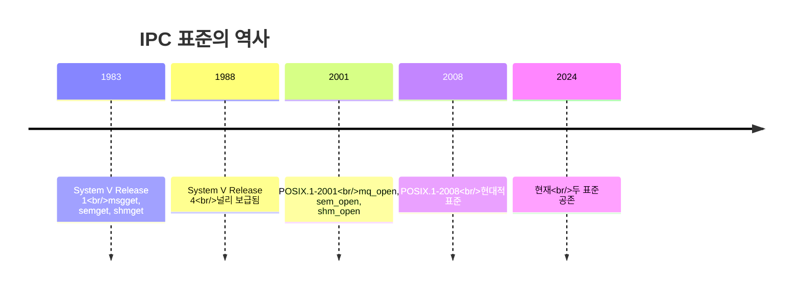
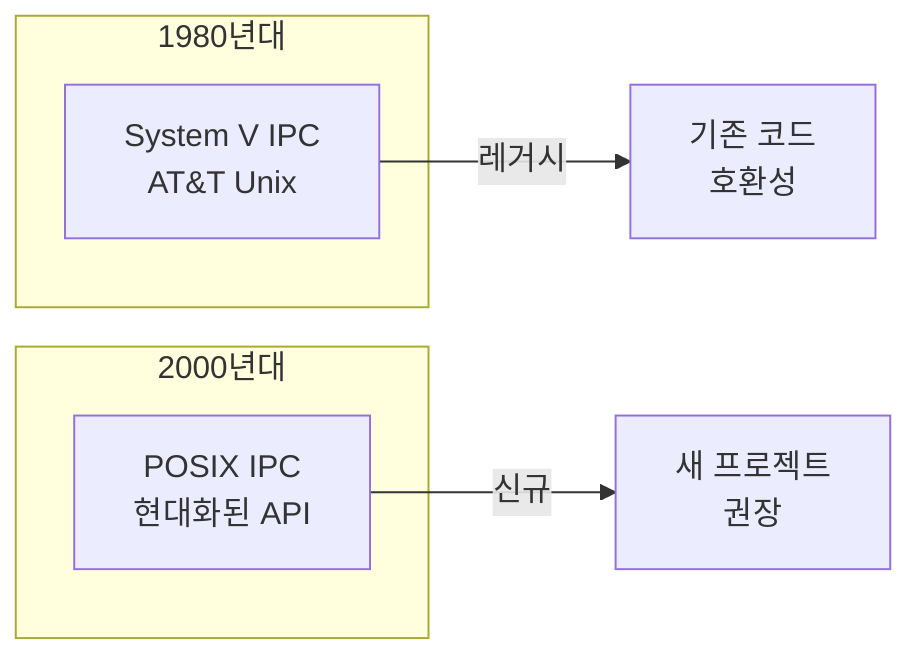
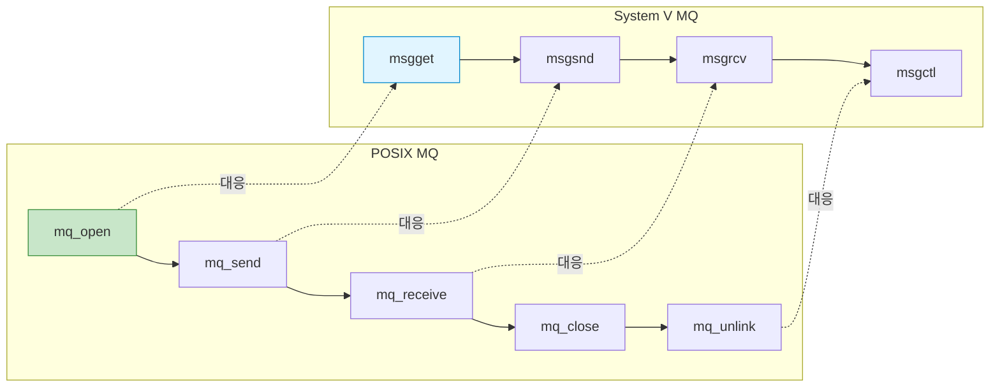
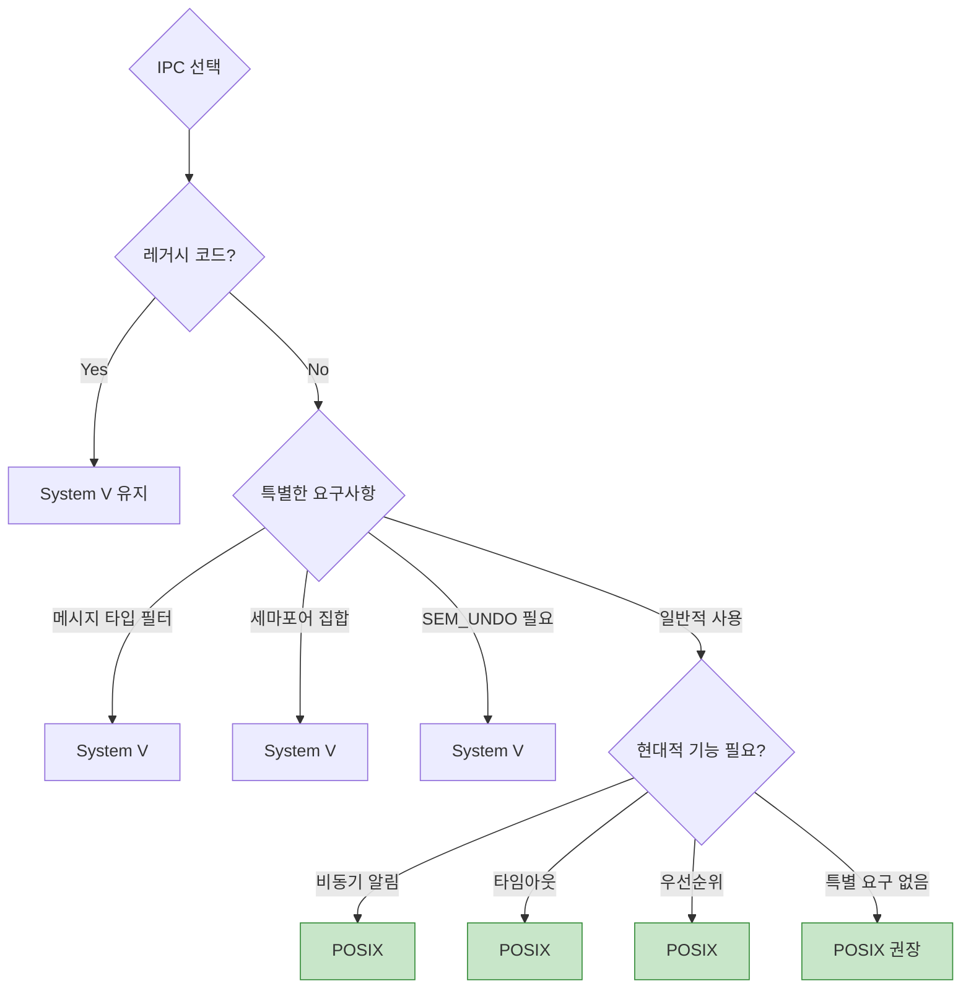

## 들어가며

Linux IPC는 **두 가지 표준**이 공존합니다: **POSIX**와 **System V**. 각각의 특징을 이해하고, 프로젝트에 맞는 선택을 할 수 있어야 합니다.

## 역사적 배경

### 타임라인



### 왜 두 가지가 존재하나?



## 전체 비교표

### 메시지 큐

| 항목 | POSIX | System V |
|------|-------|----------|
| **생성** | `mq_open()` | `msgget()` |
| **전송** | `mq_send()` | `msgsnd()` |
| **수신** | `mq_receive()` | `msgrcv()` |
| **삭제** | `mq_unlink()` | `msgctl(IPC_RMID)` |
| **이름** | `/name` | IPC key (int) |
| **우선순위** | ✅ 0-31 | ❌ |
| **메시지 타입** | ❌ | ✅ long |
| **비동기 알림** | ✅ `mq_notify()` | ❌ |
| **타임아웃** | ✅ `mq_timedreceive()` | ❌ |

### 세마포어

| 항목 | POSIX | System V |
|------|-------|----------|
| **생성** | `sem_open()` | `semget()` |
| **대기** | `sem_wait()` | `semop()` |
| **해제** | `sem_post()` | `semop()` |
| **삭제** | `sem_unlink()` | `semctl(IPC_RMID)` |
| **이름** | `/name` | IPC key |
| **Named** | ✅ | ✅ |
| **Unnamed** | ✅ `sem_init()` | ❌ |
| **세마포어 집합** | ❌ | ✅ |
| **Atomic 연산** | ❌ | ✅ (여러 sem 동시) |
| **Undo 기능** | ❌ | ✅ `SEM_UNDO` |

### 공유 메모리

| 항목 | POSIX | System V |
|------|-------|----------|
| **생성** | `shm_open()` + `mmap()` | `shmget()` + `shmat()` |
| **분리** | `munmap()` | `shmdt()` |
| **삭제** | `shm_unlink()` | `shmctl(IPC_RMID)` |
| **이름** | `/name` | IPC key |
| **파일 연계** | ✅ `/dev/shm/` | ❌ |
| **권한** | 파일 권한 (0644) | IPC 권한 |
| **크기 조정** | ✅ `ftruncate()` | ❌ (고정) |

## API 대응 관계

### Message Queue



### 코드 비교

```c
// ===== POSIX Message Queue =====
#include <mqueue.h>

mqd_t mq = mq_open("/myqueue", O_CREAT | O_RDWR, 0644, NULL);
mq_send(mq, message, len, priority);
mq_receive(mq, buffer, size, &priority);
mq_close(mq);
mq_unlink("/myqueue");

// ===== System V Message Queue =====
#include <sys/msg.h>

key_t key = ftok("/tmp/myfile", 'A');
int msqid = msgget(key, IPC_CREAT | 0644);

struct msgbuf {
    long mtype;
    char mtext[256];
} msg;

msgsnd(msqid, &msg, sizeof(msg.mtext), 0);
msgrcv(msqid, &msg, sizeof(msg.mtext), 0, 0);
msgctl(msqid, IPC_RMID, NULL);
```

## 명명 규칙 차이

### POSIX: 파일 기반

```bash
# POSIX는 파일시스템 사용
ls -l /dev/shm/
# -rw-r--r-- 1 user user 1024 ... my_shm

ls -l /dev/mqueue/
# -rw-r--r-- 1 user user 80 ... my_queue

# 권한 관리가 직관적
chmod 666 /dev/shm/my_shm
```

### System V: IPC Key

```bash
# System V는 키 기반
ipcs -a

# 출력:
# ------ Message Queues --------
# key        msqid      owner  perms
# 0x61020001 0          user   644

# ------ Shared Memory Segments --------
# key        shmid      owner  perms
# 0x61020002 32768      user   666
```

### ftok() - 키 생성

```c
// System V 키 생성
#include <sys/ipc.h>

// 파일 경로와 ID로 키 생성
key_t key = ftok("/tmp/myfile", 'A');

int msqid = msgget(key, IPC_CREAT | 0644);

// 문제: 파일이 삭제되면 키가 바뀜!
// 해결: 명시적 키 사용
int msqid = msgget(12345, IPC_CREAT | 0644);
```

## 기능 차이

### POSIX만 지원

#### 1. 비동기 알림

```c
// POSIX MQ: mq_notify()
#include <signal.h>
#include <mqueue.h>

void message_handler(int sig) {
    printf("메시지 도착!\n");
}

signal(SIGUSR1, message_handler);

struct sigevent sev;
sev.sigev_notify = SIGEV_SIGNAL;
sev.sigev_signo = SIGUSR1;

mqd_t mq = mq_open("/queue", O_RDONLY);
mq_notify(mq, &sev);  // 메시지 도착 시 시그널
```

#### 2. 타임아웃

```c
// POSIX: 타임아웃 지원
struct timespec timeout;
clock_gettime(CLOCK_REALTIME, &timeout);
timeout.tv_sec += 5;  // 5초

if (mq_timedreceive(mq, buf, size, NULL, &timeout) == -1) {
    if (errno == ETIMEDOUT) {
        printf("5초 안에 메시지 없음\n");
    }
}

// System V: 타임아웃 없음 (블로킹 or 논블로킹만)
msgrcv(msqid, &msg, size, 0, 0);        // 블로킹
msgrcv(msqid, &msg, size, 0, IPC_NOWAIT);  // 논블로킹
```

### System V만 지원

#### 1. 메시지 타입 필터링

```c
// System V: 타입별 선택 수신
struct msgbuf {
    long mtype;  // 메시지 타입
    char mtext[256];
} msg;

msg.mtype = 1;  // ERROR 타입
msgsnd(msqid, &msg, sizeof(msg.mtext), 0);

msg.mtype = 2;  // WARNING 타입
msgsnd(msqid, &msg, sizeof(msg.mtext), 0);

// ERROR 타입만 수신
msgrcv(msqid, &msg, sizeof(msg.mtext), 1, 0);

// 타입 2 이하만 수신
msgrcv(msqid, &msg, sizeof(msg.mtext), -2, 0);
```

#### 2. 세마포어 집합

```c
// System V: 여러 세마포어를 집합으로 관리
int semid = semget(key, 3, IPC_CREAT | 0666);  // 3개 세마포어

// 초기화
semctl(semid, 0, SETVAL, 5);
semctl(semid, 1, SETVAL, 10);
semctl(semid, 2, SETVAL, 3);

// Atomic 연산: 두 세마포어 동시 획득
struct sembuf ops[] = {
    {0, -2, 0},  // sem[0]에서 2 감소
    {1, -1, 0}   // sem[1]에서 1 감소
};
semop(semid, ops, 2);  // 둘 다 성공하거나 둘 다 실패
```

#### 3. SEM_UNDO

```c
// System V: 프로세스 종료 시 자동 되돌림
struct sembuf op;
op.sem_num = 0;
op.sem_op = -1;
op.sem_flg = SEM_UNDO;  // 프로세스 종료 시 +1 자동

semop(semid, &op, 1);

// 프로세스가 크래시해도 세마포어 자동 복구!
```

## 마이그레이션 가이드

### System V → POSIX

```c
// ===== 변경 전 (System V) =====
key_t key = ftok("/tmp/myapp", 'Q');
int msqid = msgget(key, IPC_CREAT | 0644);

struct msgbuf {
    long mtype;
    char mtext[256];
} msg;

msg.mtype = 1;
strcpy(msg.mtext, "Hello");
msgsnd(msqid, &msg, strlen(msg.mtext) + 1, 0);

msgrcv(msqid, &msg, 256, 0, 0);

msgctl(msqid, IPC_RMID, NULL);

// ===== 변경 후 (POSIX) =====
struct mq_attr attr = {0, 10, 256, 0};
mqd_t mq = mq_open("/myapp_queue", O_CREAT | O_RDWR, 0644, &attr);

char buffer[256];
strcpy(buffer, "Hello");
mq_send(mq, buffer, strlen(buffer) + 1, 0);  // priority=0

mq_receive(mq, buffer, 256, NULL);

mq_close(mq);
mq_unlink("/myapp_queue");
```

### 주요 변경 사항

| System V | POSIX | 비고 |
|----------|-------|------|
| `ftok()` | 직접 이름 | `/name` 형식 |
| `msgget(key, ...)` | `mq_open("/name", ...)` | O_CREAT 사용 |
| `msgsnd()` | `mq_send()` | priority 추가 |
| `msgrcv()` | `mq_receive()` | 타입 필터링 불가 |
| `msgctl(IPC_RMID)` | `mq_unlink()` | 더 간단 |

### 타입 필터링 대체

```c
// System V: 타입으로 필터링
msgrcv(msqid, &msg, size, 1, 0);  // 타입 1만

// POSIX: 우선순위로 대체
struct message {
    int type;  // 필드로 직접 관리
    char data[256];
};

struct message msg;
mq_receive(mq, (char*)&msg, sizeof(msg), NULL);

if (msg.type == 1) {
    // 타입 1 처리
}
```

## 성능 비교

### 벤치마크 결과

| 메트릭 | POSIX | System V | 승자 |
|--------|-------|----------|------|
| **메시지 레이턴시 (64B)** | 2.45 μs | 2.52 μs | POSIX |
| **처리량 (MB/s)** | 2,187 | 2,134 | POSIX |
| **메모리 오버헤드** | 80 KB | 85 KB | POSIX |
| **생성/삭제 속도** | 빠름 | 느림 | POSIX |

**결론**: POSIX가 약간 더 빠름 (5-10%)

### 코드 가독성

```c
// System V: 장황함
key_t key = ftok("/tmp/file", 'A');
int shmid = shmget(key, size, IPC_CREAT | 0666);
void *ptr = shmat(shmid, NULL, 0);
// ... 사용 ...
shmdt(ptr);
shmctl(shmid, IPC_RMID, NULL);

// POSIX: 간결함
int fd = shm_open("/myshm", O_CREAT | O_RDWR, 0666);
ftruncate(fd, size);
void *ptr = mmap(NULL, size, PROT_READ | PROT_WRITE, MAP_SHARED, fd, 0);
// ... 사용 ...
munmap(ptr, size);
shm_unlink("/myshm");
```

## 이식성

### 플랫폼 지원

| 플랫폼 | POSIX | System V | 권장 |
|--------|-------|----------|------|
| **Linux** | ✅ | ✅ | POSIX |
| **macOS** | ✅ | ⚠️ 제한적 | POSIX |
| **FreeBSD** | ✅ | ✅ | POSIX |
| **Solaris** | ✅ | ✅ | POSIX |
| **Windows** | ❌ | ❌ | - |
| **Android** | ✅ | ✅ | POSIX |

**결론**: POSIX가 더 이식성 높음

## 선택 기준

### 의사결정 플로우



### 체크리스트

```
POSIX를 선택해야 할 때:
✅ 새 프로젝트
✅ 파일 기반 권한 관리
✅ 비동기 알림 필요
✅ 타임아웃 필요
✅ 최신 표준 준수
✅ 코드 가독성 중요

System V를 선택해야 할 때:
✅ 레거시 코드와 호환
✅ 메시지 타입 필터링
✅ 세마포어 집합 필요
✅ SEM_UNDO 필요
✅ Atomic 다중 세마포어 연산
```

## 혼용 사례

### 각각의 장점 활용

```c
// POSIX Shared Memory (빠르고 편리)
int shm_fd = shm_open("/data", O_CREAT | O_RDWR, 0666);
ftruncate(shm_fd, size);
void *data = mmap(NULL, size, PROT_READ | PROT_WRITE, MAP_SHARED, shm_fd, 0);

// System V Semaphore (세마포어 집합)
int semid = semget(key, 2, IPC_CREAT | 0666);

// 두 개 동시 획득 (Atomic)
struct sembuf ops[] = {
    {0, -1, 0},
    {1, -1, 0}
};
semop(semid, ops, 2);

// 공유 메모리 접근
modify_data(data);

// 해제
semop(semid, (struct sembuf[]){ {0, 1, 0}, {1, 1, 0} }, 2);
```

## 디버깅 도구

### POSIX

```bash
# 공유 메모리
ls -l /dev/shm/
cat /dev/shm/my_shm  # 내용 확인 (텍스트면)

# 메시지 큐
ls -l /dev/mqueue/
cat /proc/<pid>/fdinfo/<fd>  # 상세 정보

# 세마포어
ls -l /dev/shm/sem.*
```

### System V

```bash
# 모든 IPC 확인
ipcs -a

# 메시지 큐 상세
ipcs -q -i <msqid>

# 공유 메모리 상세
ipcs -m -i <shmid>

# 세마포어 상세
ipcs -s -i <semid>

# 삭제
ipcrm -q <msqid>
ipcrm -m <shmid>
ipcrm -s <semid>
```

## 다음 단계

POSIX와 System V IPC의 모든 차이를 이해했습니다! 다음 글에서는:
- **IPC 보안** - 권한 관리, 접근 제어
- Credentials passing
- 보안 Best Practices

---

**시리즈 목차**
1. IPC란 무엇인가
2. IPC 메커니즘 전체 개요
3. Pipe - 가장 기본적인 IPC
4. Named Pipe (FIFO)
5. Signal - 비동기 이벤트 통신
6. Shared Memory - 공유 메모리
7. Message Queue 심화
8. Semaphore 심화
9. Unix Domain Socket
10. Memory-Mapped Files
11. IPC 메커니즘 성능 비교
12. 동기화 기법
13. **POSIX vs System V IPC** ← 현재 글
14. IPC 보안 (다음 글)

> 💡 **Quick Tip**: 새 프로젝트는 POSIX를 사용하세요. 더 현대적이고, 빠르며, 이식성이 높습니다. System V는 레거시 호환이나 특수 기능(타입 필터링, SEM_UNDO)이 필요할 때만 사용하세요!
