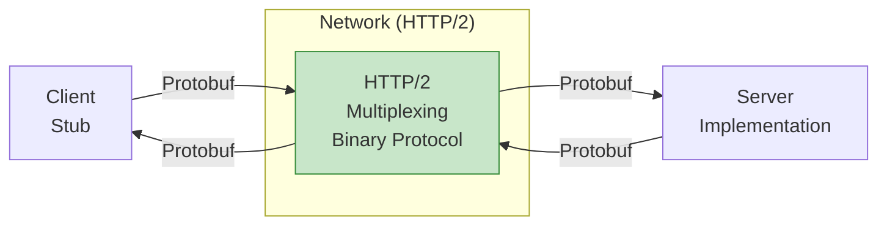
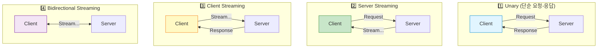
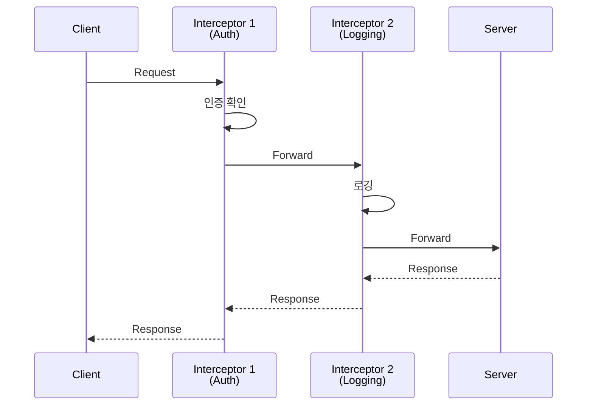

## 들어가며

Protocol Buffers의 진정한 힘은 **gRPC**와 함께할 때 발휘됩니다. HTTP/2 기반의 고성능 RPC 프레임워크로 마이크로서비스를 구축해봅시다.

## gRPC란?

### 정의

**gRPC**는 Google이 만든 **고성능 RPC 프레임워크**입니다.



### gRPC vs REST

| 항목 | REST | gRPC |
|------|------|------|
| **프로토콜** | HTTP/1.1 | HTTP/2 |
| **포맷** | JSON/XML | Protobuf |
| **성능** | 보통 | 빠름 (5-10배) |
| **스트리밍** | ❌ 제한적 | ✅ 양방향 |
| **타입 안정성** | ❌ 약함 | ✅ 강함 |
| **브라우저 지원** | ✅ 완벽 | ⚠️ grpc-web 필요 |
| **가독성** | ✅ 쉬움 | ❌ 바이너리 |

## gRPC 서비스 정의

### .proto 파일

```protobuf
// greeter.proto
syntax = "proto3";

package greeter;

// 서비스 정의
service Greeter {
  rpc SayHello (HelloRequest) returns (HelloReply);
}

// 요청 메시지
message HelloRequest {
  string name = 1;
}

// 응답 메시지
message HelloReply {
  string message = 1;
}
```

### 컴파일

```bash
# gRPC 플러그인 포함 컴파일
protoc --cpp_out=. --grpc_out=. \
       --plugin=protoc-gen-grpc=`which grpc_cpp_plugin` \
       greeter.proto

# 생성된 파일:
# greeter.pb.h, greeter.pb.cc      (메시지)
# greeter.grpc.pb.h, greeter.grpc.pb.cc  (서비스)
```

## gRPC 서버 구현

### C++ Server

```cpp
// greeter_server.cpp
#include <iostream>
#include <grpcpp/grpcpp.h>
#include "greeter.grpc.pb.h"

using grpc::Server;
using grpc::ServerBuilder;
using grpc::ServerContext;
using grpc::Status;
using greeter::Greeter;
using greeter::HelloRequest;
using greeter::HelloReply;

// 서비스 구현
class GreeterServiceImpl final : public Greeter::Service {
  Status SayHello(ServerContext* context,
                  const HelloRequest* request,
                  HelloReply* reply) override {
    std::string prefix("Hello ");
    reply->set_message(prefix + request->name());
    return Status::OK;
  }
};

int main() {
  std::string server_address("0.0.0.0:50051");
  GreeterServiceImpl service;

  ServerBuilder builder;
  builder.AddListeningPort(server_address, grpc::InsecureServerCredentials());
  builder.RegisterService(&service);

  std::unique_ptr<Server> server(builder.BuildAndStart());
  std::cout << "Server listening on " << server_address << std::endl;

  server->Wait();
  return 0;
}
```

### Python Server (간략)

```python
# greeter_server.py
import grpc
from concurrent import futures
import greeter_pb2
import greeter_pb2_grpc

class GreeterServicer(greeter_pb2_grpc.GreeterServicer):
    def SayHello(self, request, context):
        return greeter_pb2.HelloReply(message=f'Hello {request.name}')

server = grpc.server(futures.ThreadPoolExecutor(max_workers=10))
greeter_pb2_grpc.add_GreeterServicer_to_server(GreeterServicer(), server)
server.add_insecure_port('[::]:50051')
server.start()
server.wait_for_termination()
```

## gRPC 클라이언트 구현

### C++ Client

```cpp
// greeter_client.cpp
#include <iostream>
#include <grpcpp/grpcpp.h>
#include "greeter.grpc.pb.h"

using grpc::Channel;
using grpc::ClientContext;
using grpc::Status;
using greeter::Greeter;
using greeter::HelloRequest;
using greeter::HelloReply;

class GreeterClient {
 public:
  GreeterClient(std::shared_ptr<Channel> channel)
      : stub_(Greeter::NewStub(channel)) {}

  std::string SayHello(const std::string& user) {
    HelloRequest request;
    request.set_name(user);

    HelloReply reply;
    ClientContext context;

    Status status = stub_->SayHello(&context, request, &reply);

    if (status.ok()) {
      return reply.message();
    } else {
      return "RPC failed: " + status.error_message();
    }
  }

 private:
  std::unique_ptr<Greeter::Stub> stub_;
};

int main() {
  GreeterClient greeter(
      grpc::CreateChannel("localhost:50051",
                          grpc::InsecureChannelCredentials()));

  std::string user("World");
  std::string reply = greeter.SayHello(user);
  std::cout << "Greeter received: " << reply << std::endl;

  return 0;
}
```

## 4가지 RPC 패턴



### 1. Unary RPC (이미 했음)

```protobuf
rpc SayHello (HelloRequest) returns (HelloReply);
```

### 2. Server Streaming

```protobuf
// 서버가 여러 응답을 스트리밍
rpc ListFeatures (Rectangle) returns (stream Feature);
```

**구현**:

```cpp
// Server
Status ListFeatures(ServerContext* context,
                    const Rectangle* rectangle,
                    ServerWriter<Feature>* writer) override {
  for (const auto& feature : features) {
    if (InRectangle(feature, rectangle)) {
      writer->Write(feature);  // 여러 번 호출
    }
  }
  return Status::OK;
}

// Client
ClientContext context;
Rectangle rect;
std::unique_ptr<ClientReader<Feature>> reader(
    stub_->ListFeatures(&context, rect));

Feature feature;
while (reader->Read(&feature)) {
  std::cout << "Found feature: " << feature.name() << std::endl;
}
```

### 3. Client Streaming

```protobuf
// 클라이언트가 여러 요청을 스트리밍
rpc RecordRoute (stream Point) returns (RouteSummary);
```

**구현**:

```cpp
// Client
ClientContext context;
RouteSummary stats;

std::unique_ptr<ClientWriter<Point>> writer(
    stub_->RecordRoute(&context, &stats));

for (int i = 0; i < 10; i++) {
  Point point;
  point.set_latitude(lat);
  point.set_longitude(lon);
  writer->Write(point);  // 여러 번 전송
}

writer->WritesDone();
Status status = writer->Finish();

std::cout << "Points: " << stats.point_count() << std::endl;
```

### 4. Bidirectional Streaming

```protobuf
// 양방향 스트리밍
rpc RouteChat (stream RouteNote) returns (stream RouteNote);
```

**구현**:

```cpp
// Client
ClientContext context;

std::shared_ptr<ClientReaderWriter<RouteNote, RouteNote>> stream(
    stub_->RouteChat(&context));

// 송신 스레드
std::thread writer([&stream]() {
  RouteNote note;
  while (/* 조건 */) {
    stream->Write(note);
  }
  stream->WritesDone();
});

// 수신 루프
RouteNote server_note;
while (stream->Read(&server_note)) {
  std::cout << "Got message: " << server_note.message() << std::endl;
}

writer.join();
```

## 실전 예제: Chat 서비스

### Proto 정의

```protobuf
// chat.proto
syntax = "proto3";

service Chat {
  rpc SendMessage (stream ChatMessage) returns (stream ChatMessage);
}

message ChatMessage {
  string user = 1;
  string text = 2;
  int64 timestamp = 3;
}
```

### Server

```cpp
class ChatServiceImpl final : public Chat::Service {
  Status SendMessage(ServerContext* context,
                     ServerReaderWriter<ChatMessage, ChatMessage>* stream)
                     override {
    ChatMessage msg;

    while (stream->Read(&msg)) {
      std::cout << msg.user() << ": " << msg.text() << std::endl;

      // 모든 클라이언트에게 브로드캐스트
      for (auto& client_stream : active_streams) {
        client_stream->Write(msg);
      }
    }

    return Status::OK;
  }

 private:
  std::vector<ServerReaderWriter<ChatMessage, ChatMessage>*> active_streams;
};
```

## 에러 처리

### Status Codes

```cpp
// Server에서 에러 반환
return Status(grpc::StatusCode::NOT_FOUND, "User not found");

// Client에서 처리
Status status = stub_->GetUser(&context, request, &response);

if (!status.ok()) {
  if (status.error_code() == grpc::StatusCode::NOT_FOUND) {
    std::cerr << "User not found" << std::endl;
  }
}
```

### 상태 코드 목록

| 코드 | 의미 |
|------|------|
| `OK` | 성공 |
| `CANCELLED` | 클라이언트 취소 |
| `UNKNOWN` | 알 수 없는 에러 |
| `INVALID_ARGUMENT` | 잘못된 인자 |
| `DEADLINE_EXCEEDED` | 타임아웃 |
| `NOT_FOUND` | 리소스 없음 |
| `ALREADY_EXISTS` | 이미 존재 |
| `PERMISSION_DENIED` | 권한 없음 |
| `UNAUTHENTICATED` | 인증 실패 |

## 메타데이터와 헤더

### Server에서 메타데이터 읽기

```cpp
Status SayHello(ServerContext* context,
                const HelloRequest* request,
                HelloReply* reply) override {
  // 메타데이터 읽기
  auto metadata = context->client_metadata();
  auto auth_header = metadata.find("authorization");

  if (auth_header != metadata.end()) {
    std::string token = std::string(auth_header->second.data(),
                                    auth_header->second.length());
    // 토큰 검증...
  }

  return Status::OK;
}
```

### Client에서 메타데이터 전송

```cpp
ClientContext context;
context.AddMetadata("authorization", "Bearer token123");

stub_->SayHello(&context, request, &reply);
```

## 인터셉터 (Middleware)



## 다음 단계

gRPC와 Protobuf 통합을 마스터했습니다! 다음 글에서는:
- **실전 마이크로서비스 구축**
- 서비스 디스커버리
- 로드 밸런싱

---

**시리즈 목차**
1. Protocol Buffers란 무엇인가 - 구글의 직렬화 포맷
2. Protocol Buffers 고급 스키마 설계
3. **gRPC와 Protobuf - 고성능 RPC** ← 현재 글
4. Protobuf 실전 활용 - 마이크로서비스 (다음 글)
5. Protobuf 성능 최적화 및 Best Practices

> 💡 **Quick Tip**: gRPC 스트리밍은 실시간 데이터 전송에 완벽합니다. 채팅, 모니터링, IoT 데이터 수집 등에 활용하세요!
