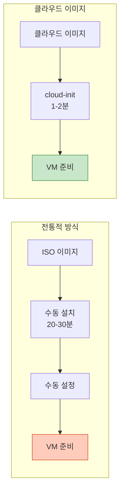
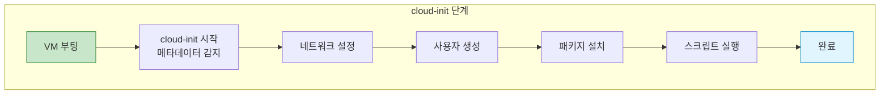

## 들어가며

매번 OS를 설치하기 번거롭다면? **클라우드 이미지**를 사용하면 사전 설치된 이미지로 즉시 VM을 시작할 수 있습니다.

## 클라우드 이미지 개념



### 클라우드 이미지 다운로드

```bash
# Ubuntu Cloud Images
wget https://cloud-images.ubuntu.com/releases/22.04/release/ubuntu-22.04-server-cloudimg-amd64.img

# CentOS Stream
wget https://cloud.centos.org/centos/9-stream/x86_64/images/CentOS-Stream-GenericCloud-9-latest.x86_64.qcow2

# Debian
wget https://cloud.debian.org/images/cloud/bookworm/latest/debian-12-generic-amd64.qcow2

# Fedora
wget https://download.fedoraproject.org/pub/fedora/linux/releases/39/Cloud/x86_64/images/Fedora-Cloud-Base-39-1.5.x86_64.qcow2
```

## Cloud-init

### 개념



### meta-data 파일

```yaml
# meta-data
instance-id: vm-001
local-hostname: ubuntu-vm
```

### user-data 파일

```yaml
# user-data
#cloud-config

# 사용자 생성
users:
  - name: ubuntu
    groups: sudo
    shell: /bin/bash
    sudo: ['ALL=(ALL) NOPASSWD:ALL']
    ssh_authorized_keys:
      - ssh-rsa AAAAB3NzaC1yc2EAAAADAQABAAABAQC... your-key-here

# 패키지 업데이트 및 설치
package_update: true
package_upgrade: true
packages:
  - nginx
  - git
  - htop
  - vim

# 파일 생성
write_files:
  - path: /etc/nginx/sites-available/default
    content: |
      server {
        listen 80;
        server_name _;
        location / {
          return 200 "Hello from cloud-init!\n";
        }
      }

# 명령 실행
runcmd:
  - systemctl enable nginx
  - systemctl start nginx
  - echo "Cloud-init completed" > /var/log/cloud-init-done

# 타임존 설정
timezone: Asia/Seoul

# 호스트네임
hostname: web-server
fqdn: web-server.example.com

# 최종 메시지
final_message: "The system is finally up, after $UPTIME seconds"
```

## cloud-init ISO 생성

### cloud-localds 사용

```bash
# 1. cloud-init 유틸리티 설치
sudo apt-get install cloud-image-utils

# 2. meta-data와 user-data 준비
cat > meta-data << EOF
instance-id: vm-001
local-hostname: ubuntu-vm
EOF

cat > user-data << EOF
#cloud-config
users:
  - name: ubuntu
    groups: sudo
    shell: /bin/bash
    sudo: ['ALL=(ALL) NOPASSWD:ALL']
    ssh_authorized_keys:
      - ssh-rsa AAAAB3NzaC1yc2EAAAADAQABAAABAQC...
EOF

# 3. cloud-init ISO 생성
cloud-localds seed.iso user-data meta-data

# 4. 생성된 ISO 확인
ls -lh seed.iso
-rw-r--r-- 1 user user 364K Feb  1 10:00 seed.iso
```

### genisoimage 사용

```bash
# 대안: genisoimage 직접 사용
sudo apt-get install genisoimage

genisoimage \
    -output seed.iso \
    -volid cidata \
    -joliet \
    -rock \
    user-data meta-data
```

## VM 시작

### 기본 실행

```bash
# 1. 클라우드 이미지를 working copy로 복사
cp ubuntu-22.04-server-cloudimg-amd64.img ubuntu-vm.qcow2

# 2. 디스크 크기 조정 (선택사항)
qemu-img resize ubuntu-vm.qcow2 20G

# 3. VM 실행
qemu-system-x86_64 \
    -enable-kvm \
    -m 2048 \
    -smp 2 \
    -drive file=ubuntu-vm.qcow2,format=qcow2,if=virtio \
    -drive file=seed.iso,format=raw,if=virtio \
    -netdev user,id=net0,hostfwd=tcp::2222-:22 \
    -device virtio-net-pci,netdev=net0 \
    -nographic

# 4. SSH 접속 (cloud-init 완료 후)
ssh -p 2222 ubuntu@localhost
```

### 자동화 스크립트

```bash
#!/bin/bash
# cloud_vm.sh

set -e

VM_NAME="${1:-cloud-vm}"
SSH_KEY="${2:-$HOME/.ssh/id_rsa.pub}"

if [ ! -f "$SSH_KEY" ]; then
    echo "Error: SSH key not found: $SSH_KEY"
    exit 1
fi

echo "Creating cloud-init VM: $VM_NAME"

# 1. 작업 디렉토리
VM_DIR="/var/lib/vms/$VM_NAME"
mkdir -p "$VM_DIR"
cd "$VM_DIR"

# 2. 베이스 이미지 복사
if [ ! -f base.qcow2 ]; then
    echo "Downloading Ubuntu cloud image..."
    wget -O base.qcow2 https://cloud-images.ubuntu.com/releases/22.04/release/ubuntu-22.04-server-cloudimg-amd64.img
fi

# 3. Working copy 생성
qemu-img create -f qcow2 -b base.qcow2 -F qcow2 "$VM_NAME.qcow2" 20G

# 4. cloud-init 설정
cat > meta-data << EOF
instance-id: $VM_NAME
local-hostname: $VM_NAME
EOF

cat > user-data << EOF
#cloud-config
users:
  - name: ubuntu
    groups: sudo
    shell: /bin/bash
    sudo: ['ALL=(ALL) NOPASSWD:ALL']
    ssh_authorized_keys:
      - $(cat "$SSH_KEY")

package_update: true
package_upgrade: true

hostname: $VM_NAME
EOF

# 5. seed ISO 생성
cloud-localds seed.iso user-data meta-data

# 6. VM 시작
echo "Starting VM..."
qemu-system-x86_64 \
    -enable-kvm \
    -name "$VM_NAME" \
    -m 2048 \
    -smp 2 \
    -drive file="$VM_NAME.qcow2",format=qcow2,if=virtio \
    -drive file=seed.iso,format=raw,if=virtio \
    -netdev user,id=net0,hostfwd=tcp::2222-:22 \
    -device virtio-net-pci,netdev=net0 \
    -daemonize \
    -pidfile "$VM_NAME.pid"

echo "VM started! Waiting for cloud-init..."
sleep 30

echo "SSH: ssh -p 2222 ubuntu@localhost"
```

### 사용

```bash
# VM 생성 및 시작
./cloud_vm.sh my-server ~/.ssh/id_rsa.pub

# SSH 접속
ssh -p 2222 ubuntu@localhost
```

## 고급 cloud-init 설정

### 네트워크 설정

```yaml
# network-config
version: 2
ethernets:
  ens3:
    dhcp4: false
    addresses:
      - 192.168.1.100/24
    gateway4: 192.168.1.1
    nameservers:
      addresses:
        - 8.8.8.8
        - 8.8.4.4
```

```bash
# network-config 포함하여 ISO 생성
cloud-localds seed.iso user-data meta-data --network-config network-config
```

### Docker 사전 설치

```yaml
# user-data
#cloud-config
users:
  - name: ubuntu
    groups: sudo, docker
    shell: /bin/bash
    sudo: ['ALL=(ALL) NOPASSWD:ALL']
    ssh_authorized_keys:
      - ssh-rsa AAAAB3...

package_update: true
packages:
  - apt-transport-https
  - ca-certificates
  - curl
  - gnupg
  - lsb-release

runcmd:
  # Docker 설치
  - curl -fsSL https://download.docker.com/linux/ubuntu/gpg | gpg --dearmor -o /usr/share/keyrings/docker-archive-keyring.gpg
  - echo "deb [arch=amd64 signed-by=/usr/share/keyrings/docker-archive-keyring.gpg] https://download.docker.com/linux/ubuntu $(lsb_release -cs) stable" | tee /etc/apt/sources.list.d/docker.list
  - apt-get update
  - apt-get install -y docker-ce docker-ce-cli containerd.io
  - systemctl enable docker
  - systemctl start docker
  - docker run hello-world
```

### Kubernetes 노드 설정

```yaml
# user-data-k8s
#cloud-config
users:
  - name: ubuntu
    groups: sudo
    shell: /bin/bash
    sudo: ['ALL=(ALL) NOPASSWD:ALL']
    ssh_authorized_keys:
      - ssh-rsa AAAAB3...

package_update: true
packages:
  - apt-transport-https
  - ca-certificates
  - curl

runcmd:
  # Docker 설치
  - curl -fsSL https://get.docker.com | sh
  - usermod -aG docker ubuntu

  # Kubernetes 설치
  - curl -fsSL https://pkgs.k8s.io/core:/stable:/v1.28/deb/Release.key | gpg --dearmor -o /etc/apt/keyrings/kubernetes-apt-keyring.gpg
  - echo 'deb [signed-by=/etc/apt/keyrings/kubernetes-apt-keyring.gpg] https://pkgs.k8s.io/core:/stable:/v1.28/deb/ /' | tee /etc/apt/sources.list.d/kubernetes.list
  - apt-get update
  - apt-get install -y kubelet kubeadm kubectl
  - apt-mark hold kubelet kubeadm kubectl

  # Swap 비활성화
  - swapoff -a
  - sed -i '/ swap / s/^/#/' /etc/fstab

write_files:
  - path: /etc/modules-load.d/k8s.conf
    content: |
      overlay
      br_netfilter

  - path: /etc/sysctl.d/k8s.conf
    content: |
      net.bridge.bridge-nf-call-iptables  = 1
      net.bridge.bridge-nf-call-ip6tables = 1
      net.ipv4.ip_forward                 = 1
```

## 템플릿 관리

### 템플릿 생성

```bash
#!/bin/bash
# create_template.sh

TEMPLATE_NAME="ubuntu-22.04-template"
TEMPLATE_DIR="/var/lib/vms/templates"

mkdir -p "$TEMPLATE_DIR"
cd "$TEMPLATE_DIR"

# 1. 클라우드 이미지 다운로드
echo "Downloading cloud image..."
wget -O "$TEMPLATE_NAME.qcow2" \
    https://cloud-images.ubuntu.com/releases/22.04/release/ubuntu-22.04-server-cloudimg-amd64.img

# 2. 템플릿 커스터마이징 (virt-customize)
echo "Customizing template..."
sudo virt-customize -a "$TEMPLATE_NAME.qcow2" \
    --install qemu-guest-agent,vim,htop \
    --run-command 'systemctl enable qemu-guest-agent' \
    --truncate /etc/machine-id

# 3. 템플릿 압축
echo "Compressing template..."
qemu-img convert -O qcow2 -c "$TEMPLATE_NAME.qcow2" "$TEMPLATE_NAME-compressed.qcow2"
mv "$TEMPLATE_NAME-compressed.qcow2" "$TEMPLATE_NAME.qcow2"

echo "Template created: $TEMPLATE_DIR/$TEMPLATE_NAME.qcow2"
```

### 템플릿에서 VM 생성

```bash
#!/bin/bash
# vm_from_template.sh

TEMPLATE="/var/lib/vms/templates/ubuntu-22.04-template.qcow2"
VM_NAME="${1:-new-vm}"
VM_DIR="/var/lib/vms/$VM_NAME"

mkdir -p "$VM_DIR"
cd "$VM_DIR"

# 1. 템플릿 기반으로 디스크 생성 (backing file)
qemu-img create -f qcow2 -b "$TEMPLATE" -F qcow2 "$VM_NAME.qcow2" 20G

# 2. cloud-init 설정
cat > user-data << EOF
#cloud-config
users:
  - name: ubuntu
    groups: sudo
    shell: /bin/bash
    sudo: ['ALL=(ALL) NOPASSWD:ALL']
    ssh_authorized_keys:
      - $(cat ~/.ssh/id_rsa.pub)

hostname: $VM_NAME
EOF

cat > meta-data << EOF
instance-id: $VM_NAME
local-hostname: $VM_NAME
EOF

cloud-localds seed.iso user-data meta-data

# 3. VM 시작
qemu-system-x86_64 \
    -enable-kvm \
    -name "$VM_NAME" \
    -m 2048 \
    -smp 2 \
    -drive file="$VM_NAME.qcow2",format=qcow2,if=virtio \
    -drive file=seed.iso,format=raw,if=virtio \
    -netdev user,id=net0,hostfwd=tcp::2222-:22 \
    -device virtio-net-pci,netdev=net0 \
    -daemonize

echo "VM created from template: $VM_NAME"
```

## 대량 VM 프로비저닝

### 배치 생성 스크립트

```bash
#!/bin/bash
# provision_cluster.sh

TEMPLATE="/var/lib/vms/templates/ubuntu-22.04-template.qcow2"
BASE_PORT=2222

# VM 정의
declare -A VMS=(
    ["web1"]="2048:2:8222"
    ["web2"]="2048:2:8223"
    ["web3"]="2048:2:8224"
    ["db1"]="4096:4:8225"
    ["cache1"]="1024:1:8226"
)

for vm_name in "${!VMS[@]}"; do
    IFS=':' read -r memory cpus port <<< "${VMS[$vm_name]}"

    echo "Creating $vm_name (${memory}MB, ${cpus} CPUs, port $port)..."

    VM_DIR="/var/lib/vms/$vm_name"
    mkdir -p "$VM_DIR"
    cd "$VM_DIR"

    # 디스크 생성
    qemu-img create -f qcow2 -b "$TEMPLATE" -F qcow2 "$vm_name.qcow2" 20G

    # cloud-init
    cat > user-data << EOF
#cloud-config
users:
  - name: ubuntu
    groups: sudo
    shell: /bin/bash
    sudo: ['ALL=(ALL) NOPASSWD:ALL']
    ssh_authorized_keys:
      - $(cat ~/.ssh/id_rsa.pub)

hostname: $vm_name
EOF

    cat > meta-data << EOF
instance-id: $vm_name
local-hostname: $vm_name
EOF

    cloud-localds seed.iso user-data meta-data

    # VM 시작
    qemu-system-x86_64 \
        -enable-kvm \
        -name "$vm_name" \
        -m "$memory" \
        -smp "$cpus" \
        -drive file="$vm_name.qcow2",format=qcow2,if=virtio \
        -drive file=seed.iso,format=raw,if=virtio \
        -netdev user,id=net0,hostfwd=tcp::"$port"-:22 \
        -device virtio-net-pci,netdev=net0 \
        -daemonize \
        -pidfile "$vm_name.pid"

    echo "  $vm_name started on port $port"
done

echo ""
echo "All VMs provisioned!"
echo "SSH access:"
for vm_name in "${!VMS[@]}"; do
    IFS=':' read -r memory cpus port <<< "${VMS[$vm_name]}"
    echo "  ssh -p $port ubuntu@localhost  # $vm_name"
done
```

## cloud-init 디버깅

### 로그 확인

```bash
# VM 내부에서
sudo cloud-init status
status: done

# 상세 로그
sudo cat /var/log/cloud-init.log

# 최종 상태
sudo cloud-init analyze show

# cloud-init 재실행 (테스트용)
sudo cloud-init clean
sudo cloud-init init
```

### 문제 해결

```bash
# 1. cloud-init이 실행되지 않음
# 원인: seed ISO가 인식되지 않음
# 해결: ISO label을 'cidata'로 설정

genisoimage -output seed.iso -volid cidata -joliet -rock user-data meta-data

# 2. SSH 키가 추가되지 않음
# 원인: user-data 포맷 오류
# 해결: YAML 문법 검증

yamllint user-data

# 3. 패키지 설치 실패
# 원인: 네트워크 타이밍
# 해결: runcmd에서 재시도 로직 추가

runcmd:
  - apt-get update || sleep 10 && apt-get update
  - apt-get install -y nginx
```

## 다음 단계

클라우드 이미지 활용을 마스터했습니다! 다음 글에서는:
- **QEMU 트러블슈팅**
- 일반적인 오류 해결
- 디버깅 기법

---

**시리즈 목차**
1-17. [이전 글들]
18. **QEMU 클라우드 이미지 활용** ← 현재 글

> 💡 **Quick Tip**: 클라우드 이미지와 cloud-init을 사용하면 동일한 설정의 VM을 빠르게 대량 프로비저닝할 수 있습니다. 템플릿을 잘 관리하면 Infrastructure as Code의 핵심이 됩니다!
