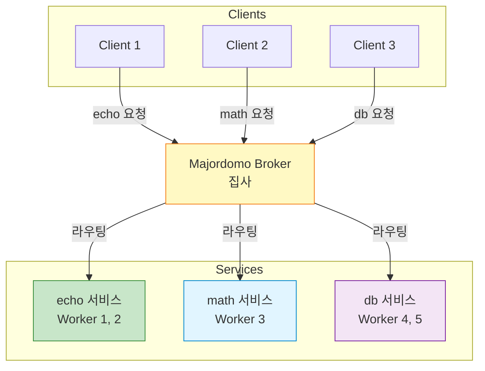
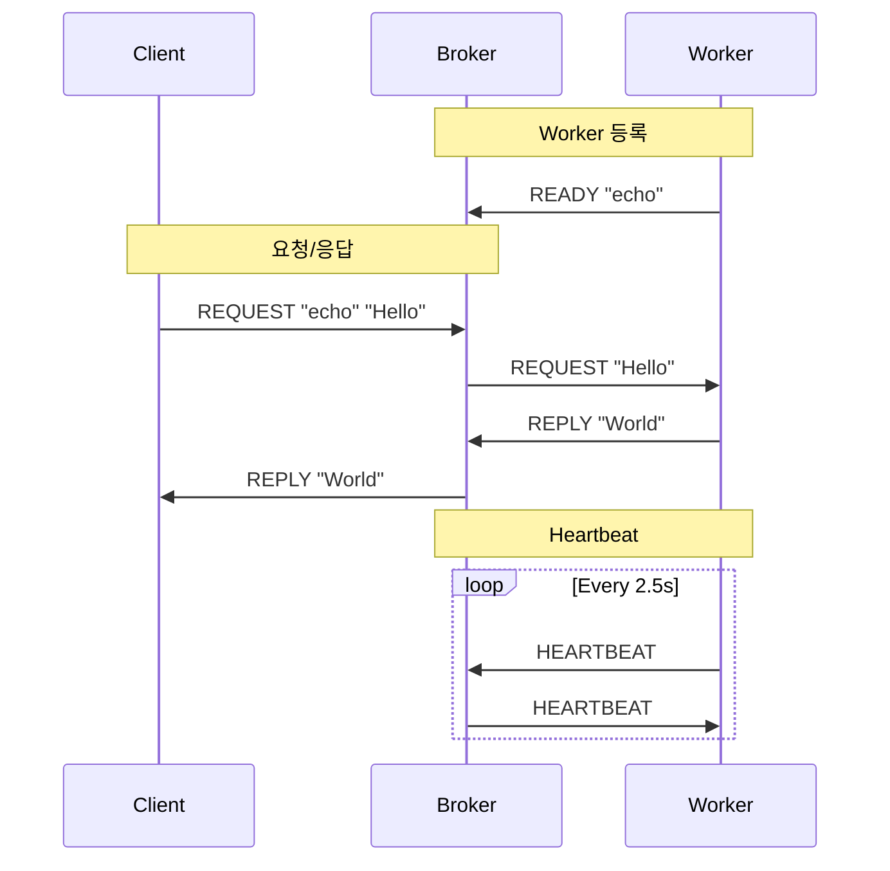
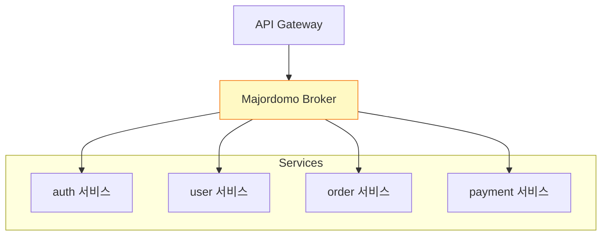

## 들어가며

**Majordomo Pattern (MDP)**은 ZeroMQ의 가장 강력한 패턴 중 하나입니다. **서비스 지향 아키텍처(SOA)**를 구현하며, 신뢰성과 확장성을 동시에 제공합니다.

## Majordomo란?

### 개념

**Majordomo**는 **집사**를 의미합니다. Broker가 집사 역할을 하여:
- **클라이언트**의 요청을 받아
- 적절한 **서비스 Worker**에게 전달하고
- **응답**을 다시 클라이언트에게 돌려줍니다



### 특징

- ✅ **서비스 검색**: 서비스 이름으로 자동 라우팅
- ✅ **신뢰성**: 하트비트로 Worker 생존 확인
- ✅ **확장성**: 서비스별 독립 확장
- ✅ **표준 프로토콜**: MDP (Majordomo Protocol)

## MDP (Majordomo Protocol)

### 프로토콜 구조



### 메시지 프레임 구조

**Client → Broker**:
```
[Client Identity]
[Empty]
["MDPC01"]          # Protocol version
[Service Name]      # "echo", "math", etc.
[Request Data]
```

**Broker → Worker**:
```
[Worker Identity]
[Empty]
["MDPW01"]          # Protocol version
[Command]           # READY, REQUEST, REPLY, HEARTBEAT, DISCONNECT
[Client Identity]   # (for REQUEST/REPLY)
[Empty]
[Request/Reply Data]
```

## Python 구현

### Majordomo Broker

```python
# mdp_broker.py
import zmq
import time
from collections import deque, defaultdict

MDP_CLIENT = b"MDPC01"
MDP_WORKER = b"MDPW01"

HEARTBEAT_INTERVAL = 2.5  # seconds
HEARTBEAT_LIVENESS = 3    # 3번 실패하면 죽은 것으로

class Service:
    """서비스별 Worker 관리"""
    def __init__(self, name):
        self.name = name
        self.requests = deque()      # 대기 중인 요청
        self.waiting = deque()       # 대기 중인 Worker

class Worker:
    """Worker 정보"""
    def __init__(self, identity, service):
        self.identity = identity
        self.service = service
        self.expiry = time.time() + HEARTBEAT_INTERVAL * HEARTBEAT_LIVENESS

class MajordomoBroker:
    def __init__(self):
        self.context = zmq.Context()
        self.socket = zmq.socket(zmq.ROUTER)
        self.socket.bind("tcp://*:5555")

        self.services = {}           # 서비스 이름 -> Service
        self.workers = {}            # Worker ID -> Worker
        self.waiting = deque()       # 모든 대기 Worker

        self.heartbeat_at = time.time() + HEARTBEAT_INTERVAL

    def run(self):
        """메인 루프"""
        poller = zmq.Poller()
        poller.register(self.socket, zmq.POLLIN)

        while True:
            socks = dict(poller.poll(1000))

            if self.socket in socks:
                frames = self.socket.recv_multipart()
                sender = frames[0]
                empty = frames[1]
                header = frames[2]

                if header == MDP_CLIENT:
                    self.process_client(sender, frames[3:])
                elif header == MDP_WORKER:
                    self.process_worker(sender, frames[3:])

            # Heartbeat 전송
            if time.time() > self.heartbeat_at:
                self.send_heartbeats()
                self.purge_workers()
                self.heartbeat_at = time.time() + HEARTBEAT_INTERVAL

    def process_client(self, sender, frames):
        """클라이언트 요청 처리"""
        service_name = frames[0].decode()
        request = frames[1:]

        print(f"📨 Client 요청: {service_name}")

        # 서비스 획득 또는 생성
        service = self.require_service(service_name)

        # 요청을 큐에 추가
        service.requests.append((sender, request))

        # Worker에게 전달
        self.dispatch(service)

    def process_worker(self, sender, frames):
        """Worker 메시지 처리"""
        command = frames[0]

        # Worker 등록 여부 확인
        worker_ready = sender in self.workers

        if command == b"READY":
            service_name = frames[1].decode()
            print(f"✅ Worker 등록: {sender.hex()[:4]} -> {service_name}")

            service = self.require_service(service_name)
            worker = Worker(sender, service)
            self.workers[sender] = worker
            self.worker_waiting(worker)

        elif command == b"REPLY" and worker_ready:
            client = frames[1]
            reply = frames[3:]

            print(f"📬 Worker 응답: {sender.hex()[:4]}")

            # Client에게 응답
            self.socket.send_multipart([
                client,
                b"",
                MDP_CLIENT,
                self.workers[sender].service.name.encode(),
                *reply
            ])

            self.worker_waiting(self.workers[sender])

        elif command == b"HEARTBEAT" and worker_ready:
            worker = self.workers[sender]
            worker.expiry = time.time() + HEARTBEAT_INTERVAL * HEARTBEAT_LIVENESS

        elif command == b"DISCONNECT":
            self.delete_worker(sender)

    def dispatch(self, service):
        """Worker가 사용 가능하면 요청 전달"""
        while service.waiting and service.requests:
            worker = service.waiting.popleft()
            self.waiting.remove(worker)

            client, request = service.requests.popleft()

            self.socket.send_multipart([
                worker.identity,
                b"",
                MDP_WORKER,
                b"REQUEST",
                client,
                b"",
                *request
            ])

    def worker_waiting(self, worker):
        """Worker를 대기 큐에 추가"""
        self.waiting.append(worker)
        worker.service.waiting.append(worker)
        worker.expiry = time.time() + HEARTBEAT_INTERVAL * HEARTBEAT_LIVENESS
        self.dispatch(worker.service)

    def require_service(self, name):
        """서비스 획득 또는 생성"""
        if name not in self.services:
            self.services[name] = Service(name)
        return self.services[name]

    def send_heartbeats(self):
        """모든 Worker에 Heartbeat 전송"""
        for worker in self.waiting:
            self.socket.send_multipart([
                worker.identity,
                b"",
                MDP_WORKER,
                b"HEARTBEAT"
            ])

    def purge_workers(self):
        """만료된 Worker 제거"""
        now = time.time()
        expired = [w for w in self.waiting if w.expiry < now]

        for worker in expired:
            print(f"⚠️ Worker 타임아웃: {worker.identity.hex()[:4]}")
            self.delete_worker(worker.identity)

    def delete_worker(self, identity):
        """Worker 삭제"""
        if identity in self.workers:
            worker = self.workers[identity]
            if worker in self.waiting:
                self.waiting.remove(worker)
            if worker in worker.service.waiting:
                worker.service.waiting.remove(worker)
            del self.workers[identity]

if __name__ == "__main__":
    broker = MajordomoBroker()
    print("Majordomo Broker 시작...")
    broker.run()
```

### Majordomo Worker

```python
# mdp_worker.py
import zmq
import time
import sys

MDP_WORKER = b"MDPW01"
HEARTBEAT_INTERVAL = 2.5
HEARTBEAT_LIVENESS = 3

class MajordomoWorker:
    def __init__(self, broker, service):
        self.broker = broker
        self.service = service
        self.context = zmq.Context()
        self.worker = None
        self.heartbeat_at = 0
        self.liveness = 0
        self.reconnect()

    def reconnect(self):
        """Broker에 재연결"""
        if self.worker:
            self.worker.close()

        self.worker = self.context.socket(zmq.DEALER)
        self.worker.connect(self.broker)

        print(f"Worker 연결: {self.broker}")

        # READY 전송
        self.worker.send_multipart([
            b"",
            MDP_WORKER,
            b"READY",
            self.service.encode()
        ])

        self.liveness = HEARTBEAT_LIVENESS
        self.heartbeat_at = time.time() + HEARTBEAT_INTERVAL

    def send_heartbeat(self):
        """Heartbeat 전송"""
        self.worker.send_multipart([
            b"",
            MDP_WORKER,
            b"HEARTBEAT"
        ])

    def recv(self, reply=None):
        """메시지 수신 (응답 전송 가능)"""
        # 응답 전송
        if reply:
            client = reply[0]
            data = reply[1]

            self.worker.send_multipart([
                b"",
                MDP_WORKER,
                b"REPLY",
                client,
                b"",
                data
            ])

        while True:
            poller = zmq.Poller()
            poller.register(self.worker, zmq.POLLIN)

            socks = dict(poller.poll(HEARTBEAT_INTERVAL * 1000))

            if socks.get(self.worker) == zmq.POLLIN:
                frames = self.worker.recv_multipart()

                # [Empty, MDPW01, Command, ...]
                empty = frames[0]
                header = frames[1]
                command = frames[2]

                if header != MDP_WORKER:
                    print("❌ 잘못된 헤더")
                    continue

                self.liveness = HEARTBEAT_LIVENESS

                if command == b"REQUEST":
                    # [Empty, MDPW01, REQUEST, Client, Empty, Data]
                    client = frames[3]
                    data = frames[5]
                    return [client, data]

                elif command == b"HEARTBEAT":
                    pass  # Liveness 갱신됨

                elif command == b"DISCONNECT":
                    self.reconnect()

            else:
                # Timeout
                self.liveness -= 1

                if self.liveness == 0:
                    print("⚠️ Broker 연결 끊김, 재연결...")
                    time.sleep(1)
                    self.reconnect()

            # Heartbeat 전송
            if time.time() > self.heartbeat_at:
                self.send_heartbeat()
                self.heartbeat_at = time.time() + HEARTBEAT_INTERVAL

if __name__ == "__main__":
    if len(sys.argv) < 2:
        print("Usage: python mdp_worker.py <service_name>")
        sys.exit(1)

    service = sys.argv[1]
    worker = MajordomoWorker("tcp://localhost:5555", service)

    print(f"Worker 시작: {service}")

    while True:
        request = worker.recv()
        if request:
            client, data = request
            print(f"처리: {data.decode()}")

            # 작업 처리
            time.sleep(1)
            reply = f"Processed: {data.decode()}"

            worker.recv([client, reply.encode()])
```

### Majordomo Client

```python
# mdp_client.py
import zmq

MDP_CLIENT = b"MDPC01"

class MajordomoClient:
    def __init__(self, broker):
        self.broker = broker
        self.context = zmq.Context()
        self.client = self.context.socket(zmq.REQ)
        self.client.connect(broker)

    def send(self, service, request):
        """서비스 요청"""
        self.client.send_multipart([
            MDP_CLIENT,
            service.encode(),
            request.encode()
        ])

        # 응답 대기
        frames = self.client.recv_multipart()
        # [MDPC01, Service, Reply]
        return frames[2].decode()

if __name__ == "__main__":
    client = MajordomoClient("tcp://localhost:5555")

    # echo 서비스 호출
    for i in range(5):
        reply = client.send("echo", f"Hello {i}")
        print(f"응답: {reply}")

    # math 서비스 호출
    reply = client.send("math", "2 + 2")
    print(f"계산: {reply}")
```

## C 구현 (간소화)

**Worker**:

```c
// mdp_worker.c
#include <zmq.h>
#include <stdio.h>
#include <string.h>
#include <unistd.h>

#define MDP_WORKER "MDPW01"

int main(int argc, char *argv[]) {
    if (argc < 2) {
        printf("Usage: %s <service>\n", argv[0]);
        return 1;
    }

    char *service = argv[1];

    void *context = zmq_ctx_new();
    void *worker = zmq_socket(context, ZMQ_DEALER);
    zmq_connect(worker, "tcp://localhost:5555");

    printf("Worker 시작: %s\n", service);

    // READY 전송
    zmq_send(worker, "", 0, ZMQ_SNDMORE);
    zmq_send(worker, MDP_WORKER, 6, ZMQ_SNDMORE);
    zmq_send(worker, "READY", 5, ZMQ_SNDMORE);
    zmq_send(worker, service, strlen(service), 0);

    while (1) {
        zmq_msg_t frames[10];
        int frame_count = 0;

        // 메시지 수신
        while (1) {
            zmq_msg_init(&frames[frame_count]);
            zmq_msg_recv(&frames[frame_count], worker, 0);

            int more = zmq_msg_more(&frames[frame_count]);
            frame_count++;

            if (!more)
                break;
        }

        // REQUEST 처리
        if (frame_count >= 6) {
            // [Empty, MDPW01, REQUEST, Client, Empty, Data]
            char *data = (char *)zmq_msg_data(&frames[5]);
            int size = zmq_msg_size(&frames[5]);

            printf("처리: %.*s\n", size, data);
            sleep(1);

            // REPLY 전송
            zmq_send(worker, "", 0, ZMQ_SNDMORE);
            zmq_send(worker, MDP_WORKER, 6, ZMQ_SNDMORE);
            zmq_send(worker, "REPLY", 5, ZMQ_SNDMORE);
            zmq_msg_send(&frames[3], worker, ZMQ_SNDMORE);  // Client
            zmq_send(worker, "", 0, ZMQ_SNDMORE);
            zmq_send(worker, "OK", 2, 0);
        }

        // 정리
        for (int i = 0; i < frame_count; i++) {
            zmq_msg_close(&frames[i]);
        }
    }

    zmq_close(worker);
    zmq_ctx_destroy(context);
    return 0;
}
```

## 실전 사용 사례

### 1. 마이크로서비스 아키텍처



### 2. 분산 컴퓨팅

```python
# 이미지 처리 서비스
worker = MajordomoWorker("tcp://broker:5555", "image_process")

while True:
    request = worker.recv()
    if request:
        client, image_data = request

        # 이미지 처리
        processed = process_image(image_data)

        worker.recv([client, processed])
```

### 3. 동적 서비스 검색

```python
# Client가 서비스 이름만 알면 됨
client = MajordomoClient("tcp://localhost:5555")

# 어떤 Worker가 처리할지 몰라도 됨
reply = client.send("translate", "Hello")  # 번역 서비스
reply = client.send("ocr", image_data)     # OCR 서비스
```

## Majordomo vs 다른 패턴

| 항목 | Basic REQ-REP | LRU Queue | Majordomo |
|------|---------------|-----------|-----------|
| **서비스 구분** | ❌ | ❌ | ✅ |
| **신뢰성** | ❌ | ⭐⭐ | ⭐⭐⭐ |
| **하트비트** | ❌ | 선택적 | ✅ |
| **표준 프로토콜** | ❌ | ❌ | ✅ (MDP) |
| **복잡도** | ⭐ | ⭐⭐ | ⭐⭐⭐⭐ |

## 다음 단계

Majordomo 패턴을 마스터했습니다! 다음 글에서는:
- **Titanic 패턴** - 디스크 기반 신뢰성
- 영구 저장소를 사용한 메시지 큐잉
- 오프라인 클라이언트 지원

---

**시리즈 목차**
1. ZeroMQ란 무엇인가 - 고성능 메시징 라이브러리
2. ZeroMQ 메시징 패턴 - REQ/REP, PUB/SUB, PUSH/PULL
3. ZeroMQ 고급 패턴 - ROUTER, DEALER, PROXY
4. ZeroMQ 실전 활용 - 분산 시스템 구축
5. ZeroMQ 성능 최적화 및 보안
6. ZeroMQ 신뢰성 패턴 - Lazy Pirate, Simple Pirate, Paranoid Pirate
7. ZeroMQ 로드 밸런싱 - LRU Queue와 동적 워커 관리
8. **ZeroMQ Majordomo 패턴 - 서비스 지향 신뢰성 큐잉** ← 현재 글
9. ZeroMQ Titanic 패턴 (다음 글)

> 💡 **Quick Tip**: Majordomo는 마이크로서비스 아키텍처에 완벽합니다. 서비스 이름만으로 자동 라우팅!
