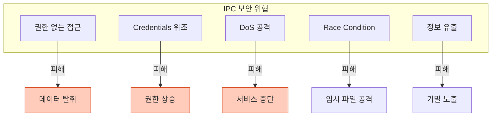

## 들어가며

**IPC 보안**은 중요하지만 종종 간과됩니다. 잘못된 권한 설정은 권한 상승(Privilege Escalation), 정보 유출, 서비스 거부(DoS) 공격으로 이어질 수 있습니다.

## IPC 보안 위협

### 주요 공격 벡터



## 권한 관리

### POSIX IPC 권한

```c
// posix_permissions.c
#include <stdio.h>
#include <fcntl.h>
#include <sys/mman.h>
#include <sys/stat.h>

int main() {
    // Shared Memory with specific permissions
    int shm_fd = shm_open("/secure_shm",
                          O_CREAT | O_RDWR,
                          0600);  // rw------- (owner only)

    if (shm_fd == -1) {
        perror("shm_open");
        return 1;
    }

    // 권한 확인
    struct stat st;
    fstat(shm_fd, &st);

    printf("권한: %o\n", st.st_mode & 0777);
    printf("Owner UID: %d\n", st.st_uid);
    printf("Group GID: %d\n", st.st_gid);

    // 런타임 권한 변경
    fchmod(shm_fd, 0644);  // rw-r--r--

    close(shm_fd);
    shm_unlink("/secure_shm");

    return 0;
}
```

### 권한 모드

| 모드 | 8진수 | 설명 | 용도 |
|------|-------|------|------|
| `rw-------` | 0600 | Owner만 읽기/쓰기 | **보안 중요** |
| `rw-r--r--` | 0644 | Owner 쓰기, 모두 읽기 | 읽기 전용 공유 |
| `rw-rw----` | 0660 | Owner/Group 읽기/쓰기 | 그룹 협업 |
| `rw-rw-rw-` | 0666 | 모두 읽기/쓰기 | ⚠️ 위험 |

```bash
# POSIX 권한 확인
ls -l /dev/shm/
# -rw------- 1 user user 1024 ... secure_shm (안전)
# -rw-rw-rw- 1 user user 1024 ... public_shm (위험)
```

### System V IPC 권한

```c
// sysv_permissions.c
#include <stdio.h>
#include <sys/ipc.h>
#include <sys/shm.h>
#include <sys/msg.h>

int main() {
    // 공유 메모리 생성 (0600)
    int shmid = shmget(IPC_PRIVATE, 1024, IPC_CREAT | 0600);

    // 권한 확인
    struct shmid_ds buf;
    shmctl(shmid, IPC_STAT, &buf);

    printf("권한: %o\n", buf.shm_perm.mode & 0777);
    printf("Owner UID: %d\n", buf.shm_perm.uid);
    printf("Creator UID: %d\n", buf.shm_perm.cuid);

    // 런타임 권한 변경
    buf.shm_perm.mode = 0644;
    shmctl(shmid, IPC_SET, &buf);

    // 소유자 변경 (root 필요)
    // buf.shm_perm.uid = 1000;
    // shmctl(shmid, IPC_SET, &buf);

    shmctl(shmid, IPC_RMID, NULL);

    return 0;
}
```

```bash
# System V 권한 확인
ipcs -m

# 출력:
# key        shmid   owner  perms  bytes
# 0x00000000 32768   user   600    1024   ✅ 안전
# 0x00000000 32769   user   666    1024   ⚠️ 위험
```

## Credentials Passing

### SCM_CREDENTIALS (Linux)

```c
// credentials_verify.c
#include <stdio.h>
#include <stdlib.h>
#include <string.h>
#include <unistd.h>
#include <sys/socket.h>
#include <sys/un.h>

#define SOCKET_PATH "/tmp/secure_socket"

// 서버: Credentials 검증
int server() {
    int server_fd = socket(AF_UNIX, SOCK_STREAM, 0);

    // SO_PASSCRED 활성화
    int on = 1;
    setsockopt(server_fd, SOL_SOCKET, SO_PASSCRED, &on, sizeof(on));

    struct sockaddr_un addr = {0};
    addr.sun_family = AF_UNIX;
    strncpy(addr.sun_path, SOCKET_PATH, sizeof(addr.sun_path) - 1);

    unlink(SOCKET_PATH);
    bind(server_fd, (struct sockaddr*)&addr, sizeof(addr));
    listen(server_fd, 5);

    // 연결 수락
    int client_fd = accept(server_fd, NULL, NULL);

    // Credentials 수신
    struct msghdr msg = {0};
    struct iovec iov[1];
    char buf[100];
    char cmsgbuf[CMSG_SPACE(sizeof(struct ucred))];

    iov[0].iov_base = buf;
    iov[0].iov_len = sizeof(buf);
    msg.msg_iov = iov;
    msg.msg_iovlen = 1;
    msg.msg_control = cmsgbuf;
    msg.msg_controllen = sizeof(cmsgbuf);

    recvmsg(client_fd, &msg, 0);

    // Credentials 검증
    struct cmsghdr *cmsg = CMSG_FIRSTHDR(&msg);
    if (cmsg && cmsg->cmsg_type == SCM_CREDENTIALS) {
        struct ucred *cred = (struct ucred*)CMSG_DATA(cmsg);

        printf("클라이언트 Credentials:\n");
        printf("  PID: %d\n", cred->pid);
        printf("  UID: %d\n", cred->uid);
        printf("  GID: %d\n", cred->gid);

        // 검증
        if (cred->uid == 0) {
            printf("✅ Root 사용자 - 허용\n");
        } else if (cred->uid == getuid()) {
            printf("✅ 동일 사용자 - 허용\n");
        } else {
            printf("❌ 권한 없음 - 거부\n");
            close(client_fd);
            close(server_fd);
            return 1;
        }
    }

    printf("메시지: %s\n", buf);

    close(client_fd);
    close(server_fd);
    unlink(SOCKET_PATH);

    return 0;
}

// 클라이언트: Credentials 전송
int client() {
    sleep(1);  // 서버 시작 대기

    int client_fd = socket(AF_UNIX, SOCK_STREAM, 0);

    struct sockaddr_un addr = {0};
    addr.sun_family = AF_UNIX;
    strncpy(addr.sun_path, SOCKET_PATH, sizeof(addr.sun_path) - 1);

    connect(client_fd, (struct sockaddr*)&addr, sizeof(addr));

    // Credentials 전송
    struct msghdr msg = {0};
    struct iovec iov[1];
    char buf[] = "안전한 메시지";
    char cmsgbuf[CMSG_SPACE(sizeof(struct ucred))];

    iov[0].iov_base = buf;
    iov[0].iov_len = sizeof(buf);
    msg.msg_iov = iov;
    msg.msg_iovlen = 1;
    msg.msg_control = cmsgbuf;
    msg.msg_controllen = sizeof(cmsgbuf);

    struct cmsghdr *cmsg = CMSG_FIRSTHDR(&msg);
    cmsg->cmsg_level = SOL_SOCKET;
    cmsg->cmsg_type = SCM_CREDENTIALS;
    cmsg->cmsg_len = CMSG_LEN(sizeof(struct ucred));

    struct ucred *cred = (struct ucred*)CMSG_DATA(cmsg);
    cred->pid = getpid();
    cred->uid = getuid();
    cred->gid = getgid();

    sendmsg(client_fd, &msg, 0);

    close(client_fd);

    return 0;
}

int main() {
    if (fork() == 0) {
        client();
        exit(0);
    } else {
        server();
        wait(NULL);
    }

    return 0;
}
```

### 실행

```bash
gcc -o cred_verify credentials_verify.c
./cred_verify

# 출력:
# 클라이언트 Credentials:
#   PID: 12345
#   UID: 1000
#   GID: 1000
# ✅ 동일 사용자 - 허용
# 메시지: 안전한 메시지
```

## 접근 제어 리스트 (ACL)

### setfacl/getfacl 사용

```bash
# POSIX Shared Memory ACL 설정
shm_open() 후:

# 특정 사용자 추가
setfacl -m u:alice:rw /dev/shm/my_shm

# 특정 그룹 추가
setfacl -m g:developers:r /dev/shm/my_shm

# ACL 확인
getfacl /dev/shm/my_shm

# 출력:
# user::rw-
# user:alice:rw-
# group::r--
# group:developers:r--
# mask::rw-
# other::---
```

### 코드에서 ACL 설정

```c
// acl_example.c
#include <sys/acl.h>
#include <fcntl.h>
#include <sys/mman.h>

int main() {
    int shm_fd = shm_open("/acl_shm", O_CREAT | O_RDWR, 0600);

    // ACL 생성
    acl_t acl = acl_init(3);

    // Owner: rw-
    acl_entry_t entry;
    acl_create_entry(&acl, &entry);
    acl_set_tag_type(entry, ACL_USER_OBJ);
    acl_permset_t permset;
    acl_get_permset(entry, &permset);
    acl_add_perm(permset, ACL_READ | ACL_WRITE);

    // 특정 사용자: r--
    acl_create_entry(&acl, &entry);
    acl_set_tag_type(entry, ACL_USER);
    acl_set_qualifier(entry, &(uid_t){1001});  // UID 1001
    acl_get_permset(entry, &permset);
    acl_add_perm(permset, ACL_READ);

    // ACL 적용
    acl_set_fd(shm_fd, acl);

    acl_free(acl);
    close(shm_fd);

    return 0;
}
```

## 보안 취약점과 대응

### 1. Race Condition (TOCTOU)

```c
// ❌ 취약한 코드
if (access("/tmp/myfile", W_OK) == 0) {
    // 여기서 공격자가 파일을 심볼릭 링크로 변경 가능!
    int fd = open("/tmp/myfile", O_WRONLY);
    write(fd, data, size);
}

// ✅ 안전한 코드
int fd = open("/tmp/myfile", O_WRONLY | O_NOFOLLOW);
if (fd != -1) {
    // 심볼릭 링크 차단
    struct stat st;
    fstat(fd, &st);

    if (S_ISREG(st.st_mode) && st.st_uid == getuid()) {
        write(fd, data, size);
    }
    close(fd);
}
```

### 2. 임시 파일 공격

```c
// ❌ 취약: 예측 가능한 이름
char *path = "/tmp/myapp_socket";
int fd = open(path, O_CREAT | O_RDWR, 0600);

// ✅ 안전: mkstemp 사용
char template[] = "/tmp/myapp_XXXXXX";
int fd = mkstemp(template);

// 또는 PID 사용
char path[256];
snprintf(path, sizeof(path), "/tmp/myapp_%d", getpid());
```

### 3. 정보 유출

```c
// ❌ 취약: 민감 데이터가 공유 메모리에 남음
struct sensitive_data {
    char password[64];
    char api_key[128];
};

void *shm = mmap(...);
struct sensitive_data *data = (struct sensitive_data*)shm;
strcpy(data->password, "secret123");

munmap(shm, size);  // 데이터가 그대로 남아있음!

// ✅ 안전: 사용 후 제로화
memset(data, 0, sizeof(struct sensitive_data));
munmap(shm, size);

// 더 안전: explicit_bzero (최적화 방지)
explicit_bzero(data, sizeof(struct sensitive_data));
```

## 네임스페이스 격리

### PID 네임스페이스

```c
// pid_namespace.c
#define _GNU_SOURCE
#include <sched.h>
#include <stdio.h>
#include <unistd.h>
#include <sys/wait.h>

int child_func(void *arg) {
    printf("자식 PID (내부): %d\n", getpid());  // 1
    sleep(5);
    return 0;
}

int main() {
    const int STACK_SIZE = 1024 * 1024;
    char *stack = malloc(STACK_SIZE);

    // PID 네임스페이스 생성
    pid_t pid = clone(child_func,
                      stack + STACK_SIZE,
                      CLONE_NEWPID | SIGCHLD,
                      NULL);

    printf("자식 PID (외부): %d\n", pid);  // 실제 PID

    waitpid(pid, NULL, 0);
    free(stack);

    return 0;
}
```

### IPC 네임스페이스

```bash
# 격리된 IPC 네임스페이스 생성
unshare --ipc /bin/bash

# 이 쉘에서 생성한 IPC는 외부에서 안 보임
ipcs -a  # 빈 목록
```

## SELinux / AppArmor

### SELinux 컨텍스트

```bash
# SELinux 컨텍스트 확인
ls -Z /dev/shm/
# -rw-r--r-- user user unconfined_u:object_r:tmpfs_t:s0 my_shm

# 컨텍스트 변경
chcon -t user_tmp_t /dev/shm/my_shm

# 정책 확인
sesearch -A -s my_app_t -t tmpfs_t -c file
```

### AppArmor 프로파일

```
# /etc/apparmor.d/usr.bin.myapp
#include <tunables/global>

/usr/bin/myapp {
  #include <abstractions/base>

  # IPC 접근 제한
  /dev/shm/myapp_* rw,
  deny /dev/shm/** rw,

  # Unix socket 제한
  /tmp/myapp_socket rw,
  deny /tmp/** rw,

  # 네트워크 차단
  deny network inet,
}
```

```bash
# 프로파일 적용
apparmor_parser -r /etc/apparmor.d/usr.bin.myapp

# 상태 확인
aa-status
```

## 감사 및 모니터링

### auditd 설정

```bash
# IPC 접근 감사
auditctl -a exit,always -F arch=b64 -S msgget -S shmget -S semget

# 특정 파일 감시
auditctl -w /dev/shm/ -p rwa -k shm_access

# 로그 확인
ausearch -k shm_access
```

### 코드 레벨 로깅

```c
// secure_logging.c
#include <syslog.h>

void log_ipc_access(const char *ipc_name, uid_t uid, const char *action) {
    openlog("myapp", LOG_PID, LOG_USER);

    syslog(LOG_INFO,
           "IPC access: name=%s, uid=%d, action=%s",
           ipc_name, uid, action);

    closelog();
}

int main() {
    uid_t caller_uid = getuid();

    log_ipc_access("/myqueue", caller_uid, "open");

    mqd_t mq = mq_open("/myqueue", O_CREAT | O_RDWR, 0600, NULL);

    if (mq == (mqd_t)-1) {
        log_ipc_access("/myqueue", caller_uid, "open_failed");
        return 1;
    }

    log_ipc_access("/myqueue", caller_uid, "opened");

    // ...

    mq_close(mq);
    log_ipc_access("/myqueue", caller_uid, "closed");

    return 0;
}
```

## 보안 체크리스트

### 개발 단계

```
✅ 권한 설정
  [ ] IPC 객체 생성 시 최소 권한 (0600)
  [ ] 런타임 권한 변경 검증
  [ ] ACL 필요 시 적용

✅ Credentials 검증
  [ ] SCM_CREDENTIALS로 검증
  [ ] UID/GID 화이트리스트 관리
  [ ] PID 검증 (필요 시)

✅ 데이터 보호
  [ ] 민감 데이터 사용 후 제로화
  [ ] 암호화 (필요 시)
  [ ] 메모리 덤프 방지

✅ 임시 파일
  [ ] mkstemp() 또는 PID 기반 이름
  [ ] O_NOFOLLOW 플래그
  [ ] 사용 후 즉시 unlink()

✅ 에러 처리
  [ ] 모든 시스템 콜 반환값 체크
  [ ] 실패 시 안전하게 종료
  [ ] 에러 메시지에 민감 정보 노출 금지
```

### 운영 단계

```
✅ 모니터링
  [ ] auditd로 IPC 접근 감사
  [ ] 비정상 패턴 탐지
  [ ] 정기적 권한 검토

✅ 격리
  [ ] 네임스페이스 사용
  [ ] SELinux/AppArmor 정책
  [ ] 컨테이너 격리

✅ 업데이트
  [ ] 정기적 보안 패치
  [ ] 취약점 스캔
  [ ] 코드 리뷰
```

## 실전 예제: 안전한 IPC 서버

```c
// secure_ipc_server.c
#include <stdio.h>
#include <stdlib.h>
#include <string.h>
#include <unistd.h>
#include <sys/socket.h>
#include <sys/un.h>
#include <syslog.h>

#define SOCKET_PATH "/tmp/secure_server"
#define MAX_CLIENTS 10

typedef struct {
    uid_t allowed_uids[MAX_CLIENTS];
    int count;
} whitelist_t;

whitelist_t whitelist = {
    .allowed_uids = {0, 1000},  // root와 UID 1000
    .count = 2
};

int verify_client(struct ucred *cred) {
    for (int i = 0; i < whitelist.count; i++) {
        if (cred->uid == whitelist.allowed_uids[i]) {
            return 1;  // 허용
        }
    }
    return 0;  // 거부
}

int main() {
    openlog("secure_server", LOG_PID, LOG_USER);

    // 소켓 생성
    int server_fd = socket(AF_UNIX, SOCK_STREAM, 0);

    // SO_PASSCRED 활성화
    int on = 1;
    setsockopt(server_fd, SOL_SOCKET, SO_PASSCRED, &on, sizeof(on));

    // Bind (안전한 권한)
    struct sockaddr_un addr = {0};
    addr.sun_family = AF_UNIX;
    snprintf(addr.sun_path, sizeof(addr.sun_path),
             "%s_%d", SOCKET_PATH, getpid());

    unlink(addr.sun_path);
    bind(server_fd, (struct sockaddr*)&addr, sizeof(addr));

    // 권한 설정 (owner만)
    chmod(addr.sun_path, 0600);

    listen(server_fd, 5);

    syslog(LOG_INFO, "서버 시작: %s", addr.sun_path);

    while (1) {
        int client_fd = accept(server_fd, NULL, NULL);

        // Credentials 수신 및 검증
        struct ucred cred;
        socklen_t len = sizeof(cred);
        getsockopt(client_fd, SOL_SOCKET, SO_PEERCRED, &cred, &len);

        if (!verify_client(&cred)) {
            syslog(LOG_WARNING,
                   "접근 거부: UID=%d, PID=%d",
                   cred.uid, cred.pid);
            close(client_fd);
            continue;
        }

        syslog(LOG_INFO,
               "클라이언트 허용: UID=%d, PID=%d",
               cred.uid, cred.pid);

        // 요청 처리...

        close(client_fd);
    }

    close(server_fd);
    unlink(addr.sun_path);
    closelog();

    return 0;
}
```

## 다음 단계

IPC 보안을 완벽히 이해했습니다! 다음 글에서는:
- **IPC 디버깅** - strace, ipcs, 메모리 누수 탐지
- 일반적인 함정과 해결 방법
- 프로덕션 디버깅 기법

---

**시리즈 목차**
1. IPC란 무엇인가
2. IPC 메커니즘 전체 개요
3. Pipe - 가장 기본적인 IPC
4. Named Pipe (FIFO)
5. Signal - 비동기 이벤트 통신
6. Shared Memory - 공유 메모리
7. Message Queue 심화
8. Semaphore 심화
9. Unix Domain Socket
10. Memory-Mapped Files
11. IPC 메커니즘 성능 비교
12. 동기화 기법
13. POSIX vs System V IPC
14. **IPC 보안** ← 현재 글
15. IPC 디버깅 (다음 글)

> 💡 **Quick Tip**: IPC 객체는 항상 최소 권한(0600)으로 생성하세요. SCM_CREDENTIALS로 클라이언트를 검증하고, 민감 데이터는 사용 후 explicit_bzero()로 제로화하세요!
