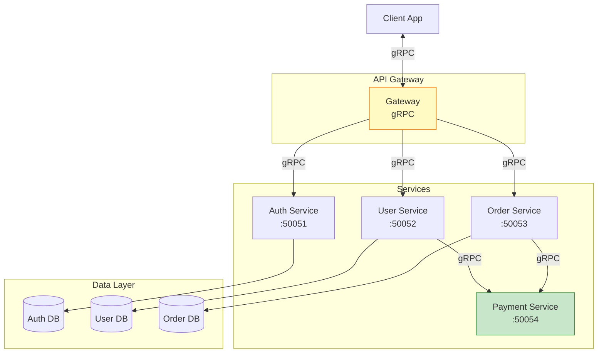
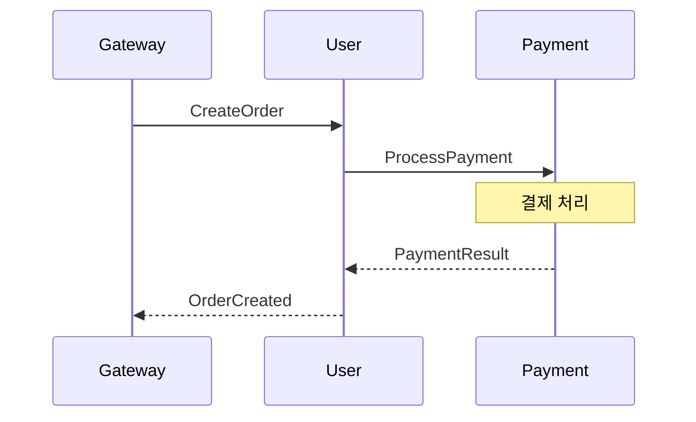
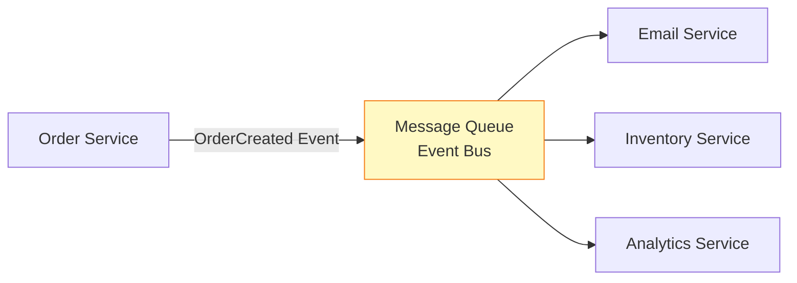
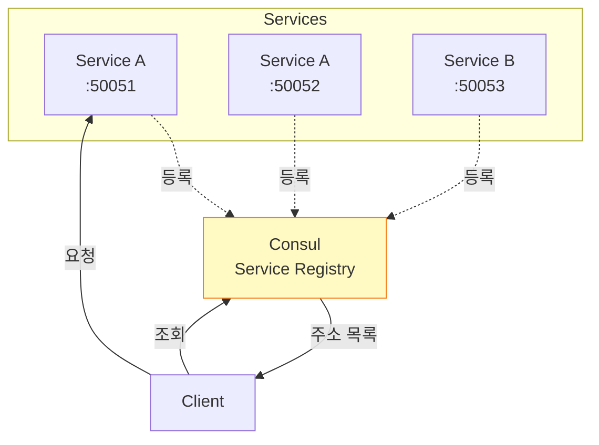
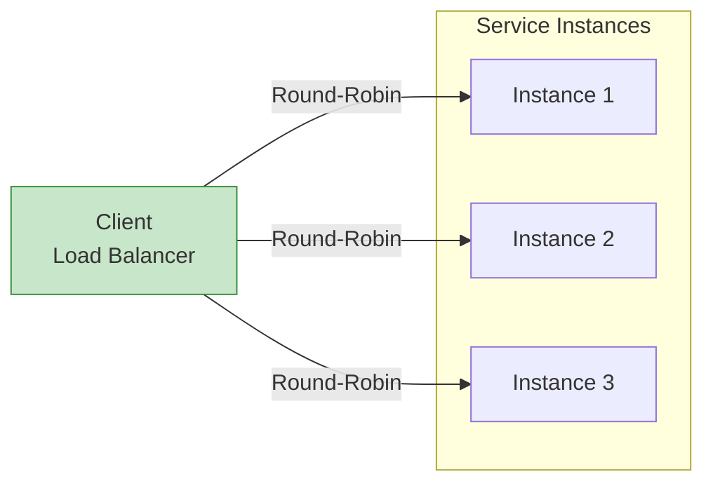
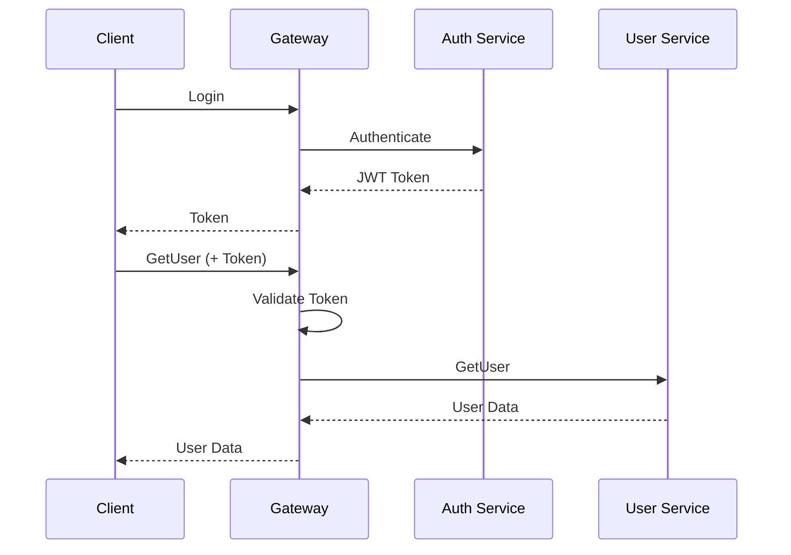
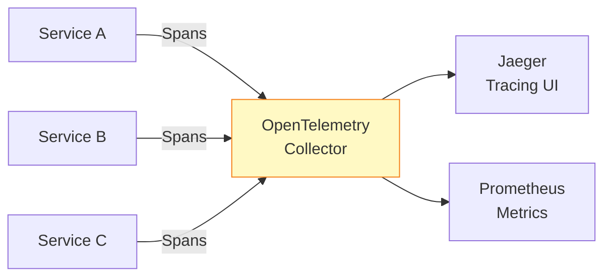

## 들어가며

이론을 넘어 **실전** 마이크로서비스로! Protobuf와 gRPC로 확장 가능하고 안정적인 시스템을 구축합니다.

## 마이크로서비스 아키텍처

### 전체 구조



## Proto 파일 구조

### 디렉토리 구조

```
proto/
├── common/
│   ├── types.proto       # 공통 타입
│   └── errors.proto      # 에러 정의
├── auth/
│   └── auth.proto        # 인증 서비스
├── user/
│   └── user.proto        # 사용자 서비스
├── order/
│   └── order.proto       # 주문 서비스
└── payment/
    └── payment.proto     # 결제 서비스
```

### common/types.proto

```protobuf
syntax = "proto3";
package common;

import "google/protobuf/timestamp.proto";

message Pagination {
  int32 page = 1;
  int32 page_size = 2;
}

message Metadata {
  string request_id = 1;
  google.protobuf.Timestamp created_at = 2;
  map<string, string> tags = 3;
}
```

### auth/auth.proto

```protobuf
syntax = "proto3";
package auth;

service AuthService {
  rpc Login (LoginRequest) returns (LoginResponse);
  rpc ValidateToken (ValidateTokenRequest) returns (ValidateTokenResponse);
  rpc Logout (LogoutRequest) returns (LogoutResponse);
}

message LoginRequest {
  string username = 1;
  string password = 2;
}

message LoginResponse {
  string token = 1;
  int64 expires_at = 2;
  User user = 3;
}

message User {
  string id = 1;
  string username = 2;
  repeated string roles = 3;
}

message ValidateTokenRequest {
  string token = 1;
}

message ValidateTokenResponse {
  bool valid = 1;
  User user = 2;
}

message LogoutRequest {
  string token = 1;
}

message LogoutResponse {
  bool success = 1;
}
```

### user/user.proto

```protobuf
syntax = "proto3";
package user;

import "common/types.proto";

service UserService {
  rpc GetUser (GetUserRequest) returns (GetUserResponse);
  rpc ListUsers (ListUsersRequest) returns (ListUsersResponse);
  rpc CreateUser (CreateUserRequest) returns (CreateUserResponse);
  rpc UpdateUser (UpdateUserRequest) returns (UpdateUserResponse);
  rpc DeleteUser (DeleteUserRequest) returns (DeleteUserResponse);
}

message GetUserRequest {
  string user_id = 1;
}

message GetUserResponse {
  User user = 1;
}

message ListUsersRequest {
  common.Pagination pagination = 1;
  string filter = 2;
}

message ListUsersResponse {
  repeated User users = 1;
  int32 total = 2;
}

message User {
  string id = 1;
  string name = 2;
  string email = 3;
  google.protobuf.Timestamp created_at = 4;
  google.protobuf.Timestamp updated_at = 5;
}

// 나머지 메시지...
```

## 서비스 간 통신

### 1. Synchronous (동기)



**구현**:

```cpp
// User Service에서 Payment Service 호출
Status CreateOrder(ServerContext* context,
                   const CreateOrderRequest* request,
                   CreateOrderResponse* response) {
  // Payment Service에 연결
  auto payment_channel = grpc::CreateChannel(
      "payment-service:50054",
      grpc::InsecureChannelCredentials());

  auto payment_stub = Payment::NewStub(payment_channel);

  // Payment 요청
  PaymentRequest payment_req;
  payment_req.set_amount(request->amount());
  payment_req.set_user_id(request->user_id());

  PaymentResponse payment_resp;
  ClientContext payment_ctx;

  Status payment_status = payment_stub->ProcessPayment(
      &payment_ctx, payment_req, &payment_resp);

  if (payment_status.ok()) {
    // 주문 생성
    response->set_order_id(GenerateOrderId());
    response->set_status("COMPLETED");
  } else {
    return Status(grpc::StatusCode::FAILED_PRECONDITION,
                  "Payment failed");
  }

  return Status::OK;
}
```

### 2. Asynchronous (비동기 - 이벤트 기반)



**Proto 정의 (이벤트)**:

```protobuf
// events.proto
syntax = "proto3";
package events;

import "google/protobuf/timestamp.proto";
import "google/protobuf/any.proto";

message Event {
  string event_id = 1;
  string event_type = 2;  // "OrderCreated", "PaymentProcessed"
  google.protobuf.Timestamp occurred_at = 3;
  google.protobuf.Any payload = 4;
}

message OrderCreatedEvent {
  string order_id = 1;
  string user_id = 2;
  double amount = 3;
}
```

## 서비스 디스커버리

### Consul과 gRPC



**등록**:

```cpp
// Service 시작 시 Consul에 등록
#include <consul/consul.h>

void RegisterService() {
  consul::Client client("localhost:8500");

  consul::ServiceDefinition service;
  service.name = "user-service";
  service.id = "user-service-1";
  service.address = "192.168.1.10";
  service.port = 50052;

  // Health check
  service.check.grpc = "192.168.1.10:50052";
  service.check.interval = "10s";

  client.RegisterService(service);
}
```

**조회**:

```cpp
// Client에서 서비스 찾기
consul::Client client("localhost:8500");
auto services = client.GetService("user-service");

for (const auto& service : services) {
  std::string address = service.address + ":" +
                        std::to_string(service.port);

  auto channel = grpc::CreateChannel(
      address, grpc::InsecureChannelCredentials());

  // 사용...
}
```

## 로드 밸런싱

### Client-side Load Balancing



**gRPC 내장 로드 밸런싱**:

```cpp
// DNS resolver 사용
grpc::ChannelArguments args;
args.SetLoadBalancingPolicyName("round_robin");

auto channel = grpc::CreateCustomChannel(
    "dns:///user-service:50052",  // DNS 기반
    grpc::InsecureChannelCredentials(),
    args);
```

### Server-side Load Balancing (Nginx)

```nginx
# nginx.conf
upstream user_service {
    server user-service-1:50052;
    server user-service-2:50052;
    server user-service-3:50052;
}

server {
    listen 50051 http2;

    location / {
        grpc_pass grpc://user_service;
    }
}
```

## 인증 및 권한

### JWT 토큰 기반 인증



**Interceptor 구현**:

```cpp
class AuthInterceptor : public grpc::experimental::Interceptor {
 public:
  void Intercept(grpc::experimental::InterceptorBatchMethods* methods) override {
    if (methods->QueryInterceptionHookPoint(
            grpc::experimental::InterceptionHookPoints::PRE_SEND_INITIAL_METADATA)) {

      // 메타데이터에서 토큰 추출
      auto metadata = methods->GetSendInitialMetadata();
      auto auth_header = metadata->find("authorization");

      if (auth_header != metadata->end()) {
        std::string token = std::string(auth_header->second.data(),
                                        auth_header->second.length());

        if (!ValidateToken(token)) {
          methods->Fail(Status(grpc::StatusCode::UNAUTHENTICATED,
                               "Invalid token"));
          return;
        }
      } else {
        methods->Fail(Status(grpc::StatusCode::UNAUTHENTICATED,
                             "Missing authorization header"));
        return;
      }
    }

    methods->Proceed();
  }

 private:
  bool ValidateToken(const std::string& token) {
    // JWT 검증 로직
    return true;
  }
};
```

## Health Check

### Proto 정의

```protobuf
// health.proto (gRPC 표준)
syntax = "proto3";

package grpc.health.v1;

service Health {
  rpc Check (HealthCheckRequest) returns (HealthCheckResponse);
  rpc Watch (HealthCheckRequest) returns (stream HealthCheckResponse);
}

message HealthCheckRequest {
  string service = 1;
}

message HealthCheckResponse {
  enum ServingStatus {
    UNKNOWN = 0;
    SERVING = 1;
    NOT_SERVING = 2;
  }
  ServingStatus status = 1;
}
```

**구현**:

```cpp
class HealthServiceImpl final : public Health::Service {
  Status Check(ServerContext* context,
               const HealthCheckRequest* request,
               HealthCheckResponse* response) override {

    // 서비스 상태 확인
    bool db_healthy = CheckDatabaseConnection();
    bool cache_healthy = CheckCacheConnection();

    if (db_healthy && cache_healthy) {
      response->set_status(HealthCheckResponse::SERVING);
    } else {
      response->set_status(HealthCheckResponse::NOT_SERVING);
    }

    return Status::OK;
  }
};
```

## 모니터링 및 트레이싱

### OpenTelemetry와 gRPC



## Docker Compose 배포

```yaml
version: '3.8'

services:
  auth-service:
    build: ./services/auth
    ports:
      - "50051:50051"
    environment:
      - DATABASE_URL=postgres://user:pass@db:5432/auth

  user-service:
    build: ./services/user
    ports:
      - "50052:50052"
    depends_on:
      - auth-service

  order-service:
    build: ./services/order
    ports:
      - "50053:50053"
    depends_on:
      - user-service

  payment-service:
    build: ./services/payment
    ports:
      - "50054:50054"

  consul:
    image: consul:latest
    ports:
      - "8500:8500"

  db:
    image: postgres:14
    environment:
      POSTGRES_PASSWORD: password
```

## 다음 단계

실전 마이크로서비스 구축을 완료했습니다! 다음 글에서는:
- **성능 최적화**
- Best Practices
- 프로덕션 체크리스트

---

**시리즈 목차**
1. Protocol Buffers란 무엇인가 - 구글의 직렬화 포맷
2. Protocol Buffers 고급 스키마 설계
3. gRPC와 Protobuf - 고성능 RPC
4. **Protobuf 실전 활용 - 마이크로서비스** ← 현재 글
5. Protobuf 성능 최적화 및 Best Practices (다음 글)

> 💡 **Quick Tip**: 마이크로서비스에서는 Health Check와 서비스 디스커버리가 필수입니다. 반드시 구현하세요!
