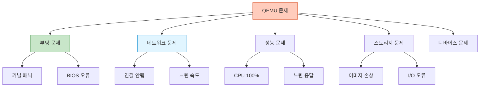

## 들어가며

QEMU를 사용하다 문제가 생겼다면? **체계적인 트러블슈팅**으로 대부분의 문제를 빠르게 해결할 수 있습니다.

## 문제 분류



## 부팅 문제

### 1. VM이 부팅되지 않음

```bash
# 증상: VM이 시작되지 않음

# 진단 1: QEMU 명령어 출력 확인
qemu-system-x86_64 -m 2G -drive file=vm.qcow2
# 오류 메시지 확인

# 진단 2: -nographic 제거하고 GUI로 확인
qemu-system-x86_64 -m 2G -drive file=vm.qcow2
# QEMU 창에서 부팅 과정 관찰

# 해결 1: 이미지 파일 확인
qemu-img info vm.qcow2
qemu-img check vm.qcow2

# 해결 2: BIOS/UEFI 확인
# BIOS 부팅
qemu-system-x86_64 -m 2G -drive file=vm.qcow2 -boot order=c

# UEFI 부팅
qemu-system-x86_64 -m 2G \
    -drive if=pflash,format=raw,readonly=on,file=/usr/share/OVMF/OVMF_CODE.fd \
    -drive file=vm.qcow2
```

### 2. 커널 패닉

```bash
# 증상: Kernel panic - not syncing

# 진단: 부팅 로그 확인
qemu-system-x86_64 \
    -m 2G \
    -drive file=vm.qcow2 \
    -serial file:boot.log

cat boot.log
# 패닉 원인 파악

# 해결 1: 루트 파일시스템 확인
# init=/bin/bash로 부팅
qemu-system-x86_64 \
    -m 2G \
    -drive file=vm.qcow2 \
    -append "init=/bin/bash"

# 해결 2: 디스크 인터페이스 변경
# SATA로 변경
qemu-system-x86_64 -m 2G -drive file=vm.qcow2,if=sata

# virtio로 변경 (드라이버 있는 경우)
qemu-system-x86_64 -m 2G -drive file=vm.qcow2,if=virtio
```

### 3. GRUB 오류

```bash
# 증상: GRUB rescue> 프롬프트

# 진단:
(grub rescue) ls
(hd0) (hd0,msdos1)

(grub rescue) ls (hd0,msdos1)/
# 파일 시스템 확인

# 해결: GRUB 복구
# 1. Live CD로 부팅
qemu-system-x86_64 \
    -m 2G \
    -drive file=vm.qcow2 \
    -cdrom ubuntu-22.04-live.iso \
    -boot d

# 2. chroot 후 GRUB 재설치
mount /dev/sda1 /mnt
mount --bind /dev /mnt/dev
mount --bind /proc /mnt/proc
mount --bind /sys /mnt/sys
chroot /mnt
grub-install /dev/sda
update-grub
```

## 네트워크 문제

### 1. 네트워크 연결 안됨

```bash
# 증상: VM에서 인터넷 접속 불가

# 진단 1: VM 내부 네트워크 확인
ip addr show
# 인터페이스가 UP 상태인지 확인

ip route
# 기본 게이트웨이 확인

ping 8.8.8.8
# 외부 연결 테스트

# 진단 2: QEMU 네트워크 설정 확인
qemu-system-x86_64 -m 2G -drive file=vm.qcow2 -netdev user,id=net0 -device virtio-net-pci,netdev=net0

# 해결 1: 네트워크 드라이버 확인
# VM 내부
lsmod | grep virtio_net
# virtio_net 모듈 로드 확인

# 해결 2: User mode 네트워크 사용
qemu-system-x86_64 \
    -netdev user,id=net0 \
    -device e1000,netdev=net0 \
    -m 2G
```

### 2. SSH 포트 포워딩 안됨

```bash
# 증상: ssh -p 2222 localhost 연결 실패

# 진단 1: 포트 리스닝 확인
sudo netstat -tlnp | grep 2222

# 진단 2: 방화벽 확인
sudo iptables -L -n | grep 2222

# 해결 1: 올바른 포트 포워딩
qemu-system-x86_64 \
    -netdev user,id=net0,hostfwd=tcp::2222-:22 \
    -device virtio-net-pci,netdev=net0 \
    -m 2G -drive file=vm.qcow2

# 해결 2: VM 내부 SSH 확인
# VM 내부에서
systemctl status sshd
systemctl start sshd
```

### 3. TAP 네트워크 오류

```bash
# 증상: could not configure /dev/net/tun: Operation not permitted

# 진단:
ls -l /dev/net/tun
crw-rw-rw- 1 root root 10, 200 Feb  2 10:00 /dev/net/tun

# 해결 1: 권한 확인
sudo chmod 666 /dev/net/tun

# 해결 2: 사용자를 kvm 그룹에 추가
sudo usermod -a -G kvm $USER
newgrp kvm

# 해결 3: 브리지 네트워크 스크립트
cat > /etc/qemu-ifup << 'EOF'
#!/bin/bash
ip link set $1 up
ip link set $1 master br0
EOF

chmod +x /etc/qemu-ifup
```

## 성능 문제

### 1. CPU 사용률 100%

```bash
# 증상: QEMU 프로세스가 CPU를 100% 사용

# 진단 1: KVM 활성화 확인
ps aux | grep qemu | grep -c "\-enable-kvm"
# 0이면 KVM 미사용 (문제!)

# 진단 2: CPU 기능 확인
egrep -c '(vmx|svm)' /proc/cpuinfo
# 0이면 하드웨어 가상화 미지원

lsmod | grep kvm
# KVM 모듈 로드 확인

# 해결 1: KVM 활성화
qemu-system-x86_64 -enable-kvm -m 2G -drive file=vm.qcow2

# 해결 2: KVM 모듈 로드
sudo modprobe kvm_intel  # Intel
sudo modprobe kvm_amd    # AMD

# 해결 3: BIOS에서 VT-x/AMD-V 활성화
# 재부팅 후 BIOS 설정에서 활성화
```

### 2. 느린 I/O 성능

```bash
# 증상: 디스크 I/O가 매우 느림

# 진단: I/O 모니터링
# VM 내부
iostat -x 1

# 호스트
iotop -p $(pgrep qemu)

# 해결 1: cache 옵션 최적화
qemu-system-x86_64 \
    -drive file=vm.qcow2,cache=none,aio=native \
    -m 2G

# cache=none: 호스트 캐시 우회 (SSD 권장)
# cache=writeback: 쓰기 캐시 사용 (빠르지만 위험)
# cache=writethrough: 안전하지만 느림

# 해결 2: I/O 스레드 사용
qemu-system-x86_64 \
    -object iothread,id=io0 \
    -drive file=vm.qcow2,if=none,id=disk0,cache=none,aio=native \
    -device virtio-blk-pci,drive=disk0,iothread=io0 \
    -m 2G

# 해결 3: raw 포맷 사용
qemu-img convert -O raw vm.qcow2 vm.raw
qemu-system-x86_64 -drive file=vm.raw,format=raw,cache=none -m 2G
```

### 3. 메모리 스왑 과다

```bash
# 증상: VM이 느리고 스왑 사용이 많음

# 진단:
# VM 내부
free -h
              total        used        free      shared  buff/cache   available
Mem:           2.0G        1.8G        100M         50M        100M         50M
Swap:          2.0G        1.5G        500M  # 스왑 과다 사용!

# 해결 1: 메모리 증가
qemu-system-x86_64 -m 4G -drive file=vm.qcow2

# 해결 2: Huge Pages 사용
sudo sysctl vm.nr_hugepages=1024
qemu-system-x86_64 \
    -m 4G \
    -mem-path /dev/hugepages \
    -mem-prealloc \
    -drive file=vm.qcow2

# 해결 3: Balloon 드라이버
qemu-system-x86_64 \
    -m 4G \
    -device virtio-balloon \
    -drive file=vm.qcow2
```

## 스토리지 문제

### 1. 이미지 파일 손상

```bash
# 증상: I/O error, could not read from backing file

# 진단:
qemu-img check vm.qcow2

ERROR cluster 12345 refcount=0 reference=1
Leaked cluster 67890

# 해결 1: 이미지 복구
qemu-img check -r all vm.qcow2

The following inconsistencies were found and repaired:
    12 leaked clusters
    3 corruptions

# 해결 2: 복구 불가능한 경우 복사
qemu-img convert -f qcow2 -O qcow2 vm.qcow2 vm-recovered.qcow2

# 해결 3: 백업에서 복원
cp backup/vm-20240201.qcow2 vm.qcow2
```

### 2. 디스크 공간 부족

```bash
# 증상: No space left on device

# 진단 1: VM 내부
df -h
/dev/vda1        20G   19G  100M  100%  /

# 진단 2: 호스트
du -sh vm.qcow2
19G    vm.qcow2

qemu-img info vm.qcow2
virtual size: 20 GiB
disk size: 19 GiB

# 해결 1: 디스크 확장
# VM 종료 후
qemu-img resize vm.qcow2 +10G

# VM 내부에서 파티션 확장
sudo growpart /dev/vda 1
sudo resize2fs /dev/vda1

# 해결 2: 불필요한 파일 삭제 후 압축
# VM 내부
sudo apt-get clean
sudo rm -rf /var/log/*

# VM 종료 후
qemu-img convert -O qcow2 -c vm.qcow2 vm-compact.qcow2
mv vm-compact.qcow2 vm.qcow2
```

### 3. Backing File 체인 깨짐

```bash
# 증상: Could not open backing file

# 진단:
qemu-img info snapshot.qcow2
backing file: /old/path/base.qcow2 (cannot access backing file)

# 해결 1: Backing file 경로 수정
qemu-img rebase -u -b /new/path/base.qcow2 snapshot.qcow2

# 해결 2: 체인 병합
qemu-img convert -O qcow2 snapshot.qcow2 standalone.qcow2
# standalone.qcow2는 독립적
```

## 디바이스 문제

### 1. USB 패스스루 실패

```bash
# 증상: could not add USB device

# 진단:
lsusb
Bus 001 Device 005: ID 8087:0aaa Intel Corp.

ls -l /dev/bus/usb/001/005
crw-rw-r-- 1 root root 189, 4 Feb  2 10:00 /dev/bus/usb/001/005

# 해결 1: 권한 부여
sudo chmod 666 /dev/bus/usb/001/005

# 해결 2: udev 규칙
cat > /etc/udev/rules.d/99-usb-qemu.rules << 'EOF'
SUBSYSTEM=="usb", ATTRS{idVendor}=="8087", ATTRS{idProduct}=="0aaa", MODE="0666"
EOF

sudo udevadm control --reload-rules
sudo udevadm trigger

# 해결 3: libusb 대신 host 사용
qemu-system-x86_64 \
    -usb \
    -device usb-host,vendorid=0x8087,productid=0x0aaa \
    -m 2G
```

### 2. PCI 패스스루 오류

```bash
# 증상: vfio: error opening /dev/vfio/1: Permission denied

# 진단:
ls -l /dev/vfio/*
crw------- 1 root root 10, 196 Feb  2 10:00 /dev/vfio/vfio
crw------- 1 root root 243,  0 Feb  2 10:00 /dev/vfio/1

# 해결 1: vfio 그룹에 사용자 추가
sudo usermod -a -G vfio $USER
newgrp vfio

sudo chown root:vfio /dev/vfio/*
sudo chmod 660 /dev/vfio/*

# 해결 2: IOMMU 그룹 확인
for d in /sys/kernel/iommu_groups/*/devices/*; do
    n=${d#*/iommu_groups/*}; n=${n%%/*}
    printf 'IOMMU Group %s ' "$n"
    lspci -nns "${d##*/}"
done
```

## 디버깅 도구

### 1. QEMU 로그

```bash
# 상세 로그 출력
qemu-system-x86_64 \
    -d help  # 사용 가능한 로그 항목

# CPU 실행 추적
qemu-system-x86_64 \
    -d cpu,exec \
    -D qemu.log \
    -m 2G -drive file=vm.qcow2

# 인터럽트 추적
qemu-system-x86_64 \
    -d int \
    -D qemu.log \
    -m 2G -drive file=vm.qcow2
```

### 2. GDB 디버깅

```bash
# QEMU를 GDB 서버로 실행
qemu-system-x86_64 \
    -s \
    -S \
    -m 2G -drive file=vm.qcow2

# -s: GDB 서버 시작 (포트 1234)
# -S: 시작 시 일시정지

# 다른 터미널에서 GDB 연결
gdb
(gdb) target remote :1234
(gdb) continue
```

### 3. strace/ltrace

```bash
# 시스템콜 추적
strace -f -o qemu.strace qemu-system-x86_64 -m 2G -drive file=vm.qcow2

# 라이브러리 호출 추적
ltrace -f -o qemu.ltrace qemu-system-x86_64 -m 2G -drive file=vm.qcow2
```

### 4. perf 분석

```bash
# QEMU 성능 프로파일링
sudo perf record -p $(pgrep qemu) -g sleep 10
sudo perf report

# KVM 이벤트 추적
sudo perf kvm stat live -p $(pgrep qemu)
```

## 자동 진단 스크립트

```bash
#!/bin/bash
# qemu_doctor.sh

echo "=== QEMU Health Check ==="

# 1. KVM 사용 가능 여부
echo -n "KVM available: "
if [ -c /dev/kvm ]; then
    echo "✅ Yes"
else
    echo "❌ No - Install KVM or enable virtualization in BIOS"
fi

# 2. CPU 가상화 지원
echo -n "CPU virtualization: "
if egrep -q '(vmx|svm)' /proc/cpuinfo; then
    echo "✅ Supported"
else
    echo "❌ Not supported"
fi

# 3. KVM 모듈
echo -n "KVM module: "
if lsmod | grep -q kvm; then
    echo "✅ Loaded"
else
    echo "⚠️  Not loaded - Run: sudo modprobe kvm_intel (or kvm_amd)"
fi

# 4. QEMU 설치
echo -n "QEMU installed: "
if command -v qemu-system-x86_64 &> /dev/null; then
    VERSION=$(qemu-system-x86_64 --version | head -1)
    echo "✅ $VERSION"
else
    echo "❌ Not installed"
fi

# 5. 네트워크
echo -n "Network (TUN/TAP): "
if [ -c /dev/net/tun ]; then
    echo "✅ Available"
else
    echo "⚠️  Not available - May need sudo modprobe tun"
fi

# 6. 실행 중인 VM
echo -n "Running VMs: "
VM_COUNT=$(pgrep qemu | wc -l)
echo "$VM_COUNT"

if [ $VM_COUNT -gt 0 ]; then
    echo ""
    echo "VM Details:"
    for pid in $(pgrep qemu); do
        NAME=$(ps -p $pid -o args= | grep -oP '\-name \K[^ ]+' || echo "unnamed")
        MEM=$(ps -p $pid -o rss= | awk '{print $1/1024 " MB"}')
        CPU=$(ps -p $pid -o %cpu=)

        echo "  PID $pid ($NAME): CPU ${CPU}%, MEM ${MEM}"
    done
fi

# 7. 디스크 이미지 확인
echo ""
echo "Checking disk images in current directory:"
for img in *.qcow2 2>/dev/null; do
    if [ -f "$img" ]; then
        echo -n "  $img: "
        qemu-img check "$img" 2>&1 | grep -q "No errors" && echo "✅ OK" || echo "⚠️  Check needed"
    fi
done
```

## 일반적인 에러 메시지

### 에러 메시지 해석

| 에러 | 원인 | 해결 |
|------|------|------|
| `Could not access KVM kernel module` | KVM 미설치/미활성화 | `sudo modprobe kvm_intel` |
| `failed to initialize KVM` | 권한 부족 | `/dev/kvm` 권한 확인 |
| `Could not open backing file` | Backing file 경로 오류 | `qemu-img rebase` 사용 |
| `No bootable device` | 부트 디바이스 없음 | `-boot order=c` 추가 |
| `Network device not found` | 네트워크 설정 오류 | 네트워크 옵션 확인 |

## 다음 단계

QEMU 트러블슈팅을 마스터했습니다! 다음 글에서는:
- **QEMU 프로덕션 배포**
- 고가용성 구성
- 모니터링 및 알림

---

**시리즈 목차**
1-18. [이전 글들]
19. **QEMU 트러블슈팅** ← 현재 글

> 💡 **Quick Tip**: 문제 발생 시 가장 먼저 KVM 활성화 여부를 확인하세요. KVM 없이 실행하면 성능이 10배 이상 느려집니다. `dmesg | grep kvm`으로 KVM 로드 여부를 확인할 수 있습니다!
