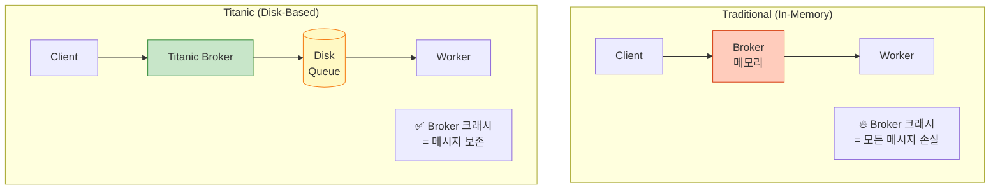
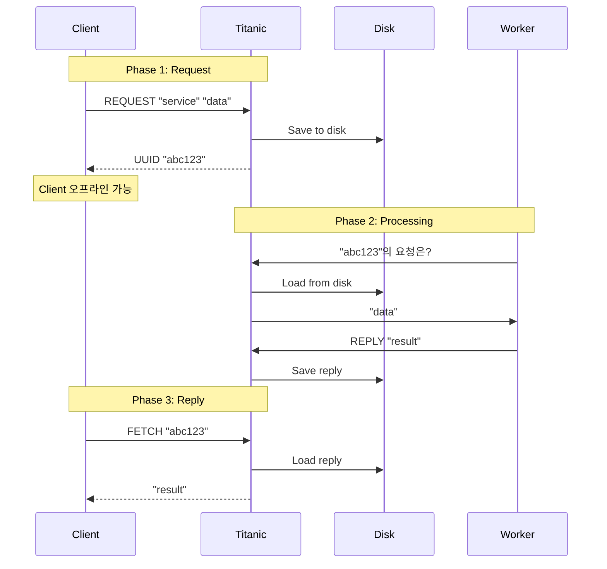
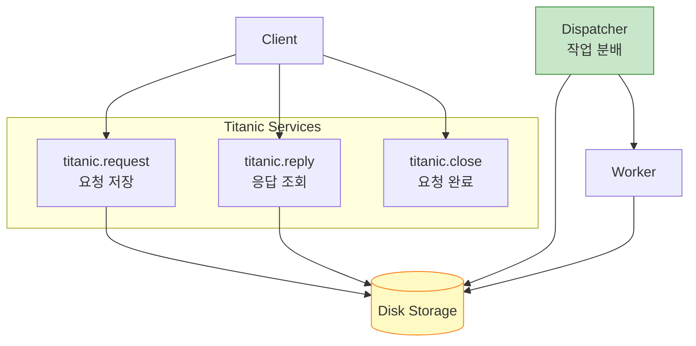
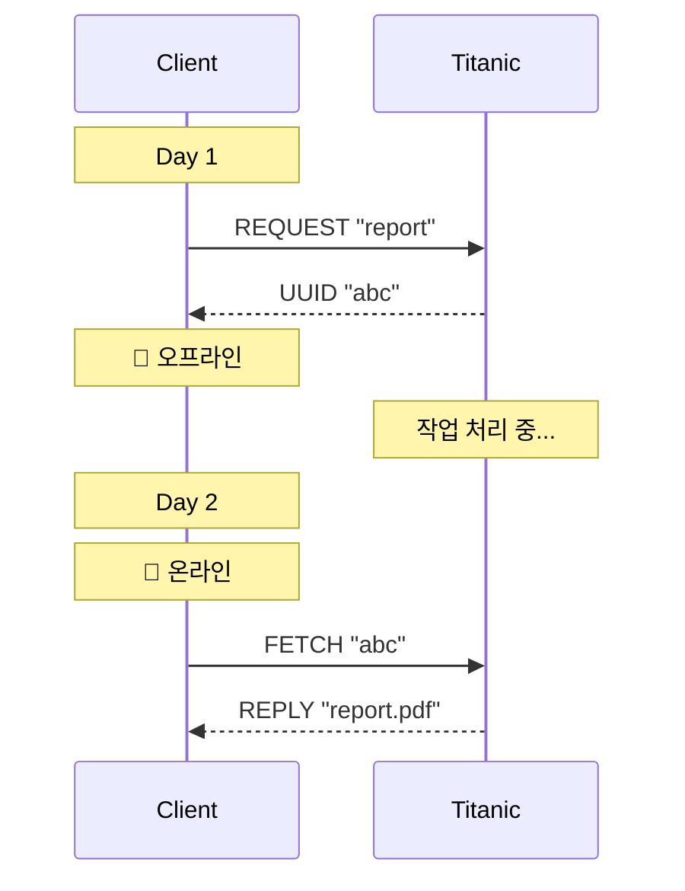
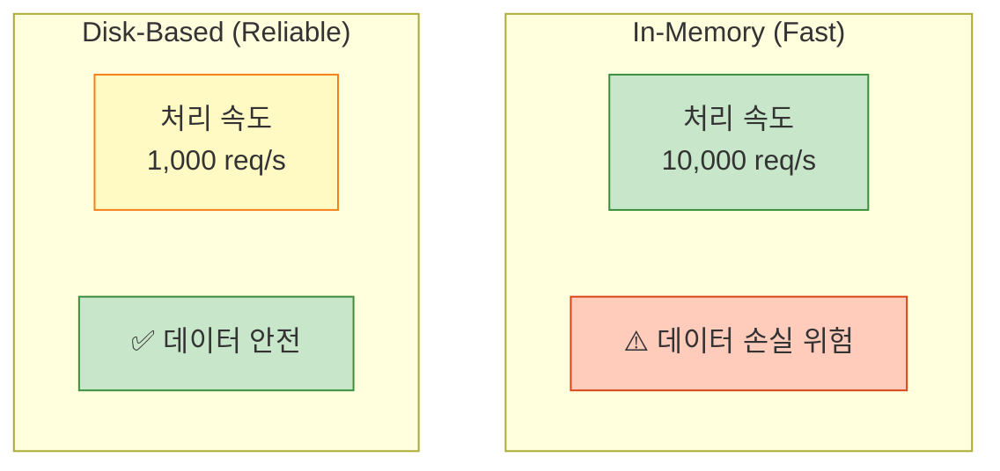

## 들어가며

**Titanic Pattern**은 ZeroMQ에서 가장 신뢰성이 높은 패턴입니다. 배가 가라앉아도 데이터는 살아남듯이, 시스템이 크래시해도 메시지는 **디스크에 안전하게 보관**됩니다.

## Titanic이란?

### 개념

Titanic은 **비연결(Disconnected) 신뢰성 패턴**입니다:
- 클라이언트가 **오프라인**이어도 메시지 전달
- 서버가 **재시작**해도 메시지 유지
- **디스크 기반** 영구 저장소



### 특징

- ✅ **영구 저장**: 메시지를 디스크에 저장
- ✅ **비동기 응답**: 클라이언트가 나중에 응답 수신
- ✅ **Request UUID**: 각 요청에 고유 ID 부여
- ✅ **3단계 프로토콜**: Request → Close → Reply

## Titanic 프로토콜

### 3단계 프로세스



### 메시지 흐름

1. **Request**: 클라이언트가 요청 → UUID 받음
2. **Close**: 요청이 디스크에 저장되었음을 확인
3. **Reply**: UUID로 나중에 응답 조회

## Python 구현

### Titanic 서비스 구조



### Titanic Request Service

```python
# titanic_request.py
import zmq
import uuid
import os
import pickle

TITANIC_DIR = "./titanic"

class TitanicRequest:
    def __init__(self, broker="tcp://localhost:5555"):
        self.context = zmq.Context()
        self.worker = zmq.Socket(self.context, zmq.REP)
        self.worker.connect(broker)

        # 디렉토리 생성
        os.makedirs(f"{TITANIC_DIR}/queue", exist_ok=True)
        os.makedirs(f"{TITANIC_DIR}/requests", exist_ok=True)
        os.makedirs(f"{TITANIC_DIR}/replies", exist_ok=True)

        print("Titanic Request Service 시작")

    def save_request(self, request_id, service, body):
        """요청을 디스크에 저장"""
        request = {
            'id': request_id,
            'service': service,
            'body': body,
            'status': 'pending'
        }

        # 요청 저장
        with open(f"{TITANIC_DIR}/requests/{request_id}.req", 'wb') as f:
            pickle.dump(request, f)

        # 큐에 추가
        with open(f"{TITANIC_DIR}/queue/{request_id}.queue", 'w') as f:
            f.write(service)

        print(f"✅ 요청 저장: {request_id}")

    def run(self):
        """메인 루프"""
        while True:
            # [Service, Body]
            frames = self.worker.recv_multipart()

            service = frames[0].decode()
            body = frames[1] if len(frames) > 1 else b""

            # UUID 생성
            request_id = str(uuid.uuid4())

            # 디스크에 저장
            self.save_request(request_id, service, body)

            # UUID 반환
            self.worker.send(request_id.encode())

if __name__ == "__main__":
    service = TitanicRequest()
    service.run()
```

### Titanic Reply Service

```python
# titanic_reply.py
import zmq
import os
import pickle

TITANIC_DIR = "./titanic"

class TitanicReply:
    def __init__(self, broker="tcp://localhost:5555"):
        self.context = zmq.Context()
        self.worker = zmq.Socket(self.context, zmq.REP)
        self.worker.connect(broker)

        print("Titanic Reply Service 시작")

    def load_reply(self, request_id):
        """응답 로드"""
        reply_file = f"{TITANIC_DIR}/replies/{request_id}.rep"

        if os.path.exists(reply_file):
            with open(reply_file, 'rb') as f:
                return pickle.load(f)
        else:
            return None

    def run(self):
        """메인 루프"""
        while True:
            # [UUID]
            request_id = self.worker.recv().decode()

            print(f"📬 응답 조회: {request_id}")

            reply = self.load_reply(request_id)

            if reply:
                self.worker.send(reply)
            else:
                self.worker.send(b"PENDING")  # 아직 처리 중

if __name__ == "__main__":
    service = TitanicReply()
    service.run()
```

### Titanic Dispatcher

```python
# titanic_dispatcher.py
import zmq
import os
import time
import pickle
import glob

TITANIC_DIR = "./titanic"

class TitanicDispatcher:
    def __init__(self, broker="tcp://localhost:5555"):
        self.context = zmq.Context()
        self.client = zmq.Socket(self.context, zmq.REQ)
        self.client.connect(broker)

        print("Titanic Dispatcher 시작")

    def process_queue(self):
        """큐의 요청들을 처리"""
        queue_files = glob.glob(f"{TITANIC_DIR}/queue/*.queue")

        for queue_file in queue_files:
            request_id = os.path.basename(queue_file).replace('.queue', '')

            # 요청 로드
            request_file = f"{TITANIC_DIR}/requests/{request_id}.req"
            if not os.path.exists(request_file):
                os.remove(queue_file)
                continue

            with open(request_file, 'rb') as f:
                request = pickle.load(f)

            # Worker에게 전달 (Majordomo 사용)
            print(f"📤 처리 중: {request_id}")

            try:
                # MDP Client로 요청
                self.client.send_multipart([
                    b"MDPC01",
                    request['service'].encode(),
                    request['body']
                ])

                # 타임아웃 설정
                poller = zmq.Poller()
                poller.register(self.client, zmq.POLLIN)

                if poller.poll(5000):  # 5초 대기
                    frames = self.client.recv_multipart()
                    reply = frames[2] if len(frames) > 2 else b"ERROR"

                    # 응답 저장
                    reply_file = f"{TITANIC_DIR}/replies/{request_id}.rep"
                    with open(reply_file, 'wb') as f:
                        pickle.dump(reply, f)

                    # 큐에서 제거
                    os.remove(queue_file)

                    print(f"✅ 완료: {request_id}")
                else:
                    print(f"⚠️ 타임아웃: {request_id}")

            except Exception as e:
                print(f"❌ 에러: {request_id} - {e}")

            # 다음 요청 전 대기
            time.sleep(0.1)

    def run(self):
        """메인 루프"""
        while True:
            self.process_queue()
            time.sleep(1)

if __name__ == "__main__":
    dispatcher = TitanicDispatcher()
    dispatcher.run()
```

### Titanic Client

```python
# titanic_client.py
import zmq
import time

class TitanicClient:
    def __init__(self, broker="tcp://localhost:5555"):
        self.context = zmq.Context()
        self.broker = broker

    def request(self, service, body):
        """요청 전송 및 UUID 받기"""
        client = self.context.socket(zmq.REQ)
        client.connect(self.broker)

        # titanic.request 서비스 호출
        client.send_multipart([
            b"MDPC01",
            b"titanic.request",
            service.encode(),
            body.encode()
        ])

        frames = client.recv_multipart()
        request_id = frames[2].decode()

        client.close()
        return request_id

    def reply(self, request_id, timeout=10):
        """UUID로 응답 조회"""
        client = self.context.socket(zmq.REQ)
        client.connect(self.broker)

        start = time.time()

        while time.time() - start < timeout:
            # titanic.reply 서비스 호출
            client.send_multipart([
                b"MDPC01",
                b"titanic.reply",
                request_id.encode()
            ])

            frames = client.recv_multipart()
            reply = frames[2]

            if reply != b"PENDING":
                client.close()
                return reply.decode()

            time.sleep(0.5)

        client.close()
        return None

if __name__ == "__main__":
    client = TitanicClient()

    # 요청 전송
    request_id = client.request("echo", "Hello Titanic!")
    print(f"Request ID: {request_id}")

    # 응답 대기
    print("응답 대기 중...")
    reply = client.reply(request_id)

    if reply:
        print(f"응답: {reply}")
    else:
        print("타임아웃")
```

## C 구현 (간소화)

```c
// titanic_request.c
#include <zmq.h>
#include <stdio.h>
#include <stdlib.h>
#include <string.h>
#include <uuid/uuid.h>

#define TITANIC_DIR "./titanic"

void save_request(const char *uuid_str, const char *service, const char *body) {
    char filename[256];
    sprintf(filename, "%s/requests/%s.req", TITANIC_DIR, uuid_str);

    FILE *f = fopen(filename, "w");
    fprintf(f, "%s\n%s", service, body);
    fclose(f);

    // Queue 파일 생성
    sprintf(filename, "%s/queue/%s.queue", TITANIC_DIR, uuid_str);
    f = fopen(filename, "w");
    fprintf(f, "%s", service);
    fclose(f);

    printf("✅ 요청 저장: %s\n", uuid_str);
}

int main() {
    void *context = zmq_ctx_new();
    void *worker = zmq_socket(context, ZMQ_REP);
    zmq_connect(worker, "tcp://localhost:5555");

    printf("Titanic Request Service 시작\n");

    // 디렉토리 생성
    system("mkdir -p ./titanic/requests");
    system("mkdir -p ./titanic/queue");
    system("mkdir -p ./titanic/replies");

    while (1) {
        char service[256], body[1024];

        // 서비스 이름
        int size = zmq_recv(worker, service, 255, 0);
        service[size] = '\0';

        // Body
        size = zmq_recv(worker, body, 1023, 0);
        body[size] = '\0';

        // UUID 생성
        uuid_t uuid;
        uuid_generate(uuid);

        char uuid_str[37];
        uuid_unparse(uuid, uuid_str);

        // 디스크에 저장
        save_request(uuid_str, service, body);

        // UUID 반환
        zmq_send(worker, uuid_str, strlen(uuid_str), 0);
    }

    zmq_close(worker);
    zmq_ctx_destroy(context);
    return 0;
}
```

## 디스크 구조

```
titanic/
├── requests/           # 요청 저장소
│   ├── uuid1.req
│   ├── uuid2.req
│   └── uuid3.req
├── queue/              # 처리 대기 큐
│   ├── uuid1.queue
│   └── uuid2.queue
└── replies/            # 응답 저장소
    ├── uuid1.rep
    └── uuid3.rep
```

## 사용 사례

### 1. 비동기 작업 처리

```python
# 시간이 오래 걸리는 작업
client = TitanicClient()
request_id = client.request("video_encode", "video.mp4")

# 나중에 확인
reply = client.reply(request_id, timeout=3600)  # 1시간 대기
```

### 2. 오프라인 클라이언트



### 3. 배치 처리

```python
# 여러 작업 제출
client = TitanicClient()
uuids = []

for i in range(100):
    uuid = client.request("process", f"data_{i}")
    uuids.append(uuid)

# 나중에 일괄 조회
results = []
for uuid in uuids:
    reply = client.reply(uuid)
    results.append(reply)
```

## 신뢰성 비교

| 패턴 | 메모리 | 디스크 | 크래시 복구 | 오프라인 지원 |
|------|--------|--------|-------------|---------------|
| **Basic REQ-REP** | ✅ | ❌ | ❌ | ❌ |
| **Lazy Pirate** | ✅ | ❌ | ⭐ | ❌ |
| **Majordomo** | ✅ | ❌ | ⭐⭐ | ❌ |
| **Titanic** | ✅ | ✅ | ⭐⭐⭐ | ✅ |

## 성능 트레이드오프



**선택 기준**:
- **속도 우선**: In-Memory (Majordomo)
- **신뢰성 우선**: Disk-Based (Titanic)

## 최적화 팁

### 1. 배치 쓰기

```python
# 여러 요청을 모아서 한 번에 디스크에 쓰기
batch = []
for i in range(100):
    batch.append(request)

# 한 번에 저장
save_batch(batch)
```

### 2. SSD 사용

- HDD: ~100 IOPS
- SSD: ~10,000 IOPS
- NVMe SSD: ~100,000 IOPS

### 3. 압축

```python
import gzip

# 요청 압축
compressed = gzip.compress(pickle.dumps(request))
```

## 다음 단계

Titanic 패턴을 마스터했습니다! 다음 글에서는:
- **Binary Star 패턴** - 고가용성
- Active-Passive 장애 조치
- 상태 머신 구현

---

**시리즈 목차**
1. ZeroMQ란 무엇인가 - 고성능 메시징 라이브러리
2. ZeroMQ 메시징 패턴 - REQ/REP, PUB/SUB, PUSH/PULL
3. ZeroMQ 고급 패턴 - ROUTER, DEALER, PROXY
4. ZeroMQ 실전 활용 - 분산 시스템 구축
5. ZeroMQ 성능 최적화 및 보안
6. ZeroMQ 신뢰성 패턴 - Lazy Pirate, Simple Pirate, Paranoid Pirate
7. ZeroMQ 로드 밸런싱 - LRU Queue와 동적 워커 관리
8. ZeroMQ Majordomo 패턴 - 서비스 지향 신뢰성 큐잉
9. **ZeroMQ Titanic 패턴 - 디스크 기반 신뢰성과 비연결 메시징** ← 현재 글
10. ZeroMQ Binary Star 패턴 (다음 글)

> 💡 **Quick Tip**: Titanic은 메시지 손실이 절대 허용되지 않을 때 사용하세요. 은행, 의료, 금융 시스템에 적합!
