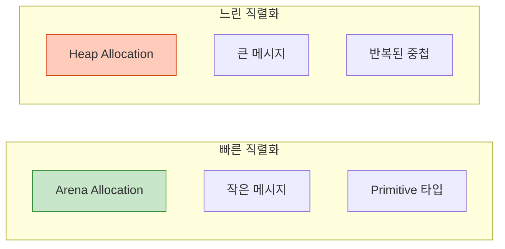
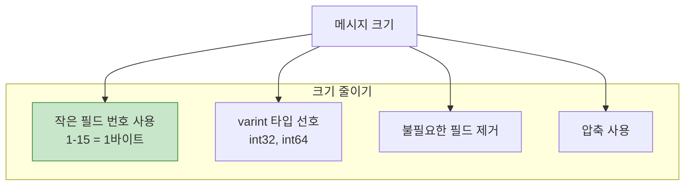
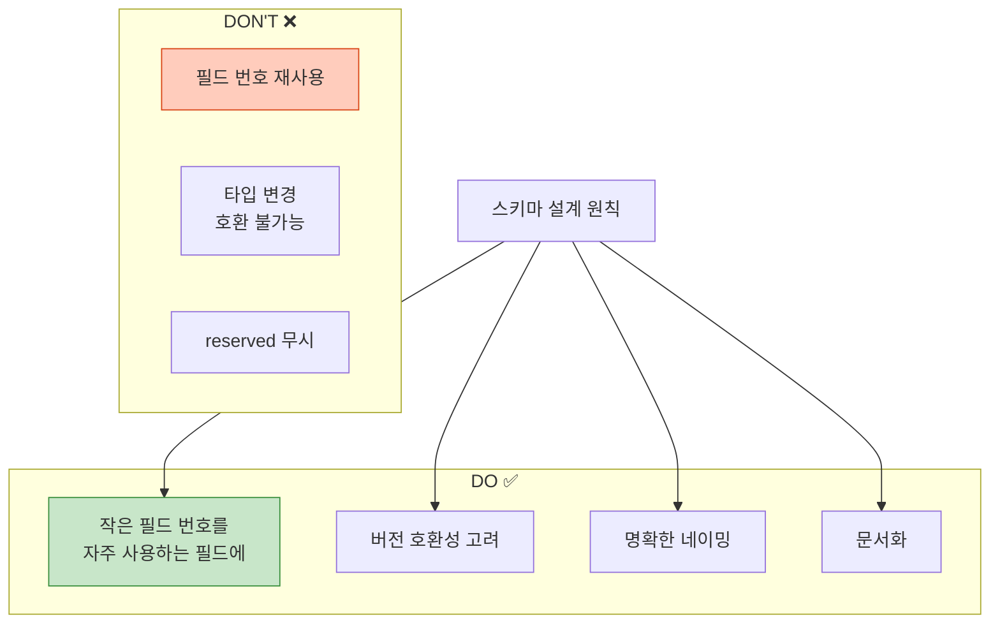
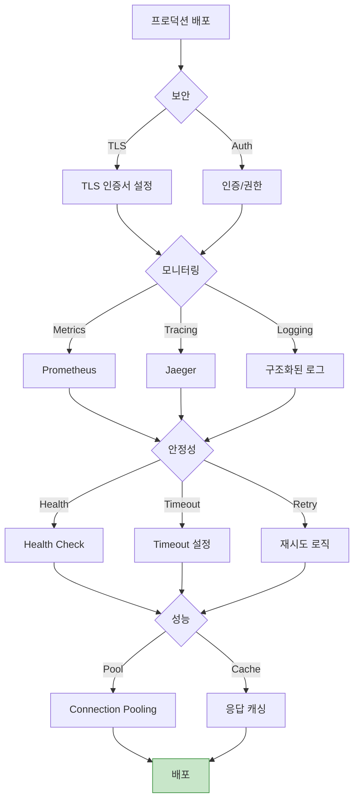

## 들어가며

마지막 글에서는 Protobuf와 gRPC의 **성능을 극대화**하고, 프로덕션 환경에서 안정적으로 운영하는 방법을 다룹니다.

## 성능 최적화

### 1. 직렬화 성능



### Arena Allocation (C++)

```cpp
#include <google/protobuf/arena.h>

// ❌ 느림: Heap allocation
Person* person = new Person();
person->set_name("Alice");
delete person;

// ✅ 빠름: Arena allocation
google::protobuf::Arena arena;
Person* person = google::protobuf::Arena::CreateMessage<Person>(&arena);
person->set_name("Alice");
// 자동 해제 (arena 소멸 시)
```

**성능 향상**: 2-5배 빠름

### Lazy Parsing

```protobuf
syntax = "proto3";

message LargeMessage {
  string id = 1;
  // Large field - lazy parsing
  bytes large_data = 2 [lazy = true];
}
```

**효과**: 필요할 때만 파싱

### 2. 메시지 크기 최적화



### 필드 번호 최적화

```protobuf
message User {
  // ✅ 자주 사용하는 필드: 1-15 (1바이트)
  string id = 1;
  string name = 2;
  string email = 3;

  // ⚠️ 덜 사용하는 필드: 16+ (2바이트)
  string bio = 16;
  string website = 17;
}
```

### 타입 선택

```protobuf
message Example {
  // ✅ varint: 작은 값에 최적화
  int32 small_number = 1;  // 123 → 1바이트

  // ❌ fixed32: 항상 4바이트
  fixed32 number = 2;  // 123 → 4바이트

  // ✅ sint32: 음수에 최적화 (ZigZag 인코딩)
  sint32 negative = 3;  // -1 → 1바이트 (vs int32: 10바이트)

  // 사용 시나리오
  // - 작은 양수: int32, int64
  // - 음수 많음: sint32, sint64
  // - 큰 숫자 많음: fixed32, fixed64
}
```

## gRPC 성능 최적화

### 1. Connection Pooling

```cpp
// ❌ 매번 새 연결
for (int i = 0; i < 1000; i++) {
  auto channel = grpc::CreateChannel(...);
  auto stub = MyService::NewStub(channel);
  stub->MyMethod(...);
}

// ✅ 연결 재사용
auto channel = grpc::CreateChannel(...);
auto stub = MyService::NewStub(channel);

for (int i = 0; i < 1000; i++) {
  stub->MyMethod(...);
}
```

**성능 향상**: 10배 이상

### 2. Keepalive 설정

```cpp
grpc::ChannelArguments args;

// Keepalive 설정
args.SetInt(GRPC_ARG_KEEPALIVE_TIME_MS, 10000);  // 10초
args.SetInt(GRPC_ARG_KEEPALIVE_TIMEOUT_MS, 5000);  // 5초
args.SetInt(GRPC_ARG_HTTP2_MAX_PINGS_WITHOUT_DATA, 0);

auto channel = grpc::CreateCustomChannel(
    "server:50051",
    grpc::InsecureChannelCredentials(),
    args);
```

### 3. Message Size Limits

```cpp
// 서버
grpc::ServerBuilder builder;
builder.SetMaxReceiveMessageSize(100 * 1024 * 1024);  // 100MB
builder.SetMaxSendMessageSize(100 * 1024 * 1024);

// 클라이언트
grpc::ChannelArguments args;
args.SetMaxReceiveMessageSize(100 * 1024 * 1024);
args.SetMaxSendMessageSize(100 * 1024 * 1024);
```

## Streaming 최적화

### Batch Processing

```cpp
// ❌ 개별 전송 (느림)
for (const auto& item : items) {
  stream->Write(item);
}

// ✅ Batch 전송 (빠름)
std::vector<Item> batch;
for (const auto& item : items) {
  batch.push_back(item);

  if (batch.size() >= 100) {
    BatchMessage batch_msg;
    for (const auto& b : batch) {
      *batch_msg.add_items() = b;
    }
    stream->Write(batch_msg);
    batch.clear();
  }
}
```

**성능 향상**: 5-20배

## 벤치마킹

### Protobuf vs JSON

```cpp
// 벤치마크 코드
#include <benchmark/benchmark.h>

static void BM_Protobuf_Serialize(benchmark::State& state) {
  Person person;
  person.set_name("Alice");
  person.set_id(1234);

  for (auto _ : state) {
    std::string output;
    person.SerializeToString(&output);
  }
}

static void BM_JSON_Serialize(benchmark::State& state) {
  json j;
  j["name"] = "Alice";
  j["id"] = 1234;

  for (auto _ : state) {
    std::string output = j.dump();
  }
}

BENCHMARK(BM_Protobuf_Serialize);
BENCHMARK(BM_JSON_Serialize);
```

### 예상 결과

| 작업 | Protobuf | JSON | 비율 |
|------|----------|------|------|
| **직렬화** | 50ns | 500ns | 10x faster |
| **역직렬화** | 80ns | 800ns | 10x faster |
| **크기** | 26 bytes | 69 bytes | 2.6x smaller |

## Best Practices

### 1. 스키마 설계



### 2. 버전 관리

```protobuf
// v1.0
message UserV1 {
  string name = 1;
  int32 age = 2;
}

// v2.0: 필드 추가 (안전)
message UserV2 {
  string name = 1;
  int32 age = 2;
  string email = 3;  // ✅ 새 필드
}

// v3.0: 필드 삭제 (주의)
message UserV3 {
  string name = 1;
  reserved 2;  // ✅ age 삭제
  reserved "age";

  string email = 3;
  repeated string tags = 4;
}
```

### 3. 에러 처리

```cpp
// Server
Status GetUser(ServerContext* context,
               const GetUserRequest* request,
               GetUserResponse* response) {
  try {
    auto user = database->FindUser(request->user_id());

    if (!user) {
      return Status(grpc::StatusCode::NOT_FOUND,
                    "User not found",
                    request->user_id());  // 디버그 정보
    }

    *response->mutable_user() = user;
    return Status::OK;

  } catch (const DatabaseException& e) {
    return Status(grpc::StatusCode::INTERNAL,
                  "Database error: " + std::string(e.what()));
  }
}

// Client
Status status = stub->GetUser(&context, request, &response);

if (!status.ok()) {
  switch (status.error_code()) {
    case grpc::StatusCode::NOT_FOUND:
      std::cerr << "User not found: " << status.error_details() << std::endl;
      break;
    case grpc::StatusCode::DEADLINE_EXCEEDED:
      std::cerr << "Request timeout" << std::endl;
      // 재시도 로직
      break;
    default:
      std::cerr << "Error: " << status.error_message() << std::endl;
  }
}
```

### 4. Timeout 설정

```cpp
// Client
ClientContext context;

// 5초 타임아웃
std::chrono::system_clock::time_point deadline =
    std::chrono::system_clock::now() + std::chrono::seconds(5);
context.set_deadline(deadline);

Status status = stub->SlowMethod(&context, request, &response);
```

### 5. 재시도 전략

```cpp
int max_retries = 3;
int retry_delay_ms = 1000;

for (int attempt = 0; attempt < max_retries; attempt++) {
  ClientContext context;
  Status status = stub->MyMethod(&context, request, &response);

  if (status.ok()) {
    break;  // 성공
  }

  if (attempt == max_retries - 1) {
    // 최종 실패
    return status;
  }

  // 재시도 가능한 에러만
  if (status.error_code() == grpc::StatusCode::UNAVAILABLE ||
      status.error_code() == grpc::StatusCode::DEADLINE_EXCEEDED) {
    std::this_thread::sleep_for(std::chrono::milliseconds(retry_delay_ms));
    retry_delay_ms *= 2;  // Exponential backoff
  } else {
    return status;  // 재시도 불가
  }
}
```

## 프로덕션 체크리스트



### 체크리스트

**보안**:
- [ ] TLS/SSL 활성화
- [ ] JWT/OAuth 인증
- [ ] Rate limiting
- [ ] Input validation

**모니터링**:
- [ ] 메트릭 수집 (Prometheus)
- [ ] 분산 트레이싱 (Jaeger/Zipkin)
- [ ] 구조화된 로깅
- [ ] 알림 설정

**안정성**:
- [ ] Health check 엔드포인트
- [ ] Timeout 설정
- [ ] 재시도 로직 (Exponential backoff)
- [ ] Circuit breaker
- [ ] Graceful shutdown

**성능**:
- [ ] Connection pooling
- [ ] Arena allocation
- [ ] Batching
- [ ] 압축 (gzip)
- [ ] 응답 캐싱

**문서화**:
- [ ] API 문서 (Proto 파일 주석)
- [ ] 예제 코드
- [ ] Changelog
- [ ] 마이그레이션 가이드

## 마무리

Protocol Buffers와 gRPC 시리즈를 완주했습니다! 이제 다음을 할 수 있습니다:
- ✅ Protobuf 스키마 설계
- ✅ gRPC 서비스 구현
- ✅ 마이크로서비스 구축
- ✅ 성능 최적화
- ✅ 프로덕션 배포

---

**시리즈 목차**
1. Protocol Buffers란 무엇인가 - 구글의 직렬화 포맷
2. Protocol Buffers 고급 스키마 설계
3. gRPC와 Protobuf - 고성능 RPC
4. Protobuf 실전 활용 - 마이크로서비스
5. **Protobuf 성능 최적화 및 Best Practices** ← 현재 글

> 💡 **Final Tip**: 성능 최적화는 측정에서 시작됩니다. 벤치마킹하고, 프로파일링하고, 병목 지점을 찾으세요. 추측하지 마세요!
