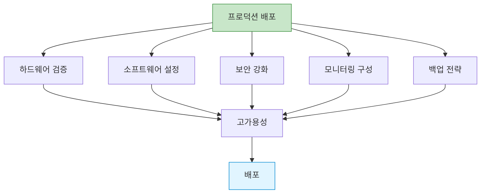
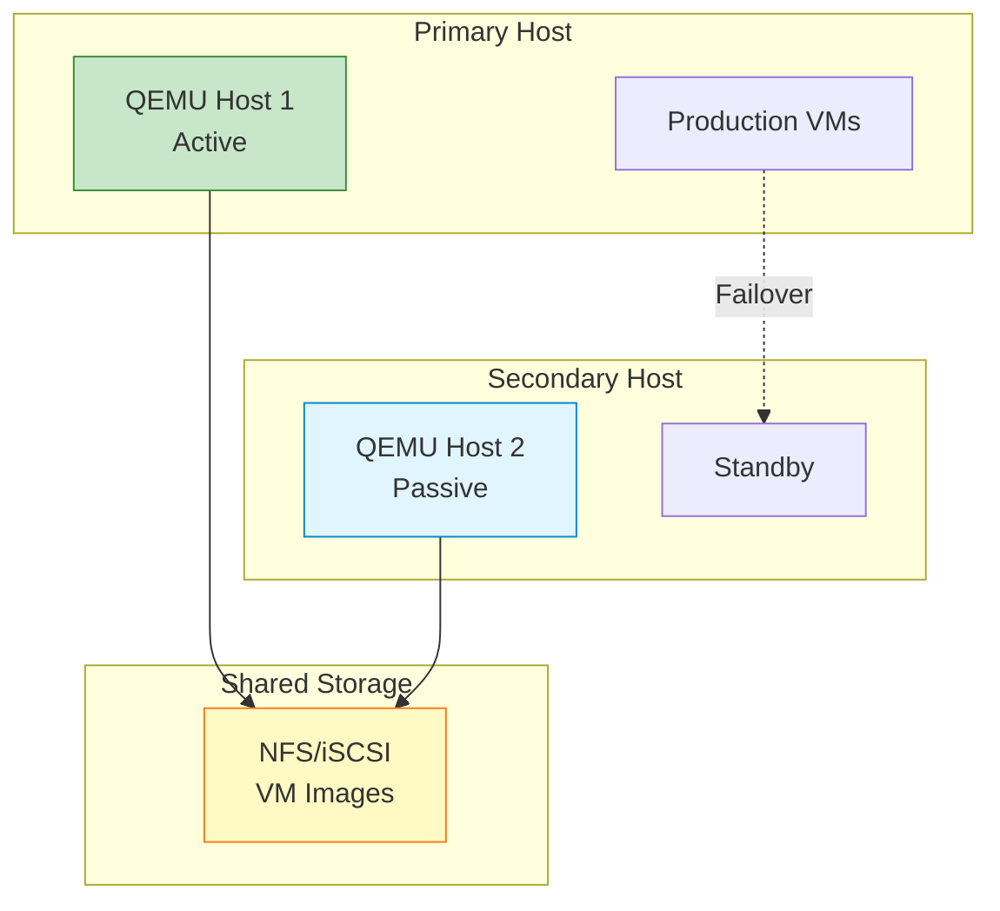

## 들어가며

QEMU를 실제 프로덕션에 배포한다면? **체계적인 준비**와 **모니터링**으로 안정적인 가상화 인프라를 구축할 수 있습니다.

## 프로덕션 준비 체크리스트



### 하드웨어 요구사항

```bash
#!/bin/bash
# hardware_check.sh

echo "=== Production Hardware Check ==="

# 1. CPU 가상화 지원
echo -n "CPU Virtualization: "
if egrep -q '(vmx|svm)' /proc/cpuinfo; then
    CORES=$(nproc)
    echo "✅ Supported ($CORES cores)"
else
    echo "❌ NOT SUPPORTED - CRITICAL"
    exit 1
fi

# 2. 메모리
echo -n "Total Memory: "
TOTAL_MEM=$(free -g | awk '/^Mem:/{print $2}')
if [ $TOTAL_MEM -ge 32 ]; then
    echo "✅ ${TOTAL_MEM}GB"
else
    echo "⚠️  ${TOTAL_MEM}GB (권장: 32GB 이상)"
fi

# 3. 스토리지
echo -n "Storage: "
STORAGE=$(df -h / | awk 'NR==2{print $2}')
STORAGE_TYPE=$(lsblk -d -o name,rota | grep -v NAME | awk '{if ($2 == 0) print "SSD"; else print "HDD"}')
echo "$STORAGE ($STORAGE_TYPE)"

if [ "$STORAGE_TYPE" = "SSD" ]; then
    echo "  ✅ SSD detected (good for production)"
else
    echo "  ⚠️  HDD detected (SSD recommended)"
fi

# 4. IOMMU 지원 (PCI passthrough용)
echo -n "IOMMU: "
if dmesg | grep -q "IOMMU enabled"; then
    echo "✅ Enabled"
else
    echo "⚠️  Disabled (needed for PCI passthrough)"
fi

# 5. Huge Pages
echo -n "Huge Pages: "
HP=$(grep HugePages_Total /proc/meminfo | awk '{print $2}')
if [ "$HP" -gt 0 ]; then
    echo "✅ Configured ($HP pages)"
else
    echo "⚠️  Not configured (recommended for performance)"
fi
```

### 소프트웨어 설정

```bash
#!/bin/bash
# software_setup.sh

set -e

echo "=== Production Software Setup ==="

# 1. QEMU/KVM 설치
echo "Installing QEMU/KVM..."
sudo apt-get update
sudo apt-get install -y \
    qemu-kvm \
    qemu-utils \
    libvirt-daemon-system \
    libvirt-clients \
    bridge-utils \
    cpu-checker

# 2. KVM 확인
kvm-ok

# 3. 사용자 권한
echo "Setting up user permissions..."
sudo usermod -a -G kvm,libvirt $USER

# 4. Huge Pages 설정
echo "Configuring Huge Pages..."
TOTAL_MEM_GB=$(free -g | awk '/^Mem:/{print $2}')
HP_2MB=$((TOTAL_MEM_GB * 512))  # 절반을 Huge Pages로

sudo sysctl vm.nr_hugepages=$HP_2MB
echo "vm.nr_hugepages=$HP_2MB" | sudo tee -a /etc/sysctl.conf

# 5. 네트워크 브리지
echo "Setting up network bridge..."
cat > /tmp/br0.yaml << EOF
network:
  version: 2
  ethernets:
    enp0s3:
      dhcp4: no
  bridges:
    br0:
      interfaces: [enp0s3]
      dhcp4: yes
EOF

sudo cp /tmp/br0.yaml /etc/netplan/01-br0.yaml
sudo netplan apply

# 6. 시스템 튜닝
echo "Tuning system parameters..."
cat > /tmp/qemu-tuning.conf << EOF
# I/O 스케줄러 (SSD용)
ACTION=="add|change", KERNEL=="sd[a-z]", ATTR{queue/rotational}=="0", ATTR{queue/scheduler}="none"

# KVM 성능
vm.swappiness=10
vm.dirty_ratio=10
vm.dirty_background_ratio=5
EOF

sudo cp /tmp/qemu-tuning.conf /etc/sysctl.d/99-qemu.conf
sudo sysctl -p /etc/sysctl.d/99-qemu.conf

echo "✅ Software setup complete"
```

## 고가용성 구성

### Active-Passive HA



### Pacemaker + DRBD 구성

```bash
# 1. DRBD 설치 (공유 스토리지 미사용 시)
sudo apt-get install -y drbd-utils

# 2. DRBD 설정
cat > /etc/drbd.d/r0.res << EOF
resource r0 {
  protocol C;
  device /dev/drbd0;
  disk /dev/sdb1;
  meta-disk internal;

  on host1 {
    address 192.168.1.10:7789;
  }

  on host2 {
    address 192.168.1.20:7789;
  }
}
EOF

# 3. DRBD 초기화
sudo drbdadm create-md r0
sudo drbdadm up r0

# Primary에서
sudo drbdadm primary --force r0
sudo mkfs.ext4 /dev/drbd0

# 4. Pacemaker 설치
sudo apt-get install -y pacemaker corosync pcs

# 5. Cluster 구성
sudo pcs cluster auth host1 host2
sudo pcs cluster setup --name ha-cluster host1 host2
sudo pcs cluster start --all
sudo pcs cluster enable --all

# 6. QEMU 리소스 추가
sudo pcs resource create vm-service ocf:heartbeat:VirtualDomain \
    config=/etc/libvirt/qemu/production-vm.xml \
    op monitor interval=30s
```

### Keepalived를 통한 VIP

```bash
# keepalived.conf (Host 1)
vrrp_instance VI_1 {
    state MASTER
    interface eth0
    virtual_router_id 51
    priority 100
    advert_int 1

    authentication {
        auth_type PASS
        auth_pass secret123
    }

    virtual_ipaddress {
        192.168.1.100/24
    }

    notify_master "/usr/local/bin/vm_failover.sh master"
    notify_backup "/usr/local/bin/vm_failover.sh backup"
}
```

```bash
#!/bin/bash
# vm_failover.sh

STATE=$1

if [ "$STATE" = "master" ]; then
    echo "Becoming MASTER - Starting VMs"

    # VMs 시작
    for vm in web1 db1 cache1; do
        virsh start $vm
    done

elif [ "$STATE" = "backup" ]; then
    echo "Becoming BACKUP - Stopping VMs"

    # VMs 중지
    for vm in web1 db1 cache1; do
        virsh shutdown $vm
    done
fi
```

## 모니터링 및 알림

### Prometheus + Grafana

```yaml
# prometheus.yml
global:
  scrape_interval: 15s

scrape_configs:
  - job_name: 'qemu_exporter'
    static_configs:
      - targets: ['localhost:9100']

  - job_name: 'libvirt_exporter'
    static_configs:
      - targets: ['localhost:9177']
```

```bash
# libvirt exporter 설치
wget https://github.com/alekseybb197/libvirt_exporter_improved/releases/download/v1.0.0/libvirt_exporter
chmod +x libvirt_exporter

# 실행
./libvirt_exporter --web.listen-address=:9177
```

### 커스텀 모니터링 스크립트

```python
#!/usr/bin/env python3
# production_monitor.py

import libvirt
import psutil
import smtplib
from email.mime.text import MIMEText
import time
import logging

logging.basicConfig(
    level=logging.INFO,
    format='%(asctime)s - %(levelname)s - %(message)s',
    handlers=[
        logging.FileHandler('/var/log/qemu-monitor.log'),
        logging.StreamHandler()
    ]
)

class ProductionMonitor:
    def __init__(self):
        self.conn = libvirt.open('qemu:///system')
        self.alerts = []

    def check_vm_health(self):
        """VM 상태 확인"""
        domains = self.conn.listAllDomains()

        for domain in domains:
            name = domain.name()

            # 실행 중이어야 하는 VM이 중지됨
            if not domain.isActive():
                self.alert(f"CRITICAL: VM {name} is not running!")
                continue

            # CPU 사용률
            info = domain.info()
            cpu_time = info[4]

            # 메모리 사용률
            mem_total = info[1]
            mem_used = info[2]
            mem_percent = (mem_used / mem_total) * 100

            if mem_percent > 90:
                self.alert(f"WARNING: VM {name} memory usage: {mem_percent:.1f}%")

            logging.info(f"VM {name}: Memory {mem_percent:.1f}%")

    def check_host_resources(self):
        """호스트 리소스 확인"""
        cpu_percent = psutil.cpu_percent(interval=1)
        mem = psutil.virtual_memory()

        if cpu_percent > 80:
            self.alert(f"WARNING: Host CPU usage: {cpu_percent}%")

        if mem.percent > 85:
            self.alert(f"WARNING: Host memory usage: {mem.percent}%")

        logging.info(f"Host: CPU {cpu_percent}%, Memory {mem.percent}%")

    def check_storage(self):
        """스토리지 확인"""
        for part in psutil.disk_partitions():
            usage = psutil.disk_usage(part.mountpoint)

            if usage.percent > 85:
                self.alert(f"WARNING: Disk {part.mountpoint} usage: {usage.percent}%")

    def alert(self, message):
        """알림 발송"""
        logging.error(message)
        self.alerts.append(message)

    def send_alerts(self):
        """이메일 알림 발송"""
        if not self.alerts:
            return

        msg = MIMEText('\n'.join(self.alerts))
        msg['Subject'] = f'QEMU Alert: {len(self.alerts)} issues detected'
        msg['From'] = 'qemu-monitor@example.com'
        msg['To'] = 'admin@example.com'

        try:
            s = smtplib.SMTP('localhost')
            s.send_message(msg)
            s.quit()
            logging.info(f"Alert email sent: {len(self.alerts)} issues")
        except Exception as e:
            logging.error(f"Failed to send alert: {e}")

        self.alerts = []

    def run(self):
        """모니터링 루프"""
        while True:
            try:
                self.check_vm_health()
                self.check_host_resources()
                self.check_storage()
                self.send_alerts()
            except Exception as e:
                logging.error(f"Monitoring error: {e}")

            time.sleep(60)  # 1분마다

if __name__ == '__main__':
    monitor = ProductionMonitor()
    monitor.run()
```

### systemd 서비스

```ini
# /etc/systemd/system/qemu-monitor.service
[Unit]
Description=QEMU Production Monitor
After=libvirtd.service

[Service]
Type=simple
User=root
ExecStart=/usr/local/bin/production_monitor.py
Restart=always
RestartSec=10

[Install]
WantedBy=multi-user.target
```

```bash
# 서비스 활성화
sudo systemctl enable qemu-monitor
sudo systemctl start qemu-monitor
sudo systemctl status qemu-monitor
```

## 백업 전략

### 자동 백업 스크립트

```bash
#!/bin/bash
# backup_vms.sh

BACKUP_DIR="/backup/vms"
RETENTION_DAYS=7
DATE=$(date +%Y%m%d_%H%M%S)

mkdir -p "$BACKUP_DIR"

echo "=== VM Backup Started: $DATE ==="

# 실행 중인 모든 VM
for vm in $(virsh list --name); do
    echo "Backing up VM: $vm"

    # 1. 스냅샷 생성
    virsh snapshot-create-as --domain "$vm" \
        --name "backup-$DATE" \
        --description "Automatic backup" \
        --atomic

    # 2. VM 디스크 경로 확인
    DISK=$(virsh domblklist "$vm" | grep vda | awk '{print $2}')

    # 3. 백업 (증분)
    if [ ! -f "$BACKUP_DIR/${vm}-base.qcow2" ]; then
        # 첫 백업: 전체 복사
        qemu-img convert -O qcow2 -c "$DISK" "$BACKUP_DIR/${vm}-base.qcow2"
        echo "  Base backup created"
    else
        # 증분 백업
        qemu-img create -f qcow2 \
            -b "$BACKUP_DIR/${vm}-base.qcow2" \
            -F qcow2 \
            "$BACKUP_DIR/${vm}-${DATE}.qcow2"

        # 변경사항 복사
        qemu-img convert -O qcow2 "$DISK" "$BACKUP_DIR/${vm}-${DATE}.qcow2"
        echo "  Incremental backup created"
    fi

    # 4. 스냅샷 삭제
    virsh snapshot-delete --domain "$vm" --snapshotname "backup-$DATE"
done

# 오래된 백업 삭제
echo "Cleaning old backups (older than $RETENTION_DAYS days)..."
find "$BACKUP_DIR" -name "*.qcow2" -mtime +$RETENTION_DAYS -delete

echo "=== Backup Completed ==="
```

### Cron 설정

```bash
# 매일 새벽 2시에 백업
0 2 * * * /usr/local/bin/backup_vms.sh >> /var/log/vm-backup.log 2>&1
```

## 보안 강화

### Production 보안 체크리스트

```bash
#!/bin/bash
# security_hardening.sh

echo "=== Security Hardening ==="

# 1. seccomp 활성화
echo "Enabling seccomp for all VMs..."
for vm in $(virsh list --name); do
    virsh dumpxml "$vm" > /tmp/${vm}.xml

    # seccomp 추가 (없으면)
    if ! grep -q "seccomp" /tmp/${vm}.xml; then
        sed -i '/<\/features>/i\    <seccomp>yes</seccomp>' /tmp/${vm}.xml
        virsh define /tmp/${vm}.xml
        echo "  ✅ $vm: seccomp enabled"
    fi
done

# 2. AppArmor/SELinux 확인
if command -v aa-status &> /dev/null; then
    echo "AppArmor status:"
    aa-status | grep qemu
fi

# 3. 방화벽 설정
echo "Configuring firewall..."
sudo ufw enable
sudo ufw allow 22/tcp
sudo ufw allow 443/tcp
# VM 전용 포트는 localhost에서만
sudo ufw allow from 127.0.0.1 to any port 5900:5999 proto tcp

# 4. 디스크 암호화
echo "Checking disk encryption..."
for vm in $(virsh list --name); do
    DISK=$(virsh domblklist "$vm" | grep vda | awk '{print $2}')

    if qemu-img info "$DISK" | grep -q "encrypted: yes"; then
        echo "  ✅ $vm: disk encrypted"
    else
        echo "  ⚠️  $vm: disk NOT encrypted"
    fi
done

# 5. 사용자 권한 최소화
echo "Checking user permissions..."
stat -c "%U %G %a" /var/lib/libvirt/images/*.qcow2

echo "=== Security hardening complete ==="
```

## 성능 튜닝

### 프로덕션 VM 템플릿

```xml
<!-- /etc/libvirt/qemu/production-template.xml -->
<domain type='kvm'>
  <name>production-vm</name>
  <memory unit='GiB'>16</memory>
  <vcpu placement='static'>8</vcpu>

  <!-- CPU 최적화 -->
  <cpu mode='host-passthrough'>
    <topology sockets='1' cores='8' threads='1'/>
    <feature policy='require' name='pdpe1gb'/>
  </cpu>

  <!-- NUMA -->
  <numatune>
    <memory mode='strict' nodeset='0'/>
  </numatune>

  <!-- 메모리 최적화 -->
  <memoryBacking>
    <hugepages/>
    <locked/>
  </memoryBacking>

  <!-- 디바이스 -->
  <devices>
    <!-- 디스크: I/O thread -->
    <disk type='file' device='disk'>
      <driver name='qemu' type='qcow2' cache='none' io='native' iothread='1'/>
      <source file='/var/lib/libvirt/images/production-vm.qcow2'/>
      <target dev='vda' bus='virtio'/>
    </disk>

    <!-- 네트워크: vhost -->
    <interface type='bridge'>
      <source bridge='br0'/>
      <model type='virtio'/>
      <driver name='vhost' queues='4'/>
    </interface>

    <!-- QMP 소켓 -->
    <qemu:commandline>
      <qemu:arg value='-qmp'/>
      <qemu:arg value='unix:/var/run/qemu/production-vm.sock,server,nowait'/>
    </qemu:commandline>
  </devices>

  <!-- I/O thread -->
  <iothreads>1</iothreads>
</domain>
```

## 배포 자동화

### Ansible Playbook

```yaml
# production-deploy.yml
---
- name: Deploy QEMU Production VMs
  hosts: hypervisors
  become: yes
  vars:
    vms:
      - name: web-prod-1
        memory: 8192
        vcpus: 4
        disk: 100
      - name: db-prod-1
        memory: 16384
        vcpus: 8
        disk: 500
      - name: cache-prod-1
        memory: 4096
        vcpus: 2
        disk: 50

  tasks:
    - name: Ensure required packages
      apt:
        name:
          - qemu-kvm
          - libvirt-daemon-system
          - python3-libvirt
        state: present

    - name: Configure huge pages
      sysctl:
        name: vm.nr_hugepages
        value: '4096'
        state: present
        reload: yes

    - name: Deploy VMs
      include_role:
        name: qemu-vm
      vars:
        vm_name: "{{ item.name }}"
        vm_memory: "{{ item.memory }}"
        vm_vcpus: "{{ item.vcpus }}"
        vm_disk_size: "{{ item.disk }}"
      loop: "{{ vms }}"

    - name: Start monitoring
      systemd:
        name: qemu-monitor
        state: started
        enabled: yes

    - name: Configure backups
      cron:
        name: "VM Backup"
        hour: "2"
        minute: "0"
        job: "/usr/local/bin/backup_vms.sh"
```

## 최종 체크리스트

```markdown
## 프로덕션 배포 체크리스트

### 사전 준비
- [ ] 하드웨어 가상화 지원 확인
- [ ] KVM 모듈 로드
- [ ] Huge Pages 설정
- [ ] 네트워크 브리지 구성
- [ ] 스토리지 준비 (SSD 권장)

### 보안
- [ ] seccomp 활성화
- [ ] AppArmor/SELinux 프로파일 적용
- [ ] 디스크 암호화
- [ ] 방화벽 설정
- [ ] 최소 권한 원칙

### 고가용성
- [ ] 이중화 호스트 구성
- [ ] 공유 스토리지 또는 DRBD
- [ ] Failover 메커니즘
- [ ] VIP 설정

### 모니터링
- [ ] VM 상태 모니터링
- [ ] 리소스 사용률 추적
- [ ] 로그 수집
- [ ] 알림 설정

### 백업
- [ ] 자동 백업 스크립트
- [ ] 백업 검증
- [ ] 복원 테스트
- [ ] 오프사이트 백업

### 성능
- [ ] CPU 피닝
- [ ] NUMA 바인딩
- [ ] I/O 스레드
- [ ] virtio 드라이버

### 문서화
- [ ] 아키텍처 문서
- [ ] 운영 매뉴얼
- [ ] 장애 대응 절차
- [ ] 연락처 목록
```

## 마치며

QEMU 시리즈를 완주하셨습니다! 이제 여러분은:

✅ QEMU의 기본 개념과 아키텍처 이해
✅ VM 생성, 관리, 최적화 능력
✅ 네트워킹, 스토리지 고급 설정
✅ 보안 강화 및 디바이스 패스스루
✅ 자동화 및 프로덕션 배포 역량

을 갖추셨습니다!

---

**시리즈 목차**
1. QEMU란 무엇인가
2. QEMU vs 다른 가상화 솔루션
3. QEMU 설치와 환경 설정
4. 첫 가상 머신 만들기
5. System vs User Mode
6. QEMU 네트워킹
7. QEMU Monitor
8. 스냅샷과 체크포인트
9. 디스크 이미지 관리
10. Live Migration
11. QEMU와 KVM 최적화
12. vCPU 설정과 성능
13. 메모리 관리와 Ballooning
14. QEMU 보안 - Sandboxing
15. USB 및 PCI 패스스루
16. QEMU 스크립트 자동화
17. QEMU와 Docker 통합
18. QEMU 클라우드 이미지 활용
19. QEMU 트러블슈팅
20. **QEMU 프로덕션 배포** ← 현재 글

> 💡 **Final Tip**: 프로덕션 환경에서는 안정성이 최우선입니다. 새로운 기능을 도입하기 전에 항상 테스트 환경에서 충분히 검증하고, 백업은 필수이며, 모니터링을 통해 문제를 조기에 발견하세요. Happy virtualizing! 🚀
