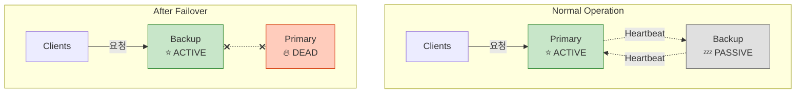
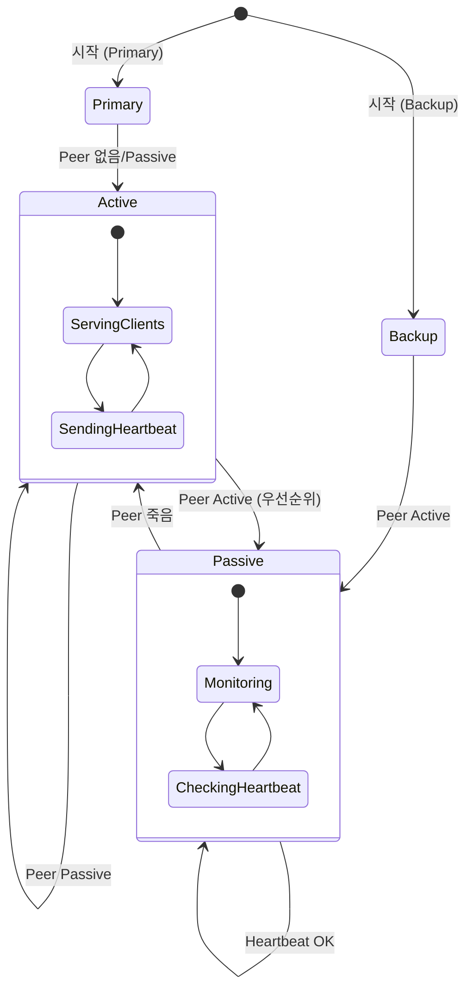
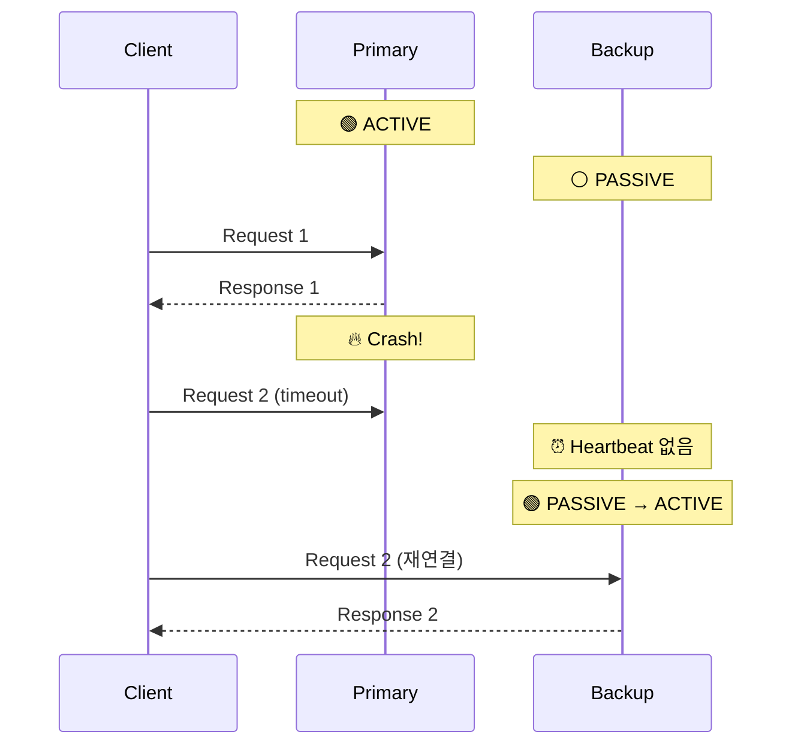

## 들어가며

**고가용성(HA, High Availability)**은 미션 크리티컬 시스템의 필수 요구사항입니다. **Binary Star 패턴**은 ZeroMQ에서 HA를 구현하는 표준 방법으로, 두 서버가 서로를 모니터링하며 **자동 장애 조치**를 수행합니다.

## Binary Star란?

### 개념

**Binary Star**는 두 개의 별처럼 **쌍(Pair)** 을 이루는 서버가 서로를 감시합니다:
- **Primary (Active)**: 실제 작업 처리
- **Backup (Passive)**: 대기 상태로 Primary 모니터링
- Primary 장애 시 → Backup이 즉시 **Active로 전환**



### 특징

- ✅ **자동 장애 조치**: Primary 죽으면 Backup이 즉시 활성화
- ✅ **무중단 서비스**: 클라이언트는 재연결만 하면 됨
- ✅ **Split-Brain 방지**: 상태 머신으로 동시 활성화 방지
- ✅ **빠른 전환**: 수초 내 복구

## 상태 머신

### Binary Star 상태



### 상태 전이 규칙

| 현재 상태 | 이벤트 | 다음 상태 |
|-----------|--------|-----------|
| **Primary** | Peer 없음 | Active |
| **Backup** | Peer Active | Passive |
| **Active** | Peer Active (우선순위 높음) | Passive |
| **Passive** | Peer Heartbeat 타임아웃 | Active |
| **Active** | Client 요청 | Active (처리) |

## C 구현

### Binary Star 서버

```c
// bstar.c - Binary Star Server
#include <zmq.h>
#include <stdio.h>
#include <stdlib.h>
#include <string.h>
#include <unistd.h>
#include <time.h>

// 상태 정의
typedef enum {
    STATE_PRIMARY = 1,
    STATE_BACKUP = 2,
    STATE_ACTIVE = 3,
    STATE_PASSIVE = 4
} state_t;

// 이벤트
typedef enum {
    EVENT_PEER_PRIMARY = 1,
    EVENT_PEER_BACKUP = 2,
    EVENT_PEER_ACTIVE = 3,
    EVENT_PEER_PASSIVE = 4,
    EVENT_CLIENT_REQUEST = 5,
    EVENT_PEER_DEAD = 6
} event_t;

typedef struct {
    state_t state;              // 현재 상태
    event_t event;              // 마지막 이벤트
    uint64_t peer_expiry;       // Peer 만료 시간
} bstar_t;

#define HEARTBEAT_INTERVAL 1000  // 1초

static const char *state_name(state_t state) {
    switch (state) {
        case STATE_PRIMARY: return "PRIMARY";
        case STATE_BACKUP: return "BACKUP";
        case STATE_ACTIVE: return "ACTIVE";
        case STATE_PASSIVE: return "PASSIVE";
        default: return "UNKNOWN";
    }
}

static state_t update_state(bstar_t *self, event_t event) {
    self->event = event;

    state_t old_state = self->state;

    // 상태 전이 로직
    switch (self->state) {
        case STATE_PRIMARY:
            if (event == EVENT_PEER_BACKUP) {
                self->state = STATE_ACTIVE;
                printf("🟢 PRIMARY → ACTIVE\n");
            } else if (event == EVENT_PEER_ACTIVE) {
                self->state = STATE_PASSIVE;
                printf("⚪ PRIMARY → PASSIVE\n");
            }
            break;

        case STATE_BACKUP:
            if (event == EVENT_PEER_PASSIVE) {
                self->state = STATE_ACTIVE;
                printf("🟢 BACKUP → ACTIVE (Peer died)\n");
            } else if (event == EVENT_PEER_ACTIVE) {
                self->state = STATE_PASSIVE;
                printf("⚪ BACKUP → PASSIVE\n");
            } else if (event == EVENT_PEER_DEAD) {
                self->state = STATE_ACTIVE;
                printf("🟢 BACKUP → ACTIVE (No peer)\n");
            }
            break;

        case STATE_ACTIVE:
            if (event == EVENT_PEER_ACTIVE) {
                // 우선순위: PRIMARY가 BACKUP보다 높음
                self->state = STATE_PASSIVE;
                printf("⚪ ACTIVE → PASSIVE (Peer has priority)\n");
            }
            break;

        case STATE_PASSIVE:
            if (event == EVENT_PEER_PRIMARY) {
                // Nothing (stay passive)
            } else if (event == EVENT_PEER_DEAD) {
                self->state = STATE_ACTIVE;
                printf("🟢 PASSIVE → ACTIVE (Peer died)\n");
            }
            break;
    }

    return self->state;
}

int main(int argc, char *argv[]) {
    if (argc < 3) {
        printf("Usage: %s <primary|backup> <peer_address>\n", argv[0]);
        return 1;
    }

    void *context = zmq_ctx_new();

    // Client facing socket
    void *frontend = zmq_socket(context, ZMQ_ROUTER);
    zmq_bind(frontend, "tcp://*:5555");

    // Peer state socket (PUB/SUB)
    void *statepub = zmq_socket(context, ZMQ_PUB);
    zmq_bind(statepub, "tcp://*:5556");

    void *statesub = zmq_socket(context, ZMQ_SUB);
    zmq_connect(statesub, argv[2]);
    zmq_setsockopt(statesub, ZMQ_SUBSCRIBE, "", 0);

    // Binary Star 초기화
    bstar_t bstar;
    if (strcmp(argv[1], "primary") == 0) {
        bstar.state = STATE_PRIMARY;
        printf("시작: PRIMARY\n");
    } else {
        bstar.state = STATE_BACKUP;
        printf("시작: BACKUP\n");
    }

    bstar.peer_expiry = time(NULL) * 1000 + 3 * HEARTBEAT_INTERVAL;

    uint64_t heartbeat_at = time(NULL) * 1000 + HEARTBEAT_INTERVAL;

    zmq_pollitem_t items[] = {
        {frontend, 0, ZMQ_POLLIN, 0},
        {statesub, 0, ZMQ_POLLIN, 0}
    };

    while (1) {
        int timeout = (int)(heartbeat_at - (time(NULL) * 1000));
        if (timeout < 0)
            timeout = 0;

        int rc = zmq_poll(items, 2, timeout);

        // Client 요청
        if (items[0].revents & ZMQ_POLLIN) {
            char identity[256], request[256];

            int size = zmq_recv(frontend, identity, 255, 0);
            zmq_recv(frontend, NULL, 0, 0);  // delimiter
            size = zmq_recv(frontend, request, 255, 0);
            request[size] = '\0';

            if (bstar.state == STATE_ACTIVE) {
                printf("✅ 처리: %s\n", request);

                zmq_send(frontend, identity, size, ZMQ_SNDMORE);
                zmq_send(frontend, "", 0, ZMQ_SNDMORE);
                zmq_send(frontend, "OK", 2, 0);

                update_state(&bstar, EVENT_CLIENT_REQUEST);
            } else {
                printf("⚠️ PASSIVE 상태 - 요청 무시\n");
            }
        }

        // Peer 상태 수신
        if (items[1].revents & ZMQ_POLLIN) {
            char state_str[32];
            int size = zmq_recv(statesub, state_str, 31, 0);
            state_str[size] = '\0';

            bstar.peer_expiry = time(NULL) * 1000 + 3 * HEARTBEAT_INTERVAL;

            state_t peer_state = atoi(state_str);
            update_state(&bstar, (event_t)peer_state);
        }

        // Peer 타임아웃 체크
        if (time(NULL) * 1000 >= bstar.peer_expiry) {
            update_state(&bstar, EVENT_PEER_DEAD);
            bstar.peer_expiry = time(NULL) * 1000 + 3 * HEARTBEAT_INTERVAL;
        }

        // Heartbeat 전송
        if (time(NULL) * 1000 >= heartbeat_at) {
            char state_msg[10];
            sprintf(state_msg, "%d", bstar.state);
            zmq_send(statepub, state_msg, strlen(state_msg), 0);

            heartbeat_at = time(NULL) * 1000 + HEARTBEAT_INTERVAL;
        }
    }

    zmq_close(frontend);
    zmq_close(statepub);
    zmq_close(statesub);
    zmq_ctx_destroy(context);
    return 0;
}
```

### Client (재연결 지원)

```c
// bstar_client.c
#include <zmq.h>
#include <stdio.h>
#include <string.h>

#define REQUEST_TIMEOUT 2500
#define REQUEST_RETRIES 3

static char *servers[] = {
    "tcp://localhost:5555",    // Primary
    "tcp://localhost:5565"     // Backup
};

int main() {
    void *context = zmq_ctx_new();
    void *client = NULL;

    int server_idx = 0;
    int retries = REQUEST_RETRIES;

    while (1) {
        if (!client) {
            client = zmq_socket(context, ZMQ_REQ);
            zmq_connect(client, servers[server_idx]);
            zmq_setsockopt(client, ZMQ_RCVTIMEO, &(int){REQUEST_TIMEOUT}, sizeof(int));

            printf("연결: %s\n", servers[server_idx]);
        }

        zmq_send(client, "REQUEST", 7, 0);

        char buffer[256];
        int size = zmq_recv(client, buffer, 255, 0);

        if (size > 0) {
            buffer[size] = '\0';
            printf("응답: %s\n", buffer);
            retries = REQUEST_RETRIES;
        } else {
            printf("⚠️ 타임아웃, 다른 서버로 전환...\n");

            zmq_close(client);
            client = NULL;

            server_idx = (server_idx + 1) % 2;  // 서버 전환
            retries--;

            if (retries == 0) {
                printf("❌ 모든 서버 응답 없음\n");
                break;
            }
        }

        sleep(1);
    }

    if (client)
        zmq_close(client);
    zmq_ctx_destroy(context);
    return 0;
}
```

## Python 구현

```python
# bstar_server.py
import zmq
import time
from enum import Enum

class State(Enum):
    PRIMARY = 1
    BACKUP = 2
    ACTIVE = 3
    PASSIVE = 4

class Event(Enum):
    PEER_PRIMARY = 1
    PEER_BACKUP = 2
    PEER_ACTIVE = 3
    PEER_PASSIVE = 4
    CLIENT_REQUEST = 5
    PEER_DEAD = 6

HEARTBEAT_INTERVAL = 1.0  # 1초

class BinaryStar:
    def __init__(self, is_primary, peer_address):
        self.context = zmq.Context()

        # Client socket
        self.frontend = self.context.socket(zmq.ROUTER)
        self.frontend.bind("tcp://*:5555" if is_primary else "tcp://*:5565")

        # Peer state exchange
        self.statepub = self.context.socket(zmq.PUB)
        self.statepub.bind("tcp://*:5556" if is_primary else "tcp://*:5566")

        self.statesub = self.context.socket(zmq.SUB)
        self.statesub.connect(peer_address)
        self.statesub.subscribe(b"")

        # Initial state
        self.state = State.PRIMARY if is_primary else State.BACKUP
        self.peer_expiry = time.time() + 3 * HEARTBEAT_INTERVAL

        print(f"Binary Star 시작: {self.state.name}")

    def update_state(self, event):
        """상태 전이"""
        old_state = self.state

        if self.state == State.PRIMARY:
            if event == Event.PEER_BACKUP:
                self.state = State.ACTIVE
            elif event == Event.PEER_ACTIVE:
                self.state = State.PASSIVE

        elif self.state == State.BACKUP:
            if event in (Event.PEER_PASSIVE, Event.PEER_DEAD):
                self.state = State.ACTIVE
            elif event == Event.PEER_ACTIVE:
                self.state = State.PASSIVE

        elif self.state == State.ACTIVE:
            if event == Event.PEER_ACTIVE:
                self.state = State.PASSIVE

        elif self.state == State.PASSIVE:
            if event == Event.PEER_DEAD:
                self.state = State.ACTIVE

        if old_state != self.state:
            print(f"🔄 {old_state.name} → {self.state.name}")

    def run(self):
        """메인 루프"""
        poller = zmq.Poller()
        poller.register(self.frontend, zmq.POLLIN)
        poller.register(self.statesub, zmq.POLLIN)

        heartbeat_at = time.time() + HEARTBEAT_INTERVAL

        while True:
            timeout = max(0, int((heartbeat_at - time.time()) * 1000))
            socks = dict(poller.poll(timeout))

            # Client 요청
            if self.frontend in socks:
                frames = self.frontend.recv_multipart()

                if self.state == State.ACTIVE:
                    print(f"✅ 처리: {frames[-1]}")
                    self.frontend.send_multipart([frames[0], b"", b"OK"])
                    self.update_state(Event.CLIENT_REQUEST)
                else:
                    print(f"⚠️ {self.state.name} - 요청 무시")

            # Peer 상태
            if self.statesub in socks:
                peer_state = int(self.statesub.recv())
                self.peer_expiry = time.time() + 3 * HEARTBEAT_INTERVAL

                peer_event = Event(peer_state)
                self.update_state(peer_event)

            # Peer 타임아웃
            if time.time() >= self.peer_expiry:
                self.update_state(Event.PEER_DEAD)
                self.peer_expiry = time.time() + 3 * HEARTBEAT_INTERVAL

            # Heartbeat 전송
            if time.time() >= heartbeat_at:
                self.statepub.send(str(self.state.value).encode())
                heartbeat_at = time.time() + HEARTBEAT_INTERVAL

if __name__ == "__main__":
    import sys

    if len(sys.argv) < 3:
        print("Usage: python bstar_server.py <primary|backup> <peer>")
        sys.exit(1)

    is_primary = sys.argv[1] == "primary"
    peer = sys.argv[2]

    server = BinaryStar(is_primary, peer)
    server.run()
```

## 실행

```bash
# Terminal 1: Primary
./bstar primary tcp://localhost:5566
# 또는
python bstar_server.py primary tcp://localhost:5566

# Terminal 2: Backup
./bstar backup tcp://localhost:5556
# 또는
python bstar_server.py backup tcp://localhost:5556

# Terminal 3: Client
./bstar_client
```

### 장애 시나리오



## 실전 적용

### 1. 데이터베이스 HA

```python
# DB Primary-Backup
primary_db = BinaryStar(True, "tcp://backup:5566")
backup_db = BinaryStar(False, "tcp://primary:5556")
```

### 2. 메시지 브로커 HA

```python
# Majordomo Broker HA
broker_primary = MajordomoBroker()
broker_backup = MajordomoBroker()

bstar_primary = BinaryStar(True, "tcp://backup:5566")
bstar_backup = BinaryStar(False, "tcp://primary:5556")
```

### 3. 모니터링

```python
# 상태 모니터링
def monitor_ha():
    while True:
        if current_state == State.ACTIVE:
            metrics.gauge('ha.active', 1)
        else:
            metrics.gauge('ha.active', 0)

        time.sleep(1)
```

## Binary Star vs 다른 HA 패턴

| 패턴 | 복잡도 | 전환 시간 | 데이터 동기화 | 비용 |
|------|--------|-----------|---------------|------|
| **Binary Star** | ⭐⭐ | 1-3초 | 수동 | 2x 서버 |
| **Active-Active** | ⭐⭐⭐⭐ | 즉시 | 자동 | 2x 서버 + LB |
| **Raft/Paxos** | ⭐⭐⭐⭐⭐ | 1-5초 | 자동 | 3+ 서버 |

## 다음 단계

Binary Star 패턴을 마스터했습니다! 다음 글에서는:
- **ZeroMQ 모니터링** - 소켓 이벤트 추적
- 메트릭 수집
- Prometheus 통합

---

**시리즈 목차**
1-9. (이전 글들)
10. **ZeroMQ Binary Star 패턴 - 고가용성과 Active-Passive 장애 조치** ← 현재 글
11. ZeroMQ 모니터링 (다음 글)

> 💡 **Quick Tip**: Binary Star는 간단하면서도 강력한 HA 솔루션입니다. 복잡한 Raft보다 구현이 쉬워요!
