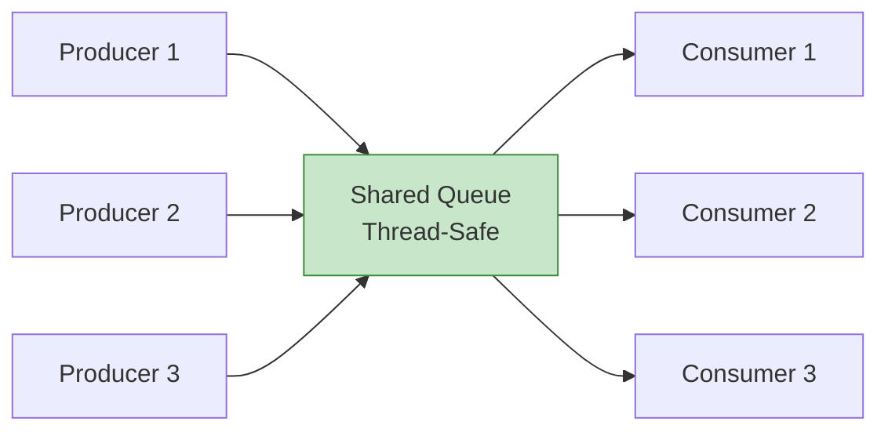
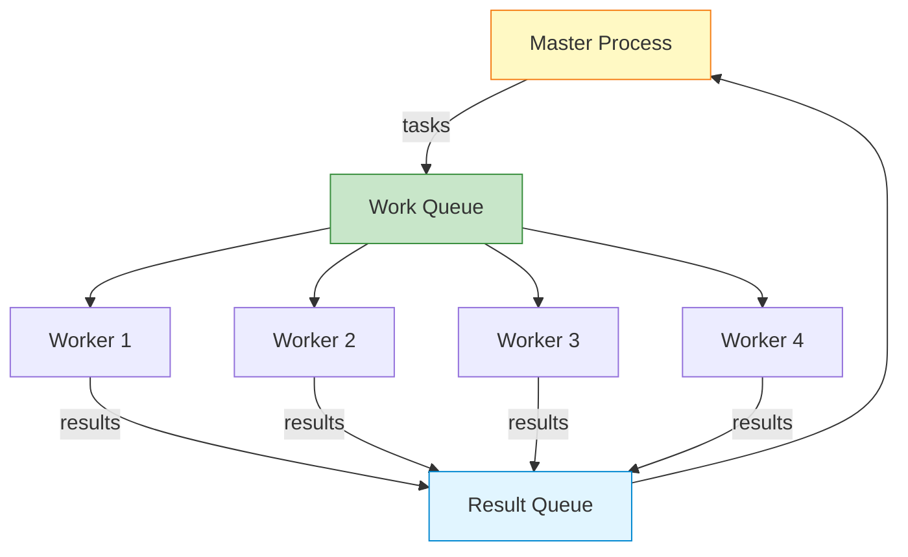
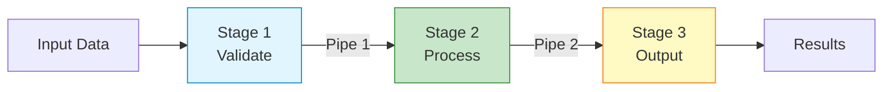
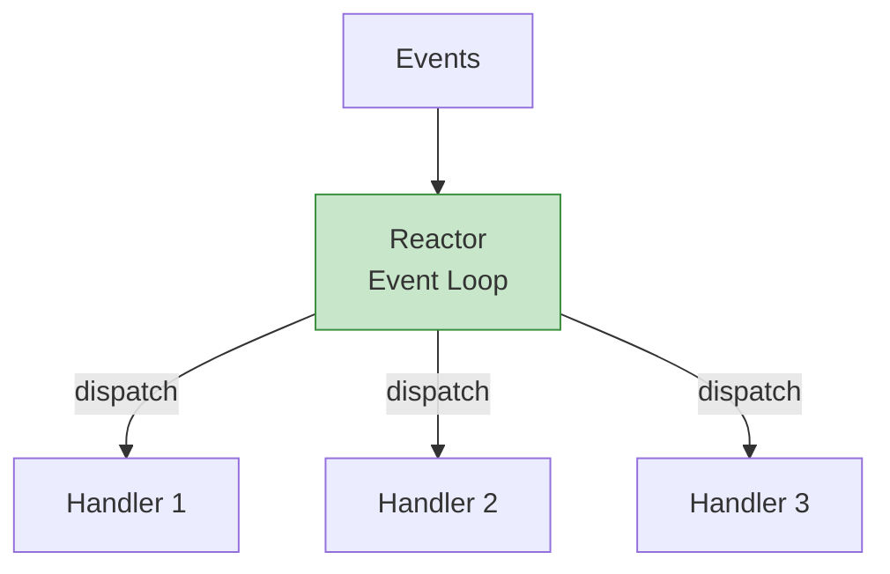
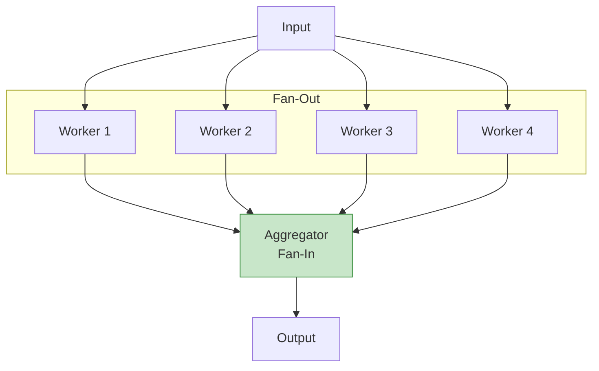

## 들어가며

**IPC 디자인 패턴**은 복잡한 멀티 프로세스 시스템을 효과적으로 구조화합니다. 검증된 패턴을 사용하면 확장성, 성능, 유지보수성을 모두 확보할 수 있습니다.

## Producer-Consumer 고급 변형

### 1. Multiple Producers, Multiple Consumers



```c
// mpmc_queue.c - Multiple Producer Multiple Consumer
#include <stdio.h>
#include <stdlib.h>
#include <pthread.h>
#include <mqueue.h>
#include <fcntl.h>
#include <unistd.h>

#define QUEUE_NAME "/mpmc_queue"
#define NUM_PRODUCERS 3
#define NUM_CONSUMERS 3
#define ITEMS_PER_PRODUCER 10

void* producer(void* arg) {
    int id = *(int*)arg;
    mqd_t mq = mq_open(QUEUE_NAME, O_WRONLY);

    for (int i = 0; i < ITEMS_PER_PRODUCER; i++) {
        char msg[64];
        snprintf(msg, sizeof(msg), "P%d:Item%d", id, i);

        mq_send(mq, msg, strlen(msg) + 1, id);  // priority = producer id
        printf("Producer %d: sent %s\n", id, msg);
        usleep(100000);
    }

    mq_close(mq);
    return NULL;
}

void* consumer(void* arg) {
    int id = *(int*)arg;
    mqd_t mq = mq_open(QUEUE_NAME, O_RDONLY);

    char buffer[64];
    int count = 0;
    int total = NUM_PRODUCERS * ITEMS_PER_PRODUCER;

    while (count < total / NUM_CONSUMERS) {
        ssize_t bytes = mq_receive(mq, buffer, sizeof(buffer), NULL);
        if (bytes > 0) {
            printf("Consumer %d: received %s\n", id, buffer);
            count++;
            usleep(150000);
        }
    }

    mq_close(mq);
    return NULL;
}

int main() {
    struct mq_attr attr = {0, 100, 64, 0};
    mqd_t mq = mq_open(QUEUE_NAME, O_CREAT | O_RDWR, 0644, &attr);
    mq_close(mq);

    pthread_t producers[NUM_PRODUCERS];
    pthread_t consumers[NUM_CONSUMERS];
    int ids[10];

    for (int i = 0; i < NUM_PRODUCERS; i++) {
        ids[i] = i + 1;
        pthread_create(&producers[i], NULL, producer, &ids[i]);
    }

    for (int i = 0; i < NUM_CONSUMERS; i++) {
        ids[i + NUM_PRODUCERS] = i + 1;
        pthread_create(&consumers[i], NULL, consumer, &ids[i + NUM_PRODUCERS]);
    }

    for (int i = 0; i < NUM_PRODUCERS; i++) {
        pthread_join(producers[i], NULL);
    }
    for (int i = 0; i < NUM_CONSUMERS; i++) {
        pthread_join(consumers[i], NULL);
    }

    mq_unlink(QUEUE_NAME);
    return 0;
}
```

### 2. Priority-Based Producer-Consumer

```c
// priority_queue.c
#include <stdio.h>
#include <stdlib.h>
#include <mqueue.h>
#include <fcntl.h>
#include <pthread.h>

#define QUEUE_NAME "/priority_queue"

typedef enum {
    PRIORITY_LOW = 0,
    PRIORITY_NORMAL = 5,
    PRIORITY_HIGH = 10,
    PRIORITY_URGENT = 15
} priority_t;

typedef struct {
    char task_name[64];
    priority_t priority;
} task_t;

void* producer(void* arg) {
    mqd_t mq = mq_open(QUEUE_NAME, O_WRONLY);

    task_t tasks[] = {
        {"일반 작업 1", PRIORITY_NORMAL},
        {"긴급 작업!", PRIORITY_URGENT},
        {"낮은 우선순위", PRIORITY_LOW},
        {"높은 우선순위", PRIORITY_HIGH},
        {"일반 작업 2", PRIORITY_NORMAL}
    };

    for (int i = 0; i < 5; i++) {
        mq_send(mq, (char*)&tasks[i], sizeof(task_t), tasks[i].priority);
        printf("Produced: %s (priority: %d)\n",
               tasks[i].task_name, tasks[i].priority);
        usleep(500000);
    }

    mq_close(mq);
    return NULL;
}

void* consumer(void* arg) {
    mqd_t mq = mq_open(QUEUE_NAME, O_RDONLY);

    for (int i = 0; i < 5; i++) {
        task_t task;
        unsigned priority;

        mq_receive(mq, (char*)&task, sizeof(task_t), &priority);
        printf("Consumed: %s (priority: %u)\n", task.task_name, priority);
        usleep(300000);
    }

    mq_close(mq);
    return NULL;
}

int main() {
    struct mq_attr attr = {0, 10, sizeof(task_t), 0};
    mqd_t mq = mq_open(QUEUE_NAME, O_CREAT | O_RDWR, 0644, &attr);
    mq_close(mq);

    pthread_t prod, cons;

    pthread_create(&prod, NULL, producer, NULL);
    pthread_create(&cons, NULL, consumer, NULL);

    pthread_join(prod, NULL);
    pthread_join(cons, NULL);

    mq_unlink(QUEUE_NAME);
    return 0;
}
```

## Master-Worker 패턴

### 아키텍처



### 구현

```c
// master_worker.c
#include <stdio.h>
#include <stdlib.h>
#include <string.h>
#include <mqueue.h>
#include <fcntl.h>
#include <unistd.h>
#include <sys/wait.h>

#define WORK_QUEUE "/work_queue"
#define RESULT_QUEUE "/result_queue"
#define NUM_WORKERS 4
#define NUM_TASKS 20

typedef struct {
    int task_id;
    int data;
} task_t;

typedef struct {
    int task_id;
    int result;
    int worker_id;
} result_t;

void worker(int worker_id) {
    mqd_t work_q = mq_open(WORK_QUEUE, O_RDONLY);
    mqd_t result_q = mq_open(RESULT_QUEUE, O_WRONLY);

    while (1) {
        task_t task;
        ssize_t bytes = mq_receive(work_q, (char*)&task, sizeof(task_t), NULL);

        if (bytes <= 0) break;

        // 작업 처리 (예: 제곱 계산)
        result_t result;
        result.task_id = task.task_id;
        result.result = task.data * task.data;
        result.worker_id = worker_id;

        printf("Worker %d: task %d (%d) -> %d\n",
               worker_id, task.task_id, task.data, result.result);

        mq_send(result_q, (char*)&result, sizeof(result_t), 0);

        usleep(100000);  // 작업 시뮬레이션
    }

    mq_close(work_q);
    mq_close(result_q);
    exit(0);
}

void master() {
    struct mq_attr attr = {0, 100, sizeof(task_t), 0};
    mqd_t work_q = mq_open(WORK_QUEUE, O_CREAT | O_WRONLY, 0644, &attr);

    attr.mq_msgsize = sizeof(result_t);
    mqd_t result_q = mq_open(RESULT_QUEUE, O_CREAT | O_RDONLY, 0644, &attr);

    // Worker 프로세스 생성
    for (int i = 0; i < NUM_WORKERS; i++) {
        if (fork() == 0) {
            worker(i + 1);
        }
    }

    // 작업 배포
    printf("=== Master: 작업 배포 시작 ===\n");
    for (int i = 0; i < NUM_TASKS; i++) {
        task_t task = {i + 1, i + 1};
        mq_send(work_q, (char*)&task, sizeof(task_t), 0);
    }

    // 결과 수집
    printf("\n=== Master: 결과 수집 시작 ===\n");
    for (int i = 0; i < NUM_TASKS; i++) {
        result_t result;
        mq_receive(result_q, (char*)&result, sizeof(result_t), NULL);
        printf("Master: task %d completed by worker %d, result = %d\n",
               result.task_id, result.worker_id, result.result);
    }

    // Worker 종료 대기
    for (int i = 0; i < NUM_WORKERS; i++) {
        wait(NULL);
    }

    mq_close(work_q);
    mq_close(result_q);
    mq_unlink(WORK_QUEUE);
    mq_unlink(RESULT_QUEUE);
}

int main() {
    master();
    return 0;
}
```

## Pipeline 패턴

### 3단계 파이프라인



### 구현

```c
// pipeline.c
#include <stdio.h>
#include <stdlib.h>
#include <string.h>
#include <unistd.h>
#include <sys/wait.h>

#define BUFFER_SIZE 256

// Stage 1: Input 검증
void stage1_validate(int input_fd, int output_fd) {
    char buffer[BUFFER_SIZE];

    close(input_fd);  // 사용하지 않음

    while (fgets(buffer, BUFFER_SIZE, stdin) != NULL) {
        // 빈 줄 필터링
        if (buffer[0] != '\n') {
            printf("[Stage 1] Validated: %s", buffer);
            write(output_fd, buffer, strlen(buffer));
        }
    }

    close(output_fd);
    exit(0);
}

// Stage 2: 데이터 처리 (대문자 변환)
void stage2_process(int input_fd, int output_fd) {
    char buffer[BUFFER_SIZE];
    ssize_t n;

    while ((n = read(input_fd, buffer, BUFFER_SIZE)) > 0) {
        // 대문자 변환
        for (int i = 0; i < n; i++) {
            if (buffer[i] >= 'a' && buffer[i] <= 'z') {
                buffer[i] -= 32;
            }
        }

        printf("[Stage 2] Processed: %.*s", (int)n, buffer);
        write(output_fd, buffer, n);
    }

    close(input_fd);
    close(output_fd);
    exit(0);
}

// Stage 3: 출력
void stage3_output(int input_fd, int output_fd) {
    char buffer[BUFFER_SIZE];
    ssize_t n;

    close(output_fd);  // 사용하지 않음

    while ((n = read(input_fd, buffer, BUFFER_SIZE)) > 0) {
        printf("[Stage 3] Output: %.*s", (int)n, buffer);
    }

    close(input_fd);
    exit(0);
}

int main() {
    int pipe1[2], pipe2[2];

    pipe(pipe1);
    pipe(pipe2);

    // Stage 1
    if (fork() == 0) {
        close(pipe1[0]);
        close(pipe2[0]);
        close(pipe2[1]);
        stage1_validate(pipe1[0], pipe1[1]);
    }

    // Stage 2
    if (fork() == 0) {
        close(pipe1[1]);
        close(pipe2[0]);
        stage2_process(pipe1[0], pipe2[1]);
    }

    // Stage 3
    if (fork() == 0) {
        close(pipe1[0]);
        close(pipe1[1]);
        close(pipe2[1]);
        stage3_output(pipe2[0], pipe2[1]);
    }

    // 부모는 모든 파이프 닫기
    close(pipe1[0]);
    close(pipe1[1]);
    close(pipe2[0]);
    close(pipe2[1]);

    // 자식들 대기
    wait(NULL);
    wait(NULL);
    wait(NULL);

    return 0;
}
```

### 테스트

```bash
gcc -o pipeline pipeline.c

echo -e "hello\nworld\n\ntest" | ./pipeline

# 출력:
# [Stage 1] Validated: hello
# [Stage 1] Validated: world
# [Stage 1] Validated: test
# [Stage 2] Processed: HELLO
# [Stage 2] Processed: WORLD
# [Stage 2] Processed: TEST
# [Stage 3] Output: HELLO
# [Stage 3] Output: WORLD
# [Stage 3] Output: TEST
```

## Event-Driven 아키텍처

### Reactor 패턴



### 구현 (epoll 기반)

```c
// event_driven.c
#include <stdio.h>
#include <stdlib.h>
#include <string.h>
#include <unistd.h>
#include <sys/epoll.h>
#include <sys/socket.h>
#include <sys/un.h>
#include <fcntl.h>

#define MAX_EVENTS 10
#define SOCKET_PATH "/tmp/event_server"

typedef void (*event_handler_t)(int fd);

void handle_accept(int server_fd) {
    int client_fd = accept(server_fd, NULL, NULL);
    printf("New client connected: fd=%d\n", client_fd);

    // epoll에 추가는 main에서 처리
}

void handle_read(int client_fd) {
    char buffer[256];
    ssize_t n = read(client_fd, buffer, sizeof(buffer));

    if (n > 0) {
        buffer[n] = '\0';
        printf("Received from fd=%d: %s\n", client_fd, buffer);

        // Echo back
        write(client_fd, buffer, n);
    } else {
        printf("Client disconnected: fd=%d\n", client_fd);
        close(client_fd);
    }
}

int main() {
    // Server socket
    int server_fd = socket(AF_UNIX, SOCK_STREAM, 0);

    struct sockaddr_un addr = {0};
    addr.sun_family = AF_UNIX;
    strncpy(addr.sun_path, SOCKET_PATH, sizeof(addr.sun_path) - 1);

    unlink(SOCKET_PATH);
    bind(server_fd, (struct sockaddr*)&addr, sizeof(addr));
    listen(server_fd, 5);

    // Non-blocking
    fcntl(server_fd, F_SETFL, O_NONBLOCK);

    // epoll 생성
    int epoll_fd = epoll_create1(0);

    struct epoll_event ev;
    ev.events = EPOLLIN;
    ev.data.fd = server_fd;
    epoll_ctl(epoll_fd, EPOLL_CTL_ADD, server_fd, &ev);

    printf("Event-driven server started...\n");

    struct epoll_event events[MAX_EVENTS];

    while (1) {
        int nfds = epoll_wait(epoll_fd, events, MAX_EVENTS, -1);

        for (int i = 0; i < nfds; i++) {
            if (events[i].data.fd == server_fd) {
                // New connection
                int client_fd = accept(server_fd, NULL, NULL);
                printf("New client: fd=%d\n", client_fd);

                fcntl(client_fd, F_SETFL, O_NONBLOCK);

                ev.events = EPOLLIN | EPOLLET;
                ev.data.fd = client_fd;
                epoll_ctl(epoll_fd, EPOLL_CTL_ADD, client_fd, &ev);

            } else {
                // Client data
                handle_read(events[i].data.fd);
            }
        }
    }

    close(server_fd);
    close(epoll_fd);
    unlink(SOCKET_PATH);

    return 0;
}
```

## Fan-Out / Fan-In 패턴



## 패턴 선택 가이드

### 의사결정 매트릭스

| 패턴 | 사용 시기 | 장점 | 단점 |
|------|----------|------|------|
| **Producer-Consumer** | 비동기 처리, 속도 차이 | 디커플링, 버퍼링 | 복잡도 |
| **Master-Worker** | 병렬 작업 분산 | 확장성, 부하 분산 | 중앙 집중 |
| **Pipeline** | 순차 단계 처리 | 처리량 향상 | 레이턴시 증가 |
| **Event-Driven** | I/O 많은 서버 | 확장성, 효율성 | 복잡도 높음 |
| **Fan-Out/Fan-In** | 집계 작업 | 병렬성 최대화 | 동기화 필요 |

## 다음 단계

고급 IPC 패턴을 마스터했습니다! 다음 글에서는:
- **언어 간 IPC** - C/C++, Python, Go 간 통신
- 직렬화 문제
- 크로스 플랫폼 호환성

---

**시리즈 목차**
16. **고급 IPC 패턴** ← 현재 글
17. 언어 간 IPC (다음 글)

> 💡 **Quick Tip**: Master-Worker는 CPU 집약적 작업에, Event-Driven은 I/O 집약적 작업에 최적입니다. 복잡한 시스템은 여러 패턴을 조합하세요!
