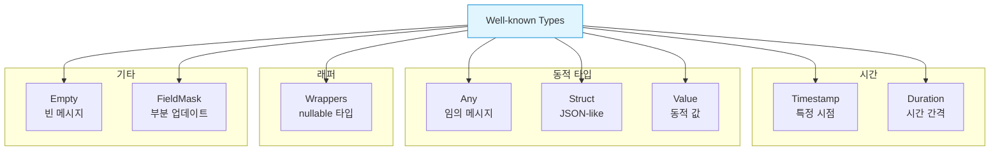
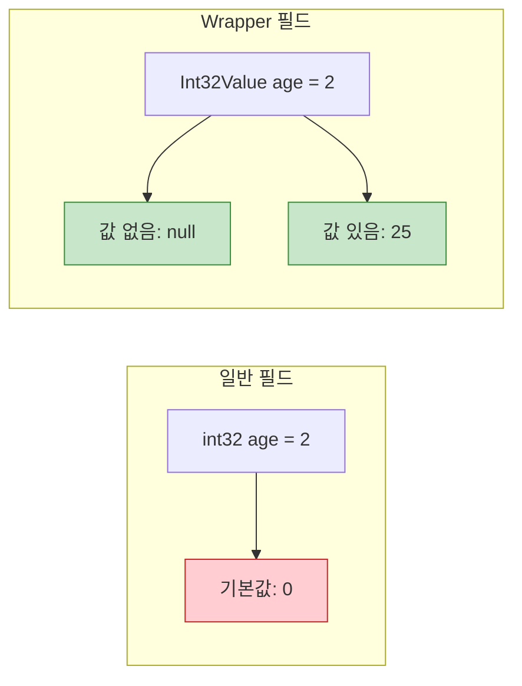
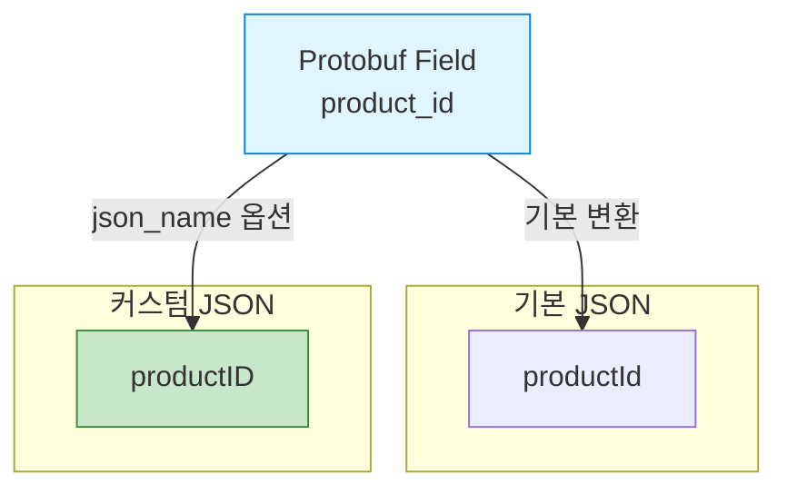

## 들어가며

Proto3는 강력한 고급 기능들을 제공합니다. Maps, Well-known Types, 옵션 시스템을 마스터하면 더욱 효율적인 스키마를 설계할 수 있습니다.

## Maps와 Repeated Fields

### Maps 기본

**Maps**는 키-값 쌍의 컬렉션을 표현합니다.

```protobuf
syntax = "proto3";

message User {
  string name = 1;
  map<string, string> attributes = 2;
  map<int32, PhoneNumber> phone_numbers = 3;
}

message PhoneNumber {
  string number = 1;
  string type = 2;
}
```

### Maps의 내부 구조

```mermaid
graph TB
    subgraph "Map 내부 표현"
        Map[map&lt;string, int32&gt;]
        Repeated[repeated MapEntry]
        Entry1[Entry {key, value}]
        Entry2[Entry {key, value}]
    end

    Map -->|컴파일시 변환| Repeated
    Repeated --> Entry1
    Repeated --> Entry2

    style Map fill:#e1f5ff,stroke:#0288d1
    style Repeated fill:#fff3e0,stroke:#f57c00
```

실제로는 다음과 같이 변환됩니다:

```protobuf
message User {
  repeated MapFieldEntry attributes = 2;

  message MapFieldEntry {
    string key = 1;
    string value = 2;
  }
}
```

### Maps 사용 예제

**C++ 예제**:

```cpp
#include "user.pb.h"
#include <iostream>

int main() {
    User user;
    user.set_name("Alice");

    // Map에 데이터 추가
    (*user.mutable_attributes())["role"] = "admin";
    (*user.mutable_attributes())["department"] = "engineering";
    (*user.mutable_attributes())["level"] = "senior";

    // Map 읽기
    for (const auto& pair : user.attributes()) {
        std::cout << pair.first << ": " << pair.second << std::endl;
    }

    // 특정 키 확인
    auto it = user.attributes().find("role");
    if (it != user.attributes().end()) {
        std::cout << "Role: " << it->second << std::endl;
    }

    return 0;
}
```

**Python 예제**:

```python
from user_pb2 import User

user = User()
user.name = "Alice"

# Map에 데이터 추가
user.attributes["role"] = "admin"
user.attributes["department"] = "engineering"
user.attributes["level"] = "senior"

# Map 읽기
for key, value in user.attributes.items():
    print(f"{key}: {value}")

# 특정 키 확인
if "role" in user.attributes:
    print(f"Role: {user.attributes['role']}")
```

**Go 예제**:

```go
package main

import (
    "fmt"
    pb "path/to/user"
)

func main() {
    user := &pb.User{
        Name: "Alice",
        Attributes: map[string]string{
            "role":       "admin",
            "department": "engineering",
            "level":      "senior",
        },
    }

    // Map 읽기
    for key, value := range user.Attributes {
        fmt.Printf("%s: %s\n", key, value)
    }

    // 특정 키 확인
    if role, ok := user.Attributes["role"]; ok {
        fmt.Printf("Role: %s\n", role)
    }
}
```

### Maps 제약사항

| 제약 | 설명 |
|------|------|
| **키 타입** | int32, int64, uint32, uint64, sint32, sint64, fixed32, fixed64, sfixed32, sfixed64, bool, string만 가능 |
| **값 타입** | 모든 타입 가능 (메시지 포함) |
| **순서** | 보장되지 않음 |
| **repeated** | map 필드를 repeated로 만들 수 없음 |

### Repeated Fields 고급

```protobuf
message Product {
  string name = 1;
  repeated string tags = 2;
  repeated Review reviews = 3;
}

message Review {
  string author = 1;
  int32 rating = 2;
  string comment = 3;
}
```

**C++ Repeated 조작**:

```cpp
Product product;
product.set_name("Laptop");

// 추가
product.add_tags("electronics");
product.add_tags("portable");

// 접근
for (int i = 0; i < product.tags_size(); i++) {
    std::cout << product.tags(i) << std::endl;
}

// 수정
product.set_tags(0, "computer");

// 삭제 (마지막 요소)
product.mutable_tags()->RemoveLast();

// 전체 삭제
product.clear_tags();

// Reserve (성능 최적화)
product.mutable_tags()->Reserve(100);
```

**Python Repeated 조작**:

```python
product = Product()
product.name = "Laptop"

# 추가
product.tags.append("electronics")
product.tags.extend(["portable", "computer"])

# 접근
for tag in product.tags:
    print(tag)

# 수정
product.tags[0] = "computer"

# 삭제
del product.tags[0]
product.tags.pop()

# 전체 삭제
del product.tags[:]
```

## Well-known Types

**Well-known Types**는 Google이 제공하는 공통 타입들입니다.



### 1. Timestamp

UTC 기준 시각을 표현합니다.

```protobuf
syntax = "proto3";

import "google/protobuf/timestamp.proto";

message Event {
  string name = 1;
  google.protobuf.Timestamp created_at = 2;
  google.protobuf.Timestamp updated_at = 3;
}
```

**C++ 사용**:

```cpp
#include <google/protobuf/timestamp.pb.h>
#include <google/protobuf/util/time_util.h>
#include "event.pb.h"

using google::protobuf::util::TimeUtil;

int main() {
    Event event;
    event.set_name("Conference");

    // 현재 시간 설정
    auto* timestamp = event.mutable_created_at();
    *timestamp = TimeUtil::GetCurrentTime();

    // 특정 시간 설정 (2025-02-04 10:30:00 UTC)
    *event.mutable_updated_at() =
        TimeUtil::SecondsToTimestamp(1738668600);

    // 읽기
    std::cout << "Created: "
              << TimeUtil::ToString(event.created_at())
              << std::endl;

    return 0;
}
```

**Python 사용**:

```python
from google.protobuf.timestamp_pb2 import Timestamp
from event_pb2 import Event
from datetime import datetime

event = Event()
event.name = "Conference"

# 현재 시간 설정
event.created_at.GetCurrentTime()

# datetime에서 변환
dt = datetime(2025, 2, 4, 10, 30, 0)
event.updated_at.FromDatetime(dt)

# 읽기
print(f"Created: {event.created_at.ToDatetime()}")
print(f"Updated: {event.updated_at.ToJsonString()}")
```

**Go 사용**:

```go
import (
    "time"
    "google.golang.org/protobuf/types/known/timestamppb"
    pb "path/to/event"
)

func main() {
    event := &pb.Event{
        Name:      "Conference",
        CreatedAt: timestamppb.Now(),
        UpdatedAt: timestamppb.New(time.Date(2025, 2, 4, 10, 30, 0, 0, time.UTC)),
    }

    // 읽기
    fmt.Println("Created:", event.CreatedAt.AsTime())
}
```

### 2. Duration

시간 간격을 표현합니다.

```protobuf
import "google/protobuf/duration.proto";

message Task {
  string name = 1;
  google.protobuf.Duration timeout = 2;
  google.protobuf.Duration estimated_time = 3;
}
```

**C++ 예제**:

```cpp
#include <google/protobuf/duration.pb.h>
#include <google/protobuf/util/time_util.h>

using google::protobuf::util::TimeUtil;

Task task;
task.set_name("Build");

// 30분 설정
*task.mutable_timeout() = TimeUtil::MinutesToDuration(30);

// 2시간 30분
*task.mutable_estimated_time() = TimeUtil::SecondsToDuration(9000);

// 읽기
int64_t seconds = TimeUtil::DurationToSeconds(task.timeout());
std::cout << "Timeout: " << seconds << " seconds" << std::endl;
```

**Python 예제**:

```python
from google.protobuf.duration_pb2 import Duration
from task_pb2 import Task

task = Task()
task.name = "Build"

# 30분 설정
task.timeout.seconds = 1800

# 2시간 30분
task.estimated_time.FromTimedelta(timedelta(hours=2, minutes=30))

# 읽기
print(f"Timeout: {task.timeout.ToTimedelta()}")
```

### 3. Any

임의의 메시지 타입을 저장합니다.

```protobuf
import "google/protobuf/any.proto";

message ErrorLog {
  string message = 1;
  google.protobuf.Any details = 2;
}

message NetworkError {
  string host = 1;
  int32 port = 2;
}

message DatabaseError {
  string query = 1;
  string error_code = 2;
}
```

**C++ 예제**:

```cpp
#include <google/protobuf/any.pb.h>

ErrorLog log;
log.set_message("Connection failed");

// NetworkError 패킹
NetworkError net_error;
net_error.set_host("localhost");
net_error.set_port(8080);
log.mutable_details()->PackFrom(net_error);

// 언패킹
if (log.details().Is<NetworkError>()) {
    NetworkError unpacked;
    log.details().UnpackTo(&unpacked);
    std::cout << "Host: " << unpacked.host() << std::endl;
}

// Type URL 확인
std::cout << "Type: " << log.details().type_url() << std::endl;
// 출력: type.googleapis.com/NetworkError
```

**Python 예제**:

```python
from google.protobuf.any_pb2 import Any
from error_log_pb2 import ErrorLog, NetworkError

log = ErrorLog()
log.message = "Connection failed"

# NetworkError 패킹
net_error = NetworkError()
net_error.host = "localhost"
net_error.port = 8080
log.details.Pack(net_error)

# 언패킹
if log.details.Is(NetworkError.DESCRIPTOR):
    unpacked = NetworkError()
    log.details.Unpack(unpacked)
    print(f"Host: {unpacked.host}")
```

### 4. Struct, Value, ListValue

JSON과 유사한 동적 데이터를 표현합니다.

```protobuf
import "google/protobuf/struct.proto";

message Config {
  string name = 1;
  google.protobuf.Struct settings = 2;
}
```

**Python 예제**:

```python
from google.protobuf.struct_pb2 import Struct
from config_pb2 import Config

config = Config()
config.name = "AppConfig"

# JSON-like 데이터 설정
config.settings.update({
    "debug": True,
    "max_connections": 100,
    "host": "localhost",
    "ports": [8080, 8081, 8082],
    "database": {
        "host": "db.example.com",
        "port": 5432
    }
})

# 읽기
print(config.settings["debug"])  # True
print(config.settings["database"]["host"])  # db.example.com
```

### 5. Wrapper Types

Nullable 원시 타입을 표현합니다.

```protobuf
import "google/protobuf/wrappers.proto";

message UserProfile {
  string name = 1;
  google.protobuf.Int32Value age = 2;  // nullable
  google.protobuf.StringValue bio = 3;  // nullable
}
```

**비교**:



**C++ 예제**:

```cpp
UserProfile profile;
profile.set_name("Alice");

// 값 설정
profile.mutable_age()->set_value(25);

// 값이 있는지 확인
if (profile.has_age()) {
    std::cout << "Age: " << profile.age().value() << std::endl;
} else {
    std::cout << "Age not set" << std::endl;
}

// 값 제거 (null로 설정)
profile.clear_age();
```

**Python 예제**:

```python
profile = UserProfile()
profile.name = "Alice"

# 값 설정
profile.age.value = 25

# 값이 있는지 확인
if profile.HasField("age"):
    print(f"Age: {profile.age.value}")
else:
    print("Age not set")
```

### Well-known Types 비교표

| 타입 | 용도 | C++ 헤더 | Python 모듈 |
|------|------|----------|-------------|
| **Timestamp** | 특정 시각 | timestamp.pb.h | timestamp_pb2 |
| **Duration** | 시간 간격 | duration.pb.h | duration_pb2 |
| **Any** | 동적 타입 | any.pb.h | any_pb2 |
| **Struct** | JSON 객체 | struct.pb.h | struct_pb2 |
| **Value** | 동적 값 | struct.pb.h | struct_pb2 |
| **Empty** | 빈 메시지 | empty.pb.h | empty_pb2 |
| **FieldMask** | 부분 업데이트 | field_mask.pb.h | field_mask_pb2 |
| **Wrappers** | Nullable 타입 | wrappers.pb.h | wrappers_pb2 |

## Field Options

필드에 메타데이터를 추가할 수 있습니다.

### 기본 옵션

```protobuf
message Product {
  // deprecated: 더 이상 사용하지 않음을 표시
  string old_name = 1 [deprecated = true];

  string name = 2;

  // packed: repeated 숫자 필드 압축 (Proto3 기본값)
  repeated int32 scores = 3 [packed = true];

  // json_name: JSON 변환시 이름 지정
  string product_id = 4 [json_name = "productID"];
}
```

### JSON 옵션 상세



**예제**:

```protobuf
message User {
  string user_id = 1 [json_name = "userID"];
  string first_name = 2 [json_name = "firstName"];
  string email_address = 3 [json_name = "email"];
}
```

**JSON 출력**:

```json
{
  "userID": "123",
  "firstName": "John",
  "email": "john@example.com"
}
```

## Custom Options

자신만의 옵션을 정의할 수 있습니다.

### Custom Option 정의

```protobuf
// options.proto
syntax = "proto3";

import "google/protobuf/descriptor.proto";

extend google.protobuf.FieldOptions {
  string validation_regex = 50000;
  int32 max_length = 50001;
  bool required = 50002;
}

extend google.protobuf.MessageOptions {
  string table_name = 50003;
}
```

### Custom Option 사용

```protobuf
// user.proto
syntax = "proto3";

import "options.proto";

message User {
  option (table_name) = "users";

  string email = 1 [
    (validation_regex) = "^[a-zA-Z0-9._%+-]+@[a-zA-Z0-9.-]+\\.[a-zA-Z]{2,}$",
    (required) = true
  ];

  string username = 2 [
    (max_length) = 20,
    (required) = true
  ];

  string bio = 3 [
    (max_length) = 500
  ];
}
```

### Runtime에서 Custom Option 읽기

**C++ 예제**:

```cpp
#include <google/protobuf/descriptor.h>
#include "user.pb.h"
#include "options.pb.h"

void printFieldOptions() {
    const auto* descriptor = User::descriptor();

    // 메시지 옵션
    const auto& msg_options = descriptor->options();
    if (msg_options.HasExtension(table_name)) {
        std::cout << "Table: "
                  << msg_options.GetExtension(table_name)
                  << std::endl;
    }

    // 필드 옵션
    for (int i = 0; i < descriptor->field_count(); i++) {
        const auto* field = descriptor->field(i);
        const auto& options = field->options();

        std::cout << "Field: " << field->name() << std::endl;

        if (options.HasExtension(required)) {
            std::cout << "  Required: "
                      << options.GetExtension(required)
                      << std::endl;
        }

        if (options.HasExtension(max_length)) {
            std::cout << "  Max Length: "
                      << options.GetExtension(max_length)
                      << std::endl;
        }

        if (options.HasExtension(validation_regex)) {
            std::cout << "  Regex: "
                      << options.GetExtension(validation_regex)
                      << std::endl;
        }
    }
}
```

**Python 예제**:

```python
from user_pb2 import User, DESCRIPTOR
import options_pb2

# 메시지 옵션
msg_descriptor = User.DESCRIPTOR
if msg_descriptor.GetOptions().HasExtension(options_pb2.table_name):
    print(f"Table: {msg_descriptor.GetOptions().Extensions[options_pb2.table_name]}")

# 필드 옵션
for field in msg_descriptor.fields:
    print(f"Field: {field.name}")

    options = field.GetOptions()
    if options.HasExtension(options_pb2.required):
        print(f"  Required: {options.Extensions[options_pb2.required]}")

    if options.HasExtension(options_pb2.max_length):
        print(f"  Max Length: {options.Extensions[options_pb2.max_length]}")
```

### Custom Option 활용 예시

**Validation 프레임워크**:

```protobuf
extend google.protobuf.FieldOptions {
  int32 min_value = 60000;
  int32 max_value = 60001;
  string pattern = 60002;
}

message CreateUserRequest {
  string username = 1 [
    (min_length) = 3,
    (max_length) = 20,
    (pattern) = "^[a-zA-Z0-9_]+$"
  ];

  int32 age = 2 [
    (min_value) = 0,
    (max_value) = 150
  ];

  string email = 3 [
    (pattern) = "^[^@]+@[^@]+\\.[^@]+$"
  ];
}
```

**ORM 매핑**:

```protobuf
extend google.protobuf.FieldOptions {
  string column_name = 70000;
  string column_type = 70001;
  bool primary_key = 70002;
  bool unique = 70003;
}

message User {
  int64 id = 1 [
    (column_name) = "user_id",
    (column_type) = "BIGINT",
    (primary_key) = true
  ];

  string email = 2 [
    (column_name) = "email_address",
    (column_type) = "VARCHAR(255)",
    (unique) = true
  ];
}
```

## 실전 예제: 종합

```protobuf
syntax = "proto3";

import "google/protobuf/timestamp.proto";
import "google/protobuf/duration.proto";
import "google/protobuf/wrappers.proto";

message Order {
  string order_id = 1 [json_name = "orderID"];

  // Map 사용
  map<string, LineItem> items = 2;

  // Well-known types
  google.protobuf.Timestamp created_at = 3;
  google.protobuf.Timestamp updated_at = 4;
  google.protobuf.Duration delivery_time = 5;

  // Wrapper (nullable)
  google.protobuf.StringValue promo_code = 6;
  google.protobuf.DoubleValue discount = 7;

  // Repeated
  repeated string tags = 8;

  OrderStatus status = 9;
}

message LineItem {
  string product_id = 1;
  int32 quantity = 2;
  double price = 3;
}

enum OrderStatus {
  ORDER_STATUS_UNKNOWN = 0;
  ORDER_STATUS_PENDING = 1;
  ORDER_STATUS_CONFIRMED = 2;
  ORDER_STATUS_SHIPPED = 3;
  ORDER_STATUS_DELIVERED = 4;
}
```

**사용 예제 (Python)**:

```python
from order_pb2 import Order, LineItem, OrderStatus
from google.protobuf.timestamp_pb2 import Timestamp
from google.protobuf.duration_pb2 import Duration

order = Order()
order.order_id = "ORD-2025-001"

# Map에 아이템 추가
order.items["PROD-001"].product_id = "PROD-001"
order.items["PROD-001"].quantity = 2
order.items["PROD-001"].price = 29.99

order.items["PROD-002"].product_id = "PROD-002"
order.items["PROD-002"].quantity = 1
order.items["PROD-002"].price = 49.99

# Timestamp 설정
order.created_at.GetCurrentTime()

# Duration 설정 (2일)
order.delivery_time.FromTimedelta(timedelta(days=2))

# Nullable 필드 (프로모 코드 있을 때만)
order.promo_code.value = "SAVE20"
order.discount.value = 0.2

# Tags
order.tags.extend(["express", "gift"])

order.status = OrderStatus.ORDER_STATUS_CONFIRMED

# 직렬화
data = order.SerializeToString()
```

## 다음 단계

Proto3 고급 기능을 마스터했습니다! 다음 글에서는:
- **서비스와 RPC 정의**
- gRPC 통합
- 스트리밍 RPC

---

**시리즈 목차**
1. Protocol Buffers란 무엇인가
2. Protocol Buffers 고급 스키마 설계
3. gRPC와 Protobuf - 고성능 RPC
4. Protobuf 실전 활용 - 마이크로서비스
5. Protobuf 성능 최적화 및 Best Practices
6. **Proto3 고급 기능** ← 현재 글
7. 서비스와 RPC 정의 (다음 글)

> 💡 **Quick Tip**: Well-known Types는 언어 간 호환성이 뛰어납니다. Timestamp를 사용하면 C++의 time_t, Python의 datetime, Go의 time.Time과 자동으로 변환됩니다!
