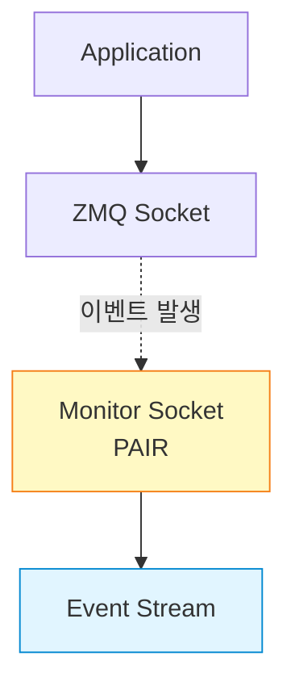
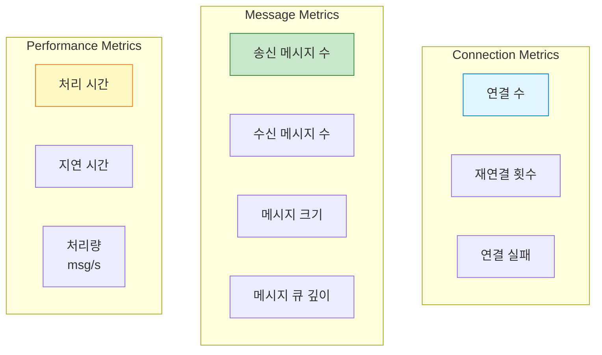
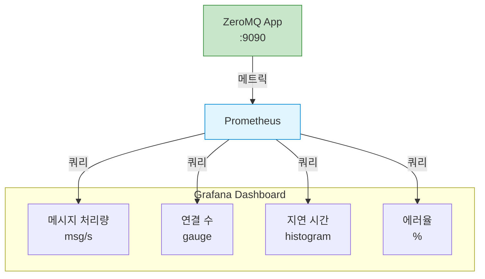

## 들어가며

**"측정할 수 없으면 개선할 수 없다"** - 프로덕션 환경에서 ZeroMQ 애플리케이션을 운영하려면 **모니터링**이 필수입니다. 소켓 이벤트, 메시지 흐름, 성능 지표를 실시간으로 추적해야 합니다.

## ZeroMQ 모니터링 기능

### Socket Monitor API

ZeroMQ는 소켓 이벤트를 모니터링하는 **내장 API**를 제공합니다.



### 모니터링 가능한 이벤트

| 이벤트 | 설명 |
|--------|------|
| **ZMQ_EVENT_CONNECTED** | 연결 성공 |
| **ZMQ_EVENT_CONNECT_DELAYED** | 연결 지연 |
| **ZMQ_EVENT_CONNECT_RETRIED** | 재연결 시도 |
| **ZMQ_EVENT_LISTENING** | bind() 완료 |
| **ZMQ_EVENT_BIND_FAILED** | bind() 실패 |
| **ZMQ_EVENT_ACCEPTED** | 연결 수락 |
| **ZMQ_EVENT_ACCEPT_FAILED** | 수락 실패 |
| **ZMQ_EVENT_CLOSED** | 소켓 종료 |
| **ZMQ_EVENT_DISCONNECTED** | 연결 끊김 |
| **ZMQ_EVENT_MONITOR_STOPPED** | 모니터 중지 |

## C 구현

### 기본 소켓 모니터링

```c
// socket_monitor.c
#include <zmq.h>
#include <stdio.h>
#include <string.h>
#include <pthread.h>

static const char *event_name(int event) {
    switch (event) {
        case ZMQ_EVENT_CONNECTED:
            return "CONNECTED";
        case ZMQ_EVENT_CONNECT_DELAYED:
            return "CONNECT_DELAYED";
        case ZMQ_EVENT_CONNECT_RETRIED:
            return "CONNECT_RETRIED";
        case ZMQ_EVENT_LISTENING:
            return "LISTENING";
        case ZMQ_EVENT_BIND_FAILED:
            return "BIND_FAILED";
        case ZMQ_EVENT_ACCEPTED:
            return "ACCEPTED";
        case ZMQ_EVENT_ACCEPT_FAILED:
            return "ACCEPT_FAILED";
        case ZMQ_EVENT_CLOSED:
            return "CLOSED";
        case ZMQ_EVENT_DISCONNECTED:
            return "DISCONNECTED";
        case ZMQ_EVENT_MONITOR_STOPPED:
            return "MONITOR_STOPPED";
        default:
            return "UNKNOWN";
    }
}

void *monitor_thread(void *arg) {
    void *context = (void *)arg;

    // Monitor socket 생성
    void *monitor = zmq_socket(context, ZMQ_PAIR);
    zmq_connect(monitor, "inproc://monitor");

    printf("🔍 Monitor 시작\n");

    while (1) {
        // 이벤트 수신
        zmq_msg_t msg;
        zmq_msg_init(&msg);

        zmq_msg_recv(&msg, monitor, 0);

        // 이벤트 헤더 파싱
        uint16_t event = *(uint16_t *)zmq_msg_data(&msg);
        uint32_t value = *(uint32_t *)((char *)zmq_msg_data(&msg) + 2);

        printf("📊 Event: %s (value: %d)\n", event_name(event), value);

        // 주소 프레임 (있으면)
        if (zmq_msg_more(&msg)) {
            zmq_msg_t addr_msg;
            zmq_msg_init(&addr_msg);
            zmq_msg_recv(&addr_msg, monitor, 0);

            char *addr = (char *)zmq_msg_data(&addr_msg);
            printf("   Address: %.*s\n", (int)zmq_msg_size(&addr_msg), addr);

            zmq_msg_close(&addr_msg);
        }

        zmq_msg_close(&msg);

        if (event == ZMQ_EVENT_MONITOR_STOPPED)
            break;
    }

    zmq_close(monitor);
    return NULL;
}

int main() {
    void *context = zmq_ctx_new();

    // 서버 소켓 생성
    void *server = zmq_socket(context, ZMQ_REP);

    // Monitor 활성화
    zmq_socket_monitor(server, "inproc://monitor", ZMQ_EVENT_ALL);

    // Monitor 스레드 시작
    pthread_t thread;
    pthread_create(&thread, NULL, monitor_thread, context);

    // Bind (LISTENING 이벤트 발생)
    printf("Binding to tcp://*:5555...\n");
    zmq_bind(server, "tcp://*:5555");

    // 메시지 처리
    while (1) {
        char buffer[256];
        int size = zmq_recv(server, buffer, 255, 0);
        buffer[size] = '\0';

        printf("수신: %s\n", buffer);
        zmq_send(server, "OK", 2, 0);
    }

    zmq_close(server);
    zmq_ctx_destroy(context);
    return 0;
}
```

### 실행 출력

```
Binding to tcp://*:5555...
🔍 Monitor 시작
📊 Event: LISTENING (value: 3)
   Address: tcp://0.0.0.0:5555
📊 Event: ACCEPTED (value: 4)
   Address: tcp://127.0.0.1:52341
📊 Event: DISCONNECTED (value: 5)
   Address: tcp://127.0.0.1:52341
```

## Python 구현

### 고급 모니터링 시스템

```python
# zmq_monitor.py
import zmq
from zmq.utils.monitor import recv_monitor_message
import threading
import time
from collections import defaultdict

class ZMQMonitor:
    """ZeroMQ Socket Monitor"""

    def __init__(self, socket, name="socket"):
        self.socket = socket
        self.name = name
        self.stats = defaultdict(int)
        self.running = True

        # Monitor 활성화
        self.monitor = socket.get_monitor_socket()

        # Monitor 스레드 시작
        self.thread = threading.Thread(target=self._monitor_loop)
        self.thread.daemon = True
        self.thread.start()

    def _monitor_loop(self):
        """Monitor 이벤트 수신"""
        while self.running:
            try:
                event = recv_monitor_message(self.monitor)

                event_type = event['event']
                event_name = zmq.EVENT_NAMES.get(event_type, 'UNKNOWN')
                endpoint = event.get('endpoint', '')
                value = event.get('value', 0)

                # 통계 업데이트
                self.stats[event_name] += 1

                print(f"[{self.name}] 📊 {event_name}: {endpoint} (value: {value})")

                # 특정 이벤트 처리
                if event_type == zmq.EVENT_CONNECTED:
                    print(f"  ✅ 연결 성공: {endpoint}")
                elif event_type == zmq.EVENT_DISCONNECTED:
                    print(f"  ⚠️ 연결 끊김: {endpoint}")
                elif event_type == zmq.EVENT_CONNECT_RETRIED:
                    print(f"  🔄 재연결 시도 #{value}: {endpoint}")
                elif event_type == zmq.EVENT_BIND_FAILED:
                    print(f"  ❌ Bind 실패: {endpoint}")

            except zmq.ZMQError as e:
                if e.errno == zmq.ETERM:
                    break
                print(f"Monitor error: {e}")

    def get_stats(self):
        """통계 반환"""
        return dict(self.stats)

    def stop(self):
        """Monitor 중지"""
        self.running = False
        self.monitor.close()

# 사용 예제
def example_usage():
    context = zmq.Context()

    # 서버 소켓
    server = context.socket(zmq.REP)
    monitor = ZMQMonitor(server, "Server")

    server.bind("tcp://*:5555")

    print("서버 시작...")

    # 메시지 처리
    for i in range(5):
        message = server.recv_string()
        print(f"수신: {message}")
        server.send_string("OK")

    # 통계 출력
    print("\n📈 통계:")
    for event, count in monitor.get_stats().items():
        print(f"  {event}: {count}")

    monitor.stop()
    server.close()
    context.term()

if __name__ == "__main__":
    example_usage()
```

## 메트릭 수집

### 수집할 주요 메트릭



### 메트릭 수집기

```python
# metrics_collector.py
import zmq
import time
from collections import deque
from dataclasses import dataclass
from typing import Dict

@dataclass
class Metrics:
    """메트릭 데이터"""
    messages_sent: int = 0
    messages_received: int = 0
    bytes_sent: int = 0
    bytes_received: int = 0
    connections: int = 0
    disconnections: int = 0
    errors: int = 0

    # 지연 시간 (최근 100개)
    latencies: deque = None

    def __post_init__(self):
        if self.latencies is None:
            self.latencies = deque(maxlen=100)

class MetricsCollector:
    """ZeroMQ 메트릭 수집"""

    def __init__(self):
        self.metrics = Metrics()
        self.start_time = time.time()

    def record_send(self, size: int):
        """송신 기록"""
        self.metrics.messages_sent += 1
        self.metrics.bytes_sent += size

    def record_receive(self, size: int):
        """수신 기록"""
        self.metrics.messages_received += 1
        self.metrics.bytes_received += size

    def record_latency(self, latency_ms: float):
        """지연 시간 기록"""
        self.metrics.latencies.append(latency_ms)

    def record_connection(self):
        """연결 기록"""
        self.metrics.connections += 1

    def record_disconnection(self):
        """연결 끊김 기록"""
        self.metrics.disconnections += 1

    def record_error(self):
        """에러 기록"""
        self.metrics.errors += 1

    def get_stats(self) -> Dict:
        """통계 계산"""
        uptime = time.time() - self.start_time

        avg_latency = (
            sum(self.metrics.latencies) / len(self.metrics.latencies)
            if self.metrics.latencies
            else 0
        )

        p95_latency = (
            sorted(self.metrics.latencies)[int(len(self.metrics.latencies) * 0.95)]
            if len(self.metrics.latencies) > 0
            else 0
        )

        return {
            'uptime_seconds': uptime,
            'messages_sent': self.metrics.messages_sent,
            'messages_received': self.metrics.messages_received,
            'bytes_sent': self.metrics.bytes_sent,
            'bytes_received': self.metrics.bytes_received,
            'throughput_msg_per_sec': self.metrics.messages_received / uptime if uptime > 0 else 0,
            'connections': self.metrics.connections,
            'disconnections': self.metrics.disconnections,
            'errors': self.metrics.errors,
            'avg_latency_ms': avg_latency,
            'p95_latency_ms': p95_latency,
        }

    def print_stats(self):
        """통계 출력"""
        stats = self.get_stats()

        print("\n" + "="*50)
        print("📊 ZeroMQ Metrics")
        print("="*50)
        print(f"Uptime:           {stats['uptime_seconds']:.1f}s")
        print(f"Messages Sent:    {stats['messages_sent']}")
        print(f"Messages Recv:    {stats['messages_received']}")
        print(f"Bytes Sent:       {stats['bytes_sent']:,}")
        print(f"Bytes Recv:       {stats['bytes_received']:,}")
        print(f"Throughput:       {stats['throughput_msg_per_sec']:.1f} msg/s")
        print(f"Connections:      {stats['connections']}")
        print(f"Disconnections:   {stats['disconnections']}")
        print(f"Errors:           {stats['errors']}")
        print(f"Avg Latency:      {stats['avg_latency_ms']:.2f} ms")
        print(f"P95 Latency:      {stats['p95_latency_ms']:.2f} ms")
        print("="*50)

# 사용 예제
def monitored_server():
    context = zmq.Context()
    server = context.socket(zmq.REP)
    server.bind("tcp://*:5555")

    collector = MetricsCollector()
    monitor = ZMQMonitor(server, "Server")

    collector.record_connection()

    print("메트릭 수집 서버 시작...")

    for i in range(10):
        start = time.time()

        message = server.recv()
        collector.record_receive(len(message))

        server.send(b"OK")
        collector.record_send(2)

        latency = (time.time() - start) * 1000
        collector.record_latency(latency)

    collector.print_stats()

    monitor.stop()
    server.close()
    context.term()
```

## Prometheus 통합

### Prometheus Exporter

```python
# prometheus_exporter.py
from prometheus_client import Counter, Gauge, Histogram, start_http_server
import zmq
import time
import threading

# Prometheus 메트릭 정의
zmq_messages_sent = Counter('zmq_messages_sent_total', 'Total messages sent')
zmq_messages_received = Counter('zmq_messages_received_total', 'Total messages received')
zmq_bytes_sent = Counter('zmq_bytes_sent_total', 'Total bytes sent')
zmq_bytes_received = Counter('zmq_bytes_received_total', 'Total bytes received')

zmq_connections = Gauge('zmq_connections', 'Current connections')
zmq_message_latency = Histogram('zmq_message_latency_seconds', 'Message latency')

class PrometheusExporter:
    """Prometheus 메트릭 Exporter"""

    def __init__(self, port=9090):
        # Prometheus HTTP 서버 시작
        start_http_server(port)
        print(f"📊 Prometheus exporter started on port {port}")

    def record_send(self, size):
        zmq_messages_sent.inc()
        zmq_bytes_sent.inc(size)

    def record_receive(self, size):
        zmq_messages_received.inc()
        zmq_bytes_received.inc(size)

    def record_connection(self):
        zmq_connections.inc()

    def record_disconnection(self):
        zmq_connections.dec()

    def observe_latency(self, latency_seconds):
        zmq_message_latency.observe(latency_seconds)

# 사용 예제
def prometheus_server():
    exporter = PrometheusExporter(port=9090)

    context = zmq.Context()
    server = context.socket(zmq.REP)
    server.bind("tcp://*:5555")

    print("서버 시작 (Prometheus: http://localhost:9090)")
    exporter.record_connection()

    while True:
        start = time.time()

        message = server.recv()
        exporter.record_receive(len(message))

        server.send(b"OK")
        exporter.record_send(2)

        latency = time.time() - start
        exporter.observe_latency(latency)

if __name__ == "__main__":
    prometheus_server()
```

### Prometheus 설정

```yaml
# prometheus.yml
scrape_configs:
  - job_name: 'zeromq'
    static_configs:
      - targets: ['localhost:9090']
    scrape_interval: 5s
```

### Grafana 대시보드



## 실전 모니터링 체크리스트

### 필수 모니터링 항목

- ✅ **연결 상태**: 활성 연결 수, 재연결 빈도
- ✅ **메시지 처리량**: 초당 메시지 수
- ✅ **지연 시간**: 평균, P95, P99
- ✅ **큐 깊이**: 밀린 메시지 수
- ✅ **에러율**: 실패한 메시지 비율
- ✅ **리소스**: CPU, 메모리 사용률

### 알림 설정

```yaml
# alerts.yml
groups:
  - name: zeromq_alerts
    rules:
      - alert: HighMessageLatency
        expr: zmq_message_latency_seconds > 1.0
        for: 5m
        annotations:
          summary: "ZeroMQ 지연 시간 높음"

      - alert: ConnectionLoss
        expr: zmq_connections == 0
        for: 1m
        annotations:
          summary: "ZeroMQ 연결 끊김"

      - alert: HighErrorRate
        expr: rate(zmq_errors_total[5m]) > 0.1
        annotations:
          summary: "ZeroMQ 에러율 높음"
```

## 다음 단계

모니터링을 마스터했습니다! 다음 글에서는:
- **ZeroMQ 디버깅** - 일반적인 문제와 해결책
- 메시지 추적
- 성능 프로파일링

---

**시리즈 목차**
1-10. (이전 글들)
11. **ZeroMQ 모니터링 - 소켓 이벤트 추적과 메트릭 수집** ← 현재 글
12. ZeroMQ 디버깅 (다음 글)

> 💡 **Quick Tip**: 프로덕션 환경에서는 항상 모니터링을 활성화하세요. 문제 발생 시 빠른 대응 가능!
